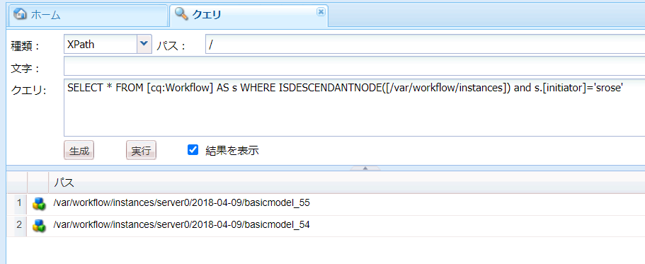
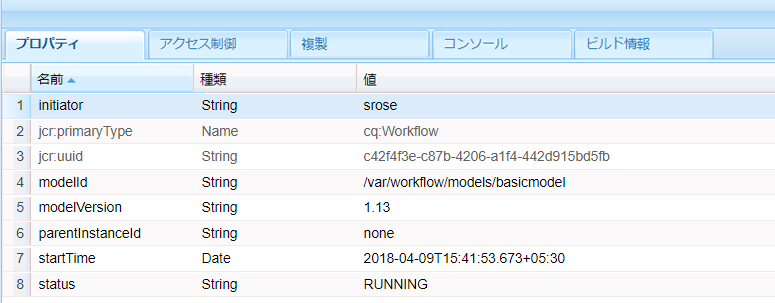
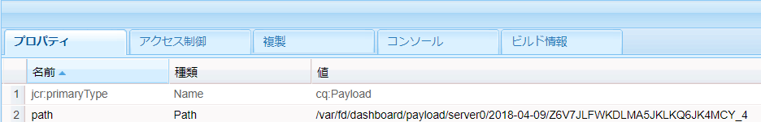

# OSGi 上の Forms 中心のワークフロー | ユーザーデータの処理 {#forms-centric-workflows-on-osgi-handling-user-data}

Forms 中心の AEM ワークフローにより、Forms 中心のビジネスプロセスを実際に自動化できます。ワークフローは、関連するワークフローモデルで指定された順序で実行される一連のステップで構成されます。各ステップで、ユーザーへのタスクの割り当てや電子メールメッセージの送信など、特定の処理が実行されます。ワークフローでは、リポジトリ内のアセット、ユーザーアカウントおよびサービスとやり取りができます。このため、ワークフローでは、Experience Manager のあらゆる側面を含む複雑なアクティビティを連携させることができます。

フォーム中心のワークフローは、次のいずれかの方法でトリガーまたは起動できます。

* AEM インボックスからのアプリケーションの送信
* AEM [!DNL Forms] アプリケーションからのアプリケーションの送信
* アダプティブフォームの送信
* 監視フォルダーの使用
* インタラクティブ通信またはレターの送信

Forms 中心の AEM ワークフローおよび機能について詳しくは、「[OSGi 上の Forms 中心のワークフロー](aem-forms-workflow.md)」を参照してください。

## ユーザーデータとデータストア {#user-data-and-data-stores}

ワークフローがトリガーされると、ワークフローインスタンスに対してペイロードが自動生成されます。各ワークフローインスタンスは、一意のインスタンス ID および関連するペイロード ID が割り当てられます。ペイロードには、ワークフローインスタンスに関連付けられたユーザーおよびフォームデータのリポジトリの場所が含まれます。さらに、ワークフローインスタンスのドラフトおよび履歴データも AEM リポジトリに格納されます。

以下に、ワークフローインスタンスのペイロード、ドラフトおよび履歴が存在するデフォルトのリポジトリの場所を示します。

>[!NOTE]
>
>ペイロード、ドラフトおよび履歴データを格納する場所は、ワークフローまたはアプリケーションの作成時に別の場所に設定できます。ワークフローまたはアプリケーションがデータを格納した場所を特定するには、そのワークフローを確認します。

<table>
 <tbody>
  <tr>
   <td> </td>
   <td><b>AEM 6.4 [!DNL Forms]</b></td>
   <td><b>AEM 6.3 [!DNL Forms]</b></td>
  </tr>
  <tr>
   <td><strong>ワークフロー インスタンス</strong></td>
   <td>/var/workflow/instances/[server_id]/&lt;date&gt;/[workflow-instance]/</td>
   <td>/etc/workflow/instances/[server_id]/[date]/[workflow-instance]/</td>
  </tr>
  <tr>
   <td><strong>ペイロード</strong></td>
   <td>/var/fd/dashboard/payload/[server_id]/[date]/  [payload-id]/</td>
   <td>/etc/fd/dashboard/payload/[server_id]/[date]/  [payload-id]/</td>
  </tr>
  <tr>
   <td><strong>ドラフト</strong></td>
   <td>/var/fd/dashboard/instances/[server_id]/  [date]/[workflow-instance]/draft/[workitem]/</td>
   <td>/etc/fd/dashboard/instances/[server_id]/  [date]/[workflow-instance]/draft/[workitem]/</td>
  </tr>
  <tr>
   <td><strong>History</strong></td>
   <td>/var/fd/dashboard/instances/[server_id]/  [date]/[workflow_instance]/history/</td>
   <td>/etc/fd/dashboard/instances/[server_id]/  [date]/[workflow_instance]/history/</td>
  </tr>
 </tbody>
</table>

## ユーザーデータへのアクセスと削除 {#access-and-delete-user-data}

リポジトリ内のワークフローインスタンスからユーザーデータにアクセスして削除することができます。これを実行するには、ユーザーに関連付けられているワークフローインスタンスのインスタンス ID が分かっている必要があります。ワークフローインスタンスのインスタンス ID は、ワークフローインスタンスを開始したユーザーのユーザー名、またはワークフローインスタンスの現在の担当者を使用して検索することができます。

ただし、以下のシナリオでは、開始者に関連付けられたワークフローを特定しても、特定することができないか、結果があいまいになる場合があります。

* **監視フォルダーを介してトリガーされたワークフロー**：ワークフローが監視フォルダーによりトリガーされた場合、そのワークフローの開始者を使用してワークフローインスタンスを特定することはできません。この場合、ユーザー情報は格納済みデータでエンコードされます。
* **AEM の公開インスタンスから開始されたワークフロー**：すべてのワークフローインスタンスは、アダプティブフォーム、インタラクティブ通信またはレターが AEM の公開インスタンスから送信されたときに、サービスユーザーを使用して作成されます。このような場合、ログインしているユーザーのユーザー名はワークフローインスタンスデータには取り込まれません。

### ユーザーデータへのアクセス {#access}

ワークフローインスタンスに格納されているユーザーデータを特定してアクセスするには、次の手順を実行します。

1. AEM オーサーインスタンスで、`https://'[server]:[port]'/crx/de` にアクセスして、**[!UICONTROL ツール／クエリ]**&#x200B;に移動します。

   「**[!UICONTROL SQL2]**」を「**[!UICONTROL タイプ]**」ドロップダウンから選択します。

1. 使用可能な情報に応じて、次のいずれかのクエリを実行します。

   * ワークフロー開始者が分かっている場合は、次のコマンドを実行します。

   `SELECT &ast; FROM [cq:Workflow] AS s WHERE ISDESCENDANTNODE([path-to-workflow-instances]) and s.[initiator]='*initiator-ID*'`

   * 検索しているデータのユーザーが現在のワークフローの担当者である場合は、次のコマンドを実行します。

   `SELECT &ast; FROM [cq:WorkItem] AS s WHERE ISDESCENDANTNODE([path-to-workflow-instances]) and s.[assignee]='*assignee-id*'`

   クエリを実行すると、指定されたワークフロー開始者また現在のワークフロー担当者のすべてのワークフローインスタンスの場所が返されます。

   例えば、次のクエリを実行すると、ワークフロー開始者が `/var/workflow/instances` の `srose` ノードから 2 つのワークフローインスタンスのパスが返されます。

   

1. クエリによって返されたワークフローインスタンスのパスに移動します。status プロパティには、ワークフローインスタンスの現在のステータスが表示されます。

   

1. ワークフローインスタンスのノードで、`data/payload/` に移動します。`path` プロパティには、ワークフローインスタンスのペイロードへのパスが格納されます。パスに移動すれば、ペイロードに格納されたデータにアクセスできます。

   

1. ワークフローインスタンスのドラフトおよび履歴の場所に移動します。

   次に例を示します。

   `/var/fd/dashboard/instances/server0/2018-04-09/_var_workflow_instances_server0_2018-04-09_basicmodel_54/draft/`

   `/var/fd/dashboard/instances/server0/2018-04-09/_var_workflow_instances_server0_2018-04-09_basicmodel_54/history/`

1. 手順 2 のクエリを実行して返されたすべてのワークフローインスタンスで手順 3 から 5 を繰り返します。

   >[!NOTE]
   >
   >AEM [!DNL Forms] アプリケーションはオフラインモードでもデータを格納します。ワークフローインスタンスのデータを個々のデバイスにローカルで格納し、サーバーとアプリケーションを同期するときに [!DNL Forms] サーバーに送信することができます。

### ユーザーデータの削除 {#delete-user-data}

次の手順を実行して、ワークフローインスタンスからユーザーデータを削除するには、AEM 管理者である必要があります。

1. 「[ユーザーデータへのアクセス](forms-workflow-osgi-handling-user-data.md#access)」の説明に従って以下をメモします。

   * ユーザーに関連付けられたワークフローインスタンスへのパス
   * ワークフローインスタンスのステータス
   * ワークフローインスタンスのペイロードへのパス
   * ワークフローインスタンスのドラフトおよび履歴へのパス

1. この手順を、**RUNNING**、**SUSPENDED**、または **STALE** ステータスにあるワークフローインスタンスに対して実行します。

   1. `https://'[server]:[port]'/aem/start.html` にアクセスして、管理者の資格情報を使用してログインします。
   1. **[!UICONTROL ツール／ワークフロー／インスタンス]**&#x200B;の順に移動します。
   1. ユーザーの関連ワークフローインスタンスを選択し、「**[!UICONTROL 終了]**」をタップして実行中のインスタンスを終了します。

      ワークフローインスタンスの操作方法について詳しくは、[ワークフローインスタンスの管理](https://experienceleague.adobe.com/docs/experience-manager-cloud-service/sites/authoring/workflows/overview.html?lang=ja#authoring)を参照してください。

1. [!DNL CRXDE Lite] コンソールにアクセスし、ワークフローインスタンスのペイロードパスに移動して、`payload` ノードを削除します。
1. ワークフローインスタンスのドラフトパスに移動して、`draft` ノードを削除します。
1. ワークフローインスタンスの履歴パスに移動して、`history` ノードを削除します。
1. ワークフローインスタンスのワークフローインスタンスパスに移動して、ワークフローの `[workflow-instance-ID]` ノードを削除します。

   >[!NOTE]
   >
   >ワークフローインスタンスノードを削除すると、すべてのワークフロー参加者のワークフローインスタンスが削除されます。

1. ユーザーに対して特定されたすべてのワークフローインスタンスで手順 2 から 6 を繰り返します。
1. ワークフロー参加者の AEM [!DNL Forms] アプリケーションの Outbox からオフラインのドラフトと送信データを特定して削除し、サーバーに送信されないようにします。

また、API を使用してノードおよびプロパティにアクセスしてこれらを削除することができます。詳しくは、次の文書を参照してください。

* [AEM JCR へのプログラムからのアクセス方法](https://experienceleague.adobe.com/docs/experience-manager-65/developing/platform/access-jcr.html?lang=ja#platform)
* [ノードおよびプロパティの削除](https://docs.adobe.com/docs/en/spec/jcr/2.0/10_Writing.html#10.9%20Removing%20Nodes%20and%20Properties)
* [API リファレンス](https://experienceleague.adobe.com/docs/experience-manager-release-information/aem-release-updates/previous-updates/aem-previous-versions.html?lang=ja)

