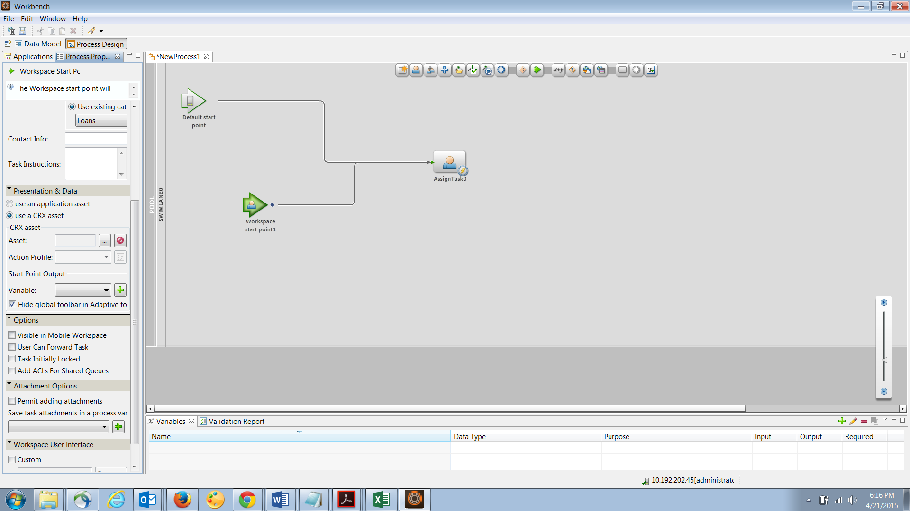

# AEM Forms におけるフォームセット{#form-set-in-aem-forms}

## 概要 {#overview}

多くの場合、顧客はサービスや特典を申請するために複数のフォームを送信しなければなりません。それに伴い、関連するすべてのフォームを見つけて、入力および送信し、各フォームを個別にトラッキングする必要があります。また、複数のフォームに同じ内容を何度も入力しなければなりません。フォームの数が多いとこのプロセスは面倒になり、間違いが起こりやすくなります。AEM Forms のフォームセット機能を利用すると、このようなシナリオのユーザーエクスペリエンスをシンプルにすることができます。

フォームセットは HTML5 フォームのコレクションであり、エンドユーザーには 1 つのフォームセットとして提供されます。エンドユーザーがフォームセットへの入力を開始すると、フォームセットは入力された内容をシームレスに別のフォームに移行します。最終的に、顧客はワンクリックですべてのフォームを送信することができます。

AEM Forms では、フォームセットを作成、設定、管理するための直感的なユーザーインターフェイスがフォーム作成者に提供されます。フォーム作成者は、エンドユーザーに入力を促したい特定の順序に、フォームの順番を並べることができます。また、各フォームに条件や適格性の式を設定し、ユーザーの入力に基づいてフォームの表示をコントロールすることもできます。例えば、婚姻区分で既婚が選ばれた場合にのみ、配偶者についての詳細フォームを表示するように設定できます。

さらに、異なるフォーム間で共通フィールドを設定して、共通データバインディングを共有することができます。データバインディングを適切に設定すると、エンドユーザーがフォーム間で共通する情報を一度入力するだけで、他のフォームで自動入力が適用されるようになります。

フォームセットは AEM Forms アプリケーションでもサポートされているので、現場で働く従業員はフォームセットをオフラインにし、顧客を訪問してデータを入力し、後で AEM Forms サーバーと同期させてフォームデータを送信することで、ビジネスプロセスを進めることができます。

## フォームセットの作成と管理 {#creating-and-managing-form-set}

複数の XDP ファイルや Designer を使用して作成したフォームテンプレートを一つのフォームセットに関連付けることができます。それから、フォームセットを使用して、ユーザーが最初にフォームに入力した値やプロフィールを基に、必要な情報のみを含む XDP ファイルを生成できます。

[AEM Forms ユーザーインターフェイス](https://experienceleague.adobe.com/en/docs/experience-manager-65/content/forms/getting-started/introduction-managing-forms)を使用して、すべてのフォームやフォームセット、および関連アセットを一元的に管理できます。

### フォームセットを管理 {#create-a-form-set}

フォームセットを作成するには、次の手順を実行します。

1. フォーム／フォームとドキュメントを選択します。
1. 作成／フォームセットを選択します。

1. プロパティを追加ページで、次の詳細を追加して「次へ」をクリックします。

   * タイトル：ドキュメントのタイトルを指定します。タイトルを指定すると、AEM Forms ユーザーインターフェイス内のフォームセットを特定しやすくなります。
   * 説明：ドキュメントに関する詳細情報を入力します。
   * タグ：フォームセットを識別するために固有のタグを指定します。タグを指定するとフォームセットを検索しやすくなります。タグを作成するには、「タグ」ボックスに新しいタグ名を入力します。
   * 送信 URL：フォームセットのスタンドアロン表示時に送信したデータが公開される URLを指定します。（AEM Forms アプリを使用しない場合）。データは、マルチパートデータまたはフォームデータとして次のリクエストパラメーターとともにこのエンドポイントに送信されます。
   * dataXML：送信したフォームセットデータの XML 表現を含むパラメーターです。フォームセットのすべてのフォームが共通のスキーマを使用している場合、スキーマごとに XML が生成されます。それ以外の場合、XML のルートタグには添付ファイルを含むフォームセットの入力済みの各フォームの子タグが含まれます。
   * formsetPath：送信された CRXDE 内のフォームセットのパス。
   * HTML レンダリングプロファイル：フローティングフィールド、添付ファイル、ドラフトサポート（スタンドアロンのフォームセットレンダリング用）などの特定のオプションを設定して、フォームセットの外観、動作および操作性などをカスタマイズできます。既存のプロファイルをカスタマイズまたは拡張して、HTML フォームのプロファイル設定を変更することができます。

   

1. フォームを選択画面には使用可能な XDP フォームまたは XDP ファイルが表示されます。フォームセットに追加するフォームを検索して選択し、「フォームセットに追加」をクリックします。必要に応じて、追加するフォームを再度検索します。フォームセットにすべてのフォームを追加したら、「次へ」をクリックします。

   >[!NOTE]
   >
   >XDP フォーム内のフィールド名にはドット（.）文字を含めないでください。ドット文字が含まれていた場合、スクリプトがそのフィールドを解決できなくなります。

1. フォームを設定のページで、次の操作を実行できます。

   * Form Order：フォームをドラッグ＆ドロップして順番を並べ替えます。このフォームの順番により、AEM Forms アプリと Stand Alone Rendition でエンドユーザーに表示されるフォームの順番が決定します。
   * フォーム識別子：適格性の式で使用するための一意の ID をフォームに設定します。
   * データルート：フォームセットの各フォームに対して、作成者は送信済みの XML で特定のフォームのデータが配置される場所を XPATH で設定できます。デフォルト値は「/」です。フォームセットにあるすべてのフォームがスキーマバインドされており、同じ XML スキーマを共有している場合、作成者はこの値を変更できます。フォーム内の各フィールドに、XDP で指定された適切なデータバインディングを持たせることをお勧めします。2 つの異なるフォームの 2 つのフィールドが共通のデータバインディングを共有している場合、2 番目のフォームのフィールドは、1 番目のフォームで取り込んだ値を事前入力した状態で表示されます。同じ内部コンテンツを持つ 2 つのサブフォームを同じ XML ノードに結合しないでください。XML の構造についての詳細は、「[フォームセットに対する XML の事前入力](https://experienceleague.adobe.com/en/docs/experience-manager-65/content/forms/html5-forms/formset-in-aem-forms#prefill-xml-for-form-set)」を参照してください。
   * 適格性の式：ブーリアンを評価し、フォームセット内のフォームが入力用に適格であるかどうかを示す JavaScript 式を指定します。この結果が「false」の場合、ユーザーは入力を要求されないか、場合によってはフォームが表示されません。この式は通常、このフォームの前に取り込まれたフィールドの値に基づいています。この式にはフォームセット API fs.valueOf に対する呼び出しも含まれており、フォームセットにあるフォームのフィールドにユーザーが入力した値を抽出します。

   *fs.valueOf(&lt;Form Identifier>, &lt;fieldSom expression>) > &lt;value>*

   例えば、フォームセットに「仕事の経費」と「旅費」という 2 つのフォームがある場合、これらの両方のフォームの「適格性の式」フィールドに Javascript スニペットを追加して、フォームで出費のタイプにユーザーが入力した内容を確認できます。ユーザーが仕事の経費を選択した場合、仕事の経費フォームがエンドユーザーに表示されます。逆に、ユーザーが旅費を選択した場合、エンドユーザーには別のフォームが表示されます。詳しくは、「適格性式」を参照してください。

   これ以外にも、各行の右隅にある削除アイコンを使用してフォームセットからフォームを削除するか、ツールバーにある **+** アイコンを使用して別のフォームセットを追加することもできます。この **+** アイコンを押すと、フォームを選択するために使用したウィザードの前の手順に戻ります。既存の選択内容は保持され、追加の選択内容については、そのページにある「フォームセットに追加」アイコンを使用してフォームセットに追加する必要があります。

   

   >[!NOTE]
   >
   >フォームセットで使用するすべてのフォームは AEM Forms ユーザーインターフェイスで管理されます。

### フォームセットの管理 {#managing-a-form-set}

フォームセットを作成すると、作成したフォームセットでは以下の操作を実行できます。

* シングルクリック：フォームセットを作成してメインアセットページでリスト表示した場合、フォームセットをシングルクリックして表示できます。フォームセットが開き、そのフォームセットにあるすべてのフォームテンプレート（XDP）が表示されます。
* 編集：フォームセットを選択後に「編集」をクリックすると、上記の「フォームセットの作成手順」で示したフォームを設定画面が開きます。この画面に記載されたすべての機能を実行できます。
* コピー＆ペースト：フォームセット全体をある場所からコピーして同じ場所、別の場所、別のフォルダーにペーストできます。
* ダウンロード：フォームをその依存関係すべてとともにダウンロードできます。
* レビューの開始／管理：フォームセットの作成が完了すると、「レビューを開始」をクリックしてレビューを設定できます。フォームセットのレビューが始まると、「レビューを管理」オプションが表示されます。レビューを管理画面でレビューを更新または終了できます。追加したレビューについて、必要に応じてレビューを確認したりコメントを追加したりできます。
* 削除：フォームセットをすべて削除します。削除したフォームセットにあるフォームはリポジトリに保持されます。
* 公開／非公開：フォームセットに含まれるすべてのフォームおよびこれらのフォームの関連アセットも含めて公開または非公開にします。
* プレビュー：プレビューでは、HTML でプレビュー（データなし）とサンプルデータが付いたカスタムプレビューの 2 つのオプションを使用できます。
* プロパティの表示／編集：選択したフォームセットのメタデータプロパティを表示または編集できます。


### フォームセットを編集 {#edit-a-form-set}

フォームセットを編集するには、次の手順を実行します。

1. フォーム／フォームとドキュメントを選択します。
1. 編集するフォームセットを見つけます。その上にカーソルを置いて、「編集」（）を選択してください。
1. フォームを設定ページで、以下の内容を編集できます。 

   * フォームの順番
   * フォーム識別子
   * データルート
   * 適任性の式

   また、削除アイコンを押すことで、そのフォームをフォームセットから削除することができます。

## Process Management におけるフォームセット {#form-set-in-process-management}

一度 AEM Forms Management ユーザーインターフェイスを使用してフォームセットを作成すると、Workbench を使用してそのフォームセットを「スタートポイント」または「タスクを割り当て」アクティビティで使用できます。

### タスクまたはスタートポイントでのフォームセットの使用 {#using-form-set-in-task-or-start-point}

1. 処理を設計する際、タスクの割り当て / 始点の Presentation &amp; Data セクションの下で、「**CRX アセットを使用**」を選択します。CRX アセットブラウザーが表示されます。 

   

1. フォームセットを選択して、AEM リポジトリ（CRX）のフォームセットをフィルタリングします。

   

1. フォームセットを選択してから「OK」をクリックしてください。 

## 適任性の式 {#eligibility-expressions}

フォームセットにおける適任性の式は、ユーザーに表示されるフォームを定義し動的に制御するために使用されます。例えば、ユーザーが特定の年齢のグループに属している場合にのみ特定のフォームを表示する場合などに使用できます。Forms manager を使用して、適任性の式を指定または編集します。

適任性の式には、ブール値を返す任意の有効な Javascript ステートメントを使用できます。JavaScript コードスニペットの最後のステートメントはブーリアン値として扱われ、他の部分（それまでの行）で処理中の JavaScript コードスニペットを基にフォームの適任性を決定します。式の値が true の場合、そのフォームはユーザーへの表示に適切であると見なされます。このようなフォームは有効な対象フォームとして知られています。

>[!NOTE]
>
>フォームセットの最初のフォームの適任性の式は実行されません。適任性の式によらず、最初のフォームは常に表示されます。

通常の JavaScript 関数に加えて、フォームセットは、フォームセット内のフォームのフィールドの値にアクセスできる fs.valueOf API も公開します。フォームセットの中のフォームフィールドの値にアクセスするには、この API を使用します。API 構文は fs.valueOf（formUid、fieldSOM）であり、ここでは、

* formUid (string)：フォームセット内のフォームの固有 ID です。Forms Manager ユーザーインターフェイスでフォームセットを作成するときに指定できます。デフォルトでは、フォーム名です。
* fieldSOM (string)：formUid によって指定されたフォーム内のフィールドの SOM 式。SOM 式（スクリプティングオブジェクトモデル式）とは、特定のドキュメントオブジェクトモデル（DOM）内の値、プロパティ、メソッドを参照するときに使う式です。フィールドを選択しているときに Form Designer の「スクリプト」タブの下で表示できます。

>[!NOTE]
>
>FormUid と fieldSOM の両方のパラメーターは文字列リテラルである必要があります。

### 例 {#examples}

API の正しい使用法：

`fs.valueOf("form1", "xfa.form.form1.subform1.field1")`

API の正しくない使用法：

```javascript
var formUid = "form1";
 var fieldSOM = "xfa.form.form1.subform1.field1"; fs.valueOf(formUid, fieldSOM);
```

## フォームセットに対する XML の事前入力 {#prefill-xml-for-form-set}

フォームセットは、共通または異なるスキーマを持つ複数の HTML5 フォームのまとまりです。XML ファイルを使用して、フォームフィールドへの事前入力を行うこともできます。XML ファイルをフォームセットに関連付けることで、フォームセットの中のフォームを開いたときに、いくつかのフィールドは事前入力されます。

事前入力XML ファイルは、フォームセットの URL の、dataRef パラメータを使用して指定します。dataRef パラメーターは、フォームセットと結合される XML データファイルの絶対パスを指定します。

例えば、次の構造を持つフォームセット内に 3 つのフォーム（form1、form2、form3）があるとします。

form1

field form1field

form2

field form2field

form3

field form3field

各フォームには「field」という共通の名前が付いたフィールドと、「form&lt;i>Field」という一意の名前を持ったフィールドがあります。

次の構造を持った XML を使用してこのフォームセットに事前入力できます。

```xml
<?xml version="1.0" encoding="UTF-8" ?>
<formSetRootTag>
 <field>common field value</field>
 <form1field>value1</form1field>
 <form2field>value2</form2field>
 <form3field>value3</form3field>
</formSetRootTag>
```

>[!NOTE]
>
>XML のルートタグには任意の名前を指定できますが、フィールドに対応する要素タグは、フィールドと同じ名前にする必要があります。XML の階層とフォームの階層は同じでなければなりません。つまり、XML にはサブフォームをラップするための対応するタグがなければなりません。

上記の XML のスニペットでは、フォームセットの事前入力 XML が、個々のフォームの事前入力 XML のスニペットのまとまりであることがわかります。異なるフォームの特定のフィールドがお互いに類似したデータ階層 / スキーマを持つ場合、それらのフィールドは同じ値が事前入力されます。この例では、3 つのすべてのフォームにおいて、共通のフィールド「field」に同じ値が事前入力されています。これは、あるフォームから次のフォームにデータを転送する簡単な方法です。これは、フィールドを同じスキーマまたはデータ参照に連結することでも実現できます。フォームのスキーマに基づいてフォームセットのデータを区別する場合、これは、フォームセットの作成時に、フォームの「データルート」属性を指定することで実現できます（デフォルト値は「/」で、フォームセットのルートタグにマッピングされます）。

前の例では、3 つのフォームに対してそれぞれ「/form1」、「/form2」、「/form3」のデータルートを指定する場合、次の構造の事前入力 XML を使用する必要があります。

```xml
<?xml version="1.0" encoding="UTF-8" ?>
<formSetRootTag>
 <form1>
  <field>field value1</field>
  <form1field>value1</form1field>
 </form1>
 <form2>
  <field>field value2</field>
  <form2field>value2</form2field>
 </form2>
 <form3>
  <field>field value3</field>
  <form3field>value3</form3field>
 </form3>
</formSetRootTag>
```

フォームセットにおいて、XML スキーマは以下の構文で定義されます。

```xml
<formset>
 <fs_data>
  <xdp:xdp xmlns:xdp="https://ns.adobe.com/xdp/">
  <xfa:datasets xmlns:xfa="https://www.xfa.org/schema/xfa-data/1.0/">
   <xfa:data>
   <rootElement>
    ... data ....
   </rootElement>
   </xfa:data>
  </xfa:datasets>
  </xdp:xdp>
 </fs_data>
 <fs_draft>
  ... private data...
 </fs_draft>
</formset>
```

>[!NOTE]
>
>重複するデータルートを持つ 2 つのフォームがある場合、または、あるフォームの要素の階層が別のフォームのデータルートの階層と重複する場合、重複した要素の値は事前入力 XML で結合されます。送信 XML は事前入力XMLと同様の構造を持っていますが、送信 XML にはより多くのラッパータグと、一部のフォームセットのコンテキストデータタグが末尾に追加されています。

### XML 要素の事前入力の説明 {#prefill-xml-elements-description}

事前入力 XML ファイルを作成する際の構文ルール

* 親要素：親になれる要素。null は要素が XML のルートに配置できることを示します。
* 基数：親要素内で要素を使用できる回数を示します。
* submitXML：送信 XML において、要素が常に存在する（P）か、またはオプション（O）であるかを示します。
* prefillXML：事前入力 XML で要素が必要とされる（R）か、またはオプション（O）であるかを示します。
* 子：どの要素が子になるかを示します。

### FORMSET {#formset}

`parent elements:`

`null`

`cardinality: [0,1]`

`submitXML: P`

`prefillXML: O`

`children: fs_data`

フォームセット XML のルート要素。 フォームセット内のフォームの rootSubform の名前としてこの単語を使用しないことをお勧めします。

### FS_DATA {#fs-data}

`parent elements:`

`formset`

基数：[1]

submitXML：P

prefillXML：O

`children: xdp:xdp/rootElement`

サブツリーはフォームセット内のフォームのデータを示します。この要素は、フォームセット要素が存在しない場合にのみ、事前入力 XML でのオプションです。

### XDP:XDP {#xdp-xdp}

`parent elements: fs_data/null`

`cardinality: [0,1]`

`submitXML: O`

`prefillXML: O`

`children: xfa:datasets`

このタグは、HTML5 フォーム XML の開始を示します。事前入力 XML にこのタグがある場合、または事前入力 XML がない場合、このタグが送信 XML に追加されます。このタグは、事前入力 XML から削除できます。

### XFA:DATASETS {#xfa-datasets}

`parent elements: xdp:xdp`

`cardinality: [1]`

`submitXML: O`

`prefillXML: O`

`children: xfa:data`

### XFA:DATA {#xfa-data}

`parent elements: xfa:datasets`

`cardinality: [1]`

`submitXML: O`

`prefillXML: O`

`children: rootElement`

### ROOTELEMENT {#rootelement}

`parent elements: xfa:datasets/fs_data/null`

`cardinality: [0,1]`

`submitXML: P`

`prefillXML: O`

`children: controlled by the Forms in Form set`

「rootElement」という名前はプレースホルダーでしかありません。実際の名前はフォームセットで使用されているフォームから選択されます。「rootElement」で始まるサブツリーは、フォームセットのフォーム内にフィールドのデータとサブフォームを含んでいます。rootElement とその子の構造を決定する複数の要因があります。

事前入力 XML ではこのタグはオプションです。ただし、このタグがない場合、XML 全体が無視されます。

ルート要素タグの名前

事前入力 XML にルート要素がある場合、その要素の名前は送信 XML でも引き継がれます。事前入力 XML がない場合、「/」に設定された dataRoot プロパティを持っているフォームセット内の最初のフォームのルートサブフォーム名が rootElement の名前になります。そのようなフォームがない場合は、予約されたキーワードである **fs_dummy_root** が rootElement 名になります。

## AEM Forms アプリにおけるフォームセット {#formset-in-workspace-app}

AEM Forms アプリを使用すると、フィールドワーカーはモバイルデバイスを AEM Forms サーバーと同期し、タスクを実行できます。デバイスでローカルにデータを保存することで、デバイスがオフラインの場合でもアプリケーションは機能します。フィールドワーカーは、写真などの注釈機能を使用して、ビジネスプロセスに統合する正確な情報を提供します。

<!-- Update link as it is a 404 - For more information on AEM Forms app, see [AEM Forms app overview](/help/forms/using/mobile-workspace-overview.md).-->

## 既知の制限事項 - フォームセットではパターンは完全にはサポートされていません {#known-limitations-patterns-not-fully-supported-in-form-set}

フォームセットでは、以下のデータパターンは完全にはサポートされていません。

<table>
 <tbody>
  <tr>
   <td><strong>フォームセットで完全にはサポートされていないパターン</strong></td>
   <td><strong>例</strong></td>
  </tr>
  <tr>
   <td>入力サイズとパターンサイズの不一致</td>
   <td><p>pattern= num{z,zzz}</p> <p>かつ input=</p> <p>12,345 または</p> <p>1,23 の場合</p> </td>
  </tr>
  <tr>
   <td>括弧 ( ) のついた Picture 節のパターン</td>
   <td>num{(zz,zzz)}</td>
  </tr>
  <tr>
   <td>複数のデータパターン</td>
   <td>num{zz,zzz} | num{z,zzz,zzz}</td>
  </tr>
  <tr>
   <td>略記法パターン </td>
   <td><p>num.integer{}</p> <p>num.decimal{}</p> <p>num.percent{}</p> <p>num.currency{}</p> </td>
  </tr>
 </tbody>
</table>
