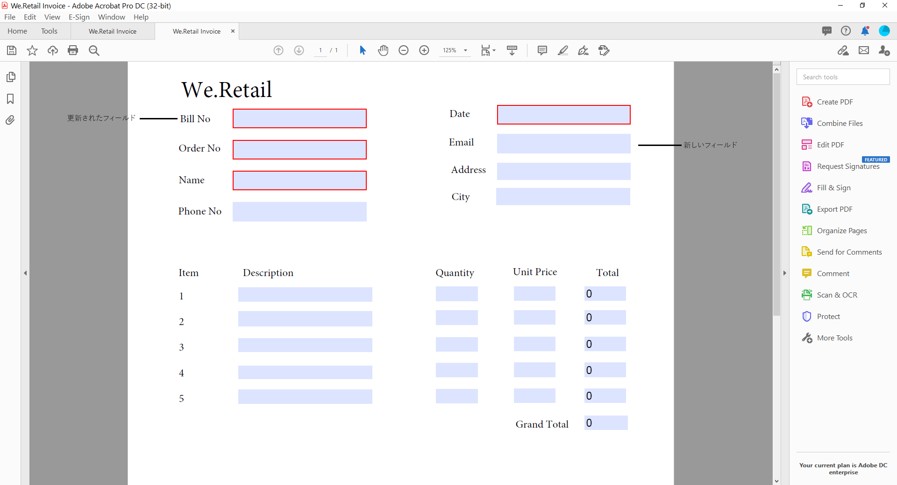
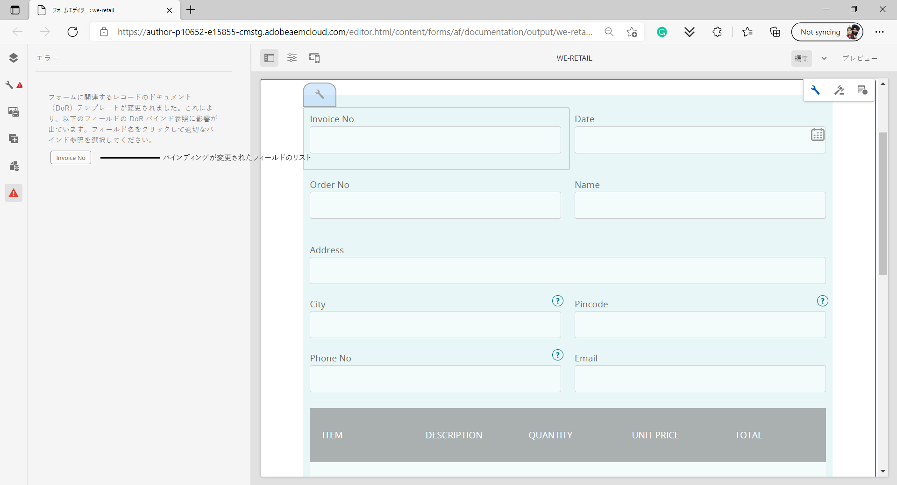

# アダプティブフォームにおけるレコードのドキュメントの生成 (コアコンポーネント)

## 概要 {#overview}

フォームに入力または送信する際に、フォームのレコードを印刷形式またはドキュメント形式で保持できます。 このレコードは、レコードのドキュメント（DoR）と呼ばれる、送信されたフォームの印刷用コピーです。また、顧客が後日入力した情報のレコードのドキュメントを参照したり、レコードのドキュメントを使用してフォームとコンテンツを PDF 形式でアーカイブしたりすることもできます。


レコードのドキュメントを作成するには、XFA または AcroForm ベースのテンプレートを、アダプティブフォームを使用して収集したデータと結合します。レコードのドキュメントは、自動またはオンデマンドで生成できます。オンデマンドオプションを使用すると、XFA または AcroForm ベースのカスタムテンプレートを指定して、レコードのドキュメントの外観をカスタマイズすることができます。

以下の操作を実行できます。

* [XFA に基づくレコードのドキュメントの生成](#generate-an-XFA-based-document-of-record)
* [AcroForm（Acrobat フォーム PDF）に基づくレコードのドキュメントの生成](#generate-an-Acroform-based-document-of-record)
* [レコードのドキュメントの自動生成](#auto-generate-a-document-of-record)

## 事前準備 {#components-to-automatically-generate-a-document-of-record}

本題に入る前に、レコードのドキュメントに必要な次のアセットを理解し準備します。

**基本テンプレート：** Forms Designer または Acrobat フォーム（AcroForm）で作成された XFA テンプレート（XDP ファイル）。[基本テンプレート](#base-template-of-a-document-of-record)は、レコードのドキュメントのスタイル設定とブランディング情報を指定するために使用されます。XFA テンプレート（XDP ファイル）を AEM Forms インスタンスに先にアップロードします。。

**アダプティブフォーム：**&#x200B;レコードのドキュメントが生成されるアダプティブフォーム。

## XFA に基づくレコードのドキュメントの生成 {#generate-an-XFA-based-document-of-record}

XFA テンプレート（XDP ファイル）を AEM Forms インスタンスにアップロードします。XFA テンプレート（XDP ファイル）をレコードのドキュメントのテンプレートとして使用するようにアダプティブフォームを設定するには、次の手順を実行します。

1. Experience Manager オーサーインスタンスで、**[!UICONTROL Forms]**／**[!UICONTROL フォームとドキュメント]**&#x200B;をクリックします。
1. フォームを選択するか、アダプティブフォームを作成して、 **[!UICONTROL プロパティ]**.
1. 「プロパティ」ウィンドウで、「**[!UICONTROL フォームモデル]**」をタップします。
1. の  **[!UICONTROL フォームモデル]** タブ、 **[!UICONTROL 次から選択：]** ドロップダウンで、「 **[!UICONTROL フォームデータモデル]**, **[!UICONTROL スキーマ]** または **[!UICONTROL なし]**. フォームモデルの選択は、フォームの作成時にも行うことができます。
1. 「フォームモデル」タブの「レコードのドキュメントテンプレート設定」セクションで、「**フォームテンプレートをレコードのドキュメントテンプレートとして関連付ける**」を選択します。このオプションを選択すると、マシン上で使用可能なすべての XFA テンプレート（XDP ファイル）が表示されます。適切なファイルを選択します。また、アダプティブフォームと選択した XFA テンプレート（XDP ファイル）で、必ず同じスキーマ（データスキーマ）が使用されるようにします。
1. 「**[!UICONTROL 完了]**」をクリックします。

これで、XDP ファイルをレコードのドキュメントのテンプレートとして使用するように、アダプティブフォームが設定されました。次の手順では、[アダプティブフォームコンポーネントを対応するテンプレートフィールドにバインド](#bind-adaptive-form-components-with-template-fields)します。

## AcroForm に基づくレコードのドキュメントの生成 {#generate-an-Acroform-based-document-of-record}

Adobe Acrobat PDF（AcroForm）を AEM Forms インスタンスにアップロードします。Adobe Acrobat PDF（AcroForm）をレコードのドキュメントのテンプレートとして使用するようにアダプティブフォームを設定するには、次の手順を実行します。

1. Experience Manager オーサーインスタンスで、**[!UICONTROL Forms]**／**[!UICONTROL フォームとドキュメント]**&#x200B;をクリックします。
1. フォームまたは **[!UICONTROL アダプティブフォームの作成]**&#x200B;をクリックし、 **[!UICONTROL プロパティ]**.
1. 「プロパティ」ウィンドウで、「**[!UICONTROL フォームモデル]**」をタップします。
1. の  **[!UICONTROL フォームモデル]** タブ、 **[!UICONTROL 次から選択：]** ドロップダウンで、「 **[!UICONTROL フォームデータモデル]**, **[!UICONTROL スキーマ]** または **[!UICONTROL なし]**. フォームモデルの選択は、フォームの作成時にも行うことができます。
1. 「フォームモデル」タブの「レコードのドキュメントテンプレート設定」セクションで、「**フォームテンプレートをレコードのドキュメントテンプレートとして関連付ける**」を選択します。このオプションを選択すると、コンピューター上で使用可能なAcrobatPDF(Acroform) がすべて表示されます。 使用する Acroform を選択します。
1. 「**[!UICONTROL 完了]**」をクリックします。

これで、AcroForm をレコードのドキュメントのテンプレートとして使用するように、アダプティブフォームが設定されました。次の手順では、[アダプティブフォームコンポーネントを対応するテンプレートフィールドにバインド](#bind-adaptive-form-components-with-template-fields)します。

## レコードのドキュメントの自動生成 {#auto-generate-a-document-of-record}

レコードのドキュメントを自動的に生成するようにアダプティブフォームを設定すると、フォームが変更されるたびに、そのレコードのドキュメントが直ちに更新されます。例えば、既存のアダプティブフォームからフィールドを削除すると、対応するフィールドも削除され、レコードのドキュメントには表示されません。レコードのドキュメントを自動的に生成するには、他にも多くの利点があります。

* フォーム開発者は、データバインディングを手動で管理する必要はありません。自動生成されたレコードのドキュメントは、データバインディング関連の更新を処理します。
* フォーム開発者は、レコードのドキュメントから除外するようにマークされたフィールドを手動で非表示にする必要はありません。自動生成されたレコードのドキュメントは、これらのフィールドを除外するように事前設定されています。
* 自動生成されたレコードのドキュメントオプションを使用すれば、レコードのドキュメント用のフォームテンプレートの作成に要する時間を節約できます。
* 自動生成されたレコードのドキュメントオプションでは、様々な基本テンプレートを使用して、異なるスタイルと外観を使用できます。組織のレコードのドキュメントに最適なスタイルと外観を選択するのに役立ちます。スタイル設定を指定しない場合、システムスタイルがデフォルトとして設定されます。
* 自動生成されたレコードのドキュメントでは、フォーム内の変更がすぐにレコードのドキュメントに反映されます。

レコードのドキュメントを自動生成するようアダプティブフォームを設定するには、次の手順を実行します。

1. Experience Manager オーサーインスタンスで、**[!UICONTROL Forms]**／**[!UICONTROL フォームとドキュメント]**&#x200B;をクリックします。
1. フォームを選択するか、アダプティブフォームを作成して、 **[!UICONTROL プロパティ]**.
1. 「プロパティ」ウィンドウで、「**[!UICONTROL フォームモデル]**」をタップします。
1. の  **[!UICONTROL フォームモデル]** タブ、 **[!UICONTROL 次から選択：]** ドロップダウンで、「 **[!UICONTROL フォームデータモデル]**, **[!UICONTROL スキーマ]** または **[!UICONTROL なし]**. フォームモデルの選択は、フォームの作成時にも行うことができます。
1. 「フォームモデル」タブの「レコードのドキュメントテンプレート設定」セクションで、「**レコードのドキュメントを生成**」を選択します。
1. 「**[!UICONTROL 完了]**」をクリックします。

## アダプティブフォームコンポーネントとテンプレートフィールドのバインド {#bind-adaptive-form-components-with-template-fields}

アダプティブフォームフィールドをテンプレートフィールドにバインドすると、取り込んだフォームデータが、対応するレコードのドキュメントフィールドに表示されます。アダプティブフォームコンポーネントを、対応するレコードのドキュメントテンプレートフィールドにバインドするには、次の手順に従います。

1. カスタムフォームテンプレートを使用するように設定されたアダプティブフォームを編集用に開きます。

1. アダプティブフォームコンポーネントを選択し、設定アイコン（）をクリックします。プロパティブラウザーが開きます。

1. プロパティブラウザーで、フィールドを参照して選択します。

   * （AcroForm テンプレートの場合）**[!UICONTROL レコードのドキュメントバインド参照フィールド]**&#x200B;プロパティ。
   * （XFA テンプレートの場合）**[!UICONTROL データモデルバインド参照]**&#x200B;プロパティ。

1. 「**[!UICONTROL 保存]**」をクリックします。

<!-- 
In the following video Adaptive Form components are binded with corresponding Acroform template fields and the Document of Record is sent as an email attachment.
-->

「E メールの送信」、「AEMワークフローを起動」、「Power Automate Flow を起動」などの送信アクションを使用できます。 [送信アクション](configuring-submit-actions.md) をクリックして、レコードのドキュメントを受け取ります。


## レコードのドキュメントテンプレートの増分更新 {#document-of-record-template-incremental-updates}

アダプティブフォームと対応するレコードのドキュメントテンプレートは、期間を経て漸進的に変化します。アダプティブフォームまたはレコードのドキュメントテンプレートに対して、フィールドの追加、削除、変更を選択できます。

レコードのドキュメントテンプレートに変更を加え、変更したレコードのドキュメントテンプレートを AEM Forms にアップロードすると、アダプティブフォームエディターが変更されたバインディングを自動的に検出し、新しいバインディングが必要なアダプティブフォームコンポーネントが通知されます。これにより、レコードのドキュメントテンプレートを増分更新できます。

例えば、*We.Retail* という組織に、AcroForm ベースのレコードのドキュメントテンプレート *we-retail-invoice.pdf* があるとします。テンプレートは次のようになります。


このテンプレートをしばらく使用した後、組織は `invoice-number` フィールドの名前を `bill-number` フィールドに変更し、購入者のメールアドレスを取り込むことにします。開発者は `invoice-number` フィールドの名前を更新し、テンプレートに「Email」フィールドを追加します。また、という名前の新しいバージョンのテンプレートも作成します。  *we-retail-invoice-v2.pdf*.



開発者は、更新されたテンプレートをアダプティブフォームにアップロードし、適用します。アダプティブフォームは、バインディングが変更されたフィールドのリストを自動的に検出して表示します。



フォーム開発者は、アダプティブフォームフィールドを、対応するレコードのドキュメントテンプレートとバインドします。
>[!VIDEO](assets/we-retail-binding.mp4)

これで、アダプティブフォームが送信されると、更新されたレコードのレコードのドキュメントが生成されます。


## レコードのドキュメントを使用する際の主な考慮事項 {#key-considerations-when-working-with-document-of-record}

アダプティブFormsのレコードのドキュメントを操作する際は、次の考慮事項および制限に注意してください。

* レコードのドキュメントのテンプレートは、リッチテキストをサポートしません。そのため、静的アダプティブフォームまたはエンドユーザー入力情報に含まれるリッチテキストは、レコードのドキュメントではプレーンテキストとして表示されます。
* アダプティブフォーム内のドキュメントフラグメントは、レコードのドキュメントには表示されません。ただし、アダプティブフォームフラグメントはサポートされています。
* XML スキーマベースのアダプティブフォーム用に生成されたレコードのドキュメント内のコンテンツバインディングはサポートされていません。
* レコードのドキュメントのレンダリングをユーザーが要求すると、レコードのドキュメントのローカライズされたバージョンが、ロケールに合わせてオンデマンドで作成されます。レコードのドキュメントのローカライズは、アダプティブフォームのローカライズと同時に発生します。<!-- For more information on localization of Document of Record and Adaptive Forms see Using AEM translation workflow to localize Adaptive Forms and Document of Record.-->

<!-- ## Configure an adaptive form to generate  Document of Record {#adaptive-form-types-and-their-documents-of-record}

While creating an adaptive form, in the Form Model tab of Adaptive Form properties, select one the following option: 

* **None**
  Select the option to create an Adaptive Form without a form model. When the option is selected, the Document of Record is automatically generated for your Adaptive Form.

* **[Associate form template as a Document of Record template](creating-adaptive-form.md#create-an-adaptive-form-based-on-an-xfa-form-template)**
  
  Select the option to use an XFA Form as a template for Document of Record. 

* **[Generate Document of Record](creating-adaptive-form.md#create-an-adaptive-form-based-on-xml-or-json-schema)**
  Select the option to use an XFA Form as a template. When the option is selected, the Document of Record is automatically generated for your Adaptive Form. When you use an XML schema as a template for an Adaptive Form, ensure that the adaptive form and associated XFA Form use the same XML schema as your Adaptive Form
  

When you select a form model, configure Document of Record using options available under Document of Record Template Configuration. See [Document of Record Template Configuration](#document-of-record-template-configuration). -->

## アダプティブフォーム要素のマッピング {#mapping-of-adaptive-form-elements}

次の表に、アダプティブフォームのコンポーネントと対応する XFA のコンポーネントおよびそれらがレコードのドキュメントに表示される場合について説明します。

### フィールド {#fields}

<table>
 <tbody>
  <tr>
   <th>アダプティブフォームコンポーネント</th>
   <th>対応する XFA コンポーネント</th>
   <th>レコードのドキュメントのテンプレートにデフォルトで含まれていますか？</th>
   <th>備考</th>
  </tr>
  <tr>
   <td>ボタン</td>
   <td>ボタン</td>
   <td>false</td>
   <td> </td>
  </tr>
  <tr>
   <td>チェックボックス</td>
   <td>チェックボックス</td>
   <td>true</td>
   <td> </td>
  </tr>
  <tr>
   <td>日付選択</td>
   <td>日付／時間フィールド</td>
   <td>true</td>
   <td> </td>
  </tr>
  <tr>
   <td>ドロップダウンリスト</td>
   <td>ドロップダウンリスト</td>
   <td>true</td>
   <td> </td>
  </tr>
  <tr>
   <td>数値ボックス</td>
   <td>数値フィールド</td>
   <td>true</td>
   <td> </td>
  </tr>
  <tr>
   <td>ラジオボタン</td>
   <td>ラジオボタン</td>
   <td>true</td>
   <td> </td>
  </tr>
  <tr>
   <td>テキストボックス</td>
   <td>テキストフィールド</td>
   <td>true</td>
   <td> </td>
  </tr>
  <tr>
   <td>リセットボタン</td>
   <td>リセットボタン</td>
   <td>false</td>
   <td> </td>
  </tr>
  <tr>
   <td>送信ボタン</td>
   <td><p>メール送信ボタン</p> <p>HTTP 送信ボタン</p> </td>
   <td>false</td>
   <td> </td>
  </tr>
  <tr>
   <td>ファイル添付</td>
   <td> </td>
   <td>false</td>
   <td>レコードのドキュメントのテンプレートでは使用できません。添付ファイルを介した場合のみレコードのドキュメントで使用できます。</td>
  </tr>
 </tbody>
</table>

### コンテナ {#containers}

<table>
 <tbody>
  <tr>
   <th>アダプティブフォームコンポーネント</th>
   <th>対応する XFA コンポーネント</th>
   <th>備考</th>
  </tr>
  <tr>
   <td>パネル<br /> </td>
   <td>サブフォーム<br /> </td>
   <td>反復パネルは繰り返しサブフォームにマッピングされます。</td>
  </tr>
 </tbody>
</table>

### 静的コンポーネント {#static-components}

| アダプティブフォームコンポーネント | 対応する XFA コンポーネント | 備考 |
|---|---|---|
| 画像 | 画像 | レコードのドキュメント設定を使用して除外されない限り、TextDraw と Image の各コンポーネントは、バインドされているかどうかを問わず、XSD ベースのアダプティブフォーム用のレコードのドキュメントに常に表示されます。 |
| テキスト | テキスト |

### テーブル {#tables}

ヘッダー、フッターおよび列といった、アダプティブフォームのテーブルコンポーネントは、対応する XFA コンポーネントにマッピングされます。繰り返し可能なパネルを、レコードのドキュメントのテーブルにマッピングすることができます。

## レコードのドキュメントの基本テンプレート {#base-template-of-a-document-of-record}

基本テンプレートは、レコードのドキュメントにスタイリングと外観の情報を提供します。これにより、自動生成されたレコードのドキュメントに対して、デフォルトの外観をカスタマイズすることができます。例えば、基本テンプレートを使用して、レコードのドキュメントのフッターに会社のロゴや著作権情報をヘッダーに追加できます。

基本テンプレートのマスターページは、レコードのドキュメントテンプレートのマスターページとして使用されます。 マスターページには、レコードのドキュメントに適用できるページヘッダー、ページフッター、ページ番号などの情報を含めることができます。 レコードのドキュメントを自動生成するための基本テンプレートを使用して、レコードのドキュメントにそのような情報を適用できます。 基本テンプレートを使用すると、フィールドのデフォルトのプロパティを変更できます。

基本テンプレートを設計する際は、[基本テンプレートの規則](#base-template-conventions)に従ってください。

## 基本テンプレートの規則 {#base-template-conventions}

基本テンプレートは、レコードのドキュメントのヘッダー、フッター、スタイル、外観を定義するために使用されます。 ヘッダーとフッターには、会社のロゴや著作権テキストなどの情報を含めることができます。基本テンプレートの最初のマスタページがコピーされ、レコードのドキュメントのマスタページとして使用されます。このページには、ヘッダー、フッター、ページ番号、またはレコードのドキュメント内のすべてのページに表示されるその他の情報が含まれます。 基本テンプレートの規則に準拠していない基本テンプレートを使用する場合、基本テンプレートの最初のマスターページは「レコードのドキュメント」テンプレートでも引き続き使用されます。 基本テンプレートは、規則に従って設計し、レコードのドキュメントの自動生成に使用することを強くお勧めします。

**マスターページの規則**

* 基本テンプレートでは、ルートサブフォームに `AF_METATEMPLATE`、マスターページに `AF_MASTERPAGE` と名前を付けます。

* ルートサブフォームの `AF_METATEMPLATE` 下に位置する `AF_MASTERPAGE` という名前のマスターページは、ヘッダー、フッターおよびスタイル情報を抽出する場合に優先して使用されます。

* `AF_MASTERPAGE` が存在しない場合は、基本テンプレート中に存在する最初のマスターページが使用されます。

**フィールドのスタイリング規則**

* レコードのドキュメント内のフィールドにスタイルを適用するため、基本テンプレートは `AF_FIELDSSUBFORM` ルートサブフォーム内の `AF_METATEMPLATE` サブフォームにフィールドを作成します。

* これらのフィールドのプロパティは、レコードのドキュメント内のフィールドに適用されます。これらのフィールドは、`AF_<name of field in all caps>_XFO` の命名規則に従う必要があります。例えば、チェックボックスのフィールド名は `AF_CHECKBOX_XFO` とする必要があります。

基本テンプレートを作成するには、Forms Designer で次の手順を実行します。

1. **[!UICONTROL ファイル]**／**[!UICONTROL 新規]**&#x200B;をクリックします。
1. 「**[!UICONTROL テンプレートに基づく]**」のオプションを選択します。

1. 「**[!UICONTROL Forms - レコードのドキュメント]**」のカテゴリを選択します。
1. 「**[!UICONTROL DoR 基本テンプレート]**」を選択します。
1. 「**[!UICONTROL 次へ]**」をクリックし、必要な情報を入力します。

1. （オプション）レコードのドキュメント内のフィールドに適用する、フィールドのスタイルと外観を変更します。
1. フォームを保存します。
   

これで、保存したフォームをレコードのドキュメントの基本テンプレートとして使用できます。 基本テンプレート中に存在するスクリプトについて、いずれも変更したり、削除したりしないでください。

**基本テンプレートの変更**

* 基本テンプレートのフィールドにスタイルを適用しないでください。これらのフィールドは基本テンプレートから削除して、基本テンプレートへのアップグレードが自動的に取得されるようにすることをお勧めします。
* 基本テンプレートを変更するときは、スクリプトを削除、追加、変更しないでください。

基本テンプレートを設計するときは、上記の規則と手順に厳密に従ってください。

## レコードのドキュメントにあるブランディング情報のカスタマイズ {#customize-the-branding-information-in-document-of-record}

レコードのドキュメントの生成中に、「レコードのドキュメント」タブにあるレコードのドキュメントのブランディング情報を変更できます。「レコードのドキュメント」タブには、ロゴ、外観、レイアウト、ヘッダー、フッター、免責事項などのオプションや、選択されていないチェックボックスやラジオボタンを含めるかどうかのオプションが含まれています。

「レコードのドキュメント」タブに入力されたブランディング情報をローカライズするには、ブラウザーのロケールを正しく設定してください。レコードのドキュメントのブランディング情報をカスタマイズするには、次の手順を実行します。

1. レコードのドキュメント内でパネル（ルートパネル）を選択して、 をタップします。
1.  をタップします。「レコードのドキュメント」タブが表示されます。
1. レコードのドキュメントをレンダリングするための、デフォルトのテンプレートまたはカスタムのテンプレートのいずれかを選択します。デフォルトのテンプレートを選択すると、レコードのドキュメントのサムネイルが「テンプレート」ドロップダウンの下に表示されます。
1. デフォルトのテンプレートとカスタムのテンプレートのどちらを選択するかにより異なりますが、以下のプロパティの一部または全部が「レコードのドキュメント」タブに表示されます。以下のプロパティを指定して、レコードのドキュメントの表示方法を定義します。

   1. **基本のプロパティ**：
      * **テンプレート**:カスタムテンプレートを選択する場合は、 [!DNL AEM Forms] サーバー。 使用できないテンプレートを [!DNL AEM Forms] サーバー上で、最初に XDP を [!DNL AEM Forms] サーバー。
      * **アクセントの色**:レコードのドキュメントPDFでヘッダーテキストと区切り線がレンダリングされる色。
      * **フォントファミリー**：レコードのドキュメントの PDF にあるテキストのフォントファミリー。
      * **データモデルにバインドされていないフォームオブジェクトを含める**:このプロパティを設定すると、レコードのドキュメント内のスキーマベースのアダプティブフォームの連結されていないフィールドが含まれます。
      * **レコードのドキュメントから非表示フィールドを除外**：このプロパティを設定すると、レコードのドキュメントから除外する非表示フィールドが識別されます。
      * **パネルの説明を非表示にする**:このプロパティを設定すると、パネル/テーブルの説明がレコードのドキュメントから除外されます。 パネルとテーブルに対して適用可能です。
   1. **フォームフィールドのプロパティ**:
      * **チェックボックスおよびラジオボタンのコンポーネントには、選択した値のみを表示**：このプロパティを設定すると、チェックボックスとラジオボタンの選択された値のみが[!UICONTROL レコードのドキュメント]に表示されます。
      * **複数の値の区切り文字**：複数の値を表示する場合は、カンマや改行などの任意の区切り文字を選択できます。
      * **オプションの位置揃え**：目的の整列（水平、垂直、アダプティブフォームと同じ）を選択して、[!UICONTROL レコードのドキュメント]に表示するチェックボックスやラジオボタンなどのフィールドの整列を設定することができます。デフォルトでは、垂直揃えが[!UICONTROL レコードのドキュメント]のフィールドに設定されています。DoR の[!UICONTROL フォームフィールドのプロパティ]からプロパティを設定すると、アダプティブフォームのフィールドの[!UICONTROL 項目の整列]で設定されたプロパティが上書きされます。例えば「[!UICONTROL アダプティブフォームと同じ]」オプションを使用する場合は、アダプティブフォームのオーサーインスタンスで設定された整列が[!UICONTROL レコードのドキュメント]のフィールドに使用されます。
      * **水平揃えのオプション数**：水平揃えの場合にレコードのドキュメントに表示するオプションの数を設定できます。
   1. **マスターページのプロパティ**:
      * **ロゴイメージ**：アダプティブフォームのロゴイメージを使用するか、DAM から選択するか、またはコンピューターからアップロードすることができます。
      * **フォームのタイトル**：DoR のタイトル。
      * **ヘッダーテキスト**：レコードのドキュメントのヘッダーセクションに表示されるテキスト。
      * **免責事項ラベル**：免責事項のラベル。
      * **免責事項**：レコードのドキュメントに対する権利と義務の範囲を指定するテキスト。
      * **免責事項テキスト**：免責事項のテキスト。

      
   >[!NOTE]
   >
   >バージョン 6.3 より前の Forms Designer で作成されたアダプティブフォームテンプレートを使用している場合、アクセントカラーおよびフォントファミリーのプロパティを適用するには、ルートサブフォームの下にあるアダプティブフォームテンプレートに以下が存在することを確認してください。

   ```xml
   <proto>
   <font typeface="Arial"/>
   <fill>
   <color value="4,166,203"/>
   </fill>
   <edge>
   <color value="4,166,203"/>
   </edge>
   </proto>
   ```

1. ブランディングの変更内容を保存するには、「**[!UICONTROL 完了]**」をタップします。


## レコードのドキュメントのパネルに表示される表と列のレイアウト {#table-and-column-layouts-for-panels-in-document-of-record}

いくつかのフォームフィールドを使用すると、アダプティブフォームが長くなる場合があります。その場合、レコードのドキュメントをアダプティブフォームの正確なコピーとして保存することはお勧めしません。ここでは、1 つ以上のアダプティブフォームパネルをレコードのドキュメント PDF に保存するための表または列のレイアウトを選択できます。

レコードのドキュメントを生成する前に、パネルの設定の「レコードのドキュメントのレイアウト」で、パネル用に表または列を選択します。パネル内のフィールドは、レコードのドキュメントに合わせて配置されます。


レコードのドキュメントの表レイアウト内でレンダリングされたパネルのフィールド


レコードのドキュメントの列レイアウト内でレンダリングされたパネルのフィールド

## レコードのドキュメントの設定 {#document-of-record-settings}

レコードのドキュメントの設定では、レコードのドキュメントに含めるオプションを選択できます。例えば、銀行では、名前、年齢、社会保障番号、電話番号などをフォームから受け取ります。銀行口座番号や支店の詳細は、フォーム上に生成されます。レコードのドキュメントでは、名前、社会保障番号、銀行口座、および支店の詳細のみが表示されるように選択できます。

レコードのドキュメントコンポーネントの設定は、そのプロパティで使用できます。コンポーネントのプロパティにアクセスするには、コンポーネントを選択し、オーバーレイ内の  をクリックします。プロパティはサイドバーにリスト表示され、その中で次の設定を検索できます。

**フィールドレベルの設定**

* **レコードのドキュメントから除外**：プロパティを「true」に設定すると、そのフィールドがレコードのドキュメントから除外されます。これは `excludeFromDoR` という名前のスクリプト可能プロパティです。その動作は、**非表示の場合はレコードのドキュメントからフィールドを除外**&#x200B;フォームレベルプロパティに依存します。

* **パネルを表として表示：**&#x200B;パネルに含まれるフィールドの数が 6 個未満の場合、このプロパティを設定することでパネルが表としてレコードのドキュメントに表示されます。この設定は、パネルにのみ適用されます。
* **レコードのドキュメントからタイトルを除外：**&#x200B;このプロパティを設定すると、レコードのドキュメントからパネルや表のタイトルが除外されます。パネルおよび表に対してのみ適用できます。
* **レコードのドキュメントから説明を除外：**&#x200B;このプロパティを設定すると、レコードのドキュメントからパネルや表の説明が除外されます。パネルおよび表に対してのみ適用できます。

**フォームレベルの設定**

* **バインドされていないフィールドをレコードのドキュメントに含める：**&#x200B;このプロパティを設定すると、スキーマベースのアダプティブフォームのバインドされていないフィールドがレコードのドキュメントに追加されます。デフォルトでは true になっています。
* **非表示の場合に DoR からフィールドを除外：** フォーム送信時にレコードのドキュメントから非表示フィールドを除外するプロパティを設定します。 有効にする場合 [サーバーで再検証](/help/forms/configuring-submit-actions.md#server-side-revalidation-in-adaptive-form-server-side-revalidation-in-adaptive-form)を指定した場合、サーバーは非表示のフィールドを再計算してから、レコードのドキュメントからこれらのフィールドを除外します。