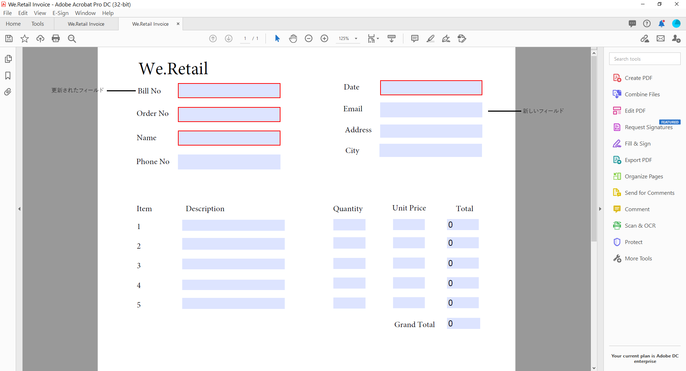
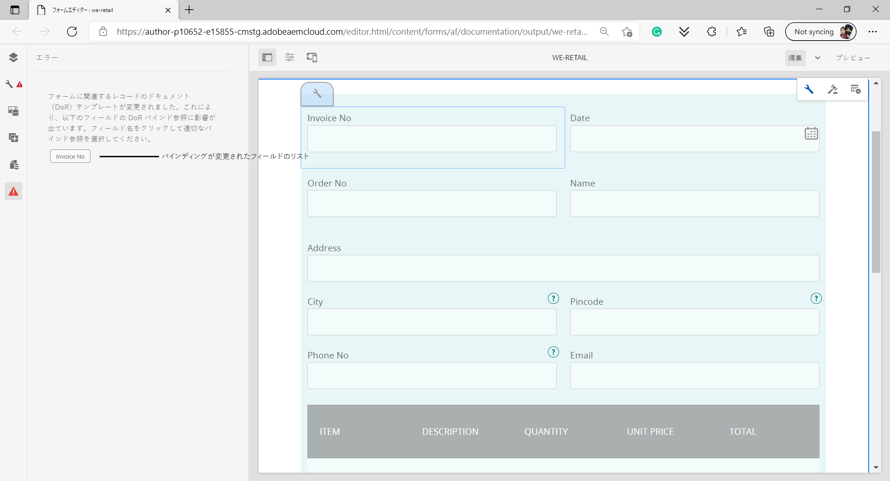
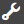
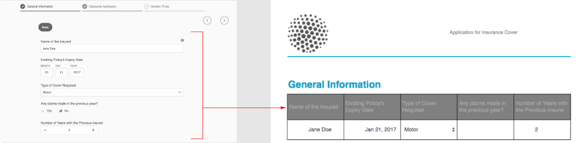

# アダプティブPDF（コアコンポーネント）用の送信Forms（レコードのドキュメント）の生成

## 概要 {#overview}

フォームの入力時または送信時には、そのフォームを印刷物またはドキュメント形式で記録しておくことができます。このレコードは、Submission PDF（旧称レコードのドキュメント、DoR）と呼ばれます。 送信されたフォームの印刷用PDFです。 後日お客様が入力した情報については、提出PDFを参照するか、提出PDFを使用してフォームやコンテンツをPDF形式でアーカイブすることもできます。

## 適用性とユースケース

### 保険

## AEM Formsは保険金請求書類を作成できますか？

はい。AEM Formsは、送信PDF（旧Document of Record）の生成をサポートしており、保険会社は送信されたフォームデータに基づいてPDFやレコードを作成できます。

## AEM Formsで生成されたドキュメントは、監査に適していますか？

はい。AEM Formsは、監査やコンプライアンス要件に対応する上で重要な、一貫したドキュメント作成、管理されたアクセス、トレーサビリティをサポートします。

送信PDFを作成するには、XFA ベースまたはAcroform ベースのテンプレートを、アダプティブフォームを介して収集されたデータと結合します。 送信PDFは、自動またはオンデマンドで生成できます。 オンデマンドオプションを使用すると、カスタム XFAまたはAcroform ベースのテンプレートを指定して、Submission PDFにカスタム外観を提供できます。

以下の操作を実行できます。

* [XFA ベースの送信PDFの生成](#generate-an-XFA-based-document-of-record)
* [Acroform ベースの（Acrobat Form PDF）送信PDFの生成](#generate-an-Acroform-based-document-of-record)
* [送信PDFの自動生成](#auto-generate-a-document-of-record)

## 開始する前に {#components-to-automatically-generate-a-document-of-record}

Submission PDFに必要なアセットについて学習し、準備を整える前に、次の手順を実行します。

**基本テンプレート：** Forms Designer または Acrobat フォーム（AcroForm）で作成された XFA テンプレート（XDP ファイル）。[基本テンプレート &#x200B;](#base-template-of-a-document-of-record)は、送信PDFのスタイル設定とブランディング情報を指定するために使用されます。 XFA テンプレート（XDP ファイル）を AEM Forms インスタンスに先にアップロードします。

**アダプティブフォーム：**&#x200B;送信PDFを生成するアダプティブフォーム。

## XFA ベースの送信PDFの生成 {#generate-an-XFA-based-document-of-record}

XFA テンプレート（XDP ファイル）を AEM Forms インスタンスにアップロードします。次の手順を実行して、送信PDFのテンプレートとしてXFA テンプレート（XDP ファイル）を使用するようにアダプティブフォームを設定します。

1. Experience Manager オーサーインスタンスで、**[!UICONTROL Forms]**／**[!UICONTROL フォームとドキュメント]**&#x200B;をクリックします。
1. フォームを選択するか、アダプティブフォームを作成し、**[!UICONTROL プロパティ]**&#x200B;をクリックします。
1. プロパティウィンドウで、「**[!UICONTROL フォームモデル]**」を選択します。
1. 「**[!UICONTROL フォームモデル]**」タブの&#x200B;**[!UICONTROL 選択元]**&#x200B;ドロップダウンで、**[!UICONTROL フォームデータモデル]**、**[!UICONTROL スキーマ]**&#x200B;または&#x200B;**[!UICONTROL なし]**&#x200B;を選択します。フォームモデルの選択は、フォームの作成時にも行うことができます。
1. 「フォームモデル」タブの「レコードのドキュメントテンプレート設定」セクションで、「**フォームテンプレートをレコードのドキュメントテンプレートとして関連付ける**」を選択します。このオプションを選択すると、マシン上で使用可能なすべての XFA テンプレート（XDP ファイル）が表示されます。適切なファイルを選択します。また、アダプティブフォームと選択した XFA テンプレート（XDP ファイル）で、必ず同じスキーマ（データスキーマ）が使用されるようにします。
1. 「**[!UICONTROL 完了]**」をクリックします。

これで、アダプティブフォームは、送信PDFのテンプレートとしてXDP ファイルを使用するように設定されました。 次の手順では、[アダプティブフォームコンポーネントを対応するテンプレートフィールドにバインド](#bind-adaptive-form-components-with-template-fields)します。

## Acroform ベースの送信PDFの生成 {#generate-an-Acroform-based-document-of-record}

Adobe Acrobat PDF（AcroForm）を AEM Forms インスタンスにアップロードします。Adobe Acrobat PDF（Acroform）を送信PDFのテンプレートとして使用するようにアダプティブフォームを設定するには、次の手順を実行します。

1. Experience Manager オーサーインスタンスで、**[!UICONTROL Forms]**／**[!UICONTROL フォームとドキュメント]**&#x200B;をクリックします。
1. フォームを選択するか、**[!UICONTROL アダプティブフォームを作成し]**、「**[!UICONTROL プロパティ]**」をクリックします。
1. プロパティウィンドウで、「**[!UICONTROL フォームモデル]**」を選択します。
1. 「**[!UICONTROL フォームモデル]**」タブの&#x200B;**[!UICONTROL 選択元]**&#x200B;ドロップダウンで、**[!UICONTROL フォームデータモデル]**、**[!UICONTROL スキーマ]**&#x200B;または&#x200B;**[!UICONTROL なし]**&#x200B;を選択します。フォームモデルの選択は、フォームの作成時にも行うことができます。
1. 「フォームモデル」タブの「レコードのドキュメントテンプレート設定」セクションで、「**フォームテンプレートをレコードのドキュメントテンプレートとして関連付ける**」を選択します。このオプションを選択すると、ご利用のマシンで利用可能なすべての Acrobat PDF（Acroform）が表示されます。使用する Acroform を選択します。
1. 「**[!UICONTROL 完了]**」をクリックします。

これで、アダプティブフォームは、送信PDFのテンプレートとしてAcroformを使用するように設定されました。 次の手順では、[アダプティブフォームコンポーネントを対応するテンプレートフィールドにバインド](#bind-adaptive-form-components-with-template-fields)します。

## 送信PDFの自動生成 {#auto-generate-a-document-of-record}

アダプティブフォームが送信PDFを自動生成するように設定されている場合、フォームが変更されるたびに、送信PDFが即座に更新されます。 例えば、既存のアダプティブフォームからフィールドが削除された場合、対応するフィールドも削除され、送信PDFには表示されません。 送信PDFを自動生成する他にも多くの利点があります。

* フォーム開発者は、データバインディングを手動で管理する必要はありません。自動生成された送信PDFは、データバインディング関連の更新を処理します。
* フォーム開発者は、送信PDFから除外とマークされたフィールドを手動で非表示にする必要はありません。 自動生成された送信PDFは、そのようなフィールドを除外するように事前設定されています。
* 自動生成された送信PDF オプションにより、送信PDF用のフォームテンプレートの作成に必要な時間を節約できます。
* 自動生成された「送信」PDF オプションを使用すると、様々なベーステンプレートを使用して、様々なスタイルとアピアランスを使用できます。 これは、組織に最適なスタイルと外観を選択するのに役立ちます。提出PDF. スタイル設定を指定しない場合、システムスタイルがデフォルトとして設定されます。
* 自動生成された送信PDFにより、フォームの変更が送信PDFにすぐに反映されます。

送信PDFを自動生成するようにアダプティブフォームを設定するには、次の手順を実行します。

1. Experience Manager オーサーインスタンスで、**[!UICONTROL Forms]**／**[!UICONTROL フォームとドキュメント]**&#x200B;をクリックします。
1. フォームを選択するか、アダプティブフォームを作成し、**[!UICONTROL プロパティ]**&#x200B;をクリックします。
1. プロパティウィンドウで、「**[!UICONTROL フォームモデル]**」を選択します。
1. 「**[!UICONTROL フォームモデル]**」タブの&#x200B;**[!UICONTROL 選択元]**&#x200B;ドロップダウンで、**[!UICONTROL フォームデータモデル]**、**[!UICONTROL スキーマ]**&#x200B;または&#x200B;**[!UICONTROL なし]**&#x200B;を選択します。フォームモデルの選択は、フォームの作成時にも行うことができます。
1. 「フォームモデル」タブの「レコードのドキュメントテンプレート設定」セクションで、「**レコードのドキュメントを生成**」を選択します。
1. 「**[!UICONTROL 完了]**」をクリックします。

## アダプティブフォームコンポーネントとテンプレートフィールドのバインド {#bind-adaptive-form-components-with-template-fields}

アダプティブフォームフィールドをテンプレートフィールドとバインドして、対応する送信PDF フィールドに取り込まれたフォームデータを表示します。 アダプティブフォームコンポーネントを対応する送信PDF テンプレートフィールドにバインドするには：

1. カスタムフォームテンプレートを使用するように設定されたアダプティブフォームを編集用に開きます。

1. アダプティブフォームコンポーネントを選択し、設定アイコン（）をクリックします。プロパティブラウザーが開きます。

1. プロパティブラウザーで、フィールドを参照して選択します。

   * （AcroForm テンプレートの場合）**[!UICONTROL レコードのドキュメントバインド参照フィールド]**&#x200B;プロパティ。
   * （XFA テンプレートの場合）**[!UICONTROL データモデルバインド参照]**&#x200B;プロパティ。

1. 「**[!UICONTROL 保存]**」をクリックします。

<!-- 
In the following video, Adaptive Form components are bound with corresponding Acroform template fields and the Document of Record is sent as an email attachment.
-->

「メールを送信」、「AEM ワークフローを呼び出す」、「Power Automate フローを呼び出す」などの送信アクションを使用して、送信PDFを受け取ることができます。[送信アクション &#x200B;](configuring-submit-actions.md)

>[!NOTE]
>
> 任意のフォームデータモデルの送信PDFを保存するには、**[!UICONTROL レコードのドキュメント バインド参照フィールド]** プロパティを使用します。

## Submission PDF テンプレートの増分更新 {#document-of-record-template-incremental-updates}

アダプティブフォームと対応する送信PDF テンプレートは、時間の経過とともに変化する可能性があります。 アダプティブフォームまたは送信PDF テンプレートにフィールドを追加、削除、または変更することができます。

送信PDF テンプレートを変更し、変更されたテンプレートをAEM Formsにアップロードすると、アダプティブForms エディターは変更されたバインディングを自動的に検出し、新しいバインディングが必要なアダプティブフォームコンポーネントについて通知します。 これにより、送信PDF テンプレートを段階的に更新できます。

例えば、組織&#x200B;*We.Retail*&#x200B;には、AcroForm ベースの送信PDF テンプレート *we-retail-invoice.pdf*&#x200B;があります。 テンプレートは次のようになります。

このテンプレートをしばらく使用した後、組織は `invoice-number` フィールドの名前を `bill-number` フィールドに変更し、購入者のメールアドレスを取り込むことにします。開発者は `invoice-number` フィールドの名前を更新し、テンプレートに「メール」フィールドを追加します。また、*we-retail-invoice-v2.pdf* という新しいバージョンのテンプレートも作成します。

<!--

The developer uploads and applies to the updated template to the adaptive form. The adaptive form automatically detects and displays list of fields where binding has changed.

The form developer binds Adaptive Forms fields with corresponding Document of Record template.

-->

>[!VIDEO](assets/we-retail-binding.mp4)

これで、アダプティブフォームが送信されると、更新された送信PDFが生成されます。

## Submission PDFを使用する際の主な考慮事項 {#key-considerations-when-working-with-document-of-record}

アダプティブForms用のPDFを提出する際は、次の考慮事項と制限事項に注意してください。

* 送信PDF テンプレートは、リッチテキストをサポートしていません。 そのため、静的アダプティブフォームまたはユーザーが入力した情報に含まれるリッチテキストは、送信PDFにプレーンテキストとして表示されます。
* アダプティブフォームのドキュメントフラグメントは、送信PDFには表示されません。 ただし、アダプティブフォームフラグメントはサポートされています。
* XML スキーマベースのアダプティブフォーム用に生成されたSubmission PDFのコンテンツバインディングはサポートされていません。
* Submission PDFのローカライズ版は、ユーザーがSubmission PDFのレンダリングをリクエストしたときに、ロケールに応じてオンデマンドで作成されます。 送信PDFのローカライズは、アダプティブフォームのローカライズと共に行われます。<!-- For more information on localization of Document of Record and Adaptive Forms see Using AEM translation workflow to localize Adaptive Forms and Document of Record.-->

<!--
 ## Configure an adaptive form to generate  Document of Record {#adaptive-form-types-and-their-documents-of-record}

While creating an adaptive form, in the Form Model tab of Adaptive Form properties, select one the following option: 

* **None**
  Select the option to create an Adaptive Form without a form model. When the option is selected, the Document of Record is automatically generated for your Adaptive Form.

* **[Associate form template as a Document of Record template](creating-adaptive-form.md#create-an-adaptive-form-based-on-an-xfa-form-template)**
  Select the option to use an XFA Form as a template for Document of Record. 

* **[Generate Document of Record](creating-adaptive-form.md#create-an-adaptive-form-based-on-xml-or-json-schema)**
  Select the option to use an XFA Form as a template. When the option is selected, the Document of Record is automatically generated for your Adaptive Form. When you use an XML schema as a template for an Adaptive Form, ensure that the adaptive form and associated XFA Form use the same XML schema as your Adaptive Form

When you select a form model, configure Document of Record using options available under Document of Record Template Configuration. See [Document of Record Template Configuration](#document-of-record-template-configuration).
-->

## アダプティブフォーム要素のマッピング {#mapping-of-adaptive-form-elements}

次の表では、アダプティブフォームコンポーネントと対応するXFA コンポーネントについて説明し、それらが送信PDFに表示される場合について説明します。

### フィールド {#fields}

<table>
 <tbody>
  <tr>
   <th>アダプティブフォームコンポーネント</th>
   <th>対応する XFA コンポーネント</th>
   <th>送信PDF テンプレートにデフォルトで含まれますか？</th>
   <th>メモ</th>
  </tr>
  <tr>
   <td>ボタン</td>
   <td>ボタン</td>
   <td>false</td>
   <td> </td>
  </tr>
  <tr>
   <td>チェックボックス</td>
   <td>チェックボックス</td>
   <td>true</td>
   <td> </td>
  </tr>
  <tr>
   <td>日付選択</td>
   <td>日付／時間フィールド</td>
   <td>true</td>
   <td> </td>
  </tr>
  <tr>
   <td>ドロップダウンリスト</td>
   <td>ドロップダウンリスト</td>
   <td>true</td>
   <td> </td>
  </tr>
  <tr>
   <td>数値ボックス</td>
   <td>数値フィールド</td>
   <td>true</td>
   <td> </td>
  </tr>
  <tr>
   <td>ラジオボタン</td>
   <td>ラジオボタン</td>
   <td>true</td>
   <td> </td>
  </tr>
  <tr>
   <td>テキストボックス</td>
   <td>テキストフィールド</td>
   <td>true</td>
   <td> </td>
  </tr>
  <tr>
   <td>リセットボタン</td>
   <td>リセットボタン</td>
   <td>false</td>
   <td> </td>
  </tr>
  <tr>
   <td>送信ボタン</td>
   <td>
メール送信ボタン
 
HTTP 送信ボタン
 </td>
   <td>false</td>
   <td> </td>
  </tr>
  <tr>
   <td>ファイル添付</td>
   <td> </td>
   <td>false</td>
   <td>送信PDF テンプレートでは使用できません。 添付ファイルを通じて送信PDFでのみ使用できます。</td>
  </tr>
 </tbody>
</table>

### コンテナ {#containers}

<table>
 <tbody>
  <tr>
   <th>アダプティブフォームコンポーネント</th>
   <th>対応する XFA コンポーネント</th>
   <th>メモ</th>
  </tr>
  <tr>
   <td>パネル  </td>
   <td>サブフォーム  </td>
   <td>繰り返し可能なパネルは、繰り返し可能なサブフォームにマッピングされます。</td>
  </tr>
 </tbody>
</table>

### 静的コンポーネント {#static-components}

| アダプティブフォームコンポーネント | 対応する XFA コンポーネント | メモ |
|---|---|---|
| 画像 | 画像 | TextDraw コンポーネントと画像コンポーネントは、XSD ベースのアダプティブフォームの送信PDFに必ず表示されます。ただし、送信PDF設定で除外する場合は除きます。 |
| テキスト | テキスト |  |

### テーブル {#tables}

ヘッダー、フッターおよび列といった、アダプティブフォームのテーブルコンポーネントは、対応する XFA コンポーネントにマッピングされます。繰り返し可能なパネルをSubmission PDFのテーブルにマッピングできます。

## Submission PDFのベーステンプレート {#base-template-of-a-document-of-record}

基本テンプレートは、Submission PDFにスタイルとアピアランスに関する情報を提供します。 自動生成された送信PDFのデフォルトの外観をカスタマイズできます。 例えば、基本テンプレートを使用して、Submission PDFのヘッダーに会社ロゴを追加し、フッターに著作権情報を追加できます。

基本テンプレートのマスターページは、送信PDF テンプレートのマスターページとして使用されます。 マスターページには、送信PDFに適用できるページヘッダー、ページフッター、ページ番号などの情報を含めることができます。 送信PDFの自動生成用の基本テンプレートを使用して、この情報を送信PDFに適用できます。 基本テンプレートを使用すると、フィールドのデフォルトプロパティを変更することができます。

基本テンプレートを設計する際は、[基本テンプレートの規則](#base-template-conventions)に従ってください。

## 基本テンプレートの規則 {#base-template-conventions}

基本テンプレートは、Submission PDFのヘッダー、フッター、スタイル、外観を定義するために使用されます。 ヘッダーとフッターには、会社のロゴや著作権テキストなどの情報を含めることができます。基本テンプレートの最初のマスターページは、コピーされ、送信PDFのマスターページとして使用されます。このマスターページには、ヘッダー、フッター、ページ番号など、送信PDFのすべてのページに表示されるその他の情報が含まれています。 基本テンプレートの規則に準拠していない基本テンプレートを使用する場合でも、基本テンプレートの最初のマスターページはSubmission PDF テンプレートで引き続き使用されます。 基本テンプレートを規則に従ってデザインし、Submission PDFの自動生成に使用することを強くお勧めします。

**メインページの規則**

* 基本テンプレートでは、ルートサブフォームに `AF_METATEMPLATE`、マスターページに `AF_MASTERPAGE` と名前を付けます。

* ルートサブフォームの `AF_METATEMPLATE` 下に位置する `AF_MASTERPAGE` という名前のマスターページは、ヘッダー、フッターおよびスタイル情報を抽出する場合に優先して使用されます。

* `AF_MASTERPAGE` が存在しない場合は、基本テンプレート中に存在する最初のマスターページが使用されます。

**フィールドのスタイリング規則**

* 送信PDFのフィールドにスタイルを適用するには、基本テンプレートで、`AF_FIELDSSUBFORM` ルートサブフォームの下の`AF_METATEMPLATE` サブフォームにあるフィールドが提供されます。

* これらのフィールドのプロパティは、送信PDFのフィールドに適用されます。 これらのフィールドは、`AF_<name of field in all caps>_XFO` の命名規則に従う必要があります。例えば、チェックボックスのフィールド名は `AF_CHECKBOX_XFO` とする必要があります。

基本テンプレートを作成するには、Forms Designer で次の手順を実行します。

1. **[!UICONTROL ファイル]**／**[!UICONTROL 新規]**&#x200B;をクリックします。
1. 「**[!UICONTROL テンプレートに基づく]**」のオプションを選択します。

1. 「**[!UICONTROL Forms - レコードのドキュメント]**」のカテゴリを選択します。
1. 「**[!UICONTROL DoR 基本テンプレート]**」を選択します。
1. 「**[!UICONTROL 次へ]**」をクリックし、必要な情報を入力します。

1. （オプション）送信PDFのフィールドに適用するフィールドのスタイルと外観を変更します。
1. フォームを保存します。
   

これで、保存したフォームを送信PDFのベーステンプレートとして使用できるようになりました。 基本テンプレート中に存在するスクリプトについて、いずれも変更したり、削除したりしないでください。

**基本テンプレートの変更**

* 基本テンプレートのフィールドにスタイルを適用しないでください。これらのフィールドを基本テンプレートから削除して、基本テンプレートへのアップグレードが自動取得されるようにすることをお勧めします。
* 基本テンプレートを変更するときは、スクリプトを削除、追加、変更しないでください。

基本テンプレートを設計するときは、上記の規則と手順に厳密に従ってください。

## Submission PDFでのブランディング情報のカスタマイズ {#customize-the-branding-information-in-document-of-record}

送信PDFを生成する際に、「レコードのドキュメント」タブで送信PDFのブランド情報を変更できます。 「レコードのドキュメント」タブには、ロゴ、外観、レイアウト、ヘッダー、フッター、免責事項などのオプションや、選択されていないチェックボックスやラジオボタンを含めるかどうかのオプションが含まれています。

「レコードのドキュメント」タブに入力されたブランディング情報をローカライズするには、ブラウザーのロケールを正しく設定してください。Submission PDFのブランディング情報をカスタマイズするには、次の手順を実行します。

1. 送信PDFでパネル（ルートパネル）を選択し、を選択します。
1.  を選択します。「レコードのドキュメント」タブが表示されます。
1. Submission PDFをレンダリングするデフォルトテンプレートまたはカスタムテンプレートのいずれかを選択します。 デフォルトのテンプレートを選択すると、送信PDFのサムネールプレビューがテンプレートドロップダウンの下に表示されます。
1. デフォルトのテンプレートとカスタムのテンプレートのどちらを選択するかに応じて、以下のプロパティの一部またはすべてのプロパティが「レコードのドキュメント」タブに表示されます。以下のプロパティを指定して、送信PDFの外観を定義します。

   1. **基本のプロパティ**：
      * **テンプレート**：カスタムテンプレートを選択する場合は、[!DNL AEM Forms] サーバーで XDP を参照して選択します。お使いの [!DNL AEM Forms] サーバーで利用できないテンプレートを使用する場合は、まず XDP を [!DNL AEM Forms] サーバーにアップロードする必要があります。
      * **Accent Color**：送信PDFでヘッダーテキストと区切り文字がレンダリングされる色。
      * **フォントファミリー**：送信PDF内のテキストのフォントファミリー。

        >[!NOTE]
        >
        > AEM Forms には、PDF ファイルとシームレスに統合できる様々なビルトインのフォントが用意されています。サポートされているフォントのリストを表示するには、[こちらをクリック](/help/forms/supported-out-of-the-box-fonts.md)してください。

      * **データモデルにバインドされていないフォームオブジェクトを含める**: プロパティを設定すると、送信PDFのスキーマベースのアダプティブフォームからバインドされていないフィールドが含まれます。

        <!-- **Exclude hidden fields from the Document of Record**: Setting the property identifies the hidden fields for exclusion from Document of Record.-->

      * **パネルの説明を非表示**: プロパティを設定すると、パネル/テーブルの説明は送信PDFから除外されます。 パネルとテーブルに対して適用可能です。

   1. **フォームフィールドのプロパティ**:

      * **チェックボックスおよびラジオボタンのコンポーネントには、選択した値のみを表示**：このプロパティを設定すると、チェックボックスとラジオボタンの選択された値のみが[!UICONTROL レコードのドキュメント]に表示されます。
      * **複数の値の区切り記号**：複数の値を表示する場合は、カンマや改行などの任意の区切り記号を選択できます。
      * **オプションの位置揃え**：目的の整列（水平、垂直、アダプティブフォームと同じ）を選択して、[!UICONTROL レコードのドキュメント]に表示するチェックボックスやラジオボタンなどのフィールドの整列を設定することができます。デフォルトでは、垂直揃えが[!UICONTROL レコードのドキュメント]のフィールドに設定されています。DoR の[!UICONTROL フォームフィールドのプロパティ]からプロパティを設定すると、アダプティブフォームのフィールドの[!UICONTROL 項目の整列]で設定されたプロパティが上書きされます。例えば「[!UICONTROL アダプティブフォームと同じ]」オプションを使用する場合は、アダプティブフォームのオーサーインスタンスで設定された整列が[!UICONTROL レコードのドキュメント]のフィールドに使用されます。
      * **水平整列のオプション数**:You&#x200B;は、水平整列の送信PDFに表示されるオプション数を設定できます。

      **複数選択ドロップダウンのラベルを表示**

      この機能は、早期アクセスプログラムから利用できます。 アクセスをリクエストするには、公式アドレスから[aem-forms-ea@adobe.com](mailto:aem-forms-ea@adobe.com)にメールを送信してください。

      送信PDFに、内部保存値ではなく、複数選択ドロップダウンコンポーネントの選択した表示ラベルが表示されるようになりました。 例えば、ユーザーがドロップダウンから「California」と「New York」を選択した場合、Submission PDFには、`CA`や`NY`などの内部値ではなく、選択したラベルが表示されます。 選択した各オプションは、コンマ区切りの値ではなく個別の行に表示されます。これは、[基盤コンポーネントベースのアダプティブ Forms](/help/forms/generate-document-of-record-for-non-xfa-based-adaptive-forms.md)のビヘイビアーと一致しています。

   1. **マスターページのプロパティ**:

      * **ロゴイメージ**：アダプティブフォームのロゴイメージを使用するか、DAM から選択するか、またはコンピューターからアップロードすることができます。
      * **フォームのタイトル**：DoR のタイトル。
      * **ヘッダーテキスト**：送信PDFのヘッダーセクションに表示されるテキスト。
      * **免責事項ラベル**：免責事項のラベル。
      * **免責事項**：送信PDFに関する権利と義務の範囲を指定するテキスト。
      * **免責事項テキスト**：免責事項のテキスト。

1. ブランディングの変更内容を保存するには、「**[!UICONTROL 完了]**」を選択します。

>[!NOTE]
> 
> 送信PDFにカスタムフォームタイトルを表示するには、**レコードのドキュメントのプロパティ**/**マスターページプロパティ**&#x200B;の&#x200B;**カスタムフォームタイトル**&#x200B;を編集します。 このカスタムタイトル：
> 
> * 生成されたPDFのヘッダーに表示されます
> * PDFのドキュメントプロパティで、タイトルとして表示されます
> * PDFを開いたときに、最初の表示タイトルとして表示されます

## Submission PDFのパネルの表と列のレイアウト {#table-and-column-layouts-for-panels-in-document-of-record}

いくつかのフォームフィールドを使用すると、アダプティブフォームが長くなる場合があります。送信PDFをアダプティブフォームの正確なコピーとして保存したくない場合があります。 これで、送信PDFで1つ以上のアダプティブフォームパネルを保存するためのテーブルまたは列のレイアウトを選択できるようになりました。

提出PDFを作成する前に、パネルの設定で、そのパネルのレコードのドキュメントのレイアウトを表または列として選択します。 パネルのフィールドは、送信PDFで適切に整理されます。

送信PDFのテーブルレイアウトでレンダリングされたパネルの

送信PDFのテーブルレイアウトでレンダリングされたパネルのフィールド

送信PDFの列レイアウトでレンダリングされたパネルの

送信PDFの列レイアウトでレンダリングされたパネルのフィールド

## 送信PDFの設定 {#document-of-record-settings}

送信PDFの設定では、送信PDFに含めるオプションを選択できます。 例えば、銀行では、名前、年齢、社会保障番号、電話番号などをフォームから受け取ります。このフォームで、銀行口座番号や支店の詳細が生成されます。Submission PDFでは、名前、社会保障番号、銀行口座、支店の詳細のみを表示できます。

レコードのドキュメントコンポーネントの設定は、そのプロパティで使用できます。コンポーネントのプロパティにアクセスするには、コンポーネントを選択し、オーバーレイ内の  をクリックします。プロパティはサイドバーにリスト表示され、その中で次の設定を検索できます。

**フィールドレベルの設定**

* **レコードのドキュメントから除外**: プロパティ trueを設定すると、フィールドが送信PDFから除外されます。 これは `excludeFromDoR` という名前のスクリプト可能プロパティです。その動作は、**非表示の場合はレコードのドキュメントからフィールドを除外**&#x200B;フォームレベルプロパティに依存します。

* **パネルをテーブルとして表示：** プロパティを設定すると、パネル内のフィールドが6つより少ない場合、パネルは送信PDFにテーブルとして表示されます。 この設定は、パネルにのみ適用されます。
* **レコードのドキュメントからタイトルを除外：** プロパティを設定すると、パネル/テーブルのタイトルが送信PDFから除外されます。 パネルおよび表に対してのみ適用できます。
* **レコードのドキュメントから説明を除外：** プロパティを設定すると、パネル/テーブルの説明が送信PDFから除外されます。 パネルおよび表に対してのみ適用できます。
* **レコードのドキュメントから非表示フィールドを除外**：このプロパティを選択すると、送信PDFから非表示フィールドが除外されます。 すべてのフォームフィールドに適用されます。デフォルトでは、「**レコードのドキュメントから非表示フィールドを除外**」オプションは選択されていません。

**フォームレベルの設定**

* **DoR:**&#x200B;に連結されていないフィールドを含めるプロパティを設定すると、送信PDFのスキーマベースのアダプティブフォームから連結されていないフィールドが含まれます。 デフォルトでは true になっています。

## よくある質問 {#faq}

**Q：変更が送信PDFに表示されません。**
**Ans:** アダプティブForms エディターでフォームを開き、微調整（フィールドラベルの調整やフィールドの並べ替えなど）をおこない、フォームを保存します。 これにより、送信PDF テンプレートが再生成され、次に生成されるPDFに変更内容が表示されます。

## 関連トピック {#see-also}

{{see-also}}

<!-- 

**Exclude fields from DoR if hidden:** Set the property to exclude the hidden fields from Document of Record at form submission. When you enable [Revalidate on server](/help/forms/configuring-submit-actions.md#server-side-revalidation-in-adaptive-form-server-side-revalidation-in-adaptive-form), the server recomputes the hidden fields before excluding those fields from the Document of Record.

-->

