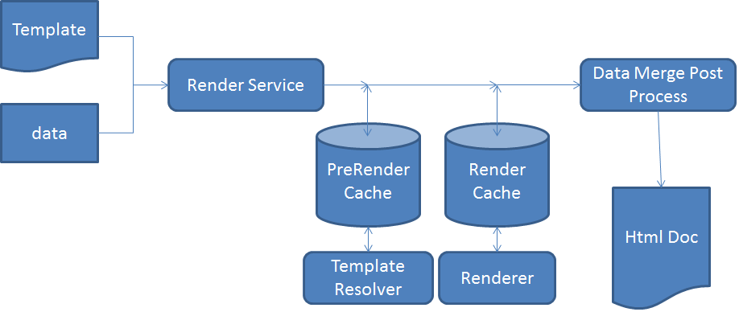

# HTML5 フォームのアーキテクチャ{#architecture-of-html-forms}

 HTML5 Forms機能は、早期アクセスプログラムの一部として提供されています。 アクセスをリクエストするには、公式（職場）メール ID からaem-forms-ea@adobe.comにメールを送信します。

## アーキテクチャ {#architecture}

HTML5 フォーム機能は埋め込み AEM インスタンス内のパッケージとしてデプロイされ、RESTful [Apache Sling アーキテクチャ](https://sling.apache.org/)を使用して、HTTP/S 上の REST エンドポイントとして公開されます。

### Sling フレームワークの使用 {#using-sling-framework}

[Apache Sling](https://sling.apache.org/) はリソース中心です。リクエスト URL を使用して、最初にリソースを解決します。各リソースには **sling:resourceType**（または **sling:resourceSuperType**）プロパティがあります。このプロパティ、リクエストメソッド、およびリクエスト URL のプロパティに基づいて、リクエストを処理する Sling スクリプトが選択されます。この Sling スクリプトは、JSP またはサーブレットにすることができます。HTML5 フォームの場合、**Profile** ノードは Sling リソースとして機能し、**プロファイルレンダラー**&#x200B;はモバイルフォームをレンダリングするために特定のプロファイルで要求を処理する Sling スクリプトとして機能します。**プロファイルレンダラー**&#x200B;は要求からパラメーターを読み取り、Forms OSGi サービスを呼び出す JSP です。

REST エンドポイントとサポートされているリクエストパラメーターについて詳しくは、[フォームテンプレートのレンダリング](/help/forms/rendering-form-template.md)を参照してください。

ユーザーが iOS や Android™ のブラウザーなどのクライアントデバイスからリクエストを行う場合、Sling はまずリクエスト URL に基づいて Profile ノードを解決します。この Profile ノードから、**sling:resourceSuperType** と **sling:resourceType** を読み取り、このフォームレンダーリクエストを処理できるすべての利用可能なスクリプトを決定します。次に、Sling リクエストセレクターとリクエストメソッドを使用して、このリクエストの処理に最適なスクリプトを識別します。リクエストがプロファイルレンダラー JSP に到達すると、JSP は Forms OSGi サービスを呼び出します。

Sling スクリプトの解決について詳しくは、[AEM Sling チートシートt](https://experienceleague.adobe.com/docs/experience-manager-release-information/aem-release-updates/previous-updates/aem-previous-versions.html?lang=ja)または [Apache Sling Url の分解](https://sling.apache.org/documentation/the-sling-engine/url-decomposition.html)を参照してください。

#### 一般的なフォーム処理呼び出しフロー {#typical-form-processing-call-flow}

HTML5 フォームは、最初のリクエスト時にフォームの処理（レンディションまたは送信）に必要なすべての中間オブジェクトをキャッシュします。データに依存するオブジェクトはキャッシュされません。このようなオブジェクトは変更される可能性が高いからです。

Mobile フォームは、PreRender キャッシュと Render キャッシュの 2 つの異なるレベルのキャッシュを維持します。preRender キャッシュには、解決されたテンプレートのすべてのフラグメントと画像が含まれ、レンダーキャッシュには、HTML などのレンダリングされたコンテンツが含まれます。

HTML5 フォームのワークフロー

HTML5 フォームは、フラグメントと画像の参照が欠落しているテンプレートはキャッシュしません。HTML5 フォームの処理に通常より多くの時間がかかる場合は、サーバーログで参照や警告が見つからないかを確認します。また、オブジェクトの最大サイズに達していないことも確認してください。

Forms OSGi サービスは次の 2 つの手順でリクエストを処理します。

* **レイアウトと初期フォーム状態の生成**：Forms OSGi レンダリングサービスは、フォームキャッシュコンポーネントを呼び出して、このフォームがすでにキャッシュされていて無効化されていないかを調べます。フォームがキャッシュされ、有効な場合は、キャッシュから生成された HTML を提供します。フォームが無効になっている場合、Forms OSGi レンダリングサービスは初期フォームのレイアウトとフォームの状態を XML 形式で生成します。この XML は、Forms OSGi サービスによって HTML のレイアウトと初期の JSON フォームの状態に変換され、以降のリクエストに対してキャッシュされます。
* **事前入力されたフォーム**：レンダリング中に、データが事前入力されたフォームをユーザーがリクエストした場合、Forms OSGi レンダリングサービスはフォームサービスコンテナを呼び出し、結合されたデータを持つ新しいフォーム状態を生成します。ただし、上記の手順ではレイアウトが既に生成されているので、この呼び出しは最初の呼び出しよりも高速です。この呼び出しは、データの結合を実行し、データに対してスクリプトを実行するだけです。

フォームまたはフォーム内で使用されているアセットに更新がある場合、フォームキャッシュコンポーネントはその更新を検出し、その特定のフォームのキャッシュは無効化されます。Forms OSGi サービスが処理を完了すると、プロファイルレンダラー JSP はこのフォームに JavaScript ライブラリの参照とスタイルを追加し、応答をクライアントに返します。ここでは、[Apache](https://httpd.apache.org/) のような一般的な web サーバーを、HTML 圧縮をオンにして使用できます。Web サーバーは応答サイズ、ネットワークトラフィックおよびサーバーとクライアントマシンの間でのデータのストリーミングに要する時間を大幅に減らします。

ユーザーがフォームを送信すると、ブラウザーはフォームの状態を JSON 形式で[送信サービスプロキシ](/help/forms/service-proxy.md)に送信し、送信サービスプロキシは JSON データを使用してデータ XML を生成し、そのデータ XML を送信エンドポイントに送信します。

## コンポーネント {#components}

HTML5 フォームを有効にするには、AEM Forms アドオンパッケージが必要です。AEM Forms アドオンパッケージのインストールについて詳しくは、[AEM Forms のインストールと設定](/help/forms/setup-local-development-environment.md)を参照してください。

### OSGi コンポーネント（adobe-lc-forms-core.jar） {#osgi-components-adobe-lc-forms-core-jar}

**Adobe XFA Forms レンダラー（com.adobe.livecycle.adobe-lc-forms-core）** は Felix 管理コンソール `(https://[host]:[port]/system/console/bundles)` ールのバンドルビューに表示される際のHTML5 フォーム OSGi バンドルの表示名です。

このコンポーネントにはレンダー、キャッシュ管理、構成設定用の OSGi コンポーネントが含まれています。

#### Forms OSGi サービス {#forms-osgi-service}

この OSGi サービスには、XDP を HTML としてレンダリングするロジックが含まれており、フォームの送信を処理してデータ XML を生成します。このサービスでは、Forms サービスコンテナを使用します。Forms サービスコンテナは処理を実行するネイティブコンポーネント `XMLFormService.exe` を内部的に呼び出します。

レンダラーリクエストが受信された場合は、このコンポーネントが Forms サービスコンテナを呼び出してレイアウトおよび状態情報を生成し、この情報がさらに処理されて HTML および JSON フォーム DOM 状態が生成されます。

また、このコンポーネントは、送信されたフォームステートの JSON からデータ XML を生成します。

#### キャッシュコンポーネント {#cache-component}

HTML5 フォームでは、スループットと応答時間を最適化するためにキャッシュを使用します。キャッシュサービスのレベルを設定して、パフォーマンスとスペース稼働率のトレードオフを微調整できます。

<table>
 <tbody>
  <tr>
   <th>キャッシュ方法</th>
   <th>説明</th>
  </tr>
  <tr>
   <td>なし</td>
   <td>アーティファクトをキャッシュしません  </td>
  </tr>
  <tr>
   <td>保守的</td>
   <td>インラインフラグメントと画像を含むテンプレートなどの、フォームのレンダリング前に生成された中間アーティファクトのみをキャッシュします</td>
  </tr>
  <tr>
   <td>積極的</td>
   <td>レンダリングされた HTML コンテンツをキャッシュします 保守的レベルでキャッシュされたすべてのアーティファクトをキャッシュします。  <strong>メモ</strong>：この方法を使用するとパフォーマンスを最適化できますが、キャッシュされたアーティファクトを格納するためにより多くのメモリが消費されます。</td>
  </tr>
 </tbody>
</table>

HTML5 フォームは、LRU 戦略を使用してメモリ内キャッシュを実行します。キャッシュ方法が「なし」に設定されている場合、キャッシュは作成されず、既存のキャッシュデータが存在する場合は消去されます。キャッシュ方法の他に、メモリ内キャッシュの合計サイズも設定できます。これは、キャッシュサイズの上限の設定に役立ち、設定した上限値を超えると LRU モードを使用してキャッシュリソースを解放します。

>[!NOTE]
>
>メモリ内キャッシュは、クラスターノード間で共有されません。

#### 設定サービス {#configuration-service}

設定サービスを使用すると、HTML5 フォームの設定パラメーターとキャッシュ設定を調整できます。

これらの設定を更新するには、CQ Felix 管理コンソール（https://&lt;&#39;[server]:[port]&#39;/system/console/configMgr で使用可能）に移動し、「Mobile Forms Configuration」を検索して選択します。

設定サービスを使用すると、キャッシュサイズを設定したりキャッシュを無効化したりできます。また、デバッグオプションパラメーターを使用してデバッグを有効化することもできます。フォームのデバッグについて詳しくは、[HTML5 フォームのデバッグ](/help/forms/debug.md)を参照してください。

### ランタイムコンポーネント（adobe-lc-forms-runtime-pkg.zip） {#runtime-components-adobe-lc-forms-runtime-pkg-zip}

ランタイムパッケージには、HTML フォームのレンダリングに使用されるクライアントサイドのライブラリが含まれています。

**ランタイムパッケージの一部として使用できる重要なコンポーネント：**

#### スクリプトエンジン {#scripting-engine}

AdobeXFA の実装では、フォーム内でユーザー定義のロジックを実行できるように、JavaScript と FormCalc の 2 種類のスクリプト言語がサポートされています。

この両方の言語で XFA スクリプティング API をサポートするために、HTML フォームのスクリプトエンジンは JavaScript で記述されています。

レンダリング時に、FormCalc スクリプトは、ユーザーやデザイナーに対して透過的なサーバー上で、JavaScript に変換（およびキャッシュ）されます。

このスクリプトエンジンでは、Object.defineProperty などの ECMAScript5 の機能の一部が使用されています。エンジン／ライブラリはカテゴリ名 **xfaforms.profile** で CQ クライアントライブラリとして提供されます。また、外部ポータルやアプリがフォームとやりとりできるようにする **FormBridge API** も用意されています。FormBridge を使用すると、外部アプリからプログラムで特定の要素を非表示にしたり、値を取得または設定したり、属性を変更したりできるようになります。

詳しくは、[Form Bridge](/help/forms/integrate-form-bridge-forms-portal.md) の記事を参照してください。

#### レイアウトエンジン {#layout-engine}

HTML5 フォームのレイアウトと視覚的側面は、SVG1.1、jQuery、BackBone、CSS3 の機能に基づいています。フォームの初期のアピアランスが生成され、サーバーにキャッシュされます。生成された初期レイアウトの微調整と、フォームレイアウトへのさらなる増分の変更は、クライアントで管理されます。これを実現するために、ランタイムパッケージには、JavaScript で記述され、jQuery/Backbone がベースになっているレイアウトエンジンが含まれています。このエンジンでは、繰り返し可能なインスタンスの追加／削除、拡大可能なオブジェクトのレイアウトなどの、すべての動的動作を処理します。このレイアウトエンジンでは、フォームを 1 ページずつレンダリングします。最初に表示されるのは 1 ページのみで、水平スクロールバーは先頭のページにのみ表示されます。ただし、ユーザーが下にスクロールすると、次のページのレンダリングが開始します。このようにページごとにレンディションを実行することで、ブラウザーで最初のページをレンダリングするために必要な時間が短縮され、フォームのパフォーマンスが確実に向上します。このエンジン／ライブラリは、カテゴリ名が **xfaforms.profile** の CQ クライアントライブラリの一部です。

また、レイアウトエンジンには、ユーザーからフォームフィールドの値を取得するために使用する一連のウィジェットも含まれています。これらのウィジェットは [jQuery UI ウィジェット](https://api.jqueryui.com/jQuery.widget/)としてモデル化され、特定の追加契約を実装してレイアウトエンジンとシームレスに連携します。

ウィジェットと対応する契約について詳しくは、[HTML5 フォームのカスタムウィジェット](/help/forms/custom-widgets.md)を参照してください。

#### スタイル設定 {#styling}

HTML 要素に関連付けられているスタイルは、インラインで追加されるか、埋め込み CSS ブロックに基づいて追加されます。フォームに依存しないいくつかの一般的なスタイルが、xfaforms.profile というカテゴリ名の CQ クライアントライブラリに含まれています。

デフォルトのスタイル設定プロパティに加えて、各フォーム要素には、要素のタイプ、名前、その他のプロパティに基づく特定の CSS クラスも含まれています。これらのクラスを使用すると、独自の CSS を指定して要素のスタイルを変更できます。

デフォルトのスタイル設定とクラスについて詳しくは、[スタイルの概要](/help/forms/css-styles.md)を参照してください。

#### サーバーサイドスクリプトと web サービス {#server-side-script-and-web-services}

サーバーで実行するようにマークされているスクリプトや web サービスを呼び出すようにマークされているスクリプトは、常に（マークされている実行場所に関係なく）サーバー上で実行されます。

クライアントスクリプトエンジン：

1. 現在のフォーム状態を JSON 形式で渡しながら、サーバーに対して同期呼び出しを実行します
1. サーバー上でスクリプトまたは web サービスを実行します
1. 新しい JSON 状態を生成します
1. 応答が返された場合に、クライアントで新しい JSON 状態を結合します。

#### ローカライゼーションのリソースバンドル {#localization-resource-bundles}

HTML5 フォームはイタリア語（it）、スペイン語（es）、ポルトガル語（ブラジル）（pt_BR）、簡体字中国語（zh_CN）、繁体字中国語（サポート制限有り）（zh_TW）、韓国語（ko_KR）、英語（en_US）、フランス語（fr_FR）、ドイツ語（de_DE）、日本語（ja）をサポートしています。要求ヘッダーで受信されるロケールに基づいて、それに対応するリソースバンドルがクライアントに送信されます。このリソースバンドルはカテゴリ名が **xfaforms.I18N** の CQ クライアントライブラリとして、プロファイル JSP に追加されます。プロファイルでロケールパッケージを取得するロジックを上書きします。

### Sling コンポーネント（adobe-lc-forms-content-pkg.zip） {#sling-components-adobe-lc-forms-content-pkg-zip}

Sling パッケージには、プロファイルとプロファイルレンダラーに関連するコンテンツが含まれています。

#### プロファイル {#profiles}

プロファイルは、フォームまたはフォームのファミリーを表す Sling のリソースノードです。CQ レベルでは、これらのプロファイルは JCR ノードです。ノードは、JCR リポジトリの **/content** フォルダーにあり、**/content** フォルダー内の任意のサブフォルダーに配置できます。

#### プロファイルレンダラー {#profile-renderers}

プロファイルノードには、**xfaforms/profile** の値を持つ **sling:resourceSuperType** プロパティがあります。このプロパティは転送リクエストを、**/libs/xfaforms/profile** フォルダーにあるプロファイルノードの Sling スクリプトに内部的に送信します。これらのスクリプトは JSP ページであり、HTML フォームと必要な JS/CSS アーティファクトをまとめるコンテナです。このページには、次への参照が含まれます。

* **xfaforms.I18N.&lt;locale>**：このライブラリには、ローカライズされたデータが含まれています。
* **xfaforms.profile**：このライブラリには、XFA スクリプティングとレイアウトエンジンの実装が含まれています。

これらのライブラリは、CQ フレームワークの JavaScript ライブラリの自動連結、縮小、圧縮の機能を利用する CQ クライアントライブラリをモデルとしています。
CQ クライアントライブラリについて詳しくは、「[CQ Clientlib Documentation](https://experienceleague.adobe.com/docs/experience-manager-release-information/aem-release-updates/previous-updates/aem-previous-versions.html?lang=ja)」を参照してください。

上記のとおり、プロファイルレンダラー JSP は Sling include をとおして Forms サービスをを呼び出します。また、この JSP は、管理設定または要求パラメーターに基づいて様々なデバッグオプションを設定します。

HTML5 フォームを使用することで、開発者はプロファイルとプロファイルレンダラーを作成してフォームの外観をカスタマイズできるようになります。例えば、HTML5 フォームでは、開発者はフォームをパネル内または既存の HTML ポータルの &lt;div> セクションに統合できます。
カスタムプロファイルの作成について詳しくは、「[カスタムプロファイルの作成](/help/forms/custom-profile.md)」を参照してください。
