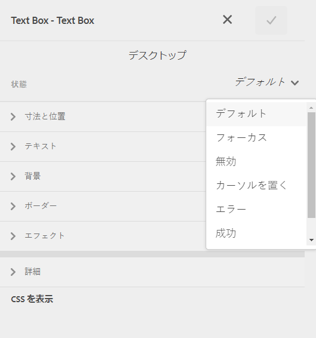
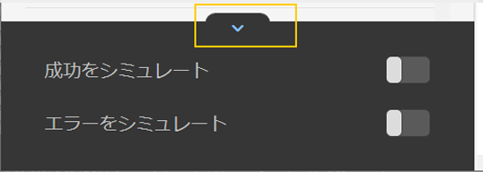

# アダプティブフォームコンポーネントのインラインスタイル設定 {#inline-styling-of-adaptive-form-components}

>[!NOTE]
>
> [新しいアダプティブフォームを作成する](/help/forms/creating-adaptive-form-core-components.md)、または [AEM Sites ページにアダプティブフォームを追加する](/help/forms/create-or-add-an-adaptive-form-to-aem-sites-page.md)際には、最新の拡張可能なデータキャプチャである[コアコンポーネント](https://experienceleague.adobe.com/docs/experience-manager-core-components/using/adaptive-forms/introduction.html?lang=ja)を使用することをお勧めします。これらのコンポーネントは、アダプティブフォームの作成における大幅な進歩を示すものであり、優れたユーザーエクスペリエンスを実現します。この記事では、基盤コンポーネントを使用してアダプティブフォームを作成する従来の方法について説明します。

| バージョン | 記事リンク |
| -------- | ---------------------------- |
| AEM 6.5 | [ここをクリックしてください](https://experienceleague.adobe.com/docs/experience-manager-65/forms/adaptive-forms-basic-authoring/inline-style-adaptive-forms.html) |
| AEM as a Cloud Service | この記事 |

アダプティブフォームの全体的な外観とスタイルは、[テーマエディター](themes.md)でスタイルを指定して定義できます。また、アダプティブフォームの個々のコンポーネントにインライン CSS スタイルを適用し、即座に変更をプレビューすることもできます。インラインスタイルは、テーマで設定されたスタイルよりも優先されます。

## インライン CSS プロパティを適用 {#apply-inline-css-properties}

コンポーネントにインラインスタイルを追加するには、次の手順を実行します。

1. フォームビルダーでフォームを開き、モードをスタイルモードに変更します。 モードをスタイルモードに変更するには、ページツールバーで ／**[!UICONTROL スタイル]**&#x200B;を選択します。
1. ページ内のコンポーネントを選択し、編集ボタン  を選択します。サイドバーにスタイルのプロパティが開きます。

   サイドバーのフォーム階層ツリーからコンポーネントを選択することもできます。フォーム階層ツリーは、サイドバーでフォームオブジェクトとして使用できます。

   [!UICONTROL スタイル]モードでは、フォームオブジェクトの下にコンポーネントが表示されます。ただし、サイドバーのフォームオブジェクトリストには、フィールドやパネルなどのコンポーネントが一覧表示されます。フィールドとパネルは、テキストボックスやラジオボタンなどのコンポーネントを含めることができる汎用コンポーネントです。

   サイドバーからコンポーネントを選択すると、選択したコンポーネントのすべてのサブコンポーネントのリストと選択したコンポーネントのプロパティが表示されます。特定のサブコンポーネントを選択して、そのスタイルを設定できます。

1. サイドバーのタブをクリックして、CSS プロパティを指定します。次のようなプロパティを指定できます。

   * [!UICONTROL 寸法と位置]（表示設定、パディング、高さ、幅、余白、位置、z インデックス、フロート、クリア、オーバーフロー）
   * [!UICONTROL テキスト]（フォントファミリー、太さ、色、サイズ、行の高さ、整列）
   * [!UICONTROL 背景]（画像とグラデーション、背景色）
   * [!UICONTROL 境界線]（幅、スタイル、色、半径）
   * [!UICONTROL 効果]（シャドウ、不透明度）
   * [!UICONTROL 詳細]（コンポーネントのカスタム CSS を作成できます）

1. 同様に、コンポーネントの他の部分（[!UICONTROL ウィジェット]、[!UICONTROL キャプション]、[!UICONTROL ヘルプ]など）のスタイルを適用できます。
1. 「**[!UICONTROL 完了]**」を選択して変更を確定するか、または「**[!UICONTROL キャンセル]**」を選択して変更を破棄します。

## 例：フィールドコンポーネントのインラインスタイル {#example-inline-styles-for-a-field-component}

以下の図は、インラインスタイルが適用される前後のテキストフィールドを示しています。

インラインスタイルプロパティを適用する前のテキストボックスコンポーネント

次の図に示すように、以下の CSS プロパティを適用した後のテキストボックススタイルの変化に注目してください。

<table>
 <tbody>
  <tr>
   <td>
セレクター
 </td>
   <td>
CSS プロパティ
 </td>
   <td>
値
 </td>
   <td>
効果
 </td>
  </tr>
  <tr>
   <td>
フィールド
 </td>
   <td>
境界線
 </td>
   <td>
境界線の幅=2px
 
境界線のスタイル=実線
 
境界線のカラー=#1111
 </td>
   <td>
フィールドの周囲に黒色の 2px 幅の境界線を作成
 </td>
  </tr>
  <tr>
   <td>
テキストボックス
 </td>
   <td>
背景色
 </td>
   <td>
#6495ED
 </td>
   <td>
背景色を CornflowerBlue (#6495ED) に変更します。
 
注：値フィールドには、カラーの名前または 16 進数コードを指定できます。
 </td>
  </tr>
  <tr>
   <td>
ラベル
 </td>
   <td>
寸法と位置／幅
 </td>
   <td>
100 px
 </td>
   <td>
ラベルの幅を 100px に固定
 </td>
  </tr>
  <tr>
   <td>フィールドヘルプアイコン</td>
   <td>テキスト／フォントカラー</td>
   <td>#2ECC40</td>
   <td>ヘルプアイコンの表面の色を変更します。</td>
  </tr>
  <tr>
   <td>
詳細な説明
 </td>
   <td>
text-align
 </td>
   <td>
中央
 </td>
   <td>
長いヘルプ説明を中央揃えにする
 </td>
  </tr>
 </tbody>
</table>

インラインスタイルプロパティを適用した後のテキストボックスコンポーネント

上述の手順に従って、他のコンポーネント（パネル、送信ボタン、ラジオボタンなど）を選択し、そのスタイルを設定できます。

>[!NOTE]
>
>スタイルのプロパティは、選択したコンポーネントにより異なります。

## スタイルをコピー＆ペースト {#copy-paste-styles}

アダプティブフォーム内のあるコンポーネントから別のコンポーネントにスタイルをコピーして貼り付けることもできます。**[!UICONTROL スタイル]**&#x200B;モードで、コンポーネントを選択し、「コピー」アイコン  をクリックします。

同じタイプの別のコンポーネントを選択し、「ペースト」アイコン  をタップして、コピーしたスタイルをペーストします。「スタイルを消去」アイコン  を選択して、適用したスタイルを消去することもできます。

## コンポーネントの異なる状態にスタイルを設定 {#set-styles-for-states}

コンポーネントタイプの状態ごとにスタイルを設定できます。状態には、[!UICONTROL フォーカス]、[!UICONTROL 無効]、[!UICONTROL ホバー]、[!UICONTROL エラー]、[!UICONTROL 成功]、[!UICONTROL 必須]が含まれます。

コンポーネントの状態のスタイル設定を定義するには、次の手順を実行します。

1. **[!UICONTROL スタイル]**&#x200B;モードで、コンポーネントを選択し、「編集」アイコン  を選択します。

1. 「**[!UICONTROL 状態]**」ドロップダウンリストを使用して、コンポーネントの状態を選択します。

   

1. コンポーネントの選択した状態のスタイル設定を定義し、「」を選択してプロパティを保存します。

成功状態とエラー状態をシミュレートすることもできます。「展開」アイコンを選択して、「**[!UICONTROL 成功をシミュレート]**」および「**[!UICONTROL エラーをシミュレート]**」オプションを表示します。

## 関連トピック {#see-also}

{{see-also}}

<!--

>[!MORELIKETHIS]
>
>* [Use themes in Adaptive Form Core Components ](/help/forms/using-themes-in-core-components.md)

-->