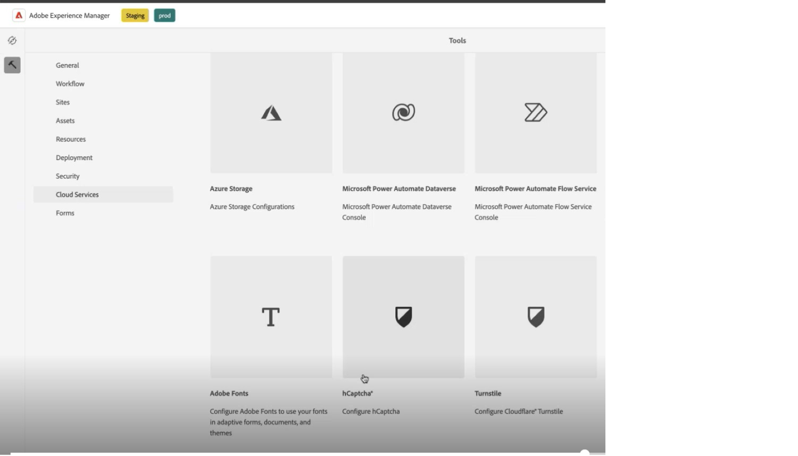
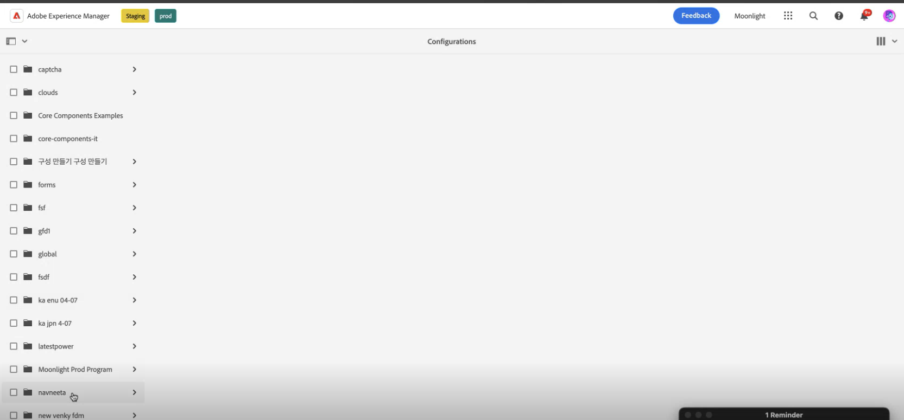
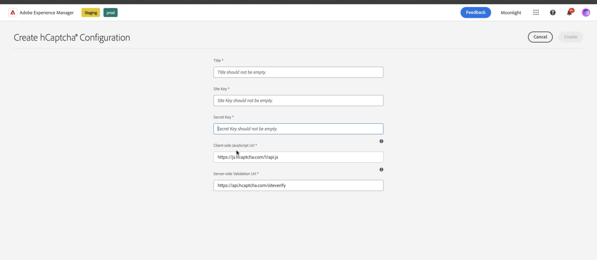
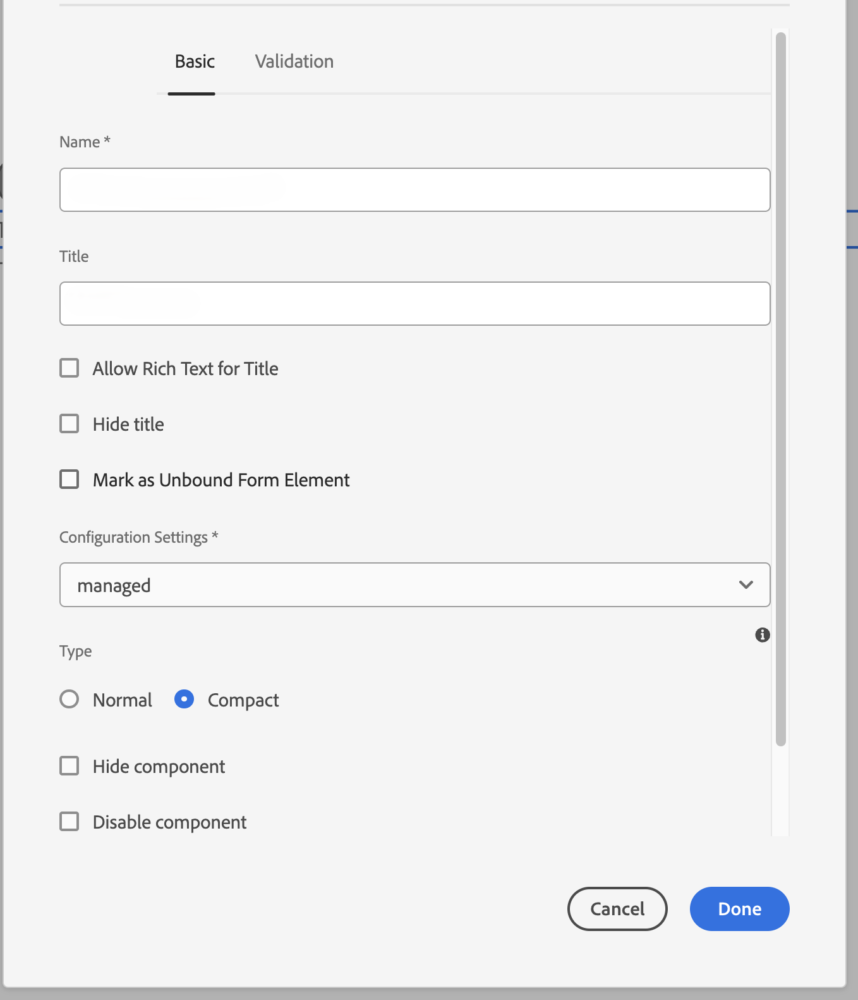

# AEM Forms 環境と hCaptcha® の接続 {#connect-your-forms-environment-with-hcaptcha-service}

CAPTCHA（コンピュータと人間を区別する完全に自動化された公開チューリングテスト）は、人間と自動化されたプログラム／ボットを区別するために、オンライントランザクションで一般的に使用されるプログラムです。 テストを行ってユーザーの反応を評価し、サイトを使用しているのが人間かボットかを判断します。 テストが失敗した場合の続行を防ぎ、ボットによるスパムの投稿や悪意のある目的を防止することで、オンライントランザクションの安全性を高めます。

AEM Forms as a Cloud Service は、次の CAPTCHA ソリューションをサポートしています。

* [hCaptcha](#integrate-aem-forms-environment-with-hcaptcha-captcha)
* [Google reCAPTCHA](/help/forms/captcha-adaptive-forms-core-components.md)
* [hCaptcha](/help/forms/integrate-adaptive-forms-hcaptcha-core-components.md)

## AEM Forms環境とCaptcha Captchaの統合

hCaptcha® サービスは、ボット、スパム、自動化された不正使用からフォームを保護します。 チェックボックスウィジェットテストを行ってユーザーの反応を評価し、フォームを使用しているのが人間かボットかを判断します。 テストが失敗した場合の続行を防ぎ、ボットによるスパムの投稿や悪意のあるアクティビティを防止することで、オンライントランザクションの安全性を高めます。

AEM Forms as a Cloud Serviceは、アダプティブ Forms コアコンポーネントのhCaptcha®をサポートしています。 これを使用して、フォームの送信時にチェックボックスウィジェットの課題を提示できます。

<!-- -->

### AEM Forms 環境を hCaptcha® と統合するための前提条件 {#prerequisite}

AEM FormsでhCaptcha®を設定するには、hCaptcha® web サイトから[hCaptcha® サイトキーと秘密鍵](https://docs.hcaptcha.com/switch/#get-your-hcaptcha-sitekey-and-secret-key)を取得する必要があります。

### hCaptcha® の設定 {#steps-to-configure-hcaptcha}

AEM Forms を hCaptcha® サービスと統合するには、次の手順を実行します。

1. AEM Forms as a Cloud Service環境にConfiguration Containerを作成します。 設定コンテナには、AEM を外部サービスに接続するために使用されるクラウド設定が格納されます。 AEM Forms環境をhCaptcha®に接続するためのConfiguration Containerを作成および設定するには：
   1. AEM Forms as a Cloud Service インスタンスを開きます。
   1. **[!UICONTROL ツール／一般／設定ブラウザー]**&#x200B;に移動します。
   1. 設定ブラウザーでは、既存のフォルダーを選択するか、フォルダーを作成できます。 フォルダーを作成して、そのフォルダーの「クラウド設定」オプションを有効にしたり、既存のフォルダーの「クラウド設定を有効にする」オプションを有効にしたりできます。

      * フォルダーを作成し、それに対して「クラウド設定」オプションを有効にするには、次の手順を実行します。
         1. 設定ブラウザーで「**[!UICONTROL 作成]**」をタップします。
         1. 設定を作成ダイアログで、名前、タイトルを指定し、**[!UICONTROL クラウド設定]** オプションを選択します。
         1. 「**[!UICONTROL 作成]**」をクリックします。
      * 既存のフォルダーに対して「クラウド設定」オプションを有効にするには：
         1. 設定ブラウザーで、フォルダーを選択して「**[!UICONTROL プロパティ]**」を選択します。
         1. 設定プロパティダイアログで、「**[!UICONTROL クラウド設定]**」を有効にします。
         1. 「**[!UICONTROL 保存して閉じる]**」を選択して設定内容を保存し、ダイアログを閉じます。

1. Cloud Service を設定：
   1. AEM オーサーインスタンスで、 > **[!UICONTROL Cloud Services]**&#x200B;に移動し、**[!UICONTROL hCaptcha®]**を選択します。
      
   1. 前の節で説明したように、作成または更新した設定コンテナを選択します。 「**[!UICONTROL 作成]**」を選択します。      
   1. 前提条件](#prerequisite)で取得したhCaptcha® サービス [に対して、**[!UICONTROL タイトル]**、**[!UICONTROL 名前]**、**[!UICONTROL サイトキー]**&#x200B;および&#x200B;**[!UICONTROL 秘密鍵]**&#x200B;を指定します。 「**[!UICONTROL 作成]**」を選択します。

      

   >[!NOTE]
   > [クライアントサイド JavaScript 検証 URL](https://docs.hcaptcha.com/#add-the-hcaptcha-widget-to-your-webpage) と[サーバーサイド検証 URL](https://docs.hcaptcha.com/#verify-the-user-response-server-side) は、hCaptcha® 検証用に既に事前入力されているので、ユーザーは変更する必要がありません。

   hCAPTCHA サービスを設定すると、コアコンポーネント ](https://experienceleague.adobe.com/ja/docs/experience-manager-core-components/using/adaptive-forms/introduction)に基づいて[ アダプティブフォームで使用できるようになります。

## アダプティブ Forms コアコンポーネントでのCaptcha®の使用 {#using-hCaptcha&reg;-core-components}

1. AEM Forms as a Cloud Service インスタンスを開きます。
1. **[!UICONTROL Forms]**／**[!UICONTROL フォームとドキュメント]**&#x200B;に移動します。
1. アダプティブフォームを選択し、**[!UICONTROL プロパティ]**&#x200B;を選択します。 **[!UICONTROL Configuration Container]** オプションで、AEM FormsとCaptchaを接続するCloud Configurationを含むConfiguration Containerを選択し®**[!UICONTROL Save &amp; Close]**&#x200B;を選択します。

   このようなConfiguration Containerがない場合は、Configuration Containerの作成方法については、「[AEM Forms環境とhCaptcha®](#connect-your-forms-environment-with-hcaptcha-service)の接続」を参照してください。

   

1. アダプティブフォームを選択し、**[!UICONTROL 編集]**&#x200B;を選択します。 アダプティブフォームエディターでアダプティブフォームが開きます。
1. コンポーネントブラウザーから、**[!UICONTROL アダプティブフォーム Captcha®]** コンポーネントをアダプティブフォームにドラッグ&amp;ドロップまたは追加します。
1. **[!UICONTROL アダプティブフォームのCaptcha®]** コンポーネントを選択し、プロパティ  アイコンをクリックします。 プロパティダイアログが開きます。 次のプロパティを指定します。

   

   * **[!UICONTROL 名前]:** Captcha コンポーネントの名前を指定すると、フォームとルールエディターの両方で、一意の名前を使用してフォームコンポーネントを簡単に識別できます。
   * **[!UICONTROL タイトル]：** Captcha コンポーネントのタイトルを指定します。
   * **[!UICONTROL 設定]：** hCaptcha® 用に設定されたクラウド設定を選択します。
   * **Captcha サイズ：** hCaptcha® テストダイアログの表示サイズを選択できます。 「**[!UICONTROL コンパクト]**」オプションを選択すると小さいサイズ、「**[!UICONTROL 標準]**」オプションを選択すると比較的大きなサイズの hCaptcha® テストダイアログを表示できます。<!-- or **[!UICONTROL Invisible]** to validate hCaptcha&reg; without explicitly rendering the checkbox widget on the user interface. -->
   * **[!UICONTROL 検証メッセージ ]:** フォーム送信時にCaptcha検証の検証メッセージを提供します。
   * **[!UICONTROL スクリプト検証メッセージ]** - スクリプトの検証が失敗した場合に表示するメッセージを入力できます。

     >[!NOTE]
     >同様の目的で、環境内に複数のクラウド設定を作成することができます。 そのため、サービスは慎重に選択してください。 サービスが表示されない場合は、[AEM Forms 環境と hCaptcha® の接続](#connect-your-forms-environment-with-hcaptcha-service)で、AEM Forms 環境と hCaptcha® サービスを接続する Cloud Service を作成する方法を参照してください。

   <!--* **Error Message:** Provide the error message to display to the user when the Captcha submission fails.-->

1. 「**[!UICONTROL 完了]**」を選択します。

現在、フォームの入力者は hCaptcha® サービスによって提供される課題を正常にクリアした正規のフォームのみをフォーム送信できます。 hCaptcha®

**hCaptcha® は、Intuition Machines, Inc. の登録商標です。**

## よくある質問

* **Q：アダプティブフォーム内で複数の Captcha コンポーネントを使用できますか？**
* **A：**&#x200B;アダプティブフォームでは、複数の Captcha コンポーネントを使用することはできません。 また、遅延読み込みのマークが付けられたフラグメントやパネルで Captcha コンポーネントを使用することはお勧めしません。

## 関連トピック {#see-also}

{{see-also}}
