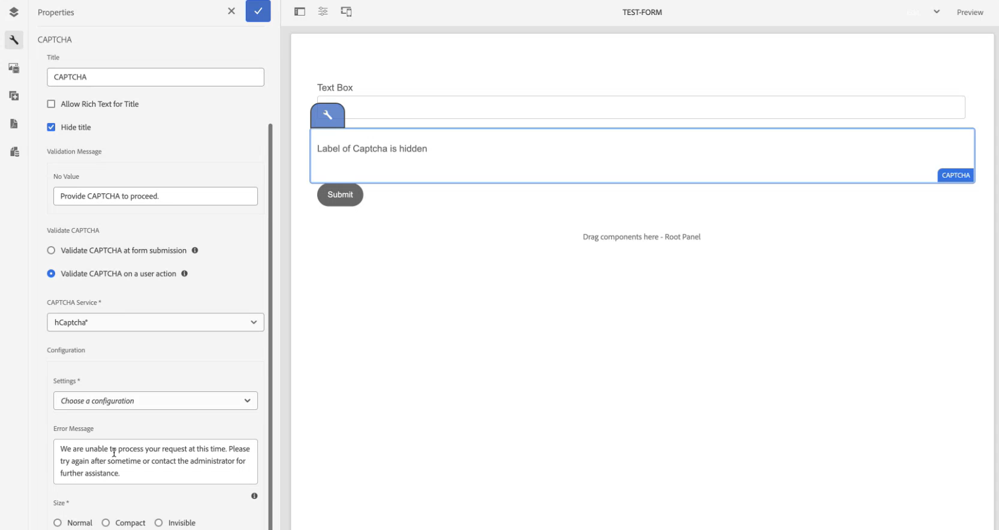

# AEM Forms環境と hCaptcha の接続® {#connect-your-forms-environment-with-hcaptcha-service}

 この機能は早期導入プログラムの対象です。 早期導入プログラムに参加し、機能へのアクセスをリクエストするには、公式メール ID から aem-forms-ea@adobe.com にメールを送信してください。

CAPTCHA（コンピュータと人間を区別する完全に自動化された公開チューリングテスト）は、人間と自動化されたプログラム／ボットを区別するために、オンライントランザクションで一般的に使用されるプログラムです。テストを行ってユーザーの反応を評価し、サイトを使用しているのが人間かボットかを判断します。テストが失敗した場合の続行を防ぎ、ボットによるスパムの投稿や悪意のある目的を防止することで、オンライントランザクションの安全性を高めます。

AEM Forms as a Cloud Service は、次の CAPTCHA ソリューションをサポートしています。

* [hCaptcha](#integrate-aem-forms-environment-with-hcaptcha-captcha)
* [Cloudflare Turnstile](/help/forms/integrate-adaptive-forms-turnstile.md)
* [Google reCAPTCHA](/help/forms/captcha-adaptive-forms.md)

## AEM Forms環境と hCaptcha Captcha の統合

hCaptcha® サービスは、ボット、スパム、自動化された不正使用からフォームを保護します。チェックボックスウィジェットテストを行ってユーザーの反応を評価し、フォームを使用しているのが人間かボットかを判断します。テストが失敗した場合の続行を防ぎ、ボットによるスパムの投稿や悪意のあるアクティビティを防止することで、オンライントランザクションの安全性を高めます。

AEM Formsのas a Cloud Serviceは、アダプティブ Formsの hCaptcha® をサポートしています。 これを使用して、フォーム送信時にチェックボックスウィジェットの課題を表示できます。

<!-- -->

## AEM Forms環境と hCaptcha を統合するための前提条件® {#prerequisite}

AEM Formsで hCaptcha® を設定するには、hCaptcha® web サイトから [hCaptcha® サイトキーと秘密鍵 ](https://docs.hcaptcha.com/switch/#get-your-hcaptcha-sitekey-and-secret-key) を取得する必要があります。

## hCaptcha の設定手順® {#steps-to-configure-hcaptcha}

1. AEM Formsas a Cloud Service環境で設定コンテナを作成します。 設定コンテナには、AEM を外部サービスに接続するために使用されるクラウド設定が格納されます。AEM Forms環境を hCaptcha® に接続するための設定コンテナを作成して設定するには：
   1. AEM Forms as a Cloud Service インスタンスを開きます。
   1. **[!UICONTROL ツール／一般／設定ブラウザー]**&#x200B;に移動します。
   1. 設定ブラウザーで、既存のフォルダーを選択したり、フォルダーを作成したりできます。 フォルダーを作成し、そのフォルダーに対して「クラウド設定」オプションを有効にするか、既存のフォルダーに対して「クラウド設定」オプションを有効にします。

      * **フォルダーを作成し、そのフォルダーの「クラウド設定」オプションを有効にするには**:
         1. 設定ブラウザーで「**[!UICONTROL 作成]**」をタップします。
         1. 設定を作成ダイアログで、名前とタイトルを指定し、「**[!UICONTROL クラウド設定]**」オプションを選択します。
         1. 「**[!UICONTROL 作成]**」をクリックします。
      * 既存のフォルダーに対して「クラウド設定」オプションを有効にするには：
         1. 設定ブラウザーで、フォルダーを選択して「**[!UICONTROL プロパティ]**」を選択します。
         1. 設定プロパティダイアログで、「**[!UICONTROL クラウド設定]**」を有効にします。
         1. 「**[!UICONTROL 保存して閉じる]**」を選択して設定内容を保存し、ダイアログを閉じます。

1. Cloud Service を設定：
   1. AEM オーサーインスタンスで、/**[!UICONTROL Cloud Service]** に移動し、「**[!UICONTROL hCaptcha®]**」を選択します。
      
   1. 前の節で説明したように、作成または更新された設定コンテナを選択します。 「**[!UICONTROL 作成]**」を選択します。
      
   1. hCaptcha® サービスの **[!UICONTROL Title]**、**[!UICONTROL Name]**、**[!UICONTROL Site Key]** および **[!UICONTROL 秘密鍵]** を指定します [ 事前準備で取得 ](#prerequisite)。 「**[!UICONTROL 作成]**」を選択します。

      

>[!NOTE]
> [ クライアントサイドのJavaScript検証 URL](https://docs.hcaptcha.com/#add-the-hcaptcha-widget-to-your-webpage) および [ サーバーサイドの検証 URL](https://docs.hcaptcha.com/#verify-the-user-response-server-side) は、hCaptcha® 検証用に既に入力されているので、変更する必要はありません。 一部の国では、エンドポイントが異なる場合があります。詳しくは、[hCaptcha® FAQ](https://docs.hcaptcha.com/faq#does-hcaptcha-support-access-by-users-in-china) を参照してください。

hCAPTCHA サービスを設定すると、アダプティブフォームで使用できるようになります。

## アダプティブフォームで hCaptcha® を使用する {#using-hCaptcha®-foundation-components}

1. AEM Forms as a Cloud Service インスタンスを開きます。
1. **[!UICONTROL Forms]**／**[!UICONTROL フォームとドキュメント]**&#x200B;に移動します。
1. アダプティブフォームを選択し、**[!UICONTROL プロパティ]** を選択します。 **[!UICONTROL Configuration Container]** オプションについては、AEM Formsと hCaptcha® を接続するクラウド設定が含まれている Configuration Container を選択して、「**[!UICONTROL 保存して閉じる]**」を選択します。

   そのような Configuration Container がない場合に Configuration Container を作成する方法については、[AEM Forms環境と hCaptcha® の接続 ](#connect-your-forms-environment-with-hcaptcha-service) の節を参照してください。

   

1. アダプティブフォームを選択し、「**[!UICONTROL 編集]**」を選択します。 アダプティブフォームエディターでアダプティブフォームが開きます。
1. コンポーネントブラウザーから **[!UICONTROL Captcha]** コンポーネントを、アダプティブフォームにドラッグ＆ドロップします。
1. **[!UICONTROL Captcha]** コンポーネントを選択し、プロパティ  アイコンをクリックします。 プロパティダイアログが開きます。

   

   次のプロパティを指定します。

   * **[!UICONTROL タイトル ]:** Captcha コンポーネントのタイトルを指定すると、フォーム内とルールエディター内の両方で一意の名前を使用して、フォームコンポーネントを簡単に識別できます。
   * **[!UICONTROL 検証メッセージ ]:** フォーム送信時の Captcha 検証の検証メッセージを指定します。
   * **[!UICONTROL Captcha を検証 ]:** Captcha を検証するオプションの 1 つを選択できます。
      * フォーム送信時
      * ユーザー側のアクション
   * **[!UICONTROL Captcha サービス ]:** Captcha サービスを選択します。ここでは、hCaptcha® サービスを選択します。
   * **[!UICONTROL Captcha 設定 ]:** hCaptcha® 用に設定されたクラウド設定を選択します。
     >[!NOTE]
     >同様の目的のために、環境内に複数のクラウド設定を持つことができます。 そのため、サービスは慎重に選択してください。サービスがリストに表示されない場合は、[AEM Forms環境と hCaptcha® の接続 ](#connect-your-forms-environment-with-hcaptcha-service) を参照して、AEM Forms環境と hCaptcha® サービスを接続するCloud Serviceの作成方法を確認してください。

   * **エラーメッセージ：** Captcha 送信が失敗した場合にユーザーに表示するエラーメッセージを指定します。
   * **Captcha サイズ：** hCaptcha® チャレンジダイアログの表示サイズを選択します。 **[!UICONTROL コンパクト]** オプションを使用すると小さいサイズを表示でき、**[!UICONTROL 標準]** オプションを使用すると比較的大きいサイズの hCaptcha® チャレンジダイアログを表示できます。また、**[!UICONTROL 非表示]** を使用すると、ユーザーインターフェイスでチェックボックスウィジェットを明示的にレンダリングせずに hCaptcha® を検証できます。

1. 「**[!UICONTROL 完了]**」を選択します。

現在は、フォームの入力者が hCaptcha® サービスによって発生する課題を正常にクリアした正当なフォームのみがフォーム送信で許可されています。

**hCaptcha® は、Intuition Machines, Inc. の登録商標です。**

## よくある質問

* **Q:1 つのアダプティブフォームで複数の Captcha コンポーネントを使用できますか？**
* **A:** アダプティブフォームでの複数の Captcha コンポーネントの使用はサポートされていません。 また、遅延読み込みのためにマークされたフラグメントまたはパネルで Captcha コンポーネントを使用することはお勧めしません。

## 関連トピック {#see-also}

{{see-also}}
