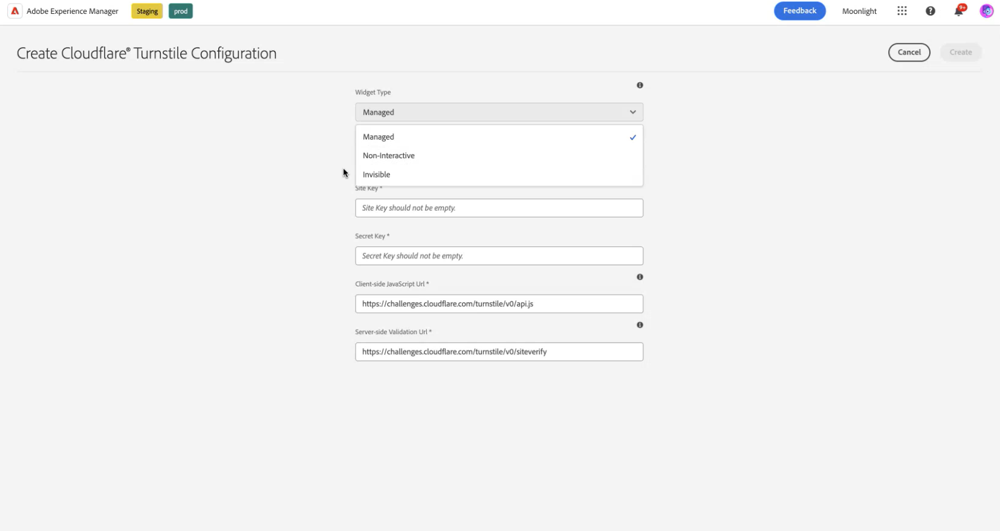
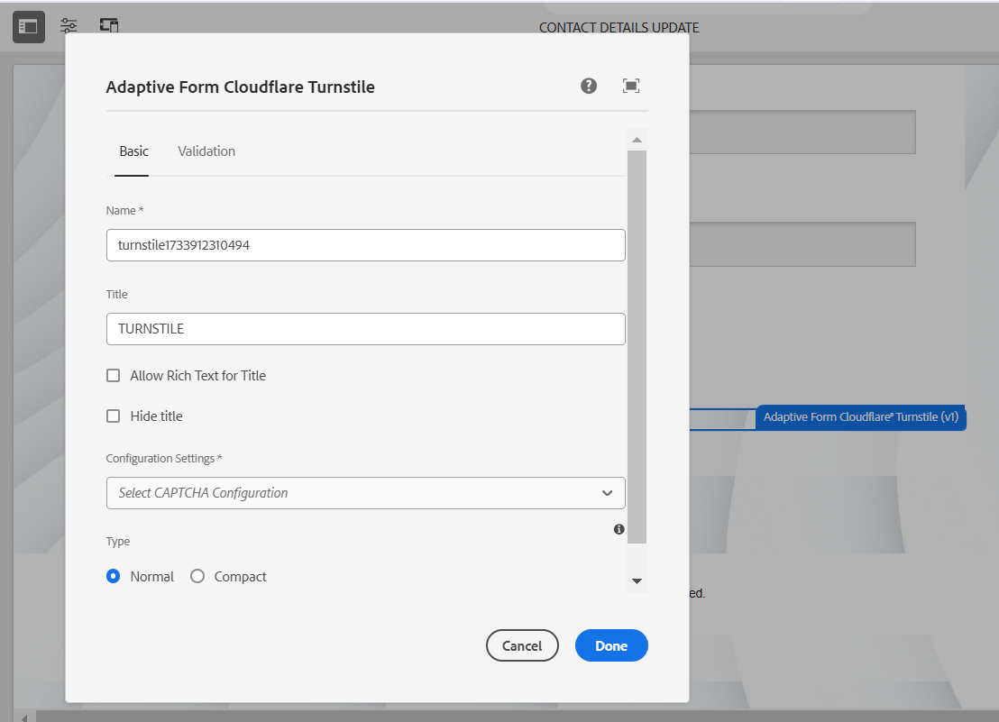

# AEM Forms 環境と Turnstile の接続 {#connect-your-forms-environment-with-turnstile-service}

CAPTCHA（コンピュータと人間を区別する完全に自動化された公開チューリングテスト）は、人間と自動化されたプログラム／ボットを区別するために、オンライントランザクションで一般的に使用されるプログラムです。 テストを行ってユーザーの反応を評価し、サイトを使用しているのが人間かボットかを判断します。 テストが失敗した場合の続行を防ぎ、ボットによるスパムの投稿や悪意のある目的を防止することで、オンライントランザクションの安全性を高めます。

AEM Forms as a Cloud Service は、次の CAPTCHA ソリューションをサポートしています。

* [Turnstile](/help/forms/integrate-adaptive-forms-turnstile-core-components.md)
* [Google reCAPTCHA](/help/forms/captcha-adaptive-forms-core-components.md)
* [hCaptcha](/help/forms/integrate-adaptive-forms-hcaptcha-core-components.md)

<!-- -->

## AEM Forms 環境と Turnstile Captcha の統合

Cloudflare の Turnstile Captcha は、自動ボット、悪意のある攻撃、スパム、不要な自動トラフィックからフォームとサイトを保護することを目的としたセキュリティ対策です。 フォームの送信を許可する前に、フォームの送信時にユーザーが人間であることを確認するチェックボックスが表示されます。 AEM Forms as a Cloud Serviceは、アダプティブ Forms コアコンポーネントのTurnstile Captchaをサポートしています。

### AEM Forms 環境と Turnstile Captcha を統合するための前提条件 {#prerequisite}

AEM Forms コアコンポーネント用にTurnstileを設定するには、Turnstile web サイトから[Turnstile サイトキーと秘密鍵](https://developers.cloudflare.com/turnstile/get-started/)を取得する必要があります。

### Turnstile の設定 {#steps-to-configure-hcaptcha}

AEM Forms を Turnstile サービスと統合するには、次の手順を実行します。

1. AEM Forms as a Cloud Service環境にConfiguration Containerを作成します。 設定コンテナには、AEM を外部サービスに接続するために使用されるクラウド設定が格納されます。 AEM Forms環境をTurnstileに接続するためのConfiguration Containerを作成および設定するには、次の手順に従います。
   1. AEM Forms as a Cloud Service インスタンスを開きます。
   1. **[!UICONTROL ツール／一般／設定ブラウザー]**&#x200B;に移動します。
   1. 設定ブラウザーで、新しいフォルダーを作成し、そのフォルダーのクラウド設定を有効にするか、以下に説明するように、既存のフォルダーのクラウド設定を有効にします。

      * **新しいフォルダー**&#x200B;を作成し、そのフォルダーのクラウド設定を有効にするには、次の手順に従います。
         1. 設定ブラウザーで「**[!UICONTROL 作成]**」をタップします。
         1. 設定を作成ダイアログで、名前、タイトルを指定し、**[!UICONTROL クラウド設定]** オプションを選択します。
         1. 「**[!UICONTROL 作成]**」をクリックします。
      * **既存のフォルダー**&#x200B;に対してクラウド設定オプションを有効にするには：
         1. 設定ブラウザーで、既存のフォルダーを選択し、**[!UICONTROL プロパティ]**&#x200B;をクリックします。
         1. 設定プロパティダイアログで、「**[!UICONTROL クラウド設定]**」を有効にします。
         1. **[!UICONTROL 保存して閉じる]**&#x200B;をクリックして、設定を保存して終了します。

1. Cloud Service を設定：
   1. AEM オーサーインスタンスで、 > **[!UICONTROL Cloud Services]**&#x200B;に移動し、**[!UICONTROL Turnstile]**&#x200B;をクリックします。
      
   1. 前の節で説明したように、作成または更新した設定コンテナを選択します。 「**[!UICONTROL 作成]**」を選択します。      
   1. **[!UICONTROL ウィジェットタイプ]**&#x200B;を管理対象、非インタラクティブまたは非表示として指定します。 ウィジェットタイプについて詳しくは、[&#x200B; ターンスタイルウィジェット &#x200B;](https://developers.cloudflare.com/turnstile/concepts/widget/)をご覧ください。
   1. 前提条件[&#128279;](#prerequisite)で取得したターンスタイルサービス に対して、**[!UICONTROL タイトル]**、**[!UICONTROL 名前]**、**[!UICONTROL サイトキー]**&#x200B;および&#x200B;**[!UICONTROL 秘密鍵]**&#x200B;を指定します。
   1. 「**[!UICONTROL 作成]**」をクリックします。

      

   >[!NOTE]
   >
   > クライアントサイド JavaScript 検証 URL とサーバーサイド検証 URL は、Turnstile 検証用に既に事前入力されているので、ユーザーは変更する必要がありません。

   Turnstile Captcha サービスを設定すると、コアコンポーネント [&#128279;](https://experienceleague.adobe.com/ja/docs/experience-manager-core-components/using/adaptive-forms/introduction)に基づいて アダプティブフォームで使用できるようになります。

## アダプティブフォームでの Turnstile の使用 {#using-turnstile-core-components}

1. AEM Forms as a Cloud Service インスタンスを開きます。
1. **[!UICONTROL Forms]**／**[!UICONTROL フォームとドキュメント]**&#x200B;に移動します。
1. アダプティブフォームを選択し、**[!UICONTROL プロパティ]**&#x200B;をクリックします。 **[!UICONTROL Configuration Container]** セクションで、AEM FormsとTurnstileを接続するCloud Configurationを含むConfiguration Containerを選択します。
1. 「**[!UICONTROL 保存して閉じる]**」をクリックします。

   設定コンテナがない場合は、設定コンテナの作成方法については、「[Turnstile](#steps-to-configure-hcaptcha)の設定」を参照してください。

   

1. アダプティブフォームを選択し、**[!UICONTROL 編集]**&#x200B;をクリックしてフォームをエディターで開きます。
1. コンポーネントブラウザーから、**[!UICONTROL アダプティブフォームのターンスタイル]** コンポーネントをアダプティブフォームにドラッグ&amp;ドロップまたは追加します。
   
1. **[!UICONTROL アダプティブフォームのターンスタイル]** コンポーネントを選択し、プロパティ  アイコンをクリックします。 プロパティダイアログが開きます。 次のプロパティを指定します。

   

   * **[!UICONTROL 名前]:** Captcha コンポーネントの名前を指定すると、フォームとルールエディターの両方で、一意の名前を使用してフォームコンポーネントを簡単に識別できます。
   * **[!UICONTROL タイトル]：** Captcha コンポーネントのタイトルを指定します。 タイトルにリッチテキストを許可したり、チェックボックスをオンにしてタイトルを非表示にしたりできます。
   * **[!UICONTROL 構成設定]:** Turnstile Captcha サービス用に設定されたクラウド設定を選択します。

     >[!NOTE]
     >
     >* 同様の目的で、環境内に複数のクラウド設定を作成することができます。 そのため、サービスは慎重に選択してください。 サービスがリストされていない場合は、[Configure Turnstile](#steps-to-configure-hcaptcha)の節を参照して、AEM Forms環境をTurnstile サービスに接続するためのConfiguration Containerの作成方法を確認してください。

   * **[!UICONTROL 検証]:** エラーメッセージの形式でCaptcha検証を提供します。

      * **エラーメッセージ：** Captchaの送信が失敗したときにユーザーに表示するエラーメッセージを指定します。

        >[!NOTE]
        >
        >* CAPTCHAがクライアント側で入力された場合にのみ、エラーメッセージが表示されます。

1. 「**[!UICONTROL 完了]**」をクリックします。

現在、フォームの入力者は Turnstile サービスによって提供される課題を正常にクリアした正規のフォームのみをフォーム送信できます。

## よくある質問

* **Q：アダプティブフォーム内で複数の Captcha コンポーネントを使用できますか？**
* **A：**&#x200B;アダプティブフォームでは、複数の Captcha コンポーネントを使用することはできません。 また、遅延読み込みのマークが付けられたフラグメントやパネルで Captcha コンポーネントを使用することはお勧めしません。

## 関連トピック {#see-also}

{{see-also}}
