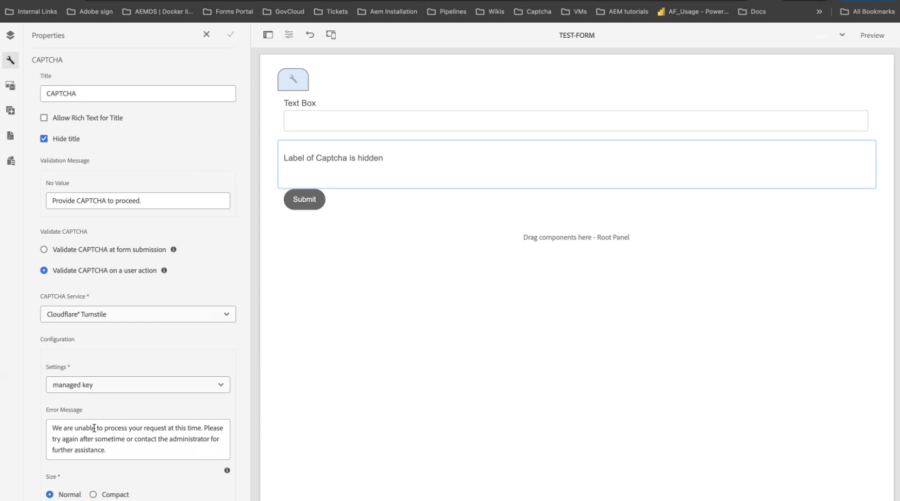

# Turnstile CAPTCHAとAdaptive Formsの統合

CAPTCHA（コンピュータと人間を区別する完全に自動化された公開チューリングテスト）は、人間と自動化されたプログラム／ボットを区別するために、オンライントランザクションで一般的に使用されるプログラムです。 テストを行ってユーザーの反応を評価し、サイトを使用しているのが人間かボットかを判断します。 テストが失敗した場合の続行を防ぎ、ボットによるスパムの投稿や悪意のある目的を防止することで、オンライントランザクションの安全性を高めます。

AEM Forms as a Cloud Service は、次の CAPTCHA ソリューションをサポートしています。

* [Cloudflare Turnstile](#integrate-aem-forms-environment-with-turnstile-captcha)
* [Google reCAPTCHA](/help/forms/captcha-adaptive-forms.md)
* [hCaptcha](/help/forms/integrate-adaptive-forms-hcaptcha.md)

## AEM Forms 環境と Turnstile Captcha の統合

Cloudflare の Turnstile Captcha は、自動ボット、悪意のある攻撃、スパム、不要な自動トラフィックからフォームとサイトを保護することを目的としたセキュリティ対策です。 フォームの送信を許可する前に、フォームの送信時にユーザーが人間であることを確認するチェックボックスが表示されます。 AEM Forms as a Cloud Serviceは、アダプティブ FormsのTurnstile Captchaをサポートしています。

<!-- -->

### AEM Forms 環境と Turnstile Captcha を統合するための前提条件 {#prerequisite}

AEM Forms 用に Turnstile を設定するには、Turnstile web サイトから [Turnstile サイトキーと秘密鍵](https://developers.cloudflare.com/turnstile/get-started/)を取得する必要があります。

### AEM Forms用Turnstileの設定手順{#steps-to-configure-turnstile}

1. AEM Forms as a Cloud Service環境にConfiguration Containerを作成します。 設定コンテナには、AEM を外部サービスに接続するために使用されるクラウド設定が格納されます。 AEM Forms環境をTurnstileに接続するためのConfiguration Containerを作成および設定するには、次の手順を実行します。
   1. AEM Forms as a Cloud Service インスタンスを開きます。
   1. **[!UICONTROL ツール／一般／設定ブラウザー]**&#x200B;に移動します。
   1. 設定ブラウザーでは、既存のフォルダーを選択するか、フォルダーを作成できます。 フォルダーを作成し、そのフォルダーに対してクラウド設定オプションを有効にするか、既存のフォルダーに対してクラウド設定オプションを有効にすることができます。

      * **フォルダーを作成し、そのフォルダーのクラウド設定オプションを有効にするには**:
         1. 設定ブラウザーで「**[!UICONTROL 作成]**」をタップします。
         1. 設定を作成ダイアログで、名前、タイトルを指定し、**[!UICONTROL クラウド設定]** オプションを選択します。
         1. 「**[!UICONTROL 作成]**」をクリックします。
      * 既存のフォルダーに対して「クラウド設定」オプションを有効にするには：
         1. 設定ブラウザーで、フォルダーを選択して「**[!UICONTROL プロパティ]**」を選択します。
         1. 設定プロパティダイアログで、「**[!UICONTROL クラウド設定]**」を有効にします。
         1. 「**[!UICONTROL 保存して閉じる]**」を選択して設定内容を保存し、ダイアログを閉じます。

1. Cloud Service を設定：
   1. AEM オーサーインスタンスで、 > **[!UICONTROL Cloud Services]**&#x200B;に移動し、**[!UICONTROL Turnstile]**&#x200B;を選択します。
      
   1. 前の節で説明したように、作成または更新した設定コンテナを選択します。 「**[!UICONTROL 作成]**」を選択します。      
   1. **[!UICONTROL ウィジェットの種類]**&#x200B;を管理対象として指定します。ウィジェットの種類は、前提条件で取得したキー、**[!UICONTROL タイトル]**、**[!UICONTROL 名前]**、**[!UICONTROL サイトキー]**、および&#x200B;**[!UICONTROL 秘密鍵]**&#x200B;によって異なります。前提条件[&#128279;](#prerequisite)で取得したターンスタイルサービス 。 「**[!UICONTROL 作成]**」を選択します。

      

>[!NOTE]
> クライアントサイド JavaScript 検証 URL とサーバーサイド検証 URL は、Turnstile 検証用に既に事前入力されているので、ユーザーは変更する必要がありません。

Turnstile Captcha サービスを設定すると、アダプティブフォームで使用できるようになります。

## アダプティブフォームでの Turnstile の使用{#using-turnstile-foundation-components}

1. AEM Forms as a Cloud Service インスタンスを開きます。
1. **[!UICONTROL Forms]**／**[!UICONTROL フォームとドキュメント]**&#x200B;に移動します。
1. アダプティブフォームを選択し、**[!UICONTROL プロパティ]**&#x200B;を選択します。 **[!UICONTROL Configuration Container]** オプションで、AEM FormsとTurnstileを接続するCloud Configurationを含むConfiguration Containerを選択し、**[!UICONTROL Save &amp; Close]**&#x200B;を選択します。

   このようなConfiguration Containerがない場合は、Configuration Containerの作成方法については、「[AEM Forms環境とTurnstile](#connect-your-forms-environment-with-turnstile-service)の接続」を参照してください。

   

1. アダプティブフォームを選択し、**[!UICONTROL 編集]**&#x200B;を選択します。 アダプティブフォームエディターでアダプティブフォームが開きます。
1. コンポーネントブラウザーから **[!UICONTROL Captcha]** コンポーネントを、アダプティブフォームにドラッグ＆ドロップします。
1. **[!UICONTROL Captcha]** コンポーネントを選択し、プロパティ  アイコンをクリックします。 プロパティダイアログが開きます。

   

   次のプロパティを指定します。

   * **[!UICONTROL タイトル &#x200B;]:** Captcha コンポーネントのタイトルを指定すると、フォームとルールエディターの両方で、一意の名前を使用してフォームコンポーネントを簡単に識別できます。
   * **[!UICONTROL 検証メッセージ &#x200B;]:** フォーム送信時にCaptchaを検証するための検証メッセージを提供します。
   * **[!UICONTROL Captchaの検証]:**&#x200B;いずれかのオプションを選択して、Captchaを検証できます。
      * フォーム送信時
      * ユーザーアクションで生成されます。
   * **[!UICONTROL Captcha サービス &#x200B;]:** Captcha サービスを選択します。ここでは、Cloudfare Turnstile Captcha サービスを選択します。
   * **[!UICONTROL Captcha設定]:** ターンスタイル用に設定されたクラウド設定を選択します。 例えば、ここでは&#x200B;**マネージドキー**&#x200B;を選択します。

     >[!NOTE]
     >
     > 同様の目的で、環境内に複数のクラウド設定を作成することができます。 そのため、サービスは慎重に選択してください。 サービスが表示されない場合は、[AEM Forms 環境と Turnstile の接続](#connect-your-forms-environment-with-turnstile-service)で、AEM Forms 環境と Turnstile サービスを接続する Cloud Service を作成する方法を参照してください。

   * **エラーメッセージ：** Captchaの送信が失敗したときにユーザーに表示するエラーメッセージを指定します。
   * **Captcha サイズ：** ターンスタイルチャレンジダイアログの表示サイズを選択します。 **[!UICONTROL コンパクト]** オプションを使用して小さいサイズを表示し、**[!UICONTROL 標準]** オプションを使用して、比較的大きいサイズのターンスタイルチャレンジダイアログを表示します。

     >[!NOTE]
     >これは、ウィジェットタイプの管理対象および非インタラクティブに適用できます。 ウィジェットタイプが表示されない場合、size プロパティは必須ではなく、無効になります。

1. 「**[!UICONTROL 完了]**」を選択します。

現在、フォームの入力者は Turnstile サービスによって提供される課題を正常にクリアした正規のフォームのみをフォーム送信できます。

## よくある質問

* **Q：アダプティブフォーム内で複数の Captcha コンポーネントを使用できますか？**
* **A：**&#x200B;アダプティブフォームでは、複数の Captcha コンポーネントを使用することはできません。 また、遅延読み込みのマークが付けられたフラグメントやパネルで Captcha コンポーネントを使用することはお勧めしません。

## 関連トピック {#see-also}

{{see-also}}
