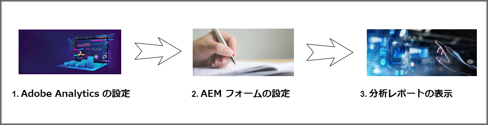
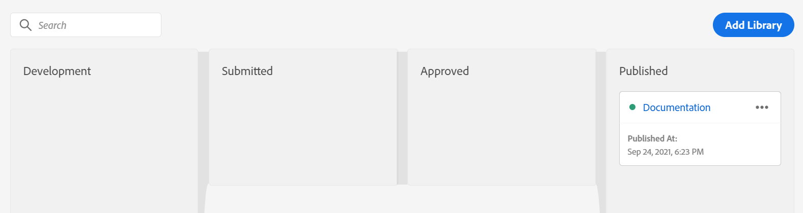
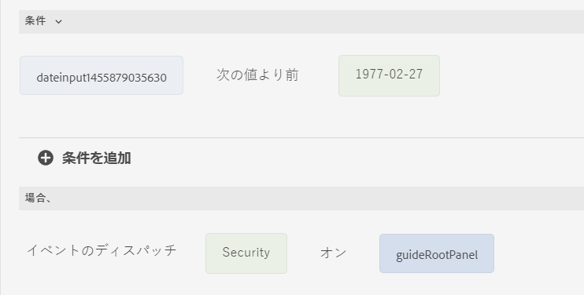

# AEM Forms と [!DNL Adobe Analytics] の統合 {#integrate-aem-forms-with-adobe-analytics}

| バージョン | 記事リンク |
| -------- | ---------------------------- |
| AEM 6.5 | [ここをクリックしてください](https://experienceleague.adobe.com/docs/experience-manager-65/forms/integrate-aem-forms-with-experience-cloud-solutions/configure-analytics-forms-documents.html?lang=ja) |
| AEM as a Cloud Service | この記事 |

<span class="preview">このドキュメントでは、アダプティブフォームで Adobe Analytics を有効にする手動の手順について説明しますが、アドビでは、[Experience Cloud 設定の自動化を使用したアダプティブフォームでの Adobe Analytics の有効化](/help/forms/enable-adobe-analytics-adaptive-form-using-experience-cloud-setup-automation.md)を使用することをお勧めします。</span>

AEM Forms は、[Adobe Analytics](https://experienceleague.adobe.com/docs/analytics-learn/tutorials/overview.html?lang=ja) と統合されているので、公開済みフォームのパフォーマンス指標を取得して追跡できます。これらの指標を分析する目的は、ビジネスユーザーがエンドユーザーの行動に関するインサイトを入手して、データキャプチャエクスペリエンスを最適化できるようにすることです。アダプティブフォームで Adobe Analytics を介してログインしているユーザーとログインしていない（匿名）ユーザーの両方の行動を取得および追跡できます。

この記事で取り上げる操作を実行すると、[!DNL Adobe Analytics] でレポートを設定したり表示したりできます（次のビデオを参照）。

>[!VIDEO](https://video.tv.adobe.com/v/337262)

[!DNL Adobe Analytics] を使用して、アダプティブフォームの使用時に発生するインタラクションのパターンや問題を検出することができます。[!DNL Adobe Analytics] では、標準で次のイベントに関する情報を追跡し保存します。

* **レンダリング**：フォームが開かれた回数。

* **送信**：フォームが送信された回数。

* **中断**：ユーザーがフォームを完了せずに終了した回数。

* **エラー**：パネルおよびパネルのフィールドで発生したエラーの回数。

* **ヘルプ**：ユーザーがパネルおよびパネルのフィールドのヘルプを開いた回数。

* **フィールド訪問**：ユーザーがフォーム内のフィールドを訪問した回数。

* **保存**：ユーザーがフォームポータルにフォームを保存した回数。

これらの標準イベントに加え、ルールエディターを使用してアダプティブフォームでカスタムイベントを定義し、それらのイベントを [!DNL Adobe Analytics] のイベントにマッピングすることができます。

次の図は、[!DNL Adobe Analytics] でレポートを表示する前に実行する必要があるアクションを示しています。



## 1. [!DNL Adobe Analytics] の設定 {#Configure-adobe-analytics}

[!DNL Adobe Analytics] を設定する前に以下を作成します。

* [Adobe Experience Cloud](https://experience.adobe.com/#/home) にログオンするための Adobe ID
* [レポートスイート](https://experienceleague.adobe.com/docs/analytics/admin/manage-report-suites/new-report-suite/t-create-a-report-suite.html?lang=ja)


### AEM Forms と [!DNL Adobe Analytics] の拡張機能のインストール {#install-extensions}

AEM Forms と [Adobe Analytics](https://experienceleague.adobe.com/docs/experience-platform/tags/extensions/adobe/analytics/overview.html?lang=ja) の拡張機能を設定するには、次の手順を実行します。

1. Adobe Experience Cloud にログオンし、会社の名前を選択します。

1. 「**[!UICONTROL Launch／データ収集]**」を選択し、「**[!UICONTROL Launch／データ収集に移動]**」を選択します。

1. 「**[!UICONTROL 新しいプロパティ]**」を選択し、設定の名前を指定します。

1. ドメイン名を指定し、「**[!UICONTROL 保存]**」を選択してプロパティを保存します。

1. タグプロパティのリストで使用可能な設定名を選択します。

1. 「**[!UICONTROL オーサリング]**」セクションで、「**[!UICONTROL 拡張機能]**」を選択します。

1. 「**[!UICONTROL カタログ]**」を選択し、**[!UICONTROL Adobe Experience Manager Forms]** 拡張機能の「**[!UICONTROL インストール]**」を選択します。「**インストール済み**」タブで、使用可能なインストール済み拡張機能のリストに **[!UICONTROL Adobe Experience Manager Forms]** が表示されます。

1. **[!UICONTROL Adobe Analytics]** 拡張機能の「**[!UICONTROL インストール]**」を選択します。
1. 「**[!UICONTROL 開発レポートスイート]**」、「**[!UICONTROL ステージングレポートスイート]**」、「**[!UICONTROL 実稼動レポートスイート]**」の各ドロップダウンリストでレポートスイート名を選択し、「**[!UICONTROL 保存]**」を選択して拡張機能を保存します。

### データ要素の設定 {#configure-data-elements}

イベント用に作成されたルールで、設定済みのデータ要素を選択できます。アダプティブフォームでイベントが発生すると、AEM Forms はこれらのデータ要素を [!DNL Adobe Analytics] に送信します。

**[!UICONTROL Adobe Experience Manager Forms]** 拡張機能をインストールしたら、次のデータ要素を作成できます。

<table>
 <tbody>
  <tr>
   <td>FieldName</th>
   <td>FieldTitle</th>
   <td>FormInstance</th>
  </tr>
  <tr>
   <td>FormName<br /> </td>
   <td>FormTitle<br /> </td>
   <td>PageName</td>
  </tr>
  <tr>
   <td>PageURL<br /> </td>
   <td>PanelTitle<br /> </td>
   <td>TimeSpent</td>
  </tr>
 </tbody>
</table>

データ要素を設定するには、次の手順を実行します。

1. 「**[!UICONTROL オーサリング]**」セクションで、「**[!UICONTROL データ要素]**」を選択します。

1. 「**[!UICONTROL 新規データ要素を作成]**」を選択します。

1. データ要素の名前を指定します。例えば、フォームタイトルデータ要素タイプの場合は「フォームタイトル」などと指定します。

1. 拡張機能名として **[!UICONTROL Adobe Experience Manager Forms]** を指定します。

1. 「**[!UICONTROL データ要素のタイプ]**」を選択します。

1. 「**[!UICONTROL 保存]**」を選択して、データ要素を保存します。

>[!VIDEO](https://video.tv.adobe.com/v/337472)

### ルールの設定 {#configure-rules}

**[!UICONTROL Adobe Experience Manager Forms]** 拡張機能に基づいてルールを作成するには、次の手順を実行します。

1. 「**[!UICONTROL オーサリング]**」セクションで、「**[!UICONTROL ルール]**」を選択します。

1. 「**[!UICONTROL 新規ルールを作成]**」を選択します。

1. ルール名を指定します。例えば、フォーム送信を記録する場合は、「フォーム送信」などと指定します。

1. 「**[!UICONTROL イベント]**」セクションで、「**[!UICONTROL 追加]**」を選択します。

1. 拡張機能名として **[!UICONTROL Adobe Experience Manager Forms]** を指定します。

1. イベントタイプを選択します。「**[!UICONTROL 名前]**」フィールドには、選択したイベントタイプに基づいて自動的に入力されます。

1. 「**[!UICONTROL 変更を保持]**」を選択して、イベントを保存します。

1. 「**[!UICONTROL アクション]**」セクションで、「**[!UICONTROL 追加]**」を選択します。

1. 拡張機能名として「**[!UICONTROL Adobe Analytics]**」を指定します。

1. 「アクションタイプ」として「**[!UICONTROL 変数を設定]**」を選択します。ドロップダウンリストで選択できるオプションは次のとおりです。

   * **[!UICONTROL 変数を設定]**：選択したデータ要素が AEM Forms から [!DNL Adobe Analytics] に送信される際のイベントタイプを定義する場合に使用します。

   * **[!UICONTROL ビーコンを送信]**：AEM Forms から [!DNL Adobe Analytics] にデータを送信する場合に使用します。

   * **[!UICONTROL 変数をクリア]**：データ証跡をクリアして [!DNL Adobe Analytics] へのイベントの登録回数を 1 回だけにする場合に使用します。

     「**[!UICONTROL 変数を設定]**」アクションタイプを使用してイベントとデータ要素を設定したあと、「**[!UICONTROL ビーコンを送信]**」を使用してデータを送信し、「**[!UICONTROL 変数をクリア]**」を使用してデータ証跡をクリアすることをお勧めします。

1. 「**[!UICONTROL prop]**」セクションで、ドロップダウンリストで選択可能なレポートスイートオプションを、[データ要素の設定](#configure-data-elements)で定義したデータ要素にマッピングします。

   例えば、フォームの送信時に AEM Forms から [!DNL Adobe Analytics] に&#x200B;**フォームタイトル**&#x200B;データ要素を送信するには、次のようにします。
   1. 「**[!UICONTROL prop]**」セクションで、レポートスイートで使用可能なフォームタイトルの prop を選択し、を選択して、[データ要素の設定](#configure-data-elements)で作成したフォームタイトルにマッピングします。

      

   1. 「**[!UICONTROL 別の要素を追加]**」を選択して、リストにさらにデータ要素を追加します。

1. 「**[!UICONTROL イベント]**」セクションで、レポートスイートで使用可能なオプションからイベントを選択して、「**[!UICONTROL 変更を保持]**」を選択します。

1. 「**[!UICONTROL アクション]**」セクションで、「+」を選択し、拡張機能名として「**[!UICONTROL Adobe Analytics]**」を指定します。

1. アクションタイプとして「**[!UICONTROL ビーコンを送信]**」を選択します。データを [!DNL Adobe Analytics] に送信してページビューとして扱う場合は、右側のウィンドウで「**[!UICONTROL s.t()]**」を選択します。また、データを [!DNL Adobe Analytics] に送信はするものの、ページビューとして扱わない場合は、「**[!UICONTROL s.tl()]**」を選択します。「**[!UICONTROL 変更を保持]**」を選択します。

1. 「**[!UICONTROL アクション]**」セクションで、「+」を選択し、拡張機能名として「**[!UICONTROL Adobe Analytics]**」を指定します。

1. アクションタイプとして「**[!UICONTROL 変数をクリア]**」を選択します。「**[!UICONTROL 変更を保持]**」を選択します。これらの手順を実行すると、「**[!UICONTROL アクション]**」セクションの表示は次のようになります。
   

   必要に応じて、「**[!UICONTROL アクション]**」セクションをカスタマイズします。例えば、アクションフローで「**ビーコンを送信**」ステップを 2 つ定義して、[!DNL Adobe Analytics] にデータを送信して、一方のステップではデータを [!DNL Adobe Analytics] に送信してページビューとして扱い、もう一方のステップではデータを送信するものの、ページビューとしては扱わない、というようなことが可能です。

   

1. 「**[!UICONTROL 保存]**」を選択して、ルールを保存します。

   中断、エラー、フィールド訪問、ヘルプ、レンダリング、保存、送信などのすべてのイベントタイプに対するルールを作成できます。

>[!VIDEO](https://video.tv.adobe.com/v/337425)


### 公開フロー {#publish-flow}

データ要素を作成してルールで使用したら、[!DNL Adobe Analytics] でフォームデータを収集するための設定を公開します。

設定を公開するには、次の手順を実行します。

1. 「**[!UICONTROL 公開]**」セクションで、「**[!UICONTROL 公開フロー]**」を選択します。

1. 「**[!UICONTROL ライブラリを追加]**」を選択し、名前を指定して、ライブラリの環境を選択します。

1. 「**[!UICONTROL 変更されたすべてのリソースを追加]**」を選択したあと、「**[!UICONTROL 保存して開発用にビルド]**」を選択します。

1. 「**[!UICONTROL 開発]**」セクションで、「」を選択したあと、「**[!UICONTROL 承認して実稼動環境に公開]**」をクリックします。

1. 変更を確認すると、公開フローがすぐに「**[!UICONTROL 公開済み]**」セクションに表示されます。



## 2. AEM Forms の設定 {#configure-aem-forms}

Adobe Launch 設定を作成する前に、[Adobe Launch をクラウドソリューションとして使用して Adobe IMS 設定](https://experienceleague.adobe.com/docs/experience-manager-learn/sites/integrations/experience-platform-launch/connect-aem-launch-adobe-io.html?lang=ja)を作成します。

### Adobe Launch 設定の作成 {#create-adobe-launch-configuration}

Adobe Launch 設定を作成するには、次の手順を実行します。

1. AEM Forms オーサーインスタンスで、**[!UICONTROL ツール]**／**[!UICONTROL クラウドサービス]**／**[!UICONTROL Adobe Launch 設定]**&#x200B;に移動します。

1. 設定を作成するフォルダーを選択して、「**[!UICONTROL 作成]**」を選択します。

1. 「**[!UICONTROL タイトル]**」フィールドで設定のタイトルを指定します。

1. 「[関連付けられている Adobe IMS 設定](https://experienceleague.adobe.com/docs/experience-manager-learn/sites/integrations/experience-platform-launch/connect-aem-launch-adobe-io.html?lang=ja)」を選択します。

1. [Adobe Analytics の設定](#Configure-adobe-analytics) 時に使用した会社の名前を選択します。

1. [Adobe Analytics の設定](#install-extensions) 時に作成したプロパティの名前を選択します。

1. 「**[!UICONTROL 保存して閉じる]**」を選択します。

1. 設定を公開します。

### アダプティブフォームでの [!DNL Adobe Analytics] の有効化 {#enable-analytics-adaptive-form}

既存のアダプティブフォームで [!DNL Adobe Launch] 設定を使用するには、以下を行います。

1. AEM Forms オーサーインスタンスで、**[!UICONTROL Adobe Experience Manager]**／**[!UICONTROL Forms]**／**[!UICONTROL フォームとドキュメント]**&#x200B;に移動します。
1. アダプティブフォームを選択し、「**[!UICONTROL プロパティ]**」を選択します。
1. 「**[!UICONTROL 基本]**」タブで、Adobe Launch 設定の作成時に使用した[設定コンテナ](#create-adobe-launch-configuration)を選択します。
1. 「**[!UICONTROL 保存して閉じる]**」を選択します。アダプティブフォームは [!DNL Adobe Analytics] に対して有効になっています。
1. フォームを公開します。

アダプティブフォームで [!DNL Adobe Analytics] を有効にすると、AEM Forms と [!DNL Adobe Analytics] の間に適切なデータイベントフローがあるかどうかを[検証](https://experienceleague.adobe.com/docs/launch-learn/implementing-in-websites-with-launch/implement-solutions/analytics.html?lang=ja#validate-the-page-view-beacon)できます。AEM Forms と Adobe Analytics の統合が完了しました。これで [Adobe Analytics でのレポートの設定と表示](#view-reports-adobe-analytics)を行えるようになりました。

### カスタムイベントをキャプチャするルールの作成（オプション） {#capture-custom-events}

Analytics データをアダプティブフォームから [!DNL Adobe Analytics] に送信するため、ルールエディターを使用してアダプティブフォームの特定のフィールドに関するルールを作成します。

2 段階のプロセスで、アダプティブフォームのフィールドにルールを定義します。このルールがイベントをディスパッチします。イベントの名前は、Adobe Launch のカスタムキャプチャイベントにマッピングされます。

アダプティブフォームでルールエディターを使用してルールを作成するには、以下を行います。

1. フィールドを選択し、「」をクリックしてルールエディターページを開きます。
1. ルールの「[!UICONTROL 条件]」セクションで条件を定義します。
1. ルールの「[!UICONTROL 場合、]」セクションで、「**[!UICONTROL アクションを選択]**」ドロップダウンリストから「**[!UICONTROL イベントをディスパッチ]**」を選択します。
1. 「**[!UICONTROL イベント名を入力]**」フィールドでイベントの名前を指定します。

例えば、下図では、生年月日が特定の日付より前の場合、AEM Forms は&#x200B;**セキュリティ**&#x200B;イベントをディスパッチします。



イベントを [!DNL Adobe Analytics] のカスタムキャプチャイベントにマッピングするには：

1. [ルールを作成](#configure-rules)します。

1. 「**[!UICONTROL イベント]**」セクションで、「**[!UICONTROL 追加]**」を選択します。

1. 拡張機能名として **[!UICONTROL Adobe Experience Manager Forms]** を指定します。

1. 「**[!UICONTROL イベントタイプ]**」ドロップダウンリストから「**[!UICONTROL カスタムイベントをキャプチャ]**」を選択します。

1. ルールエディターを使用してルールを作成する際に手順 4 で指定したイベントの名前を指定します。

1. 「**変更を保持**」を設定し、[ルールの設定](#configure-rules)で指定した残りのアクションを実行します。

## 3. [!DNL Adobe Analytics] でのレポートの設定と表示 {#view-reports-adobe-analytics}

イベントデータを [!DNL Adobe Analytics] に送信するようにアダプティブフォームを設定したら、[!DNL Adobe Analytics] でレポートの表示を開始できます。

1. 「」を選択し、「**[!UICONTROL Analytics]**」を選択します。

1. 「**[!UICONTROL プロジェクトを作成]**」を選択し、「**[!UICONTROL 空のプロジェクト]**」をクリックします。

1. フリーフォームの右上にあるドロップダウンリストからレポートスイート名を選択します。

1. すべてのフォームタイトルを表示するには、「**[!UICONTROL ディメンション項目を検索]**」テキストボックスで「**フォームタイトル**」を指定します。

1. 「**[!UICONTROL セグメント (または他のコンポーネント) をここにドロップ]**」テキストボックスにアダプティブフォームのタイトルをドロップします。

1. 「**[!UICONTROL 指標]**」セクションで、追跡するイベントを「**[!UICONTROL 指標 (または他のコンポーネント) をここにドロップ]**」テキストボックスにドロップします。

1. 「」を選択し、グラフのタイプを「フリーフォーム」セクションにドロップします。同様に、複数のグラフタイプを「フリーフォーム」セクションに追加できます。

1. Ctrl+S キーを選択し、名前を指定してプロジェクトを保存します。

<!--

## Add AEM Forms and Adobe Analytics integration specific rules to Dispatcher {#forms-specific-rules-to-dispatcher}

Add AEM Forms and Adobe Analytics integration specific rules to filter the data traffic that is sent to the backend.

Perform the following steps to add AEM Forms and Adobe Analytics integration specific rules to Dispatcher for Experience Manager Forms as a Cloud Service:

1. Open your AEM Project and navigate to `\src\conf.dispatcher.d\filters`.
1. Open `filters.any` file for editing and add the following rule at the end of the file:

     ```json
     /00XX { /type "allow" /path "/content/forms/af/*" /method "POST" /selectors '(analyticsconfigparser)' /extension '(jsp|json)' }
     ```

1. Save and close the file.
1. Compile and deploy the project to your [!DNL AEM Forms] as a Cloud Service environment.


## Limitations {#limitations}

* Adobe Analytics can track form metrics only for authenticated users.

-->

>[!MORELIKETHIS]
>
>*[アダプティブフォームへの Adobe Analytics の有効化](/help/forms/enable-adobe-analytics-adaptive-form-using-experience-cloud-setup-automation.md)