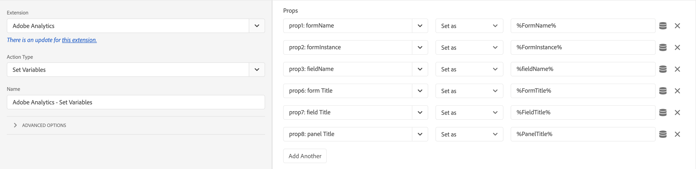
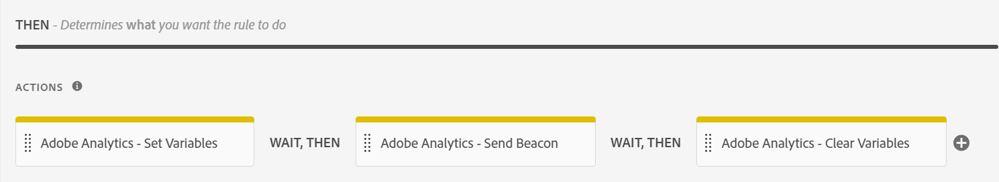
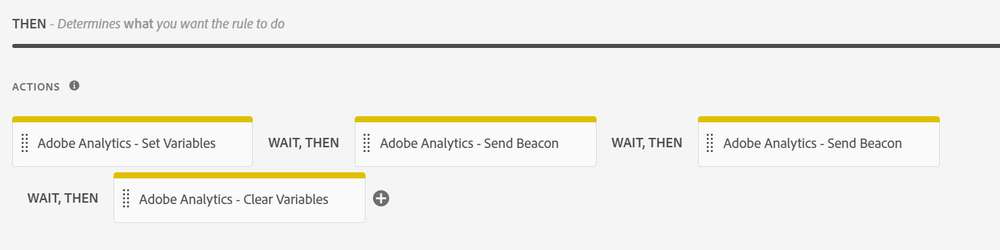
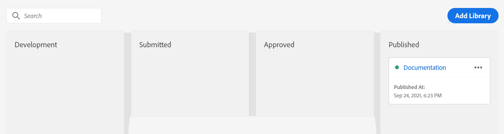
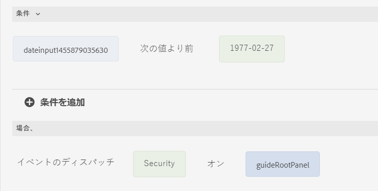

# Adobe AnalyticsおよびAEM Formsを使用したフォーム分析 – 完全ガイド {#integrate-aem-forms-with-adobe-analytics}

## フォーム分析とは？

フォーム分析とは、オーディエンスがフォームをどのように利用しているのかに関するデータを収集、測定、分析する取り組みのことです。 ユーザーの行動に関するインサイトを提供し、フォームの入力プロセスのボトルネックを特定して、フォームを最適化することでコンバージョン率を向上させることができます。

フォーム分析は、単純な送信追跡の枠を超え、ユーザーエクスペリエンスのあらゆる側面を包括的に把握するのに役立ちます。 利用者が個々のフォームフィールド、ナビゲーションパターン、入力行動とどのようにやり取りしているのかを分析することで、ビジネス成果に大きな影響を与える、データ主導の改善を加えることができます。

### フォーム分析の概念

**ユーザーインタラクション トラッキング**
フォーム分析を使用すれば、各フィールドの入力時間、マウスの動き、スクロール時の動作、インタラクションパターンなど、顧客がフォームとどのようにエンゲージメントしているのかに関する詳細な情報を取得できます。 こうした詳細なデータは、ユーザビリティの課題や最適化の機会を特定するのに役立ちます。

**行動パターン分析**
複数のフォームセッションをまたいでユーザーの行動パターンを分析することで、一般的なユーザージャーニー、一般的な離脱ポイント、成功した完了パスなどを特定することができます。 この分析により、実際の利用者のニーズに対応するターゲットを絞った改善が可能になります。

**パフォーマンス測定**
フォーム分析は、コンバージョン率、完了時間、エラー頻度、ユーザー満足度など、フォームの効果を測定する定量的な指標を提供します。 これらの指標により、フォームのパフォーマンスと最適化の影響を客観的に評価できます。

### ビジネスにとってフォーム分析が重要な理由

フォーム分析は、未加工のユーザーインタラクションデータを実用的なビジネスインサイトに変換し、主要なビジネス指標をまたいで測定可能な改善を促進します。

**コンバージョン率最適化**
フォームの放棄は、売上とリードジェネレーションに直接影響を与える重要なビジネス課題です。 調査によると、68%の利用者が入力完了前にフォームを放棄しているため、脱落ポイントの特定にはフォーム分析が不可欠です。 フォーム分析を活用すれば、フォームのパフォーマンスを大幅に向上できる、ターゲットを絞ったコンバージョン最適化戦略を実現できます。 フォーム分析を通じて効果的なコンバージョンを最適化することで、リードジェネレーションと顧客獲得を大幅に改善できます。

**ユーザーエクスペリエンスの改善**
利用者の課題や課題を把握することで、よりスムーズで直感的なフォーム体験を構築することができます。 これにより、顧客満足度の向上、サポートコストの削減、ブランド認知度の向上につながります。

**データに基づく意思決定**
フォーム分析では、仮説やベストプラクティスに頼るのではなく、ユーザー行動分析に関する具体的なデータを提供します。 これにより、エビデンスベースのコンバージョン最適化が可能になり、直感にもとづく変更よりも大幅に優れた結果を得ることができます。 フォームのパフォーマンス追跡によるユーザー行動分析は、最適化の取り組みを、仮定ではなく実際のユーザーニーズに焦点を当てるようにします。

**ROIの測定と正当化**
フォーム分析は、最適化の取り組みの効果を定量化し、ビジネス価値を実証する明確な指標を提供します。 企業は、フォームの改善と、リードジェネレーション、セールスコンバージョン、顧客獲得コストなどのビジネス成果との直接的な相関関係を測定できます。

**競争優位性**
優れたフォーム体験は、顧客獲得における競争上の差別化要因となります。 フォーム分析を利用している企業は、競合他社を上回る優れたユーザー体験を創出し、市場シェアを拡大できます。

### フォーム分析の主要指標

効果的なフォーム分析は、ビジネスの成果に直接影響を与え、最適化のための実用的なインサイトを提供する指標に重点を置いています。

**プライマリ成功指標**

- **フォームのコンバージョン率**：送信が成功したフォームビューの割合 – フォームの効果の最終指標
- **フォーム放棄率**：利用者が脱落する場所と理由。insightを利用して、利用者エクスペリエンスに関する問題を直接把握できます
- **完了時間**：ユーザーがフォームを完了するのにかかる時間。複雑さとユーザーエクスペリエンスの品質を示します

**詳細なパフォーマンス指標**

- **フィールドレベルの分析**：どの特定のフィールドが問題を引き起こすか、ターゲットを絞った最適化の取り組みを有効にする
- **エラー率分析**：検証の問題とユーザーのミスにより、フォームの完了が妨げられています
- **ヘルプの使用パターン**: ユーザーが支援を必要とするタイミングと場所。改善すべき領域を示します

**高度な行動指標**

- **コンバージョン Funnel分析**：複数ステップのフォームを通じたユーザージャーニーで、進行状況とドロップオフのパターンが表示される
- **デバイスとブラウザーのパフォーマンス**：様々なユーザー環境での完了に影響する技術的な要因
- **ユーザーエンゲージメントの深さ**: フォーム、フィールドのインタラクションパターン、ユーザーの注目指標に費やした時間

**ビジネス影響指標**

- **リードの品質相関関係**: フォームの完了動作がリードのコンバージョンと顧客価値にどのように関連しているか
- **トラフィック Source パフォーマンス**：最も質の高いフォーム送信を促進するマーケティングチャネル
- **季節とキャンペーンの影響**：フォームのパフォーマンスがマーケティング活動と外部要因とどのように異なるか

## フォーム分析のビジネス上の利点

フォーム分析を導入することで、複数の側面で測定可能なビジネス価値がもたらされます。 フォーム分析を活用している企業は、通常、コンバージョン率、ユーザー満足度、業務効率が大幅に向上しています。

### &#x200B;1. フォームの放棄を減らし、コンバージョンを増やす

フォームの放棄は、売上とリードジェネレーションに直接影響を与える重要なビジネス課題です。

- **脱落ポイントの特定**: ユーザーがフォームを放棄した場所を正確に追跡して、問題のあるフィールドまたはセクションを特定します
- **フォームフローを最適化**：放棄率が最も高いフィールドを並べ替え、簡略化、削除します
- **A/B テストの改善**：様々なフォームのバリエーションをテストし、完了率に対する影響を測定します
- **モバイル最適化**: フォームの完了を妨げるモバイル固有の問題を特定します
- **リアルタイム監視**：フォームのパフォーマンスが低下すると、すぐにアラートが届きます

**ビジネスへの影響**：企業は通常、分析主導の最適化を実装した後、フォームのコンバージョン率が大幅に向上します。

### &#x200B;2. ユーザーエクスペリエンスと顧客満足度の向上

フォーム分析を通じて、顧客の行動や課題に関する詳細なインサイトを獲得できます。

- **完了時間の短縮**：完了に時間がかかるフィールドを特定し、プロセスを合理化します
- **ユーザーの不満を最小限に抑える**: エラーパターンと検証の問題を追跡して、フォームの使いやすさを向上させます
- **フィールドの順序を最適化**：最も論理的で使いやすい順序でフィールドを配置します
- **ヘルプとガイダンスの改善**：ユーザーが支援を必要とする場所を特定し、ターゲットを絞ったヘルプを提供します
- **クロスデバイス エクスペリエンス**: デスクトップ、タブレット、モバイルデバイスをまたいで一貫したパフォーマンスを確保します

**ビジネスへの影響**：ユーザーエクスペリエンスの向上により、顧客満足度とブランドロイヤルティが向上しました。

### &#x200B;3. データ主導のフォーム改善

フォームを最適化する際に、推測を具体的なデータに置き換える：

- **証拠に基づく決定**：改善の指針として、仮定ではなく実際のユーザー行動データを使用します
- **最適化の影響を測定**: ビフォーアフター分析でフォームの変更の結果を定量化
- **改善を優先**: ビジネス指標に最も大きな影響を与える変更に重点を置く
- **継続的な最適化**: パフォーマンスデータに基づいて継続的な改善サイクルを確立します
- **関係者レポート**: フォームのパフォーマンスとROIを示す具体的な指標を提供します

**ビジネスへの影響**: データ主導の最適化は、通常、直感ベースの変更よりも大幅に優れた結果をもたらします。

### &#x200B;4. リードの質と営業効率を向上

フォーム分析は、フォーム送信の量だけでなく品質も最適化するのに役立ちます。

- **リードスコアリング統合**：フォームの動作とリードの品質およびコンバージョンの可能性を関連付ける
- **Source アトリビューション**：どのトラフィックソースが最も高品質なフォーム送信を生成するかを把握します
- **プログレッシブプロファイリング**：マルチステップフォームを最適化して、より適格なリードを収集します
- **セグメント化インサイト**：価値の高い顧客フォームの行動パターンを特定
- **セールス ハンドオフの最適化**: リード フォームのインタラクションに関するコンテキストを営業部門に提供します

**ビジネスへの影響**：質の高いリードは、セールスコンバージョン率の向上と顧客獲得コストの削減につながります。

### &#x200B;5. 業務効率とコスト削減

フォーム分析は、組織全体の業務改善を促進します。

- **サポートチケットの削減**：カスタマーサービス呼び出しを生成する一般的なフォームの問題を特定して修正します
- **自動最適化**: パフォーマンスのしきい値に基づいて、自動アラートと最適化ルールを設定します
- **リソース配分**：ビジネスへの影響が最も大きいフォームとフィールドに開発リソースを集中させます
- **コンプライアンス監視**：規制とアクセシビリティのコンプライアンスに関するフォームのパフォーマンスを追跡します
- **統合効率**：送信パターンに基づいてフォームからシステムへの統合を最適化します

**ビジネスへの影響**：運用上の改善により、フォーム関連のサポートコストを大幅に削減できます。

### &#x200B;6. 優れたFormsによる競争優位性

フォーム分析を活用すると、業界最高峰のフォーム体験を構築できます。

- **ベンチマークパフォーマンス**：業界標準と競合他社に対するフォームパフォーマンスの比較
- **イノベーションの機会**：競合他社が見逃す可能性のある、固有の最適化機会を特定します
- **顧客維持率**：優れたフォーム体験は、全体的な顧客満足度と顧客維持率に貢献します
- **市場での差別化**: フォーム分析のインサイトを活用して、ユーザーエクスペリエンスにおける競争上の優位性を生み出します
- **スケーラブルな最適化**：複数の製品とキャンペーンで成功したフォームパターンを適用します

**ビジネスへの影響**：優れたフォーム体験は、顧客獲得における競争力のある差別化要因となる可能性があります。

## フォーム分析のユースケースと例

フォーム分析が実際のシナリオにどのように適用されるかを理解することで、最適化の機会を特定し、効果的な測定戦略を導入することができます。 ここでは、さまざまな業界やフォームのタイプで一般的に使用されるユースケースを解説します。

### e コマース/小売Forms

**チェックアウトと支払いForms**

- **課題**：チェックアウトプロセス中にカートの放棄が多すぎると、収益に直接影響する
- **フォーム分析ソリューション**: フィールドごとの完了率とフォームのパフォーマンスを追跡して、フリクション ポイントを特定します
- **一般的な調査結果**：クレジットカードのフィールド、配送先住所の検証、アカウント作成の手順では、多くの場合、フォームの放棄が発生します
- **コンバージョンの最適化結果**：小売企業では、通常、分析主導のフォームパフォーマンスの最適化により、チェックアウトの完了率が大幅に向上しました
- **ユーザー行動分析**: カート放棄パターンを追跡して、チェックアウト中に顧客がいつ、なぜ離脱するのかを把握します
- **ビジネスへの影響**: フォームの放棄が減れば、売上の増加と顧客獲得コストの改善につながります

**製品登録と保証Forms**

- **課題**：製品登録率が低く、カスタマーサポートとマーケティングに影響がある
- **Analytics ソリューション**：完了率を監視し、オプションと必須フィールドの影響を特定
- **最適化戦略**：必須フィールドを減らし、モバイルエクスペリエンスを向上させます
- **ビジネスへの影響**：登録率の向上により、顧客生涯価値とサポート効率が向上

### リードジェネレーションとB2B Forms

**お問い合わせとデモのリクエスト Forms**

- **課題**：リードの質とフォームの完了率のバランスを取り、フォームの放棄を最小限に抑える
- **フォーム分析ソリューション**: フォームのパフォーマンス、フォームの長さ、リードのコンバージョン品質の相関関係を追跡します
- **重要なインサイト**：プログレッシブプロファイリングは、コンバージョンを最適化するために、長いシングルページフォームを上回ることが多い
- **ユーザー行動分析**: フォームの長さが完了率とリード品質スコアに与える影響を監視します
- **コンバージョンの最適化結果**:B2B企業では、フォームパフォーマンスの最適化により、適格なリードジェネレーションが大幅に改善されました
- **ビジネスへの影響**：優れたフォーム分析は、より質の高いリードとセールスコンバージョン率の向上につながります

**ウェビナーとイベント登録**

- **チャレンジ**：必要な情報を収集する際にイベントへの参加を最大化する
- **Analytics ソリューション**：登録完了率と実際の出席率を監視する
- **共通パターン**：フォームが短いと登録者数は増加しますが、出席の質が低下する可能性があります
- **ベストプラクティス**：分析を使用して、フォームの長さと参加者の品質の最適なバランスを見つける

### Financial Services Forms

**ローンとクレジットの申し込み**

- **チャレンジ**：放棄率の高い複雑なマルチステップのアプリケーション
- **分析ソリューション**：各ステップの完了率を追跡し、脱落ポイントを特定します
- **重要なインサイト**：文書のアップロードと所得確認の手順で多くの場合、放棄が発生します
- **最適化戦略**：明確な進行状況インジケーターと保存と再開の機能を提供
- **規制上の考慮事項**:Analyticsは財務データプライバシー要件に準拠する必要があります

**保険見積と請求Forms**

- **チャレンジ**：ユーザーエンゲージメントを維持しながら詳細情報を収集する
- **Analytics ソリューション**：完了までの時間とフィールドレベルのエンゲージメントを監視する
- **主な結果**：自動生成とスマートデフォルトにより、完了率が大幅に向上します
- **ビジネスへの影響**：改善されたフォームの完了率がポリシーのコンバージョン率と直接相関する

### Forms

**患者登録と受診Forms**

- **課題**：包括的な医療情報を効率的に収集する
- **分析ソリューション**：様々な患者デモグラフィックでの完了率の追跡
- **アクセシビリティ フォーカス**：様々なデバイスとアクセシビリティ ツールのパフォーマンスを監視する
- **最適化の優先度**：患者満足度に不可欠なモバイル最適化
- **コンプライアンス要件**：すべての分析実装に必須のHIPAA コンプライアンス

**Formsの予定スケジュール**

- **チャレンジ**：予約プロセスを簡素化しながら、不参加者数を減らします
- **Analytics ソリューション**：フォームの完了動作と予定の出席を関連付ける
- **重要なインサイト**：確認とリマインダーの設定が出席に大きな影響を与える
- **統合の機会**: フォーム分析と予約管理システムを接続します

### Forms教育機関

**申し込みと登録Forms**

- **課題**：ドキュメント要件を含む複雑なマルチステップ アプリケーションの管理
- **Analytics ソリューション**：様々なアプリケーション段階での完了率の追跡
- **クリティカル指標**：完了時間と保存と再開の使用パターン
- **最適化の焦点**：学生アプリケーションにとってモバイル体験がますます重要になっています
- **季節的な考慮事項**：アプリケーション期間中はパフォーマンスが大きく異なります

**コース登録とフィードバック Forms**

- **課題**：管理プロセスで学生のエンゲージメントを最大化
- **Analytics ソリューション**：完了率を監視し、ユーザーエクスペリエンスの問題を特定します
- **重要なインサイト**：学生ポータルとの統合で完了率が向上する
- **継続的な改善**：学期ごとの最適化には、定期的な分析レビューが不可欠です

### 一般的なフォーム分析シナリオ

**マルチステップフォームの最適化**

一般的に、マルチステップフォームは、適切に最適化すれば、シングルページフォームよりもコンバージョン率が86%高くなります。

- **ステップバイステップ分析**：各フォームステップでの完了率の追跡
- **進行状況インジケーターの影響**：進行状況バーが完了率にどのように影響するかを測定
- **使用状況の保存と再開**: ドラフトの保存が最終完了にどのように影響するかを監視します
- **モバイルとデスクトップのパフォーマンス**: デバイス間の完了率の比較

**フィールドレベルのパフォーマンス分析**

- **必須フィールドと任意フィールド**：フィールド要件が完了に与える影響を分析します
- **フィールドオーダー最適化**：最適なフローを得るために、異なるフィールドシーケンスをテストします
- **検証エラーパターン**：一般的なユーザーの間違いを特定し、検証を改善します
- **ヘルプテキストの有効性**：完了率に対するフィールドガイダンスの影響を測定

**季節とキャンペーンのパフォーマンス**

- **Traffic Source Analysis**: マーケティングチャネル間でのフォームパフォーマンスの比較
- **季節のバリエーション**：年間を通じてフォームのパフォーマンスがどのように変化するかを追跡します
- **キャンペーン統合**：フォーム分析とマーケティングキャンペーンのパフォーマンスを関連付ける
- **A/B テスト統合**：分析を使用してテスト バリエーションを測定し、継続的に最適化します

## 実際のフォーム分析の実装シナリオ

特定の実装シナリオを理解することで、さまざまなビジネスコンテキストにフォーム分析を効果的に適用できます。 こうした実例は、フォームパフォーマンスのトラッキングとコンバージョンの最適化が、どのように測定可能なビジネス成果をもたらすのかを示しています。

### E コマースのチェックアウトの最適化

**シナリオ**: オンライン retailerで、チェックアウト中にカートの放棄が多くなりました

- **フォーム分析の実装**: フィールドごとの分析を使用して、フォームレベルでカートの放棄を追跡します
- **主な結果**：クレジットカードの検証手順で支払いフォームの完了率が大幅に低下しました
- **コンバージョン最適化戦略**：支払いフォームの簡素化、進行状況インジケーターの追加、モバイルエクスペリエンスの最適化
- **結果**: フォームの放棄が大幅に減少し、収益が増加しました
- **ユーザー行動分析**：特定されたモバイルユーザーの放棄率が高かったため、モバイルファーストの再設計が行われました

### リードジェネレーションフォームの最適化

**シナリオ**：問い合わせフォームからの質の低いリードで苦慮しているB2B ソフトウェア企業

- **フォームパフォーマンスの課題**：フォームの完了率は高いものの、リードから顧客へのコンバージョン率が低い
- **分析ソリューション**：フォームの完了行動とリードの品質および販売成果を関連付ける
- **最適化アプローチ**：プログレッシブプロファイリングとリードスコアリングの統合を実装
- **ビジネスへの影響**: リードの質を大幅に向上させ、セールスクオリファイドリードを増加
- **コンバージョンの最適化**: リードの選定を改善しながら、フォームの放棄を削減

### 登録とオンボーディングの最適化

**シナリオ**：オンボーディングプロセス中にサインアップの放棄が多いSaaS プラットフォーム

- **ユーザー行動分析**：サインアップ完了率の追跡とオンボーディングのボトルネックの特定
- **フォーム分析インサイト**: アカウントの検証中に大幅なユーザーの放棄が発生しました
- **最適化戦略**：検証プロセスの合理化、保存と再開の機能の追加
- **結果**：サインアップの完了率とユーザーアクティベーション率が大幅に向上しました
- **長期的な影響**：オンボーディングの完了率の向上と、顧客生涯価値の向上との相関関係が生じる

## Adobe Analyticsのフォーム分析機能

Adobe Analyticsのエンタープライズグレードのフォーム追跡機能を利用すれば、オーディエンスのフォーム操作に関する詳細なインサイトを獲得できます。 AEM Formsとのシームレスな連携により、すぐに利用できる強力な分析機能と、ビジネスニーズに合わせて拡張できる高度なカスタマイズオプションの両方を利用できます。

### フォーム分析にAdobe Analyticsを選ぶ理由

**エンタープライズ規模パフォーマンス**
Adobe Analyticsは、パフォーマンスを低下させることなく、数百万ものフォームインタラクションを処理するため、トラフィックの多いweb サイトや複雑なエンタープライズ環境に最適です。 強力なインフラストラクチャにより、ピーク時でも信頼性の高いデータ収集が可能です。

**高度なセグメント化機能**
基本的なフォーム分析ツールとは異なり、Adobe Analyticsでは、行動、デモグラフィック、トラフィックソース、カスタムのビジネス基準などにもとづいて、高度なユーザーセグメンテーションが可能です。 これにより、特定のユーザーグループやシナリオに対応する、ターゲットを絞った最適化戦略を策定できます。

**リアルタイム インサイトとアラート**
リアルタイムのダッシュボードと自動化されたアラートにより、フォームのパフォーマンスを監視できます。 問題を迅速に特定して対応し、フォームの問題やパフォーマンスの低下による売上の潜在的な損失を防ぎます。

### すぐに利用できるトラッキング機能

AEM Formsは、[Adobe Analytics](https://experienceleague.adobe.com/docs/analytics-learn/tutorials/overview.html?lang=ja)とシームレスに統合され、公開されたフォームのパフォーマンス指標を自動的に取得および追跡します。 追加の設定を行うことなく、認証済みユーザーと匿名ユーザーの両方の動作を監視できます。

フォーム分析を実装する前に、[AEM Forms環境が正しく設定されていることを確認します](/help/forms/setup-forms-cloud-service.md)。また、[ コアコンポーネントまたは[基盤コンポーネント ](/help/forms/creating-adaptive-form.md)のいずれかを使用してアダプティブフォームを作成しました](/help/forms/creating-adaptive-form-core-components.md)。

**包括的なフォームイベントの追跡：**

Adobe Analyticsは、ユーザーフォームとのやり取りの全体像を自動的に取得します。

- **フォームレンダリング**: フォームのインプレッションとビューを追跡して、リーチと初期エンゲージメントを把握します
- **フォーム送信**：送信の詳細なコンテキストとユーザージャーニーデータを使用して、正常な完了を監視します
- **フォーム放棄分析**: フィールドレベルの詳細とユーザーセッションのコンテキストを使用して、正確な放棄点を取得します
- **検証エラートラッキング**: エラータイプ、頻度、解決パターンを記録して、ユーザビリティの問題を特定します
- **ヘルプコンテンツの使用状況**: ユーザーがヘルプリソースにアクセスするタイミングを監視し、混乱または複雑な領域を示します
- **フィールドレベルのインタラクション**：個々のフィールドのエンゲージメント、滞在時間、インタラクションパターンを追跡します
- **ドラフトの保存動作**：保存と再開の使用パターンを通じて、ユーザーの意図とフォームの複雑さを理解します
- **クロスセッショントラッキング**：複数のフォームセッションのユーザーを追跡して、完了ジャーニーを把握します

**高度な行動インサイト：**

- **フィールド上の時間分析**: ユーザーが各フォームフィールドに費やした時間を測定して、複雑な問題を特定します
- **マウスの移動パターン**: カーソルの行動分析を通じて、ユーザーのためらいやエンゲージメントを追跡します
- **スクロール深度トラッキング**：ユーザーが長いフォームをどのように移動するかを理解し、最適なフォームの長さを特定します
- **エラー回復パターン**：ユーザーが検証エラーにどのように対応し、回復するかを分析します

### カスタムイベントトラッキング

Adobe Analyticsは、標準的なフォームイベントだけでなく、高度なカスタムトラッキングも可能にします。

- **ビジネス固有の指標**：ルールエディターを使用して、組織固有のフォームインタラクションを追跡するカスタムイベントを定義します
- **ユーザージャーニーマッピング**：カスタムイベントを作成して、マルチステップフォームを通じて複雑なユーザーパスを追跡します
- **コンバージョン Funnel Analysis**：特定のコンバージョンポイントとドロップオフ段階を測定するためのカスタムイベントを設定します
- **統合イベント**：外部システムおよびAPIとのフォームインタラクションを追跡

### 高度なレポート機能

Adobe Analyticsは、エンタープライズ対応のレポート機能を提供し、フォームのパフォーマンスを向上させます。

- **リアルタイム ダッシュボード**: フォームのパフォーマンスとユーザーのインタラクションを監視します
- **セグメント化分析**：様々なユーザーグループ、トラフィックソース、デモグラフィックをまたいでフォームのパフォーマンスを分析します
- **Funnelのビジュアライゼーション**：マルチステップフォームを通じてユーザーの進捗状況を視覚化し、最適化の機会を特定します
- **コホート分析**：時間の経過に伴うフォームのパフォーマンスの向上を追跡し、最適化の影響を測定します
- **クロスデバイストラッキング**：異なるデバイスやセッションでユーザーがフォームをどのように操作しているかを理解します

### 統合の利点

Adobe AnalyticsとAEM Formsの連携には、次のような独自の利点があります。

- **統合データプラットフォーム**: フォーム分析をより広範なweb サイトやマーケティング分析と組み合わせる
- **Adobe Experience Cloudとの統合**:Adobe Target、Campaign、その他のExperience Cloud ソリューションとの連携を活用する
- **エンタープライズセキュリティ**: データプライバシー規制およびエンタープライズセキュリティ要件への組み込みのコンプライアンス
- **スケーラブルアーキテクチャ**：パフォーマンスに影響を与えることなく、大量のフォームインタラクションを処理します
- **プロフェッショナルサポート**:Adobeのエンタープライズサポートおよび最適化サービスへのアクセス

この記事で説明した統合手順を実装した後、次のビデオに示すように、[!DNL Adobe Analytics]で包括的なレポートを設定して表示できます。

>[!VIDEO](https://video.tv.adobe.com/v/337262)

## 追跡すべき主要なフォーム分析指標

フォーム分析の導入を成功させるには、ビジネスの成果に直接影響を与える指標に注力する必要があります。 優先すべき指標を把握することで、データにもとづいた意思決定を促進し、フォームのパフォーマンスを効果的に最適化できます。

### プライマリパフォーマンス指標

**フォームのコンバージョン率**

- **定義**：送信が成功したフォームビューの割合
- **計算**: （フォーム送信/ フォームビュー） × 100
- **ビジネスへの影響**: リードジェネレーションと売上目標と直接相関関係がある
- **最適化ターゲット**：業界とフォームの複雑さによって異なります

**フォーム放棄率**

- **定義**：開始したがフォームを完了しなかったユーザーの割合
- **計算**: （フォーム開始 – フォーム完了） / フォーム開始× 100
- **重要なインサイト**: ユーザーエクスペリエンスの問題と最適化の機会を特定します
- **ベンチマーク**：高い放棄率は、通常、ユーザビリティに大きな問題があることを示します

**平均完了時間**

- **定義**: ユーザーがフォームの入力を開始してから送信するまでの平均時間です
- **分析の焦点**：時間がかかり過ぎて、ユーザーが不満を抱く可能性があるフォームを特定します
- **最適化の目標**：徹底とユーザーエクスペリエンスの効率性のバランス
- **セグメント化**: デバイス、ユーザータイプ、トラフィックソースをまたいで完了時間を比較します

### フィールドレベルの分析

**フィールド放棄率**

- **Measurement**：特定のフィールドでフォームを放棄したユーザーの割合
- **最適化値**：簡略化または削除が必要な問題のあるフィールドを特定します
- **一般的な問題**：複雑な検証要件、不明確な手順、または技術的な問題
- **アクション項目**：放棄率が最も高いフィールドに対して、最適化の取り組みを優先させる

**フィールドインタラクションパターン**

- **クリック率**：特定のフォームフィールドにエンゲージしたユーザーの割合
- **フィールド上の時間**: ユーザーが個々のフィールドに費やす平均時間
- **エラー率**：特定のフィールドの検証エラーの頻度
- **ヘルプの使用状況**：ユーザーが特定のフィールドのヘルプコンテンツにアクセスする頻度

**フィールド完了率**

- **プログレッシブ分析**: ユーザーがフォームフィールドを移動する際の完了率の追跡
- **脱落ID**: ユーザーがフォームを放棄する正確な場所を特定します
- **最適化の優先度**：完了率が最も急激に低下しているフィールドに改善を集中させる

### ユーザーエクスペリエンス指標

**エラー率分析**

- **検証エラー**：フォーム検証エラーの頻度と種類
- **テクニカルエラー**: フォーム機能に影響するシステムレベルの問題
- **ユーザーエラーパターン**：フォームの入力時にユーザーが犯すよくある間違い
- **解決トラッキング**: エラー率の改善が全体的なコンバージョンにどのように影響するかを監視します

**モバイルとデスクトップのパフォーマンス**

モバイルフォームでは、通常、PC版と比較して放棄率が30%高いため、デバイスに特化した最適化が不可欠です。

- **デバイス固有のコンバージョン率**: デバイス タイプ間でのフォーム パフォーマンスの比較
- **レスポンシブデザインへの影響**: モバイルの最適化が完了率に与える影響を測定
- **タッチインターフェイスの使いやすさ**：モバイル固有のインタラクションパターンを分析
- **クロスデバイスジャーニー**：あるデバイスでフォームを開始し、別のデバイスで入力したユーザーを追跡します

**ページ読み込みとパフォーマンス指標**

読み込みが3秒未満のFormsは、動作の遅いフォームと比べて完了率が70%高くなります。

- **フォーム読み込み時間**: フォームが完全にレンダリングされ、インタラクティブになるまでに必要な時間
- **フィールド応答時間**: ユーザー入力とシステム応答の間の待ち時間
- **送信処理時間**: フォーム送信から確認までの期間
- **パフォーマンスへの影響**：読み込み時間と放棄率の相関関係

### 高度な分析指標

**ユーザーセグメンテーション分析**

- **トラフィック Source パフォーマンス**：マーケティングチャネル間でのフォームのコンバージョン率の比較
- **地理的パフォーマンス**：場所と言語ごとにフォームの完了率を分析します
- **ユーザータイプ分析**：新規ユーザーと再ユーザーのパフォーマンスを比較します
- **デモグラフィック情報**：異なるユーザーグループがフォームとどのように関わっているかを理解する

**コンバージョン Funnel Analysis**

- **マルチステップフォームの進行**：複雑なフォームを通じてユーザーの進行を追跡
- **ステージバイステージのコンバージョン**：各フォームステップで完了率を測定
- **Funnel Optimization**：フォームの進行におけるボトルネックを特定して対処する
- **A/B テスト統合**: フォームのバリエーション間でfunnelのパフォーマンスを比較します

**ビジネス影響指標**

- **リード品質スコアリング**：フォームの完了行動とリードのコンバージョン率を関連付けます
- **収益アトリビューション**: フォーム送信を実際のビジネス成果に結び付ける
- **顧客生涯価値**：異なるフォームを通じて獲得したユーザーの長期的な価値を分析します
- **顧客獲得単価**: フォームパフォーマンスデータに基づいてマーケティング効率を計算

次の図は、[!DNL Adobe Analytics] でレポートを表示する前に実行する必要があるアクションを示しています。


## AEM Forms用のForm Analyticsの設定

Adobe AnalyticsおよびAEM Formsでフォーム分析を導入するには、複数のコンポーネントをまたいだ体系的な設定が必要です。 このセクションでは、包括的な設定ガイダンス、前提条件、実装を成功させるためのベストプラクティスを提供します。

### 前提条件と要件

フォーム分析の実装を開始する前に、環境が次の要件を満たしていることを確認してください。

>[!NOTE]
>
>セットアップ中に問題が発生した場合は、インストールと設定の問題について、包括的な[AEM Forms トラブルシューティングガイド ](/help/forms/troubleshooting-installation-and-configuration.md)を参照してください。

**Adobe Experience Cloud Access**

- Adobe Analytics ライセンスを使用した有効なAdobe Experience Cloud組織
- Adobe AnalyticsおよびAEM Forms環境への管理アクセス
- タグ管理と設定のためのAdobe Launch （データ収集）アクセス

**AEM Forms Environment**

- [AEM Forms as a Cloud Service](/help/forms/setup-forms-cloud-service.md)またはAEM Forms 6.5以降（オンプレミス/AMS インストール）
- Formsのオーサリングおよび公開機能が有効になっている
- お使いのAEM環境で[Forms オプションが使用可能であることを確認します](/help/forms/troubleshooting-installation-and-configuration.md#forms-option-is-unavailable)
- [ アダプティブ Forms コアコンポーネント ](/help/forms/creating-adaptive-form-core-components.md)または[基盤コンポーネント ](/help/forms/creating-adaptive-form.md)が利用可能です

**技術要件**

- フォーム分析トラッキングに対応したJavaScriptを備えた最新のweb ブラウザー
- 安全なデータ転送のためのHTTPS プロトコルの実装
- Adobe Analytics データ収集のための適切なファイアウォールとネットワーク設定

**権限とアクセス**

- レポートスイート設定のAdobe Analytics管理者ロール
- フォーム設定と公開に対するAEM Forms オーサー権限
- Adobe Launchへの開発者アクセス権（タグ実装とルール作成）

### ステップバイステップ実装ガイド

#### &#x200B;1. Adobe Analytics の設定 {#Configure-adobe-analytics}

[!DNL Adobe Analytics] を設定する前に以下を作成します。

- [Adobe Experience Cloud](https://experience.adobe.com/#/home) にログオンするための Adobe ID
- [レポートスイート](https://experienceleague.adobe.com/docs/analytics/admin/manage-report-suites/new-report-suite/t-create-a-report-suite.html?lang=ja)


### AEM Forms と [!DNL Adobe Analytics] の拡張機能のインストール {#install-extensions}

AEM Forms と [Adobe Analytics](https://experienceleague.adobe.com/docs/experience-platform/tags/extensions/adobe/analytics/overview.html?lang=ja) の拡張機能を設定するには、次の手順を実行します。

1. Adobe Experience Cloud にログオンし、会社の名前を選択します。

1. 「**[!UICONTROL Launch／データ収集]**」を選択し、「**[!UICONTROL Launch／データ収集に移動]**」を選択します。

1. 「**[!UICONTROL 新しいプロパティ]**」を選択し、設定の名前を指定します。

1. ドメイン名を指定し、「**[!UICONTROL 保存]**」を選択してプロパティを保存します。

1. タグプロパティのリストで使用可能な設定名を選択します。

1. 「**[!UICONTROL オーサリング]**」セクションで、「**[!UICONTROL 拡張機能]**」を選択します。

1. 「**[!UICONTROL カタログ]**」を選択し、**[!UICONTROL Adobe Experience Manager Forms]** 拡張機能の「**[!UICONTROL インストール]**」を選択します。 「**インストール済み**」タブで、使用可能なインストール済み拡張機能のリストに **[!UICONTROL Adobe Experience Manager Forms]** が表示されます。

1. **[!UICONTROL Adobe Analytics]** 拡張機能の「**[!UICONTROL インストール]**」を選択します。
1. 「**[!UICONTROL 開発レポートスイート]**」、「**[!UICONTROL ステージングレポートスイート]**」、「**[!UICONTROL 実稼動レポートスイート]**」の各ドロップダウンリストでレポートスイート名を選択し、「**[!UICONTROL 保存]**」を選択して拡張機能を保存します。

### データ要素の設定 {#configure-data-elements}

イベント用に作成されたルールで、設定済みのデータ要素を選択できます。 アダプティブフォームでイベントが発生すると、AEM Forms はこれらのデータ要素を [!DNL Adobe Analytics] に送信します。

**[!UICONTROL Adobe Experience Manager Forms]** 拡張機能をインストールしたら、次のデータ要素を作成できます。

<table>
 <tbody>
  <tr>
   <td>PageTitle</td>
   <td>PageURL</td>
   <td>PageName</td>
  </tr>
  <tr>
   <td>FieldTitle</td>
   <td>PanelTitle</td>
   <td></td>
  </tr>
 </tbody>
</table>

**PageTitle**、**PageURL**、**PageName**、**FieldTitle**、**PanelTitle**&#x200B;のデータ要素は、複数ページのアダプティブフォームのページレベルおよびフィールドレベルのコンテキストをキャプチャします。 **PageTitle**&#x200B;と&#x200B;**PageName**&#x200B;を使用して現在のフォームページまたはパネルを特定し、**PageURL**&#x200B;を使用してフォームがレンダリングされるURLを記録し、**FieldTitle**&#x200B;と&#x200B;**PanelTitle**&#x200B;を使用して、アクティブなフィールドとその含まれるパネルのラベルを報告します。

>[!NOTE]
>
> また、[基盤コンポーネント ](/help/forms/creating-adaptive-form.md)で構築されたアダプティブフォームの場合、ユーザーがブラウザーコンソールでデータを表示する場合は、`window.formAnalytics` オブジェクトを使用します。

データ要素を設定するには、次の手順を実行します。

1. 「**[!UICONTROL オーサリング]**」セクションで、「**[!UICONTROL データ要素]**」を選択します。

1. 「**[!UICONTROL 新規データ要素を作成]**」を選択します。

1. データ要素の名前を指定します。 例えば、PageTitle データ要素タイプのページタイトルです。

1. 拡張機能名として **[!UICONTROL Adobe Experience Manager Forms]** を指定します。

1. 「**[!UICONTROL データ要素のタイプ]**」を選択します。

1. 「**[!UICONTROL 保存]**」を選択して、データ要素を保存します。

>[!VIDEO](https://video.tv.adobe.com/v/337472)

### ルールの設定 {#configure-rules}

**[!UICONTROL Adobe Experience Manager Forms]** 拡張機能に基づいてルールを作成するには、次の手順を実行します。

1. 「**[!UICONTROL オーサリング]**」セクションで、「**[!UICONTROL ルール]**」を選択します。

1. 「**[!UICONTROL 新規ルールを作成]**」を選択します。

1. ルール名を指定します。 例えば、フォーム送信を記録する場合は、「フォーム送信」などと指定します。

1. 「**[!UICONTROL イベント]**」セクションで、「**[!UICONTROL 追加]**」を選択します。

1. 拡張機能名として **[!UICONTROL Adobe Experience Manager Forms]** を指定します。

1. イベントタイプを選択します。 「**[!UICONTROL 名前]**」フィールドには、選択したイベントタイプに基づいて自動的に入力されます。

1. 「**[!UICONTROL 変更を保持]**」を選択して、イベントを保存します。

1. 「**[!UICONTROL アクション]**」セクションで、「**[!UICONTROL 追加]**」を選択します。

1. 拡張機能名として「**[!UICONTROL Adobe Analytics]**」を指定します。

1. 「アクションタイプ」として「**[!UICONTROL 変数を設定]**」を選択します。 ドロップダウンリストで選択できるオプションは次のとおりです。

   - **[!UICONTROL 変数を設定]**：選択したデータ要素が AEM Forms から [!DNL Adobe Analytics] に送信される際のイベントタイプを定義する場合に使用します。

   - **[!UICONTROL ビーコンを送信]**：AEM Forms から [!DNL Adobe Analytics] にデータを送信する場合に使用します。

   - **[!UICONTROL 変数をクリア]**：データ証跡をクリアして [!DNL Adobe Analytics] へのイベントの登録回数を 1 回だけにする場合に使用します。

     「**[!UICONTROL 変数を設定]**」アクションタイプを使用してイベントとデータ要素を設定したあと、「**[!UICONTROL ビーコンを送信]**」を使用してデータを送信し、「**[!UICONTROL 変数をクリア]**」を使用してデータ証跡をクリアすることをお勧めします。

1. 「**[!UICONTROL prop]**」セクションで、ドロップダウンリストで選択可能なレポートスイートオプションを、[データ要素の設定](#configure-data-elements)で定義したデータ要素にマッピングします。

   例えば、フォームの送信時に AEM Forms から [!DNL Adobe Analytics] に&#x200B;**フォームタイトル**&#x200B;データ要素を送信するには、次のようにします。
   1. 「**[!UICONTROL prop]**」セクションで、レポートスイートで使用可能なフォームタイトルの prop を選択し、を選択して、[データ要素の設定](#configure-data-elements)で作成したフォームタイトルにマッピングします。

      

   1. 「**[!UICONTROL 別の要素を追加]**」を選択して、リストにさらにデータ要素を追加します。

1. 「**[!UICONTROL イベント]**」セクションで、レポートスイートで使用可能なオプションからイベントを選択して、「**[!UICONTROL 変更を保持]**」を選択します。

1. 「**[!UICONTROL アクション]**」セクションで、「+」を選択し、拡張機能名として「**[!UICONTROL Adobe Analytics]**」を指定します。

1. アクションタイプとして「**[!UICONTROL ビーコンを送信]**」を選択します。 データを [!DNL Adobe Analytics] に送信してページビューとして扱う場合は、右側のウィンドウで「**[!UICONTROL s.t()]**」を選択します。また、データを [!DNL Adobe Analytics] に送信はするものの、ページビューとして扱わない場合は、「**[!UICONTROL s.tl()]**」を選択します。 「**[!UICONTROL 変更を保持]**」を選択します。

1. 「**[!UICONTROL アクション]**」セクションで、「+」を選択し、拡張機能名として「**[!UICONTROL Adobe Analytics]**」を指定します。

1. アクションタイプとして「**[!UICONTROL 変数をクリア]**」を選択します。 「**[!UICONTROL 変更を保持]**」を選択します。 これらの手順を実行すると、「**[!UICONTROL アクション]**」セクションの表示は次のようになります。   

   必要に応じて、「**[!UICONTROL アクション]**」セクションをカスタマイズします。 例えば、アクションフローで「**ビーコンを送信**」ステップを 2 つ定義して、[!DNL Adobe Analytics] にデータを送信して、一方のステップではデータを [!DNL Adobe Analytics] に送信してページビューとして扱い、もう一方のステップではデータを送信するものの、ページビューとしては扱わない、というようなことが可能です。

   

1. 「**[!UICONTROL 保存]**」を選択して、ルールを保存します。

   中断、エラー、フィールド訪問、ヘルプ、レンダリング、保存、送信などのすべてのイベントタイプに対するルールを作成できます。

>[!VIDEO](https://video.tv.adobe.com/v/337425)


### 公開フロー {#publish-flow}

データ要素を作成してルールで使用したら、[!DNL Adobe Analytics] でフォームデータを収集するための設定を公開します。

設定を公開するには、次の手順を実行します。

1. 「**[!UICONTROL 公開]**」セクションで、「**[!UICONTROL 公開フロー]**」を選択します。

1. 「**[!UICONTROL ライブラリを追加]**」を選択し、名前を指定して、ライブラリの環境を選択します。

1. 「**[!UICONTROL 変更されたすべてのリソースを追加]**」を選択したあと、「**[!UICONTROL 保存して開発用にビルド]**」を選択します。

1. 「**[!UICONTROL 開発]**」セクションで、「」を選択したあと、「**[!UICONTROL 承認して実稼動環境に公開]**」をクリックします。

1. 変更を確認すると、公開フローがすぐに「**[!UICONTROL 公開済み]**」セクションに表示されます。



## &#x200B;2. AEM Forms の設定 {#configure-aem-forms}

Adobe Launch 設定を作成する前に、[Adobe Launch をクラウドソリューションとして使用して Adobe IMS 設定](https://experienceleague.adobe.com/docs/experience-manager-learn/sites/integrations/experience-platform-launch/connect-aem-launch-adobe-io.html?lang=ja)を作成します。

### Adobe Launch 設定の作成 {#create-adobe-launch-configuration}

Adobe Launch 設定を作成するには、次の手順を実行します。

1. AEM Forms オーサーインスタンスで、**[!UICONTROL ツール]**／**[!UICONTROL クラウドサービス]**／**[!UICONTROL Adobe Launch 設定]**&#x200B;に移動します。

1. 設定を作成するフォルダーを選択して、「**[!UICONTROL 作成]**」を選択します。

1. 「**[!UICONTROL タイトル]**」フィールドで設定のタイトルを指定します。

1. 「[関連付けられている Adobe IMS 設定](https://experienceleague.adobe.com/docs/experience-manager-learn/sites/integrations/experience-platform-launch/connect-aem-launch-adobe-io.html?lang=ja)」を選択します。

1. [Adobe Analytics の設定](#Configure-adobe-analytics) 時に使用した会社の名前を選択します。

1. [Adobe Analytics の設定](#install-extensions) 時に作成したプロパティの名前を選択します。

1. 「**[!UICONTROL 保存して閉じる]**」を選択します。

1. 設定を公開します。

### アダプティブフォームでの [!DNL Adobe Analytics] の有効化 {#enable-analytics-adaptive-form}

既存のアダプティブフォームで [!DNL Adobe Launch] 設定を使用するには、以下を行います。

1. AEM Forms オーサーインスタンスで、**[!UICONTROL Adobe Experience Manager]**／**[!UICONTROL Forms]**／**[!UICONTROL フォームとドキュメント]**&#x200B;に移動します。
1. アダプティブフォームを選択し、「**[!UICONTROL プロパティ]**」を選択します。
1. 「**[!UICONTROL 基本]**」タブで、Adobe Launch 設定の作成時に使用した[設定コンテナ](#create-adobe-launch-configuration)を選択します。
1. 「**[!UICONTROL 保存して閉じる]**」を選択します。 アダプティブフォームは [!DNL Adobe Analytics] に対して有効になっています。
1. フォームを公開します。

アダプティブフォームで [!DNL Adobe Analytics] を有効にすると、AEM Forms と [!DNL Adobe Analytics] の間に適切なデータイベントフローがあるかどうかを[検証](https://experienceleague.adobe.com/docs/launch-learn/implementing-in-websites-with-launch/implement-solutions/analytics.html?lang=ja#validate-the-page-view-beacon)できます。 AEM Forms と Adobe Analytics の統合が完了しました。 これで [Adobe Analytics でのレポートの設定と表示](#view-reports-adobe-analytics)を行えるようになりました。

### カスタムイベントをキャプチャするルールの作成（オプション） {#capture-custom-events}

Analytics データをアダプティブフォームから [!DNL Adobe Analytics] に送信するため、ルールエディターを使用してアダプティブフォームの特定のフィールドに関するルールを作成します。

2 段階のプロセスで、アダプティブフォームのフィールドにルールを定義します。 このルールがイベントをディスパッチします。 イベントの名前は、Adobe Launch のカスタムキャプチャイベントにマッピングされます。

アダプティブフォームでルールエディターを使用してルールを作成するには、以下を行います。

1. フィールドを選択し、「」をクリックしてルールエディターページを開きます。
1. ルールの「[!UICONTROL 条件]」セクションで条件を定義します。
1. ルールの「[!UICONTROL 場合、]」セクションで、「**[!UICONTROL アクションを選択]**」ドロップダウンリストから「**[!UICONTROL イベントをディスパッチ]**」を選択します。
1. 「**[!UICONTROL イベント名を入力]**」フィールドでイベントの名前を指定します。

例えば、下図では、生年月日が特定の日付より前の場合、AEM Forms は&#x200B;**セキュリティ**&#x200B;イベントをディスパッチします。



イベントを [!DNL Adobe Analytics] のカスタムキャプチャイベントにマッピングするには：

1. [ルールを作成](#configure-rules)します。

1. 「**[!UICONTROL イベント]**」セクションで、「**[!UICONTROL 追加]**」を選択します。

1. 拡張機能名として **[!UICONTROL Adobe Experience Manager Forms]** を指定します。

1. 「**[!UICONTROL イベントタイプ]**」ドロップダウンリストから「**[!UICONTROL カスタムイベントをキャプチャ]**」を選択します。

1. ルールエディターを使用してルールを作成する際に手順 4 で指定したイベントの名前を指定します。

1. 「**変更を保持**」を設定し、[ルールの設定](#configure-rules)で指定した残りのアクションを実行します。

## &#x200B;3. [!DNL Adobe Analytics]でのレポートの設定と表示 {#view-reports-adobe-analytics}

イベントデータを [!DNL Adobe Analytics] に送信するようにアダプティブフォームを設定したら、[!DNL Adobe Analytics] でレポートの表示を開始できます。

1. 「」を選択し、「**[!UICONTROL Analytics]**」を選択します。

1. 「**[!UICONTROL プロジェクトを作成]**」を選択し、「**[!UICONTROL 空のプロジェクト]**」をクリックします。

1. フリーフォームの右上にあるドロップダウンリストからレポートスイート名を選択します。

1. すべてのフォームタイトルを表示するには、「**[!UICONTROL ディメンション項目を検索]**」テキストボックスで「**フォームタイトル**」を指定します。

1. 「**[!UICONTROL セグメント (または他のコンポーネント) をここにドロップ]**」テキストボックスにアダプティブフォームのタイトルをドロップします。

1. 「**[!UICONTROL 指標]**」セクションで、追跡するイベントを「**[!UICONTROL 指標 (または他のコンポーネント) をここにドロップ]**」テキストボックスにドロップします。

1. 「」を選択し、グラフのタイプを「フリーフォーム」セクションにドロップします。 同様に、複数のグラフタイプを「フリーフォーム」セクションに追加できます。

1. Ctrl+S キーを選択し、名前を指定してプロジェクトを保存します。

<!--

## Add AEM Forms and Adobe Analytics integration specific rules to Dispatcher {#forms-specific-rules-to-dispatcher}

Add AEM Forms and Adobe Analytics integration specific rules to filter the data traffic that is sent to the backend.

Perform the following steps to add AEM Forms and Adobe Analytics integration specific rules to Dispatcher for Experience Manager Forms as a Cloud Service:

1. Open your AEM Project and navigate to `\src\conf.dispatcher.d\filters`.
1. Open `filters.any` file for editing and add the following rule at the end of the file:

     ```json
     /00XX { /type "allow" /path "/content/forms/af/*" /method "POST" /selectors '(analyticsconfigparser)' /extension '(jsp|json)' }
     ```

1. Save and close the file.
1. Compile and deploy the project to your [!DNL AEM Forms] as a Cloud Service environment.


## Limitations {#limitations}

* Adobe Analytics can track form metrics only for authenticated users.

-->

## 高度なフォーム分析設定

Adobe Analyticsでは、基本的な設定だけでなく、高度なフォーム追跡機能や分析機能を可能にする高度な設定オプションも提供しています。 これらの高度な機能は、より詳細なインサイトを獲得し、複雑な分析シナリオを実装するのに役立ちます。

### カスタムイベントとトラッキング

**カスタムフォームイベントの作成**

カスタムイベントにより、標準的なフォーム分析を超えた、企業固有のインタラクションを追跡できます。

- **ビジネスプロセスイベント**：特定のビジネスワークフローに沿ったフォームインタラクションの追跡
- **ユーザーエンゲージメントイベント**：フォームのプレビュー、フィールドヘルプの使用、セクションの完了など、高度なユーザーの行動を測定します
- **統合イベント**：外部システム、API、またはサードパーティサービスとのフォームインタラクションを監視します
- **パフォーマンスイベント**: フォームの読み込み時間やフィールドの応答率などのカスタムパフォーマンス指標を追跡します

**実装アプローチ**

1. **ビジネス要件を定義**: ビジネス価値を提供する特定のフォームのインタラクションを特定します
2. **カスタム変数を作成**：企業固有のデータ用にAdobe Analyticsでカスタム eVarとpropを設定します
3. **ルールエディターの設定**: AEM Forms ルールエディターを使用して、フォームインタラクションに基づいてカスタムイベントをトリガーします
4. **Analytics イベントへのマッピング**: カスタムフォームイベントをAdobe Analytics イベントトラッキングに接続します
5. **実装の検証**：カスタムイベントをテストして、正確なデータ収集とレポートを確認します

### 高度なレポート設定

**多次元分析の設定**

- **クロスフォーム分析**：様々なフォームタイプとビジネスプロセスのパフォーマンスを比較します
- **ユーザージャーニーマッピング**：複数のフォームとタッチポイントをまたいだユーザーインタラクションの追跡
- **アトリビューションモデリング**：異なるマーケティングチャネルがフォームの完了にどのように貢献しているかを理解します
- **コホート分析**：時間とユーザーセグメントの経過に伴うフォームのパフォーマンスの向上を分析します

**リアルタイム レポート設定**

- **ライブダッシュボード設定**: リアルタイムのフォームパフォーマンス監視の設定
- **アラート設定**: フォームのパフォーマンスの問題や異常に対する自動アラートを設定します
- **パフォーマンスしきい値**：許容可能なパフォーマンス範囲とモニタリングトリガーを定義します
- **関係者レポート**：様々な組織の役割と責任に関する自動レポートを作成します

### 他のAdobeツールとの連携

**Adobe Target統合**

- **フォーム A/B テスト**：異なるフォームのバリエーションをテストし、パフォーマンスへの影響を測定します
- **Personalization**：ユーザーの行動と分析データに基づいて、パーソナライズされたフォーム エクスペリエンスを配信します
- **最適化**：分析インサイトを使用して、Target最適化戦略に情報を提供します
- **コンバージョンの最適化**：フォーム分析をより幅広いコンバージョンの最適化の取り組みと組み合わせる

**Adobe Campaign統合**

- **リードナーチャリング**: フォーム分析データを使用して、メールマーケティングとリードナーチャリングキャンペーンに情報を提供します
- **セグメント化**: フォームの完了行動とエンゲージメントパターンに基づいてユーザーセグメントを作成します
- **キャンペーンアトリビューション**: マーケティングキャンペーンがフォームのパフォーマンスと完了率にどのように影響しているかを追跡します
- **ライフサイクルマーケティング**: フォーム分析をより広範な顧客ライフサイクルマーケティング戦略と統合する

## フォーム分析のレポートとインサイト

フォーム分析データの解釈と処理方法を理解することは、最適化を成功させるために不可欠です。 このセクションでは、主要なレポート、ダッシュボードの設定、実用的なインサイトの抽出について説明します。

### Adobe Analytics ダッシュボードについて

**主要業績評価指標（KPI） ダッシュボード**

- **フォーム コンバージョン Funnel**: フォームの入力プロセスを通じてユーザーの進行状況を視覚化します
- **放棄の分析**：利用者がフォームを未完成のままにする特定のポイントを特定します
- **パフォーマンスの傾向**：時間の経過に伴うフォームのパフォーマンスの変化を追跡し、パターンを特定します
- **比較分析**：様々なフォーム、期間、ユーザーセグメントでのパフォーマンスの比較

**運用指標ダッシュボード**

- **リアルタイム フォーム アクティビティ**：現在のフォームの使用状況と完了率を監視する
- **エラー率モニタリング**：検証エラーとフォームのパフォーマンスに影響する技術的な問題を追跡します
- **デバイスとブラウザーのパフォーマンス**：異なる技術環境をまたいでフォームのパフォーマンスを分析する
- **地理的パフォーマンス**：場所や言語によってフォームのパフォーマンスがどのように異なるかを理解する

### 監視すべき主なレポート

**日次パフォーマンスレポート**

- **フォーム完了概要**: フォーム送信、放棄率、コンバージョン指標の日別概要
- **エラー分析**: フォームのエラー、検証の問題、技術的な問題の毎日のトラッキング
- **Traffic Source Performance**：異なるマーケティングチャネルがフォームの完了をどのように促進しているかを分析
- **モバイルとデスクトップのパフォーマンス**：デバイス タイプ間のフォームのパフォーマンスの比較分析

**週次トレンド分析**

- **パフォーマンス傾向の特定**: フォームのパフォーマンスの改善または減少に関する週単位の分析
- **ユーザー行動パターン**：ユーザーのインタラクションパターンとエンゲージメント傾向の週別分析
- **最適化の影響測定**: フォームの変更がパフォーマンス指標にどのように影響するかを評価します
- **競合他社のベンチマーク**：業界標準とベンチマークに対するフォームのパフォーマンスの比較

**月次の戦略レポート**

- **ROI分析**: フォーム分析がビジネス成果と収益に与える影響の月次評価
- **ユーザーエクスペリエンスのインサイト**：ユーザーエクスペリエンスの改善と最適化の機会に関する包括的な分析
- **統合パフォーマンス**: フォーム分析の統合がより広範なマーケティングおよびビジネス プロセスにどのように影響するかを分析
- **戦略的レコメンデーション**：フォームの最適化とビジネスプロセスの改善のためのデータ主導のレコメンデーション

### 実用的なインサイトの抽出

**パフォーマンス最適化インサイト**

- **フィールドレベルの最適化**：改善または削除が必要な特定のフォームフィールドを特定します
- **ユーザーエクスペリエンスの向上**: ユーザーエクスペリエンスの問題を発見し、ターゲットを絞った改善を実装します
- **コンバージョン率最適化**：分析データを使用して、フォームの完了率を向上させる変更を実装します
- **テクニカル パフォーマンス最適化**: フォームの読み込みと送信のパフォーマンスに影響する技術的な問題に対処します

**ビジネスプロセスのインサイト**

- **リード品質分析**: フォームの入力完了行動とリードの品質とコンバージョンとの相関関係を理解します
- **マーケティングアトリビューション**：最も質の高いフォーム送信を促進するマーケティングチャネルとキャンペーンを特定します
- **顧客ジャーニーの最適化**: フォーム分析を使用して、より広範な顧客獲得と顧客維持プロセスを改善する
- **リソース配分**: フォーム最適化リソースの投資先について、データに基づいた意思決定を行います

## フォーム分析の問題のトラブルシューティング

入念に実装したとしても、フォーム分析の設定では、データ収集とレポートの精度に影響を与える問題が発生する可能性があります。 このセクションでは、一般的な問題に対する体系的なトラブルシューティングのガイダンスを提供します。

### 一般的な設定の問題

**データ収集の問題**

- **フォームデータがありません**: Adobe Launchの設定を確認し、適切なタグ展開を確認してください
- **不完全なイベントトラッキング**: ルール設定を確認し、すべてのフォームイベントが適切にマッピングされていることを確認します
- **データ遅延**：通常のデータ処理の遅延を理解し、異常なレポート遅延を特定します
- **クロスドメイントラッキング**：異なるドメインまたはサブドメインにわたるフォーム分析の問題を解決します

>[!TIP]
>
>その他のトラブルシューティングのガイダンスについては、[AEM Forms トラブルシューティング コレクション ](/help/forms/troubleshooting-installation-and-configuration.md)および[ フォーム作成トラブルシューティング ](/help/forms/form-creation-failing.md)のガイドを参照してください。

**設定に関する問題**

- **レポートスイートマッピング**：フォームが正しいAdobe Analytics レポートスイートにデータを送信していることを確認します
- **変数設定**: カスタム変数（eVar、prop）が正しく設定され、マッピングされていることを確認します
- **ルールロジックの問題**：正しくトリガーされない可能性のあるAdobe Launch ルールをデバッグします
- **権限に関する問題**：適切な設定またはデータ表示を妨げるアクセスの問題を解決します

### データの相違の解決

**Analyticsとフォームシステムの不一致**

- **送信数の違い**: Adobe AnalyticsとAEM Formsの送信数の違いを調整します
- **ユーザー行動トラッキング**: システム間でのユーザーインタラクション トラッキングのアドレスの不一致
- **タイムゾーンと日付の問題**：タイムゾーン設定の違いによるレポートの不一致を解決します
- **データサンプリング**: Adobe Analytics データサンプリングがフォーム分析の精度に影響を与えるタイミングと方法を理解します

**クロスプラットフォームデータの一貫性**

- **モバイルとデスクトップトラッキング**：様々なデバイスタイプとプラットフォームをまたいで一貫性のあるデータ収集を確保
- **ブラウザーの互換性**：特定のブラウザーまたはブラウザーのバージョンに固有のトラッキングの問題に対処します
- **サードパーティ統合**：外部システムと統合に関するデータ一貫性の問題を解決します
- **リアルタイム データと履歴データの比較**: リアルタイム データと処理済みの履歴データの違いを理解し、対応する

### パフォーマンスの最適化

**分析パフォーマンスへの影響**

- **ページ読み込みパフォーマンス**: フォームの読み込み時間に対する分析追跡の影響を最小限に抑えます
- **データ収集の効率性**：帯域幅の使用を減らし、ユーザーエクスペリエンスを向上させるためにデータ収集を最適化します
- **リアルタイム処理**：時間的制約のあるフォーム分析ニーズに対応するリアルタイム分析処理を設定します
- **スケーラビリティに関する考慮事項**:Analytics設定でパフォーマンスを低下させることなく、大ボリュームのフォーム使用を処理できることを確認します

**システム統合パフォーマンス**

- **API パフォーマンス**: AEM FormsとAdobe Analyticsの連携を最適化してパフォーマンスを向上させる
- **データ処理効率**: データ処理ワークフローを改善して遅延を減らし、レポートのタイムリー性を向上させます
- **リソース稼働率**：分析データの収集と処理のためのシステムリソース使用率を監視して最適化します
- **ネットワーク最適化**: システム間のデータ転送を最適化するようにネットワーク設定を構成します

## フォーム分析のベストプラクティス

フォーム分析を成功させるには、正確なデータ収集、有意義なインサイト、持続可能な最適化プロセスを保証するために、確立されたベストプラクティスに従う必要があります。

>[!TIP]
>
>Analyticsを実装する前に、[AEM Formsのベストプラクティス ](/help/forms/introduction-forms-authoring.md)と適切な[送信アクション ](/help/forms/configuring-submit-actions.md)を使用して、フォームが適切に設定されていることを確認してください。

### Adobe Analyticsの実装ガイドライン

**戦略的プランニング**

- **ビジネス目標の調整**: フォーム分析の実装が特定のビジネス目標とKPIに合致していることを確認します
- **関係者のエンゲージメント**：分析が組織のニーズを満たしていることを確認するために、主要な関係者と協力して計画します
- **段階的な実装**：複雑さを管理し、デプロイメントを成功させるために、フォーム分析を段階的に実装します
- **成功指標の定義**：成功の概要と測定方法を明確に定義します

**テクニカル実装**

- **設定ドキュメント**：今後の参照とトラブルシューティングのために、分析設定に関する包括的なドキュメントを保持します
- **プロトコルのテスト**：実稼動デプロイメントの前に正確なデータ収集を確保するために、徹底的なテスト手順を実装します
- **バージョン管理**：分析設定の変更にバージョン管理を使用して、問題が発生した場合にロールバックを有効にします
- **パフォーマンス監視**：分析の実装パフォーマンスとフォーム機能への影響を継続的に監視します

### プライバシーの考慮事項

**データプライバシーコンプライアンス**

- **GDPR準拠**: フォーム分析の実装が欧州のデータ保護規制に準拠していることを確認します
- **CCPA コンプライアンス**: フォームデータの収集とユーザーの権利に関するカリフォルニア州消費者プライバシー法の要件を実装します
- **業界固有の規制**：医療業界（HIPAA）、金融業界（PCI DSS）、その他の業界固有のプライバシー要件に対応する
- **ユーザー同意管理**：分析データの収集と処理に適切な同意メカニズムを実装する

**データセキュリティ**

- **データ暗号化**：すべてのフォーム分析データが転送中および保存中に暗号化されていることを確認します
- **アクセス制御**：分析データとレポートに適切なアクセス制御を実装します
- **データ保持**: フォーム分析情報に対する適切なデータ保持ポリシーを確立して適用します
- **監査証跡**：分析データへのアクセスと設定の変更に対する監査証跡を管理します

### 最適化戦略

**継続的な改善プロセス**

- **定期的なパフォーマンスレビュー**: フォーム分析のパフォーマンスを評価し、最適化の機会を特定するための定期的なレビューサイクルを確立します
- **A/B テスト統合**: フォーム分析データを使用して、A/B テスト戦略に情報を提供し、最適化の影響を測定します
- **ユーザーフィードバック統合**：定量的な分析データと定性的なユーザーフィードバックを組み合わせて、包括的な最適化インサイトを得ることができます
- **部門横断的なCollaboration**：包括的な最適化のために、マーケティング部門、UX部門、開発部門、分析部門の連携を促進する

**高度な分析利用状況**

- **予測分析**：過去のフォーム分析データを使用して、ユーザーの行動を予測し、フォーム エクスペリエンスをプロアクティブに最適化します
- **機械学習の統合**: マシンラーニング機能を活用して、フォーム分析データのパターンと最適化機会を特定します
- **リアルタイム最適化**：現在の分析パフォーマンスとユーザーの行動に基づいて、リアルタイムのフォーム最適化を実装します
- **クロスチャネル統合**: フォーム分析をより広範なカスタマージャーニー分析と統合して、包括的なユーザーエクスペリエンスを最適化します

## よくある質問（FAQ）

この包括的なFAQ セクションでは、フォーム分析の導入、トラブルシューティング、最適化に関するよくある質問に回答し、あらゆるレベルの利用者を支援します。

### はじめに

**Q: フォーム分析と一般的なweb サイト分析の違いは何ですか？**

回答：フォーム分析では、フォーム内のユーザーインタラクションに焦点を当て、フィールドレベルの行動、完了パターン、放棄ポイントに関する詳細なインサイトを提供します。 一般的なweb サイト分析は、ページビューと全体的なカスタマージャーニーを追跡します。一方、フォーム分析では、フォーム固有のユーザーエクスペリエンス、検証エラー、フィールドの完了時間、フォーム内のfunnel分析に関する詳細なデータを提供します。

**Q: Adobe Analyticsを使用してフォーム分析を実装するには、技術的な専門知識が必要ですか？**

A：基本的な実装は中程度の技術的知識で達成できますが、高度な設定は技術的専門知識から恩恵を受けます。 Adobeでは、Experience Cloud設定の自動化機能を使用して、よりシンプルな実装を実現できます。 カスタムイベントと高度なレポートを使用して複雑なエンタープライズ環境を展開する場合は、開発者またはAdobe コンサルタントとの共同作業をお勧めします。

**Q: フォーム分析から意味のあるデータを表示するのにどのくらいの時間がかかりますか？**

回答：初期データは導入後24～48時間以内に表示されますが、有意義なインサイトを獲得するには、通常、データを収集して2～4週間かかります。 A/B テストと最適化の意思決定における統計的有意性については、フォームのトラフィック量に応じて4～6週間のデータ収集を許可します。

**Q：効果的なフォーム分析に必要な最小トラフィック量を選択してください。**

回答：フォーム分析は、あらゆるトラフィックレベルで価値を提供できますが、最適化の決定における統計的有意性を判断するには、通常、週に少なくとも100件のフォーム送信が必要です。 A/B テストと高度な分析のために、毎週500件以上の提出が、より信頼性の高いインサイトを提供します。 トラフィックの少ないフォームでも、ユーザーの行動パターンやエラー識別に関する定性的なインサイトを活用できます。

### 実装と設定に関する質問

**Q：複数のドメインまたはサブドメインでフォームを追跡できますか？**

A：はい。Adobe Analyticsでは、Adobe Analytics トラッキングコードとAdobe Launchの実装を適切に設定することにより、クロスドメインフォームのトラッキングをサポートしています。 異なるドメインをまたいでデータの整合性を維持するために、一貫したレポートスイート設定とクロスドメイン追跡の設定を確保します。

**Q: マルチステップまたはウィザード形式のフォームのフォーム分析を処理する方法を教えてください。**

回答：マルチステップフォームでは、各ステップの進捗状況を追跡するために、特別な設定が必要です。 カスタムイベントを実装してステップを完了し、funnel analysisでステップ間のドロップオフポイントを視覚化します。また、カスタム変数を使用してフォームウィザード内のユーザーパスを追跡します。 Adobe Analyticsでは、複数ページにわたるフォームのトラッキングに関する具体的なガイダンスを提供しています。

**Q: ユーザーがオフラインまたはJavaScriptを無効にした状態でフォームに入力した場合、Analytics データはどうなりますか？**

回答：Adobe Analyticsではデータ収集にJavaScriptが必要なので、JavaScriptを無効にしたユーザーは追跡されません。 オフラインシナリオの場合は、フォールバックトラッキングメカニズムまたはサーバーサイドの分析収集を実装します。 データ完全性への影響を検討し、重要なビジネスプロセスに代替の追跡方法を導入します。

**Q：異なるデバイスやブラウザーでフォームのパフォーマンスを追跡するにはどうすればよいですか？**

回答：Adobe Analyticsは、フォーム分析データを使用して、デバイスとブラウザーの情報を自動的に取得します。 カスタムレポートを設定して、デバイスの種類、ブラウザー、オペレーティングシステム、画面解像度ごとにフォームのパフォーマンスを分析できます。 このデータを使用して、デバイスごとの最適化の機会を特定し、プラットフォーム全体で一貫性のあるフォーム体験を確保します。

### データ分析と最適化に関する質問

**Q：問題があるフォームの放棄率を考慮する必要がありますか？**

回答：フォームの放棄率は、業界やフォームの複雑さによって大きく異なります。 一般的に、シンプルなコンタクトフォームは離脱率が低く、複雑なマルチステップフォームやe コマースのチェックアウトプロセスは離脱率が高い傾向があります。 特定のフォームの種類や業界に対する離脱率が異常に高いことは、最適化の機会を示しています。

**Q：どのフォームフィールドが最も放棄を引き起こすかを特定するにはどうすればよいですか？**

A: Adobe Analyticsのフィールドレベルのトラッキングを使用して、各フォームフィールドの完了率を分析します。 特定のフィールドを大幅に削除する、特定のフィールドに平均よりも長い時間を費やす、特定のフィールドタイプのエラー率が高い、といった具合です。 ヒートマッピングとユーザーセッション記録は、フィールドレベルの最適化のための追加のコンテキストを提供します。

**Q: フォームの完了速度または完了度を最適化する必要がありますか？**

回答：バランスはビジネス目標によって異なります。 リードジェネレーションでは、リードの質を維持しながら、最終成果に向けて最適化します。 詳細なデータ収集（調査、アプリケーション）については、データ品質を犠牲にすることなく、摩擦を軽減できるユーザーエクスペリエンスの改善に注力してください。 A/B テストを通じて、特定のユースケースに最適なバランスを見出します。

**Q: フォーム分析の実装のROIを測定するにはどうすればよいですか？**

回答：コンバージョン率、リード品質、業務効率の改善を測定して、ROIを計算します。 フォームの入力完了率の向上、フォームの問題に関するサポートチケットの削減、リードから顧客へのコンバージョン率の向上、顧客獲得コストの削減などの指標を追跡します。 そうした改善を、分析の導入と継続的な最適化に要するコストと比較して、定量化できます。

### 技術的な質問とトラブルシューティングの質問

**Q: Adobe Analyticsとフォームシステムの送信数が一致しないのはなぜですか？**

回答：一般的な原因には、JavaScript エラーによるAnalytics トラッキングの妨げ、ユーザーによるフォームの複数回送信、一方のシステムに影響を与えながらも他方には影響を与えないボットトラフィック、レポートのタイムゾーンの違い、データ処理の遅延などがあります。 検証ルールとボットフィルタリングを実装し、システム間でタイムゾーン設定の一貫性を確保します。

**Q: シングルページアプリケーション （SPA）のフォーム分析を処理する方法を教えてください。**

回答：SPAでは、従来のページ読み込みイベントは発生しないため、フォーム分析では特別な設定が必要です。 フォームインタラクションのカスタムイベントトラッキングを実装し、Adobe Analytics SPA トラッキング機能を使用して、フォームステップのバーチャルページビューを設定し、動的なフォーム要素のイベント発生を適切におこないます。

**Q: フォーム分析がページ読み込みのパフォーマンスに影響を与えている場合はどうすればよいですか？**

回答：分析スクリプトの非同期的な読み込み、重要ではないトラッキングのための遅延読み込みの実装、Adobe Launchでの効率的なルール設定の使用、Core Web Vitalsのモニタリングにより、分析がユーザーエクスペリエンスに悪影響を与えないようにすることで、分析の実装を最適化します。

**Q: フォーム分析がプライバシー規制に準拠していることを確認するにはどうすればよいですか？**

回答：分析のための適切なユーザー同意の取得、個人データの匿名化または仮名化、データ保持ポリシーの導入、オプトアウトメカニズムの提供、データ収集および処理におけるGDPR/CCPA コンプライアンスの確保、法務チームとの連携による規制コンプライアンスの確保。

### 高度な実装に関する質問

**Q: フォーム分析を他のAdobe Experience Cloud ソリューションと統合できますか？**

回答：Adobe Analyticsは、Adobe Experience Cloudの他のソリューションとシームレスに統合されています。 Adobe Targetと連携してフォームのA/B テストやパーソナライゼーションを行ったり、Adobe Campaignと統合してフォームの行動にもとづいてリードナーチャリングを実施したり、Adobe Audience Managerで高度なセグメンテーションを実行したり、Adobe Experience Platformを活用して包括的なカスタマージャーニー分析を実現したりできます。

**Q: フォームの放棄に対して予測分析を設定する方法を教えてください。**

回答：包括的な顧客行動データの収集、Adobe Analyticsのマシンラーニング機能の使用、リアルタイムスコアリングモデルの導入、リスクの高い放棄シナリオに対する自動介入の設定、パフォーマンスデータにもとづくモデルの継続的な改善など、予測分析を実施します。

**Q: モバイルアプリでフォーム分析を追跡するための最適なアプローチは何ですか？**

回答：モバイルアプリフォーム分析を実行するには、Adobe Analytics Mobile SDKを導入する必要があります。 モバイル固有のイベントと変数の設定、オフラインデータの収集と同期の実装、モバイル固有のインタラクション（タッチイベント、デバイスの向き）の追跡、アプリセッションやweb インタラクションをまたいだ適切なアトリビューションの確保が可能です。

**Q：様々な関係者に対応したカスタムダッシュボードを作成するにはどうすればよいですか？**

回答：各関係者（経営陣、マーケター、開発者）の主要指標を特定し、Adobe Analytics Workspaceを使用してカスタムビジュアライゼーションを構築し、自動レポートスケジュールを導入し、詳細な分析のためのドリルダウン機能を構築し、ダッシュボードの解釈と使用方法に関するトレーニングを提供することで、役割に特化したダッシュボードを作成します。

### クイックフィックスのトラブルシューティング

**一般的な問題と解決策：**

| 問題 | 簡単な修正 | 詳細ソリューション |
|-------|-----------|-------------------|
| データが表示されない | Adobe Launchのデプロイメントを確認する | タグ実装とルール設定の確認 |
| 誤った送信数 | イベント起動の検証 | ルールロジックとデータ要素マッピングの確認 |
| フィールドレベルのデータがありません | フィールドトラッキングの設定 | フィールドインタラクション用のカスタム変数の設定 |
| クロスドメインの問題 | トラッキング設定を更新 | 適切なクロスドメイントラッキング設定の実装 |
| モバイルトラッキングの問題 | モバイル実装の確認 | レスポンシブデザインとモバイル固有のイベントの検証 |
| パフォーマンスへの影響 | 読み込み戦略の最適化 | 非同期の読み込みと効率的なルールの実装 |

>[!MORELIKETHIS]
>
>*[アダプティブフォームへの Adobe Analytics の有効化](/help/forms/enable-adobe-analytics-adaptive-form-using-experience-cloud-setup-automation.md)
