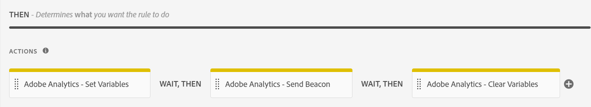

# Form Analytics とAdobe AnalyticsおよびAEM Forms – 完全なガイド {#integrate-aem-forms-with-adobe-analytics}

## Form Analytics とは

フォーム分析は、ユーザーによるフォームの操作に関するデータを収集、測定、分析するプロセスです。 これにより、ユーザーの行動に関するインサイトが得られ、フォーム完了プロセスのボトルネックが特定され、フォームを最適化してコンバージョン率を向上できます。

フォーム分析は、単純な送信トラッキングを超えて、ユーザーエクスペリエンスのあらゆる側面に関する包括的なインサイトを提供します。 ユーザーによる個々のフォームフィールドの操作、ナビゲーションパターン、完了動作を分析することにより、組織はビジネス成果に大きな影響を与えるデータ駆動型の改善を行うことができます。

### Form Analytics の中心概念

**ユーザーインタラクショントラッキング**
フォーム分析は、ユーザーがフォームをどのように操作したかに関する詳細情報を取得します。これには、各フィールドでの滞在時間、マウスの動き、スクロール動作、インタラクションパターンなどが含まれます。 このきめ細かいデータは、操作性の問題と最適化の機会を特定するのに役立ちます。

**行動パターン分析**
複数のフォームセッションにわたるユーザーの行動パターンを分析することで、組織は一般的なユーザージャーニー、一般的な放棄ポイント、成功した完了パスを特定できます。 この分析により、実際のユーザーのニーズに対応する、ターゲットを絞った改善が可能になります。

**性能測定**
Form analytics は、コンバージョン率、完了時間、エラー頻度、ユーザー満足度指標など、フォームの有効性を測定する定量的指標を提供します。 これらの指標を使用すると、フォームのパフォーマンスと最適化の影響を客観的に評価できます。

### Form Analytics がビジネスにとって重要な理由

フォーム分析は、生のユーザーインタラクションデータを実用的なビジネスインサイトに変換し、主要なビジネス指標をまたいで測定可能な改善を推進します。

**コンバージョン率の最適化**
フォームの放棄は、収益とリードジェネレーションに直接影響を与える重要なビジネス課題です。 調査によると、68% のユーザーが完了前にフォームを破棄しているので、ドロップオフポイントを特定するにはフォーム分析が不可欠になります。 フォーム分析により、ターゲットを絞ったコンバージョン最適化戦略が可能になり、フォームのパフォーマンスが大幅に向上します。 フォーム分析を通じた効果的なコンバージョン最適化により、リードジェネレーションと顧客獲得を測定可能な改善で実現します。

**ユーザーエクスペリエンスの向上**
ユーザーの苦労や問題点を理解することで、よりスムーズで直感的なフォームエクスペリエンスを作成できます。 これにより、顧客満足度の向上、サポートコストの削減、ブランド認知度の向上につながります。

**データに基づく意思決定**
Form Analytics は、前提やベストプラクティスに頼るのではなく、ユーザー行動分析に関する具体的なデータを提供します。 これにより、直感に基づく変更よりも大幅に優れた結果を得られる、証拠に基づくコンバージョンの最適化が可能になります。 フォームパフォーマンストラッキングを通じてユーザーの行動を分析すると、最適化の取り組みは、前提ではなく、実際のユーザーのニーズに焦点を当てることができます。

**ROI の測定とジャスティフィケーション**
フォーム分析は、最適化の取り組みの影響を定量化し、ビジネス価値を示す明確な指標を提供します。 組織は、フォームの改善と、リードジェネレーション、セールスコンバージョン、顧客獲得コストなどのビジネス成果との直接的な相関関係を測定できます。

**競争上の優位性**
優れたフォームエクスペリエンスは、顧客獲得における競争上の差別化要因になります。 フォーム分析を使用する組織は、競合他社よりも優れたクラス最高のユーザーエクスペリエンスを作成し、市場シェアの成長を促進できます。

### 主要なフォーム分析指標

効果的なフォーム分析は、ビジネス成果に直接影響を与え、最適化に関する実用的なインサイトを提供する指標に焦点を当てています。

**プライマリ成功指標**

- **フォームコンバージョン率**：送信が成功したフォームビューの割合（フォームの最終的な有効性の尺度）。
- **フォーム離脱率**：ユーザーが離脱する場所と理由。ユーザーエクスペリエンスの問題に直接insightを提供する
- **完了時間**：ユーザーがフォームを完了するのにかかる時間。複雑さとユーザーエクスペリエンスの品質を示します

**詳細な業績評価指標**

- **フィールドレベルの分析**：問題が発生し、ターゲットを絞った最適化作業が可能になる特定のフィールド
- **エラー率分析**：フォームが正常に完了しない検証の問題とユーザーのミス
- **ヘルプの使用パターン**：ユーザーがサポートを必要とするタイミングと場所を特定し、改善すべき領域を示します

**高度な行動指標**

- **コンバージョンファネル分析**：複数の手順を持つフォームを使用したユーザージャーニー。進行状況とドロップオフパターンを表示する
- **デバイスとブラウザーのパフォーマンス**：異なるユーザー環境全体の完了に影響する技術的要因
- **ユーザーエンゲージメントの深さ**：フォームに費やした時間、フィールドのインタラクションパターン、ユーザーの注目指標

**ビジネス・インパクト指標**

- **リード品質の相関関係**：フォーム完了動作がリードコンバージョンと顧客価値にどのように関連するか
- **トラフィックSourceのパフォーマンス**：フォーム送信の品質を最も高く維持するマーケティングチャネル
- **季節的およびキャンペーンへの影響**：マーケティングアクティビティや外部要因によってフォームのパフォーマンスがどのように変化するか

## Form Analytics のビジネス上のメリット

フォーム分析を実装することで、複数のディメンションにわたって測定可能なビジネス価値を実現します。 フォーム分析を活用する組織では、通常、コンバージョン率、ユーザー満足度、運用効率が大幅に向上します。

### &#x200B;1. フォームの放棄を減らし、コンバージョンを増やす

フォームの放棄は、収益とリードジェネレーションに直接影響を与える重要なビジネス課題です。

- **ドロップオフポイントの特定**：ユーザーがフォームを放棄した場所を正確に追跡して、問題のあるフィールドやセクションを特定します
- **フォームフローの最適化**：最も廃棄率の高いフィールドを並べ替え、簡素化または削除します
- **A/B テストの改善**：様々なフォームバリエーションをテストし、完了率に対する影響を測定します
- **モバイルの最適化**：フォームが完了しないモバイル固有の問題を特定します
- **リアルタイム監視**：フォームのパフォーマンスが低下したときに直ちにアラートを取得します

**ビジネスへの影響**：企業は、通常、分析による最適化を実装した後、フォームのコンバージョン率が大幅に向上しています。

### &#x200B;2. ユーザーエクスペリエンスと満足度の向上

フォーム分析は、ユーザーの行動と問題点に関する深いインサイトを提供します。

- **完了時間の短縮**：完了までに時間がかかりすぎるフィールドを特定し、プロセスを効率化します
- **ユーザーの不満を最小限に抑える**：エラーパターンや検証の問題を追跡して、フォームの使いやすさを向上させます
- **フィールドの順序の最適化**：最も論理的でユーザーにわかりやすい順序でフィールドを配置します
- **ヘルプとガイダンスの改善**：ユーザーが支援を必要とする場所を特定し、ターゲットを絞ったヘルプを提供します
- **クロスデバイスエクスペリエンス**：デスクトップ、タブレット、モバイルデバイス間で一貫したパフォーマンスを確保します

**ビジネスへの影響**：ユーザーエクスペリエンスが向上すると、顧客満足度スコアが向上し、ブランドロイヤルティが高まります。

### &#x200B;3. データ駆動型フォームの改善

フォームを最適化する際に、推測を具体的なデータに置き換えます。

- **証拠に基づく決定**：改善の指針として、前提条件ではなく実際のユーザー行動データを使用します
- **最適化の影響の測定**：分析前後でフォームの変更結果を定量化する
- **改善の優先順位付け**：ビジネス指標に最も大きな影響を与える変更に焦点を当てます
- **継続的最適化**：パフォーマンスデータに基づいて継続的な改善サイクルを確立します
- **関係者レポート**：フォームのパフォーマンスと ROI を示す具体的な指標を提供します

**ビジネスへの影響**：通常、データ駆動型の最適化は、直感に基づく変更よりも大幅に優れた結果を得ます。

### &#x200B;4. リード品質と販売効率の向上

フォーム分析は、フォーム送信の量だけでなく品質も最適化するのに役立ちます。

- **リードスコアリング統合**：フォームの動作とリードの品質およびコンバージョンの可能性との関連付け
- **Source アトリビューション**：最高品質のフォーム送信を生成するトラフィックソースを理解します
- **プログレッシブプロファイル**：複数の手順から成るフォームを最適化し、より適格なリードを収集する
- **セグメント化インサイト**：価値の高い顧客フォームの動作のパターンを特定します
- **販売ハンドオフの最適化**：リードフォームのインタラクションに関するコンテキストを販売チームに提供します

**ビジネスへの影響**：高品質のリードにより、販売コンバージョン率が向上し、顧客獲得コストが削減されます。

### 5.業務の効率化とコスト削減

フォーム分析は、組織全体の運用上の改善を推進します。

- **サポートチケットの削減**：カスタマーサービスの呼び出しを生成する一般的なフォームの問題を特定し、修正します
- **最適化の自動化**：パフォーマンスのしきい値に基づいて、自動アラートと最適化ルールを設定します
- **リソースの割り当て**：開発リソースを、ビジネスへの影響が最も大きいフォームやフィールドに集中させます。
- **コンプライアンスの監視**：規制やアクセシビリティコンプライアンスに対応するためにフォームのパフォーマンスを追跡する
- **統合の効率性**：送信パターンに基づいて、フォームからシステムへの統合を最適化します

**ビジネスへの影響**：運用を改善すると、フォーム関連のサポートコストを大幅に削減できます。

### 6.優れたFormsによる競争優位性

フォーム分析により、組織はクラス最高のフォームエクスペリエンスを作成できます。

- **ベンチマークパフォーマンス**：業界標準および競合他社と比較してフォームのパフォーマンスを確認します
- **イノベーションの機会**：競合他社が見逃す可能性のある独自の最適化の機会を特定します
- **顧客維持**：優れたフォームエクスペリエンスは、全体的な顧客満足度と顧客維持に貢献します
- **市場の差別化**：フォーム分析のインサイトを使用して、ユーザーエクスペリエンスで競争上の優位性を作成します
- **スケーラブルな最適化**：複数の製品やキャンペーンにわたって成功するフォームパターンを適用します

**ビジネスへの影響**：優れたフォームエクスペリエンスは、顧客獲得における重要な競争上の差別化要因になる可能性があります。

## Form Analytics の使用例と例

フォーム分析が実際のシナリオにどのように適用されるかを理解すると、組織は最適化の機会を特定し、効果的な測定戦略を導入するのに役立ちます。 ここでは、様々な業界やフォームタイプにわたる一般的なユースケースを示します。

### E コマースおよび小売Forms

**チェックアウトと支払いのForms**

- **課題**：チェックアウトプロセス中に買い物かごを放棄すると、売上高に直接影響する
- **フォーム分析ソリューション**：フィールドごとの完了率とフォームのパフォーマンスを追跡して、摩擦ポイントを特定します
- **一般的な結果**：クレジットカードのフィールド、配送先住所の検証、アカウントの作成手順が原因で、フォームが放棄されることがよくあります
- **コンバージョンの最適化の結果**：小売業者では、通常、分析に基づくフォームのパフォーマンス最適化の後、チェックアウト完了が大幅に向上しています
- **ユーザー行動分析**：買い物かごの放棄パターンを追跡して、顧客がチェックアウト中に出発するタイミングと理由を理解します
- **ビジネスへの影響**：フォームの放棄が減ると、収益の増加と顧客獲得コストの向上につながります

**製品登録と保証Forms**

- **課題**：カスタマーサポートおよびマーケティングに影響を与える製品登録率の低さ
- **分析ソリューション**：完了率を監視し、オプションの影響と必須フィールドの影響を特定する
- **最適化戦略**：必須フィールドを減らし、モバイルエクスペリエンスを向上
- **ビジネスへの影響**：登録率の向上により、顧客の生涯価値とサポートの効率が向上

### リードジェネレーションと B2B Forms

**連絡先とデモのリクエストForms**

- **課題**：リード品質とフォームの完了率のバランスを取り、フォームの放棄を最小限に抑える
- **フォーム分析ソリューション**：フォームのパフォーマンス、フォームの長さ、リードコンバージョンの品質の相関関係を追跡します
- **主要なインサイト**：プログレッシブプロファイルは、多くの場合、コンバージョン最適化のために長い単一ページフォームよりもパフォーマンスが優れています
- **ユーザー行動分析**：フォームの長さが完了率やリード品質スコアに与える影響を監視する
- **コンバージョン最適化の結果**:B2B 企業は、フォームパフォーマンスの最適化により、適格なリードジェネレーションが大幅に向上しました
- **ビジネスへの影響**：フォーム分析が向上すると、リードの品質が向上し、販売コンバージョン率が向上します

**ウェビナーとイベント登録**

- **課題** 必要な情報を収集しながら、イベント参加を最大化する
- **Analytics ソリューション**：登録完了率と実際の出席率の比較の監視
- **共通パターン**：フォームが短いと登録が増えますが、出席の質が低下する場合があります
- **ベストプラクティス**:Analytics を使用して、フォームの長さと出席者の品質の最適なバランスを見つける

### 金融サービスForms

**貸付け及び信用の申込み**

- **課題**：廃棄率の高い複雑な複数手順のアプリケーション
- **分析ソリューション**：各ステップの完了率を追跡し、ドロップオフポイントを特定する
- **重要なインサイト**：ドキュメントのアップロードと所得検証手順が原因で放棄されることもよくあります
- **最適化戦略**：明確な進捗インジケーターと保存/再開機能を提供します
- **規制上の考慮事項**:Analytics は、財務データのプライバシー要件に準拠する必要があります

**保険見積り及び保険金Forms**

- **課題**：ユーザーエンゲージメントを維持しながら詳細情報を収集する
- **Analytics ソリューション**：完了時間とフィールドレベルのエンゲージメントを監視する
- **主な結論**：自動設定とスマートデフォルトにより、完了率が大幅に向上します
- **ビジネス上の影響**：フォームの入力機能が向上し、ポリシーのコンバージョン率と直接相関する

### ヘルスケアおよび医療Forms

**患者登録と受け入れForms**

- **課題** 包括的な医療情報を効率的に収集
- **分析ソリューション**：様々な患者層の完了率を追跡する
- **アクセシビリティへの焦点**：様々なデバイスやアクセシビリティツールをまたいだパフォーマンスの監視
- **最適化の優先度**：モバイルの最適化は、患者の満足度にとってきわめて重要です
- **コンプライアンス要件**：すべての分析実装に不可欠な HIPAA コンプライアンス

**予定Forms**

- **課題**：記帳作業の簡素化を図りながらノーショーを減らす
- **Analytics ソリューション**：フォーム完了行動と予定の出席を関連付ける
- **主要なインサイト**：確認とリマインダーの環境設定は出席に大きな影響を与える
- **統合のオポチュニティ**：フォーム分析を予定管理システムと接続する

### 教育機関Forms

**申込・登録Forms**

- **課題**：ドキュメント要件を伴う複雑な複数ステップのアプリケーションの管理
- **分析ソリューション**：異なるアプリケーションステージをまたいだ完了率を追跡する
- **重要な指標**：完了時間および保存と再開の使用パターン
- **最適化への焦点**：学生アプリケーションにとってモバイルエクスペリエンスの重要性が高まっている
- **季節的な考慮事項**：アプリケーション期間中のパフォーマンスは大幅に異なります

**コースの登録とフィードバックのForms**

- **課題**：管理プロセスに対する生徒のエンゲージメントを最大限に高める
- **Analytics ソリューション**：完了率の監視とユーザーエクスペリエンスの問題の特定
- **主要なインサイト**：学生ポータルとの統合により修了率が向上
- **継続的な改善**：学期を超えた最適化に不可欠な定期的な分析レビュー

### 一般的なフォーム分析のシナリオ

**複数ステップのフォームの最適化**

適切に最適化されると、複数ステップフォームのコンバージョン率は単一ページフォームに比べて通常 86% 高くなります。

- **ステップバイステップ分析**：各フォームステップでの完了率を追跡する
- **進捗インジケーターの影響**：進捗バーが完了率に与える影響を測定します
- **保存と再開の使用**：ドラフト保存が最終完了に与える影響を監視します
- **モバイルとデスクトップのパフォーマンス**：デバイス間の完了率の比較

**フィールドレベルのパフォーマンス分析**

- **必須フィールドとオプションフィールド**：フィールド要件が完了に与える影響を分析します
- **フィールド順序の最適化**：様々なフィールドのシーケンスをテストして最適なフローを実現
- **検証エラーパターン**：一般的なユーザーのミスを特定し、検証を改善する
- **ヘルプテキストの有効性**：完了率に対するフィールドガイダンスの影響を測定します

**季節的およびキャンペーンのパフォーマンス**

- **トラフィックSource分析**：マーケティングチャネル間でのフォームパフォーマンスの比較
- **季節的なバリエーション**：年間を通じてフォームのパフォーマンスがどのように変化するかを追跡します
- **キャンペーン統合**：フォーム分析とマーケティングキャンペーンのパフォーマンスの関連付け
- **A/B テストの統合**:Analytics を使用して、テストのバリエーションを測定し、継続的に最適化します

## 実際の Form Analytics の実装シナリオ

特定の実装シナリオを理解すると、組織は異なるビジネスコンテキストをまたいでフォーム分析を効果的に適用できます。 これらの実際の例は、フォームのパフォーマンストラッキングとコンバージョンの最適化によって、測定可能なビジネス結果がどのように得られるかを示しています。

### E コマースチェックアウトの最適化

**シナリオ**：オンラインretailerで、チェックアウト中に買い物かごの放棄が多く発生する

- **Form Analytics の実装**：フィールドごとの分析を使用して、フォームレベルで買い物かごの放棄を追跡します
- **主な結論**：クレジットカードの確認手順で、支払いフォームの完了率が大幅に低下しました
- **コンバージョン最適化戦略**：シンプルな支払いフォーム、追加された進捗状況インジケーター、最適化されたモバイルエクスペリエンス
- **結果**：フォームの放棄を大幅に削減し、売上高を増加
- **ユーザー行動分析**：特定されたモバイルユーザーの放棄率が高く、モバイルファーストの再設計につながった

### リードジェネレーションフォームの最適化

**シナリオ**：問い合わせフォームからの低品質のリードに苦労している B2B ソフトウェア会社

- **フォームパフォーマンスの課題**：フォームの完了率は高いが、リードから顧客へのコンバージョンは低い
- **分析ソリューション**：フォームの完了動作とリードの品質および売上成果を関連付けます
- **最適化アプローチ**：プログレッシブプロファイリングとリードスコアリングの統合を実装しました
- **ビジネスへの影響**：リード品質の大幅な向上とセールス適格リードの増加
- **コンバージョンの最適化**：フォームの放棄を減らし、リードの選定を向上

### 登録とオンボーディングの最適化

**シナリオ**：オンボーディングプロセス中のサインアップ放棄が多い SaaS プラットフォーム

- **ユーザー行動分析**：サインアップ完了率を追跡し、オンボーディングのボトルネックを特定します
- **Form Analytics Insights**：アカウントの検証手順中に、大幅なユーザーの放棄が発生しました
- **最適化戦略**：検証プロセスを合理化し、保存と再開の機能を追加しました
- **結果**：サインアップ完了とユーザーアクティベーション率が大幅に向上しました
- **長期的な影響**：オンボーディング完了の向上に伴い、顧客のライフタイムバリューが高まりました

## Adobe Analyticsの Form Analytics 機能

Adobe Analyticsは、エンタープライズクラスのフォームトラッキング機能を提供し、ユーザーによるフォームの操作に関する詳細なインサイトを企業で取得できるようにします。 AEM Formsとのシームレスな統合により、すぐに使える強力な分析機能と、ビジネスニーズに合わせて拡張できる高度なカスタマイズオプションの両方が提供されます。

### フォーム分析用にAdobe Analyticsを選択する理由

**企業規模のパフォーマンス**
Adobe Analyticsは、パフォーマンスを低下させることなく数百万ものフォームインタラクションを処理するので、トラフィック量の多い web サイトや複雑なエンタープライズ環境に最適です。 プラットフォームの堅牢なインフラストラクチャにより、ピーク時の使用期間でも信頼性の高いデータ収集が可能になります。

**高度なセグメント化機能**
基本的なフォーム分析ツールとは異なり、Adobe Analyticsは、行動、人口統計、トラフィックソース、カスタムビジネス条件に基づく高度なユーザーのセグメント化を可能にします。 これにより、特定のユーザーグループやシナリオに対処する、ターゲットを絞った最適化戦略が可能になります。

**リアルタイムのインサイトとアラート**
リアルタイムのダッシュボードと自動アラートを使用して、フォームのパフォーマンスをそのまま監視できます。 問題を特定して直ちに対応し、フォームの問題やパフォーマンスの低下による収益の損失を防ぎます。

### 標準のトラッキング機能

AEM Formsは、[Adobe Analytics](https://experienceleague.adobe.com/docs/analytics-learn/tutorials/overview.html?lang=ja) とシームレスに統合され、公開済みフォームのパフォーマンス指標を自動的に取得および追跡します。 追加の設定を行わずに、認証済みユーザーと匿名ユーザーの両方の動作を監視できます。

フォーム分析を実装する前に、[AEM Forms環境が適切に設定されており ](/help/forms/setup-forms-cloud-service.md) コアコンポーネントまたは [ 基盤コンポーネント ](/help/forms/creating-adaptive-form-core-components.md) を使用して [ アダプティブフォームを作成 ](/help/forms/creating-adaptive-form.md) していることを確認してください。

**包括的なフォームイベントトラッキング：**

Adobe Analyticsは、ユーザーフォームでのやり取りの全体像を自動的にキャプチャします。

- **フォームレンダリング**：フォームのインプレッションとビューを追跡して、リーチと初期エンゲージメントを把握します
- **フォーム送信**：詳細な送信コンテキストとユーザージャーニーデータを使用して、成功した完了を監視します
- **フォーム離脱分析**：フィールドレベルの精度とユーザーセッションコンテキストを使用して、正確な離脱ポイントをキャプチャします
- **検証エラートラッキング**：エラータイプ、頻度、解決パターンを記録して、操作性の問題を特定します
- **ヘルプコンテンツの使用状況**：ユーザーがヘルプリソースにアクセスするタイミングを監視して、混乱や複雑さが発生している領域を示します
- **フィールドレベルのインタラクション**：個々のフィールドエンゲージメント、滞在時間、インタラクションパターンを追跡します
- **ドラフトの保存動作**：使用パターンの保存と再開を通じて、ユーザーインテントとフォームの複雑さを理解します
- **クロスセッショントラッキング**：複数のフォームセッションをまたいでユーザーを追跡し、完了ジャーニーを把握します

**高度な行動インサイト：**

- **フィールド滞在時間分析**：ユーザーが各フォームフィールドに滞在する時間を測定して、複雑さの問題を特定します
- **マウスの移動パターン**：カーソルの動作分析により、ユーザーの躊躇やエンゲージメントを追跡します
- **スクロールの深さトラッキング**：ユーザーが長いフォームを移動する方法を理解し、最適なフォーム長を特定する
- **エラー回復パターン**：検証エラーに対するユーザーの応答方法と回復方法を分析します

### カスタムイベントトラッキング

Adobe Analyticsでは、標準のフォームイベントに加えて、次のような高度なカスタムトラッキングを可能にします。

- **ビジネス固有の指標**：ルールエディターを使用してカスタムイベントを定義し、組織固有のフォームインタラクションを追跡します
- **ユーザージャーニーのマッピング**：カスタムイベントを作成して、複数の手順を持つフォームを通じて複雑なユーザーパスを追跡します
- **コンバージョンファネル分析**：カスタムイベントを設定して、特定のコンバージョンポイントとドロップオフステージを測定します
- **統合イベント**：外部システムや API とのフォームインタラクションを追跡します

### 高度なレポート機能

Adobe Analyticsは、フォームのパフォーマンスに関するエンタープライズクラスのレポート機能を提供します。

- **リアルタイムダッシュボード**：フォームのパフォーマンスとユーザーのインタラクションを発生に応じて監視します
- **セグメント分析**：異なるユーザーグループ、トラフィックソース、人口統計にわたるフォームのパフォーマンスを分析します
- **ファネルビジュアライゼーション**：複数ステップのフォームでユーザーの進行状況を視覚化し、最適化の機会を特定します
- **コホート分析**：時間の経過に伴うフォームパフォーマンスの向上を追跡し、最適化の影響を測定します
- **クロスデバイストラッキング**：様々なデバイスやセッションをまたいで、ユーザーがフォームをどのように操作するかを理解します

### 統合のメリット

Adobe AnalyticsとAEM Formsの統合には、次のような独自の利点があります。

- **統合データプラットフォーム**：フォーム分析を、より広範な web サイトやマーケティング分析と組み合わせます
- **Adobe Experience Cloud統合**: Adobe Target、Campaign およびその他のExperience Cloud ソリューションとの接続を活用します
- **エンタープライズセキュリティ**：データプライバシー規制およびエンタープライズセキュリティ要件に対する組み込みのコンプライアンス
- **スケーラブルなアーキテクチャ**：パフォーマンスに影響を与えることなく大量のフォーム操作を処理します
- **プロフェッショナルサポート**:Adobeのエンタープライズサポートおよび最適化サービスへのアクセス

この記事で概要を説明している統合手順を実装すると、次のビデオで示されているように、[!DNL Adobe Analytics] で包括的なレポートを設定および表示できます。

>[!VIDEO](https://video.tv.adobe.com/v/337262)

## 追跡する主なフォーム分析指標

フォーム分析を正常に実装するには、ビジネス成果に直接影響を与える指標に焦点を当てる必要があります。 優先順位を付ける指標を理解することで、組織はデータに基づく意思決定を行い、フォームのパフォーマンスを効果的に最適化できます。

### プライマリパフォーマンス指標

**フォームのコンバージョン率**

- **定義**：送信が成功したフォームビューの割合
- **計算**:（フォーム送信/フォーム表示）× 100
- **ビジネスへの影響**：リードジェネレーションおよび売上高目標と直接関連する
- **最適化の目標**：業界やフォームの複雑さによって異なります

**フォーム離脱率**

- **定義**：フォームを開始したが完了しなかったユーザーの割合
- **計算**: （フォーム開始 – フォーム完了）/フォーム開始× 100
- **重要なインサイト**：ユーザーエクスペリエンスの問題と最適化の機会を特定します
- **ベンチマーク**：一般的に、放棄の割合が高い場合は、操作性に重大な問題があることを示しています

**平均完了時間**

- **定義**：ユーザーがフォームの開始から送信までに費やす平均時間
- **分析の焦点**：時間がかかり過ぎてユーザーの不満を招く可能性があるフォームを特定します
- **最適化目標**：徹底とユーザーエクスペリエンスの効率のバランス
- **セグメント化**：デバイス、ユーザータイプ、トラフィックソースをまたいで完了時間を比較します

### フィールドレベルの分析

**フィールド離脱率**

- **測定値**：特定のフィールドでフォームを放棄したユーザーの割合
- **最適化値**：簡略化または削除が必要な、問題のあるフィールドを特定します
- **一般的な問題**：複雑な検証要件、指示が不明、技術的な問題
- **アクション項目**：離脱率が最も高いフィールドに対する最適化作業の優先順位の設定

**フィールドのインタラクションパターン**

- **クリックスルー率**：特定のフォームフィールドに関与するユーザーの割合
- **フィールド滞在時間**：ユーザーが個々のフィールドに費やす平均時間
- **エラー率**：特定のフィールドの検証エラーの頻度
- **ヘルプの使用状況**：ユーザーが特定のフィールドのヘルプコンテンツにアクセスする頻度

**フィールド完了率**

- **プログレッシブ分析**：ユーザーがフォームフィールド内を移動する際に完了率を追跡する
- **ドロップダウンの識別**：ユーザーがフォームを放棄する正確な場所を特定します
- **最適化優先度**：完了率が最も低いフィールドに焦点を当てます

### ユーザーエクスペリエンス指標

**エラー率分析**

- **検証エラー**：フォーム検証エラーの頻度とタイプ
- **技術的エラー**：フォームの機能に影響を与えるシステムレベルの問題
- **ユーザーエラーパターン**：フォームの入力時に犯しがちなミス
- **解像度のトラッキング**：エラー率の向上が全体的なコンバージョンにどのように影響するかを監視します

**モバイルとデスクトップのパフォーマンス**

モバイルフォームの離脱率はデスクトップバージョンに比べて通常 30% 高く、デバイス固有の最適化が重要になります。

- **デバイス固有のコンバージョン率**：デバイスタイプ間でフォームのパフォーマンスを比較する
- **レスポンシブデザインの影響**：モバイルの最適化が完了率に与える影響を測定します
- **タッチインターフェイスの使いやすさ**：モバイル固有のインタラクションパターンを分析します
- **クロスデバイスジャーニー**：あるデバイスでフォームを開始し、別のデバイスでフォームを完了したユーザーを追跡します

**ページの読み込みとパフォーマンスの指標**

3 秒未満で読み込まれるFormsは、低速のフォームよりも完了率が 70% 高くなります。

- **フォーム読み込み時間**：フォームが完全にレンダリングされ、インタラクティブになるまでに必要な時間
- **フィールド応答時間**: ユーザー入力とシステム応答の間の待ち時間
- **送信処理時間**: フォーム送信から確認までの期間
- **パフォーマンスへの影響**：読み込み時間と離脱レートの相関関係

### 高度な分析指標

**ユーザーのセグメント化分析**

- **トラフィックSourceのパフォーマンス**：マーケティングチャネル間でのフォームコンバージョン率の比較
- **地理的パフォーマンス**：場所と言語でフォームの完了率を分析する
- **ユーザータイプ分析**：新規ユーザーと再ユーザーのパフォーマンスを比較します
- **デモグラフィックのインサイト**：様々なユーザーグループのフォームとのやり取りを理解します

**コンバージョンファネル分析**

- **複数ステップのフォームの進行**：複雑なフォームを使用してユーザーの進歩を追跡する
- **ステージごとのコンバージョン**：各フォームステップの完了率を測定します
- **ファネルの最適化**：フォームの進行におけるボトルネックを特定し対処する
- **A/B テストの統合**：フォームバリエーション間のファネルパフォーマンスの比較

**ビジネス・インパクト指標**

- **リード品質スコアリング**：フォーム完了動作とリードコンバージョン率の相関関係
- **収益属性**：フォーム送信を実際のビジネス成果に結び付ける
- **顧客の生涯価値**：様々なフォームを通じて取得したユーザーの長期的な価値を分析します
- **獲得あたりのコスト**：フォームのパフォーマンスデータに基づいてマーケティング効率を計算します

次の図は、[!DNL Adobe Analytics] でレポートを表示する前に実行する必要があるアクションを示しています。


## AEM Forms用 Form Analytics の設定

フォーム分析をAdobe AnalyticsおよびAEM Formsで実装するには、複数のコンポーネントにわたって体系的な設定が必要です。 この節では、実装を成功させるための包括的な設定ガイダンス、前提条件およびベストプラクティスについて説明します。

### 前提条件と要件

フォーム分析の実装を開始する前に、お使いの環境が次の要件を満たしていることを確認してください。

>[!NOTE]
>
>セットアップ中に問題が発生した場合は、包括的な [AEM Forms トラブルシューティングガイド ](/help/forms/troubleshooting-installation-and-configuration.md) でインストールと設定に関する問題を参照してください。

**Adobe Experience Cloud アクセス**

- Adobe Analytics ライセンスを持つ有効なAdobe Experience Cloud組織
- Adobe Analytics環境およびAEM Forms環境への管理アクセス
- タグの管理と設定のためのAdobe Launch （データ収集）アクセス

**AEM Forms環境**

- [AEM Forms as a Cloud Service](/help/forms/setup-forms-cloud-service.md) またはAEM Forms 6.5 以降（オンプレミス/AMS インストール）
- Formsのオーサリング機能と公開機能の有効化
- AEM環境で [Forms オプションが使用可能で ](/help/forms/troubleshooting-installation-and-configuration.md#forms-option-is-unavailable) ることを確認します
- [ アダプティブ Forms コアコンポーネント ](/help/forms/creating-adaptive-form-core-components.md) または [ 基盤コンポーネント ](/help/forms/creating-adaptive-form.md) を使用できます

**技術的要件**

- フォーム分析のトラッキングが有効になっている、JavaScriptを使用した最新の web ブラウザー
- 安全なデータ送信のための HTTPS プロトコルの実装
- Adobe Analytics データ収集に適したファイアウォールおよびネットワーク設定

**権限とアクセス**

- レポートスイート設定のAdobe Analytics管理者の役割
- フォームの設定と公開のためのAEM Forms オーサー権限
- タグ実装およびルール作成用のAdobe Launch 開発者アクセス

### ステップバイステップの実装ガイド

#### &#x200B;1. Adobe Analyticsの設定 {#Configure-adobe-analytics}

[!DNL Adobe Analytics] を設定する前に以下を作成します。

- [Adobe Experience Cloud](https://experience.adobe.com/#/home) にログオンするための Adobe ID
- [レポートスイート](https://experienceleague.adobe.com/docs/analytics/admin/manage-report-suites/new-report-suite/t-create-a-report-suite.html?lang=ja)


### AEM Forms と [!DNL Adobe Analytics] の拡張機能のインストール {#install-extensions}

AEM Forms と [Adobe Analytics](https://experienceleague.adobe.com/docs/experience-platform/tags/extensions/adobe/analytics/overview.html?lang=ja) の拡張機能を設定するには、次の手順を実行します。

1. Adobe Experience Cloud にログオンし、会社の名前を選択します。

1. 「**[!UICONTROL Launch／データ収集]**」を選択し、「**[!UICONTROL Launch／データ収集に移動]**」を選択します。

1. 「**[!UICONTROL 新しいプロパティ]**」を選択し、設定の名前を指定します。

1. ドメイン名を指定し、「**[!UICONTROL 保存]**」を選択してプロパティを保存します。

1. タグプロパティのリストで使用可能な設定名を選択します。

1. 「**[!UICONTROL オーサリング]**」セクションで、「**[!UICONTROL 拡張機能]**」を選択します。

1. 「**[!UICONTROL カタログ]**」を選択し、**[!UICONTROL Adobe Experience Manager Forms]** 拡張機能の「**[!UICONTROL インストール]**」を選択します。「**インストール済み**」タブで、使用可能なインストール済み拡張機能のリストに **[!UICONTROL Adobe Experience Manager Forms]** が表示されます。

1. **[!UICONTROL Adobe Analytics]** 拡張機能の「**[!UICONTROL インストール]**」を選択します。
1. 「**[!UICONTROL 開発レポートスイート]**」、「**[!UICONTROL ステージングレポートスイート]**」、「**[!UICONTROL 実稼動レポートスイート]**」の各ドロップダウンリストでレポートスイート名を選択し、「**[!UICONTROL 保存]**」を選択して拡張機能を保存します。

### データ要素の設定 {#configure-data-elements}

イベント用に作成されたルールで、設定済みのデータ要素を選択できます。アダプティブフォームでイベントが発生すると、AEM Forms はこれらのデータ要素を [!DNL Adobe Analytics] に送信します。

**[!UICONTROL Adobe Experience Manager Forms]** 拡張機能をインストールしたら、次のデータ要素を作成できます。

<table>
 <tbody>
  <tr>
   <td>FieldName</th>
   <td>FieldTitle</th>
   <td>FormInstance</th>
  </tr>
  <tr>
   <td>FormName<br /> </td>
   <td>FormTitle<br /> </td>
   <td>PageName</td>
  </tr>
  <tr>
   <td>PageURL<br /> </td>
   <td>PanelTitle<br /> </td>
   <td>TimeSpent</td>
  </tr>
 </tbody>
</table>

データ要素を設定するには、次の手順を実行します。

1. 「**[!UICONTROL オーサリング]**」セクションで、「**[!UICONTROL データ要素]**」を選択します。

1. 「**[!UICONTROL 新規データ要素を作成]**」を選択します。

1. データ要素の名前を指定します。例えば、フォームタイトルデータ要素タイプの場合は「フォームタイトル」などと指定します。

1. 拡張機能名として **[!UICONTROL Adobe Experience Manager Forms]** を指定します。

1. 「**[!UICONTROL データ要素のタイプ]**」を選択します。

1. 「**[!UICONTROL 保存]**」を選択して、データ要素を保存します。

>[!VIDEO](https://video.tv.adobe.com/v/337472)

### ルールの設定 {#configure-rules}

**[!UICONTROL Adobe Experience Manager Forms]** 拡張機能に基づいてルールを作成するには、次の手順を実行します。

1. 「**[!UICONTROL オーサリング]**」セクションで、「**[!UICONTROL ルール]**」を選択します。

1. 「**[!UICONTROL 新規ルールを作成]**」を選択します。

1. ルール名を指定します。例えば、フォーム送信を記録する場合は、「フォーム送信」などと指定します。

1. 「**[!UICONTROL イベント]**」セクションで、「**[!UICONTROL 追加]**」を選択します。

1. 拡張機能名として **[!UICONTROL Adobe Experience Manager Forms]** を指定します。

1. イベントタイプを選択します。「**[!UICONTROL 名前]**」フィールドには、選択したイベントタイプに基づいて自動的に入力されます。

1. 「**[!UICONTROL 変更を保持]**」を選択して、イベントを保存します。

1. 「**[!UICONTROL アクション]**」セクションで、「**[!UICONTROL 追加]**」を選択します。

1. 拡張機能名として「**[!UICONTROL Adobe Analytics]**」を指定します。

1. 「アクションタイプ」として「**[!UICONTROL 変数を設定]**」を選択します。ドロップダウンリストで選択できるオプションは次のとおりです。

   - **[!UICONTROL 変数を設定]**：選択したデータ要素が AEM Forms から [!DNL Adobe Analytics] に送信される際のイベントタイプを定義する場合に使用します。

   - **[!UICONTROL ビーコンを送信]**：AEM Forms から [!DNL Adobe Analytics] にデータを送信する場合に使用します。

   - **[!UICONTROL 変数をクリア]**：データ証跡をクリアして [!DNL Adobe Analytics] へのイベントの登録回数を 1 回だけにする場合に使用します。

     「**[!UICONTROL 変数を設定]**」アクションタイプを使用してイベントとデータ要素を設定したあと、「**[!UICONTROL ビーコンを送信]**」を使用してデータを送信し、「**[!UICONTROL 変数をクリア]**」を使用してデータ証跡をクリアすることをお勧めします。

1. 「**[!UICONTROL prop]**」セクションで、ドロップダウンリストで選択可能なレポートスイートオプションを、[データ要素の設定](#configure-data-elements)で定義したデータ要素にマッピングします。

   例えば、フォームの送信時に AEM Forms から [!DNL Adobe Analytics] に&#x200B;**フォームタイトル**&#x200B;データ要素を送信するには、次のようにします。
   1. 「**[!UICONTROL prop]**」セクションで、レポートスイートで使用可能なフォームタイトルの prop を選択し、を選択して、[データ要素の設定](#configure-data-elements)で作成したフォームタイトルにマッピングします。

      

   1. 「**[!UICONTROL 別の要素を追加]**」を選択して、リストにさらにデータ要素を追加します。

1. 「**[!UICONTROL イベント]**」セクションで、レポートスイートで使用可能なオプションからイベントを選択して、「**[!UICONTROL 変更を保持]**」を選択します。

1. 「**[!UICONTROL アクション]**」セクションで、「+」を選択し、拡張機能名として「**[!UICONTROL Adobe Analytics]**」を指定します。

1. アクションタイプとして「**[!UICONTROL ビーコンを送信]**」を選択します。データを [!DNL Adobe Analytics] に送信してページビューとして扱う場合は、右側のウィンドウで「**[!UICONTROL s.t()]**」を選択します。また、データを [!DNL Adobe Analytics] に送信はするものの、ページビューとして扱わない場合は、「**[!UICONTROL s.tl()]**」を選択します。「**[!UICONTROL 変更を保持]**」を選択します。

1. 「**[!UICONTROL アクション]**」セクションで、「+」を選択し、拡張機能名として「**[!UICONTROL Adobe Analytics]**」を指定します。

1. アクションタイプとして「**[!UICONTROL 変数をクリア]**」を選択します。「**[!UICONTROL 変更を保持]**」を選択します。これらの手順を実行すると、「**[!UICONTROL アクション]**」セクションの表示は次のようになります。
   

   必要に応じて、「**[!UICONTROL アクション]**」セクションをカスタマイズします。例えば、アクションフローで「**ビーコンを送信**」ステップを 2 つ定義して、[!DNL Adobe Analytics] にデータを送信して、一方のステップではデータを [!DNL Adobe Analytics] に送信してページビューとして扱い、もう一方のステップではデータを送信するものの、ページビューとしては扱わない、というようなことが可能です。

   

1. 「**[!UICONTROL 保存]**」を選択して、ルールを保存します。

   中断、エラー、フィールド訪問、ヘルプ、レンダリング、保存、送信などのすべてのイベントタイプに対するルールを作成できます。

>[!VIDEO](https://video.tv.adobe.com/v/337425)


### 公開フロー {#publish-flow}

データ要素を作成してルールで使用したら、[!DNL Adobe Analytics] でフォームデータを収集するための設定を公開します。

設定を公開するには、次の手順を実行します。

1. 「**[!UICONTROL 公開]**」セクションで、「**[!UICONTROL 公開フロー]**」を選択します。

1. 「**[!UICONTROL ライブラリを追加]**」を選択し、名前を指定して、ライブラリの環境を選択します。

1. 「**[!UICONTROL 変更されたすべてのリソースを追加]**」を選択したあと、「**[!UICONTROL 保存して開発用にビルド]**」を選択します。

1. 「**[!UICONTROL 開発]**」セクションで、「」を選択したあと、「**[!UICONTROL 承認して実稼動環境に公開]**」をクリックします。

1. 変更を確認すると、公開フローがすぐに「**[!UICONTROL 公開済み]**」セクションに表示されます。


## &#x200B;2. AEM Forms の設定 {#configure-aem-forms}

Adobe Launch 設定を作成する前に、[Adobe Launch をクラウドソリューションとして使用して Adobe IMS 設定](https://experienceleague.adobe.com/docs/experience-manager-learn/sites/integrations/experience-platform-launch/connect-aem-launch-adobe-io.html?lang=ja)を作成します。

### Adobe Launch 設定の作成 {#create-adobe-launch-configuration}

Adobe Launch 設定を作成するには、次の手順を実行します。

1. AEM Forms オーサーインスタンスで、**[!UICONTROL ツール]**／**[!UICONTROL クラウドサービス]**／**[!UICONTROL Adobe Launch 設定]**&#x200B;に移動します。

1. 設定を作成するフォルダーを選択して、「**[!UICONTROL 作成]**」を選択します。

1. 「**[!UICONTROL タイトル]**」フィールドで設定のタイトルを指定します。

1. 「[関連付けられている Adobe IMS 設定](https://experienceleague.adobe.com/docs/experience-manager-learn/sites/integrations/experience-platform-launch/connect-aem-launch-adobe-io.html?lang=ja)」を選択します。

1. [Adobe Analytics の設定](#Configure-adobe-analytics) 時に使用した会社の名前を選択します。

1. [Adobe Analytics の設定](#install-extensions) 時に作成したプロパティの名前を選択します。

1. 「**[!UICONTROL 保存して閉じる]**」を選択します。

1. 設定を公開します。

### アダプティブフォームでの [!DNL Adobe Analytics] の有効化 {#enable-analytics-adaptive-form}

既存のアダプティブフォームで [!DNL Adobe Launch] 設定を使用するには、以下を行います。

1. AEM Forms オーサーインスタンスで、**[!UICONTROL Adobe Experience Manager]**／**[!UICONTROL Forms]**／**[!UICONTROL フォームとドキュメント]**&#x200B;に移動します。
1. アダプティブフォームを選択し、「**[!UICONTROL プロパティ]**」を選択します。
1. 「**[!UICONTROL 基本]**」タブで、Adobe Launch 設定の作成時に使用した[設定コンテナ](#create-adobe-launch-configuration)を選択します。
1. 「**[!UICONTROL 保存して閉じる]**」を選択します。アダプティブフォームは [!DNL Adobe Analytics] に対して有効になっています。
1. フォームを公開します。

アダプティブフォームで [!DNL Adobe Analytics] を有効にすると、AEM Forms と [!DNL Adobe Analytics] の間に適切なデータイベントフローがあるかどうかを[検証](https://experienceleague.adobe.com/docs/launch-learn/implementing-in-websites-with-launch/implement-solutions/analytics.html?lang=ja#validate-the-page-view-beacon)できます。AEM Forms と Adobe Analytics の統合が完了しました。これで [Adobe Analytics でのレポートの設定と表示](#view-reports-adobe-analytics)を行えるようになりました。

### カスタムイベントをキャプチャするルールの作成（オプション） {#capture-custom-events}

Analytics データをアダプティブフォームから [!DNL Adobe Analytics] に送信するため、ルールエディターを使用してアダプティブフォームの特定のフィールドに関するルールを作成します。

2 段階のプロセスで、アダプティブフォームのフィールドにルールを定義します。このルールがイベントをディスパッチします。イベントの名前は、Adobe Launch のカスタムキャプチャイベントにマッピングされます。

アダプティブフォームでルールエディターを使用してルールを作成するには、以下を行います。

1. フィールドを選択し、「」をクリックしてルールエディターページを開きます。
1. ルールの「[!UICONTROL 条件]」セクションで条件を定義します。
1. ルールの「[!UICONTROL 場合、]」セクションで、「**[!UICONTROL アクションを選択]**」ドロップダウンリストから「**[!UICONTROL イベントをディスパッチ]**」を選択します。
1. 「**[!UICONTROL イベント名を入力]**」フィールドでイベントの名前を指定します。

例えば、下図では、生年月日が特定の日付より前の場合、AEM Forms は&#x200B;**セキュリティ**&#x200B;イベントをディスパッチします。


イベントを [!DNL Adobe Analytics] のカスタムキャプチャイベントにマッピングするには：

1. [ルールを作成](#configure-rules)します。

1. 「**[!UICONTROL イベント]**」セクションで、「**[!UICONTROL 追加]**」を選択します。

1. 拡張機能名として **[!UICONTROL Adobe Experience Manager Forms]** を指定します。

1. 「**[!UICONTROL イベントタイプ]**」ドロップダウンリストから「**[!UICONTROL カスタムイベントをキャプチャ]**」を選択します。

1. ルールエディターを使用してルールを作成する際に手順 4 で指定したイベントの名前を指定します。

1. 「**変更を保持**」を設定し、[ルールの設定](#configure-rules)で指定した残りのアクションを実行します。

## &#x200B;3. [!DNL Adobe Analytics] でのレポートの設定と表示 {#view-reports-adobe-analytics}

イベントデータを [!DNL Adobe Analytics] に送信するようにアダプティブフォームを設定したら、[!DNL Adobe Analytics] でレポートの表示を開始できます。

1. 「」を選択し、「**[!UICONTROL Analytics]**」を選択します。

1. 「**[!UICONTROL プロジェクトを作成]**」を選択し、「**[!UICONTROL 空のプロジェクト]**」をクリックします。

1. フリーフォームの右上にあるドロップダウンリストからレポートスイート名を選択します。

1. すべてのフォームタイトルを表示するには、「**[!UICONTROL ディメンション項目を検索]**」テキストボックスで「**フォームタイトル**」を指定します。

1. 「**[!UICONTROL セグメント (または他のコンポーネント) をここにドロップ]**」テキストボックスにアダプティブフォームのタイトルをドロップします。

1. 「**[!UICONTROL 指標]**」セクションで、追跡するイベントを「**[!UICONTROL 指標 (または他のコンポーネント) をここにドロップ]**」テキストボックスにドロップします。

1. 「」を選択し、グラフのタイプを「フリーフォーム」セクションにドロップします。同様に、複数のグラフタイプを「フリーフォーム」セクションに追加できます。

1. Ctrl+S キーを選択し、名前を指定してプロジェクトを保存します。

<!--

## Add AEM Forms and Adobe Analytics integration specific rules to Dispatcher {#forms-specific-rules-to-dispatcher}

Add AEM Forms and Adobe Analytics integration specific rules to filter the data traffic that is sent to the backend.

Perform the following steps to add AEM Forms and Adobe Analytics integration specific rules to Dispatcher for Experience Manager Forms as a Cloud Service:

1. Open your AEM Project and navigate to `\src\conf.dispatcher.d\filters`.
1. Open `filters.any` file for editing and add the following rule at the end of the file:

     ```json
     /00XX { /type "allow" /path "/content/forms/af/*" /method "POST" /selectors '(analyticsconfigparser)' /extension '(jsp|json)' }
     ```

1. Save and close the file.
1. Compile and deploy the project to your [!DNL AEM Forms] as a Cloud Service environment.


## Limitations {#limitations}

* Adobe Analytics can track form metrics only for authenticated users.

-->

## 高度なフォーム分析設定

Adobe Analyticsには、基本的な設定に加えて、高度なフォームトラッキング機能と分析機能を有効にする高度な設定オプションが用意されています。 これらの高度な機能は、組織がより深いインサイトを得て、複雑な分析シナリオを実装するのに役立ちます。

### カスタムイベントとトラッキング

**カスタムフォームイベントの作成**

カスタムイベントを使用すると、標準のフォーム分析を超えるビジネス固有のインタラクションを追跡できます。

- **ビジネスプロセスイベント**：特定のビジネスワークフローに沿ったフォームインタラクションを追跡します
- **ユーザーエンゲージメントイベント**：フォームのプレビュー、フィールドヘルプの使用状況、セクションの完了など、ユーザーの高度な行動を測定します
- **統合イベント**：外部システム、API、サードパーティのサービスとのフォームのやり取りを監視します
- **パフォーマンスイベント**：フォームの読み込み時間やフィールドの応答率などのカスタムパフォーマンス指標を追跡します

**実施方法**

1. **ビジネス要件の定義**：ビジネス価値を提供する特定のフォームインタラクションを特定します
2. **カスタム変数の作成**：ビジネス固有のデータ用にAdobe Analyticsでカスタム eVar と prop を設定する
3. **ルールエディターの設定**:AEM Forms ルールエディターを使用し、フォームのインタラクションに基づいてカスタムイベントをトリガー設定します
4. **Analytics イベントへのマッピング**：カスタムフォームイベントをAdobe Analytics イベントトラッキングに接続します
5. **実装の検証**：カスタムイベントをテストして、正確なデータ収集とレポート作成を確保します

### 高度なレポート設定

**多次元分析の設定**

- **クロスフォーム分析**：異なるフォームタイプとビジネスプロセスにわたるパフォーマンスを比較する
- **ユーザージャーニーマッピング**：複数のフォームおよびタッチポイントにわたるユーザーインタラクションをトラッキングします
- **アトリビューションモデリング**：様々なマーケティングチャネルがフォームの完成にどのように貢献するかを把握します
- **コホート分析**：時間やユーザーセグメントの経過に伴うフォームパフォーマンスの向上を分析します

**リアルタイムレポートの設定**

- **ライブダッシュボードのセットアップ**：リアルタイムのフォームパフォーマンス監視の設定
- **アラート設定**：フォームのパフォーマンスの問題や異常値に関する自動アラートを設定する
- **パフォーマンスのしきい値**：許容可能なパフォーマンス範囲とモニタリングトリガーを定義する
- **関係者レポート**：様々な組織の役割および責務に関する自動レポートを作成します

### 他のAdobe ツールとの統合

**Adobe Targetの統合**

- **フォーム A/B テスト**：様々なフォームのバリエーションをテストし、パフォーマンスへの影響を測定します
- **Personalization**: ユーザーの行動と Analytics データに基づいてパーソナライズされたフォームエクスペリエンスを提供します
- **最適化**：分析インサイトを使用して、Target の最適化戦略を伝えます
- **コンバージョンの最適化**：フォーム分析を、より広範なコンバージョンの最適化作業と組み合わせます

**Adobe Campaignの統合**

- **リード育成**：フォーム分析データを使用して、メールマーケティングとリード育成キャンペーンを通知します
- **セグメント化**：フォームの完了動作とエンゲージメントパターンに基づいてユーザーセグメントを作成します
- **キャンペーンアトリビューション**：マーケティングキャンペーンがフォームのパフォーマンスと完了率にどのように影響するかを追跡します
- **ライフサイクルマーケティング**：フォーム分析を、より広範なカスタマーライフサイクルマーケティング戦略と統合します

## フォーム分析のレポートとインサイト

フォーム分析データの解釈と操作の方法を理解することは、最適化を成功させるために重要です。 この節では、主要なレポート、ダッシュボード設定およびアクションにつながるインサイト抽出について説明します。

### Analytics ダッシュボードについて

**主要業績評価指標（KPI）ダッシュボード**

- **フォームコンバージョンファネル**：フォーム完了プロセスを通したユーザーの進行状況を視覚化します
- **離脱分析**：ユーザーがフォームを不完全なままにする特定のポイントを特定します
- **パフォーマンストレンド**：時間の経過に伴うフォームパフォーマンスの変化を追跡し、パターンを特定する
- **比較分析**：様々なフォーム、期間、ユーザーセグメントにわたってパフォーマンスを比較します

**運用指標ダッシュボード**

- **リアルタイムフォームアクティビティ**：現在のフォームの使用状況と完了率を監視します
- **エラー率の監視**：フォームのパフォーマンスに影響を与える検証エラーと技術的な問題を追跡します
- **デバイスとブラウザーのパフォーマンス**：様々な技術環境でのフォームのパフォーマンスを分析します
- **地理的パフォーマンス**：場所や言語によるフォームのパフォーマンスの違いを理解する

### 監視する主なレポート

**日次実績報告書**

- **フォーム完了の概要**：フォーム送信、離脱率およびコンバージョン指標の日別概要
- **エラー分析**：フォームのエラー、検証の問題、技術的な問題を毎日追跡します
- **トラフィックSourceのパフォーマンス**：様々なマーケティングチャネルがフォームの完成をどのように促進するかについての分析
- **モバイルとデスクトップのパフォーマンス**：デバイスタイプ間でのフォームのパフォーマンスの比較分析

**週間トレンド分析**

- **パフォーマンスのトレンドの特定**：フォームのパフォーマンスの向上または低下を週単位で分析する
- **ユーザー行動パターン**：ユーザーのインタラクションパターンとエンゲージメントのトレンドを毎週分析する
- **最適化の影響測定**：フォームの変更がパフォーマンス指標に与える影響の評価
- **競争力のベンチマーク**：業界標準およびベンチマークと比較したフォームのパフォーマンス

**月次戦略レポート**

- **ROI 分析**：フォーム分析がビジネスの成果と収益に与える影響に関する月次評価
- **ユーザーエクスペリエンスのインサイト**：ユーザーエクスペリエンスの改善と最適化の機会に関する包括的な分析
- **統合のパフォーマンス**:Form Analytics の統合が広範なマーケティングプロセスやビジネスプロセスに与える影響の分析
- **戦略的な推奨事項**：フォームの最適化とビジネスプロセスの改善に関するデータ駆動型の推奨事項

### アクションにつながるインサイト抽出

**パフォーマンスの最適化に関するインサイト**

- **フィールドレベルの最適化**：改善や削除が必要な特定のフォームフィールドを特定します
- **ユーザーエクスペリエンスの向上**：ユーザーエクスペリエンスの問題を見つけ、ターゲットを設定した改善を実装します
- **コンバージョン率の最適化**:Analytics データを使用して、フォームの完了率を向上させる変更を実装します
- **技術的なパフォーマンスの最適化**：フォームの読み込みと送信のパフォーマンスに影響を与える技術的な問題に対処します

**ビジネスプロセスインサイト**

- **リード品質分析**：フォーム完了の動作とリードの品質およびコンバージョンとの相関関係を理解する
- **マーケティングアトリビューション**：最も高品質のフォーム送信を推進するマーケティングチャネルとキャンペーンを特定します
- **顧客ジャーニーの最適化**：フォーム分析を使用して、より広範な顧客獲得プロセスとリテンションプロセスを改善します
- **リソースの割り当て**：フォーム最適化リソースの投資先に関する、データに基づく決定を行います

## Form Analytics の問題のトラブルシューティング

慎重に実装しても、フォーム分析の設定では、データ収集とレポートの精度に影響を与える問題が発生する可能性があります。 このセクションでは、一般的な問題に対する体系的なトラブルシューティングガイダンスを示します。

### 一般的なセットアップの問題

**データ収集の問題**

- **フォームデータがありません**:Adobe Launch 設定を確認し、タグの適切なデプロイメントを確認します
- **不完全なイベントトラッキング**：ルール設定を確認し、すべてのフォームイベントが正しくマッピングされていることを確認します
- **データ遅延**：通常のデータ処理遅延を把握し、異常なレポート遅延を特定します
- **クロスドメイントラッキング**：異なるドメインやサブドメインをまたいだフォーム分析の問題を解決します

>[!TIP]
>
>その他のトラブルシューティングガイダンスについては、[AEM Formsのトラブルシューティングコレクション ](/help/forms/troubleshooting-installation-and-configuration.md) および [ フォーム作成のトラブルシューティング ](/help/forms/form-creation-failing.md) ガイドを参照してください。

**設定の問題**

- **レポートスイートのマッピング**：フォームが正しいAdobe Analytics レポートスイートにデータを送信していることを確認します
- **変数設定**：カスタム変数（eVar、prop）が正しく設定され、マッピングされていることを確認します
- **ルールロジックの問題**：正しくトリガーされない可能性のあるAdobe Launch ルールのデバッグ
- **権限の問題**：設定やデータの適切な表示を妨げるアクセスの問題を解決する

### データの不一致の解決

**Analytics とフォームシステムの不一致**

- **送信数の違い**:Adobe AnalyticsとAEM Formsの送信数の違いを紐付けします
- **ユーザー行動トラッキング**：システム間のユーザーインタラクショントラッキングの不一致に対処します
- **タイムゾーンと日付の問題**：タイムゾーン設定の違いによって発生したレポートの不一致を解決します
- **データサンプリング**:Adobe Analytics データサンプリングがフォーム分析の精度に影響を与えるタイミングと方法について説明します

**クロスプラットフォームデータの整合性**

- **モバイルとデスクトップのトラッキング**：異なるデバイスタイプやプラットフォーム間で一貫したデータ収集を確保します
- **ブラウザーの互換性**：特定のブラウザーまたはブラウザーバージョンに固有のトラッキング問題に対処します
- **サードパーティ統合**：外部システムや統合とのデータ一貫性の問題を解決します
- **リアルタイムデータと履歴データの比較**：リアルタイムデータと処理済み履歴データの違いを理解し、対処します

### パフォーマンスの最適化

**Analytics パフォーマンスへの影響**

- **ページ読み込みのパフォーマンス**：フォームの読み込み時間に対する分析トラッキングの影響を最小限に抑える
- **データ収集の効率**：データ収集を最適化して、帯域幅の使用量を削減し、ユーザーエクスペリエンスを向上させます
- **リアルタイム処理**：時間依存のフォーム分析ニーズに対応するためのリアルタイム分析処理を設定する
- **スケーラビリティに関する考慮事項**:Analytics 設定で、パフォーマンスを低下させることなく大量のフォームの使用を処理できるようにします

**システム統合のパフォーマンス**

- **API パフォーマンス**:AEM FormsとAdobe Analyticsの統合を最適化してパフォーマンスを向上させます
- **データ処理の効率**：データ処理ワークフローを改善して、待ち時間を短縮し、レポートのタイムリーさを向上させます
- **リソース使用率**：分析データの収集と処理のためのシステムリソースの使用状況を監視および最適化します
- **ネットワークの最適化**：ネットワーク設定を構成して、システム間のデータ転送を最適化します

## Form Analytics のベストプラクティス

フォーム分析を適切に実装するには、正確なデータ収集、意味のあるインサイト、持続可能な最適化プロセスを確保するための確立されたベストプラクティスに従う必要があります。

>[!TIP]
>
>Analytics を実装する前に、[AEM Formsのベストプラクティスと適切な ](/help/forms/introduction-forms-authoring.md) 送信アクション [ を使用してフォームが正しく設定されてい ](/help/forms/configuring-submit-actions.md) ことを確認します。

### 実装のガイドライン

**戦略的計画**

- **ビジネス目標の関連付け**：フォーム分析の実装が特定のビジネス目標と KPI に関連付けられていることを確認します
- **関係者のエンゲージメント**：分析が組織のニーズを満たしていることを計画に主要な関係者を関与させる
- **段階的な実装**：複雑さを管理し、デプロイメントを確実に成功させるために、フォーム分析を段階的に実装します
- **成功指標の定義**：成功の概要と測定方法を明確に定義します

**技術的実装**

- **設定ドキュメント**：今後の参照やトラブルシューティングのために、Analytics 設定の包括的なドキュメントを維持します
- **テストプロトコル**：実稼動のデプロイメント前に、徹底したテスト手順を実施して、正確なデータ収集を確保します
- **バージョン管理**:Analytics 設定の変更にバージョン管理を使用して、問題が発生した場合にロールバックを有効にします
- **パフォーマンスの監視**：分析の実装パフォーマンスとフォームの機能への影響を継続的に監視します

### プライバシーに関する考慮事項

**データプライバシーコンプライアンス**

- **GDPR コンプライアンス**：フォーム分析の実装がヨーロッパのデータ保護規制に準拠していることを確認します
- **CCPA コンプライアンス**：フォームデータの収集とユーザーの権利に関するカリフォルニア州消費者プライバシー法の要件を実装します
- **業界固有の規制**：医療（HIPAA）、金融（PCI DSS）、その他の業界固有のプライバシー要件に対応します
- **ユーザー同意管理**:Analytics のデータ収集と処理のために、適切な同意メカニズムを実装します

**データのセキュリティ**

- **データの暗号化**：送信時および保存時にすべてのフォーム分析データが暗号化されるようにします
- **アクセス制御**：分析データおよびレポート用の適切なアクセス制御を実装します
- **データ保持**: フォーム分析情報に対して適切なデータ保持ポリシーを確立し、適用します
- **監査記録**：分析データへのアクセスおよび構成の変更に関する監査記録を保持します

### 最適化戦略

**継続的改善プロセス**

- **定期的なパフォーマンスレビュー**：定期的なレビューサイクルを設定して、フォーム分析のパフォーマンスを評価し、最適化の機会を特定します
- **A/B テストの統合**: フォーム分析データを使用して、A/B テスト戦略を知らせ、最適化の影響を測定します
- **ユーザーフィードバックの統合**：定量分析データと定性的なユーザーフィードバックを組み合わせて、包括的な最適化インサイトを得る
- **部門横断的なCollaboration**：総合的な最適化のために、マーケティング、UX、開発、分析の各チーム間のコラボレーションを促進します

**Analytics の高度な使用率**

- **予測分析**：過去のフォーム分析データを使用して、ユーザーの行動を予測し、フォームエクスペリエンスをプロアクティブに最適化します
- **機械学習統合**：機械学習機能を活用して、フォーム分析データのパターンと最適化の機会を特定します
- **リアルタイム最適化**：現在の分析のパフォーマンスとユーザーの行動に基づいて、リアルタイムのフォーム最適化を実装します
- **クロスチャネル統合**：フォーム分析を広範な Customer Journey Analytics と統合して、包括的なユーザーエクスペリエンスの最適化を実現します

## よくある質問（FAQ）

この包括的な FAQ の節では、あらゆるエクスペリエンスレベルでユーザーを支援するための、フォーム分析の実装、トラブルシューティング、最適化に関するよくある質問について説明します。

### 入門の質問

**Q：フォーム分析と一般的な web サイト分析の違いは何ですか？**

A: フォーム分析は、フォーム内のユーザーのインタラクションに特化し、フィールドレベルの動作、完了パターン、放棄ポイントに関する詳細なインサイトを提供します。 一般的な web サイト分析は、ページビューと全体的なユーザージャーニーを追跡しますが、フォーム分析は、フォーム自体の中で、フォーム固有のユーザーエクスペリエンス、検証エラー、フィールド完了時間、コンバージョンファネル分析に関する詳細なデータを提供します。

**Q：フォーム分析をAdobe Analyticsで実装するには、技術的な専門知識は必要ですか？**

A：基本的な実装は適度な技術的知識があれば達成できますが、高度な設定には技術的な専門知識が必要です。 Adobeでは、Experience Cloud設定自動化を通じて自動化された設定オプションを提供し、実装を簡素化します。 カスタムイベントや高度なレポート機能を備えた複雑なエンタープライズデプロイメントの場合は、開発者またはAdobe コンサルタントとの共同作業をお勧めします。

**Q：フォーム分析から意味のあるデータを表示するのに、どのくらい時間がかかりますか？**

A：最初のデータは実装から 24～48 時間以内に表示されますが、意味のあるインサイトでは通常、パターンやトレンドを特定するために 2～4 週間のデータ収集が必要です。 A/B テストおよび最適化の決定に統計的な有意性を確保するには、フォームトラフィック量に応じて、4～6 週間のデータ収集を許可します。

**Q：効果的なフォーム分析に必要な最小トラフィックボリュームはどれくらいですか？**

A：フォーム分析は任意のトラフィックレベルで値を提供できますが、最適化の決定に関する統計的有意性には通常、1 週間に 100 件以上のフォーム送信が必要です。 A/B テストと高度な分析の場合、毎週 500 件以上の送信により、より信頼性の高いインサイトが提供されます。 低トラフィックのフォームでも、ユーザーの行動パターンやエラーの特定に関する定性的なインサイトからメリットを得ることができます。

### 実装と設定に関する質問

**Q：複数のドメインまたはサブドメインをまたいでフォームを追跡することはできますか？**

A：はい。Adobe Analyticsは、Adobe Analytics トラッキングコードとAdobe Launch 実装の適切な設定を通じて、クロスドメインフォームトラッキングをサポートしています。 異なるドメイン間でデータの整合性を維持するために、一貫したレポートスイート設定とクロスドメイントラッキング設定を確保します。

**Q：複数手順またはウィザードスタイルのフォームのフォーム分析を処理するにはどうすればよいですか？**

A：複数のステップから成るフォームでは、各ステップの進行状況を追跡するために特別な設定が必要です。 ステップ完了のカスタムイベントを実装し、ファネル分析を設定してステップ間のドロップオフポイントを視覚化し、カスタム変数を使用してフォームウィザードを通じてユーザーパスを追跡します。 Adobe Analyticsは、複数ページのフォームトラッキングに関する具体的なガイダンスを提供します。

**Q：ユーザーがフォームをオフラインで入力した場合、またはJavaScriptを無効にして入力した場合、Analytics データはどうなりますか？**

回答：Adobe Analyticsでは、データ収集にJavaScriptが必要なので、JavaScriptが無効なユーザーはトラッキングされません。 オフラインシナリオの場合は、フォールバックトラッキングメカニズムまたはサーバーサイド分析コレクションを実装します。 データ完全性への影響を考慮し、重要なビジネスプロセスに代替のトラッキング方法を実装します。

**Q：異なるデバイスやブラウザーをまたいでフォームのパフォーマンスを追跡するにはどうすればよいですか？**

回答：Adobe Analyticsは、デバイスとブラウザーの情報をフォーム分析データと共に自動的にキャプチャします。 カスタムレポートを設定して、デバイスタイプ、ブラウザー、オペレーティングシステム、画面の解像度によってフォームのパフォーマンスを分析します。 このデータを使用して、デバイス固有の最適化の機会を特定し、プラットフォーム間で一貫したフォームエクスペリエンスを確保します。

### データ分析と最適化に関する質問

**Q：問題があると考えるべき放棄率は何ですか？**

A：フォームの離脱率は、業界やフォームの複雑さによって大きく異なります。 単純な連絡先フォームは一般的に離脱率が低くなりますが、複雑な複数ステップのフォームや e コマースチェックアウトプロセスは高くなる傾向があります。 特定のフォームタイプや業界で異常に高い離脱率は、最適化の機会を示します。

**Q：どのフォームフィールドが最も放棄の原因となっているかを特定するにはどうすればよいですか？**

A: Adobe Analytics フィールドレベルのトラッキングを使用して、各フォームフィールドの完了率を分析します。 特定のフィールドでの大幅なドロップオフ、特定のフィールドでの平均滞在時間より長い、特定のフィールドタイプの高いエラー率を探します。 ヒートマッピングとユーザーセッションの録画では、フィールドレベルの最適化に関する追加のコンテキストを提供できます。

**Q：フォームの完了スピードまたは完全性を最適化する必要はありますか？**

A：バランスはビジネス目標によって異なります。 リードジェネレーションの場合、リードの品質を維持しながら完了まで最適化します。 詳細なデータ収集（調査、アプリケーション）については、データ品質を犠牲にすることなく摩擦を減らすユーザーエクスペリエンスの向上に焦点を当てます。 A/B テストを使用して、特定のユースケースに最適なバランスを見つけます。

**Q：フォーム分析実装の ROI を測定するにはどうすればよいですか？**

A: コンバージョン率、リード品質、運用効率の向上を測定して ROI を計算します。 次のような指標を追跡します。フォームの完了率の向上、フォームの問題に関連するサポートチケットの減少、リードから顧客へのコンバージョン率の向上、顧客獲得コストの削減。 Analytics の実装と継続的な最適化の取り組みに要するコストに照らして、これらの改善点を定量化します。

### 技術的およびトラブルシューティングの質問

**Q:Adobe Analyticsとフォームシステムの送信数に不一致が生じるのはなぜですか。**

A：一般的な原因としては、Analytics のトラッキングを妨げるJavaScriptのエラー、フォームを複数回送信するユーザー、1 つのシステムには影響するが他には影響しないボットトラフィック、レポートのタイムゾーンの違い、データ処理の遅延などがあります。 検証ルールとボットフィルタリングを実装し、システム間で一貫したタイムゾーン設定を確保します。

**Q：単一ページアプリケーション（SPA）のフォーム分析はどのように扱われますか？**

A：従来のページ読み込みイベントは発生しないので、SPA ではフォーム分析用に特別な設定が必要です。 フォームインタラクションにカスタムイベントトラッキングを実装、Adobe Analytics SPA トラッキング機能を使用、フォームステップの仮想ページビューを設定、動的フォーム要素に対する適切なイベントの発生を確認します。

**Q：フォーム分析がページ読み込みのパフォーマンスに影響を与えている場合はどうすればよいですか？**

A：分析スクリプトを非同期で読み込む、重要でないトラッキング用の遅延読み込みを実装する、カスタム変数とイベントの数を減らす、Adobe Launch で効率的なルール設定を使用する、分析がユーザーエクスペリエンスに悪影響を与えないように Core Web Vitals を監視するなどの方法で、分析実装を最適化します。

**Q：フォーム分析がプライバシー規制に準拠するようにするにはどうすればよいですか？**

A：分析トラッキング、個人データの匿名化または偽名化に対する適切なユーザーの同意の取得、データ保持ポリシーの実装、オプトアウトメカニズムの提供、データ収集および処理における GDPR/CCPA コンプライアンスの確保、法務チームとの連携による規制コンプライアンスの確保によって、プライバシーコンプライアンスを実装します。

### 実装に関する高度な質問

**Q：フォーム分析を他のAdobe Experience Cloud ソリューションと統合することはできますか？**

A：はい。Adobe Analyticsは、他のExperience Cloud ソリューションとシームレスに統合されます。 Adobe Targetを使用してフォームの A/B テストやパーソナライゼーションを行ったり、Adobe Campaignを使用してフォームの動作に基づいたリード育成を行ったり、Adobe Audience Managerを使用して高度なセグメント化を行ったり、Adobe Experience Platformを利用して包括的なカスタマージャーニー分析を行ったりします。

**Q：フォーム放棄のための予測分析を設定するにはどうすればよいですか？**

A：包括的なユーザー行動データの収集、Adobe Analyticsの機械学習機能の使用、リアルタイムのスコアリングモデルの実装、リスクの高い放棄シナリオに対する自動介入の設定、パフォーマンスデータに基づくモデルの継続的な絞り込みによって、予測分析を実装します。

**Q：モバイルアプリでフォーム分析をトラッキングするための最適なアプローチは何ですか？**

回答：モバイルアプリフォーム分析には、Adobe Analytics Mobile SDKの実装が必要です。 モバイル固有のイベントと変数を設定し、オフラインデータの収集と同期を実装し、モバイル固有のインタラクション（タッチイベント、デバイスの向き）を追跡し、アプリセッションと web インタラクションをまたいで適切なアトリビューションを確保します。

**Q：様々な関係者向けのカスタムダッシュボードを作成するにはどうすればよいですか？**

A：各関係者（エグゼクティブ、マーケター、開発者）の主要指標を特定し、Adobe Analytics Workspaceを使用してカスタムビジュアライゼーションを作成し、自動レポートスケジュールを実装し、詳細な分析のためのドリルダウン機能を作成し、ダッシュボードの解釈と使用に関するトレーニングを提供することで、役割固有のダッシュボードを作成します。

### トラブルシューティングの簡易修正

**よくある問題と解決策：**

| 問題 | 簡単な修正 | 詳細な解決策 |
|-------|-----------|-------------------|
| データが表示されません | Adobe Launch のデプロイメントの確認 | タグの実装とルール設定の確認 |
| 送信数が正しくない | イベント発生の検証 | ルールロジックとデータ要素マッピングの確認 |
| フィールドレベルのデータがありません | フィールドトラッキングの設定 | フィールドインタラクション用のカスタム変数の設定 |
| クロスドメインの問題 | トラッキング設定を更新 | 適切なクロスドメイントラッキング設定の実装 |
| モバイルトラッキングの問題 | モバイル実装の確認 | レスポンシブデザインとモバイル固有のイベントの検証 |
| パフォーマンスへの影響 | 読み込み戦略の最適化 | 非同期読み込みと効率的なルールの実装 |

>[!MORELIKETHIS]
>
>*[アダプティブフォームへの Adobe Analytics の有効化](/help/forms/enable-adobe-analytics-adaptive-form-using-experience-cloud-setup-automation.md)
