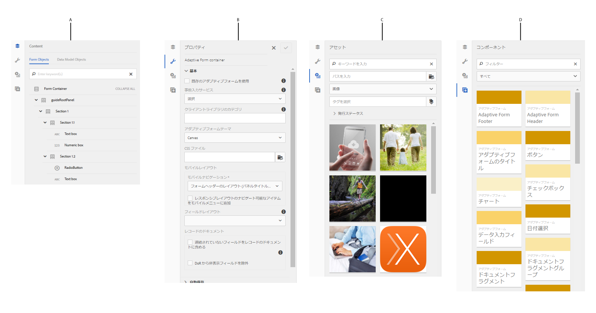

# アダプティブフォームエディター {#introduction-to-authoring-adaptive-forms}

>[!NOTE]
>
> [新しいアダプティブフォームを作成する](/help/forms/creating-adaptive-form-core-components.md)、または [AEM Sites ページにアダプティブフォームを追加する](/help/forms/create-or-add-an-adaptive-form-to-aem-sites-page.md)際には、最新の拡張可能なデータキャプチャである[コアコンポーネント](https://experienceleague.adobe.com/docs/experience-manager-core-components/using/adaptive-forms/introduction.html?lang=ja)を使用することをお勧めします。これらのコンポーネントは、アダプティブフォームの作成における大幅な進歩を示すものであり、優れたユーザーエクスペリエンスを実現します。この記事では、基盤コンポーネントを使用してアダプティブフォームを作成する従来の方法について説明します。

| バージョン | 記事リンク |
| -------- | ---------------------------- |
| AEM 6.5 | [ここをクリックしてください](https://experienceleague.adobe.com/docs/experience-manager-65/forms/getting-started/introduction-forms-authoring.html?lang=ja) |
| AEM as a Cloud Service | この記事 |

## 概要 {#overview}

アダプティブフォームを使用すると、魅力的でレスポンシブ、かつ動的でアダプティブなフォームを作成できます。[!DNL AEM Forms] には、アダプティブフォームを作成して操作するための直感的なユーザーインターフェイスと、すぐに使用できる各種のコンポーネントが用意されています。フォームモデルやスキーマをベースとしてアダプティブフォームを作成することも、フォームモデルを使用せずにアダプティブフォームを作成することもできます。フォームモデルを選択する場合、そのモデルが業務上の要件を満たしているかどうかだけでなく、インフラに対する現在の投資や既存のアセットを拡張できるかどうかについても慎重に検討することが重要です。アダプティブフォームは、以下のいずれかの方法で作成できます。

* **フォームデータモデル（FDM）の使用**
  [データ統合](data-integration.md)を使用すると、異なるデータソースのエンティティとサービスをフォームデータモデル（FDM）に統合して、アダプティブフォームの作成に使用できます。作成するアダプティブフォームで、複数のデータソースに対するデータの取得と書き込みが必要になる場合は、フォームデータモデル（FDM）を選択します。

* **XDP フォームテンプレートの使用**
XFA ベースまたは XDP フォームに投資している場合、これは理想的なフォームモデルです。XFA ベースのフォームをアダプティブフォームに直接変換する方法を提供します。すべての既存の XFA ルールは、関連付けられたアダプティブフォームに保持されます。結果のアダプティブフォームは、検証、イベント、プロパティ、パターンなどの XFA 構成をサポートします。

* **XML スキーマ定義（XSD）または JSON スキーマの使用**
XML スキーマおよび JSON スキーマは、組織内のバックエンドシステムによってデータが作成または使用される構造を表します。アダプティブフォームにスキーマを関連付けて、そのスキーマの要素を使用することにより、アダプティブフォームに動的なコンテンツを追加できます。スキーマの要素は、アダプティブフォームを作成する際に、コンテンツブラウザーの「データモデルオブジェクト」タブで入手可能です。

* **フォームモデルを使用せずに作成**
このオプションで作成されたアダプティブフォームは、フォームモデルを使用しません。このようなフォームで生成されるデータ XML は、フィールドと対応する値を持つフラットな構造です。

  >[!NOTE]
  >
  > フォームモデルのプロパティは、アダプティブフォームエディターまたはアダプティブフォームテンプレートエディターから変更することができます。 詳しくは、[アダプティブフォームのフォームモデルプロパティを編集](/help/forms/creating-adaptive-form.md#edit-form-model-properties-of-an-adaptive-form-edit-form-model)を参照してください。

アダプティブフォームを作成するには、[アダプティブフォームの作成](creating-adaptive-form.md)を参照してください。

## アダプティブフォームオーサリング UI {#adaptive-form-authoring-ui}

タッチ操作向け UI によるアダプティブフォームのオーサリングは、直観的で、以下の機能が提供されます。

* ドラッグ＆ドロップ機能
* 標準フォームコンポーネント
* アセットのための統合リポジトリー

既存のアダプティブフォームを作成または編集する場合は、次の UI 要素を使用します。

* [サイドバー](#sidebar)
* [ページツールバー](#page-toolbar)
* [コンポーネントツールバー](#component-toolbar)
* [アダプティブフォームページ](#af-page)

<!-- 

**A.** Sidebar **B.** Page toolbar **C.** Adaptive Form page -->

### サイドバー {#sidebar}

サイドバーを使用すると、次のことができるようになります。

* AEM Digital Asset Management（DAM）リポジトリーのアセットを検索、表示、使用する。
* パネル、コンポーネント、フィールド、レイアウトなどのフォームのコンテンツを表示する。
* フォームにコンポーネントを追加する。
* コンポーネントのプロパティを編集する。

**A.** コンテンツブラウザー **B.** プロパティブラウザー **C.** アセットブラウザー **D.** コンポーネントブラウザー

<!--Click to enlarge

](assets/sidebar-comps-1.png) -->

サイドバーは、以下のブラウザーで構成されます。

* **コンテンツブラウザー**
コンテンツブラウザーには、以下の項目が表示されます。

   * **フォームオブジェクト**
フォームのオブジェクト階層を表示します。作成者は、フォームオブジェクトツリーで要素をタップすることで、特定のフォームコンポーネントに移動できます。作成者は、このツリーでオブジェクトを探したり並べ替えたりできます。

   * **データモデルオブジェクト**
フォームモデル階層を確認できます。アダプティブフォームにフォームモデル要素をドラッグ＆ドロップできます。追加された要素は、元のプロパティを保持したまま、自動的にフォームコンポーネントに変換されます。XML スキーマ、JSON スキーマまたは XDP テンプレートをフォームで使用している場合は、データモデルオブジェクトを表示できます。

* **プロパティブラウザー**

  コンポーネントのプロパティを編集できます。コンポーネントに応じて、プロパティは異なります。アダプティブフォームコンテナのプロパティを確認するには、以下の手順を実行します。

  コンポーネントを選択し、／**[!UICONTROL アダプティブフォームコンテナ]**、「」の順に選択します。

* **アセットブラウザー**

  画像、ドキュメント、ページ、動画など、様々なタイプのコンテンツを分類します。

* **コンポーネントブラウザー**

  アダプティブフォームを構築するために使用できるコンポーネントが含まれます。アダプティブフォームにコンポーネントをドラッグしてフォーム要素を追加し、要件に合わせて追加要素を設定できます。以下の表で、コンポーネントブラウザーにリストされるコンポーネントについて説明します。

<table>
 <tbody>
  <tr>
   <th><strong>コンポーネント</strong></th>
   <th><strong>機能</strong></th>
  </tr>
  <tr>
   <td>Adobe Sign ブロック</td>
   <td>Adobe Sign を使用して署名する際に入力するフィールドのプレースホルダーを含むテキストブロックを追加します。</td>
  </tr>
  <tr>
   <td>ボタン</td>
   <td>ボタンを追加します。ボタンは、保存、リセット、進む、戻るなどのアクションを実行するように設定できます。</td>
  </tr>
  <tr>
   <td>Captcha</td>
   <td>Google reCAPTCHA サービスを使用して、CAPTCHA 検証を追加します。</td>
  </tr>
  <tr>
   <td>グラフ</td>
   <td>アダプティブフォームとドキュメントで使用できるグラフを追加して、繰り返し可能なパネルとテーブル行で 2 次元のデータを視覚的に表現します。</td>
  </tr>
  <tr>
   <td>チェックボックス</td>
   <td>チェックボックスを追加します。</td>
  </tr>
  <tr>
   <td>データ入力フィールド</td>
   <td>フォームのデータ入力フィールドコンポーネントを使用して、顧客が 3 つのボックスで個別に日、月、年を入力できるようにします。コンポーネントの外観はカスタマイズできます。また、日付形式を変更することもできます。例えば、MM/DD/YYYY または DD/MM/YYYY の形式で顧客に入力させることができます。</td>
  </tr>
  <tr>
   <td>日付選択</td>
   <td>日付を選択するためのカレンダーフィールドを追加します。</td>
  </tr>
  <tr>
   <td>ドキュメントフラグメント</td>
   <td>通信の再利用可能なコンポーネントを追加できます。</td>
  </tr>
  <tr>
   <td>ドキュメントフラグメントグループ</td>
   <td>関連するドキュメントフラグメントのグループを追加できます。このグループは、レターテンプレートで単一のユニットとして使用できます。</td>
  </tr>
  <tr>
   <td>ドロップダウンリスト</td>
   <td>ドロップダウンリストを追加します（単独または複数選択）。</td>
  </tr>
  <tr>
   <td>メール</td>
   <td>
メールアドレスを取得するためのフィールドを追加します。メールコンポーネントは、デフォルトで、以下の正規表現を使用してメールアドレスを検証します。
 
<code>^[a-zA-Z0-9.!#$%&amp;'*+/=?^_&grave;{|}~-]+@[a-zA-Z0-9-]+(?:.[a-zA-Z0-9-]+)*$</code>
 </td>
  </tr>
  <tr>
   <td>ファイル添付</td>
   <td>
サポートされるドキュメントを参照してフォームに添付するためのボタンを追加します。
 
<strong>メモ：</strong>ファイル添付コンポーネントは、Adobe Sign が有効なアダプティブフォームで、事前定義されたファイル形式のセットをサポートしています。詳しくは、「<a href="https://helpx.adobe.com/jp/document-cloud/help/supported-file-formats-fill-sign.html#main-pars_text">サポートされているファイル形式</a>」を参照してください。
 </td>
  </tr>
  <tr>
   <td>ファイル添付リスト</td>
   <td>ファイル添付コンポーネントを使用してアップロードされたすべての添付を一覧表示するフィールドを追加します。</td>
  </tr>
  <tr>
   <td>フッター  </td>
   <td>通常、企業のロゴ、フォームのタイトル、概要を含むページヘッダーを追加します。  </td>
  </tr>
  <tr>
   <td>ヘッダー</td>
   <td>通常、著作権情報と他のページへのリンクを含むページフッターを追加します。 </td>
  </tr>
  <tr>
   <td>画像</td>
   <td>画像を挿入できます。</td>
  </tr>
  <tr>
   <td>画像選択</td>
   <td>情報を提供するための画像を顧客が選択できるようにします。画像の情報により、パーソナライズされたサービスを顧客に提供できます。</td>
  </tr>
  <tr>
   <td>次へボタン</td>
   <td>フォーム内の次のパネルに移動するためのボタンを追加します。</td>
  </tr>
  <tr>
   <td>数値ボックス</td>
   <td>数値を取得するためのフィールドを追加します。</td>
  </tr>
  <tr>
   <td>数値ステッパー</td>
   <td>フォームの数値ステッパーを使用すると、顧客は、事前に定義された手順に基づいて増減可能な数値を入力できます。</td>
  </tr>
  <tr>
   <td>パネル</td>
   <td>
パネルまたはサブパネルを追加します
 
「子パネルを追加」ボタンを使用して、親パネルツールバーからパネルコンポーネントを追加することもできます</code> 。同様に、「パネルツールバーを追加」ボタンを使用して、パネル専用のツールバーを追加できます</code> 。パネルを編集ダイアログを使用して、パネルツールバーの位置を設定できます。
 </td>
  </tr>
  <tr>
   <td>パスワードボックス</td>
   <td>パスワードを取得するためのフィールドを追加します</td>
  </tr>
  <tr>
   <td>前へボタン</td>
   <td>ユーザーが前のページまたはパネルに戻ることができるボタンを追加します。</td>
  </tr>
  <tr>
   <td>ラジオボタン</td>
   <td>ラジオボタンを追加します</td>
  </tr>
  <tr>
   <td>リセットボタン</td>
   <td>フォームフィールドをリセットするためのボタンを追加します</td>
  </tr>
  <tr>
   <td>保存ボタン</td>
   <td>フォームデータを保存するためのボタンを追加します。</td>
  </tr>
  <tr>
   <td>手書き署名</td>
   <td>手書き署名を取得するためのフィールドを追加します。</td>
  </tr>
  <tr>
   <td>区切り記号</td>
   <td>フォーム内のパネルを視覚的に分類できるようにします。</td>
  </tr>
  <tr>
   <td>署名ステップ</td>
   <td>フォームフィールドと署名フィールドに入力された情報を表示します。ユーザーはこの情報を使用して、フォームの確認と署名を行います。</td>
  </tr>
  <tr>
   <td>テキスト</td>
   <td>静的テキストを指定できます。</td>
  </tr>
  <tr>
   <td>送信ボタン</td>
   <td>設定済みの送信アクションにフォームを送信するための送信ボタンを追加します。</td>
  </tr>
  <tr>
   <td>概要ステップ</td>
   <td>フォームを送信し、フォームの送信後にフォームの作成者が指定した概要テキストを表示します。 </td>
  </tr>
  <tr>
   <td>切り替え</td>
   <td>切り替え、すなわち有効化／無効化のアクションを行う切替スイッチを追加します。切り替えコンポーネントでは、オプションを 3 つ以上追加できません。切り替えにはオンとオフの 2 つの値しか持たせることができないので、必須は適用できません。ユーザー入力に関係なく、少なくとも 1 つの値が保存されます。  </td>
  </tr>
  <tr>
   <td>テーブル</td>
   <td>行と列にデータを整理できるテーブルを追加します。 </td>
  </tr>
  <tr>
   <td>電話番号</td>
   <td>
電話番号を取得するためのフィールドを追加します。電話番号コンポーネントを使用すると、作成者は、以下のいずれかの電話番号タイプを設定できます。各タイプは、検証用のデフォルトの正規表現に関連付けられます。

    <ul>
     <li>International タイプは、正規表現 <code>^[+][0-9]{0,14}$</code> によって検証されます。</li>
     <li>USPhoneNumber タイプは、正規表現 <code>{'+1 ('999') '999-9999}</code> によって検証されます。</li>
     <li>UKPhoneNumber タイプは、正規表現 <code>text{'+'99 999 999 9999}</code> によって検証されます。</li>
     <li>Custom タイプには、デフォルトの検証パターンは設定されていません。このタイプの場合、最後に選択された電話番号タイプの値が使用されます。独自の検証パターンを指定することもできます。</li>
    </ul> </td>
  </tr>
  <tr>
   <td>利用条件  </td>
   <td>ユーザーがフォームに記入する前に確認する利用条件を作成者が指定するためのフィールドを追加します。</td>
  </tr>
  <tr>
   <td>テキストボックス </td>
   <td>
ユーザーが必要な情報を指定できるテキストボックスを追加します。 
 
デフォルトでは、テキストボックスコンポーネントに入力できるのはプレーンテキストだけです。テキストボックスコンポーネントでリッチテキストを有効にすることもできます。リッチテキストに対応したテキストボックスコンポーネントでは、ヘッダーの追加、文字スタイル（太字、斜体、下線）の変更、順序付きリストおよび順不同リストの作成、テキストの背景およびテキストの色の変更、ハイパーリンクの追加の各オプションを提供します。テキストボックスでリッチテキストを有効にするには、コンポーネントプロパティで「<strong>リッチテキストを許可</strong>」オプションを有効にします。
 </td>
  </tr>
  <tr>
   <td>タイトル</td>
   <td>アダプティブフォームのタイトルを指定します。</td>
  </tr>
  <tr>
   <td>検証ステップ</td>
   <td>
ユーザーが検証できるように入力済みフォームを表示するためのプレースホルダーを追加します。
 
<strong>メモ</strong>：検証コンポーネントが含まれているアダプティブフォームでは、匿名ユーザーはサポートされません。また、アダプティブフォームフラグメントで検証コンポーネントを使用することはお勧めしません。
 </td>
  </tr>
 </tbody>
</table>

### ページツールバー {#page-toolbar}

上部のページツールバーでは、フォームのプレビュー、フォームプロパティの変更、フォームレイアウトの変更を可能にするオプションを提供します。フォームの作成者は、フォームをプレビューして変更を加えることができます。ページツールバーには、以下の項目が表示されます。

* **サイドパネルを切り替え** ：サイドバーの表示と非表示を切り替えます。

* **ページ情報** ：ページプロパティの表示、フォームの公開／非公開、フォームワークフローの開始、フォームをクラシック UI で開く操作が可能です。

* **エミュレーター** ：タブレットや携帯電話など異なる画面サイズでのフォームの外観をエミュレートします。

* **編集**：**[!UICONTROL 編集]**、**[!UICONTROL スタイル]**、**[!UICONTROL 開発者]**、**[!UICONTROL デザイン]**&#x200B;など、その他のモードを選択できます。

   * **編集**：フォームとそのコンポーネントのプロパティを編集できます。例えば、コンポーネントの追加、画像の削除、必須フィールドの指定などを行うことができます。
   * **スタイル**：フォームのコンポーネントのアピアランスを調整できます。例えば、スタイルモードでパネルを選択してパネルの背景色を指定できます。

   * **開発者**：以下が可能です。

      * フォームの構成要素を確認できます。
      * 何がいつ、どこで起きているかを確認し、問題の解決に役立てます。

      * **デザイン**：カスタムコンポーネントや、サイドバーにリストされていないすぐに使用できるコンポーネントを有効または無効にできます。

* **プレビュー**：フォーム公開時の外観をプレビューできます。

### コンポーネントツールバー {#component-toolbar}

コンポーネントを選択すると、作業で使用できるツールバーが表示されます。切り取り、貼り付け、移動およびコンポーネントのプロパティを指定するオプションを使用できます。以下のオプションがあります。

A. **設定**：**[!UICONTROL 設定]**&#x200B;を選択すると、サイドバーにコンポーネントのプロパティが表示されます。これらのプロパティを設定することで、データ取得方法をカスタマイズできます。コンポーネントのタイトルフィールドのラベルテキストを指定して、コンポーネントの要素名を変更できます。要素名を使用すると、ユーザーがコンポーネントを使用して入力した値を取得できます。コンポーネントのプロパティでは、コンポーネントの動作を指定し、ユーザーの入力を管理できます。サイドバーでプロパティを設定し、ユーザーデータを取得して、そのデータをその後の処理に使用できます。アダプティブフォームコンテナのプロパティでは、クライアントライブラリ、レイアウト、テーマ、レコードのドキュメントの設定、保存設定、送信設定、メタデータの設定を指定できます。

B. **コピー**：コピーオプションでは、コンポーネントをコピーしてフォーム内の別の場所に貼り付けることができます。コンポーネントを貼り付けすると、貼り付けられたコンポーネントに新しい要素名が与えられますが、コピーされたコンポーネントのプロパティは保持されます。

C. **カット**：カットオプションでは、コンポーネントをアダプティブフォーム内の別の場所に移動できます。

D. **削除**：フォームからコンポーネントを削除できます。

E. **挿入**：選択されたコンポーネントの上にコンポーネントを挿入できます。

F. **貼り付け**：前述のオプションでカットまたはコピーしたコンポーネントを貼り付けることができます。

G. **ルールを編集**：ルールエディターを開くことができます。詳しくは、「<!-- see [Rule Editor](rule-editor.md). -->」を参照してください。

H. **グループ**：複数のコンポーネントについて、カット、コピー、貼り付けを同時に実行したい場合に、複数のコンポーネントを選択できます。

I. **親**：コンポーネントの親を選択できます。例えば、テキストフィールドがセクション内のサブセクションの中にある場合、そのセクションはガイドルートパネル内に位置し、アダプティブフォームコンテナはガイドルートパネルの親にあたります。コンポーネントの場合、下位から上位の順の階層ですべてのオプションを確認できます。

例えば、テキストボックスで「**[!UICONTROL 親]**」を選択すると、以下のように項目が表示されます。

* サブセクション
* セクション
* guideRootPanel
* アダプティブフォームコンテナ

J. **その他**：このオプションにより、選択したコンポーネントを操作するためのその他のオプションを表示することができます。

* SOM 式を表示
* パネルをフラグメントとして保存（パネルのみ）
* 子パネルを追加（パネルのみ）
* パネルツールバーを追加（パネルのみ）
* 置換（パネル以外）

### アダプティブフォームページ {#af-page}

アダプティブフォームページは、実際のフォームです。これは、WCM `cq:Page` コンポーネントとしてモデル化されたその他すべての WCM ページと似ています。一般的なアダプティブフォームのコンテンツ構造を以下の図に示します。

コンテンツ構造は、通常、以下の一次コンポーネントを含みます。

* **guideContainer**：アダプティブフォームのルートです。これは、アダプティブフォーム UI 内で&#x200B;**[!UICONTROL アダプティブフォームの開始]**&#x200B;としてマークされています。このコンポーネントでは、以下のことを指定できます。

   * *アダプティブフォームのモバイルレイアウト*：モバイルデバイスでのフォームのアピアランスを定義します。
   * *ありがとうページ*：フォームの送信後にユーザーがリダイレクトされるページを定義します。
   * *送信アクション*：ユーザーがフォームを送信した後に、サーバーでフォームを処理する方法を定義します。
   * *スタイリング*：フォームのアピアランスをカスタマイズするために使用する CSS ファイルへのパスを指定します。

* **rootPanel**：アダプティブフォームのルートパネル。項目ノードの下にサブパネルを含むことができます。ルートパネルを含む各パネルは、それに関連付けられたレイアウトを持つことができます。パネルのレイアウトは、フォームをレイアウトする方法を指示します。例えば、アコーディオンレイアウトでは、その項目はアコーデオンステップとしてレイアウトされます。

* **ツールバー**：アダプティブフォームコンテナは、フォームに対してグローバルな、関連付けられたグローバルツールバーを持ちます。このツールバーは、編集バーの&#x200B;**[!UICONTROL ツールバーを追加]**&#x200B;アクションを使用して追加でき、作成者は送信、保存、リセットなどのアクションを追加できます。

* **アセット：**&#x200B;このノードには、フォームのオーサリングに使用される追加情報が含まれます。例えば、フォームモデルの詳細、ローカリゼーションの詳細などです。

## AEMの AI アシスタント

[ 前提条件を完了している ](/help/implementing/cloud-manager/ai-assistant-in-aem.md#get-access) お客様は、AEMの AI アシスタントを組織内のユーザーが利用できます。 [AEMの AI アシスタント ](/help/implementing/cloud-manager/ai-assistant-in-aem.md) を参照してください。

## 関連トピック {#see-also}

{{see-also}}
