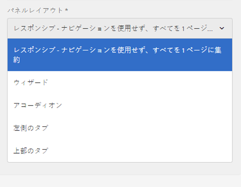
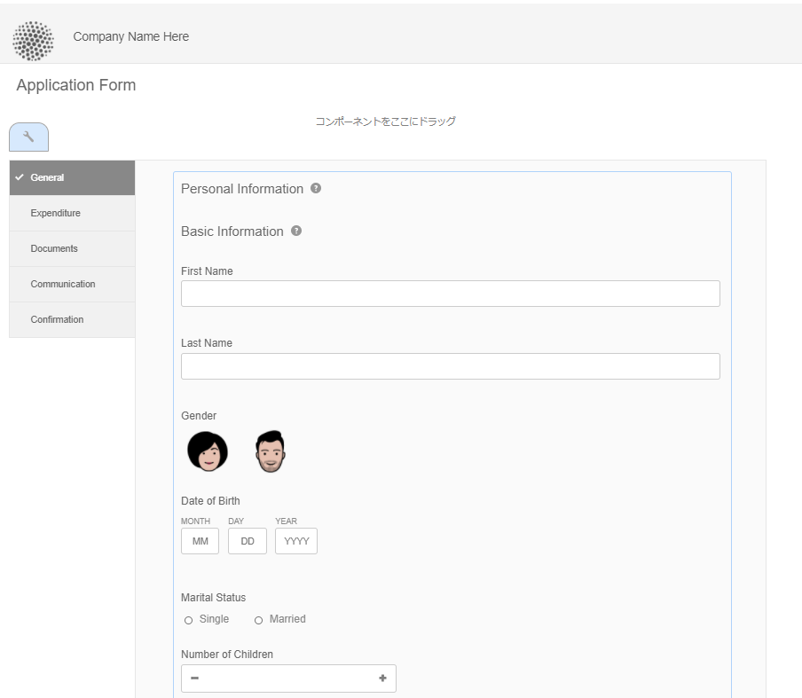
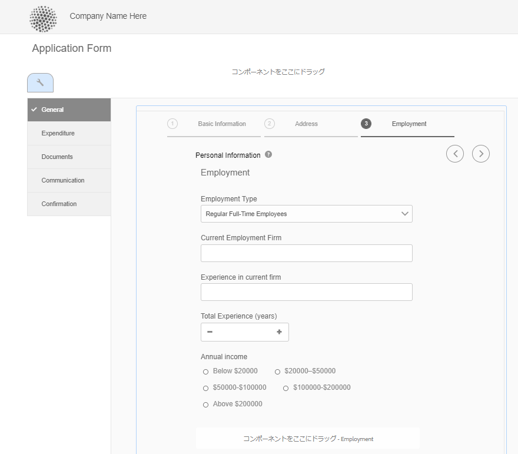
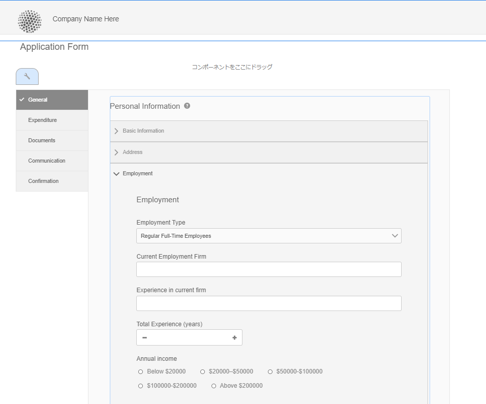
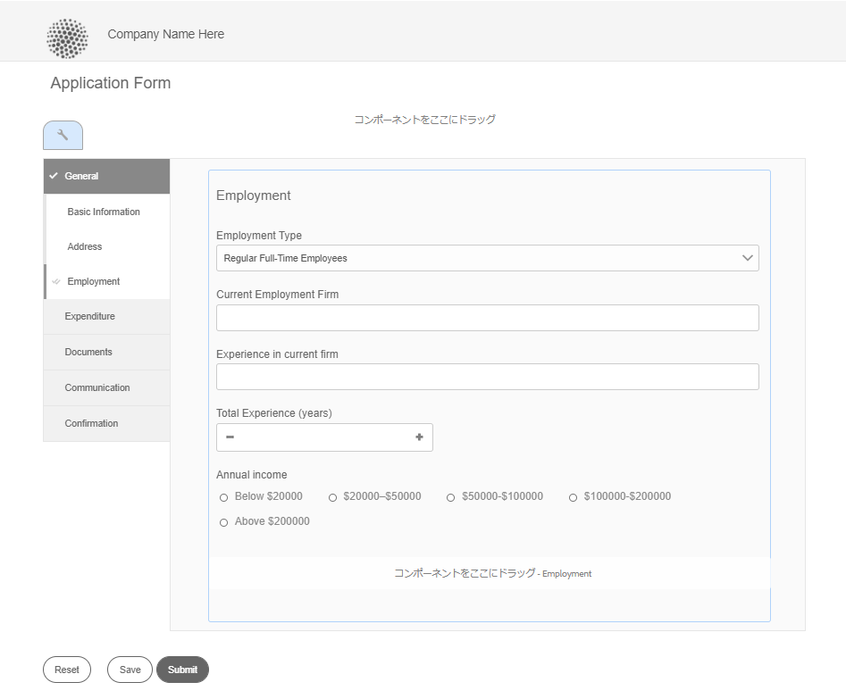
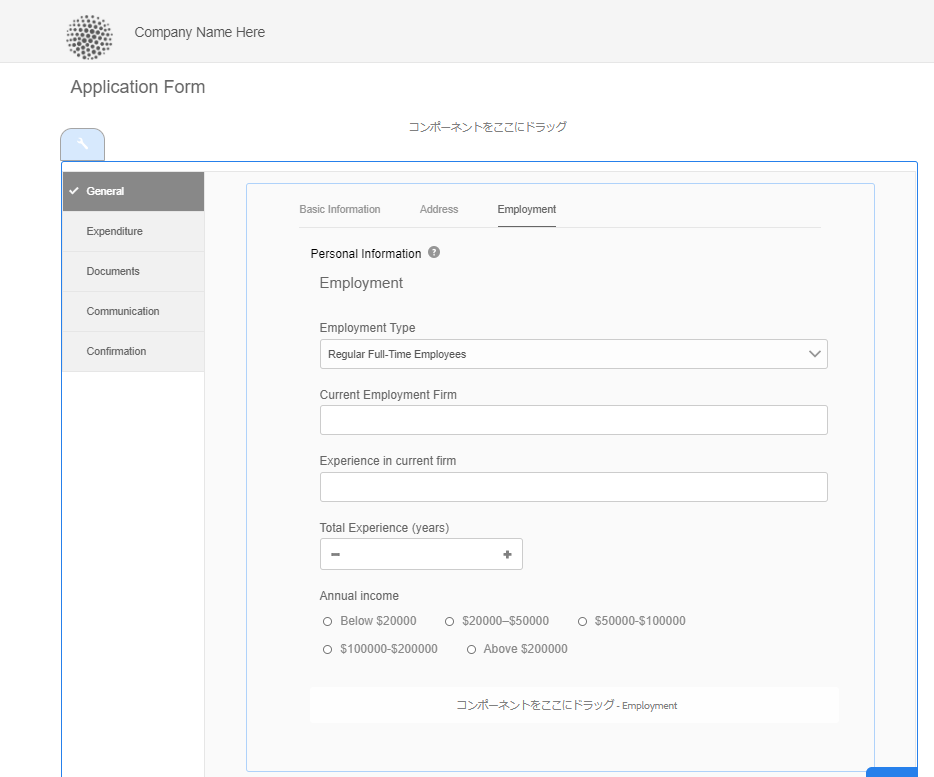
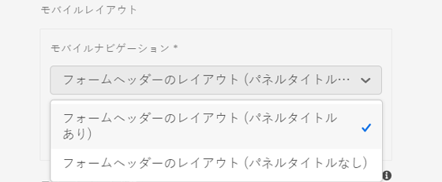
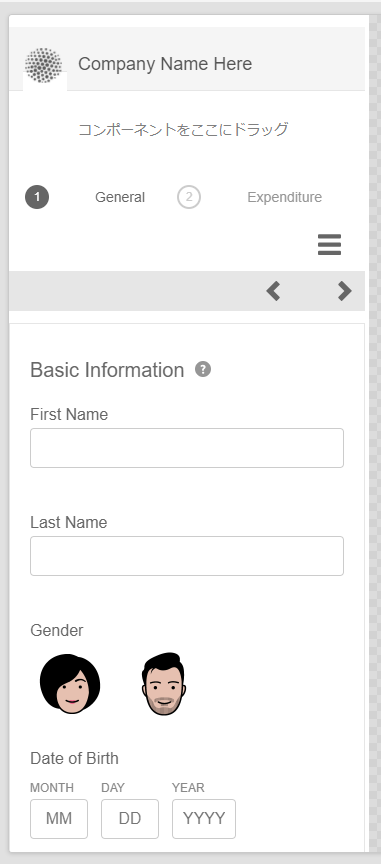
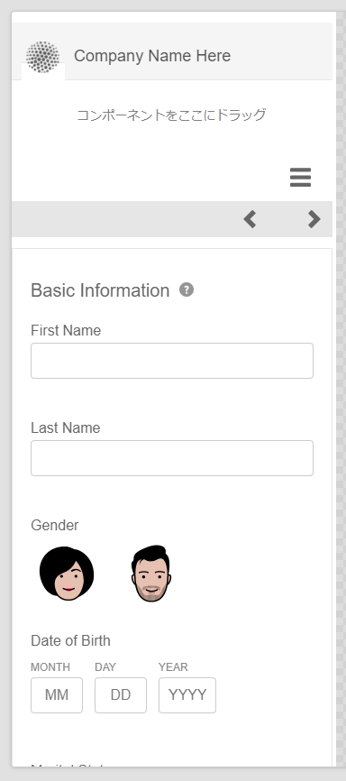
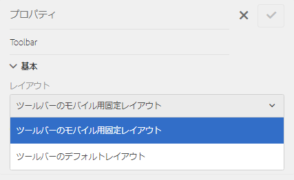

# アダプティブフォームのレイアウト機能 {#layout-capabilities-of-adaptive-forms}

>[!NOTE]
>
> Adobeでは、（新しいアダプティブFormsの作成 [ または ](https://experienceleague.adobe.com/docs/experience-manager-core-components/using/adaptive-forms/introduction.html?lang=ja)[ AEM SitesページへのアダプティブFormsの追加 [ に、最新の拡張可能なデータキャプチャ ](/help/forms/creating-adaptive-form-core-components.md) コアコンポーネント ](/help/forms/create-or-add-an-adaptive-form-to-aem-sites-page.md) を使用することをお勧めします。 これらのコンポーネントは、アダプティブフォームの作成における大幅な進歩を表し、ユーザーエクスペリエンスの向上を実現します。この記事では、基盤コンポーネントを使用してアダプティブFormsを作成する古いアプローチを説明します。


| バージョン | 記事リンク |
| -------- | ---------------------------- |
| AEM 6.5 | [ここをクリックしてください](https://experienceleague.adobe.com/docs/experience-manager-65/forms/adaptive-forms-basic-authoring/layout-capabilities-adaptive-forms.html?lang=ja#) |
| AEM as a Cloud Service（コアコンポーネント） | [ここをクリックしてください](/help/forms/layout-capabilities-adaptive-forms-core-components.md) |
| AEM as a Cloud Service（基盤コンポーネント） | この記事 |

[!DNL Adobe Experience Manager]では、簡単に使用できるアダプティブフォームを作成でき、エンドユーザーに動的なエクスペリエンスを提供します。フォームのレイアウトは、アダプティブフォームでの各項目やコンポーネントの表示方法をコントロールします。

<!-- ## Prerequisite knowledge {#prerequisite-knowledge}

Before learning about the different layout capabilities of Adaptive Forms, read [Introduction to authoring forms](introduction-forms-authoring.md) to know more about Adaptive Forms. -->

## レイアウトのタイプ {#types-of-layouts}

アダプティブフォームは次のタイプのレイアウトを提供します。

**[!UICONTROL パネルレイアウト]**&#x200B;は、パネル内の項目やコンポーネントをデバイス上で表示する方法をコントロールします。

**[!UICONTROL モバイルレイアウト]**&#x200B;は、モバイルデバイスでのフォームのナビゲーションをコントロールします。デバイスの幅が 768 ピクセル以上の場合、レイアウトはモバイルと判断され、モバイルデバイス向けに最適化されます。

**[!UICONTROL ツールバーレイアウト]**&#x200B;は、フォーム内のツールバーまたはパネルツールバーのアクションボタンの配置をコントロールします。

これらのすべてのパネルレイアウトは`/libs/fd/af/layouts`で定義されます。

アダプティブフォームのレイアウトを変更する場合、[!DNL Experience Manager]でオーサリングモードを使用してください。

## [!UICONTROL パネルレイアウト] {#panel-layout}

フォーム作成者は、ルートパネルを含めたアダプティブフォームの各パネルにレイアウトを関連付けることができます。

パネルレイアウトは`/libs/fd/af/layouts/panel`から利用できます。パネルを選択し、 を選択して、パネルのプロパティを表示します。



### [!UICONTROL レスポンシブ - ナビゲーションなしですべて 1 ページに配置] {#responsive-everything-on-one-page-without-navigation-br}

このパネルレイアウトを使用すると、特別なナビゲーションなしでレイアウトをデバイスの画面サイズに合うように調整するレスポンシブレイアウトを作成できます。

このレイアウトを使用すると、複数の&#x200B;**[!UICONTROL パネルのアダプティブフォーム]**&#x200B;コンポーネントをパネル内に順番に配置することができます。



### [!UICONTROL ウィザード] {#wizard}

このパネルレイアウトを使用すると、フォーム上にガイド付きのナビゲーションが提供できます。例えば、ユーザーを 1 手順ずつガイドしながらフォーム内の必須情報を取得したい場合、このレイアウトを使用します。

パネル内に 1 手順ずつのナビゲーションを用意するには、**[!UICONTROL アダプティブフォームのパネル]**&#x200B;コンポーネントを使用します。このレイアウトを使用すると、現在の手順を完了しない限りユーザーは次の手順に進めません。

```javascript
window.guideBridge.validate([], this.panel.navigationContext.currentItem.somExpression)
```



### [!UICONTROL アコーディオン] {#layout-for-accordion-design}

このレイアウトを使用すると、アコーディオンスタイルのナビゲーションを備えたパネルに&#x200B;**[!UICONTROL アダプティブフォームのパネル]**&#x200B;コンポーネントを配置できます。また、このレイアウトを使用すると、繰り返し可能なパネルを作成できます。繰り返し可能なパネルを使用すれば、必要に応じて動的にパネルを追加したり削除することができます。パネルの繰り返しの最小数、最大数を定義することができます。また、パネル内の項目に入力される情報に応じて動的にパネルのタイトルを決定することができます。

最小化したパネルのタイトルにユーザーが提供した値を表示するために、サマリ式を使用することができます。



### [!UICONTROL タブ付きレイアウト - タブを左側に表示]{#tabbed-layout-tabs-appear-on-the-left}

このレイアウトを使用すると、タブ付きナビゲーションのパネルに&#x200B;**[!UICONTROL アダプティブフォームのパネル]**&#x200B;コンポーネントを配置できます。タブはパネルコンテンツの左側に配置されます。



パネルの左側にタブ表示

### [!UICONTROL タブ付きレイアウト - タブを上部に表示] {#tabbed-layout-tabs-appear-on-the-top}

このレイアウトを使用すると、タブ付きナビゲーションのパネルに&#x200B;**[!UICONTROL アダプティブフォームのパネル]**&#x200B;コンポーネントを配置できます。タブはパネルコンテンツの上に配置されます。



## モバイルレイアウト {#mobile-layouts}

モバイルレイアウトはモバイルデバイスの比較的小さい画面で、ユーザーが容易にナビゲーションできるようにします。モバイルレイアウトでは、フォームのナビゲーションにタブ付きスタイルまたはウィザードスタイルを使用します。モバイルレイアウトを適用するとフォーム全体を単一のレイアウトで表示します。

このレイアウトでは、ナビゲーションバーとナビゲーションメニューを使用してナビゲーションをコントロールします。ナビゲーションバーで、**進む**&#x200B;と&#x200B;**戻る**&#x200B;のナビゲーションステップはそれぞれ **[!UICONTROL &lt;]** と **[!UICONTROL >]** のアイコンで示されます。

モバイルレイアウトは`/libs/fd/af/layouts/mobile/`から使用できます。アダプティブフォームではデフォルトで次のモバイルレイアウトを使用できます。



「**[!UICONTROL レスポンシブレイアウトのナビゲート可能なアイテムをモバイルメニューに追加]**」オプションを選択して、モバイルレイアウトのパネルで使用できるナビゲート可能なオプションを表示します。ナビゲート可能なオプションは、パネルに対して「**[!UICONTROL レスポンシブ]**」レイアウトを選択した場合にのみ表示されます。

モバイルレイアウトを使用する場合、 アイコンをタップすると、さまざまなフォームパネルにアクセスするためのフォームメニューを使用できます。

### [!UICONTROL フォームのヘッダーにパネルタイトルを表示するレイアウト] {#layout-with-panel-titles-in-the-form-header}

レイアウトの名称の通り、このレイアウトはナビゲーションメニューおよびナビゲーションバーと併せてパネルのタイトルを表示します。また、このレイアウトではナビゲーションに「進む」アイコンと「戻る」アイコンを使用します。



### [!UICONTROL フォームのヘッダー部分にパネルタイトルを表示しないレイアウト]{#layout-without-panel-titles-in-the-form-header}

レイアウトの名称の通り、このレイアウトはナビゲーションメニューおよびナビゲーションバーのみ表示し、パネルのタイトルは表示しません。また、このレイアウトではナビゲーションに「進む」アイコンと「戻る」アイコンを使用します。



## 関連トピック {#see-also}

{{see-also}}


<!-- ## Toolbar layouts {#toolbar-layouts}

A Toolbar Layout controls positioning and display of any action buttons that you add to your Adaptive Forms. The layout can be added at a form level or at a panel level.



A list of Toolbar Layouts in Adaptive Forms

Toolbar layouts are available at `/libs/fd/af/layouts/toolbar` location. Adaptive Forms provide the following Toolbar Layouts, by default.

### [!UICONTROL Default layout for toolbar] {#default-layout-for-toolbar}

This layout is selected as the default layout when you add any action buttons in an Adaptive Form. Selecting this layout displays the same layout for both, desktop and mobile devices.

Also, you can add multiple toolbars containing action buttons configured with this layout. An action button is associated with a form control. You can configure the toolbars to be before or after a panel.


Default view for toolbar

### [!UICONTROL Mobile fixed layout for toolbar] {#mobile-fixed-layout-for-toolbar}

Select this layout to provide alternate layouts for desktop and mobile devices.

For the desktop layout, you can add Action buttons using some specific labels. Only one toolbar can be configured with this layout. If more than one toolbar is configured with this layout, there is an overlap for mobile devices and only one toolbar is visible. For example, you can have a toolbar at the bottom or the top of the form, or, after or before panels in the form.

For the Mobile layout, you can add action buttons using icons.


Mobile fixed layout for toolbar-->


