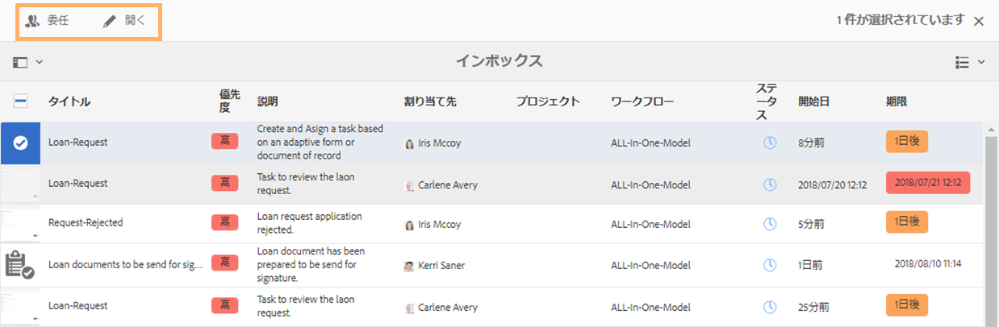
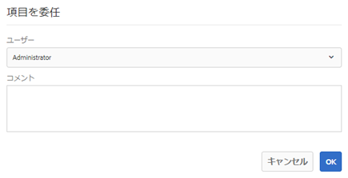
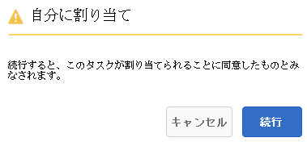
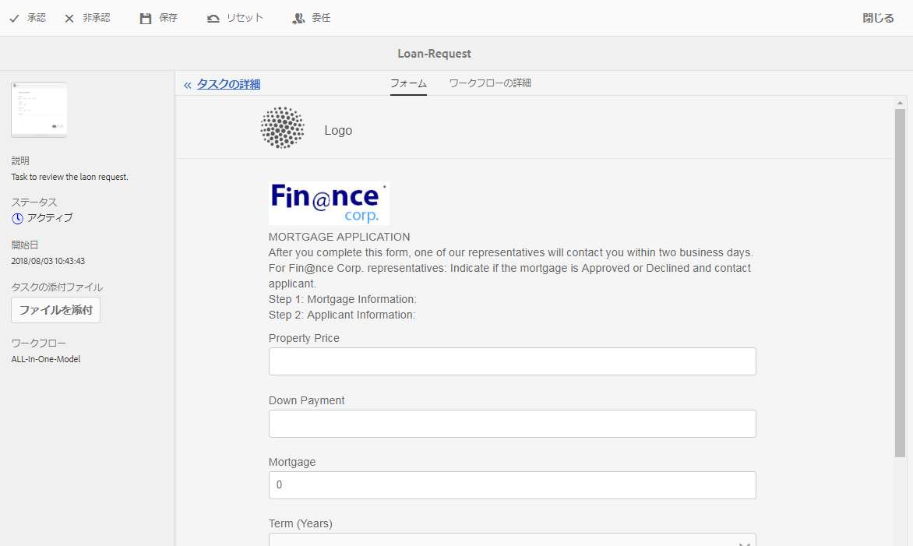
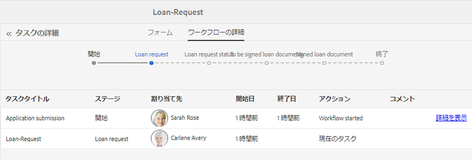
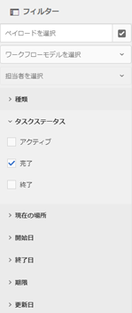
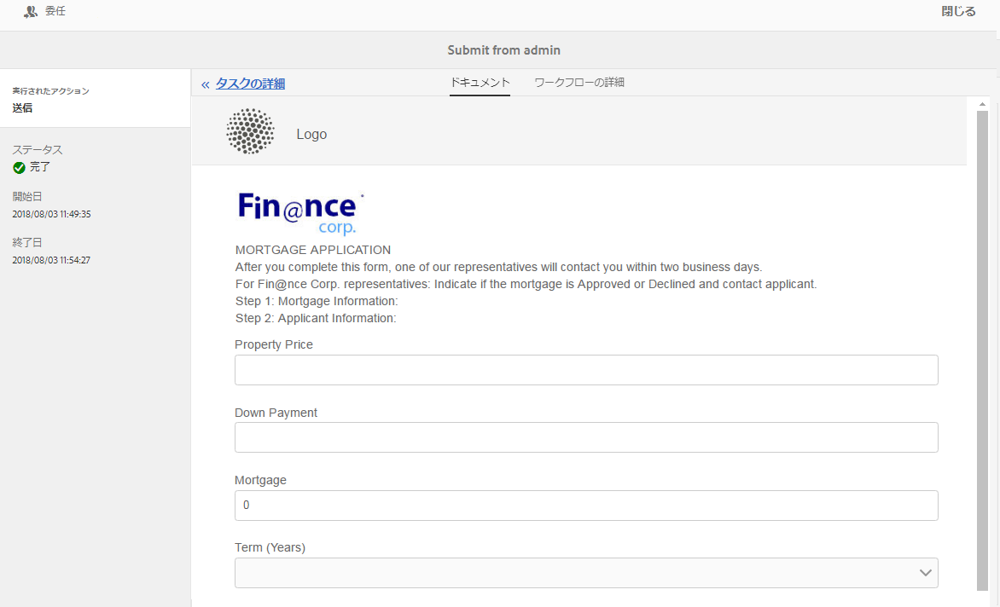
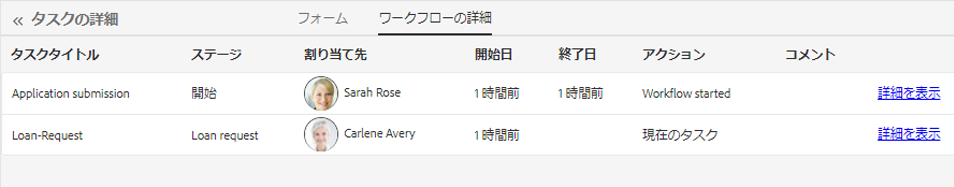

# AEM インボックスでの Forms アプリケーションとタスクの管理 {#manage-forms-applications-and-tasks-in-aem-inbox}

Forms 中心のワークフローを起動またはトリガーする多くの方法の 1 つに、AEM インボックスのアプリケーションから行う方法があります。Forms Workflow を使用できるようにするためのワークフローアプリケーションを、インボックス内のアプリケーションとして作成する必要があります。ワークフローアプリケーションおよび Forms ワークフローを起動するためのその他の方法について詳しくは、「[OSGi 上での Forms 中心のワークフローの起動](aem-forms-workflow.md#launch)」を参照してください。

さらに、AEM インボックスは、Forms ワークフローを含む様々な AEM コンポーネントの通知やタスクを統合します。タスクの割り当て手順を含む Forms Workflow がトリガーされると、関連するアプリケーションが担当者のインボックスにタスクとしてリストされます。担当者がグループの場合、そのタスクは、個人が要求するまで、またはタスクを委任するまで、グループのメンバー全員のインボックスに表示されます。

インボックスのユーザーインターフェイスでは、リストビューまたはカレンダービューでタスクを表示できます。ビューの設定もできます。様々なパラメーターに基づいて、タスクをフィルターできます。ビューとフィルターについて詳しくは、「[インボックス](https://experienceleague.adobe.com/docs/experience-manager-cloud-service/sites/authoring/getting-started/inbox.html?lang=ja#inbox-in-the-header)」を参照してください。

つまり、インボックスではアプリケーションを作成して割り当てタスクを管理できます。

>[!NOTE]
>
>AEM インボックスを使用するには、[!DNL workflow-users] グループのメンバーである必要があります。

## アプリケーションの作成 {#create-application}

1. AEM インボックス（https://&#39;[server]:[port]&#39;/aem/inbox）に移動します。
1. インボックスの UI で、**[!UICONTROL 作成／アプリケーション]**&#x200B;を選択します。アプリケーションを選択ページが表示されます。
1. アプリケーションを選択してから、「**[!UICONTROL 作成]**」をクリックします。アプリケーションに関連付けられたアダプティブフォームが開きます。アダプティブフォームの情報を入力し、「**[!UICONTROL 送信]**」を選択します。関連するワークフローが起動し、担当者のインボックスにタスクが作成されます。

## タスクの管理 {#manage-tasks}

自分が担当者であるか、担当者グループのメンバーである場合、Forms Workflow がトリガーされるとインボックスにタスクが表示されます。インボックス内のタスクについて、その詳細を表示し、使用可能なアクションを実行できます。

### タスクの要求または委任 {#claim-or-delegate-tasks}

グループに割り当てられたタスクは、グループのメンバー全員のインボックスに表示されます。グループのメンバーなら誰でも、タスクを要求したり他のグループメンバーに委任したりできます。そのためには、以下の手順を実行します。

1. タスクのサムネールを選択します。タスクを開く、または委任するオプションが上部に表示されます。

   

1. 次のいずれかの操作を行います。

   * タスクをデリゲートするには、「**[!UICONTROL デリゲート]**」を選択します。項目をデリゲートダイアログが開きます。ユーザーを選択し、任意でコメントを追加して、「**[!UICONTROL OK]**」を選択します。

   

   * タスクをリクエストするには、「**[!UICONTROL 開く]**」を選択します。自分に割り当てダイアログが開きます。「**[!UICONTROL 続行]**」を選択して、タスクを要求します。要求したタスクが、自分が担当者としてインボックスに表示されます。

   

### タスクの詳細の表示とアクションの実行 {#view-details-and-perform-actions-on-tasks}

タスクを開くと、タスクの詳細を表示して使用可能なアクションを実行できます。タスクで使用可能なアクションは、関連する Forms Workflow のタスクの割り当て手順で定義できます。

1. タスクのサムネールを選択します。選択したタスクを開く、または委任するオプションが上部に表示されます。
1. 「**開く**」を選択すると、タスクの詳細と使用可能なアクションが表示されます。タスクの詳細表示が開きます。このビューでは、タスクの詳細を表示してタスクを実行できます。

   >[!NOTE]
   >
   >タスクがグループに割り当てられている場合、詳細表示を開くにはタスクを要求する必要があります。



タスクの詳細表示は、以下のセクションで構成されます。

* タスクの詳細
* フォーム
* ワークフローの詳細
* アクションツールバー

#### タスクの詳細 {#task-details}

タスクの詳細セクションは、タスクについての情報を表示します。表示される情報は、ワークフローの[タスクを割り当てステップ](https://experienceleague.adobe.com/docs/experience-manager-65/developing/extending-aem/extending-workflows/workflows-step-ref.html?lang=ja#extending-aem)の設定によって異なります。上記の例では、タスクの説明、状態、開始日および使用されているワークフローが表示されています。また、タスクにファイルを添付することもできます。

#### フォーム {#form}

メインコンテンツ領域の「フォーム」タブには、送信されたフォームと、フィールドレベルの添付ファイル（存在する場合）が表示されます。

#### ワークフローの詳細 {#workflow-details}

上部にある「ワークフローの詳細」タブには、ワークフロー全体を通してタスクの進捗が表示されます。タスクの完了、現在、保留の各段階を示します。ワークフローの各段階は、関連するワークフローの[タスクを割り当てステップ](https://experienceleague.adobe.com/docs/experience-manager-65/developing/extending-aem/extending-workflows/workflows-step-ref.html?lang=ja#extending-aem)で定義されます。

さらに、タブはワークフローの完了した各段階ごとのタスクの履歴を表示します。完了した段階の「**[!UICONTROL 詳細を表示]**」を選択して、その段階の詳細を知ることができます。タスクに関するコメント、フォーム、タスクの添付ファイル、ステータス、開始日、終了日などが表示されます。



#### アクションツールバー {#actions-toolbar}

アクションツールバーは、タスクの使用可能なすべてのオプションを表示します。デフォルトのアクションは、保存、リセット、委任です。その他の使用可能なアクションは、[タスクの割り当て手順](https://experienceleague.adobe.com/docs/experience-manager-65/developing/extending-aem/extending-workflows/workflows-step-ref.html?lang=ja#extending-aem)で設定されます。上記の例では、ワークフローに承認と拒否が設定されています。

タスクを実行すると、ワークフローの次の段階に進みます。

### 完了したタスクの表示 {#view-completed-tasks}

AEM インボックスでは、アクティブなタスクのみが表示されます。完了したタスクはリストには表示されません。ただし、インボックスフィルターを使用すると、いくつかのパラメーター（タスクのタイプ、ステータス、開始日、終了日など）に基づいてタスクをフィルタリングできます。完了したタスクを表示するには、以下の手順を実行します。

1. AEM インボックスで、 を選択してフィルターセレクターを開きます。
1. 「**[!UICONTROL タスクステータス]**」アコーディオンを選択して、「**[!UICONTROL 完了]**」を選択します。完了されたすべてのタスクが表示されます。

   

1. タスクを選択し、「**[!UICONTROL 開く]**」をクリックします。

タスクが開き、タスクに関連するドキュメントまたはアダプティブフォームが表示されます。アダプティブフォームの場合、タスクは、[タスクを割り当てワークフローステップ](https://experienceleague.adobe.com/docs/experience-manager-65/developing/extending-aem/extending-workflows/workflows-step-ref.html?lang=ja#extending-aem)の「フォーム／ドキュメント」タブで設定された読み取り専用のアダプティブフォームまたはその PDF ドキュメントを表示します。

「タスクの詳細」セクションでは、実行済みアクション、タスクのステータス、開始日、終了日が表示されます。



「**[!UICONTROL ワークフローの詳細]**」タブには、ワークフローの各ステップが表示されます。ステップの詳細を表示するには、「**[!UICONTROL 詳細を表示]**」を選択します。



## トラブルシューティング {#troubleshooting-workflows}

### AEM インボックスで AEM Workflow に関連する項目を表示できない {#unable-to-see-aem-worklow-items}

ワークフローモデルの所有者は、AEM インボックスの AEM Workflow に関連する項目を表示できません。この問題を解決するには、以下にリストされているインデックスを AEM リポジトリに追加し、インデックスを再構築します。

1. インデックスを追加するには、以下のいずれかの方法を使用します。

   * 以下の表で指定されているそれぞれのプロパティを使用して、CRX DE の `/oak:index/workflowDataLucene/indexRules/granite:InboxItem/properties` に以下のノードを作成します。

     | ノード | Property | タイプ |
     |---|---|---|
     | sharedWith | sharedWith | 文字列 |
     | locked | locked | ブール値 |
     | returned | returned | ブール値 |
     | allowInboxSharing | allowInboxSharing | ブール値 |
     | allowExplicitSharing | allowExplicitSharing | ブール値 |


   * AEM パッケージを介してインデックスをデプロイします。[AEM アーキタイプ](https://experienceleague.adobe.com/docs/experience-manager-core-components/using/developing/archetype/overview.html?lang=ja)プロジェクトを使用して、デプロイ可能な AEM パッケージを作成できます。以下のサンプルコードを使用して、AEM アーキタイププロジェクトにインデックスを追加します。

   ```Java
      .property("sharedWith", "sharedWith").type(TYPENAME_STRING).propertyIndex()
      .property("locked", "locked").type(TYPENAME_BOOLEAN).propertyIndex()
      .property("returned", "returned").type(TYPENAME_BOOLEAN).propertyIndex()
      .property("allowInboxSharing", "allowInboxSharing").type(TYPENAME_BOOLEAN).propertyIndex()
      .property("allowExplicitSharing", "allowExplicitSharing").type(TYPENAME_BOOLEAN).propertyIndex()
   ```

1. [プロパティインデックスを作成し、true に設定します](https://experienceleague.adobe.com/docs/experience-manager-65/deploying/deploying/queries-and-indexing.html?lang=ja#the-property-index)。

1. CRX DE でインデックスを設定するか、パッケージを介してデプロイした後、リポジトリのインデックスを再作成します。
