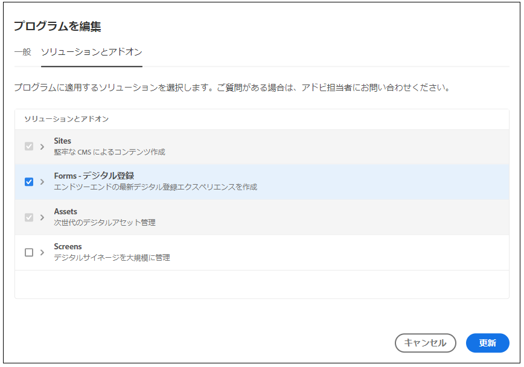

# [!DNL AEM Forms]（オンプレミス環境と AMS 環境）から [!DNL AEM Forms] as a Cloud Service への移行  {#Harden-your-AEM-Forms-as-a-Cloud-Service-environment}

| バージョン | 記事リンク |
| -------- | ---------------------------- |
| AEM 6.5 | [ここをクリックしてください](https://experienceleague.adobe.com/docs/experience-manager-65/forms/upgrade-aem-forms/upgrade.html?lang=ja) |
| AEM as a Cloud Service | この記事 |

アダプティブフォーム、テーマ、テンプレートおよびクラウドの設定は、OSGi 上の <!-- AEM 6.3 Forms AEM 6.4 Forms on OSGi and --> AEM 6.5 Forms から [!DNL AEM] as a Cloud Service に移行またはアップグレードできます。これらのアセットを移行する前に、移行ユーティリティを使用して、以前のバージョンで使用されていた形式を [!DNL AEM] as a Cloud Service で使用されていた形式に変換します。
AEM as a Cloud Service への移行ジャーニーの概要 | Adobe Experience Manager移行ユーティリティを実行すると、以下の項目が更新されます。

* アダプティブフォームのカスタムコンポーネント
* アダプティブフォームのテンプレートとテーマ
* クラウドの設定情報
* コードエディターのスクリプトは再利用可能な関数に変換され、ビジュアルルールに適用されます。

## Forms as a Cloud Serviceへの移行に関する考慮事項 {#consideration}

AEM 6.5 Forms から AEM Cloud Service に移行するには、次の点を考慮に入れることが重要です。

* このサービスは、OSGi 環境上の [!DNL AEM Forms] のみからコンテンツを移行するのに役立ちます。JEE 上の [!DNL AEM Forms] からクラウドサービス環境へのコンテンツの移行はサポートされていません。

* （AEM 6.5 Forms より前のバージョンのみ）AEM 6.3 Forms または以前のバージョンで使用可能な、初期設定のテンプレートおよびテーマに基づくアダプティブフォームは、[!DNL AEM Forms] as a Cloud Service ではサポートされていません。

* Adobe Experience Manager Forms as a Cloud Service は、Adobe Experience Manager 6.5 Forms（オンプレミスおよびアドビのマネージドサービス）環境と比較して、既存の機能にいくつかの顕著な変更を加えました。サービスへの移行を進める前に、[これらの注目すべき変更点](notable-changes.md)と、[機能レベルの違い](https://experienceleague.adobe.com/docs/experience-manager-cloud-service/content/migration-journey/cloud-migration/best-practices-analyzer/using-best-practices-analyzer.html?lang=ja#viewing-report)について説明し、組織で必要な機能に基づいて移行を決定してください。

<!-- 
## Difference with AEM 6.5 Forms 

| Feature         | Difference with AEM 6.5 Forms    |
|--------------|-----------|
| HTML5 Forms (Mobile Forms)     | The service does not support HTML5 Forms (Mobile Forms). If you render your XDP-based forms as HTML5 Forms, you can continue using the feature on AEM 6.5 Forms. |
| Adaptive Forms     | <li><b>XSD-Based Adaptive Forms:</b> The service does not support HTML5 Forms (Mobile Forms). If you render your XDP-based forms as HTML5 Forms, you can continue using the feature on AEM 6.5 Forms. </li> <li><b> Adaptive Form templates:</b> Use build pipeline and corresponding Git repository of your program to import existing Adaptive Form templates. </li><li><b>Rule editor:</b> AEM Forms as a Cloud Service provides a hardened [Rule editor](rule-editor.md#visual-rule-editor). The code editor is not available on Forms as a Cloud Service. The migration utility helps you migrate your forms that have custom rules (created in code editor). The utility converts such rules into custom functions supported on Forms as a Cloud Service. You can use the reusable functions with Rule editor to continue obtaining results obtained with rule scripts  The `onSubmitError` or `onSubmitSuccess` functions are now available as actions the Rule Editor. </li> <li><b>Drafts and submissions:</b> The service does not retain metadata for drafts and submitted Adaptive Forms. </li> <li><b> Prefill Service:</b> By default, the prefill service merges data with an Adaptive Form at client as opposed to merging data on Server in AEM 6.5 Forms. The feature helps improve the time required to prefill an Adaptive Form. You can always configure to run the merge action on the Adobe Experience Manager Forms Server. </li><li><b>Submit actions:</b> The **Email as PDF** action is not available. The **Email** submit action provide options to send attachments and attach Document of Record (DoR) with email. </li>|
| Form Data Model | <li>Forms data model supports only HTTP and HTTPs endpoints to submit data. </li><li>Forms as a Cloud Service allows to use Microsoft Azure Blob, Microsoft Sharepoint, Microsoft OneDrive, and services supporting general CRUD (Create, Read, Update, and Delete) operations as data stores. The service does not support JDBC connector, Mutual SSL for Rest connector, and x509 certificate-based authentication for SOAP data sources. </li>|
| Automated Forms Conversion Service     | The service does not provide meta-model for Automated Forms Conversion Service. You can [download it from Automated Forms Conversion Service documentation](https://experienceleague.adobe.com/docs/aem-forms-automated-conversion-service/using/extending-the-default-meta-model.html?lang=ja#default-meta-model).|
|Configurations|<li>Email support only HTTP and HTTPs protocols, by default. [Contact the support team](https://experienceleague.adobe.com/docs/experience-manager-cloud-service/implementing/developing/development-guidelines.html?lang=ja#sending-email) to enable ports for sending emails and to enable SMTP protocol for your environment. </li> <li>If you use custom bundles, recompile your code with latest version of adobe-aemfd-docmanager before using these bundles with Forms as a Cloud Service.</li> |
| Document Manipulation APIs (Assembler Service)| The service does not support operations dependent on other services or applications: <li>Conversion of documents in a non-PDF format to a PDF format is not supported. For example, Microsoft Word to PDF, Microsoft Excel to PDF, and HTML to PDF are not supported</li><li>Adobe Distiller-based conversions are not supported. For example, PostScript(PS) to PDF</li><li>Forms Service-based conversions are not supported. For example, XDP to PDF Forms.</li><li>The service does not support converting a Signed PDF or Transparent PDF to another PDF format.</li>| -->

## 前提条件 {#prerequisites}

AEM Forms 6.5 から AEM as a Cloud Service 環境へのスムーズな移行を確実に行うには、次の前提条件を考慮することが重要です。

* お使いの Forms Cloud Service プログラムで「[Forms - デジタル登録](https://experienceleague.adobe.com/docs/experience-manager-cloud-manager/using/getting-started/setting-up-program.html?lang=ja#editing-program)」オプションを有効にし、[パイプラインを実行](https://experienceleague.adobe.com/docs/experience-manager-cloud-manager/using/how-to-use/deploying-code.html?lang=ja)します。

  

* Cloud Service 環境では、移行ユーティリティはコンテンツトランスファーツールと連携して機能します。移行ユーティリティは、[!DNL AEM Forms] アセットをクラウドサービスと互換性のあるものにし、コンテンツ転送ツールは、コンテンツを [!DNL AEM Forms] 環境から[!DNL AEM] as a Cloud Service 環境に移行します。移行ユーティリティを使用する前に、[AEM as a Cloud Service に移行する](https://experienceleague.adobe.com/docs/experience-manager-cloud-service/moving/home.html?lang=ja)プロセスを学習します。このプロセスでは、次のツールを使用します。
   * [コンテンツ転送ツール](https://experienceleague.adobe.com/docs/experience-manager-cloud-service/moving/cloud-migration/content-transfer-tool/overview-content-transfer-tool.html?lang=ja#cloud-migration)：コンテンツ転送ツールは、コンテンツを準備して、既存の環境からクラウドサービス環境に転送するのに役立ちます。これにより、ユーザーは AEM Forms からクラウド環境に簡単にアップグレードできます。
* [!DNL AEM Forms] as a Cloud Service およびローカル [!DNL AEM Forms] 環境の管理者権限を持つアカウント。
* [ソフトウェア配布ポータル](https://experience.adobe.com/#/downloads/content/software-distribution/jp/aemcloud.html)からベストプラクティスアナライザー、コンテンツトランスファーツール、[!DNL AEM Forms] 移行ユーティリティをダウンロードしてインストールします。

* [ベストプラクティスアナライザー](https://experienceleague.adobe.com/docs/experience-manager-cloud-service/moving/cloud-migration/best-practices-analyzer/overview-best-practices-analyzer.html?lang=ja#cloud-migration) ツールを実行し、報告された問題を修正します。Adobe Experience Manager Forms から Adobe Experience Manager Forms as a Cloud Service への移行に関して考えられる問題については、[Forms as a Cloud Service の AEM パターン検出](https://experienceleague.adobe.com/docs/experience-manager-cloud-service/content/migration-journey/cloud-migration/best-practices-analyzer/using-best-practices-analyzer.html?lang=ja#viewing-report)を参照してください。

<!-- * Download the latest [compatibility package](https://experienceleague.adobe.com/docs/experience-manager-release-information/aem-release-updates/forms-updates/aem-forms-releases.html?lang=ja#aem-65-forms-releases) for your [!DNL AEM Forms] version. -->

## [!DNL AEM 6.5 Forms] アセットを AEM Cloud Service に移行 {#use-the-migration-utility}

次の手順を実行して、[!DNL AEM Forms] アセットをクラウドサービスと互換性を持たせ、[!DNL AEM] as a Cloud Service 環境に転送します。

1. 既存の [!DNL AEM Forms] 環境の[クローン](https://experienceleaguecommunities.adobe.com/t5/adobe-experience-manager/correct-method-to-clone-the-aem-environment/td-p/363487?profile.language=ja)を作成します。

   >[!NOTE]
   >
   > 6.5 から Cloud Service に移行する場合は、クローン環境を使用してコンテンツトランスファーツールおよび移行ユーティリティを実行することをお勧めします。コンテンツトランスファーツールと移行ユーティリティで、コンテンツとアセットに変更をいくつか加えます。したがって、実稼働環境上でコンテンツトランスファーツールまたは移行ユーティリティを実行しないでください。

1. 管理者権限を使ってクローン環境にログインします。

1. クローン環境の[ソフトウェア配布ポータル](https://experienceleague.adobe.com/docs/experience-manager-cloud-service/moving/cloud-migration/content-transfer-tool/overview-content-transfer-tool.html?lang=ja#cloud-migration)から、[!DNL AEM Forms]コンテンツ転送ツール[と ](https://experience.adobe.com/#/downloads/content/software-distribution/jp/aemcloud.html) as a Cloud Service 移行ユーティリティをダウンロードしてインストールします。AEM パッケージマネージャーを使用して、ツールとユーティリティをインストールできます。

1. **[!UICONTROL ツール]**／**[!UICONTROL 操作]**／**[!UICONTROL コンテンツの移行]**&#x200B;に移動します。

1. **[!UICONTROL 移行用フォームの準備]**&#x200B;カードを開きます。ブラウザーに、以下に示す 5 つのオプションが表示されます。
   * **[!UICONTROL AEM Forms アセットの移行]**
   * **[!UICONTROL アダプティブフォームカスタムコンポーネントの移行]**
   * **[!UICONTROL アダプティブフォームテンプレートの移行]**
   * **[!UICONTROL AEM Forms クラウド設定の移行]**
   * **[!UICONTROL コードエディタースクリプトの移行]**

1. オプションを次々に使用して、[!DNL AEM Forms] アセットに [!DNL AEM] as a Cloud Service との互換性を持たせます。

   1. 「**[!UICONTROL AEM Forms アセットの移行]**」を選択し、次の画面で「**[!UICONTROL 移行を開始]**」を選択します。これにより、[!DNL AEM Forms] 環境のアダプティブフォームとテーマは [!DNL AEM] as a Cloud Service と互換性を持つようになります。

   1. 「**[!UICONTROL アダプティブフォームカスタムコンポーネントの移行]**」を選択し、カスタムコンポーネントの移行ページで「**[!UICONTROL 移行を開始]**」を選択します。これは、アダプティブフォーム用に開発されたカスタムコンポーネントと、[!DNL AEM Forms] 環境上のコンポーネントオーバーレイを、[!DNL AEM] as a Cloud Service と互換性を持たせます。

   1. 「**[!UICONTROL アダプティブフォームテンプレートの移行]**」を選択し、カスタムコンポーネントの移行ページで「**[!UICONTROL 移行を開始]**」を選択します。AEM テンプレートエディターを使用して作成された `/apps` または `/conf` のアダプティブフォームテンプレートは、[!DNL AEM] as a Cloud Service と互換性があります。

   1. 「**[!UICONTROL AEM Forms クラウド設定の移行]**」を選択し、設定の移行ページで「**[!UICONTROL 移行を開始]**」を選択します。次のクラウドサービスを更新して新しい場所に移動します。

      * Form Data Model Cloud Service
      * Google reCAPTCHA Cloud Service
      * [!DNL Adobe Sign] Cloud Service
      * Adobe Fonts Cloud Service

   1. 「**[!UICONTROL コードエディタースクリプトの移行]**」を選択し、再利用可能な関数を保存する場所を指定して、「**[!UICONTROL 移行を開始]」を選択します。

   Cloud Service は、ルールエディタースクリプトをサポートしていません。**[!UICONTROL コードエディタースクリプトの移行]**&#x200B;ツールは、環境上のすべてのルールスクリプトを再利用可能な関数に変換し、再利用可能な関数を適切な場所のビジュアルエディターに適用します。これらの再利用可能な関数は、クライアントライブラリの形式で保存され、既存の機能をそのまま維持するのに役立ちます。ツールは、生成された再利用可能な関数を、対応するアダプティブフォームに自動的に適用します。

   AEM Forms を Cloud Service へ移行するには、[パッケージマネージャー](https://experienceleague.adobe.com/docs/experience-manager-65/administering/contentmanagement/package-manager.html?lang=ja#contentmanagement)を使用して、再利用可能な関数（クライアントライブラリ）をパッケージに書き出します。

1. 再利用可能な関数（クライアントライブラリ）パッケージ、[カスタムコード、コンポーネント、設定](https://experienceleague.adobe.com/docs/experience-manager-learn/cloud-service/cloud-manager/devops/deploy-code.html?lang=ja#cloud-manager)、カスタムロケール固有のライブラリを、[!DNL AEM] as a Cloud Service 環境に[デプロイ](https://experienceleague.adobe.com/docs/experience-manager-cloud-service/implementing/deploying/overview.html?lang=ja#deploying-content-packages-via-cloud-manager-and-package-manager)します。

   <!-- 1. Install the latest [Compatibility Package](https://experienceleague.adobe.com/docs/experience-manager-cloud-service/moving/cloud-migration/content-transfer-tool/overview-content-transfer-tool.html?lang=ja&#cloud-migration) to your cloned [!DNL AEM Forms] environment. -->

1. [コンテンツ転送ツール](https://experienceleague.adobe.com/docs/experience-manager-cloud-service/moving/cloud-migration/content-transfer-tool/overview-content-transfer-tool.html?lang=ja#cloud-migration)を実行します。**[!UICONTROL 移行セットを作成]**&#x200B;画面でパラメーターを指定する際、アダプティブフォーム、テーマ、テンプレート、フォームデータモデル（FDM）、クラウドサービス、カスタムコンポーネント、その他の AEM Forms 固有のアセットのパスを「**[!UICONTROL 含めるパス]**」オプションに指定します。指定した [!DNL AEM Forms] アセットを移行セットに追加します。

## 様々な AEM Forms 固有のアセットのパス

AEM Forms 6.5 から Cloud Service に移行する場合、AEM Forms 固有のアセットは次の場所にあります。

* **アダプティブフォーム**：アダプティブフォームは、`/content/dam/formsanddocuments/` および `/content/forms/af` にあります。例えば、WKND 登録という名前のアダプティブフォームの場合、`/content/dam/formsanddocuments/wknd-registration` と `/content/forms/af/wknd-registration` のパスを追加します。
* **フォームデータモデル**：すべてのフォームデータモデル（FDM）は、`/content/dam/formsanddocuments-fdm` にあります。例：`/content/dam/formsanddocuments-fdm/ms-dynamics-fdm`

* **クライアントライブラリ**：クライアントライブラリのデフォルトパスは `/etc/clientlibs/fd/theme` です。

* **アダプティブフォームテンプレート**：テンプレートのデフォルトパスは`/conf/<template folder>`です。例えば、基本追加パス`/conf/ReferenceEditableTemplates/settings/wcm/templates/basic`という名前のテンプレートの場合。

* **アダプティブフォームテーマとクライアントライブラリ**：テーマのデフォルトパスは` /content/dam/formsanddocuments-themes/`で、クライアントライブラリのデフォルトパスは`/etc/clientlibs/fd/theme`です。例えば、WKND テーマという名前のテンプレートの場合、パス` /content/dam/formsanddocuments-themes/wkndtheme`とテーマのクライアントライブラリを`/etc/clientlibs/reference-themes/wkndtheme-3-0`に追加します。他のカスタムパスにテーマとクライアントライブラリを配置することもできます。

* **クラウドの設定情報**：クラウドの設定情報は、`/conf/`で確認できます。例えば、フォームデータモデル（FDM）のクラウドの設定情報は `/conf/global/settings/cloudconfigs/fdm` にあります。

* **ワークフローモデル**：AEM ワークフローモデルは、`/conf/global/settings/workflow/models/`で参照できます。例えば、WKND 登録という名前のワークフローモデルの場合、パス`/conf/global/settings/workflow/models/wknd-registration`を追加します

以下に示すトップレベルのフォルダーパスまたは以下に示す特定のフォルダーパスを追加できます。AEM forms 6.5 から Cloud Service にアップグレードする際に、特定のアセットおよびすべてのアセットとフォームを一度に移行できます。

* `/content/dam/formsanddocuments-fdm`
* `/content/dam/formsanddocuments/themes`
* `/content/forms/af`
* `/etc/clientlibs/fd/theme`

AEM ワークフローモデルを AEM Forms 6.5 から Cloud Service に移行する場合は、次のパスを指定します。

* `/conf/global/settings/workflow/models/`
* `/conf/global/settings/workflow/launcher`
* `/var/workflow/models`

## 次を見る

* [既存の Adobe Experience Manager 6.5 Forms ユーザー向けの主な変更点](https://experienceleague.adobe.com/docs/experience-manager-cloud-service/content/forms/forms-overview/notable-changes.html?lang=ja)
* [AEM Forms as a Cloud Service へのオンボーディング](https://experienceleague.adobe.com/docs/experience-manager-cloud-service/content/forms/setup-configure-migrate/setup-forms-cloud-service.html?lang=ja)
* [Cloud Service で最初のアダプティブフォームを作成](https://experienceleague.adobe.com/docs/experience-manager-cloud-service/content/forms/adaptive-forms-authoring/authoring-adaptive-forms-foundation-components/create-an-adaptive-form-on-forms-cs/creating-adaptive-form.html?lang=ja)

## 追加情報

移行ユーティリティを使用すると、基盤コンポーネントに基づいてアダプティブフォームを移行できます。また、Forms as a Cloud Service は、アダプティブフォームコアコンポーネントをサポートしています。次の事項ができるようになります。

* [コアコンポーネントベースのスタンドアロンのアダプティブフォームを作成する](/help/forms/creating-adaptive-form-core-components.md)
* [AEM Sites ページでコアコンポーネントベースのアダプティブフォームを直接作成](/help/forms/create-or-add-an-adaptive-form-to-aem-sites-page.md)

AEM Forms as a Cloud Service の詳細については、次を参照してください。

* [AEM Forms Cloud Service の概要](/help/forms/home.md)
* [AEM Forms Cloud Service のイノベーション](/help/forms/latest-innovations.md)