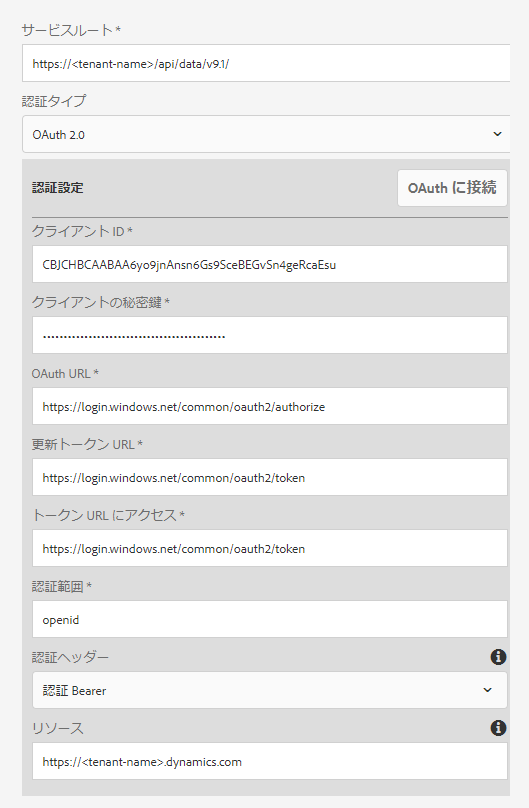
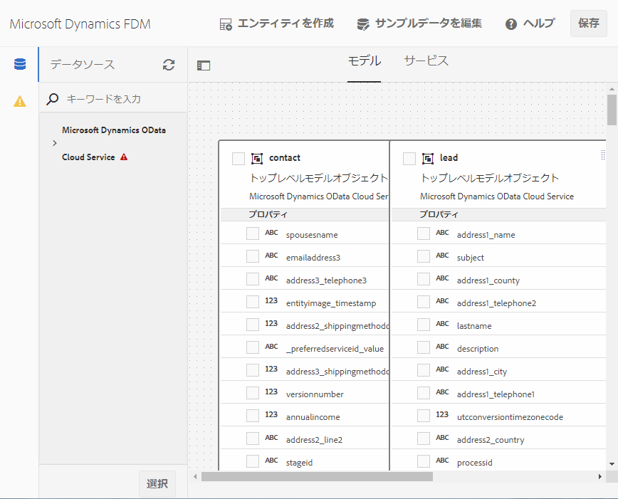

# [!DNL Microsoft Dynamics] OData 設定 {#microsoft-dynamics-odata-configuration}

| バージョン | 記事リンク |
| -------- | ---------------------------- |
| AEM 6.5 | [ここをクリックしてください](https://experienceleague.adobe.com/docs/experience-manager-65/forms/form-data-model/ms-dynamics-odata-configuration.html?lang=ja) |
| AEM as a Cloud Service | この記事 |


[!DNL Microsoft Dynamics] は、顧客関係管理（CRM）および企業資源計画（ERP）用のソフトウェアで、顧客の口座や連絡先、潜在顧客、顧客機会、顧客事例を作成して管理する企業ソリューションを提供します。[[!DNL Experience Manager Forms] データ統合](data-integration.md)は、Forms をオンラインサーバーとオンプレミス[!DNL Microsoft Dynamics]サーバーの両方と統合するための OData クラウドサービス設定を提供します。これにより、[!DNL Microsoft Dynamics] サービスで定義されるエンティティ、属性、サービスに基づいて、フォームデータモデル（FDM）を作成できるようになります。フォームデータモデル（FDM）を使用して、[!DNL Microsoft Dynamics] サーバーと連携するアダプティブフォームを作成することにより、ビジネスワークフローを使用できるようになります。次に例を示します。

* [!DNL Microsoft Dynamics] サーバーに対してデータに関するクエリを実行し、アダプティブフォームに事前入力する
* アダプティブフォームの送信時に、データを [!DNL Microsoft Dynamics] に書き込む
* フォームデータモデル（FDM）で定義されているカスタムエンティティを通じて、データを [!DNL Microsoft Dynamics] に書き込む（または書き出す）

<!--[!DNL Experience Manager Forms] add-on package also includes reference OData configuration that you can use to quickly integrate [!DNL Microsoft Dynamics] with [!DNL Experience Manager Forms].-->

<!--When the package is installed, the following entities and services are available on your [!DNL Experience Manager Forms] instance:

* MS Dynamics OData Cloud Service (OData Service)-->
<!--* Form Data Model with preconfigured [!DNL Microsoft Dynamics] entities and services.-->

<!-- Preconfigured [!DNL Microsoft Dynamics] entities and services in a Form Data Model are available on your [!DNL Experience Manager Forms] instance only if the run mode for the [!DNL Experience Manager] instance is set as `samplecontent` (default). -->  MS Dynamics OData Cloud Service（OData サービス）は、すべての実行モードで使用できます。[!DNL Experience Manager] インスタンスの実行モードの設定について詳しくは、「[実行モード](https://experienceleague.adobe.com/docs/experience-manager-cloud-service/implementing/deploying/overview.html?lang=ja#runmodes)」を参照してください。

AEM as a Cloud Service では、フォーム送信を処理するための様々な送信アクションが標準で提供されます。これらのオプションについて詳しくは、 [アダプティブフォーム送信アクション](/help/forms/configure-submit-actions-core-components.md)の記事を参照してください。


## 前提条件 {#prerequisites}

[!DNL Microsoft Dynamics] の設定を開始する前に、次のことを確認してください。

<!--* Installed the [[!DNL Experience Manager Forms] add-on package](installing-configuring-aem-forms-osgi.md) -->
* [!DNL Microsoft Dynamics] 365 がオンライン環境で設定されているか、以下のいずれかの [!DNL Microsoft Dynamics] バージョンのインスタンスがインストールされていること：

   * [!DNL Microsoft Dynamics] 365 オンプレミス
   * [!DNL Microsoft Dynamics] 2016 オンプレミス

* [ [!DNL Microsoft Dynamics] オンラインサービス用アプリケーションを [!DNL Microsoft Azure] Active Directory](https://docs.microsoft.com/ja-jp/dynamics365/customer-engagement/developer/walkthrough-register-dynamics-365-app-azure-active-directory) に登録しました。登録済みサービスのクライアント ID（アプリケーション ID）とクライアントの秘密鍵の値を書き留めてください。これらの値は [ [!DNL Microsoft Dynamics]  サービス用にクラウドサービスを設定する時に使用します](#configure-cloud-service-for-your-microsoft-dynamics-service)。

## 登録された [!DNL Microsoft Dynamics] アプリケーションの応答 URL を設定 {#set-reply-url-for-registered-microsoft-dynamics-application}

以下の手順で、登録された [!DNL Microsoft Dynamics] アプリケーションの応答 URL を設定します。

>[!NOTE]
>
>この手順は、[!DNL Experience Manager Forms] をオンラインの [!DNL Microsoft Dynamics] サーバーと統合する場合にのみ使用してください。

1. [!DNL Microsoft Azure] Active Directory アカウントに移動し、登録済みアプリケーションの「**[!UICONTROL 応答 URL]**」設定に以下のクラウドサービス設定の URL を追加します。

   `https://[server]:[port]/libs/fd/fdm/gui/components/admin/fdmcloudservice/createcloudconfigwizard/cloudservices.html`

   

1. 設定を保存します。

## IFD 用に [!DNL Microsoft Dynamics] を設定 {#configure-microsoft-dynamics-for-ifd}

[!DNL Microsoft Dynamics] の外部ユーザーは、[!DNL Microsoft Dynamics] でクレームベース認証を使用して、CRM サーバー上のデータにアクセスすることができます。この機能を有効にするには、以下の手順により、インターネット接続展開（IFD）用に [!DNL Microsoft Dynamics] を有効にして、クレーム設定をします。

>[!NOTE]
>
> この手順は、[!DNL Experience Manager Forms] をオンプレミスの [!DNL Microsoft Dynamics] サーバーと統合する場合にのみ使用してください。

1. 「[ [!DNL Microsoft Dynamics] の IFD 設定](https://technet.microsoft.com/ja-jp/library/dn609803.aspx)」の説明に従って、IFD の [!DNL Microsoft Dynamics] オンプレミスインスタンスを設定します。
1. Windows PowerShell を使用して以下のコマンドを実行し、IFD が有効になっている [!DNL Microsoft Dynamics] でクレームを設定します。

   ```shell
   Add-PSSnapin Microsoft.Crm.PowerShell
    $ClaimsSettings = Get-CrmSetting -SettingType OAuthClaimsSettings
    $ClaimsSettings.Enabled = $true
    Set-CrmSetting -Setting $ClaimsSettings
   ```

   詳しくは、「[CRM オンプレミス（IFD）のアプリ登録](https://msdn.microsoft.com/ja-jp/library/dn531010(v=crm.7).aspx#bkmk_ifd)」を参照してください。

## AD FS マシンで OAuth クライアントを設定する {#configure-oauth-client-on-ad-fs-machine}

OAuth クライアントを Active Directory Federation Services（AD FS）マシンに登録し、AD FS マシンでアクセス権限を設定するには、以下の手順を実行します。

>[!NOTE]
>
>この手順は、[!DNL Experience Manager Forms] をオンプレミスの [!DNL Microsoft Dynamics] サーバーと統合する場合にのみ使用してください。

1. 次のコマンドを実行します。

   `Add-AdfsClient -ClientId “<Client-ID>” -Name "<name>" -RedirectUri "<redirect-uri>" -GenerateClientSecret`

   各パラメーターの意味は次のとおりです。

   * `Client-ID` は、任意の GUID ジェネレーターを使用して生成できるクライアント ID です。
   * `redirect-uri` は、[!DNL Experience Manager Forms] 上の [!DNL Microsoft Dynamics] OData クラウドサービスに対する URL です。[!DNL Experience Manager Forms] と共にインストールされるデフォルトのクラウドサービスは、次の URL にデプロイされます。
     `https://'[server]:[port]'/libs/fd/fdm/gui/components/admin/fdmcloudservice/createcloudconfigwizard/cloudservices.html`

1. 以下のコマンドを実行して、AD FS マシン上でアクセス権を設定します。

   `Grant-AdfsApplicationPermission -ClientRoleIdentifier “<Client-ID>” -ServerRoleIdentifier <resource> -ScopeNames openid`

   各パラメーターの意味は次のとおりです。

   * `resource` は [!DNL Microsoft Dynamics] 組織の URL です。

1. [!DNL Microsoft Dynamics] では、HTTPS プロトコルが使用されます。[!DNL Forms] サーバーから AD FS エンドポイントを呼び出すには、[!DNL Experience Manager Forms] を実行しているコンピューターで `keytool` コマンドを使用して、[!DNL Microsoft Dynamics] のサイト証明書を Java 証明書ストアにインストールします。

## [!DNL Microsoft Dynamics] サービス用にクラウドサービスを設定する {#configure-cloud-service-for-your-microsoft-dynamics-service}

OData サービスは、そのサービスのルート URL によって識別されます。[!DNL Experience Manager] as a Cloud Service で OData サービスを設定するには、そのサービスのルート URL を確認して、以下の手順を実行します。

<!--The **MS Dynamics OData Cloud Service (OData Service)** configuration comes with default OData configuration. To configure it to connect with your [!DNL Microsoft Dynamics] service, do the following.-->

>[!NOTE]
>
>オンライン環境またはオンプレミス環境で [!DNL Microsoft Dynamics 365] を設定する詳しい手順については、[[!DNL Microsoft Dynamics] OData 設定](ms-dynamics-odata-configuration.md)を参照してください。

1. **[!UICONTROL ツール／クラウドサービス／データソース]**&#x200B;に移動します。クラウド設定の作成対象となるフォルダーを選択します。

   クラウドサービス設定用フォルダーの作成方法と構成方法については、「[クラウドサービス設定用フォルダーの構成](#cloud-folder)」を参照してください。

1. 「**[!UICONTROL 作成]**」を選択して、**[!UICONTROL データソース設定を作成]**&#x200B;ウィザードを開きます。設定の名前と、必要に応じて設定のタイトルを指定し、**[!UICONTROL サービスタイプ]**&#x200B;ドロップダウンで「**[!UICONTROL OData サービス]**」を選択します。必要な場合は、設定のサムネール画像を参照および選択して「**[!UICONTROL 次へ]**」を選択します。
「**[!UICONTROL 認証設定]**」タブで、次のように設定します。

   1. 「**[!UICONTROL サービスルート]**」フィールドの値を入力します。Dynamics インスタンスの「**[!UICONTROL 開発者向けリソース]**」に移動し、「サービスルート」フィールドの値を表示します。例えば、https://&lt;tenant-name>/api/data/v9.1/ です。

   1. 認証のタイプとして「**[!UICONTROL OAuth 2.0]**」を選択します。

   1. 「**[!UICONTROL クライアント ID]**」（「**アプリケーション ID**」とも呼ばれます）、「**[!UICONTROL クライアントの秘密鍵]**」、「**[!UICONTROL OAuth URL]**」、「**[!UICONTROL 更新トークン URL]**」、「**[!UICONTROL トークン URL にアクセス]**」、「**[!UICONTROL リソース]**」の各フィールドのデフォルト値を、 サービス設定の値と置き換えます。[!DNL Microsoft Dynamics][!DNL Microsoft Dynamics] をフォームデータモデル（FDM）で設定するには、「**[!UICONTROL リソース]**」フィールドで Dynamics インスタンスの URL を指定する必要があります。サービスルート URL を使用して、Dynamics インスタンスの URL を取得します。例えば、[https://org.crm.dynamics.com](https://org.crm.dynamics.com/) です。

   1. [!DNL Microsoft Dynamics] の認証プロセス用の「**[!UICONTROL 認証範囲]**」フィールドで、「**[!UICONTROL openid]**」を指定します。

      
フォームデータモデル（FDM）
1. 「**[!UICONTROL OAuth に接続]**」をクリックします。[!DNL Microsoft Dynamics] のログインページにリダイレクトされます。
1. [!DNL Microsoft Dynamics] の資格情報を使用してログインし、クラウドサービス設定を使用して [!DNL Microsoft Dynamics] サービスに接続することに同意します。このサービスとクラウドサービスとの間にフォームデータモデル（FDM）接続を確立する操作は 1 回だけ行います。

   クラウドサービス設定のページに切り替わります。このページには、OData の設定が正常に保存されたことを示すメッセージが表示されます。

これで、MS Dynamics OData Cloud Service（OData サービス）がクラウドサービスとして設定され、Dynamics サービスに接続されます。フォームデータモデル（FDM）

## フォームデータモデル（FDM）の作成 {#create-form-data-model}

<!--When you install the [!DNL Experience Manager Forms] package, a form data model, **[!DNL Microsoft Dynamics] FDM**, is deployed on your [!DNL Experience Manager] instance. By default, the Form Data Model uses [!DNL Microsoft Dynamics] service configured in the MS Dynamics OData Cloud Service (OData Service) as its data source.

On opening the Form Data Model for the first time, it connects to the configured [!DNL Microsoft Dynamics] service and fetches entities from your [!DNL Microsoft Dynamics] instance. The "contact" and "lead" entities from [!DNL Microsoft Dynamics] are already added in the form data model.

To review the form data model, go to **[!UICONTROL Form Data Model egrations]**. Select **[!DNL Microsoft Dynamics] FDM** and click **[!UICONTROL Edit]** to open the Form Data Model in edit mode. Alternatively, you can open the Form Data Model directly from the following URL:

`https://'[server]:[port]'/aem/fdm/editor.html/content/dam/formsanddocuments-fdm/ms-dynamics-fdm`
 Form Data Model 
-->

MS Dynamics OData クラウドサービスを設定した後、フォームデータモデル（FDM）の作成時にこのサービスを使用できます。詳しくは、[フォームデータモデル（FDM）の作成](create-form-data-models.md)を参照してください。

次に、フォームデータモデル（FDM）に基づいてアダプティブフォームを作成し、次のような様々なアダプティブフォームの使用例で使用できます。

* [!DNL Microsoft Dynamics] のエンティティとサービスに対してクエリを実行し、取得した情報を使用してアダプティブフォームに事前入力する
* アダプティブフォームのルールを使用して、フォームデータモデル（FDM）内で定義された [!DNL Microsoft Dynamics] サーバーの操作を呼び出す
* 送信されたフォームデータを [!DNL Microsoft Dynamics] のエンティティに書き込む

<!--It is recommended to create a copy of the Form Data Model provided with the [!DNL Experience Manager Forms] package and configure data models and services to suit your requirements. It will ensure that any future updates to the package do not override your form data model.-->

アダプティブフォームの[フォームデータモデル送信アクションを設定](/help/forms/using-form-data-model.md)すると、Microsoft Dynamics OData にデータを送信できます。

ビジネスワークフローでのフォームデータモデル（FDM）の作成および使用について詳しくは、[データ統合](data-integration.md)を参照してください。

## 関連記事

{{af-submit-action}}
