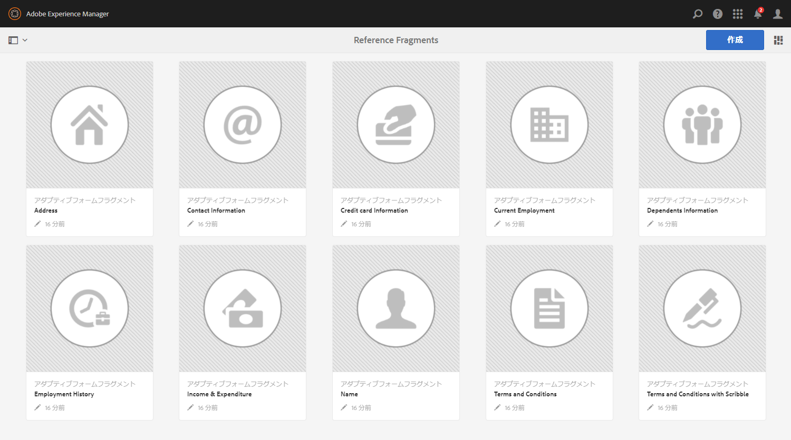
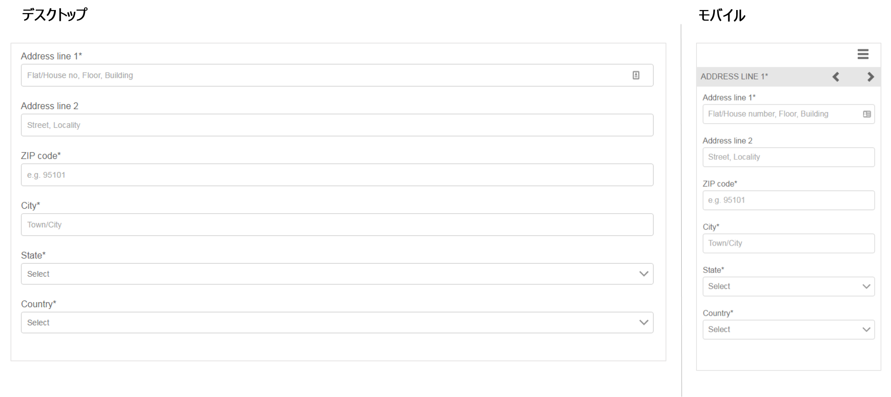
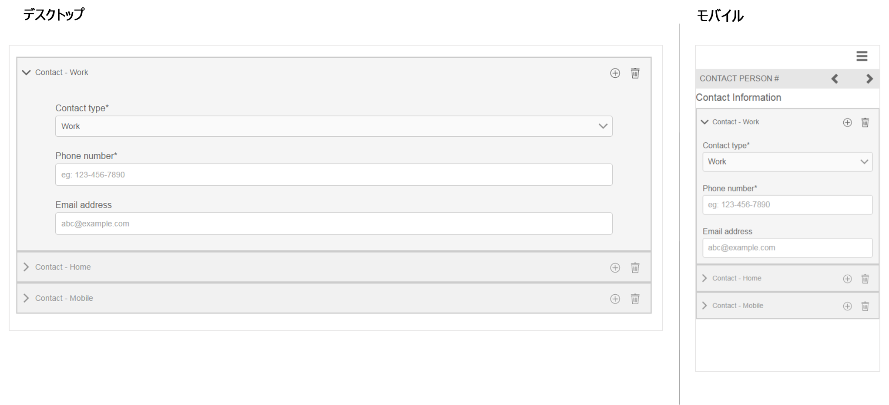
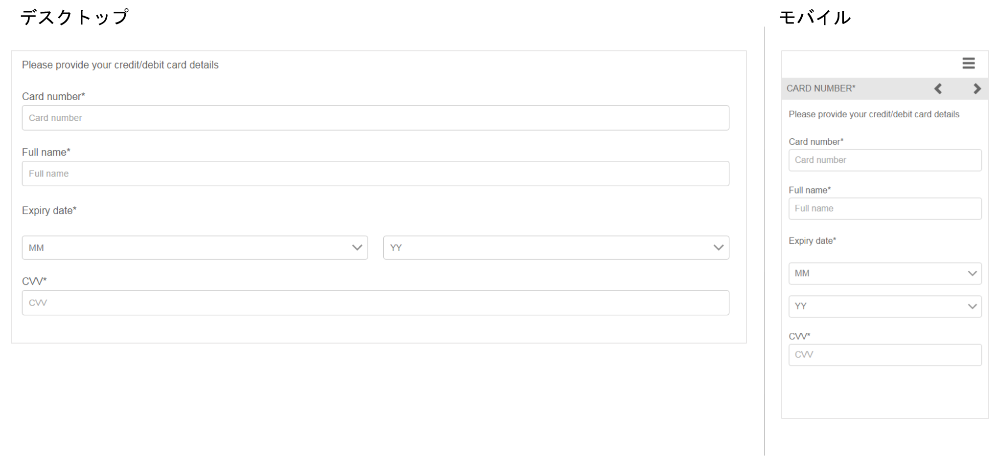
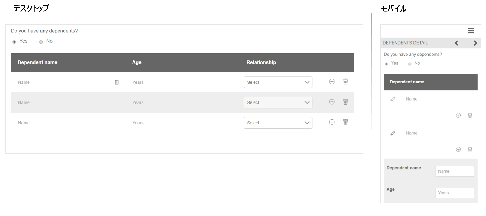
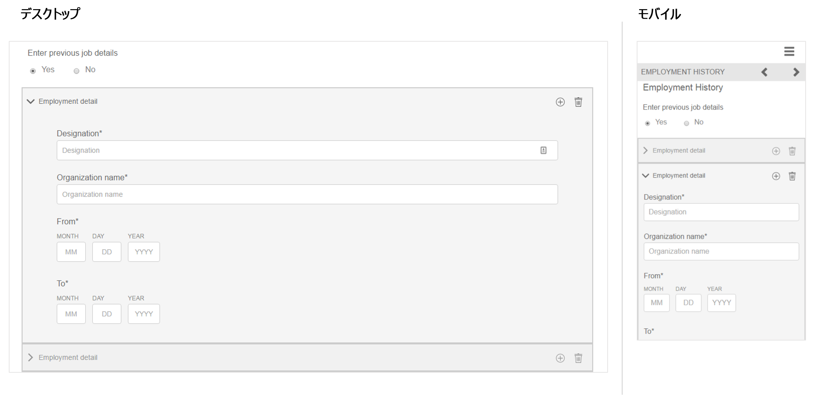
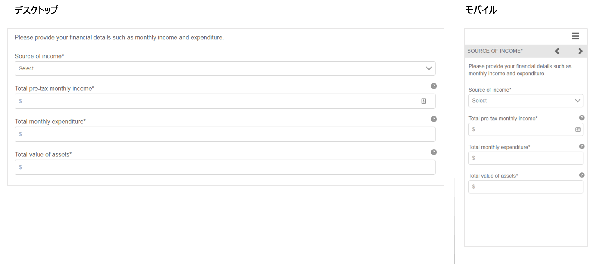
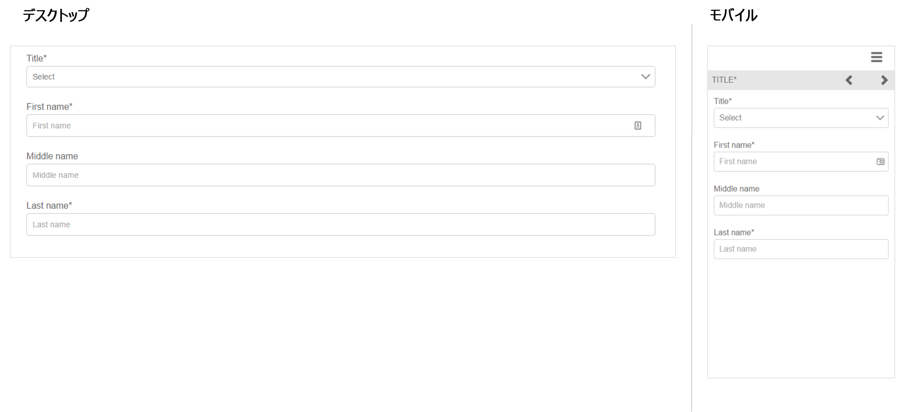
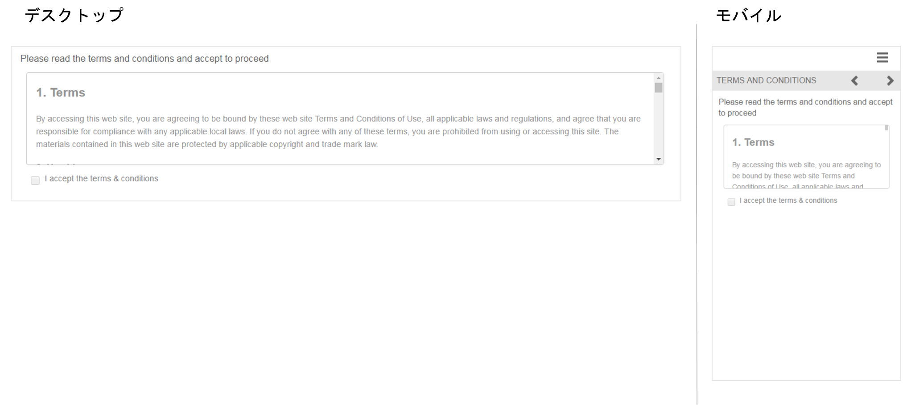
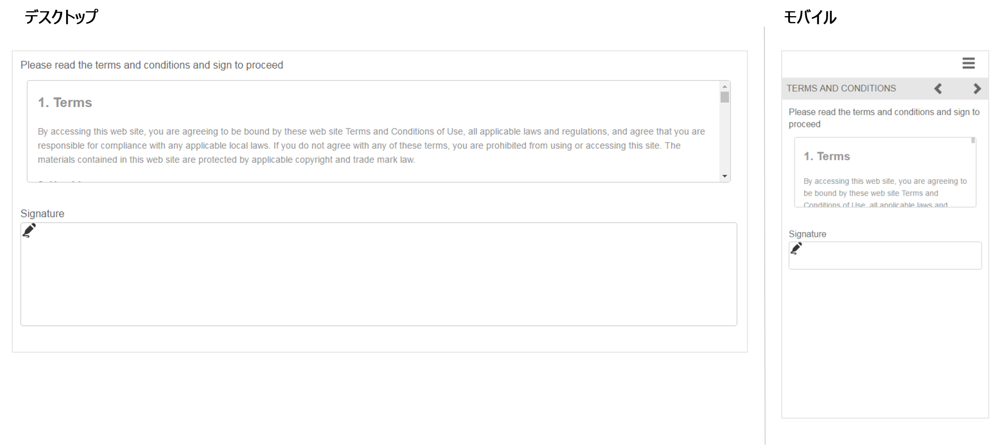

# 参照用のアダプティブフォームフラグメント {#reference-adaptive-form-fragments}

アダプティブフォームフラグメントは、フォームの作成時に使用できるフィールドのグループまたはフィールドのグループを含むパネルです。これを使用してフォームを簡単にすばやく作成できます。サイドバーのアセットブラウザーを使用してアダプティブフォームフラグメントをフォームにドラッグ&amp;ドロップし、フォームエディターで編集することができます。

アダプティブフォームの作成者に向けて、[!DNL AEM Forms] パッケージ [[!DNL AEM FORMS] REFERENCE FRAGMENTS](https://www.adobeaemcloud.com/content/marketplace/marketplaceProxy.html?packagePath=/content/companies/public/adobe/packages/cq630/fd/AEM-FORMS-6.3-REFERENCE-FRAGMENTS) で参照用のフラグメントが提供されています。これには、次のフラグメントが含まれます。

* アドレス
* 連絡先情報
* クレジットカード情報
* 現在の職業
* 扶養家族の情報
* 職歴
* 収入と支出
* 名前
* 利用条件
* 署名付き利用条件

このパッケージをインストールすると、参照フラグメントを含む参照フラグメントフォルダーが「Forms &amp; Documents」の下に作成されます。 パッケージのインストールについては、[クラウドマネージャーとパッケージマネージャーを介したコンテンツパッケージのデプロイ](https://experienceleague.adobe.com/docs/experience-manager-cloud-service/implementing/deploying/overview.html?lang=ja#deploying-content-packages-via-cloud-manager-and-package-manager)および[パッケージの使用方法](https://experienceleague.adobe.com/docs/experience-manager-65/administering/contentmanagement/package-manager.html?lang=ja)を参照してください。

## アドレス {#address}

郵送先住所を指定するフィールドが含まれます。 使用可能なフィールドは、住所、郵便番号、市区町村、都道府県、国です。 また、指定した米国の郵便番号の市区町村と州を入力する事前設定済み Web サービスも含まれています。

<!--[Click to enlarge

](assets/address-1.png)-->

## 連絡先情報 {#contact-information}

電話番号と電子メールアドレスを取り込むためのフィールドが含まれます。

<!--[Click to enlarge

](assets/contact-info-1.png)-->

## クレジットカード情報 {#credit-card-information}

支払い処理に使用できるクレジットカード情報を取得するためのフィールドが含まれています。

## 現在の職業 {#current-employment}

雇用形態、雇用分野、役職、会社名、入社日など、現在の職業の詳細を取得するためのフィールドが含まれています。

<!--[Click to enlarge

](assets/current-emp-1.png)-->

## 扶養家族の情報 {#dependents-information}

1 人以上の扶養家族に関する情報（名前、関係、年齢など）を表形式で指定するためのフィールドが含まれています。

<!--[Click to enlarge

](assets/dependents-info-1.png)-->

## 職歴 {#employment-history}

雇用履歴をキャプチャするためのフィールドが含まれます。 複数の組織を追加できます。

<!--[Click to enlarge

](assets/emp-history-1.png)-->

## 収入と支出 {#income-expenditure}

1 か月のキャッシュフローと支出を取得するためのフィールドが含まれています。ユーザーに財務の詳細を入力するよう求めるFormsは、このフラグメントを使用して収入と支出をキャプチャできます。

<!--[Click to enlarge

](assets/income-1.png)-->

## 名前 {#name}

称号、名、ミドルネームおよび姓を指定するためのフィールドが含まれています。

<!--[Click to enlarge

](assets/name-1.png)-->

## 利用条件 {#terms-conditions}

ユーザーがフォームを送信する前に同意する利用条件を指定します。

<!--[Click to enlarge

](assets/tnc-1.png)-->

## 署名付き利用条件 {#terms-conditions-with-scribble}

ユーザーがフォームを送信する前に同意して署名する利用条件を指定します。

<!--[Click to enlarge

](assets/tnc-scribble-1.png)-->
