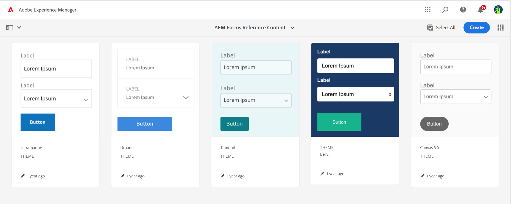
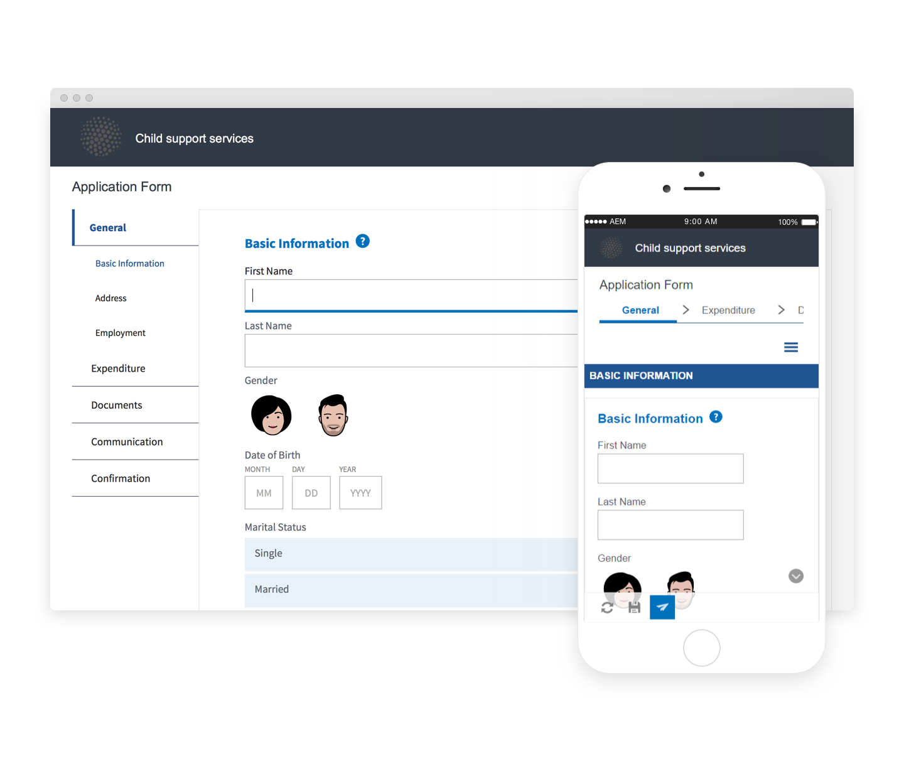

# 参照テーマ、テンプレート、フォームデータモデル {#reference-themes-templates-and-data-models}

| 適用先 | 記事リンク |
| -------- | ---------------------------- |
| コアコンポーネントに基づくアダプティブフォーム | [ここをクリックしてください](https://experienceleague.adobe.com/docs/experience-manager-core-components/using/adaptive-forms/sample-themes-templates-form-data-models-core-components.html?lang=ja) |
| 基盤コンポーネントに基づくアダプティブフォーム | この記事 |

>[!NOTE]
>
> [新しいアダプティブフォームを作成する](/help/forms/creating-adaptive-form-core-components.md)、または [AEM Sites ページにアダプティブフォームを追加する](/help/forms/create-or-add-an-adaptive-form-to-aem-sites-page.md)際には、最新の拡張可能なデータキャプチャである[コアコンポーネント](https://experienceleague.adobe.com/docs/experience-manager-core-components/using/adaptive-forms/introduction.html?lang=ja)を使用することをお勧めします。これらのコンポーネントは、アダプティブフォームの作成における大幅な進歩を示すものであり、優れたユーザーエクスペリエンスを実現します。この記事では、基盤コンポーネントを使用してアダプティブフォームを作成する従来の方法について説明します。

AEM Forms as a Cloud Service には、アダプティブフォームの作成をすぐに開始するのに役立つ、複数の参照テーマ、テンプレート、フォームデータモデル（FDM）が用意されています。[ソフトウェア配布ポータルからリファレンスコンテンツパッケージ](https://experience.adobe.com/#/downloads/content/software-distribution/en/aemcloud.html?package=/content/software-distribution/en/details.html/content/dam/aemcloud/public/aem-forms-reference-content.ui.content-2.1.0.zip)をダウンロードし、[パッケージマネージャー](/help/implementing/developing/tools/package-manager.md)を使用して、[リファレンスコンテンツパッケージ](https://experience.adobe.com/#/downloads/content/software-distribution/en/aemcloud.html?package=/content/software-distribution/en/details.html/content/dam/aemcloud/public/aem-forms-reference-content.ui.content-2.1.0.zip)を実稼働、開発、ローカル開発環境にインストールして、これらの参照アセットをお使いの環境に取り込むことができます。

参照コンテンツパッケージに含まれるテーマ、テンプレート、フォームデータモデル（FDM）は次のとおりです。

| テーマ | テンプレート | フォームデータモデル（FDM） |
|---------|----------|---------|
| Canvas 3.0 | 基本 | Microsoft Dynamics 365 |
| Tranquil | 空白 | Salesforce |
| Urbane |   |  |
| Ultramarine |  |  |
| Beryl |  |  |
| ヘルスケア |  |   |
| FSI |   |   |

## リファレンステーマ {#reference-themes}

[テーマ](/help/forms/themes.md)を使用すると、CSS に関する深い知識がなくてもフォームのスタイルを設定できます。[参照コンテンツパッケージ](https://experience.adobe.com/#/downloads/content/software-distribution/en/aemcloud.html?package=/content/software-distribution/en/details.html/content/dam/aemcloud/public/aem-forms-reference-content.ui.content-2.1.0.zip)をインストールすることで、次のテーマを入手できます。

* Beryl
* Canvas 3.0
* Tranquil
* Urbane
* Ultramarine
* ヘルスケア
* FSI（金融サービス＆保険）

各テーマには、独自のエレガントなスタイルが含まれていて、ユーザー向けの使いやすいアダプティブフォームの作成に使用できます。パネル、テキストボックス、数値ボックス、ラジオボタン、表、スイッチなど、セレクター用の独自のスタイル設定が含まれています。これらのテーマ内のスタイルは、要件に基づいたものです。例えば、あるシナリオで、クリーンなフォントを含む最小限のテーマが必要だとします。Liberty テーマなら、その外観を実現できます。

このパッケージに含まれるテーマはレスポンシブで、これらのテーマ内のスタイルはモバイルおよびデスクトップ表示用として定義されています。様々なデバイス上の最新ブラウザーのほとんどは、これらのテーマのいずれかが適用されたフォームを問題なくレンダリングできます。

パッケージのインストールについて詳しくは、[パッケージの作業方法](/help/implementing/developing/tools/package-manager.md)を参照してください。

## Beryl {#beryl}

Beryl テーマでは、背景画像、透明度、大きくてフラットなアイコンの使用が強調されます。以下のスクリーンショットで、Beryl テーマの外観と、フォームのスタイル設定がどのように拡張されるかを確認できます。

## Canvas 3.0 {#canvas}

Canvas 3.0 はアダプティブフォームのデフォルトのテーマで、基本色、透明度、フラットアイコンの使用が強調されます。以下のスクリーンショットでは、Canvas 3.0 のテーマがどのように表示されるのかを確認できます。

## Tranquil {#tranquil}

Tranquil テーマは、Tranquil カラースキームの明るいシェーディングと暗いシェーディングを提供して、フォームの様々なコンポーネントを強調します。例えば、ラジオボタン、パネル、タブが、様々なシェーディングの緑色になります。

## Urbane {#urbane}

Urbane テーマは、フォームの最小限の機能的外観を強調します。Urbane テーマをフォームに適用すると、コンポーネントはフラットになります。パネルには細いアウトラインが付けられ、モダンな外観を作成します。

## Ultramarine {#ultramarine}

Ultramarine テーマは、濃い青色のシェーディングを使用して、タブ、パネル、テキストボックス、ボタンなどのコンポーネントを強調します。

## ヘルスケア {#healthcare}

Healthcare テーマは、濃い緑色のシェードを使用して、タブ、パネル、テキストボックス、ボタンなどのコンポーネントを強調します。

## FSI（金融サービス＆保険）

FSI テーマは、フォームの最小限の機能的外観を強調します。FSI テーマをフォームに適用すると、パネルコンポーネントが黄色になります。

## 参照テンプレート {#reference-templates}

[テンプレート](/help/forms/themes.md)を使用すると、フォームの初期フォーム構造、コンテンツ、アクションを定義できます。[参照コンテンツパッケージ](https://experience.adobe.com/#/downloads/content/software-distribution/en/aemcloud.html?package=/content/software-distribution/en/details.html/content/dam/aemcloud/public/aem-forms-reference-content.ui.content-2.1.0.zip)をインストールすると、次のテンプレートを取得できます。

* 基本
* 空白

基本テンプレートを使用すると、登録フォームを素早く作成できます。また、アダプティブフォームの基盤コンポーネントの機能をプレビューする場合にも使用できます。データをセクションごとに表示するウィザードレイアウトが提供されます。空のキャンバス上からアダプティブフォームの作成を開始するには、空のテンプレートを使用します。

## 参照フォームデータモデル（FDM） {#reference-models}

アダプティブフォームは Microsoft Dynamics 365 サーバーや Salesforce サーバーと連携し、ビジネスワークフローを実現できるようになります。次に例を示します。

* アダプティブフォームの送信時に、データを Microsoft Dynamics 365 および Salesforce に書き込む。
* フォームデータモデル（FDM）内で定義されているカスタムエンティティを使用して、データを Microsoft Dynamics 365 および Salesforce に書き込むか、その逆の動作を行います。
* Microsoft Dynamics 365 および Salesforce サーバーに対してデータのクエリを実行し、アダプティブフォームに事前設定する。
* Microsoft Dynamics 365 および Salesforce サーバーからデータを読み取る。

[参照コンテンツパッケージ](https://experience.adobe.com/#/downloads/content/software-distribution/en/aemcloud.html?package=/content/software-distribution/en/details.html/content/dam/aemcloud/public/aem-forms-reference-content.ui.content-2.1.0.zip)をインストールすると、次のフォームデータモデル（FDM）を取得できます。

* Microsoft® Dynamics 365
* Salesforce

これらのモデルの使用方法については、[Microsoft Dynamics 365 および Salesforce クラウドサービスの設定](https://experienceleague.adobe.com/docs/experience-manager-cloud-service/content/forms/integrate/use-form-data-model/configure-msdynamics-salesforce.html?lang=ja#configure-dynamics-cloud-service)を参照してください。

## 関連トピック {#see-also}

{{see-also}}