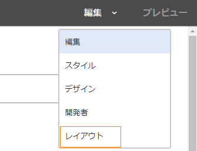
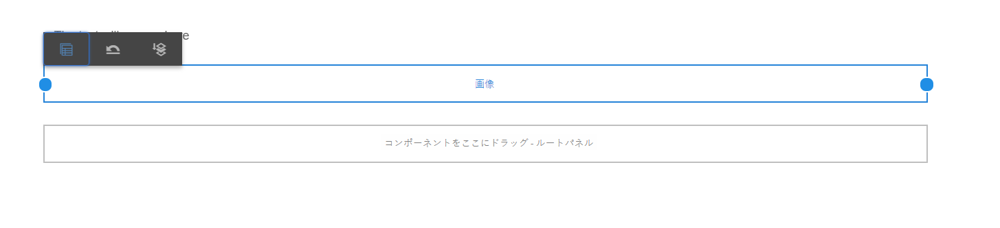
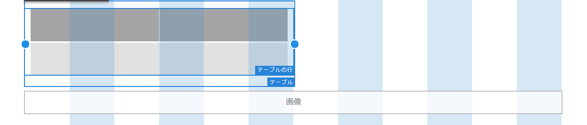
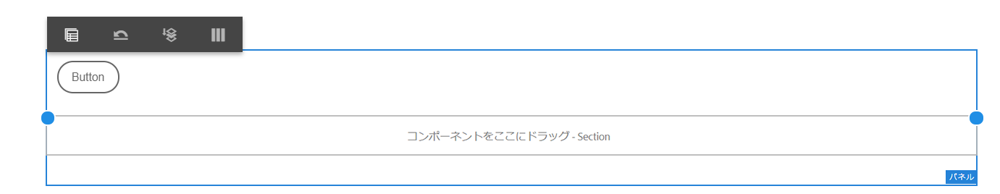
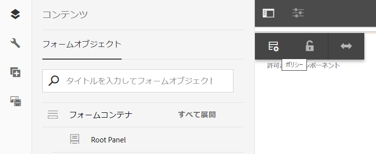

# レイアウトモードを使用したコンポーネントのサイズ変更 {#use-layout-mode-to-resize-components}

アダプティブフォームのオーサリングインターフェイスを使用すると、レイアウトモードを使用してコンポーネントのサイズを変更できます。列内の青い点をドラッグして、コンポーネントを配置する開始点と終了点を定義します。レスポンシブグリッド内のコンポーネントをタップすると、青い点が表示されます。レスポンシブグリッドは、12 個の等しい列で構成されています。代替列の白と青色の影は、1 つの列と他の列を区別します。

レイアウトモードを使用すると、デスクトップ、タブレット、スマートフォン、その他の小型デバイスなど、あらゆる種類のデバイスのコンポーネントサイズを変更できます。タブレットはデスクトップ版からレイアウト設定を自動的に引き継ぎ、小型デバイスはスマートフォンからレイアウト設定を引き継ぎます。自動的に生成された設定を上書きして、デバイスタイプごとに異なる設定を定義することもできます。

## レイアウトモードへのアクセス {#access-layout-mode}

**[!UICONTROL プレビュー]** オプションの横のアダプティブフォームのオーサリングインターフェイス上部に表示されるドロップダウンリストから、「**[!UICONTROL レイアウト]**」を選択します。フォームがレイアウトモードで表示されます。

1. [!DNL Adobe Experience Manager] オーサーインスタンスにログインし、**[!UICONTROL Adobe Experience Manager]**／**[!UICONTROL フォーム]**／**[!UICONTROL フォームとドキュメント]**&#x200B;の順に移動します。
1. 新しいアダプティブフォームを作成するか、既存の[アダプティブフォーム](creating-adaptive-form.md)を開きます。
1. 「**[!UICONTROL プレビュー]**」オプションの横の上部に表示されるドロップダウンリストから「**[!UICONTROL レイアウト]**」を選択します。フォームがレイアウトモードで表示されます。

   

## コンポーネントのサイズ変更 {#resize-components}

1. レイアウトモードで、サイズを変更するコンポーネントをタップします。レスポンシブグリッドの開始と終了に青い点が表示されます。
1. レスポンシブグリッド内のコンポーネントの位置を定義する青い点をドラッグ＆ドロップします。

   

   コンポーネントをタップした後に表示されるツールバーは、以下のオプションで構成されます。

   * **[!UICONTROL 親]**： コンポーネントの親を選択します。
   * **[!UICONTROL ブレークポイントのレイアウトを元に戻す]**：すべてのサイズ変更を元に戻し、コンポーネントにデフォルトのレイアウトを適用します。
   * **[!UICONTROL 新しい行にフローティングする]**：同じ行内に複数のコンポーネントがある場合は、コンポーネントを次の行に移動します。

   また、パネルレベルで「**[!UICONTROL ブレークポイントのレイアウトを元に戻す]**（）」オプションを使用して、すべてのサイズ変更を元に戻すこともできます。

   >[!NOTE]
   >
   >レイアウトモードを使用して、テーブルの列、ツールバー、ツールバーボタン、ターゲット領域のコンポーネントのサイズを変更することはできません。スタイルモードを使用して、これらのコンポーネントのサイズを変更します。

### 例 {#example}

**目的：** テーブルコンポーネントと画像コンポーネントを挿入し、アダプティブフォームでそれらを互いに平行に配置します。

1. アダプティブフォームで[!UICONTROL 編集]モードを使用して、テーブルコンポーネントと画像コンポーネントを挿入します。画像コンポーネントは、テーブルコンポーネントの後に表示されます。
1. [!UICONTROL レイアウト]モードに切り替えて、[!UICONTROL テーブル]コンポーネントをタップします。コンポーネントのサイズを変更する青い点が列 1 と列 12 に表示されます。
1. レスポンシブグリッドの列 12 の青い点を列 6 にドラッグします。

   

1. 同様に、[!UICONTROL 画像]コンポーネントを選択し、レスポンシブグリッドの列 1 の青い点を列 7 にドラッグします。テーブルと画像コンポーネントは互いに平行に表示されます。

   

   画像コンポーネントを選択し、ツールバーにある「**[!UICONTROL 新しい行にフローティングする]**」オプションをタップして、画像コンポーネントを次の行に移動できます。

## パネルのサイズ変更 {#resize-panels-layout-mode}

個々のコンポーネントではなくパネル全体のサイズを変更する場合は、以下の手順を実行します。

1. パネル内でサイズを変更するコンポーネントのいずれかをタップし、「」を選択して、ドロップダウンリストの最初のオプションを選択します（パネルがコンポーネントの直接の親である場合）。

   レスポンシブグリッドの開始と終了に青い点が表示されます。

1. レスポンシブグリッド内のパネルの位置を定義する青い点をドラッグ＆ドロップします。手順 1 と 2 を繰り返し、「」を選択して、サイズ変更したパネルを次の行に移動できます。

## パネルの複数列レイアウトの定義

以下の手順を実行して、パネルの列数を定義します。

1. **[!UICONTROL 編集]** モードで、パネルをタップし、「」を選択します。次に、**[!UICONTROL パネルレイアウト]**&#x200B;ドロップダウンリストから「**[!UICONTROL レスポンシブ - ページ上のすべて（ナビゲーションなし）]**」を選択します。

1. 「」をタップして、プロパティを保存します。

1. **[!UICONTROL レイアウト]** モードで、パネル内の任意のコンポーネントをタップし、「」を選択して、パネルを選択します。

1.  をタップし、ドロップダウンリストから列数を選択します。列数の範囲は 1 ～ 12 です。パネルが複数列のレイアウトに分割されます。

## 古いレスポンシブレイアウトに対する新しいレスポンシブグリッドの有効化 {#enableresponsivegrid}

[!DNL Adobe Experience Manager] Forms 6.4 以前のバージョンを使用して作成するフォームに対して、新しいレスポンシブグリッドを有効にし、コンポーネントのサイズを変更します。

>[!NOTE]
>
>新しいレスポンシブグリッドに切り替えると、フォームで使用するコンポーネントに対して既に定義されているレイアウトプロパティが破棄されます。

以下の手順を実行して、新しいレスポンシブグリッドを有効にします。

1. 「**[!UICONTROL プレビュー]**」オプションの横の上部に表示されるドロップダウンリストから「**[!UICONTROL レイアウト]**」を選択します。レイアウトモードを有効にするための確認メッセージが表示されます。
1. 「**[!UICONTROL はい]**」をタップして、フォームの&#x200B;**[!UICONTROL レイアウト]**&#x200B;モードを有効にします。

### 新しいレスポンシブレイアウトを使用した、古いフラグメントのアダプティブフォームへの埋め込み {#embed-an-old-fragment-in-an-adaptive-form-with-new-responsive-layout}

アダプティブフォームの新しいレスポンシブレイアウトを使用すると、古いレスポンシブレイアウトを含むアダプティブフォームのフラグメントをフォームに追加できます。ただし、新しいレイアウトでは、フラグメントで使用するコンポーネントに対して既に定義されているレイアウトプロパティが破棄されます。レイアウトモードに切り替えて、フラグメントで使用するコンポーネントのレイアウトプロパティを定義できます。

### 新しいレスポンシブレイアウトを使用した、フラグメントの古いアダプティブフォームへの埋め込み {#embed-a-fragment-with-new-responsive-layout-in-an-old-adaptive-form}

古いレスポンシブレイアウトを含むアダプティブフォームで、新しいレスポンシブレイアウトを使用してフラグメントを埋め込むと、そのフォームのレイアウトモードを有効にし、フラグメントを再埋め込みするよう求められます。

レイアウトモードを有効にするには、「**[!UICONTROL プレビュー]**」オプションの横の上部に表示されるドロップダウンリストから「**[!UICONTROL レイアウト]**」を選択し、「**[!UICONTROL はい]**」をタップして確認します。**[!UICONTROL 編集]**&#x200B;モードを選択して、フラグメントを再埋め込みします。

## 古いレスポンシブレイアウトを含むフォームに対するレイアウトモードの無効化 {#disable-layout-mode-for-forms-with-old-responsive-layout}

古いレスポンシブレイアウトを含むフォームのレイアウトモードを無効にするには、フォームで使用するテンプレートのプロパティを編集します。

レイアウトモードを無効にするには、以下の手順を実行します。

1. **[!UICONTROL ツール]**／**[!UICONTROL 一般]**／**[!UICONTROL テンプレート]**&#x200B;を選択し、フォームで使用するテンプレートを&#x200B;**[!UICONTROL 編集]**&#x200B;モードで開きます。
1. 左側のウィンドウでフォームコンテナを選択し、「**[!UICONTROL ポリシー]**」をタップします。

   

1. 「**[!UICONTROL レイアウト設定]**」タブをタップし、「**[!UICONTROL レイアウトモードを無効にする]**」を選択します。
1. 「」をタップして、テンプレートプロパティを保存します。
