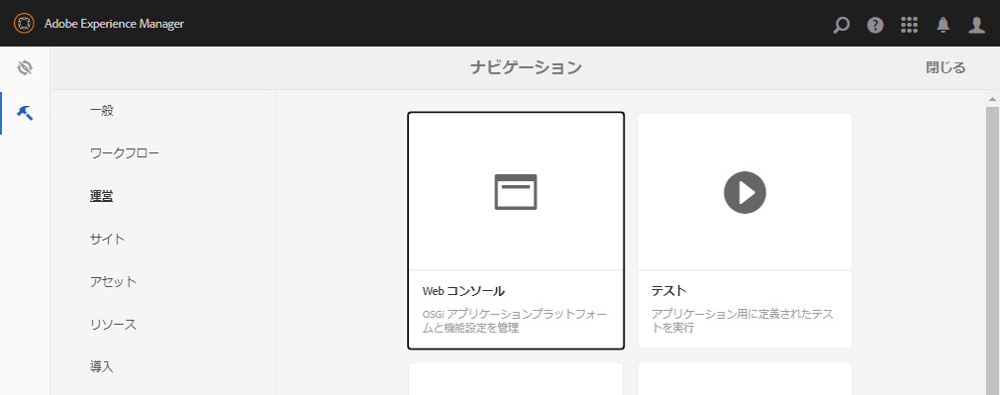
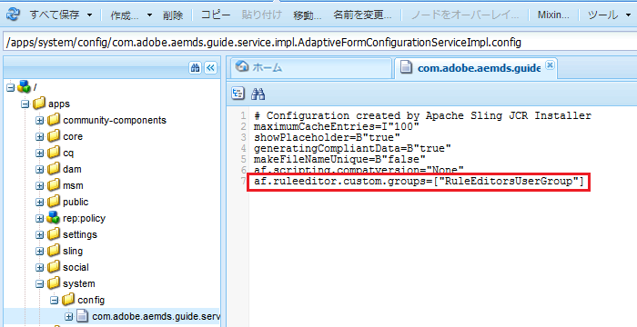

# 選択したユーザーグループにルールエディターへのアクセスを許可する {#grant-rule-editor-access-to-select-user-groups}

## 概要 {#overview}

アダプティブフォームで作業を行うユーザーのタイプやスキルはそれぞれ異なります。正しい知識を使用してスクリプトや複雑なルールを操作できる上級ユーザーもいれば、アダプティブフォームのレイアウトや基本的なプロパティ以外の操作はできない初心者のユーザーもいます。

[!DNL Experience Manager Forms] では、各ユーザーの役割や職務に応じて、ルールエディターへのアクセスを制限することができます。アダプティブフォームの設定サービスを使用して、ルールエディターを表示してアクセスできる[ユーザーグループ](forms-groups-privileges-tasks.md)を指定することができます。

## ルールエディターにアクセスできるユーザーグループの指定 {#specify-user-groups-that-can-access-rule-editor}

1. 管理者として [!DNL Experience Manager Forms] にログインします。
1. オーサーインスタンスで、 をクリックし、Adobe Experience Manager／ツール／**[!UICONTROL 操作]**／**[!UICONTROL Web コンソール]**&#x200B;をクリックします。新しいウィンドウに Web コンソールが表示されます。

   

1. [!UICONTROL Web コンソール]ウィンドウで、「**[!UICONTROL アダプティブフォーム設定サービス]**」を探してクリックします。**[!UICONTROL アダプティブフォーム設定サービス]**&#x200B;ダイアログが表示されます。値を変更せずに、「**[!UICONTROL 保存]**」をクリックします。

   これにより、CRX リポジトリーに `/apps/system/config/com.adobe.aemds.guide.service.impl.AdaptiveFormConfigurationServiceImpl.config` ファイルが作成されます。

1. 管理者として CRXDE にログインします。`/apps/system/config/com.adobe.aemds.guide.service.impl.AdaptiveFormConfigurationServiceImpl.config` ファイルを開いて編集します。
1. 次のプロパティを使用して、ルールエディターにアクセスできるグループの名前（例えば RuleEditorsUserGroup）を指定し、「**[!UICONTROL すべて保存]**」をクリックします。

   `af.ruleeditor.custom.groups=["RuleEditorsUserGroup"]`

   複数のグループにアクセスを有効にするには、コンマ区切りの値のリストを指定します。

   `af.ruleeditor.custom.groups=["RuleEditorsUserGroup", "PermittedUserGroup"]`

   

   これで、指定されたユーザーグループ（ここでは `RuleEditorsUserGroup`）に属していないユーザーがフィールドをタップした場合、コンポーネントのツールバーにルールを編集アイコン（）が表示されなくなります。

   

   ルールエディターへのアクセス権を持つユーザーに表示されるコンポーネントツールバー:

   

   ルールエディターへのアクセス権を持たないユーザーに表示されるコンポーネントツールバー

   ユーザーをグループに追加する方法については、[ユーザーの管理とセキュリティ](https://experienceleague.adobe.com/docs/experience-manager-65/administering/security/security.html?lang=ja)を参照してください。

