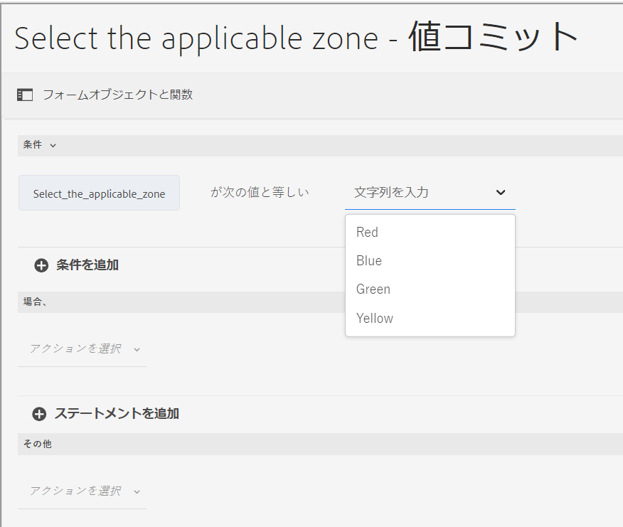
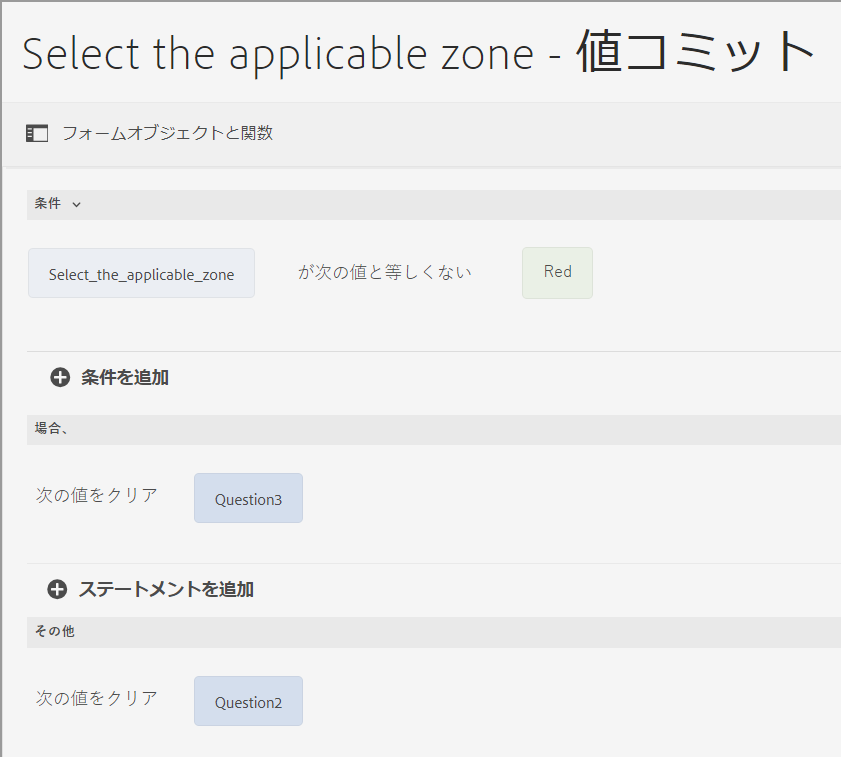
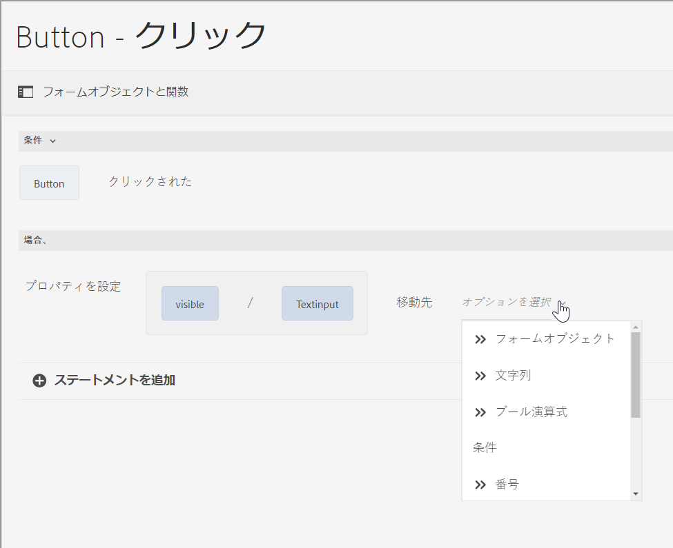
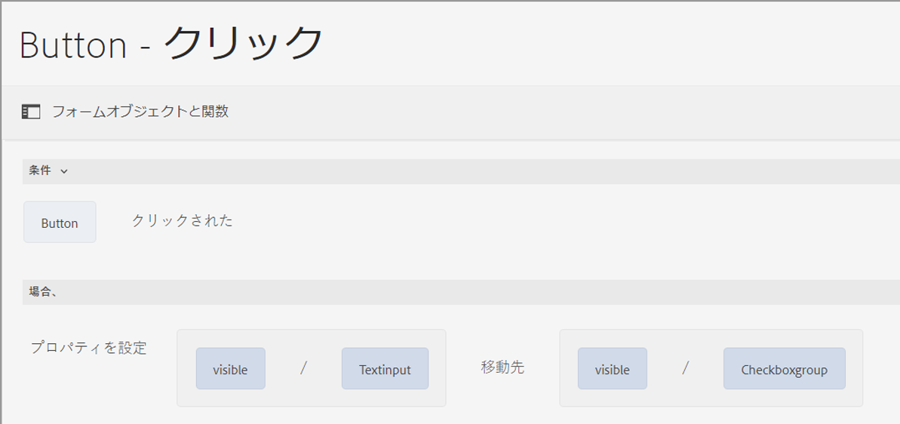
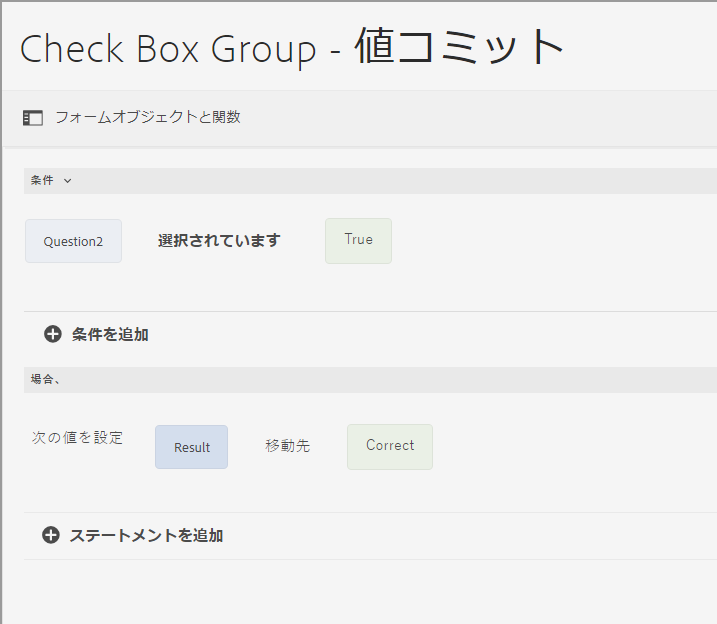
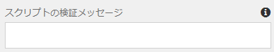
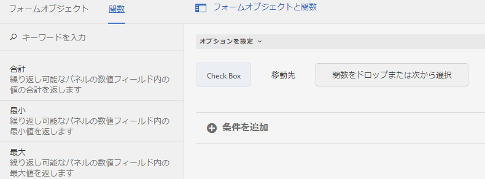
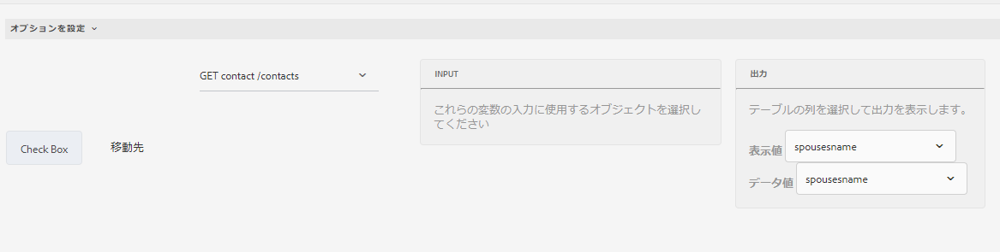

# コアコンポーネントに基づくアダプティブフォームのルールエディターでの演算子のタイプとイベント

AEM Forms as a Cloud では、複雑な条件やアクションを簡単に定義して実行できる様々な演算子やイベントがルールエディターに含まれています。

アダプティブフォームのルールエディターで使用できる演算子タイプは、正確な条件を構築するための堅牢なフレームワークを提供します。 これにより、データの操作、計算の実行、複数の条件の論理的かつ一貫した組み合わせを行うことができます。 値の比較、算術演算の実行、文字列の操作のいずれを行う場合でも、これらの演算子を使用すると、ルールが柔軟かつ強力であることが保証されます。

ルールエディターのイベントは、ルールをアクティブにするトリガーとして機能します。 特定の条件が満たされた場合に発生する特定のアクションを定義します。 様々なタイプのイベントを活用することで、ユーザーのインタラクション、スケジュールされた時間、データの変更、システムの状態など、様々なシナリオへの対応を自動化できます。 これらのトリガーを指定する機能により、特定の要件に合わせた動的でレスポンシブなルールを作成できます。

使用可能な演算子のタイプとイベントを理解し、使用することで、ルールエディターの可能性を最大限に引き出すことができます。これにより、独自のニーズを満たす効率的かつ効果的なルールを作成し、システム全体の機能を向上させることができます。

## ルールエディターで使用可能な演算子の種類とイベント {#available-operator-types-and-events-in-rule-editor}

ルールエディターでは、次のような論理演算子やイベントを使用してルールを作成することができます。

* **次と等しい** - フォームオブジェクトが指定した値と一致するかどうかを確認します。
* **次に等しくない** - フォームオブジェクトが指定した値に一致するかどうかを確認します。
* **次で始まる** - フォームオブジェクトが指定した文字列で始まるかどうかを確認します。
* **次で終わる** - フォームオブジェクトが指定した文字列で終わるかどうかを確認します。
* **Contains** - フォームオブジェクトに指定された部分文字列が含まれているかどうかを確認します。
* **次を含まない** - フォームオブジェクトに指定された部分文字列が含まれていないかどうかを確認します。
* **Is Empty** - フォームオブジェクトが空かどうかを確認します。
* **Is Not Empty** - フォームオブジェクトが存在し、空でないかどうかを確認します。
* **選択済み** - ユーザーが特定のチェックボックス、ドロップダウン、ラジオボタンオプションを選択した場合に true を返します。
* **Is Initialized （event）** - フォームオブジェクトがブラウザーでレンダリングされたときに true を返します。
* **Is Changed （event）** - フォームオブジェクトの値または選択範囲を変更したときに true を返します。
* **クリック済み（イベント）** - ユーザーがフォームオブジェクト（ボタンなど）をクリックすると、true を返します。 ユーザーは [&#x200B; ボタンのクリックに複数の条件を追加 &#x200B;](/help/forms/rule-editor-core-components-usecases.md#set-focus-to-another-panel-on-button-click-if-the-first-panel-is-valid) できます。
* **有効** - フォームオブジェクトが検証条件を満たしているかどうかを確認します。
* **無効** - フォームオブジェクトが検証条件に失敗するかどうかを確認します。

<!--
* **Navigation(event):** Returns true when the user clicks a navigation object. Navigation objects are used to move between panels. 
* **Step Completion(event):** Returns true when a step of a rule completes.
* **Successful Submission(event):** Returns true on successful submission of data to a form data model.
* **Error in Submission(event):**  Returns true on unsuccessful submission of data to a form data model. -->

### ルールエディターで利用可能なルールタイプ {#available-rule-types-in-rule-editor}

ルールエディターでは、ルールを記述するための、事前定義された一連のルールタイプを利用できます。ここからは、各ルールタイプについて詳しく説明します。ルールエディターでルールを記述する詳細については、「[&#x200B; ルールの記述 &#x200B;](/help/forms/rule-editor-core-components-user-interface.md#write-rules)」を参照してください。

#### [!UICONTROL When] {#whenruletype}

「**[!UICONTROL When]**」のルールタイプは、「**条件 - アクション - 代替アクション**」のルール構文に従います。また、単に「**条件 - アクション**」構文が使用されることもあります。このルールタイプでは、評価条件を指定し、条件が満たされた（`True`）場合にトリガーするアクションを記述します。「When」のルールタイプの使用中、複数の「AND」および「OR」演算子を使用して[ネスト式](/help/forms/rule-editor-core-components-usecases.md#nested-expressions)を作成することができます。

「When」のルールタイプを使用することで、フォームオブジェクトの状態を評価し、1 つ以上のオブジェクトに対してアクションを実行することができます。

代表的な「When」のルール構文は、次のようになります。

`When on Object A:`

`(Condition 1 AND Condition 2 OR Condition 3) is TRUE;`

`Then, do the following:`

`Action 2 on Object B;`
`AND`
`Action 3 on Object C;`

`Else, do the following:`

`Action 2 on Object C;`

ラジオボタンやリストなどの複数値コンポーネントに対してルールを作成する場合、オプションが自動的に取得され、それらのオプションを使用してルールを作成できるようになりました。これらのオプションの値を再入力する必要はありません。

例えばリストの場合、赤、青、緑、黄という 4 つのオプションがあります。ルールの作成時に、次のようにオプション（ラジオボタン）が自動的に取得され、ルール作成者が使用できるようになります。

「When」ルールを記述するときに、「Clear Value Of」アクションをトリガーできます。「Clear Value Of」アクションは、指定したオブジェクトの値をクリアします。「When」ステートメントに「Clear Value Of」をオプションとして含めると、複数フィールドで複雑な条件を作成できます。 Else ステートメントを追加して、さらに条件を追加できます

>[!NOTE]
>
> ルールタイプが単一レベルの then-else ステートメントのみをサポートする場合。

##### [!UICONTROL When] で許可された複数のフィールド {#allowed-multiple-fields}

**When** 条件では、ルールが適用されるフィールドとは別に他のフィールドを追加するオプションがあります。

例えば、「When」のルールタイプを使用すると、様々なフォームオブジェクトの条件を評価し、アクションを実行できます。

日時：

（Object A Condition 1）

AND/OR

（オブジェクト B 条件 2）

次に、以下の手順を実行します。

アクション 1 （オブジェクト A）

_

**When 条件機能で複数のフィールドを許可して使用する場合の考慮事項**

* ルールエディターでこの機能を使用するには [&#128279;](https://github.com/adobe/aem-core-forms-components) コアコンポーネントがバージョン 3.0.14 以降に設定されていることを確認します。
* ルールが When 条件内の異なるフィールドに適用されている場合、これらのフィールドの 1 つのみを変更した場合でも、ルールはトリガーします。
* **AND** ルールの **When** 条件に追加できるフィールドは複数のみです。 **OR** ルールには使用できません。

>[!NOTE]
>
> ボタンクリックを含む複数の条件を追加するには、ボタンクリックイベントが最初の条件として配置されていることを確認します。 例：`When button is clicked AND text input equals '5'` は有効ですが、`When text input equals '5' AND button is clicked` はサポートされていません。

<!--
* It is not possible to add multiple fields in the When condition while applying rules to a button.

##### To enable Allowed Multiple fields in When condition feature

Allowed Multiple fields in When condition feature is disabled by default. To enable this feature, add a custom property at the template policy:

1. Open the corresponding template associated with an Adaptive Form in the template editor.
1. Select the existing policy as **formcontainer-policy**.
1. Navigate to the **[!UICONTROL Structure]**  view and, from the **[!UICONTROL Allowed Components]** list, open the **[!UICONTROL Adaptive Forms Container]** policy.
1. Go to the **[!UICONTROL Custom Properties]** tab and to add a custom property, click **[!UICONTROL Add]**.
1. Specify the **Group Name** of your choice. For example, in our case, we added the group name as **allowedfeature**.
1. Add the **key** and **value** pair as follows:
   * key: fd:changeEventBehaviour
   * value: deps
1. Click **[!UICONTROL Done]**. -->

When 条件機能で許可された複数のフィールドで問題が発生した場合は、次のトラブルシューティング手順に従います。

1. フォームを編集モードで開きます。
1. コンテンツブラウザーを開き、アダプティブフォームの&#x200B;**[!UICONTROL ガイドコンテナ]**&#x200B;コンポーネントを選択します。
1. ガイドコンテナプロパティ  アイコンをクリックします。 アダプティブフォームコンテナダイアログボックスが開きます。
1. 「完了」をクリックして、ダイアログを再度保存します。

**[!UICONTROL Hide （非表示）]**：指定したオブジェクトを非表示にします。

**[!UICONTROL Show （表示）]**：指定したオブジェクトを表示します。

**[!UICONTROL Enable （有効）]**：指定したオブジェクトを有効にします。

**[!UICONTROL Disable （無効）]**：指定したオブジェクトを無効にします。

**[!UICONTROL Invoke service （サービスを起動）]**：フォームデータモデル（FDM）で設定されたサービスを起動します。「サービスを起動」オプションを選択すると、フィールドが表示されます。このフィールドをタップすると、[!DNL Experience Manager] インスタンス上のすべてのフォームデータモデル（FDM）で設定されたすべてのサービスが表示されます。フォームデータモデルサービスを選択すると、さらにフィールドが表示され、指定したサービスに対する入力パラメーターを使用して、ここでフォームオブジェクトをマップすることができます。 指定したサービスのイベントペイロードオプションを使用して、出力パラメーターをマッピングできます。 また、ルールエディターを使用して、サービスを呼び出し操作の成功および失敗応答を処理するルールを作成することもできます。

>[!NOTE]
>
> 呼び出しサービスについて詳しくは、[&#x200B; ここをクリック &#x200B;](/help/forms/invoke-service-enhancements-rule-editor.md) してください。

フォームデータモデル（FDM）サービスの呼び出しについては、ルール例を参照してください。

フォームデータモデルサービスに加えて、ダイレクト WSDL URL を指定して Web サービスを呼び出すことができます。 ただし、フォームデータモデルサービスには数多くの利点があるので、この方法でサービスを起動することをお勧めします。

フォームデータモデル（FDM）でのサービス設定について詳しくは、[[!DNL Experience Manager Forms]  のデータ統合機能](data-integration.md)を参照してください。

「**[!UICONTROL 次の値を設定]**」は、指定したオブジェクトの値を計算して設定します。オブジェクト値には、文字列、他のオブジェクトの値、数式や関数を使用して計算された値、オブジェクトのプロパティの値、または設定されたフォームデータモデルサービスからの出力値を設定することができます。 Web サービスオプションを選択すると、[!DNL Experience Manager] インスタンス上のすべてのフォームデータモデル（FDM）で設定されたすべてのサービスが表示されます。フォームデータモデルサービスを選択すると、さらにフィールドが表示され、指定したサービスに対する入出力パラメーターを使用して、ここでフォームオブジェクトをマップすることができます。

フォームデータモデル（FDM）でのサービス設定について詳しくは、[[!DNL Experience Manager Forms]  のデータ統合機能](data-integration.md)を参照してください。

**[!UICONTROL プロパティを設定]**&#x200B;のルールタイプを使用すると、条件アクションに基づいて、指定したオブジェクトのプロパティの値を設定できます。プロパティは次のいずれかに設定できます。
* visible（ブーリアン）
* label.value（文字列）
* label.visible（ブーリアン）
* description（文字列）
* enabled（ブーリアン）
* readOnly（ブーリアン）
* required（ブーリアン）
* screenReaderText（文字列）
* valid（ブーリアン）
* errorMessage（文字列）
* default（数値、文字列、日付）
* enumNames（文字列[]）
* chartType（文字列）

例えば、ボタンがクリックされたときにテキストボックスを表示するルールを定義できます。 カスタム関数、フォームオブジェクト、オブジェクトプロパティ、またはサービス出力を使用して、ルールを定義できます。

カスタム関数に基づいてルールを定義するには、ドロップダウンリストから「**[!UICONTROL 関数の出力]**」を選択し、「**[!UICONTROL 関数]**」タブからカスタム関数をドラッグアンドドロップします。条件アクションが満たされると、テキスト入力ボックスが表示されます。

フォームオブジェクトに基づいてルールを定義するには、ドロップダウンリストから「**[!UICONTROL フォームオブジェクト]**」を選択し、「**[!UICONTROL フォームオブジェクト]**」タブからフォームオブジェクトをドラッグ＆ドロップします。条件アクションが満たされると、アダプティブフォームにテキスト入力ボックスが表示されます。

オブジェクトプロパティに基づくプロパティの設定ルールを使用すると、アダプティブフォームに含まれる別のオブジェクトプロパティに基づいて、アダプティブフォーム内でテキスト入力ボックスを表示できます。

次の図は、アダプティブフォーム内のテキストボックスの非表示または表示に応じてチェックボックスを動的に有効にする例を示しています。

**[!UICONTROL Clear value of （値のクリア）]**：指定したオブジェの値をクリアします。

**[!UICONTROL Set Focus （フォーカスの設定）]**：指定したオブジェクトにフォーカスを設定します。

**[!UICONTROL フォームを送信]**：フォームを送信します。

**[!UICONTROL リセット]**：フォームまたは指定されたオブジェクトをリセットします。

**[!UICONTROL 検証]**：フォームまたは指定されたオブジェクトを検証します。

**[!UICONTROL Add Instance （インスタンスの追加）]**：指定した繰り返し可能なパネルまたは表の行のインスタンスを追加します。

**[!UICONTROL Remove Instance （インスタンスの削除）]**：指定した繰り返し可能なパネルまたは表の行のインスタンスを削除します。

**[!UICONTROL 関数出力]** 事前定義済みの関数またはカスタム関数に基づいてルールを定義します。

**[!UICONTROL 移動先]** 他のアダプティブForms、画像やドキュメントフラグメントなどの他のアセット、または外部 URL に移動します。<!-- For more information, see [Add button to the Interactive Communication](create-interactive-communication.md#addbuttontothewebchannel). -->

**[!UICONTROL イベントのディスパッチ]**：定義済みの条件またはイベントに基づいて、特定のアクションまたは動作をトリガーします。

#### [!UICONTROL 次の値を設定] {#set-value-of}

「**[!UICONTROL Set Value Of]**」のルールタイプを使用すると、指定した条件に応じてフォームオブジェクトの値を設定できます。この値には、他のオブジェクトの値や、リテラル文字列、数式や関数から算出された値、または他のオブジェクトのプロパティ値、フォームデータモデルサービスの出力値を指定することができます。同様に、関数や数式から算出された構成要素、文字列、プロパティ、または値を確認することもできます。

「**Set Value Of**」のルールタイプは、パネルやツールバーボタンなどのすべてのフォームオブジェクトで使用できるわけではありません。標準的な「Set Value Of」ルールは、次の構文を有します。

オブジェクト A の値を次のように設定します。

（文字列 ABC）または
（オブジェクト C のオブジェクト プロパティ X）または
（関数からの値）または
（数式からの値）または
（データモデルサービスの出力値）

When （オプション）：

(Condition 1 AND Condition 2 AND Condition 3) is TRUE;

次の例では、`Question2` の値を `True` に、`Result` の値を `correct` に設定しています。

フォームデータモデルサービスを使用した Set Value ルールの例。

#### [!UICONTROL Show（表示）] {#show}

「**[!UICONTROL Show]**」のルールタイプでは、条件を満たしているかどうかに基づいて、フォームオブジェクトの表示・非表示を切り替えることができます。「Show」のルールタイプでは、条件が満たされていないか、あるいは `False` が返された場合に、「Show」アクションをトリガーします。

代表的な「Show」のルール構文は、次のようになります。

`Show Object A;`

`When:`

`(Condition 1 OR Condition 2 OR Condition 3) is TRUE;`

`Else:`

`Hide Object A;`

#### [!UICONTROL Hide（非表示）] {#hide}

「**[!UICONTROL Hide]**」のルールタイプでは、「Show」のルールタイプと同様に、条件を満たしているかどうか基づいて、フォームオブジェクトの表示・非表示を切り替えることができます。「Hide」のルールタイプでは、条件が満たされていないか、あるいは `False` が返された場合に、「非表示」アクションをトリガーします。

代表的な「Hide」のルール構文は、次のようになります。

`Hide Object A;`

`When:`

`(Condition 1 AND Condition 2 AND Condition 3) is TRUE;`

`Else:`

`Show Object A;`

#### [!UICONTROL Enable（有効）] {#enable}

「**[!UICONTROL Enable]**」のルールタイプを使用すると、条件を満たしているか否かに基づいて、フォームオブジェクトを有効または無効にすることができます。「Enable」のルールタイプでは、条件が満たされていないか、あるいは `False` が返された場合に、「Disable」アクションをトリガーします。

代表的な「Enable」のルール構文は、次のようになります。

`Enable Object A;`

`When:`

`(Condition 1 AND Condition 2 AND Condition 3) is TRUE;`

`Else:`

`Disable Object A;`

#### [!UICONTROL Disable（無効）] {#disable}

「**[!UICONTROL Disable]**」のルールタイプでは、「Enable」のルールタイプと同様に、条件を満たしているか否かに基づいて、フォームオブジェクトを有効または無効にすることができます。「Disable」のルールタイプでは、条件が満たされていないか、あるいは `False` が返された場合に、「Disable」アクションをトリガーします。

代表的な「Disable」のルール構文は、次のようになります。

`Disable Object A;`

`When:`

`(Condition 1 OR Condition 2 OR Condition 3) is TRUE;`

`Else:`

`Enable Object A;`

#### [!UICONTROL Validate（検証）] {#validate}

「**[!UICONTROL 検証]**」ルールタイプでは、式を使用してフィールド内の値を検証します。例えば、式を記述することで、名前を指定するテキストボックスに特殊文字や数字が含まれていないことを確認することができます。

代表的な「検証」ルールは、次のようになります。

`Validate Object A;`

`Using:`

`(Expression 1 AND Expression 2 AND Expression 3) is TRUE;`

>[!NOTE]
>
>入力値が検証ルールと一致しない場合は、ユーザーに検証メッセージを表示できます。メッセージの内容は、サイドバー内のコンポーネントプロパティにある「**[!UICONTROL スクリプト検証メッセージ]**」フィールドから指定できます。

#### [!UICONTROL &#x200B; パネル間の移動 &#x200B;]

**[!UICONTROL パネル間を移動]** ルールタイプを使用すると、フォーム内の様々なパネル間でフォーカスを移動できます。 例えば、次のパネルにフォーカスを移動する式を作成できます。

次のパネルにフォーカスを移動するための一般的な **パネル間を移動** ルールは、次のような構造になっています。

`Navigate among the panels`

`Shift focus to the next item Object A;`

`When:`

`(Condition 1 OR Condition 2 OR Condition 3) is TRUE;`

同様に、前のパネルにフォーカスを移動するための **パネル間を移動** ルールを記述できます。

`Navigate among the panels`

`Shift focus to the previous item Object A;`

`When:`

`(Condition 1 OR Condition 2 OR Condition 3) is TRUE;`

パネル内を移動するためのルールを作成する方法について詳しくは、[&#x200B; ここをクリック &#x200B;](/help/forms/rule-editor-core-components-usecases.md#navigating-between-panels-using-buttons) を参照してください。

#### [!UICONTROL &#x200B; 非同期関数呼び出し &#x200B;]

これはプレリリース機能で、[プレリリースチャネル](https://experienceleague.adobe.com/docs/experience-manager-cloud-service/content/release-notes/prerelease.html?lang=ja#new-features)を通してアクセスできます。

**[!UICONTROL 非同期関数呼び出し]** のルールタイプを使用すると、非同期関数を実行できます。 これにより、メイン実行スレッドとは独立して動作する関数呼び出しを開始できます。これにより、非同期の関数が完了するまで待たずに、他のプロセスが実行を続行できます。

非同期関数を実行する一般的な非同期関数呼び出しルールは、次のような構造になっています。

`When:`

`(Condition 1 OR Condition 2 OR Condition 3) is TRUE;`

`Async Function call`

`[Callback Function];`

ビジュアル ルール エディターで非同期関数呼び出しを使用する方法の詳細については、「[&#x200B; ルール エディターでの非同期関数呼び出しの使用 &#x200B;](/help/forms/using-async-funct-in-rule-editor.md) を参照してください。

<!--
### [!UICONTROL Set Options Of] {#setoptionsof}

The **[!UICONTROL Set Options Of]** rule type enables you to define rules to add check boxes dynamically to the Adaptive Form. You can use a Form Data Model or a custom function to define the rule.

To define a rule based on a custom function, select **[!UICONTROL Function Output]** from the drop-down list, and drag-and-drop a custom function from the **[!UICONTROL Functions]** tab. The number of checkboxes defined in the custom function are added to the Adaptive Form.

To create a custom function, see [custom functions in rule editor](#custom-functions).

To define a rule based on a form data model:

1. Select **[!UICONTROL Service Output]** from the drop-down list.
1. Select the data model object.
1. Select a data model object property from the **[!UICONTROL Display Value]** drop-down list. The number of checkboxes in the Adaptive Form is derived from the number of instances defined for that property in the database.
1. Select a data model object property from the **[!UICONTROL Save Value]** drop-down list.

 -->

## 次の手順

次に、様々な [&#x200B; コアコンポーネントに基づくアダプティブフォームのルールエディターの例 &#x200B;](/help/forms/rule-editor-core-components-usecases.md) について説明します。

## 関連トピック

{{see-also-rule-editor}}
