# ルールエディターのさまざまなユースケース

この記事では、コアコンポーネントに基づくアダプティブフォームのルールエディターの詳細な例を提供し、様々なシナリオに対する適切な実装に関するインサイトを提供します。 ルールエディターを使用すると、開発者はフォームの動作を制御するロジックを定義および管理できます。
次に、ルールエディターのさまざまな実装について説明します。

## 最初のパネルが有効な場合は、ボタンのクリック時に別のパネルにフォーカスを設定します

これはプレリリース機能で、[プレリリースチャネル](https://experienceleague.adobe.com/docs/experience-manager-cloud-service/content/release-notes/prerelease.html?lang=ja#new-features)を通してアクセスできます。

ルールエディターを使用すると、ボタンをクリックしてフォーカスを別のパネルのフォームオブジェクトに設定する際に、水平タブ、垂直タブ、アコーディオン、ウィザードなどのパネルレイアウトを検証できます。 この機能を使用して、フォームのナビゲーションとユーザーエクスペリエンスを向上させることができます。

ウィザードレイアウトを使用して、マルチステップのアプリケーションフォームを想像します。 `Personal Information`に移動する前に、`Employment Details` パネルを完了する必要があります。 `Next` ボタンをクリックすると、ルールエディターは`Personal Information` パネルを検証します。 すべての必須フィールドが正しく入力されると、フォームは自動的に`Employment Details` パネルにフォーカスを移動します。 それ以外の場合は、見つからないフィールドを完了するようユーザーに促すエラーメッセージが表示されます。

`Next` ボタンにルールを作成して、最初のパネルを検証できます。

{width=50%}

「**次へ**」ボタンをクリックすると、**個人情報** パネルが検証されます。 入力された詳細が正しい場合、フォーカスは&#x200B;**アカウントセキュリティ** パネルに移動します。そうでない場合は、不足している詳細を入力するよう求めるエラーメッセージが表示されます。

>[!VIDEO](https://video.tv.adobe.com/v/3457767)

## ボタンを使用したパネル間の移動

ルールエディターでは、水平タブ、垂直タブ、アコーディオン、ウィザードなど、パネルレイアウトにナビゲーションボタンを追加できます。 これらのボタンは、フォーム内の異なるパネル間のトランジションを簡素化し、選択したパネルにフォーカスを移動することで、ユーザーエクスペリエンスを向上させます。

アプリケーションのプロファイル設定セクションを操作しているとします。このセクションでは、タブではなくボタンがナビゲーションを容易にします。 メインダッシュボードからプロファイル設定を入力すると、プロファイルのさまざまな側面に特化した一連のパネル（**個人情報**、**アカウントセキュリティ**、**通知設定**）が表示されます。

各パネルには、特定の情報を更新するための関連するフィールドとオプションが含まれています。 `Next`や`Back`などのナビゲーションボタンが目立つように配置されているため、これらのパネル間を移動できます。 `Next`をクリックして&#x200B;**アカウントセキュリティ** パネルに移動し、`Back`をクリックして&#x200B;**個人情報** パネルに戻ります。 このナビゲーション方法は、コンテキストを失うことなくセクション間をシームレスに移行し、スムーズで直感的なユーザーエクスペリエンスを提供します。 ナビゲーションボタンを使用すると、プロファイル設定を管理するプロセスが簡素化され、より整理されたユーザーフレンドリーなインタラクションを実現できます。

`Navigate among the panels` ルールを使用して、異なるパネルを切り替えることができるボタンのナビゲーションルールを作成できます。  `Shift focus to the next item`属性を選択して、レイアウトの次のパネルにフォーカスを移動します。

{width=50%}

`Next` ボタンをクリックすると、フォーカスはレイアウトの後続のパネルに移動します。

同様に、`Previous` ボタンのルールを作成して、前のパネルにフォーカスを移動することもできます。

{width=50%}

## 関数を使用して、繰り返し可能なパネルで複雑な計算を合理化します

ルールエディターを使用すると、繰り返し可能なパネル内のフィールドに、合計、最小、最大、結合などの標準の関数を直接使用できます。 繰り返し可能なパネルフィールドの値を、数値配列、文字列配列、ブール配列などを受け入れる関数に渡すこともできます。 これにより、強力な自動化が可能になり、カスタムコードを使用せずに複雑なビジネスロジックを実装できます。

繰り返し可能なパネルを持つフォームを想像してみてください。各パネルインスタンスは、アセットの宣言された値に関する情報を収集します。

`Sum`関数を使用して、すべてのパネルのアセットの合計値を自動的に計算できるため、手作業による計算が不要になり、エラーの可能性が減ります。

フォームに入力し、インスタンスを追加してアセット値を宣言すると、`Calculate Asset Value` ボタンはすべての宣言されたアセット値の合計値を計算し、その結果を合計として`assetvalue` テキストボックスに表示します。

>[!NOTE]
>
> 繰り返し可能なパネルフィールドの値が配列を受け入れない関数に渡された場合、繰り返し可能なパネルの最後のインスタンスのフィールド値が関数に渡されます。

例をいくつか紹介します。 ワークフローを簡素化し、フォーム内のデータ精度を向上させるために、利用可能な[関数](#b-form-objects-and-functions-br)を確認します。

## ネスト式 {#nestedexpressions}

ルールエディターでは、複数の AND 演算子と OR 演算子を使用して、ネストされたルールを作成できます。ルールでは、複数のAND演算子とOR演算子を混在させることができます。

次に、必要な条件が満たされたときに、子どもの親権の資格に関するメッセージをユーザーに表示するネストされたルールの例を示します。

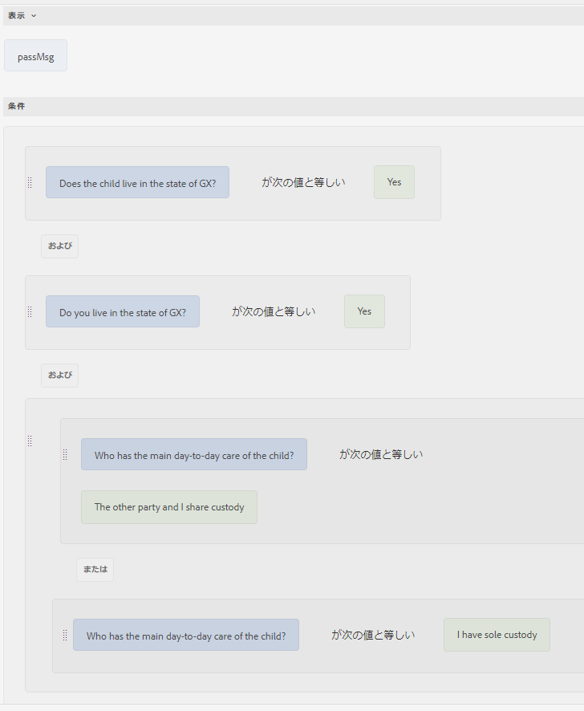

ルール内で条件をドラッグアンドドロップして編集することもできます。条件の前のハンドル（）を選択し続けます。次に示すようにポインターがハンドシンボルになったら、ルール内の任意の場所に条件をドラッグ＆ドロップします。ルール構造が変化します。

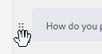

## 日付式の条件 {#dateexpression}

ルールエディターでは、日付比較を使用して条件を作成できます。

次に、住宅ローンが既に実行されている場合に静的テキストオブジェクトを表示する条件の例を示します。これは、日付フィールドを入力することでユーザーが示します。

ユーザーが入力した物件の住宅ローンの日付が過去のものである場合、アダプティブフォームは収入計算に関する注記を表示します。次のルールは、ユーザーが入力した日付を現在の日付と比較し、ユーザーが入力した日付が現在の日付より前の場合、フォームは（Income という名前の）テキストメッセージを表示します。

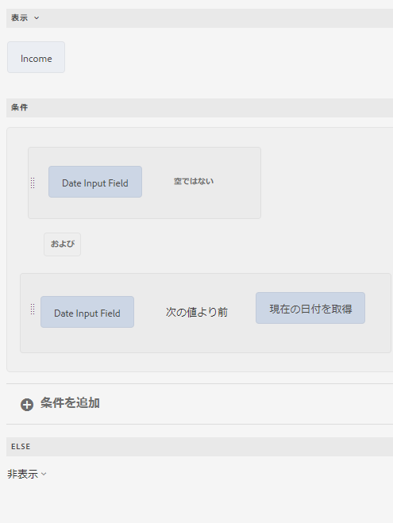

入力された日付が現在の日付よりも前の場合、フォームはテキストメッセージ（Income）を次のように表示します。

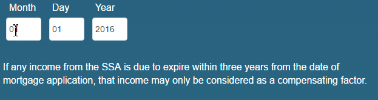

## 数値比較条件 {#number-comparison-conditions}

ルールエディターでは、2 つの数値を比較する条件を作成できます。

次に示す条件の例では、申込者が現在の住所に住んでいる月数が 36 に満たない場合、静的テキストオブジェクトを表示します。

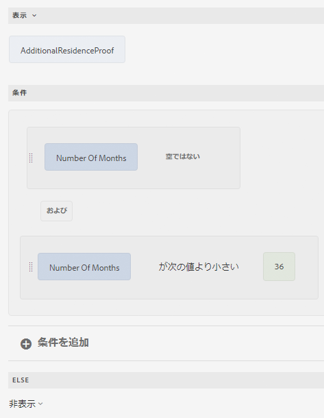

現在の居住地住所に住んでいる期間が 36 か月に満たないことをユーザーが指定した場合、フォームは、その他の居住地証明が要求される場合があるという通知を表示します。

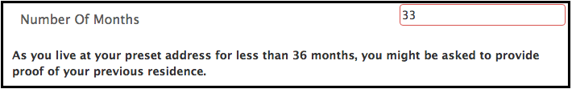

<!--
 ## Impact of rule editor on existing scripts {#impact-of-rule-editor-on-existing-scripts}

In [!DNL Experience Manager Forms] versions prior to [!DNL Experience Manager 6.1 Forms] feature pack 1, form authors and developers used to write expressions in the Scripts tab of the Edit component dialog to add dynamic behavior to Adaptive Forms. The Scripts tab is now replaced by the rule editor.

Any scripts or expressions that you must have written in the Scripts tab are available in the rule editor. While you cannot view or edit them in visual editor, if you are a part of the forms-power-users group you can edit scripts in code editor.
-->

### フォームデータモデルサービスを起動 {#invoke}

ローン額、加入年数、申請者の信用度スコアを入力として、EMI 額と利率を含むローンプランを返す、web サービス `GetInterestRates` を考えます。Web サービスをデータソースとして使用し、フォームデータモデル（FDM）を作成します。データモデルオブジェクトと `get` サービスをフォームモデルに追加します。フォームデータモデル（FDM）の「サービス」タブにサービスが表示されます。その後、データモデルオブジェクトのフィールドを含むアダプティブフォームを作成し、ローン総額、加入年数、申込者の信用度についてユーザーの入力を取得します。計画の詳細を取得するために Web サービスをトリガーするボタンを追加します。適切なフィールドで出力が算出されます。

次のルールは、「サービスを起動」アクションを設定してシナリオ例を実行する方法を示しています。

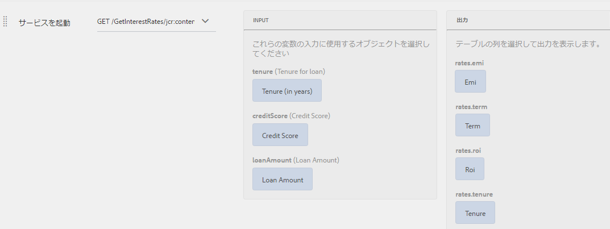

>[!NOTE]
>
>入力が配列タイプの場合、配列をサポートするフィールドが「出力」ドロップダウンセクションに表示されます。

### 「When」ルールを使用して複数のアクションをトリガーする  {#triggering-multiple-actions-using-the-when-rule}

ローン申し込みフォームでは、ローンの申請者が既存の顧客であるかどうかを判断する必要があります。ユーザーが提供する情報に基づいて、顧客ID フィールドを表示または非表示にする必要があります。 また、申請者が既存の顧客であれば、顧客 ID フィールドにフォーカスを置きます。ローン申し込みフォームの構成要素は次のとおりです。

* 「**[!UICONTROL Are you an existing Geometrixx customer?（Geometrixx に既に登録されていますか？）]**」のラジオボタンでは、「[!UICONTROL はい]」と「[!UICONTROL いいえ]」のオプションが設けられています。「はい」の値は **0**、「いいえ」の値は **1** です。

* 「**[!UICONTROL Geometrixx 顧客 ID]**」テキストフィールドには、顧客 ID が入力されます。

この動作を実装するためラジオボタンに When ルールを記述すると、ビジュアルルールエディターにはルールが次のように表示されます。

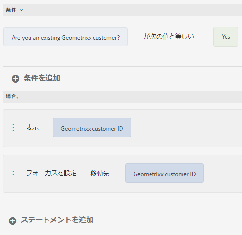

上のルール例では、「When」セクション内の文は条件に当たります。これが True を返すと、「Then」セクションで指定されたアクションが実行されます。

<!--
 The rule appears as follows in the code editor.

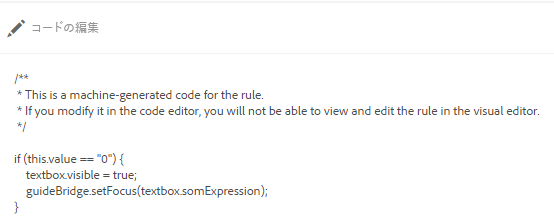 

Rule in the code editor
-->

### ルール内で関数出力を使用する {#using-a-function-output-in-a-rule}

発注フォームでは、次の表が表示されます。この中には、発注者が注文を入力します。このテーブルの内容：

* 最初の行は反復可能なので、ユーザーは複数の製品を注文し、それぞれ異なる数量を指定することができます。この要素の名前は、「`Row1`」です。
* 繰り返し可能な行の「製品数量」列のセルのタイトルは「数量」です。 このセルの要素名は「`productquantity`」です。
* 表の2行目は繰り返し不可能で、この行の製品数量の列のセルのタイトルは合計数量です。

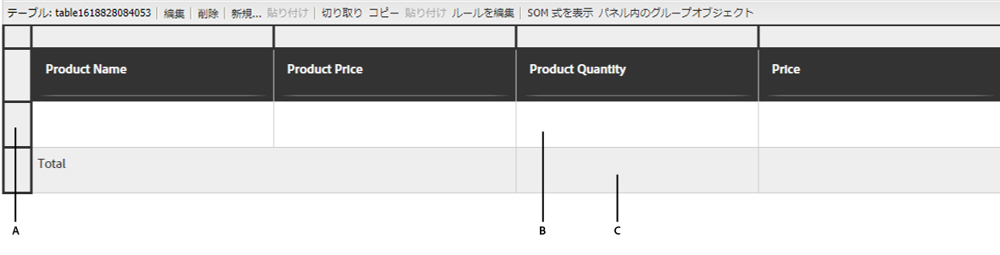

**A.** 行 1 **B.** 数量 **C.** 合計数量

ここでは、「Product Quantity（製品数量）」列で指定された数量を全製品について合計し、「Total Quantity（合計数量）」セルに合計値を表示する必要があります。以下に示すように、「Total Quantity（合計数量）」セルに「Set Value Of」ルールを記述することにより、この合計を達成できます。

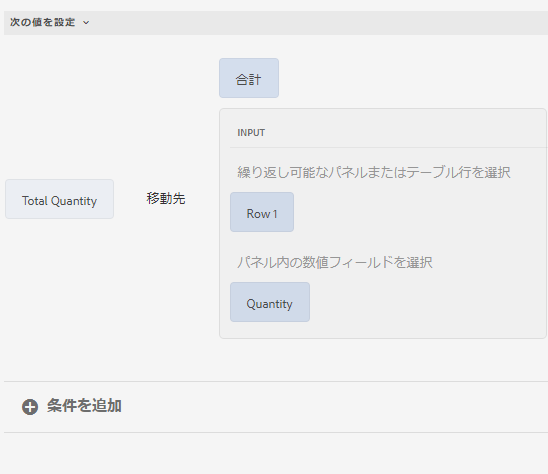

### 式を使用してフィールド値を検証する {#validating-a-field-value-using-expression}

前の例で説明した発注フォームでは、ユーザーが10000上の価格の商品を1つ以上発注することを制限します。 この検証を行うには、以下に示すように検証ルールを記述します。

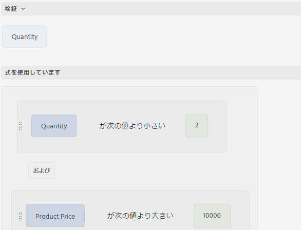

## 関連トピック

{{see-also-rule-editor}}
