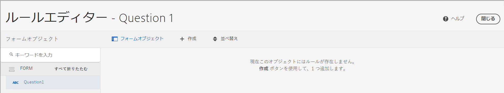
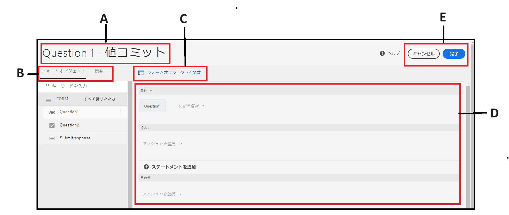
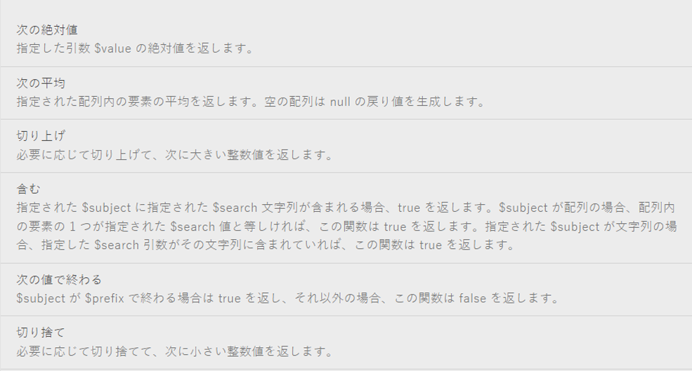
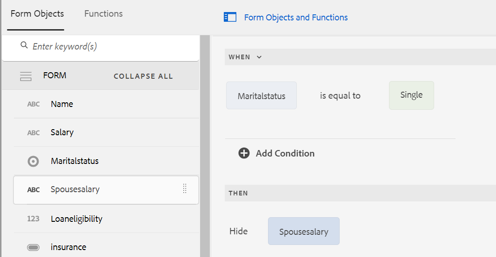
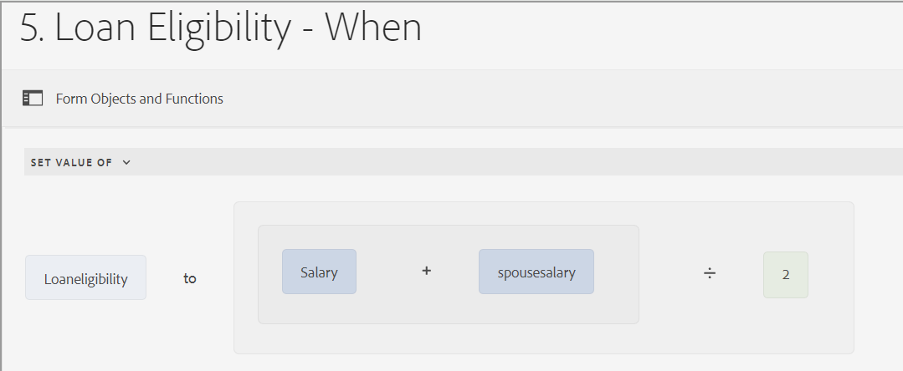

# コアコンポーネントに基づくアダプティブフォームのルールエディターのユーザーインターフェイス

コアコンポーネントに基づくアダプティブFormsのルールエディターのユーザーインターフェイスにより、Adobe Experience Manager（AEM）内のフォーム作成プロセスが強化されます。 事前定義済みの条件、ユーザー入力、インタラクションに基づいてアクションのトリガーを決定するルールを記述することで、ビジネスユーザーと開発者の両方が、動的な動作と複雑なロジックをフォームに実装できるようになります。 この機能は、ES2022 までの最新のJavaScript機能をサポートし、ルール作成プロセスを簡素化する直感的なビジュアルエディターを提供します。
ルールエディターは、フォーム入力のエクスペリエンスを効率化し、精度と効率の両方を確保するのに役立ちます。 パネルやフォームの検証やリセット、フォームオブジェクトの値を計算するためのカスタム関数の実行が可能です。 ネストされた条件のサポートとフォームデータモデルサービスの呼び出し機能により、ルールエディターのユーザーインターフェイスは、レスポンシブで使いやすいアダプティブフォームを作成するための中心的なコンポーネントになります。

## ルールエディターのユーザーインターフェイスを理解する {#understanding-the-rule-editor-user-interface}

ルールエディターでは、ルールの記述や管理のための、総合的でシンプルなユーザーインタフェイスが用意されています。オーサリングモードのアダプティブフォーム内からルールエディターのユーザーインターフェイスを起動できます。

ルールエディターのユーザーインターフェイスを起動するには：

1. アダプティブフォームをオーサリングモードで開きます。
1. ルールを記述するフォームオブジェクトを選択し、コンポーネントツールバーで  をクリックします。ルールエディターのユーザーインターフェイスが表示されます。

   

   選択したフォームオブジェクトの既存のルールが、このビューに一覧表示されます。既存ルールの詳細な管理方法については、[ルール管理](rule-editor.md#p-manage-rules-p)を参照してください。

1. 「**[!UICONTROL 作成]**」を選択して、新しいルールを記述します。ルールエディターの初回起動時は、ルールエディターの UI がビジュアルエディターモード（デフォルト）で表示されます。

   

ここからは、ルールエディターのユーザーインターフェイスに含まれる各要素について説明します。

### A. コンポーネントルールの表示 {#a-component-rule-display}

ルールエディターを起動したアダプティブフォームオブジェクトのタイトルと、現在選択されているルールタイプを表示します。上記の例では、ルールエディターは「Question 1」と名付けられたアダプティブフォームオブジェクトから起動されており、「When」ルールタイプが選択されています。

### B. フォームオブジェクトと関数 {#b-form-objects-and-functions-br}

ルールエディターのユーザーインターフェイスの左側のペインには、「**[!UICONTROL フォームオブジェクト]**」と「**[!UICONTROL 関数]**」の 2 つのタブがあります。

「フォームオブジェクト」タブには、アダプティブフォームに含まれているオブジェクトがすべて階層表示されます。ここには、オブジェクトのタイトルとタイプが表示されます。ルールの作成時は、フォームオブジェクトをルールエディターまでドラッグ＆ドロップすることができます。オブジェクトまたは関数をプレースホルダーにドラッグ＆ドロップしてルールの作成や編集を行うと、適切な値の型がプレースホルダーに自動的に取り込まれるます。

1 つ以上の有効なルールが適用されているフォームオブジェクトには、緑のドットが付いています。フォームオブジェクトに適用されているルールのいずれかが無効な場合、フォームオブジェクトには黄色のドットが付きます。

「関数」タブには、「合計」、「最小」、「最大」、「平均」、「回数」や「フォームを検査」などのビルトインの関数のセットが含まれています。これらの関数をルールに記述することで、繰り返しパネルや表の行の値を計算し、計算結果をアクションや条件文の中で使用することができます。また、カスタム関数も作成できます。

関数のリストの一部を次の図に示します。



>[!NOTE]
>
>「Formsのオブジェクト」タブと「関数」タブでは、オブジェクトや関数の名前およびタイトルに対してテキスト検索を実行できます。

フォームオブジェクトの左側のツリーで、フォームオブジェクトを選択すると、各オブジェクトに適用されるルールが表示されます。様々なフォームオブジェクトのルール間を移動できるだけでなく、フォームオブジェクト間でルールをコピー＆ペーストすることもできます。詳しくは、[ルールをコピー＆ペースト](rule-editor.md#p-copy-paste-rules-p)を参照してください。

### C. フォームオブジェクトと関数の切り替え {#c-form-objects-and-functions-toggle-br}

切替スイッチボタンをタップすると、フォームオブジェクトと関数ペインが切り替わります。

### D. ルールのビジュアルエディター {#visual-rule-editor}

ルールを記述するビジュアルエディターは、ルールエディターのユーザーインターフェイスをビジュアルエディターモードに切り替えると表示されます。ルールタイプを選択し、それに応じて条件とアクションを定義できます。ルールで条件やアクションを定義する場合、フォームオブジェクトと関数ペインからフォームオブジェクトと関数をドラッグ＆ドロップできます。

ルールのビジュアルエディターの詳細については、「[ ルールの作成 ](rule-editor.md#p-write-rules-p)」を参照してください。
<!-- 
### E. Visual-code editors switcher {#e-visual-code-editors-switcher}

Users in the forms-power-users group can access code editor. For other users, code editor is not available. If you have the rights, you can switch from visual editor mode to code editor mode of the rule editor, and conversely, using the switcher right above the rule editor. When you launch rule editor the first time, it opens in the visual editor mode. You can write rules in the visual editor mode or switch to the code editor mode to write a rule script. However, note that if you modify a rule or write a rule in code editor, you cannot switch back to the visual editor for that rule unless you clear the code editor.

[!DNL Experience Manager Forms] tracks the rule editor mode you used last to write a rule. When you launch the rule editor next time, it opens in that mode. However, you can also configure a default mode to open the rule editor in the specified mode. To do so:

1. Go to [!DNL Experience Manager] web console at `https://[host]:[port]/system/console/configMgr`.
1. Click to edit **[!UICONTROL Adaptive Form Configuration Service]**.
1. choose **[!UICONTROL Visual Editor]** or **[!UICONTROL Code Editor]** from the **[!UICONTROL Default Mode for Rule Editor]** drop-down

1. Click **[!UICONTROL Save]**.
-->

### E. 「完了」ボタンと「キャンセル」ボタン {#done-and-cancel-buttons}

ルールを保存するには、「**[!UICONTROL 完了]**」ボタンを押します。不完全なルールでも保存できます。ただし、不完全なルールは無効なため、実行されることはありません。フォームオブジェクトに保存されたルールは、同じフォームオブジェクトから次回ルールエディターを起動すると一覧表示されます。このビューでは、既存のルールを管理できます。詳しくは、[ルールを管理](rule-editor.md#p-manage-rules-p)を参照してください。

**[!UICONTROL キャンセル]** ボタンをクリックすると、ルールに対する変更が破棄され、ルールエディターが閉じます。

## ルールを記述 {#write-rules}

ビジュアルルールエディター <!-- or the code editor. When you launch the rule editor the first time, it opens in the visual editor mode. You can switch to the code editor mode and write rules. However, if you write or modify a rule in code editor, you cannot switch to the visual editor for that rule unless you clear the code editor. When you launch the rule editor next time, it opens in the mode that you used last to create rule. --> を使用して、ルールを記述します。

まず、ビジュアルエディターを使用してルールを記述する方法を見てみましょう。

+++ ビジュアルエディター {#using-visual-editor} の使用

ここでは、次のフォーム例を使って、ビジュアルエディターでルールを作成する方法について説明します。


ローン申し込みフォームの例の「ローン要件」セクションでは、配偶者の有無、給与、および配偶者の給与（既婚の場合）を申請者が指定する必要があります。ユーザー入力に基づいて、ルールはローン適格額を計算し、「Loan Eligibility（貸付資格）」フィールドに表示します。次のルールを適用して、シナリオを実装します。

* 配偶者の「Salary（給与）」フィールドは、婚姻状況に「Married（既婚）」を選んだ場合にのみ表示されます。
* 融資適格額は、全給与の 50 パーセントとして計算されます。

ルールを記述するには、次のステップを実行します。

1. まず、「Marital Status （配偶者の有無）」のラジオボタンの選択内容に応じて「Spouse Salary （配偶者の給与）」フィールドの表示・非表示を制御するためのルールを記述します。

   融資申請フォームをオーサリングモードで開きます。「**[!UICONTROL 配偶者の有無]**」コンポーネントを選択し、「」を選択します。次に、「**[!UICONTROL 作成]**」を選択し、ルールエディターを起動します。

   

   ルールエディターを起動すると、「When」ルールがデフォルトで選択されます。また、ルールエディターを起動したフォームオブジェクト（この場合は「Marital Status（配偶者の有無）」）は、「When」文に入力されています。

   選択したオブジェクトを変更または修正できませんが、以下に示すように、ルールドロップダウンを使用して別のルールタイプを選択できます。別のオブジェクトにルールを作成する場合は、「キャンセル」を選択してルールエディターを終了し、目的のフォームオブジェクトから再度起動します。

1. 「**[!UICONTROL 状態の選択]**」ドロップダウンを選択し、「**[!UICONTROL 次の値と等しい]**」を選択します。「**[!UICONTROL 文字列を入力]**」フィールドが表示されます。

   

1. ルールの **[!UICONTROL 文字列を入力]** フィールドで、ドロップダウンメニューから **既婚** を選択します。

   

   条件を`When Marital Status is equal to Married`と定義しました。次に、この条件が True の場合に実行するアクションを定義します。

1. Then ステートメントで、**[!UICONTROL アクションを選択]**&#x200B;ドロップダウンリストから「**[!UICONTROL 表示]**」を選択します。

   

1. 「**[!UICONTROL オブジェクトをドロップするか、または次から選択]**」フィールドの「フォームオブジェクト」タブから「**[!UICONTROL Spouse Salary（配偶者の給与）]**」フィールドをドラッグ＆ドロップします。目的のフォームオブジェクトから再度起動します。あるいは、「**[!UICONTROL オブジェクトをドロップするか、または次から選択]**」フィールドを選択し、ポップアップメニューから「**[!UICONTROL 配偶者の給与]**」フィールドを選択します。この中には、フォーム内のすべてのフォームオブジェクトが一覧表示されます。

   

   次に、この条件が False の場合に実行するアクションを定義します。
1. 「Marital Status（配偶者の有無）」として「Single（独身）」を選択した場合は、「**[!UICONTROL Else セクションを追加]**」をクリックして、「**[!UICONTROL Spouse Salary（配偶者の給与）]**」フィールドに別の条件を追加します。

   


1. Else ステートメントで、**[!UICONTROL アクションを選択]**&#x200B;ドロップダウンから「**[!UICONTROL 非表示]**」を選択します。
   

1. 「**[!UICONTROL オブジェクトをドロップするか、または次から選択]**」フィールドの「フォームオブジェクト」タブから「**[!UICONTROL Spouse Salary（配偶者の給与）]**」フィールドをドラッグ＆ドロップします。目的のフォームオブジェクトから再度起動します。あるいは、「**[!UICONTROL オブジェクトをドロップするか、または次から選択]**」フィールドを選択し、ポップアップメニューから「**[!UICONTROL 配偶者の給与]**」フィールドを選択します。この中には、フォーム内のすべてのフォームオブジェクトが一覧表示されます。
   

   ルールエディターでは、ルールが次のように表示されます。

   

1. 「**[!UICONTROL 完了]**」を選択し、ルールを保存します。

<!--
1. Repeat steps 1 through 5 to define another rule to hide the Spouse Salary field if the marital Status is Single. The rule appears as follows in the rule editor.

    -->

>[!NOTE]
>
> または、「Marital Status（配偶者の有無）」フィールドに「When」ルールを記述する代わりに、「Spouse Salary（配偶者の給与）」フィールド上に「Show」ルールを設けて、同じ動作を実装することもできます。


1. 次に、融資適格金額を算出するためのルールを記述します。ここでは、総給与の 50% として計算され、「Loan Eligibility（貸付資格）」フィールドに表示されます。この結果を得るには、「Loan Eligibility （貸付資格）」フィールド上に **[!UICONTROL 値を設定]** ルールを作成します。

   「オーサリングモードで「**[!UICONTROL Loan Eligibility（貸付資格）]**」フィールドを選択し、「」を選択します。次に、「**[!UICONTROL 作成]**」を選択し、ルールエディターを起動します。

1. ルールのドロップダウンから「**[!UICONTROL 指定値]**」ルールを選択します。

   

1. 「**[!UICONTROL オプションの選択]**」を選択し、「**[!UICONTROL 数式]**」を選択します。数式記述用のフィールドが開きます。

   

1. 数式記述用のフィールドでは、次のように行います。

   * 最初の「**[!UICONTROL オブジェクトをドロップまたは次から選択]**」の「フォームオブジェクト」タブから「**[!UICONTROL Salary（給与）]**」フィールドを選択するかドラッグ＆ドロップします。

   * 「**[!UICONTROL 演算子を選択]**」フィールドから「**[!UICONTROL プラス]**」を選択します。

   * 「フォームオブジェクト」タブから、他の&#x200B;**[!UICONTROL ドロップオブジェクトの「**&#x200B;[!UICONTROL &#x200B; Spouse Salary （配偶者の給与）]&#x200B;**」フィールドを選択またはドラッグ＆ドロップするか、「ここ」]**&#x200B;フィールドを選択します。

   

1. 次に、式フィールドの周りのハイライト表示された領域を選択し、「**[!UICONTROL 拡張式]**」を選択します。

   

   拡張式フィールドでは、「**[!UICONTROL 演算子を選択]**」フィールドから「**[!UICONTROL ÷]**」を選択し、「**[!UICONTROL オプションを選択]**」フィールドから「**[!UICONTROL 数字]**」を選択します。次に、数字フィールドに「**[!UICONTROL 2]**」を入力します。

   

   >[!NOTE]
   >
   >「オプションを選択」フィールドから、コンポーネント、関数、数式、およびプロパティの各値を使用することで、複雑な式を作成することもできます。

   次に、True が返された場合に式を実行する条件を作成します。

1. 「**[!UICONTROL 条件の追加]**」を選択し、「When」文を追加します。

   

   When ステートメント内で、以下の操作を行います。

   * 最初の「**[!UICONTROL オブジェクトをドロップまたは次から選択]**」フィールドの「**[!UICONTROL 配偶者の有無]**」フィールドで、「フォームオブジェクト」タブから選択またはドラッグ＆ドロップします。

   * 「**[!UICONTROL 演算子の選択]**」フィールドから「**[!UICONTROL is equal to （に等しい）]**」を選択します。

   * 他の「**[!UICONTROL オブジェクトをドロップまたは次から選択]**」フィールドから「文字列」を選択し、「**[!UICONTROL 文字列を入力]**」フィールドに「**[!UICONTROL Married （既婚）]**」を入力します。

   ルールは、ルールエディターで最終的には次のように表示されます。

1. 「**[!UICONTROL 完了]**」を選択します。ルールが保存されます。

1. ステップ 7～14 を繰り返し、配偶者の有無が「Single（独身）」であれば融資適格額を計算する別のルールを定義します。ルールエディターでは、ルールが次のように表示されます。

   

代わりに、「When」ルール内で貸付資格を計算するために「Set Value Of」ルールを使用することもできます。このルールは、「Spouse Salary（配偶者の給与）」フィールドの表示／非表示を切り替えるために作成したものです。「Marital Status （配偶者の有無）」が「Single （独身）」の場合、ルールエディターでは組み合わせルールが次のように表示されます。


「Spouse Salary（配偶者の給与）」フィールドの表示・非表示を切り替えるための別の組み合わせルールを記述することで、「Marital Status（婚姻状況）」が「Married（既婚）」の場合にも、Else 条件を使用して、融資適格性を計算することができます。


+++

### 破損したルールの処理

参照されているフィールドを移動または削除すると、ルールが機能しないことがあります。 この場合、ルールエディターは影響を受けるルールに赤いドットインジケーターを付けます。

* フィールドを（あるパネルから別のパネルに）移動すると、関連するルールが壊れる場合があります。 この場合は、ルールを開いて再度保存します。 ルールが自動的に復元されます。

* フィールドを削除すると、ルールを修復できなくなります。

  問題を理解するには、ルールエディターでルールステータスにポインタを合わせて、エラーメッセージを表示します。

  

<!-- ### Using code editor {#using-code-editor}

Users added to the forms-power-users group can use code editor. The rule editor auto generates the JavaScript code for any rule you create using visual editor. You can switch from visual editor to the code editor to view the generated code. However, if you modify the rule code in the code editor, you cannot switch back to the visual editor. If you prefer writing rules in code editor rather than visual editor, you can write rules afresh in the code editor. The visual-code editors switcher helps you switch between the two modes.

The code editor JavaScript is the expression language of Adaptive Forms. All the expressions are valid JavaScript expressions and use Adaptive Forms scripting model APIs. These expressions return values of certain types. For the complete list of Adaptive Forms classes, events, objects, and public APIs, see [JavaScript Library API reference for Adaptive Forms](https://helpx.adobe.com/jp/experience-manager/6-5/forms/javascript-api/index.html).

For more information about guidelines to write rules in the code editor, see [Adaptive Form Expressions](adaptive-form-expressions.md).

While writing JavaScript code in the rule editor, the following visual cues help you with the structure and syntax:

* Syntax highlights

* Auto Indentation

* Hints and suggestions for Form objects, functions, and their properties

* Auto completion of form component names and common JavaScript functions


-->

### ルールエディターでのカスタム関数 {#custom-functions}

「**関数出力**」の下にリストされている「*合計*」のような既存の関数に加え、ルールエディターでカスタム関数を使用することもできます。ルールエディターでは、スクリプトおよびカスタム関数の JavaScript ECMAScript 2019 構文がサポートされています。カスタム関数の作成手順について詳しくは、[アダプティブフォームのカスタム関数](/help/forms/create-and-use-custom-functions.md)の記事を参照してください。

<!--

Ensure that the function you write is accompanied by the `jsdoc` above it. Adaptive Form supports the various [JavaScript annotations for custom functions](/help/forms/create-and-use-custom-functions.md#js-annotations).

For more information, see [jsdoc.app](https://jsdoc.app/).

Accompanying `jsdoc` is required:

* If you want custom configuration and description
* Because there are multiple ways to declare a function in `JavaScript,` and comments let you keep a track of the functions.

Supported `jsdoc` tags:

* **Private**
  Syntax: `@private`
  A private function is not included as a custom function.

* **Name**
  Syntax: `@name funcName <Function Name>`
  Alternatively `,` you can use: `@function funcName <Function Name>` **or** `@func` `funcName <Function Name>`.
  `funcName` is the name of the function (no spaces allowed).
  `<Function Name>` is the display name of the function.

* **Parameter**
  Syntax: `@param {type} name <Parameter Description>`
  Alternatively, you can use: `@argument` `{type} name <Parameter Description>` **or** `@arg` `{type}` `name <Parameter Description>`.
  Shows parameters used by the function. A function can have multiple parameter tags, one tag for each parameter in the order of occurrence.
  `{type}` represents parameter type. Allowed parameter types are:

    1. string
    2. number
    3. boolean
    4. scope
    5. string[]
    6. number[]
    7. boolean[]
    8. date
    9. date[]
    10. array
    11. object

   `scope` refers to a special globals object which is provided by forms runtime. It must be the last parameter and is not be visible to the user in the rule editor. You can use scope to access readable form and field proxy object to read properties, event which triggered the rule and a set of functions to manipulate the form.

   `object` type is used to pass readable field object in parameter to a custom function instead of passing the value.

   All parameter types are categorized under one of the above. None is not supported. Ensure that you select one of the types above. Types are not case-sensitive. Spaces are not allowed in the parameter name.  Parameter description can have multiple words.

* **Optional Parameter**
Syntax: `@param {type=} name <Parameter Description>` 
Alternatively, you can use: `@param {type} [name] <Parameter Description>`
By default all parameters are mandatory. You can mark a parameter optional by adding `=` in type of the parameter or by putting param name in square brackets.
   
   For example, let us declare `Input1` as optional parameter:
    * `@param {type=} Input1`
    * `@param {type} [Input1]`

* **Return Type**
  Syntax: `@return {type}`
  Alternatively, you can use `@returns {type}`.
  Adds information about the function, such as its objective.
  {type} represents the return type of the function. Allowed return types are:

    1. string
    2. number
    3. boolean
    4. string[]
    5. number[]
    6. boolean[]
    7. date
    8. date[]
    9. array
    10. object

  All other return types are categorized under one of the above. None is not supported. Ensure that you select one of the types above. Return types are not case-sensitive.

**Adding a custom function**

For example, you want to add a custom function which calculates area of a square. Side length is the user input to the custom function, which is accepted using a numeric box in your form. The calculated output is displayed in another numeric box in your form. To add a custom function, you have to first create a client library, and then add it to the CRX repository.

To create a client library and add it in the CRX repository, perform the following steps:

1. Create a client library. For more information, see [Using Client-Side Libraries](https://experienceleague.adobe.com/docs/experience-manager-cloud-service/implementing/developing/full-stack/clientlibs.html?lang=ja#developing).
2. In CRXDE, add a property `categories`with string type value as `customfunction` to the `clientlib` folder.

   >[!NOTE]
   >
   >`customfunction`is an example category. You can choose any name for the category you create in the `clientlib`folder.

After you have added your client library in the CRX repository, use it in your Adaptive Form. It lets you use your custom function as a rule in your form. To add the client library in your Adaptive Form, perform the following steps:

1. Open your form in edit mode.
   To open a form in edit mode, select a form and select **[!UICONTROL Open]**.
1. In the edit mode, select a component, then select  &gt; **[!UICONTROL Adaptive Form Container]**, and then select .
1. In the sidebar, under Name of Client Library, add your client library. ( `customfunction` in the example.)

   

1. Select the input numeric box, and select  to open the rule editor.
1. Select **[!UICONTROL Create Rule]**. Using options shown below, create a rule to save the squared value of the input in the Output field of your form.

   [](assets/add-custom-rule.png)
  
1. Select **[!UICONTROL Done]**. Your custom function is added.

   >[!NOTE]
   >
   > To invoke a form data model from rule editor using custom functions, [see here](/help/forms/using-form-data-model.md#invoke-services-in-adaptive-forms-using-rules-invoke-services). 

#### Function declaration supported types {#function-declaration-supported-types}

**Function Statement**

```javascript
function area(len) {
    return len*len;
}
```

This function is included without `jsdoc` comments.

**Function Expression**

```javascript
var area;
//Some codes later
/** */
area = function(len) {
    return len*len;
};
```

**Function Expression and Statement**

```javascript
var b={};
/** */
b.area = function(len) {
    return len*len;
}
```

**Function Declaration as Variable**

```javascript
/** */
var x1,
    area = function(len) {
        return len*len;
    },
    x2 =5, x3 =true;
```

Limitation: custom function picks only the first function declaration from the variable list, if together. You can use function expression for every function declared.

**Function Declaration as Object**

```javascript
var c = {
    b : {
        /** */
        area : function(len) {
            return len*len;
        }
    }
};
```

>[!NOTE]
>
>Ensure that you use `jsdoc` for every custom function. Although `jsdoc`comments are encouraged, include an empty `jsdoc`comment to mark your function as custom function. It enables default handling of your custom function.
-->

## ルール管理 {#manage-rules}

フォームオブジェクトを選択し、続けて￥」を選択すると、オブジェクト上に既存のルールが一覧表示されます。タイトルを表示し、ルール概要をプレビューできます。さらに、UI を使用すると、ルールの概要の展開および表示、ルールの順序変更、ルールの編集、ルールの削除を行えます。


ルールに対して次のアクションを実行できます。

* **展開／折りたたみ**：ルールリスト内の「コンテンツ」の列には、ルールの内容が表示されます。デフォルトビューにルール内容の全体が表示されていない場合は、「」を選択してビューを展開します。

* **並べ替え**：新しく作成したルールはすべて、ルールリストの一番下に追加されます。ルールは上から下に順に実行されます。一番上のルールが最初に実行され、続けて同じタイプの他のルールが実行されます。例えば、「When」、「Show」、「Enable」、および「When」の各ルールが、リストの 1～4 番目にある場合、一番上にある「When」ルールが最初に実行され、次に 4 番目の「When」ルールが実行されます。 そして、「Show」ルールおよび「Enable」ルールが実行されます。ルールの順序を変更するには、 をタップするか、リスト内の目的の位置にドラッグアンドドロップします。

* **編集**：ルールを編集するには、ルールタイトルの横にあるチェックボックスを選択します。ルールを編集・削除するためのオプションが表示されます。「**[!UICONTROL 編集]**」を選択して、選択したルールをルールエディターで開きます。

* **削除**：ルールを削除するには、ルールを選択してから「**[!UICONTROL 削除]**」をクリックします。

* **有効／無効**：ルールの使用を一時的に停止する必要がある場合、1 つ以上のルールを選択し、アクションツールバーの「**[!UICONTROL 無効]**」を選択して無効にすることができます。ルールが無効化されている場合は、ランタイムには実行されません。無効になっているルールを有効にするには、そのルールを選択して、アクションツールバーの「有効にする」を選択します。ルールの「ステータス」列には、ルールが有効か無効かが表示されます。


## ルールのコピー＆ペースト {#copy-paste-rules}

ルールを 1 つのフィールドから他の類似したフィールドにコピー＆ペーストすると、時間を節約できます。

ルールをコピー＆ペーストするには、次の手順を実行します。

1. ルールをコピーするフォームオブジェクトを選択し、コンポーネントツールバーから「」をクリックします。フォームオブジェクトが選択された状態でルールエディターのユーザーインタフェイスが表示され、既存のルールが表示されます。

   

   既存ルールの詳細な管理方法については、[ルール管理](rule-editor.md#p-manage-rules-p)を参照してください。

1. ルールタイトルの横にあるチェックボックスを選択すると、ルールを管理するオプションが表示されます。「**[!UICONTROL コピー]**」を選択します。

   

1. ルールをペーストする別のフォームオブジェクトを選択し、「**[!UICONTROL ペースト]**」を選択します。さらに、ルールを編集して、変更を加えることができます。

   >[!NOTE]
   >
   >ルールを別のフォームオブジェクトに貼り付けることができるのは、そのフォームオブジェクトがコピーしたルールのイベントをサポートしている場合に限られます。例えば、ボタンはクリックイベントをサポートします。クリックイベントを含むルールをボタンに貼り付けることはできますが、チェックボックスに貼り付けることはできません。

1. 「**[!UICONTROL 完了]**」を選択し、ルールを保存します。

## 次の手順

アダプティブフォームのルールエディターでの様々な演算子のタイプとイベントについては、[ アダプティブフォームのルールエディターで使用できる演算子のタイプとイベント ](/help/forms/rule-editor-core-components-events-operators.md) を参照してください。


## 関連トピック

{{see-also-rule-editor}}
