<span class="preview"> この記事には、一部のプレリリース機能に関するコンテンツが含まれています。 これらのプレリリース機能には、 [プレリリースチャネル](https://experienceleague.adobe.com/docs/experience-manager-cloud-service/content/release-notes/prerelease.html?lang=ja#new-features). プレリリースプログラムの機能は次のとおりです。
* ネストされた条件を When-then-else 機能で実装する機能のサポート
* パネルやフォーム（フィールドを含む）の検証またはリセット
* カスタム関数内の let 関数や arrow 関数などの最新の JavaScript 機能のサポート（ES10 サポート）。
</span>

# アダプティブフォーム（コアコンポーネント）へのルールの追加 {#adaptive-forms-rule-editor}

ルール編集機能により、フォームのビジネスユーザーや開発者がアダプティブフォームオブジェクトにルールを追加できるようになります。これらのルールは、フォームオブジェクト上でトリガーできるアクションを定義します。それらのアクションは、プリセットされた条件、ユーザー入力、およびフォーム上のユーザーアクションに基づいてトリガーされます。これにより、フォームへの入力を正確かつ迅速に行うことができます。

ルールエディターでは、ルールを記述するための直感的でシンプルなユーザーインターフェイスを備えています。ルールエディターは、すべてのユーザーに対してビジュアルエディターを提供します。<!-- In addition, only for forms power users, rule editor provides a code editor to write rules and scripts. -->アダプティブフォームオブジェクト上でルールを用いることにより実行できるアクションのうち、主なものは以下のとおりです。

* オブジェクトの表示／非表示を切り替える
* オブジェクトの有効／無効を切り替える
* オブジェクトの値を設定する
* オブジェクトの値を検証する
* 関数を実行することにより、オブジェクトの値を計算する
* フォームデータモデル（FDM）サービスを呼び出し、操作を実行する
* オブジェクトのプロパティを設定する

<!-- Rule editor replaces the scripting capabilities in [!DNL Experience Manager 6.1 Forms] and earlier releases. However, your existing scripts are preserved in the new rule editor. For more information about working with existing scripts in the rule editor, see [Impact of rule editor on existing scripts](rule-editor.md#p-impact-of-rule-editor-on-existing-scripts-p). -->

forms-power-users グループに追加されたユーザーは、スクリプトの作成と既存のスクリプトの編集を行うことができます。[!DNL forms-users] グループのユーザーは、スクリプトを使用できますが、スクリプトの作成と編集はできません。

## ルールを理解する {#understanding-a-rule}

ルールとは、アクションと条件を組み合わせたものです。ルールエディターでは、アクションには、フォーム内のオブジェクトの値を非表示、表示、有効化、無効化、または計算するなどのアクティビティが含まれます。「条件」とは、フォームオブジェクトの状態、値、またはプロパティに対して確認や操作を実行し、それによって評価されるブール式を指します。「アクション」は、条件を評価して返された値（`True` または `False`）に基づいて実行されます。

ルールエディターでは、事前定義された一連のルールタイプを利用できます。これらのルールタイプには、「When」、「Show」、「Hide」、「Enable」、「Disable」、「Set Value Of」、「Validate 」などがあるので、ルールを記述するのに便利です。各ルールタイプでは、ルール内の条件とアクションを定義できます。この記事では、各ルールタイプについてさらに詳細に説明します。

一般的なルールは、次のいずれかの構文に従います。

**条件 - アクション** この構文では、条件を最初に定義し、トリガーするアクションを次に定義します。構文は、プログラミング言語における if-then 文に匹敵します。

ルールエディターで「**When**」ルールタイプを使用することで、条件 - アクションの構文が適用されます。

**アクション - 条件** この構文では、トリガーするアクションを最初に定義し、続いて評価条件を定義します。この構文の別の様式は、「アクション - 条件 - 代替アクション」型です。この中では、条件が False を返した場合にトリガーする代替アクションも定義します。

ルールエディターで「Show」、「Hide」、「Enable」、「Disable」、「Set Value Of」、「Validate 」の各ルールを設定すると、「アクション - 条件」ルール構文が適用されます。デフォルトでは、「Show」の代替アクションは「Hide」、「Enable」の代替アクションは「Disable」（それらの逆も同様）です。デフォルトの代替アクションは変更できません。

>[!NOTE]
>
>利用可能なルールタイプ（ルールエディターで定義した条件やアクションを含む）は、ルールを作成しているフォームオブジェクトの種類によっても異なります。ルールエディターには、特定のフォームオブジェクトタイプに対して条件およびアクションステートメントを記述するための、有効なルールタイプとオプションのみが表示されます。例えば、パネルオブジェクトでは、「Validate」や「Set Value Of」は表示されません。

ルールエディターで使用可能なルールタイプの詳細については、「[ルールエディターで利用できるルールタイプ](rule-editor.md#p-available-rule-types-in-rule-editor-p)」を参照してください。

### ルール構文の選択ガイドライン {#guidelines-for-choosing-a-rule-construct}

どのルール構文を使用しても大部分の使用例を満たすことはできますが、ここでは特定のルールを選択するための、いくつかのガイドラインを紹介します。ルールエディターで使用可能なルールの詳細については、「[ルールエディターで利用できるルールタイプ](rule-editor.md#p-available-rule-types-in-rule-editor-p)」を参照してください。

* ルールを作成する際は一般に、ルールを作成するオブジェクトのコンテキストでルールを考えることです。「フィールド A」にユーザーが入力した値に応じて、「フィールド B」の表示・非表示を切り替える場合を想定します。この場合、「フィールド A」の状態を評価し、その戻り値に基づいて「フィールド B」のアクションをトリガーします。

  従って、「フィールド B」（状態を評価するオブジェクト）上にルールを記述する場合、「条件 - アクション」型の構文か、または「When」のルールタイプを使用します。同様に、「フィールド A」についても、「アクション - 条件」構文か、または「Show」・「Hide」のルールタイプを使用します

* 時には、1 つの条件に基づいて複数のアクションを実行する必要があるかもしれません。そのような場合は、「条件 - アクション」構文の使用を推奨します。この構文では、一度条件を評価し、その後に複数のアクション文を指定することができます。

  例えば、ユーザーが「フィールド A」に入力した値を確認する条件を設け、その戻り値に応じて「B」、「C」、「D」の各フィールドを非表示にするには、まず、「フィールド A」に対して「条件 - アクション」の構文を記述するか、あるいは「When」のルールタイプを使用し、「B」、「C」、「D」の各フィールドについて表示状態を制御するアクションを作成します。この形式を取らない場合は、「B」、「C」、「D」のフィールドごとに別々のルールを 3 つ記述し、それぞれ「フィールド A」の状態を確認させる必要が生じます。この例では、3 つのオブジェクトに「Show」・「Hide」のルールのタイプを記述するよりも、むしろ単一のオブジェクトに「When」のルールタイプを記述する方が効率的です。

* 複数の条件に基づいてアクションをトリガーする場合は、「アクション - 条件」構文の使用を推奨します。例えば、「B」、「C」、「D」の各フィールドの状態を評価し、その戻り値に応じて「フィールド A」の表示・非表示を切り替える場合は、「フィールド A」に「表示・非表示」のルールタイプを記述します。
* 1 つの条件に対して 1 つのアクションが指定されているルールでは、「条件 - アクション」または「アクション - 条件」構文を使用してください。
* フィールドに値を入力した直後や、フィールドを閉じた直後にルールによって条件を確認し、アクションを実行する場合は、条件を評価するフィールドに対して「条件 = アクション」型の構文か、「When」のルールタイプを記述することが奨励されます。
* 「When」のルール内に記述した条件は、その条件が適用されるオブジェクトの値をユーザーが変更した際に評価されます。しかし、値が変更された場合にサーバーサイドでアクションをトリガーする場合（値を事前入力する場合など）は、フィールドの初期化時にアクションをトリガーする「When」ルールを記述することが推奨されます。
* ドロップダウン、ラジオボタン、チェックボックスの各オブジェクトに対してルールを記述する場合、フォーム内のこれらのフォームオブジェクトのオプションや値は、ルールエディターで事前入力されます。

## ルールエディターで使用可能な演算子の種類とイベント {#available-operator-types-and-events-in-rule-editor}

ルールエディターでは、次のような論理演算子やイベントを使用してルールを作成することができます。

* **Is Equal To（次と等しい）**
* **Is Not Equal To（次の値と等しくない）**
* **Starts With（次の値で始まる）**
* **Ends With（次の値で終わる）**
* **Contains（次を含む）**
* **次を含まない**
* **Is Empty（空である）**
* **Is Not Empty（空ではない）**
* **Has Selected（選択済み）：**&#x200B;チェックボックス、ドロップダウン、ラジオボタンの特定のオプションをユーザーが選択した場合に true を返します。
* **Is Initialized (event)（初期化（イベント型））：**&#x200B;フォームオブジェクトがブラウザーでレンダリングされたときに true を返します。
* **Is Changed (event)（変更（イベント型））：**&#x200B;フォームオブジェクトに入力された値または選択したオプションをユーザーが変更したときに true を返します。

<!--
* **Navigation(event):** Returns true when the user clicks a navigation object. Navigation objects are used to move between panels. 
* **Step Completion(event):** Returns true when a step of a rule completes.
* **Successful Submission(event):** Returns true on successful submission of data to a form data model.
* **Error in Submission(event):**  Returns true on unsuccessful submission of data to a form data model. -->

## ルールエディターで利用可能なルールタイプ {#available-rule-types-in-rule-editor}

ルールエディターでは、ルールを記述するための、事前定義された一連のルールタイプを利用できます。ここからは、各ルールタイプについて詳しく説明します。ルールエディターでルールを記述する詳細については、「[ルールの記述](rule-editor.md#p-write-rules-p)」を参照してください。

### [!UICONTROL When] {#whenruletype}

「**[!UICONTROL When]**」のルールタイプは、「**条件 - アクション - 代替アクション**」のルール構文に従います。また、単に「**条件 - アクション**」構文が使用されることもあります。このルールタイプでは、評価条件を指定し、条件が満たされた（`True`）場合にトリガーするアクションを記述します。「When」のルールタイプの使用中、複数の「AND」および「OR」演算子を使用して[ネスト式](#nestedexpressions)を作成することができます。

「When」のルールタイプを使用することで、フォームオブジェクトの状態を評価し、1 つ以上のオブジェクトに対してアクションを実行することができます。

代表的な「When」のルール構文は、次のようになります。

`When on Object A:`

`(Condition 1 AND Condition 2 OR Condition 3) is TRUE;`

`Then, do the following:`

Action 2 on Object B;
AND
Action 3 on Object C;

`Else, do the following:`

アクション 2 （オブジェクト C; _）

ラジオボタンやリストなどの複数値コンポーネントに対してルールを作成する場合、オプションが自動的に取得され、それらのオプションを使用してルールを作成できるようになりました。これらのオプションの値を再入力する必要はありません。

例えばリストの場合、赤、青、緑、黄という 4 つのオプションがあります。ルールを作成する場合、オプション（ラジオボタン）が自動的に取得され、これらのオプションを使用してルールを作成することができます。以下に例を示します。


「When」ルールを記述するときに、「Clear Value Of」アクションをトリガーできます。「Clear Value Of」アクションは、指定したオブジェクトの値をクリアします。「When」ステートメントに「Clear Value Of」をオプションとして含めると、複数フィールドで複雑な条件を作成できます。 Else ステートメントを追加して、さらに条件を追加できます


>[!NOTE]
>
> ルールタイプが単一レベルの then-else ステートメントのみをサポートする場合。

**[!UICONTROL Hide （非表示）]**：指定したオブジェクトを非表示にします。

**[!UICONTROL Show （表示）]**：指定したオブジェクトを表示します。

**[!UICONTROL Enable （有効）]**：指定したオブジェクトを有効にします。

**[!UICONTROL Disable （無効）]**：指定したオブジェクトを無効にします。

**[!UICONTROL サービスを起動]** フォームデータモデル（FDM）で設定されたサービスを呼び出します。 「サービスを起動」オプションを選択すると、フィールドが表示されます。このフィールドをタップすると、フォームのすべてのフォームデータモデル（FDM）で設定されたすべてのサービスが表示されます [!DNL Experience Manager] インスタンス。 フォームデータモデルサービスを選択すると、さらにフィールドが表示され、指定したサービスに対する入力パラメーターと出力パラメーターを使用して、ここでフォームオブジェクトをマップすることができます。フォームデータモデル（FDM）サービスの呼び出しについては、ルール例を参照してください。

フォームデータモデルサービスに加えて、ダイレクト WSDL URL を指定して Web サービスを起動することができます。ただし、フォームデータモデルサービスには数多くの利点があるので、この方法でサービスを起動することをお勧めします。

フォームデータモデル（FDM）でのサービス設定について詳しくは、以下を参照してください。 [[!DNL Experience Manager Forms] データ統合](data-integration.md).

**[!UICONTROL Set value of （設定値）]**：指定したオブジェクトの値を計算し、設定します。オブジェクト値には、文字列、他のオブジェクトの値、数式や関数を使用して計算された値、オブジェクトのプロパティの値、または設定されたフォームデータモデルサービスからの出力値を設定することができます。Web サービスオプションを選択すると、 [!DNL Experience Manager] インスタンス。 フォームデータモデルサービスを選択すると、さらにフィールドが表示され、指定したサービスに対する入力パラメーターと出力パラメーターを使用して、ここでフォームオブジェクトをマップすることができます。

フォームデータモデル（FDM）でのサービス設定について詳しくは、以下を参照してください。 [[!DNL Experience Manager Forms] データ統合](data-integration.md).

**[!UICONTROL プロパティを設定]**&#x200B;のルールタイプを使用すると、条件アクションに基づいて、指定したオブジェクトのプロパティの値を設定できます。プロパティは、次のいずれかに設定できます。
* visible（ブーリアン）
* label.value （文字列）
* label.visible （ブール値）
* 説明（文字列）
* enabled（ブーリアン）
* readOnly （ブール値）
* 必須（ブール値）
* screenReaderText （String）
* valid（ブーリアン）
* errorMessage（文字列）
* デフォルト（数値、文字列、日付）
* enumNames （文字列[]）
* chartType（文字列）

例えば、ボタンがクリックされたときにテキストボックスを表示するルールを定義できます。 カスタム関数、フォームオブジェクト、オブジェクトプロパティ、またはサービス出力を使用して、ルールを定義できます。

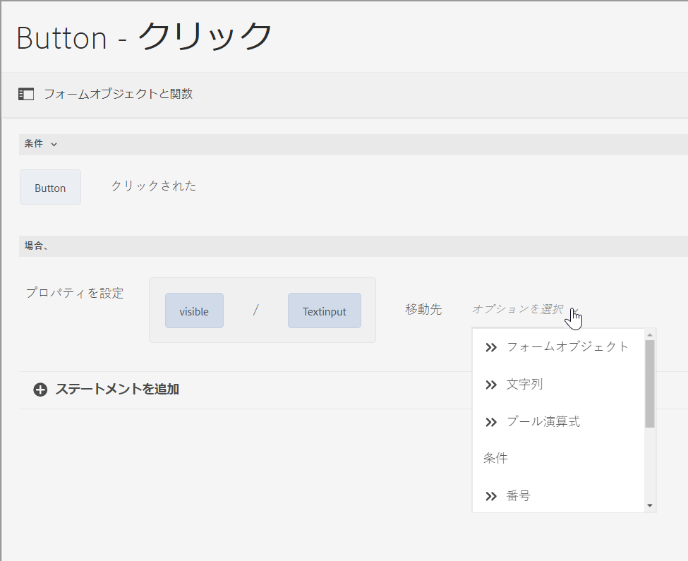

カスタム関数に基づいてルールを定義するには、ドロップダウンリストから「**[!UICONTROL 関数の出力]**」を選択し、「**[!UICONTROL 関数]**」タブからカスタム関数をドラッグアンドドロップします。条件アクションが満たされると、テキスト入力ボックスが表示されます。

フォームオブジェクトに基づいてルールを定義するには、ドロップダウンリストから「**[!UICONTROL フォームオブジェクト]**」を選択し、「**[!UICONTROL フォームオブジェクト]**」タブからフォームオブジェクトをドラッグ＆ドロップします。条件アクションが満たされると、テキスト入力ボックスがアダプティブフォームに表示されます。

オブジェクトプロパティに基づくプロパティの設定ルールを使用すると、アダプティブフォームに含まれる別のオブジェクトプロパティに基づいて、アダプティブフォーム内でテキスト入力ボックスを表示できます。

次の図は、アダプティブフォーム内のテキストボックスの非表示または表示に基づいて、チェックボックスを動的に有効にする例を示しています。

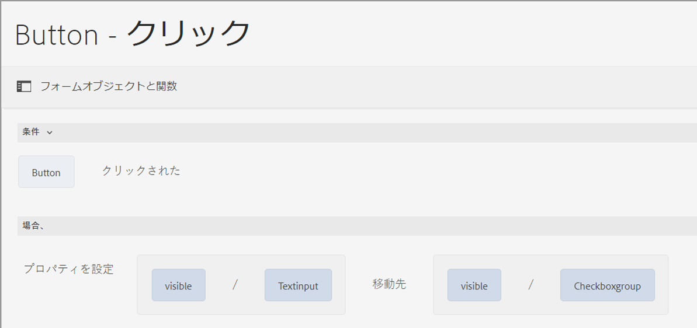

**[!UICONTROL Clear value of （値のクリア）]**：指定したオブジェの値をクリアします。

**[!UICONTROL Set Focus （フォーカスの設定）]**：指定したオブジェクトにフォーカスを設定します。

**[!UICONTROL 送信フォーム]** フォームを送信します。

**[!UICONTROL Reset]** フォームまたは指定したオブジェクトをリセットします。

**[!UICONTROL Validate]** フォームまたは指定したオブジェクトを検証します。

**[!UICONTROL Add Instance （インスタンスの追加）]**：指定した繰り返し可能なパネルまたは表の行のインスタンスを追加します。

**[!UICONTROL Remove Instance （インスタンスの削除）]**：指定した繰り返し可能なパネルまたは表の行のインスタンスを削除します。

**[!UICONTROL 関数出力]** 事前定義済みの関数またはカスタム関数に基づいてルールを定義します。

**[!UICONTROL Navigate to （移動先）]** ：他の<!--Interactive Communications,-->アダプティブフォーム、画像やドキュメントフラグメントなどの他のアセット、または外部 URL に移動します。<!-- For more information, see [Add button to the Interactive Communication](create-interactive-communication.md#addbuttontothewebchannel). -->

**[!UICONTROL イベントのディスパッチ]** 定義済みの条件またはイベントに基づいて、特定のアクションまたはビヘイビアーをトリガー設定します。


### [!UICONTROL Set Value of] {#set-value-of}

「**[!UICONTROL Set Value Of]**」のルールタイプを使用すると、指定した条件に応じてフォームオブジェクトの値を設定できます。この値には、他のオブジェクトの値や、リテラル文字列、数式や関数から算出された値、または他のオブジェクトのプロパティ値、フォームデータモデルサービスの出力値を指定することができます。同様に、関数や数式から算出された構成要素、文字列、プロパティ、または値を確認することもできます。

「**Set Value Of**」のルールタイプは、パネルやツールバーボタンなどのすべてのフォームオブジェクトで使用できるわけではありません。標準的な「Set Value Of」ルールは、次の構文を有します。

Set value of Object A to:

（文字列 ABC） OR （オブジェクト C のオブジェクトプロパティ X） OR （関数からの値） OR （数式表現からの値） OR （データモデルサービスの出力値）:

When （オプション）：

(Condition 1 AND Condition 2 AND Condition 3) is TRUE;

次の例では、の値を選択します `Question2` as `True` およびは、次の値を設定します `Result` as `correct`.


フォームデータモデルサービスを使用した Set Value ルールの例。

### [!UICONTROL Show（表示）] {#show}

「**[!UICONTROL Show]**」のルールタイプでは、条件を満たしているかどうかに基づいて、フォームオブジェクトの表示・非表示を切り替えることができます。「Show」のルールタイプでは、条件が満たされていないか、あるいは `False` が返された場合に、「Show」アクションをトリガーします。

代表的な「Show」のルール構文は、次のようになります。

`Show Object A;`

`When:`

`(Condition 1 OR Condition 2 OR Condition 3) is TRUE;`

`Else:`

`Hide Object A;`

### [!UICONTROL Hide（非表示）] {#hide}

「**[!UICONTROL Hide]**」のルールタイプでは、「Show」のルールタイプと同様に、条件を満たしているかどうか基づいて、フォームオブジェクトの表示・非表示を切り替えることができます。「Hide」のルールタイプでは、条件が満たされていないか、あるいは `False` が返された場合に、「非表示」アクションをトリガーします。

代表的な「Hide」のルール構文は、次のようになります。

`Hide Object A;`

`When:`

`(Condition 1 AND Condition 2 AND Condition 3) is TRUE;`

`Else:`

`Show Object A;`

### [!UICONTROL Enable（有効）] {#enable}

「**[!UICONTROL Enable]**」のルールタイプを使用すると、条件を満たしているか否かに基づいて、フォームオブジェクトを有効または無効にすることができます。「Enable」のルールタイプでは、条件が満たされていないか、あるいは `False` が返された場合に、「Disable」アクションをトリガーします。

代表的な「Enable」のルール構文は、次のようになります。

`Enable Object A;`

`When:`

`(Condition 1 AND Condition 2 AND Condition 3) is TRUE;`

`Else:`

`Disable Object A;`

### [!UICONTROL Disable（無効）] {#disable}

「**[!UICONTROL Disable]**」のルールタイプでは、「Enable」のルールタイプと同様に、条件を満たしているか否かに基づいて、フォームオブジェクトを有効または無効にすることができます。「Disable」のルールタイプでは、条件が満たされていないか、あるいは `False` が返された場合に、「Disable」アクションをトリガーします。

代表的な「Disable」のルール構文は、次のようになります。

`Disable Object A;`

`When:`

`(Condition 1 OR Condition 2 OR Condition 3) is TRUE;`

`Else:`

`Enable Object A;`

### [!UICONTROL Validate（検証）] {#validate}

「**[!UICONTROL 検証]**」ルールタイプでは、式を使用してフィールド内の値を検証します。例えば、式を記述することで、特定の名前のテキストボックスに特殊文字や数字が含まれていないことを確認することができます。

代表的な「検証」ルールは、次のようになります。

`Validate Object A;`

`Using:`

`(Expression 1 AND Expression 2 AND Expression 3) is TRUE;`

>[!NOTE]
>
>入力値が検証ルールと一致しない場合は、ユーザーに検証メッセージを表示できます。メッセージの内容は、サイドバー内のコンポーネントプロパティにある「**[!UICONTROL スクリプト検証メッセージ]**」フィールドから指定できます。

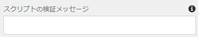

<!--
### [!UICONTROL Set Options Of] {#setoptionsof}

The **[!UICONTROL Set Options Of]** rule type enables you to define rules to add check boxes dynamically to the Adaptive Form. You can use a Form Data Model or a custom function to define the rule.

To define a rule based on a custom function, select **[!UICONTROL Function Output]** from the drop-down list, and drag-and-drop a custom function from the **[!UICONTROL Functions]** tab. The number of checkboxes defined in the custom function are added to the Adaptive Form.


To create a custom function, see [custom functions in rule editor](#custom-functions).

To define a rule based on a form data model:

1. Select **[!UICONTROL Service Output]** from the drop-down list.
1. Select the data model object.
1. Select a data model object property from the **[!UICONTROL Display Value]** drop-down list. The number of checkboxes in the Adaptive Form is derived from the number of instances defined for that property in the database.
1. Select a data model object property from the **[!UICONTROL Save Value]** drop-down list.

 -->

## ルールエディターのユーザーインターフェイスを理解する {#understanding-the-rule-editor-user-interface}

ルールエディターでは、ルールの記述や管理のための、総合的でシンプルなユーザーインタフェイスが用意されています。オーサリングモードのアダプティブフォーム内からルールエディターのユーザーインターフェイスを起動できます。

ルールエディターのユーザーインターフェイスを起動するには：

1. アダプティブフォームをオーサリングモードで開きます。
1. ルールを記述するフォームオブジェクトを選択し、コンポーネントツールバーで  をクリックします。ルールエディターのユーザーインターフェイスが表示されます。

   

   選択したフォームオブジェクトの既存のルールが、このビューに一覧表示されます。既存ルールの詳細な管理方法については、[ルール管理](rule-editor.md#p-manage-rules-p)を参照してください。

1. 「**[!UICONTROL 作成]**」を選択して、新しいルールを記述します。ルールエディターの初回起動時は、ルールエディターの UI がビジュアルエディターモード（デフォルト）で表示されます。

   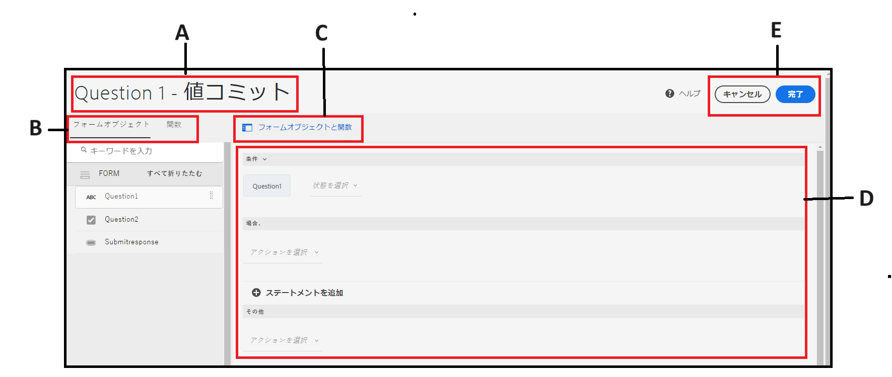

ここからは、ルールエディターのユーザーインターフェイスに含まれる各要素について説明します。

### A. コンポーネントルールの表示 {#a-component-rule-display}

ルールエディターを起動したアダプティブフォームオブジェクトのタイトルと、現在選択されているルールタイプを表示します。上記の例では、ルールエディターは「質問 1」と名付けられたアダプティブフォームオブジェクトから起動されており、「When」のルールタイプが選択されています。

### B. フォームオブジェクトと関数 {#b-form-objects-and-functions-br}

ルールエディターのユーザーインターフェイスの左側のペインには、「**[!UICONTROL フォームオブジェクト]**」と「**[!UICONTROL 関数]**」の 2 つのタブがあります。

「フォームオブジェクト」タブには、アダプティブフォームに含まれているオブジェクトがすべて階層表示されます。ここには、オブジェクトのタイトルとタイプが表示されます。ルールの作成時は、フォームオブジェクトをルールエディターまでドラッグ＆ドロップすることができます。オブジェクトまたは関数をプレースホルダーにドラッグ＆ドロップしてルールの作成や編集を行うと、適切な値の型がプレースホルダーに自動的に取り込まれるます。

1 つ以上の有効なルールが適用されているフォームオブジェクトには、緑のドットが付いています。フォームオブジェクトに適用されているルールのいずれかが無効な場合、フォームオブジェクトには黄色のドットが付きます。

「関数」タブには、「合計」、「最小」、「最大」、「平均」、「回数」や「フォームを検査」などの組み込み関数のセットが含まれています。これらの関数をルールに記述することで、繰り返しパネルや表の行の値を計算し、計算結果をアクションや条件文の中で使用することができます。また、カスタム関数を作成することもできます。

関数のリストの一部を図に示します。

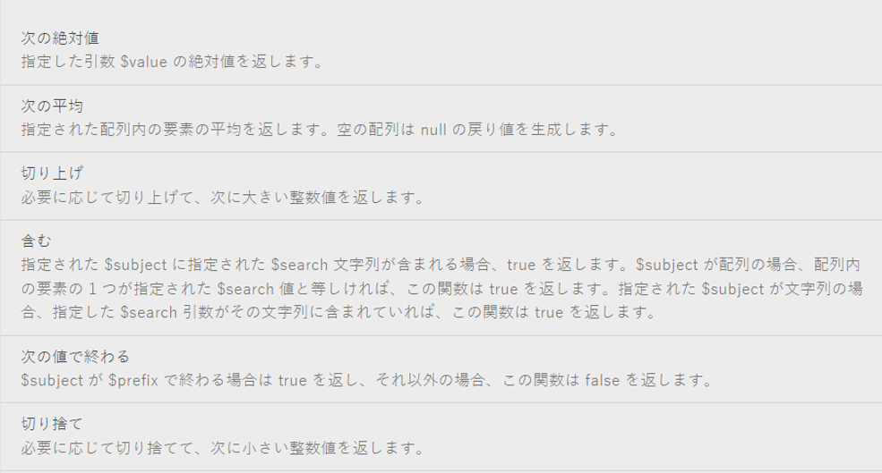

>[!NOTE]
>
>「フォームオブジェクト」と「関数」の各タブ内では、オブジェクトや関数の名前やタイトルを基にテキスト検索を行うことができます。

フォームオブジェクトの左側のツリーで、フォームオブジェクトを選択すると、各オブジェクトに適用されるルールが表示されます。様々なフォームオブジェクトのルール間を移動できるだけでなく、フォームオブジェクト間でルールをコピー＆ペーストすることもできます。詳しくは、[ルールをコピー＆ペースト](rule-editor.md#p-copy-paste-rules-p)を参照してください。

### C. フォームオブジェクトと関数の切り替え {#c-form-objects-and-functions-toggle-br}

切り替えボタンをタップすると、フォームオブジェクトと関数ペインが切り替わります。

### D. ルールのビジュアルエディター {#visual-rule-editor}

ルールを記述するビジュアルエディターは、ルールエディターのユーザーインターフェイスをビジュアルエディターモードに切り替えると表示されます。ルールタイプを選択し、それに応じて条件とアクションを定義できます。ルールで条件やアクションを定義する場合、フォームオブジェクトと関数ペインからフォームオブジェクトと関数をドラッグ＆ドロップできます。

ルールのビジュアルエディターの詳細については、「[ルールの作成](rule-editor.md#p-write-rules-p)」を参照してください。
<!-- 
### E. Visual-code editors switcher {#e-visual-code-editors-switcher}

Users in the forms-power-users group can access code editor. For other users, code editor is not available. If you have the rights, you can switch from visual editor mode to code editor mode of the rule editor, and conversely, using the switcher right above the rule editor. When you launch rule editor the first time, it opens in the visual editor mode. You can write rules in the visual editor mode or switch to the code editor mode to write a rule script. However, note that if you modify a rule or write a rule in code editor, you cannot switch back to the visual editor for that rule unless you clear the code editor.

[!DNL Experience Manager Forms] tracks the rule editor mode you used last to write a rule. When you launch the rule editor next time, it opens in that mode. However, you can also configure a default mode to open the rule editor in the specified mode. To do so:

1. Go to [!DNL Experience Manager] web console at `https://[host]:[port]/system/console/configMgr`.
1. Click to edit **[!UICONTROL Adaptive Form Configuration Service]**.
1. choose **[!UICONTROL Visual Editor]** or **[!UICONTROL Code Editor]** from the **[!UICONTROL Default Mode for Rule Editor]** drop-down

1. Click **[!UICONTROL Save]**.
-->

### E. 「完了」ボタンと「キャンセル」ボタン {#done-and-cancel-buttons}

ルールを保存するには、「**[!UICONTROL 完了]**」ボタンを押します。不完全なルールでも保存できます。ただし、不完全なルールは無効なため、実行されることはありません。フォームオブジェクトに保存されたルールは、同じフォームオブジェクトから次回ルールエディターを起動すると一覧表示されます。このビューでは、既存のルールを管理できます。詳しくは、[ルールを管理](rule-editor.md#p-manage-rules-p)を参照してください。

「**[!UICONTROL キャンセル]**」ボタンは、ルールに加えた変更を破棄し、ルールエディターを閉じます。

## ルールを記述 {#write-rules}

ビジュアルルールエディターを使用してルールを記述できます <!-- or the code editor. When you launch the rule editor the first time, it opens in the visual editor mode. You can switch to the code editor mode and write rules. However, if you write or modify a rule in code editor, you cannot switch to the visual editor for that rule unless you clear the code editor. When you launch the rule editor next time, it opens in the mode that you used last to create rule. -->

最初に、ビジュアルエディターを使用してルールを作成する方法を説明します。

### ビジュアルエディターの使用 {#using-visual-editor}

ここでは、次のフォーム例を使って、ビジュアルエディターでルールを作成する方法について説明します。


ローン申し込みフォームの例の「ローン要件」セクションでは、配偶者の有無、給与、および配偶者の給与（既婚の場合）を申請者が指定する必要があります。ユーザー入力に基づいて、ルールはローン適格額を計算し、「Loan Eligibility（貸付資格）」フィールドに表示します。次のルールを適用して、シナリオを実装します。

* 配偶者の「Salary（給与）」フィールドは、婚姻状況に「Married（既婚）」を選んだ場合にのみ表示されます。
* 融資適格額は、全給与の 50 パーセントとして計算されます。

ルールを記述するには、次のステップを実行します。

1. まず、「Marital Status（配偶者の有無）」のラジオボタンの選択内容に応じて「Spouse Salary（配偶者の給与）」フィールドの表示・非表示を制御するためのルールを記述します。

   融資申請フォームをオーサリングモードで開きます。「**[!UICONTROL 配偶者の有無]**」コンポーネントを選択し、「」を選択します。次に、「**[!UICONTROL 作成]**」を選択し、ルールエディターを起動します。

   

   ルールエディターを起動すると、「When」ルールがデフォルトで選択されます。また、ルールエディターを起動したフォームオブジェクト（この場合は「Marital Status（配偶者の有無）」）は、「When」文に入力されています。

   選択したオブジェクトを変更または修正できませんが、以下に示すように、ルールドロップダウンを使用して別のルールタイプを選択できます。別のオブジェクトにルールを作成する場合は、「キャンセル」を選択してルールエディターを終了し、目的のフォームオブジェクトから再度起動します。

1. 「**[!UICONTROL 状態の選択]**」ドロップダウンを選択し、「**[!UICONTROL 次の値と等しい]**」を選択します。「**[!UICONTROL 文字列を入力]**」フィールドが表示されます。

   

<!--  In the Marital Status radio button, **[!UICONTROL Married]** and **[!UICONTROL Single]** options are assigned **0** and **1** values, respectively. You can verify assigned values in the Title tab of the Edit radio button dialog as shown below.

   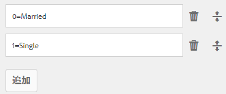-->

1. が含まれる **[!UICONTROL 文字列を入力]** ルールのフィールドで、 **既婚** ドロップダウンメニューから。

   

   条件を`When Marital Status is equal to Married`と定義しました。次に、この条件が True の場合に実行するアクションを定義します。

1. Then ステートメントで、**[!UICONTROL アクションを選択]**&#x200B;ドロップダウンリストから「**[!UICONTROL 表示]**」を選択します。

   

1. 「**[!UICONTROL オブジェクトをドロップするか、または次から選択]**」フィールドの「フォームオブジェクト」タブから「**[!UICONTROL Spouse Salary （配偶者の給与）]**」フィールドをドラッグ・ドロップします。目的のフォームオブジェクトから再度起動します。あるいは、「**[!UICONTROL オブジェクトをドロップするか、または次から選択]**」フィールドを選択し、ポップアップメニューから「**[!UICONTROL 配偶者の給与]**」フィールドを選択します。この中には、フォーム内のすべてのフォームオブジェクトが一覧表示されます。

   

   次に、この条件が False の場合に実行するアクションを定義します。
1. クリック **[!UICONTROL Else セクションの追加]** に別の条件を追加するには **[!UICONTROL 配偶者の給与]** 「配偶者の有無」を「独身」として選択した場合のフィールド。

   


1. Else ステートメントで、 **[!UICONTROL Hide]** から **[!UICONTROL アクションを選択]** ドロップダウン。
   

1. 「**[!UICONTROL オブジェクトをドロップするか、または次から選択]**」フィールドの「フォームオブジェクト」タブから「**[!UICONTROL Spouse Salary （配偶者の給与）]**」フィールドをドラッグ・ドロップします。目的のフォームオブジェクトから再度起動します。あるいは、「**[!UICONTROL オブジェクトをドロップするか、または次から選択]**」フィールドを選択し、ポップアップメニューから「**[!UICONTROL 配偶者の給与]**」フィールドを選択します。この中には、フォーム内のすべてのフォームオブジェクトが一覧表示されます。
   

   ルールエディターでは、ルールが次のように表示されます。

   


1. 「**[!UICONTROL 完了]**」を選択し、ルールを保存します。

<!--
1. Repeat steps 1 through 5 to define another rule to hide the Spouse Salary field if the marital Status is Single. The rule appears as follows in the rule editor.

    -->

>[!NOTE]
>
> また、同じ動作を実装する場合は、「Marital Status （配偶者の有無）」フィールドに「When」ルールを記述する代わりに、「Spouse Salary （配偶者の給与）」フィールドに「Show」ルールを記述することもできます。


1. 次に、融資適格金額を算出するためのルールを記述します。ここでは、総給与の 50% として計算され、「Loan Eligibility（貸付資格）」フィールドに表示されます。この結果を得るには、「Loan Eligibility （貸付資格）」フィールド上に「**[!UICONTROL 設定値]**」ルールを作成します。

   オーサリングモードで「**[!UICONTROL Loan Eligibility (貸付資格)]**」フィールドを選択し、 をクリックします。次に、「**[!UICONTROL 作成]**」を選択し、ルールエディターを起動します。

1. ルールのドロップダウンから「**[!UICONTROL 指定値]**」ルールを選択します。

   

1. 「**[!UICONTROL オプションの選択]**」を選択し、「**[!UICONTROL 数式]**」を選択します。数式記述用のフィールドが表示されます。

   

1. 数式記述用のフィールドでは、次のように行います。

   * 最初の「**[!UICONTROL オブジェクトをドロップまたは次から選択]**」の「フォームオブジェクト」タブから「**[!UICONTROL Salary（給与）]**」フィールドを選択するかドラッグ＆ドロップします。

   * 「**[!UICONTROL 演算子を選択]**」フィールドから「**[!UICONTROL プラス]**」を選択します。

   * 「フォームオブジェクト」タブから、他の&#x200B;**[!UICONTROL ドロップオブジェクトの「**[!UICONTROL  Spouse Salary （配偶者の給与）]**」フィールドを選択またはドラッグ＆ドロップするか、「ここ」]**&#x200B;フィールドを選択します。

   

1. 次に、式フィールドの周りのハイライト表示された領域を選択し、「**[!UICONTROL 拡張式]**」を選択します。

   

   拡張式フィールドでは、「**[!UICONTROL 演算子を選択]**」フィールドから「**[!UICONTROL ÷]**」を選択し、「**[!UICONTROL オプションを選択]**」フィールドから「**[!UICONTROL 数字]**」を選択します。次に、数字フィールドに「**[!UICONTROL 2]**」を入力します。

   

   >[!NOTE]
   >
   >「オプションを選択」フィールドから、コンポーネント、関数、数式、およびプロパティの各値を使用することで、複雑な式を作成することもできます。

   次に、True が返された場合に式を実行する条件を作成します。

1. 「**[!UICONTROL 条件の追加]**」を選択し、「When」文を追加します。

   

   When ステートメント内で、以下の操作を行います。

   * 最初の「**[!UICONTROL オブジェクトをドロップまたは次から選択]**」フィールドの「**[!UICONTROL 配偶者の有無]**」フィールドで、「フォームオブジェクト」タブから選択またはドラッグ＆ドロップします。

   * 「**[!UICONTROL 演算子の選択]**」フィールドから「**[!UICONTROL is equal to （に等しい）]**」を選択します。

   * 他の「**[!UICONTROL オブジェクトをドロップまたは次から選択]**」フィールドから「文字列」を選択し、「**[!UICONTROL 文字列を入力]**」フィールドに「**[!UICONTROL Married （既婚）]**」を入力します。

   ルールは、ルールエディターで最終的には次のように表示されます。

1. 「**[!UICONTROL 完了]**」を選択します。ルールが保存されます。

1. ステップ 7～14 を繰り返し、配偶者の有無が「Single（独身）」であれば融資適格額を計算する別のルールを定義します。ルールエディターでは、ルールが次のように表示されます。

   

代わりに、「When」ルール内で貸付資格を計算するために「Set Value Of」ルールを使用することもできます。このルールは、「Spouse Salary（配偶者の給与）」フィールドの表示／非表示を切り替えるために作成したものです。「Marital Status （配偶者の有無）」が「Single （独身）」の場合、ルールエディターでは組み合わせルールが次のように表示されます。


「Spouse Salary （配偶者の給与）」フィールドの表示・非表示を切り替えるための組み合わせルールを作成し、「Else （その他）」条件を使用して「Marital Status （配偶者の有無）」が「Married （既婚）」の場合に融資適格性を計算することができます。


<!-- ### Using code editor {#using-code-editor}

Users added to the forms-power-users group can use code editor. The rule editor auto generates the JavaScript code for any rule you create using visual editor. You can switch from visual editor to the code editor to view the generated code. However, if you modify the rule code in the code editor, you cannot switch back to the visual editor. If you prefer writing rules in code editor rather than visual editor, you can write rules afresh in the code editor. The visual-code editors switcher helps you switch between the two modes.

The code editor JavaScript is the expression language of Adaptive Forms. All the expressions are valid JavaScript expressions and use Adaptive Forms scripting model APIs. These expressions return values of certain types. For the complete list of Adaptive Forms classes, events, objects, and public APIs, see [JavaScript Library API reference for Adaptive Forms](https://helpx.adobe.com/experience-manager/6-5/forms/javascript-api/index.html).

For more information about guidelines to write rules in the code editor, see [Adaptive Form Expressions](adaptive-form-expressions.md).

While writing JavaScript code in the rule editor, the following visual cues help you with the structure and syntax:

* Syntax highlights

* Auto Indentation

* Hints and suggestions for Form objects, functions, and their properties

* Auto completion of form component names and common JavaScript functions


-->

#### ルールエディターでのカスタム関数 {#custom-functions}

のような標準搭載の機能とは別に、 *合計* の下にリストされているもの **関数の出力**&#x200B;また、ルールエディターでカスタム関数を使用することもできます。 ルールエディターでは、スクリプトおよびカスタム関数の JavaScript ECMAScript 2019 構文がサポートされています。 カスタム関数の作成手順について詳しくは、[アダプティブフォームのカスタム関数](/help/forms/create-and-use-custom-functions.md)の記事を参照してください。

<!--

Ensure that the function you write is accompanied by the `jsdoc` above it. Adaptive Form supports the various [JavaScript annotations for custom functions](/help/forms/create-and-use-custom-functions.md#js-annotations).

For more information, see [jsdoc.app](https://jsdoc.app/).

Accompanying `jsdoc` is required:

* If you want custom configuration and description
* Because there are multiple ways to declare a function in `JavaScript,` and comments let you keep a track of the functions.

Supported `jsdoc` tags:

* **Private**
  Syntax: `@private`
  A private function is not included as a custom function.

* **Name**
  Syntax: `@name funcName <Function Name>`
  Alternatively `,` you can use: `@function funcName <Function Name>` **or** `@func` `funcName <Function Name>`.
  `funcName` is the name of the function (no spaces allowed).
  `<Function Name>` is the display name of the function.

* **Parameter**
  Syntax: `@param {type} name <Parameter Description>`
  Alternatively, you can use: `@argument` `{type} name <Parameter Description>` **or** `@arg` `{type}` `name <Parameter Description>`.
  Shows parameters used by the function. A function can have multiple parameter tags, one tag for each parameter in the order of occurrence.
  `{type}` represents parameter type. Allowed parameter types are:

    1. string
    2. number
    3. boolean
    4. scope
    5. string[]
    6. number[]
    7. boolean[]
    8. date
    9. date[]
    10. array
    11. object

   `scope` refers to a special globals object which is provided by forms runtime. It must be the last parameter and is not be visible to the user in the rule editor. You can use scope to access readable form and field proxy object to read properties, event which triggered the rule and a set of functions to manipulate the form.

   `object` type is used to pass readable field object in parameter to a custom function instead of passing the value.

   All parameter types are categorized under one of the above. None is not supported. Ensure that you select one of the types above. Types are not case-sensitive. Spaces are not allowed in the parameter name.  Parameter description can have multiple words.

* **Optional Parameter**
Syntax: `@param {type=} name <Parameter Description>` 
Alternatively, you can use: `@param {type} [name] <Parameter Description>`
By default all parameters are mandatory. You can mark a parameter optional by adding `=` in type of the parameter or by putting param name in square brackets.
   
   For example, let us declare `Input1` as optional parameter:
    * `@param {type=} Input1`
    * `@param {type} [Input1]`

* **Return Type**
  Syntax: `@return {type}`
  Alternatively, you can use `@returns {type}`.
  Adds information about the function, such as its objective.
  {type} represents the return type of the function. Allowed return types are:

    1. string
    2. number
    3. boolean
    4. string[]
    5. number[]
    6. boolean[]
    7. date
    8. date[]
    9. array
    10. object

  All other return types are categorized under one of the above. None is not supported. Ensure that you select one of the types above. Return types are not case-sensitive.

**Adding a custom function**

For example, you want to add a custom function which calculates area of a square. Side length is the user input to the custom function, which is accepted using a numeric box in your form. The calculated output is displayed in another numeric box in your form. To add a custom function, you have to first create a client library, and then add it to the CRX repository.

To create a client library and add it in the CRX repository, perform the following steps:

1. Create a client library. For more information, see [Using Client-Side Libraries](https://experienceleague.adobe.com/docs/experience-manager-cloud-service/implementing/developing/full-stack/clientlibs.html#developing).
2. In CRXDE, add a property `categories`with string type value as `customfunction` to the `clientlib` folder.

   >[!NOTE]
   >
   >`customfunction`is an example category. You can choose any name for the category you create in the `clientlib`folder.

After you have added your client library in the CRX repository, use it in your Adaptive Form. It lets you use your custom function as a rule in your form. To add the client library in your Adaptive Form, perform the following steps:

1. Open your form in edit mode.
   To open a form in edit mode, select a form and select **[!UICONTROL Open]**.
1. In the edit mode, select a component, then select  &gt; **[!UICONTROL Adaptive Form Container]**, and then select .
1. In the sidebar, under Name of Client Library, add your client library. ( `customfunction` in the example.)

   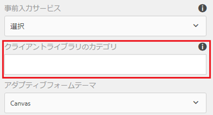

1. Select the input numeric box, and select  to open the rule editor.
1. Select **[!UICONTROL Create Rule]**. Using options shown below, create a rule to save the squared value of the input in the Output field of your form.

   [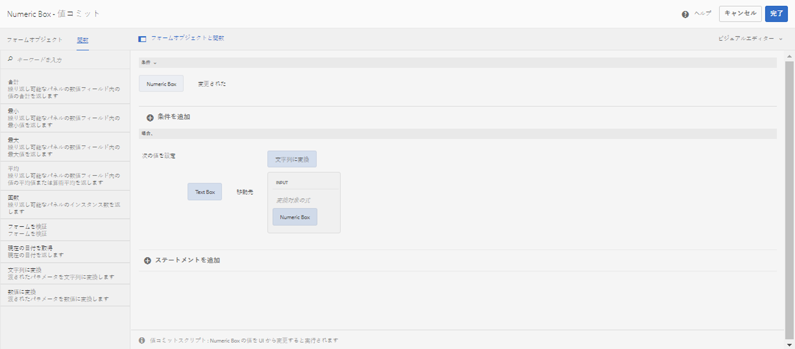](assets/add-custom-rule.png)
  
1. Select **[!UICONTROL Done]**. Your custom function is added.

   >[!NOTE]
   >
   > To invoke a form data model from rule editor using custom functions, [see here](/help/forms/using-form-data-model.md#invoke-services-in-adaptive-forms-using-rules-invoke-services). 

#### Function declaration supported types {#function-declaration-supported-types}

**Function Statement**

```javascript
function area(len) {
    return len*len;
}
```

This function is included without `jsdoc` comments.

**Function Expression**

```javascript
var area;
//Some codes later
/** */
area = function(len) {
    return len*len;
};
```

**Function Expression and Statement**

```javascript
var b={};
/** */
b.area = function(len) {
    return len*len;
}
```

**Function Declaration as Variable**

```javascript
/** */
var x1,
    area = function(len) {
        return len*len;
    },
    x2 =5, x3 =true;
```

Limitation: custom function picks only the first function declaration from the variable list, if together. You can use function expression for every function declared.

**Function Declaration as Object**

```javascript
var c = {
    b : {
        /** */
        area : function(len) {
            return len*len;
        }
    }
};
```

>[!NOTE]
>
>Ensure that you use `jsdoc` for every custom function. Although `jsdoc`comments are encouraged, include an empty `jsdoc`comment to mark your function as custom function. It enables default handling of your custom function.
-->

## ルール管理 {#manage-rules}

フォームオブジェクトを選択し、続けて￥」を選択すると、オブジェクト上に既存のルールが一覧表示されます。タイトルを表示し、ルール概要をプレビューできます。さらに、UI を使用すると、ルールの概要の展開および表示、ルールの順序変更、ルールの編集、ルールの削除を行えます。


ルールに対して、次の操作を実行できます。

* **展開／折りたたみ**：ルールリスト内の「コンテンツ」の列には、ルールの内容が表示されます。デフォルトビューにルール内容の全体が表示されていない場合は、「」を選択してビューを展開します。

* **並べ替え**：新しく作成したルールはすべて、ルールリストの一番下に追加されます。ルールは上から下に順に実行されます。一番上のルールが最初に実行され、続けて同じタイプの他のルールが実行されます。例えば、「When」、「Show」、「Enable」、および「When」の各ルールが、リストの 1～4 番目にある場合、一番上にある「When」ルールが最初に実行され、次に 4 番目の「When」ルールが実行されます。そして、「Show」ルールおよび「Enable」ルールが実行されます。ルールの順序を変更するには、 をタップするか、リスト内の目的の位置にドラッグアンドドロップします。

* **編集**：ルールを編集するには、ルールタイトルの横にあるチェックボックスを選択します。ルールを編集・削除するためのオプションが表示されます。「**[!UICONTROL 編集]**」を選択して、選択したルールをルールエディター<!-- in visual  or code editor mode depending on the mode used to create the rule -->で開きます。

* **削除**：ルールを削除するには、ルールを選択してから「**[!UICONTROL 削除]**」をクリックします。

* **有効／無効**：ルールの使用を一時的に停止する必要がある場合、1 つ以上のルールを選択し、アクションツールバーの「**[!UICONTROL 無効]**」を選択して無効にすることができます。ルールが無効化されている場合は、ランタイムには実行されません。無効になっているルールを有効にするには、そのルールを選択して、アクションツールバーの「有効にする」を選択します。ルールの「ステータス」列には、ルールが有効か無効かが表示されます。


## ルールのコピー＆ペースト {#copy-paste-rules}

ルールを 1 つのフィールドから他の類似したフィールドにコピー＆ペーストすると、時間を節約できます。

ルールをコピー＆ペーストするには、次の手順を実行します。

1. ルールをコピーするフォームオブジェクトを選択し、コンポーネントツールバーから「」をクリックします。フォームオブジェクトが選択された状態でルールエディターのユーザーインタフェイスが表示され、既存のルールが表示されます。

   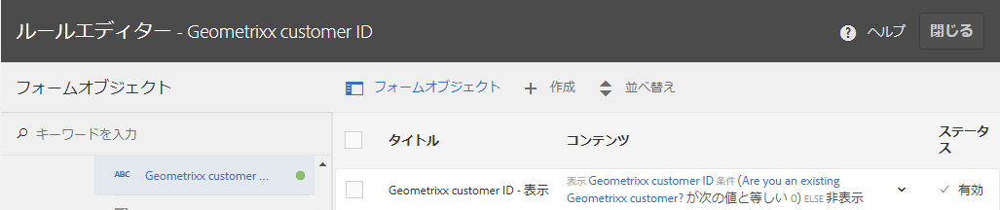

   既存ルールの詳細な管理方法については、[ルール管理](rule-editor.md#p-manage-rules-p)を参照してください。

1. ルールタイトルの横にあるチェックボックスを選択すると、ルールを管理するオプションが表示されます。「**[!UICONTROL コピー]**」を選択します。

   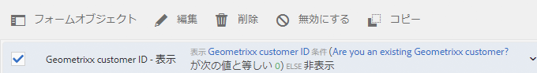

1. ルールをペーストする別のフォームオブジェクトを選択し、「**[!UICONTROL ペースト]**」を選択します。さらに、ルールを編集して、変更を加えることができます。

   >[!NOTE]
   >
   >ルールを別のフォームオブジェクトに貼り付けることができるのは、そのフォームオブジェクトがコピーしたルールのイベントをサポートしている場合に限られます。例えば、ボタンはクリックイベントをサポートします。クリックイベントを含むルールをボタンに貼り付けることはできますが、チェックボックスに貼り付けることはできません。

1. 「**[!UICONTROL 完了]**」を選択し、ルールを保存します。

## ネスト式 {#nestedexpressions}

ルールエディターでは、複数の AND 演算子と OR 演算子を使用して、ネストされたルールを作成できます。ルール内には、複数の「AND」と「OR」演算子を混在させることもできます。

以下の例では、ネストされたルールを紹介します。ここでは、必要な条件が満たされた際に、子供の親権適格性についてのメッセージをユーザーに表示します。


ルール内で条件をドラッグアンドドロップして編集することもできます。条件の前のハンドル（）を選択し続けます。次に示すようにポインターが手の形になったら、ルール内の任意の場所に条件をドラッグ＆ドロップします。ルール構造が変化します。


## 日付式の条件 {#dateexpression}

ルールエディターでは、日付比較を使用して条件を作成できます。

次に示す条件の例では、ユーザーが日付フィールドに入力することによって指定する家屋の住宅ローンが既に取得されている場合、静的テキストオブジェクトを表示します。

ユーザーが入力した物件の住宅ローンの日付が過去のものである場合、アダプティブフォームは収入計算に関する注記を表示します。次のルールは、ユーザーが入力した日付を現在の日付と比較し、ユーザーが入力した日付が現在の日付より前の場合、フォームは（Income という名前の）テキストメッセージを表示します。

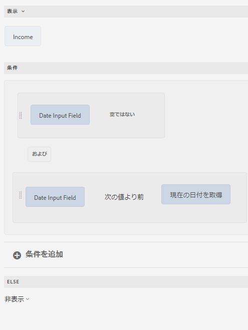

入力された日付が現在の日付よりも前の場合、フォームはテキストメッセージ（Income）を次のように表示します。


## 数値比較条件 {#number-comparison-conditions}

ルールエディターでは、2 つの数値を比較する条件を作成できます。

次に示す条件の例では、申込者が現在の住所に住んでいる月数が 36 に満たない場合、静的テキストオブジェクトを表示します。


現在の居住地住所に住んでいる期間が 36 か月に満たないことをユーザーが指定した場合、フォームは、その他の居住地証明が要求される場合があるという通知を表示します。


<!-- ## Impact of rule editor on existing scripts {#impact-of-rule-editor-on-existing-scripts}

In [!DNL Experience Manager Forms] versions prior to [!DNL Experience Manager 6.1 Forms] feature pack 1, form authors and developers used to write expressions in the Scripts tab of the Edit component dialog to add dynamic behavior to Adaptive Forms. The Scripts tab is now replaced by the rule editor.

Any scripts or expressions that you must have written in the Scripts tab are available in the rule editor. While you cannot view or edit them in visual editor, if you are a part of the forms-power-users group you can edit scripts in code editor. -->

## ルールの例 {#example}

### フォームデータモデルサービスを起動 {#invoke}

ローン額、加入年数、申請者の信用度スコアを入力として、EMI 額と利率を含むローンプランを返す、web サービス `GetInterestRates` を考えます。Web サービスをデータソースとして使用し、フォームデータモデル（FDM）を作成します。 データモデルオブジェクトと `get` サービスをフォームモデルに追加します。フォームデータモデル（FDM）の「サービス」タブにサービスが表示されます。 その後、データモデルオブジェクトのフィールドを含むアダプティブフォームを作成し、ローン総額、加入年数、申込者の信用度についてユーザーの入力を取得します。計画の詳細を取得するために Web サービスをトリガーするボタンを追加します。適切なフィールドで出力が算出されます。

次のルールは、「サービスを起動」アクションを設定してシナリオ例を実行する方法を示しています。


>[!NOTE]
>
>入力が配列タイプの場合、配列をサポートするフィールドが「出力」ドロップダウンセクションに表示されます。

### 「When」ルールを使用して複数のアクションをトリガーする  {#triggering-multiple-actions-using-the-when-rule}

ローン申し込みフォームでは、ローンの申請者が既存の顧客であるかどうかを判断する必要があります。ユーザーが提供する情報に基づいて、顧客 ID フィールドの表示と非表示を切り替えます。また、申請者が既存の顧客であれば、顧客 ID フィールドにフォーカスを置きます。ローン申し込みフォームの構成要素は次のとおりです。

* 「**[!UICONTROL Are you an existing Geometrixx customer?（Geometrixx に既に登録されていますか？）]**」のラジオボタンでは、「[!UICONTROL はい]」と「[!UICONTROL いいえ]」のオプションが設けられています。「はい」の値は **0**、「いいえ」の値は **1** です。

* 「**[!UICONTROL Geometrixx 顧客 ID]**」テキストフィールドには、顧客 ID が入力されます。

この動作を実装するためラジオボタンに When ルールを記述すると、ビジュアルルールエディターにはルールが次のように表示されます。


ビジュアルエディターに表示されたルール

上のルール例では、「When」セクション内の文は条件に当たります。これが True を返すと、「Then」セクションで指定されたアクションが実行されます。

<!-- The rule appears as follows in the code editor.

 

Rule in the code editor -->

### ルール内で関数出力を使用する {#using-a-function-output-in-a-rule}

発注フォームでは、次の表が表示されます。この中には、発注者が注文を入力します。このテーブルの内容：

* 最初の行は反復可能なので、ユーザーは複数の製品を注文し、それぞれ異なる数量を指定することができます。この要素の名前は、「`Row1`」です。
* 反復可能な行と「Product Quantity（製品数量）」の列が重なるセルでは、タイトルが「Quantity（数量）」になっています。このセルの要素名は「`productquantity`」です。
* 表の 2 行目は反復しません。また、この行と「Product Quantity（製品数量）」の列が重なるセルでは、タイトルが「Total Quantity（合計数量）」になっています。


**A.** 行 1 **B.** 数量 **C.** 合計数量

ここでは、「Product Quantity（製品数量）」列で指定された数量を全製品について合計し、「Total Quantity（合計数量）」セルに合計値を表示する必要があります。以下に示すように、「Total Quantity（合計数量）」セルに「Set Value Of」ルールを記述することにより、この合計を達成できます。

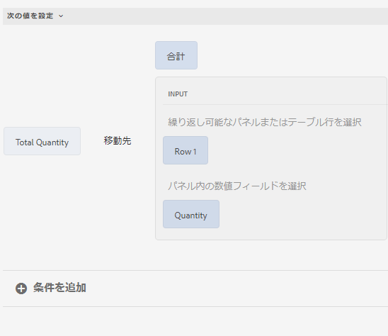

ビジュアルエディターに表示されたルール

<!-- he rule appears as follows in the code editor.

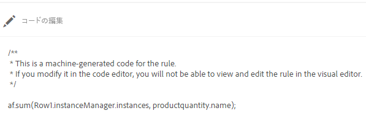

Rule in the code editor -->

### 式を使用してフィールド値を検証する {#validating-a-field-value-using-expression}

前の例で説明した発注書フォームでは、価格が 10000 を超える商品については、ユーザーが複数個発注することを制限します。この検証を行うには、以下に示すように検証ルールを記述します。

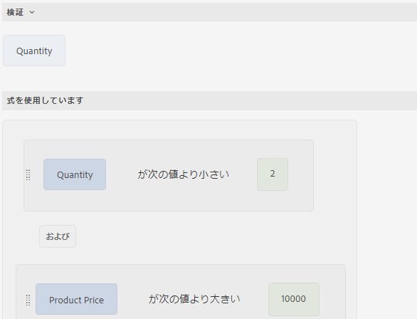

ビジュアルエディターに表示されたルール

<!-- The rule appears as follows in the code editor.

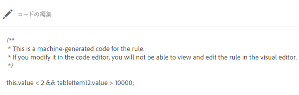

Rule in the code editor -->
