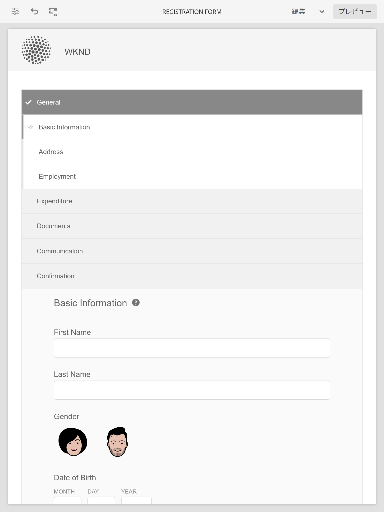

# コアコンポーネントのサンプルのテーマ、テンプレート、フォームデータモデル {#sample-themes-templates-and-data-models}

AEM Forms as a Cloud Serviceには、コアコンポーネントを使用したアダプティブFormsの作成をすぐに開始するのに役立つ、いくつかのサンプルのリファレンステーマ、テンプレート、フォームデータモデルが用意されています。 以下が可能です。 [アダプティブFormsコアコンポーネントの有効化](https://experienceleague.adobe.com/docs/experience-manager-cloud-service/content/forms/setup-configure-migrate/enable-adaptive-forms-core-components.html?lang=ja) AEM Formsのas a Cloud Serviceおよびローカル開発環境で、参照用 OOTB テンプレートと [テーマの使用とカスタマイズ](https://experienceleague.adobe.com/docs/experience-manager-cloud-service/content/forms/adaptive-forms-authoring/authoring-adaptive-forms-core-components/create-an-adaptive-form-on-forms-cs/using-themes-in-core-components.html) in [!DNL AEM Forms].

参照コンテンツパッケージに含まれるサンプルのテーマ、テンプレート、フォームデータモデルは次のとおりです。

| テンプレート | テーマ | フォームデータモデル |
---------|----------|---------
| 基本 | Canvas | Microsoft® Dynamics 365 |
| 空白 | WKND | Salesforce |
| お問い合わせ | イーゼル |  |
| 同意フォーム | |  |
| 苦情を提起する | | |
| ログサービスリクエスト |  |  |
| フィードバックを与える |  |  |
| 福利厚生登録 |  |   |
| 従業員福利厚生の要約 |   |   |
| 取引明細書のリクエスト |   |   |
| 連絡先詳細の更新 |   |   |
| 安全検査用紙 |   |   |
| 品質管理検査 |   |   |
| 購入リクエスト |  |  |

## サンプルテーマ {#Sample-Themes}

リファレンステーマは、CSS に関する専門知識を持たずにフォームのスタイルを定義する場合に役立ちます。必要に応じてテーマをカスタマイズすることもできます。 以下が可能です。 [アダプティブFormsコアコンポーネントの有効化](https://experienceleague.adobe.com/docs/experience-manager-cloud-service/content/forms/setup-configure-migrate/enable-adaptive-forms-core-components.html?lang=ja) AEM Formsのas a Cloud Serviceおよびローカル開発環境で、以下の説明に従ってこれらのテーマを取得します。

### Canvas {#Canvas}

Canvas はアダプティブフォームのデフォルトのテーマで、基本色、透明度、フラットアイコンの使用が強調されます。以下のスクリーンショットでは、Canvas のテーマがどのように表示されるのかを確認できます。

### WKND {#WKND}

WKND テーマは、活発で想像力に富んだデザインを組み合わせ、フォーム内のスタイリッシュな外観を紹介します。 テーマは、の外観とスタイル設定に基づいています。 [WKND サイト](https://wknd.site/us/en.html) これは、旅行と冒険のウェブサイトです。 [Adobe Experience Manager Core Components](https://experienceleague.adobe.com/docs/experience-manager-core-components/using/introduction).

### イーゼル {#Easel}

イーゼルテーマは、設定が容易な特定のタイプのテンプレートデザインを指し、簡単で使いやすいようにカスタマイズされています。 イーゼルのテーマは、アーティストが絵画を描きながらキャンバスを支えるために使う携帯スタンドをコンセプトにしています。

## サンプルテンプレート {#Sample-templates}

テンプレートは、フォーム内で複製する初期フォーム構造、コンテンツ、およびアクションを定義します。また、同様のテンプレート構造をフォームに使用する場合は、同意フォーム、特典登録フォームなどを使用します。 次のテンプレートを [アダプティブFormsコアコンポーネントの有効化](https://experienceleague.adobe.com/docs/experience-manager-cloud-service/content/forms/setup-configure-migrate/enable-adaptive-forms-core-components.html?lang=ja) AEM Formsのas a Cloud Serviceまたはローカル開発環境。 アダプティブFormsコアコンポーネントのサンプルテンプレートは次のとおりです。

### 基本 {#Basic}

基本テンプレートを使用すると、登録エクスペリエンスフォームをすばやく作成できます。 また、アダプティブFormsコアコンポーネントの機能をプレビューする場合にも使用できます。 データをセクションごとに表示するウィザードレイアウトが提供されます。

>[!BEGINTABS]

>[!TAB デスクトップ]

    

>[!TAB 電話]

    

>[!TAB タブレットなど）のアクティブマーカーを確認する。]

    

>[!ENDTABS]

### 空白 {#Blank}

空のキャンバステンプレートを使用して、アダプティブフォームの構造、コンテンツ、ルールを一から作成します。 フォームコンポーネントは組み込まれません。

### 口座明細書の請求 {#Request-for-Account-Statement}

取引明細書をリクエストするための取引明細書フォームのリクエスト。 この文は、金融取引、活動、または個人に関するその他の関連情報の詳細な記録を提供します。 このフォームに記入することで、レコードに関する正確で最新の文を取得するプロセスを開始できます。

### 連絡先詳細の更新 {#Contact-Details-Update}

住所と連絡先詳細の更新フォームは、お客様が受け取るサービスや特典に対してシームレスに連絡し、中断のないアクセスを確保するために、サブスクリプションや特典に関する個人情報を更新する際に役立つように設計されています。

### 安全検査 {#Safety-Inspection}

安全検査用紙は、安全な作業環境を維持するためのものです。 この形態を用いて定期検査を行うことで、潜在的な危険性を特定することができる。 緊急出口、火災安全、電気安全、危険物、個人用保護機器、ワークステーション人間工学など、様々な側面を取り上げています。 従業員、訪問者、顧客の安全と福祉のために、そして、すべての人に安全な環境を作り出す。

### 購入リクエスト {#Purchase-Request}

購買依頼フォーム：調達プロセスを開始し、従業員が仕事に必要な商品やサービスの購入を正式に要求できるようにします。 フォームは、品目の説明、数量、希望仕入先（該当する場合）、予算配分、購入のジャスティフィケーション、配信情報、必要な承認など、重要な詳細をキャプチャします。 フォームの目的は、購入プロセスを合理化し、ドキュメント化して、要求された購入の適切な認証と追跡を確実に行うことです。

### 従業員福利厚生要約 {#Employee-Benefits-Summary}

「従業員福利厚生要約」フォームは、個人の福利厚生に関する重要な詳細を収集するために使用します。 これにより、対象範囲を迅速かつ正確に評価し、包括的な概要を提供して、効率的な支援とサポートを実現します。

### 福利厚生登録 {#Benefits-Enrollment}

優先給付と適用オプションに関する重要な情報を従業員から収集する福利厚生登録フォームテンプレート。 通常は、年間の福利厚生登録期間に付随します。

### 品質管理検査 {#Quality-Control-Inspection}

品質管理検査フォームを使用して、製品または品目の外観、寸法、機能、ドキュメント、テスト結果、および全体的な品質を評価し、文書化します。 品質基準の遵守に必要な欠陥、不適合、および是正措置を特定するのに役立ちます。

### 同意フォーム {#Consent-Form}

同意書は、個人または参加者が特定の活動、研究、医療処置、または個人情報や権利が関与する状況に参加する前に、その個人または参加者から自発的かつ十分な情報に基づく許可を得ることを目的とする法的文書です。 同意書の目的は、透明性を確保し、参加者の権利を保護し、個人が何に同意するかを明確に理解することです。

### お問い合わせ {#Contact-Us}

住所と連絡先詳細の更新フォームは、お客様が受け取るサービスや特典に対してシームレスに連絡し、中断のないアクセスを確保するために、サブスクリプションや特典に関する個人情報を更新する際に役立つように設計されています。

### ログサービスリクエスト {#Log-Service-Request}

サービスプロバイダーから特定のログサービスを要求するログサービス要求フォームです。 このフォームは、チケットを作成するための正式なリクエストとして機能し、特定のイベント、アクティビティまたはデータが記録され、ステータスの監視や追跡が可能になります。

### フィードバックを与える {#Give-Feedback}

別の人やチームに建設的なフィードバックを提供するための「与えるフィードバック」テンプレート。 このテンプレートは、フィードバックが明確で具体的で実用的なものであることを保証し、オープンなコミュニケーションと改善を促進します。

## 参照フォームデータモデル {#reference-models}

その後、アダプティブFormsはMicrosoft® Dynamics 365 および Salesforce サーバーとやり取りして、ビジネスワークフローを有効にできます。 例：

* アダプティブフォーム送信時にMicrosoft® Dynamics 365 と Salesforce にデータを書き込みます。
* フォームデータモデルで定義されたカスタムエンティティを使用してMicrosoft® Dynamics 365 および Salesforce にデータを書き込みます。また、その逆も同様です。
* Microsoft® Dynamics 365 と Salesforce サーバーにデータを問い合わせ、Adaptive Formsを事前設定します。
* Microsoft® Dynamics 365 および Salesforce サーバーからデータを読み取ります。

[参照コンテンツパッケージ](https://experience.adobe.com/#/downloads/content/software-distribution/en/aemcloud.html?package=/content/software-distribution/en/details.html/content/dam/aemcloud/public/aem-forms-reference-content.ui.content-2.1.0.zip)をインストールすると、次のフォームデータモデルを取得できます。

* Microsoft® Dynamics 365
* Salesforce

これらのモデルの使用方法については、 [Microsoft® Dynamics 365 および Salesforce クラウドサービスの設定](https://experienceleague.adobe.com/docs/experience-manager-cloud-service/content/forms/integrate/use-form-data-model/configure-msdynamics-salesforce.html?lang=ja#configure-dynamics-cloud-service)
