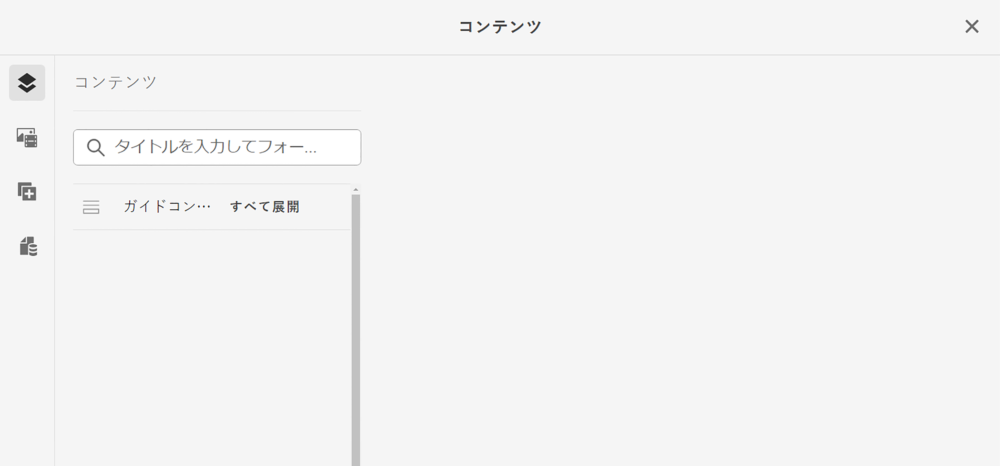
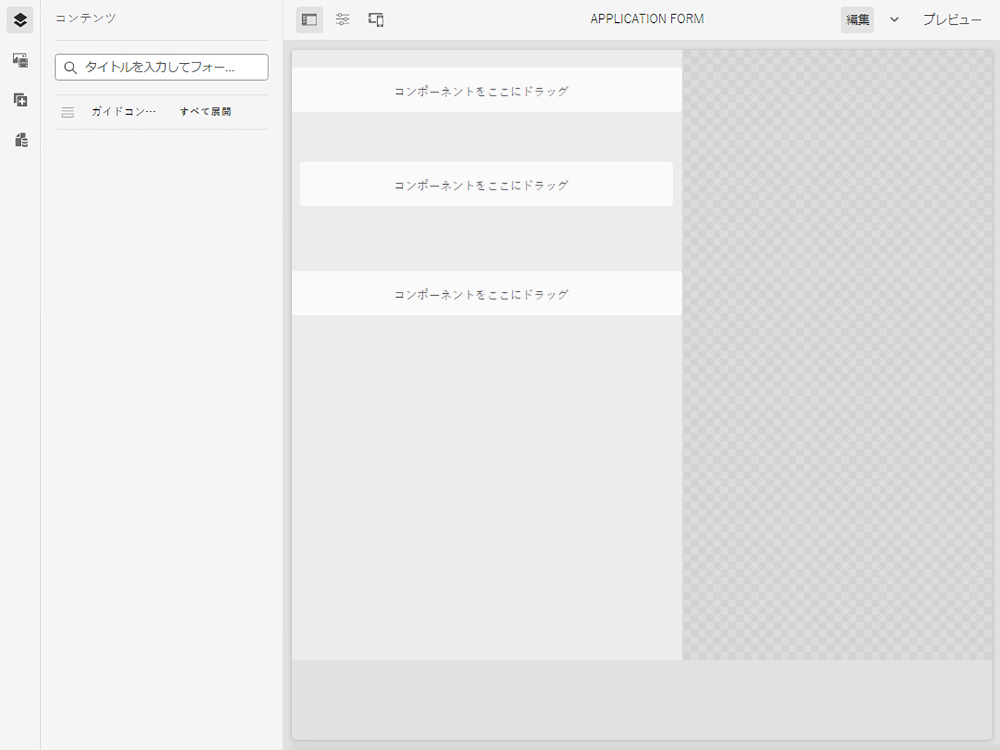

# コアコンポーネントのサンプルのテーマ、テンプレート、フォームデータモデル {#sample-themes-templates-and-data-models}

AEM Forms as a Cloud Serviceには、コアコンポーネントを使用したアダプティブFormsの作成をすばやく開始できるように、サンプルのリファレンステーマ、テンプレート、フォームデータモデルが用意されています。 以下が可能です。 [アダプティブFormsコアコンポーネントの有効化](https://experienceleague.adobe.com/docs/experience-manager-cloud-service/content/forms/setup-configure-migrate/enable-adaptive-forms-core-components.html?lang=ja) AEM Formsのas a Cloud Serviceおよびローカル開発環境で、サンプルの OOTB テンプレートを取得し、 [サンプルテーマの使用とカスタマイズ](https://experienceleague.adobe.com/docs/experience-manager-cloud-service/content/forms/adaptive-forms-authoring/authoring-adaptive-forms-core-components/create-an-adaptive-form-on-forms-cs/using-themes-in-core-components.html) in [!DNL AEM Forms].

参照コンテンツパッケージに含まれるサンプルのテーマ、テンプレート、フォームデータモデルは次のとおりです。

| テンプレート | テーマ | フォームデータモデル |
---------|----------|---------
| 基本 | Canvas | Microsoft® Dynamics 365 |
| 空白 | WKND | Salesforce |
| お問い合わせ | イーゼル |  |
| 連絡先詳細の更新 |   |   |
| 同意フォーム | |  |
| ログサービスリクエスト |  |  |
| フィードバックを与える |  |  |
| 福利厚生登録 |  |   |
| 従業員福利厚生の要約 |   |   |
| 取引明細書のリクエスト |   |   |
| 安全検査用紙 |   |   |
| 品質管理検査 |   |   |
| 購入リクエスト |  |  |

## サンプルテーマ {#Sample-Themes}

リファレンスサンプルテーマは、作成者がフォームのスタイル設定を定義し、カスタマイズするのに役立ちます。CSS の基本知識を持つ作成者は、必要に応じてテーマをカスタマイズできます。 フォーム作成者 [アダプティブFormsコアコンポーネントの有効化](https://experienceleague.adobe.com/docs/experience-manager-cloud-service/content/forms/setup-configure-migrate/enable-adaptive-forms-core-components.html?lang=ja) AEM Formsのas a Cloud Serviceおよびローカル開発環境で、以下の説明に従ってこれらのテーマを取得します。

### Canvas {#Canvas}

キャンバステーマはフォームのデフォルトのテーマで、基本色、透明度、およびフラットアイコンの使用を強調します。 以下のスクリーンショットでは、Canvas のテーマがどのように表示されるのかを確認できます。

### WKND {#WKND}

WKND テーマは、活発で想像力に富んだデザインを体現し、スタイリッシュな外観をフォームに表現します。 テーマは、の外観とスタイル設定に基づいています。 [WKND サイト](https://wknd.site/us/en.html) これは、旅行と冒険のウェブサイトです。 [Adobe Experience Manager Core Components](https://experienceleague.adobe.com/docs/experience-manager-core-components/using/introduction).

### イーゼル {#Easel}

簡単なテーマは、魅力的でセットアップが容易なフォームの外観を作成するのに役立ちます。このテーマは、シンプルで使いやすいようにカスタマイズされています。 イーゼルのテーマは、アーティストが絵画を描きながらキャンバスを支えるために使う携帯スタンドをコンセプトにしています。

## サンプルテンプレート {#Sample-templates}

テンプレートは、フォーム内で複製する初期フォーム構造、コンテンツ、およびアクションを定義します。また、同様のテンプレート構造をフォームに使用する場合は、同意フォーム、特典登録フォームなどを使用します。 次のテンプレートを [アダプティブFormsコアコンポーネントの有効化](https://experienceleague.adobe.com/docs/experience-manager-cloud-service/content/forms/setup-configure-migrate/enable-adaptive-forms-core-components.html?lang=ja) AEM Formsのas a Cloud Serviceまたはローカル開発環境。 アダプティブFormsコアコンポーネントのサンプルテンプレートは次のとおりです。

### 基本 {#Basic}

基本テンプレートを使用すると、登録エクスペリエンスフォームをすばやく作成できます。 また、を使用して、の機能をプレビューすることもできます。 [アダプティブFormsコアコンポーネント](https://experienceleague.adobe.com/docs/experience-manager-core-components/using/adaptive-forms/introduction). データをセクションごとに表示するウィザードレイアウトが提供されます。

>[!BEGINTABS]

>[!TAB デスクトップ]

>[!TAB 電話]

{width:&quot;25%&quot;}

>[!TAB タブレットなど）のアクティブマーカーを確認する。]

>[!ENDTABS]

### 空白 {#Blank}

空のキャンバステンプレートを使用して、アダプティブフォームの構造、コンテンツ、ルールを一から作成します。 空のテンプレートには、フォームコンポーネントがあらかじめ組み込まれていません。

>[!BEGINTABS]

>[!TAB デスクトップ]

>[!TAB 電話]

{width:&quot;25%&quot;}

>[!TAB タブレットなど）のアクティブマーカーを確認する。]

>[!ENDTABS]

### お問い合わせ {#Contact-Us}

Web サイトの訪問者と管理者の間のコミュニケーションを容易にするフォームを作成するには、「Contact Us」フォームテンプレートを使用します。 ユーザーは、フォームを通じて、クエリ、フィードバック、またはサポートリクエストを送信できます。

### 連絡先詳細の更新 {#Contact-Details-Update}

連絡先詳細更新テンプレートの作成者が、顧客の住所と連絡先詳細の更新用のフォームを作成する際に役立ちます。 また、このフォームは、サブスクリプションや特典に関する個人情報を更新し、シームレスなコミュニケーションを実現し、サービスや特典への中断のないアクセスを確実にするお客様を支援します。

### 同意フォーム {#Consent-Form}

同意フォームテンプレートを使用して、特定の活動、研究、医療処置、または個人情報や権利が関与する状況に参加する参加者から法的文書を取得するためのフォームを作成します。 このフォームは、透明性を確保し、参加者の権利を保護し、個人が何に同意するかを明確に理解するためのものです。

### ログサービスリクエスト {#Log-Service-Request}

ログサービス要求テンプレートを使用すると、サービスプロバイダーから特定のログサービスを要求するフォームを作成できます。 このフォームは、チケットを作成するための正式なリクエストとして機能し、特定のイベント、アクティビティまたはデータが記録され、ステータスの監視や追跡が可能になります。

### フィードバックを与える {#Give-Feedback}

フィードバックフォームテンプレートを提供すると、別の人やチームに建設的なフィードバックを提供するためのフォームを作成できます。 このフォームは、フィードバックが明確で具体的で実用的なものであることを確認し、オープンなコミュニケーションと改善を促進するのに役立ちます。

### 福利厚生登録 {#Benefits-Enrollment}

福利厚生登録フォームテンプレートは、従業員が希望する福利厚生や補償範囲のオプションに関する重要な情報を収集するためのフォームを作成するために使用します。 通常は、年間の福利厚生登録期間に付随します。

### 従業員福利厚生要約 {#Employee-Benefits-Summary}

従業員福利厚生サマリフォームテンプレートは、個人の福利厚生に関する重要な詳細を収集するフォームを作成するために使用します。 これにより、対象範囲を迅速かつ正確に評価し、包括的な概要を提供して、効率的な支援とサポートを実現します。

### 口座明細書の請求 {#Request-for-Account-Statement}

取引明細書のリクエストテンプレートを使用すると、正確で最新の顧客明細書を取得するプロセスを開始するフォームを作成できます。 この明細書は、このフォームを使用する顧客に関する金融取引、活動、その他の関連情報の詳細な記録を提供します。

### 安全検査 {#Safety-Inspection}

安全性検査フォームテンプレートを使用すると、安全な作業環境の詳細を入力するフォームを作成できます。 この形態を用いて定期検査を行うことで、潜在的な危険性を特定することができる。 このフォームは、緊急出口、火災安全、電気安全、危険物、個人保護機器、ワークステーションの人間工学など、従業員、訪問者、顧客の安全と福祉に関する様々な側面をカバーしています。

### 品質管理検査 {#Quality-Control-Inspection}

品質管理検査フォームテンプレートを使用して、製品や品目の外観、寸法、機能、ドキュメント、テスト結果、全体的な品質を評価および文書化するフォームを作成します。 品質基準の遵守に必要な欠陥、不適合、および是正措置を特定するのに役立ちます。

### 購入リクエスト {#Purchase-Request}

購入リクエストフォームテンプレートを使用すると、調達プロセスを開始するフォームを作成し、従業員が自分の作業に必要な商品やサービスの正式な購入リクエストを行うことができます。 フォームは、品目の説明、数量、希望仕入先（該当する場合）、予算配分、購入のジャスティフィケーション、配信情報、必要な承認など、重要な詳細をキャプチャします。

## 参照フォームデータモデル {#reference-models}

次の項目を作成した後、 [アダプティブフォーム](https://experienceleague.adobe.com/docs/experience-manager-core-components/using/adaptive-forms/introduction.html?lang=en#adaptive-forms-core-components) 基準： [コアコンポーネント](https://experienceleague.adobe.com/docs/experience-manager-core-components/using/adaptive-forms/introduction.html?lang=en#adaptive-forms-core-components)を使用すると、フォームをデータベースMicrosoft® Dynamics 365 および Salesforce サーバーに接続して、ビジネスワークフローを有効にすることができます。 例：

* アダプティブフォーム送信時にMicrosoft® Dynamics 365 と Salesforce にデータを書き込みます。
* フォームデータモデルで定義されたカスタムエンティティを使用してMicrosoft® Dynamics 365 および Salesforce にデータを書き込みます。また、その逆も同様です。
* Microsoft® Dynamics 365 と Salesforce サーバーにデータを問い合わせ、Adaptive Formsを事前設定します。
* Microsoft® Dynamics 365 および Salesforce サーバーからデータを読み取ります。

[参照コンテンツパッケージ](https://experience.adobe.com/#/downloads/content/software-distribution/en/aemcloud.html?package=/content/software-distribution/en/details.html/content/dam/aemcloud/public/aem-forms-reference-content.ui.content-2.1.0.zip)をインストールすると、次のフォームデータモデルを取得できます。

* Microsoft® Dynamics 365
* Salesforce

これらのモデルの使用方法については、 [Microsoft® Dynamics 365 および Salesforce クラウドサービスの設定](https://experienceleague.adobe.com/docs/experience-manager-cloud-service/content/forms/integrate/use-form-data-model/configure-msdynamics-salesforce.html?lang=ja#configure-dynamics-cloud-service)
