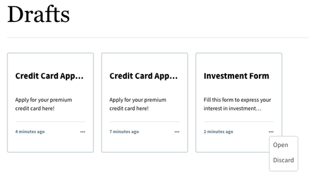
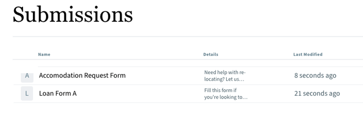

# フォームをドラフトとして保存し、サイトページにリスト表示する

<!--This article provides information about the Auto-save feature, which is currently available as a pre-release feature. The pre-release feature is accessible only through our [pre-release channel](https://experienceleague.adobe.com/ja/docs/experience-manager-cloud-service/content/release-notes/prerelease#new-features).-->

フォームへの入力を開始したものの、一時停止して後から戻る必要があるユーザーを考えてみましょう。 AEMには`save-as-draft` オプションが用意されており、後で入力するためにフォームをドラフトとして保存できます。 これを容易にするために、AEMでは、AEM Sites ページにドラフトと提出物を表示する&#x200B;**ドラフトと提出物** Forms ポータル コンポーネントをすぐに利用できます。 コンポーネントには、後で完了するためにドラフトとして保存されたフォームと、送信されたフォームが一覧表示されます。 下書きを編集したり、送信されたフォームを表示できるのは、ログインしたユーザーのみです。 ただし、匿名ユーザーが&#x200B;**Search &amp; Lister** コンポーネントを使用してフォームのリスト内を移動し、フォームをドラフトとして保存した場合、そのドラフトは&#x200B;**Drafts &amp; Submissions** コンポーネントには表示されません。 ドラフトと送信を表示するには、フォーム送信時にユーザーがログインする必要があります。

## 前提条件

* [&#x200B; ドラフトと送信のAzure StorageおよびUnified Storage ConnectorのForms Portal コンポーネント &#x200B;](#configure-azure-storage-and-unified-storage-connector-for-drafts--submissions-forms-portal-component)の設定

### ドラフトと送信のAzure ストレージと統合ストレージコネクタの設定Forms Portal コンポーネント

**ドラフトと送信** コンポーネントには、AEM Sites ページにドラフトを保存して一覧表示するためのストレージ設定が必要です。 統合ストレージコネクタは、AEMと外部ストレージをリンクするフレームワークを提供します。 フォームをドラフトとして保存するには、Azure ストレージアカウントと、[!DNL Azure] ストレージアカウントへのアクセスを許可するアクセスキーがあることを確認してください。 Azure ストレージアカウントとアクセスキーが用意されたら、次の手順を実行してAzure ストレージ設定を作成します。

1. **[!UICONTROL ツール]**／**[!UICONTROL クラウドサービス]**／**[!UICONTROL Azure ストレージ]**&#x200B;に移動します。

   

1. 設定フォルダーを選択して設定を作成し、**[!UICONTROL 作成]**&#x200B;を選択します。

   

1. 「**[!UICONTROL タイトル]**」フィールドで設定のタイトルを指定します。
1. **[!UICONTROL Azure ストレージアカウント]**&#x200B;および&#x200B;**[!UICONTROL Azure アクセスキー]** フィールドに[!DNL Azure] ストレージアカウントの名前を指定します。

   

   `Azure Storage Account` テキストボックスに`Connection String`、テキストボックスに`Azure Key`と入力します。`Azure Access key`

1. 「**保存**」をクリックします。

   >[!NOTE]
   >
   > **[!UICONTROL Azure ストレージ アカウント]**&#x200B;と&#x200B;**[!UICONTROL Azure アクセス キー]**&#x200B;は、[Microsoft Azure ポータル &#x200B;](https://learn.microsoft.com/en-us/azure/storage/common/storage-account-keys-manage?tabs=azure-portal)から取得できます。

   Azure Storage Configurationを正常に作成したら、次の手順を使用してForms Portal用のUnified Storage Connectorを設定します。

1. **[!UICONTROL ツール]**／**[!UICONTROL Forms]**／**[!UICONTROL 統合ストレージコネクタ]**&#x200B;に移動します。

   

1. 「**[!UICONTROL フォームポータル]**」セクションで、「**[!UICONTROL ストレージ]**」ドロップダウンリストから「**[!UICONTROL Azure]**」を選択します。
1. Azure ストレージ設定の設定パスを「**[!UICONTROL Storage Configuration Path]**」フィールドに指定します。

   

1. 「**[!UICONTROL 保存]**」を選択します。

>[!NOTE]
>
> Azure以外のストレージオプションを設定する必要がある場合は、詳細な要件を記載した公式メールアドレスから<aem-forms-ea@adobe.com>に書き込みます。

ドラフトと送信されたフォームを保存するためのAzure Storage and Unified Storage Connectorが正常に設定されたら、AEM Sites ページに&#x200B;**ドラフトと送信** コンポーネントを追加します。

## ドラフトと送信コンポーネントをAEM Sites ページに追加する方法を教えてください。

すぐに使用できるForms Portal コンポーネントを使用して、Sites ページにドラフトと送信を一覧表示できます。 次の手順を実行して、**ドラフトと送信** ポータル コンポーネントを追加します。

1. AEM Sites ページを&#x200B;**編集**&#x200B;モードで開きます。
1. **[!UICONTROL ページ情報]**／**[!UICONTROL テンプレートを編集]**&#x200B;に移動します。
   

1. **[!UICONTROL ポリシー]**&#x200B;をクリックし、**[AEM アーキタイププロジェクト名] - Forms and Communications Portal**&#x200B;の下の&#x200B;**[!UICONTROL ドラフトと送信]** チェックボックスを選択します。

   

1. 「**[!UICONTROL 完了]**」をクリックします。
1. オーサリングモードでAEM Sites ページを再度開きます。
1. ページエディター内で、フォームポータルコンポーネントを追加できるセクションを見つけます。
1. **追加**&#x200B;アイコンをクリックします。 アイコンはプラス記号（+）で、新しいコンポーネントを追加するオプションを示します。

   **追加**&#x200B;アイコンをクリックすると、**新規コンポーネントを挿入**&#x200B;ダイアログボックスが表示され、挿入する様々なコンポーネントが表示されます。

   >[!NOTE]
   >
   > または、コンポーネントをドラッグ＆ドロップすることもできます。

1. ダイアログボックスで使用可能なコンポーネントを参照し、リストから目的のコンポーネントを選択します。 例えば、リストから&#x200B;**ドラフトと送信** コンポーネントを選択して、**ドラフトと送信** Forms Portal コンポーネントを追加します。

   

次に、要件に従って&#x200B;**ドラフトと送信** コンポーネントのプロパティを設定します。

## ドラフトと送信コンポーネントのプロパティの設定

**ドラフトと送信**&#x200B;のプロパティを設定できます。

1. 「**ドラフトと送信**」コンポーネントを選択します。
1. をクリックすると、ダイアログボックスが表示されます。
1. **[!UICONTROL ドラフトと送信]** ダイアログで、次の項目を指定します。

   * **タイトル** サイトページ内のコンポーネントを識別するために、デフォルトでは、コンポーネントの上にタイトルが表示されます。
   * **種類**&#x200B;を選択：フォームのリストを下書きまたは送信されたフォームとして示します。 「**ドラフトForms**」を選択すると、ドラフトとして保存されたフォームが表示されます。 または、**送信済みForms**&#x200B;を選択すると、ログインユーザーが送信したフォームが表示されます。
   * **レイアウト**: リストのドラフトフォームまたは送信されたフォームをカードまたはリスト形式で表示します。

   

## ドラフトとして保存するフォームの設定

次の2つの方法でアダプティブFormsを設定し、後で使用するためにドラフトとして保存できます。

* [ユーザーアクション](#user-action)
* [自動保存](#auto-save)

### ユーザーアクション

>[!NOTE]
>
> **フォームを保存** ルールを使用してフォームをドラフトとして保存するには、[&#x200B; コアコンポーネントバージョンが3.0.24以降](https://github.com/adobe/aem-core-forms-components)に設定されていることを確認します。

フォームをドラフトとして保存するには、ボタンなどのフォームコンポーネントに&#x200B;**フォームを保存** ルールを作成します。 ボタンをクリックすると、ルールがトリガーされ、フォームがドラフトとして保存されます。 次の手順を実行して、ボタンコンポーネントに&#x200B;**フォームを保存** ルールを作成します。

1. アダプティブフォームを編集モードで開きます。
1. 「**[!UICONTROL ルールを編集]**」アイコンを選択して、**ボタン** コンポーネントのルールエディターを開きます。
1. 「**[!UICONTROL 作成]**」を選択して、ボタンのルールを設定および作成します。
1. **[!UICONTROL When]** セクションで「**is click**」を選択し、**[!UICONTROL Then]** セクションで「**フォームを保存**」オプションを選択します。
1. 「**[!UICONTROL 完了]**」を選択し、ルールを保存します。

   

アダプティブフォームをプレビューして入力し、「**フォームを保存**」ボタンをクリックすると、フォームはドラフトとして保存されます。

### ドラフト

>[!NOTE]
>
> 自動保存機能を使用してフォームをドラフトとして保存するには、[&#x200B; コアコンポーネントバージョンが3.0.52以降](https://github.com/adobe/aem-core-forms-components)に設定されていることを確認します。

時間ベースのイベントに基づいて自動的に保存するようにアダプティブフォームを設定して、指定した期間が経過した後にフォームを保存することもできます。 環境で[Forms Portal コンポーネントを有効にすると](/help/forms/list-forms-on-sites-page.md#enable-forms-portal-components-for-your-existing-environment)、**自動保存** タブがForms コンテナプロパティに表示されます。 アダプティブフォームの自動保存機能を設定できます。

1. オーサーインスタンスで、アダプティブフォームを編集モードで開きます。
1. コンテンツブラウザーを開き、アダプティブフォームの&#x200B;**[!UICONTROL ガイドコンテナ]**&#x200B;コンポーネントを選択します。
1. ガイドコンテナのプロパティ  アイコンをクリックし、**[!UICONTROL ドラフト]** タブを開きます。

   

1. 「**[!UICONTROL ドラフトを自動保存]**」チェックボックスを選択して、フォームをドラフトとして自動保存できるようにします。
1. **環境設定を**&#x200B;定期的な間隔でドラフトを保存&#x200B;**するように設定し、特定の間隔が経過した後にフォーム <!--based on the occurrence of an event or-->を自動保存します。&rbrack;**
1. **[!UICONTROL 保存間隔の頻度（秒）]**&#x200B;で時間間隔を指定して、定義された間隔でフォームの自動保存をトリガーする期間を設定します。
1. 「**[!UICONTROL 完了]**」をクリックします。

## ドラフトと送信コンポーネントを使用して、Sites ページでドラフト/送信されたフォームを表示する

保存されたドラフトまたは送信されたフォームを表示するには、**ドラフトと送信** Forms Portal コンポーネントを使用します。
ドラフトと送信コンポーネント [&#128279;](#configure-properties-of-the-drafts--submissions-component)の設定ダイアログで「**[!UICONTROL タイプを選択]**」が&#x200B;**ドラフトForms**&#x200B;として選択されると、ドラフトとして保存されたフォームがサイトページに表示されます。省略記号（。..）をクリックしてフォームに入力すると、ドラフトを開くことができます。

ドラフトと送信コンポーネント [&#128279;](#configure-properties-of-the-drafts--submissions-component)の設定ダイアログで「**[!UICONTROL タイプを選択]**」が&#x200B;**送信されたForms**&#x200B;として選択されると、送信されたフォームが表示されます。 送信されたフォームは表示できますが、編集することはできません。

省略記号（。..）をクリックして、フォームを破棄することもできます 右下隅に表示されます。

## 次の手順

次の記事では、[Forms ポータルのリンク コンポーネント &#x200B;](/help/forms/add-form-link-to-aem-sites-page.md)を使用して、Sites ページでフォームへの参照を追加する方法について説明します。

## 関連記事

{{forms-portal-see-also}}

## 関連トピック {#see-also}

{{see-also}}
