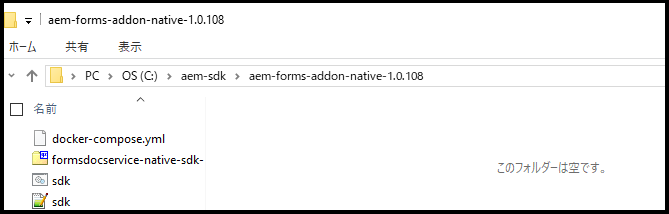

# AEM Forms 用のローカル開発環境を設定 {#overview}

[!DNL  Adobe Experience Manager Forms] as a [!DNL  Cloud Service] 環境を設定する場合は、開発環境、ステージング環境および本番環境をクラウドに設定します。また、ローカル開発環境を設定および構成することもできます。

ローカル開発環境を使用すると、クラウド開発環境にログインせずに次の操作を実行できます。

* [フォームの作成](creating-adaptive-form.md)および関連アセット（テーマ、テンプレート、カスタム送信アクションなど）の作成
* [PDF forms のアダプティブフォームへの変換](https://experienceleague.adobe.com/docs/aem-forms-automated-conversion-service/using/convert-existing-forms-to-adaptive-forms.html?lang=ja)
* オンデマンドまたはバッチモードで[カスタマーコミュニケーション](aem-forms-cloud-service-communications-introduction.md)を生成するアプリケーションの構築

アダプティブフォームまたは関連アセットがローカル開発インスタンスまたはアプリケーションで[カスタマーコミュニケーション]を生成する準備が整ったら、アダプティブフォームまたはカスタマーコミュニケーションアプリケーションをローカル開発環境から Cloud Service 環境にエクスポートして、さらにテストを実施したり、本番環境に移行したりできます。

また、カスタムコンポーネントや事前入力サービスなどのカスタムコードを、ローカル開発環境上で開発し、テストすることもできます。カスタムコードがテストされ、準備が整ったら、Cloud Service 開発環境の Git リポジトリーを使用して、カスタムコードをデプロイできます。

新しいローカル開発環境を設定し、それを使用してアクティビティ向けに開発するには、以下の操作をリストに記載された順序で実行します。

* [開発ツールの設定](#setup-development-tools-for-AEM-projects)

* [ローカルのオーサーインスタンスとパブリッシュインスタンスの設定](#set-up-local-experience-manager-environment-for-development)

* [ローカル開発インスタンスへの Forms アーカイブの追加とユーザーの設定](#add-forms-archive-configure-users)

* [microservices 用のローカル開発環境の設定](#docker-microservices)

* [開発プロジェクトの設定](#forms-cloud-service-local-development-environment)

* [ローカル Dispatcher ツールの設定](#setup-local-dispatcher-tools)

<!--
You can use the local development environment to create and test Adaptive Forms without connecting to the Cloud Service. [!DNL AEM Forms] provides an SDK to help test all the cloud-ready functionalities on the local development environment. When your forms and related assets are ready and tested on the local development environment, you can import these forms and related assets to an [!DNL AEM Forms] as a Cloud Service instance for publishing. 

You can also develop and test custom code like custom components and prefill service on the local development environment. When the custom code is tested and ready, you can use the Git repository of your [!DNL AEM Forms] as a Cloud Service development environment to deploy the custom code. 

>[!NOTE]
>
> Pre-pilot release does not support using an [!DNL AEM Forms] as a Cloud Service development instance to create forms. You can create forms, related assets, and custom code only on a local development environment.-->

<!--
You configure two types of development environments:

* **[!DNL AEM Forms] as a Cloud Service development environment:** Use the [[!DNL AEM Forms] as a Cloud Service](setup-forms-cloud-service.md) environment to store, manage, and publish Adaptive Forms and related assets. Do not use an [!DNL AEM Forms] as a Cloud Service environment to create Adaptive Forms and related assets <!--, form-centric workflows, a form data model, or to generate a Document of Record. -->

<!--
* **Local development environment:** You can use the local development environment to create and test Adaptive Forms without connecting to the service. Adobe provides a SDK for the local development to help test all the cloud-ready functionalities. 
Use a local development environment:
    
    * To create forms and related assets (themes, templates, custom Submit Actions, and more) and convert PDF forms to Adaptive Forms. After an Adaptive Form or related assets are ready on the local development instance, you can export the Adaptive Form and related assets from the local development environment to an [!DNL AEM Forms] as a Cloud Service development environment for publishing.  
    
    * To update configuration settings and develop and test custom code like custom components and prefill service. When the custom code is tested and ready, you can use the Git repository of your [!DNL AEM Forms] as a Cloud Service development environment to deploy the custom code.  

You can use the local development environment to create and test Adaptive Forms without connecting to the service. Adobe provides a SDK for the local development to help test all the cloud-ready functionalities. When your forms and related assets are ready and tested on the local development environment, you can import these forms and related assets to an [!DNL AEM Forms] as a Cloud Service instance for publishing. 

You can use the [development tools](https://experienceleague.adobe.com/docs/experience-manager-65/developing/devtools/dev-tools.html?lang=ja) to write custom code, customize or create new Adaptive Forms components, create a custom prefill service, or modify default configurations of an [!DNL AEM Forms] as a Cloud Service instance. 

-->

## 前提条件

ローカル開発環境を設定するには、以下のソフトウェアが必要です。ローカル開発環境の設定を開始する前に、以下をダウンロードしてください。

| ソフトウェア | 説明 | ダウンロードリンク |
|---|---|---|
| Adobe Experience Manager as a Cloud Service SDK | SDK には、[!DNL Adobe Experience Manager] QuickStart ツールと Dispatcher ツールが含まれています | [ソフトウェア配布](#software-distribution)から最新の SDK をダウンロード |
| Adobe Experience Manager Forms 機能アーカイブ（AEM Forms アドオン） | アダプティブフォームおよびその他の Adobe Experience Manager Forms 機能を作成、スタイル設定、最適化するためのツール | [ソフトウェア配布](#software-distribution)からダウンロード |
| （オプション）Adobe Experience Manager Forms 参照コンテンツ | アダプティブフォームおよびその他の Adobe Experience Manager Forms 機能を作成、スタイル設定、最適化するためのツール | [ソフトウェア配布](#software-distribution)からダウンロード |
| （オプション）Adobe Experience Manager Forms Designer | アダプティブフォームおよびその他の Adobe Experience Manager Forms 機能を作成、スタイル設定、最適化するためのツール | [ソフトウェア配布](#software-distribution)からダウンロード |

### ソフトウェア配布から最新バージョンのソフトウェアをダウンロード {#software-distribution}

最新バージョンの Adobe Experience Manager as a Cloud Service SDK、Experience Manager Forms 機能アーカイブ（AEM Forms アドオン）、Forms 参照アセット、Forms Designer を[ソフトウェア配布](https://experience.adobe.com/#/downloads/content/software-distribution/jp/aemcloud.html)からダウンロードするには：

1. Adobe ID を使用して、<https://experience.adobe.com/#/downloads> にログイン

   >[!NOTE]
   >
   > AEM as a Cloud Service SDK をダウンロードするには、アドビ組織が AEM as a Cloud Service に対してプロビジョニングされている必要があります。

1. 「**[!UICONTROL AEM as a Cloud Service]**」タブに移動します。
1. 公開日を降順で並べ替えます。
1. 最新の Adobe Experience Manager as a Cloud Service SDK、Experience Manager Forms 機能アーカイブ（AEM Forms アドオン）、Forms 参照アアセット、Forms Designer をクリックします。

   >[!NOTE]
   >
   > Adobe Experience Manager as a Cloud Service SDK とシームレスに互換性を持たせるには、最新バージョンの Experience Manager Forms 機能アーカイブ（AEM Forms アドオン）、フォーム参照アセット、Forms Designer をダウンロードすることをお勧めします。

1. ソフトウェア利用許諾契約を確認し、同意します。「**[!UICONTROL ダウンロード]**」ボタンを選択します。

## AEM プロジェクト用の開発ツールの設定 {#setup-development-tools-for-AEM-projects}

Adobe Experience Manager Forms プロジェクトはカスタムコードベースです。Cloud Manager を介して [!DNL Adobe Experience Manager] as a Cloud Service にデプロイされるコード、設定およびコンテンツが含まれます。[AEM プロジェクトの Maven アーキタイプ](https://github.com/adobe/aem-project-archetype)は、プロジェクトのベースライン構造を提供します。

[!DNL Adobe Experience Manager] プロジェクトに使用する以下の開発ツールを設定します。

* [Java™](https://experienceleague.adobe.com/docs/experience-manager-learn/cloud-service/local-development-environment-set-up/development-tools.html?lang=ja#local-development-environment-set-up)
* [Git](https://experienceleague.adobe.com/docs/experience-manager-learn/cloud-service/local-development-environment-set-up/development-tools.html?lang=ja#install-git)
* [Node.js（npm）](https://experienceleague.adobe.com/docs/experience-manager-learn/cloud-service/local-development-environment-set-up/development-tools.html?lang=ja#node-js)
* [Maven](https://experienceleague.adobe.com/docs/experience-manager-learn/cloud-service/local-development-environment-set-up/development-tools.html?lang=ja#install-maven)

開発ツールを設定する詳しい手順については、「[開発ツールの設定](https://experienceleague.adobe.com/docs/experience-manager-learn/cloud-service/local-development-environment-set-up/development-tools.html?lang=ja)」を参照してください。

## 開発用のローカル Experience Manager 環境の設定

Cloud Service SDK は、QuickStart ファイルを提供します。Experience Manager のローカルバージョンを実行します。オーサーインスタンスまたはパブリッシュインスタンスはローカルで実行できます。

QuickStart はローカル開発経験を提供しますが、[!DNL Adobe Experience Manager] as a Cloud Service で利用できるすべての機能を備えているわけではありません。そのため、機能をステージングまたは実稼動に移す前に、常に [!DNL Adobe Experience Manager] as a Cloud Service 開発環境を使用して機能とコードをテストしてください。

ローカル Experience Manager 環境をインストールおよび設定するには、以下の手順を実行します。

* [!DNL Adobe Experience Manager] as a Cloud Service SDK を[ダウンロードおよび抽出する](https://experience.adobe.com/#/downloads/content/software-distribution/jp/aemcloud.html)
* [オーサーインスタンスを設定する](https://experienceleague.adobe.com/docs/experience-manager-learn/cloud-service/local-development-environment-set-up/aem-runtime.html?lang=ja#set-up-local-aem-author-service)
* [パブリッシュインスタンスを設定する](https://experienceleague.adobe.com/docs/experience-manager-learn/cloud-service/local-development-environment-set-up/aem-runtime.html?lang=ja#set-up-local-aem-publish-service)

## ローカルのオーサーおよびパブリッシュインスタンスへの Forms アーカイブの追加と Forms 専用のユーザーの設定 {#add-forms-archive-configure-users}

リストに記載された順序で以下の手順を実行して、Forms アーカイブを Experience Manager インスタンスに追加し、Forms 専用のユーザーを設定します。

### 最新の Forms アドオン機能アーカイブのインストール {#add-forms-archive}

Adobe Experience Manager Forms as a Cloud Service 機能アーカイブは、ローカル開発環境でアダプティブフォームを作成、スタイル設定、最適化するためのツールを提供します。パッケージをインストールしてアダプティブフォームを作成し、[!DNL AEM Forms] のその他の様々な機能を使用します。パッケージをインストールするには、以下を実行します。

1. [ソフトウェア配布](https://experience.adobe.com/#/downloads/content/software-distribution/jp/aemcloud.html)から、お使いのオペレーティングシステム用の最新の [!DNL AEM Forms] アーカイブをダウンロードして抽出します。

1. crx-quickstart/install ディレクトリに移動します。フォルダーが存在しない場合は作成します。

1. AEM インスタンスを停止し、[!DNL AEM Forms] アドオン機能アーカイブ `aem-forms-addon-<version>.far` をインストールフォルダーに配置します。
1. アクティブなコマンドウィンドウに移動し、`Ctrl + C` キーコマンドを押して SDK を再起動します。

   >[!NOTE]
   >
   > SDK を再起動するには、「Ctrl + C」コマンドを使用することをお勧めします。Java プロセスの停止など、別の方法を使用して AEM SDK を再起動すると、AEM 開発環境で不整合が生じる場合があります。

<!--**Q**: I've set up a Aem as a Cloud Service environment and added the Forms Add-On for a project. After the .far file addition, the bundles are not in the active state and are in installed state only due to the missing dependencies. How to make the bundles in the active state?
**A**: To resolve the issue:
1. Start the AEM and wait for it to start completely (all bundles up)
1. Stop aem (ctrl + c). Place the forms far in the install folder.
1. Restart AEM.-->


### ユーザーと権限の設定 {#configure-users-and-permissions}

フォーム開発者やフォーム担当者などのユーザーを作成し、[これらのユーザーを事前定義されたフォームグループに追加](https://experienceleague.adobe.com/docs/experience-manager-learn/cloud-service/accessing/aem-users-groups-and-permissions.html?lang=ja#accessing)して、必要な権限を与えます。以下の表に、フォームユーザーのタイプごとに、すべてのタイプのユーザーと事前定義済みのグループを示します。

| ユーザータイプ | AEM グループ |
|---|---|
| フォーム担当者／ | [!DNL forms-users]（AEM Forms ユーザー）、[!DNL template-authors]、[!DNL workflow-users]、[!DNL workflow-editors]、[!DNL fdm-authors] |
| フォーム開発者 | [!DNL forms-users]（AEM Forms ユーザー）、[!DNL template-authors]、[!DNL workflow-users]、[!DNL workflow-editors]、[!DNL fdm-authors] |
| カスタマーエクスペリエンスリードまたは UX デザイナー | [!DNL forms-users]、[!DNL template-authors] |
| AEM 管理者 | [!DNL aem-administrators]、[!DNL fd-administrators] |
| エンドユーザー | ユーザーがアダプティブフォームを表示および送信するためにログインする必要がある場合は、そのユーザーを [!DNL forms-users] グループに追加します。</br>アダプティブフォームへのアクセスにユーザー認証が必要ない場合は、グループを割り当てません。 |

<!--  

## Set up a local AEM instance for development

Perform the following steps in the listed order to set up and configure your local development environment:

1. **Set up an AEM author instance:** You require an author instance to create Adaptive Forms. Download and extract the latest AEM SDK archive. Run the quick start file in author run mode to set up an author instance. For detailed instructions, see [default local instance](https://experienceleague.adobe.com/docs/experience-manager-learn/cloud-service/local-development-environment-set-up/aem-runtime.html?lang=ja).  

1. **Install the latest [!DNL AEM Forms] add-on feature archive:** [!DNL AEM Forms] add-on feature archive provides tools to create, style, and optimize Adaptive Forms on the local development environment. Install the package to create an Adaptive Form and use various other features of [!DNL AEM Forms]. To install the package:

    1. Download and extract the latest [!DNL AEM Forms] archive for your operating system from [Software Distribution](https://experience.adobe.com/#/downloads/content/software-distribution/en/aemcloud.html).

    1. Navigate to the crx-quickstart/install directory. If the folder does not exist, create it.

    1. Stop your Cloud ready AEM instance, place the [!DNL AEM Forms] add-on feature archive, `aem-forms-addon-<version>.far`,  in the install folder, and restart the instance.

1. **Configure users and permissions:** Create users like Form Developer and Form Practitioner a nd add these users to pre-defined forms group to provide them required permissions. The table below lists all types of users and pre-defined groups for each type of forms users:
  
    | User Type | AEM Group |
    |---|---|
    | Form Practitioner  | forms-users (AEM Forms Users), template-authors  |
    | Form Developer | forms-users (AEM Forms Users), template-authors |
    | End-User| everyone* |

    `*` When a user should log in to access or submit Adaptive Forms, add such users to the everyone group.  -->

<!--    
### Set up an AEM project for the development tasks related to local AEM 6.5.5 Forms instance

Use this project to update configurations, create overlays, develop custom Adaptive Form components, and custom code using the local development environment. To set up the project:

1. **Install and configure Maven and set up an AEM project based on Apache Maven:** Apache Maven is an open-source tool for managing software projects. It helps automate builds and provides quality project information. It is the recommended build management tool for AEM projects. For detailed instructions to set up an AEM project based on Apache Maven, see [How to Build AEM Projects using Apache Maven](https://experienceleague.adobe.com/docs/experience-manager-65/developing/devtools/ht-projects-maven.html?lang=ja).

1. Configure the project to use [uber-jar](https://experienceleague.adobe.com/docs/experience-manager-65/release-notes/release-notes.html?lang=ja#install-aem-forms-jee-installer) version 6.5.5 or later and [[!DNL AEM Forms] Client SDK](https://repo1.maven.org/maven2/com/adobe/aemfd/aemfd-client-sdk/) version 6.0.160 or later.  

1. **Set Up an Integrated Development Environment:**  Set up an IDE of your choice for development, see [Set Up an Integrated Development Environment](https://experienceleague.adobe.com/docs/experience-manager-learn/foundation/development/set-up-a-local-aem-development-environment.html?lang=ja#set-up-an-integrated-development-environment) for detailed instructions.
 -->

## レコードのドキュメント用のローカル開発環境の設定（DoR）{#docker-microservices}

AEM Forms as a Cloud Services は、レコードのドキュメントの開発を容易にし、その他の microservices を使用するための、Docker ベースの SDK 環境を提供します。これにより、プラットフォーム固有のバイナリやアダプテーションを手動で設定する必要がなくなります。環境を設定するには：

1. Docker のインストールおよび設定：

   * （Microsoft® Windows の場合）[Docker Desktop](https://www.docker.com/products/docker-desktop) をインストールします。お使いのマシン上で `Docker Engine` と `docker-compose` が設定されます。

   * （Apple macOS の場合）[Docker Desktop for Mac](https://hub.docker.com/editions/community/docker-ce-desktop-mac) をインストールします。これには、Docker Engine、Docker CLI クライアント、Docker Compose、Docker Content Trust、Kubernetes、Credential Helper が含まれています。

   * （Linux® の場合）[Docker Engine](https://docs.docker.com/engine/install/#server) と [Docker Compose](https://docs.docker.com/compose/install/) をお使いのマシンにインストールします。

   >[!NOTE]
   >
   > * Apple macOS の場合は、ローカルの AEM オーサーインスタンスを格納したフォルダーを許可リストに加えます。
   >
   > * Windows 用 Docker Desktop は、Hyper-V
   > （レガシー）と WSL2（最新）という 2 つのバックエンドをサポートします。ファイル共有は、WSL2（最新）を使用する場合、
   > 自動的に Docker によって管理されます。Hyper-V（レガシー）を
   > 使用している間に、ファイル共有を明示的に構成します。

1. オーサーインスタンスとパブリッシュインスタンスに並行して、aem-sdk などのフォルダーを作成します。例：C:\aem-sdk

1. `aem-forms-addon-<version>.zip\aem-forms-addon-native-<version>.zip` ファイルを解凍します。

   

1. 環境変数 AEM_HOME を作成し、AEM オーサーのローカルのインストール先を指定します。例：C:\aem\author\

1. sdk.bat または sdk.sh を開いて編集します。AEM_HOME に、AEM オーサーのローカルのインストール先を設定します。例：C:\aem\author\

1. コマンドプロンプトを開き、`aem-forms-addon-native-<version>` フォルダーに移動します。

1. ローカルの AEM オーサーインスタンスが稼働中であることを確認します。次のコマンドを実行して SDK を起動します。

   * Microsoft® Windows

     ```shell
     sdk.bat start
     ```


   * Linux® または Apple macOS

     ```Shell
     % export AEM_HOME=[local AEM Author installation]
     % ./sdk.sh start
     ```


   >[!NOTE]
   >
   > sdk.sh ファイルに環境変数を定義してある場合、コマンドラインでは環境変数の指定を省略できます。環境変数をコマンドラインで定義するオプションは、シェルスクリプトを更新せずにコマンドを実行するために用意されています。

   

これで、ローカル開発環境を使用して、レコードのドキュメントをレンダリングできるようになりました。テストするには、XDP ファイルをお使いの環境にアップロードしてレンダリングします。例：<http://localhost:4502/libs/xfaforms/profiles/default.print.pdf?template=crx:///content/dam/formsanddocuments/cheque-request.xdp> は XDP ファイルを PDF 文書に変換します。

## Experience Manager アーキタイプに基づいた Forms の開発プロジェクトの設定 {#forms-cloud-service-local-development-environment}

このプロジェクトを使用して、アダプティブフォームの作成、設定の更新、オーバーレイのデプロイ、カスタムアダプティブフォームコンポーネントの作成、テスト、ローカル [!DNL Experience Manager Forms] SDK へのカスタムコードの導入を行います。ローカルでテストした後、プロジェクトを [!DNL Experience Manager Forms] as a Cloud Service の本番環境および非本番環境にデプロイできます。プロジェクトをデプロイすると、次の AEM Forms アセットもデプロイされます。

| テーマ | テンプレート | フォームデータモデル（FDM） |
|---------|----------|---------|
| Canvas 3.0 | 基本 | Microsoft® Dynamics 365 |
| Tranquil | 空白 | Salesforce |
| Urbane |   |  |
| Ultramarine |  |  |
| Beryl |  |  |

>[!NOTE]
>
> AEM Forms as a Cloud Service で Microsoft® Dynamics 365 および Salesforce フォームデータモデル（FDM）を取得して使用するには、AEM アーキタイプバージョン 30 以降に基づくプロジェクトを設定します。
> Tranquil、Urbane、Ultramarine テーマを AEM Forms as a Cloud Service で取得および使用するには、AEM アーキタイプバージョン 32 以降に基づくプロジェクトをセットアップします。

プロジェクトを設定するには、以下を実行します。

1. **ローカル開発インスタンス上に Cloud Manager Git リポジトリーを複製する：** Cloud Manager Git リポジトリーには、デフォルトの AEM プロジェクトが含まれています。[AEM アーキタイプ](https://github.com/adobe/aem-project-archetype/)に基づいています。Cloud Manager UI のセルフサービス Git アカウント管理を使用して Cloud Manager Git リポジトリーを複製し、プロジェクトをローカル開発環境に移行します。リポジトリーへのアクセスについて詳しくは、[リポジトリーへのアクセス](https://experienceleague.adobe.com/docs/experience-manager-cloud-manager/using/managing-code/accessing-repos.html?lang=ja)を参照してください。

<!-- 1. 
After the repository is cloned, [integrate your Git repo with Cloud Manager](https://experienceleague.adobe.com/docs/experience-manager-cloud-manager/using/managing-code/setup-cloud-manager-git-integration.html?lang=ja)

**Make cloned AEM project compatible with [!DNL AEM Forms] as a Cloud Service:** Remove uber-jar and other non-cloud dependencies from the pom.xml files of the project. You can refer the pom.xml files of the [sample AEM project](assets/FaaCSample.zip) for the list of required dependencies and update your AEM project accordingly. You can also refer [AEM Project Structure](https://experienceleague.adobe.com/docs/experience-manager-cloud-service/content/implementing/developing/aem-project-content-package-structure.html?lang=ja) to learn changes required to make an AEM project compatible with AEM as a Cloud Service.  -->

1. **[!DNL Experience Manager Forms] as a [Cloud Service] プロジェクトの作成：**&#x200B;最新の [AEM アーキタイプ](https://github.com/adobe/aem-project-archetype)以降に基づいて [!DNL Experience Manager Forms] as a [Cloud Service] プロジェクトを作成します。このアーキタイプは、開発者が [!DNL AEM Forms] as a Cloud Service の開発を容易に開始するのに役立ちます。また、すぐに使い始めるのに役立つテーマとテンプレートのサンプルも含まれています。

   コマンドプロンプトを開き、以下のコマンドを実行して [!DNL Experience Manager Forms] as a Cloud Service プロジェクトを作成します。

   ```shell
   mvn -B org.apache.maven.plugins:maven-archetype-plugin:3.2.1:generate -D archetypeGroupId=com.adobe.aem -D archetypeArtifactId=aem-project-archetype -D archetypeVersion="41" -D appTitle=mysite -D appId=mysite -D groupId=com.mysite -D includeFormsenrollment="y" -D aemVersion="cloud"
   ```

   上記のコマンドで `appTitle`、`appId`、`groupId` を変更し、環境に反映します。また、ライセンスと要件に応じて、includeFormsenrollment、includeFormscommunications および includeFormsheadless の値を `y` または `n` に設定します。コアコンポーネントに基づくアダプティブフォームの作成には、includeFormsheadless が必須です。

   * `includeFormsenrollment=y` オプションを使用して、アダプティブフォームの作成に必要なフォーム固有の設定、テーマ、テンプレート、コアコンポーネントおよび依存関係を含めます。フォームポータルを使用している場合、`includeExamples=y` オプションを設定します。また、フォームポータルのコアコンポーネントをプロジェクトに追加します。

   * `includeFormscommunications=y` オプションを使用して、Forms コアコンポーネントとカスタマーコミュニケーション機能を含めるために必要な依存関係を含めます。

     >[!WARNING]
     >
     >* バージョン 45 でアーキタイププロジェクトを作成する場合、[AEM アーキタイププロジェクトフォルダー]/pom.xml では、最初にフォームコアコンポーネントのバージョンを 2.0.64 に設定します。アーキタイププロジェクトを構築またはデプロイする前に、フォームコアコンポーネントのバージョンを 2.0.62 に更新します。

1. プロジェクトをローカル開発環境にデプロイします。以下のコマンドを使用して、ローカル開発環境にデプロイできます

   `mvn -PautoInstallPackage clean install`

   コマンドの完全なリストについては、 [構築とインストール](https://experienceleague.adobe.com/docs/experience-manager-core-components/using/developing/archetype/using.html?lang=ja#building-and-installing) を参照してください

1. [ [!DNL AEM Forms]  as a Cloud Service 環境にコードをデプロイします](https://experienceleague.adobe.com/docs/experience-manager-cloud-service/implementing/deploying/overview.html?lang=ja#customer-releases)。

## ローカル Dispatcher ツールの設定 {#setup-local-dispatcher-tools}

Dispatcher は、CDN と AEM パブリッシュ層の間にセキュリティとパフォーマンスのレイヤーを提供する Apache HTTP Web サーバーモジュールです。Dispatcher は、Experience Manager アーキテクチャ全体に不可欠な要素であり、ローカル開発環境の一部にする必要があります。

以下の手順を実行してローカル Dispatcher を設定し、それに Forms 専用のルールを追加します。

### ローカル Dispatcher の設定 {#setup-local-dispatcher}

[!DNL Experience Manager] as a Cloud Service SDK には、推奨される Dispatcher ツールのバージョンが含まれており、これにより、Dispatcher をローカルで設定、検証、シミュレーションできます。Dispatcher ツールは Docker ベースで、Apache HTTP Web サーバーおよび Dispatcher 設定ファイルを互換性のある形式に変換し、Docker コンテナで実行される Dispatcher にデプロイするコマンドラインツールを提供します。

Dispatcher 上のキャッシュを使用すると、[!DNL AEM Forms] は、アダプティブフォームをクライアントで事前入力できます。キャッシュにより、事前入力されたフォームのレンダリング速度が向上します。

Dispatcher を設定する詳細な手順については、「[ローカル Dispatcher ツールの設定](https://experienceleague.adobe.com/docs/experience-manager-learn/cloud-service/local-development-environment-set-up/dispatcher-tools.html?lang=ja#local-development-environment-set-up)」を参照してください。

### Dispatcher への Forms 専用のルールの追加 {#forms-specific-rules-to-dispatcher}

以下の手順を実行して、Experience Manager Forms as a Cloud Service の Dispatcher キャッシュを設定します。

1. AEM プロジェクトを開き、`\src\conf.dispatcher.d\available_farms` に移動します
1. `default.farm` ファイルのコピーを作成します（例：`forms.farm`）。
1. 作成した `forms.farm` ファイルを開いて編集し、以下のコードを置き換えます。

   ```json
   #/ignoreUrlParams {
   #/0001 { /glob "*" /type "deny" }
   #/0002 { /glob "q" /type "allow" }
   #}
   ```

   以下に置き換えます。

   ```json
   /ignoreUrlParams {
   /0001 { /glob "*" /type "deny" }
   /0002 { /glob "dataRef" /type "allow" }
   }
   ```

1. ファイルを保存して閉じます。
1. `conf.d/enabled_farms` に移動し、`forms.farm` ファイルへのシンボリックリンクを作成します。
1. プロジェクトをコンパイルし、[!DNL AEM Forms] as a Cloud Service 環境にデプロイします。

### キャッシュに関する考慮事項 {#considerations-about-caching}

* Dispatcher のキャッシュを使用すると、[!DNL AEM Forms] は、アダプティブフォームをクライアントで事前入力できます。キャッシュにより、事前入力されたフォームのレンダリング速度が向上します。
* セキュリティで保護されたコンテンツのキャッシュ機能は、デフォルトで無効になっています。この機能を有効にするには、「[セキュリティで保護されたコンテンツのキャッシュ](https://experienceleague.adobe.com/docs/experience-manager-dispatcher/using/configuring/permissions-cache.html?lang=ja)」の記事に記載されている手順を実行します
* Dispatcher は、アダプティブフォームと関連するアダプティブフォームの一部を無効にできない場合があります。このような問題を解決するには、トラブルシューティングの節の [[!DNL AEM Forms] キャッシュ](troubleshooting-caching-performance.md) を参照してください。
* ローカライズされたアダプティブフォームのキャッシュ：
   * `http://host:port/content/forms/af/afName.html?afAcceptLang=<locale>` の代わりに `http://host:port/content/forms/af/<afName>.<locale>.html` の URL 形式を使用して、アダプティブフォームのローカライズ版をリクエストします。
   * 「ブラウザーロケール」オプションは、デフォルトで無効になっています。ブラウザーロケール設定を変更するには
* URL 形式 `http://host:port/content/forms/af/<adaptivefName>.html` を使用し、設定マネージャーで「ブラウザーロケールを使用」が無効になっている場合、アダプティブフォームの非ローカライズ版が提供されます。非ローカライズ言語とは、アダプティブフォームの開発時に使用される言語です。ブラウザーに設定されているロケール（ブラウザーロケール）は考慮されず、アダプティブフォームの非ローカライズ版が提供されます。
* URL 形式 `http://host:port/content/forms/af/<adaptivefName>.html` を使用し、設定マネージャーで「ブラウザーロケールを使用」が有効になっている場合、アダプティブフォームのローカライズ版が提供されます（利用可能な場合）。ローカライズされたアダプティブフォームの言語は、ブラウザーに設定されたロケール（ブラウザーロケール）に基づきます。これは、[アダプティブフォームの最初のインスタンスのみがキャッシュされる]原因になる可能性があります。インスタンスで問題が発生しないようにするには、トラブルシューティングの節の「[アダプティブフォームの最初のインスタンスのみがキャッシュされる](troubleshooting-caching-performance.md)」を参照してください。

ローカル開発環境の準備が整いました。

## AEM Forms as a Cloud Service およびローカル開発環境で、アダプティブフォームのコアコンポーネントを有効にする

AEM Forms as a Cloud Service のアダプティブフォームのコアコンポーネントを有効にすると、AEM Forms Cloud Service インスタンスを使用して、複数のチャネルへのコアコンポーネントベースのアダプティブフォームとヘッドレスフォームの作成、公開、配信を開始できます。ヘッドレスアダプティブフォームを使用するには、アダプティブフォームコアコンポーネントが有効な環境が必要です。

>[!NOTE]
>
> お使いの AEM Cloud Service 環境でアダプティブフォームコアコンポーネントを有効にするには、最新版をインストールします。

## ローカル開発環境のアップグレード {#upgrade-your-local-development-environment}

SDK を新しいバージョンにアップグレードするには、ローカルの開発環境全体を置き換える必要があり、その結果、ローカルリポジトリー内のコード、設定およびコンテンツがすべて失われます。確実に、破棄すべきでないコード、設定またはコンテンツが Git に安全にコミットされるか、ローカル Experience Manager インスタンスから CRX パッケージとして書き出されるようにします。

### SDK のアップグレード時にコンテンツの損失を防ぐ方法 {#avoid-content-loss-when-upgrading--SDK}

SDK をアップグレードすると、新しいリポジトリー（[AEM プロジェクトの設定](#forms-cloud-service-local-development-environment)）を含む、まったく新しいオーサーインスタンスとパブリッシュインスタンスが効果的に作成され、以前の SDK のリポジトリーに対する変更はすべて失われます。SDK のアップグレード間でコンテンツを継続的に保持する方法については、「[AEM SDK のアップグレード時にコンテンツの損失を回避する方法](https://experienceleague.adobe.com/docs/experience-manager-learn/cloud-service/local-development-environment-set-up/aem-runtime.html?lang=ja#optional-local-aem-runtime-set-up-tasks)」を参照してください。

<!--When you update any  Forms-specifc configuration, create overlays, develop custom Adaptive Form components, or develop and test any custom code in AEM project for the development tasks related to local development instance, use the AEM project cloned from the Cloud Manager Git repository to [deploy the custom code and other changes to your [!DNL AEM Forms] as a Cloud Service's production or non-production environment](https://video.tv.adobe.com/v/34668?captions=jpn&quality=9).

## Upgrade your local development environment {#update-local-setup}

Update the local AEM setup (AEM SDK) to latest version at least monthly on, or shortly after, the last Thursday of each month, which is the release cadence for AEM as a Cloud Service "feature releases". You can download local AEM SDK from [Software Distribution](https://experience.adobe.com/#/downloads/content/software-distribution/en/aemcloud.html).

Updating the AEM SDK to a new version requires replacing the entire local development environment, resulting in a loss of all code, configuration and content in the local AEM repositories. Ensure that any code, config or content that should not be destroyed is safely committed to Git, or exported from the local AEM instance as AEM Packages.

### How to avoid content loss when upgrading the AEM SDK {#avoid-content-loss-when-upgrading--AEM-SDK}

Upgrading the AEM SDK is effectively creating a brand new AEM runtime ([Set up a local AEM instance](setup-forms-cloud-service.md)), including a new repository ([Set up AEM project](#forms-cloud-service-local-development-environment)), meaning any changes made to a prior AEM SDK's repository are lost. The following are viable strategies for aiding in persisting content between AEM SDK upgrades, and can be used discretely or in concert:

1. Create a content package dedicated to containing the sample content to aid in development and maintain it in Git. Any content that should be persisted through AEM SDK upgrades would be persisted into this package and re-deployed after upgrading the AEM SDK.
1. Use [oak-upgrade](https://jackrabbit.apache.org/oak/docs/migration.html) with the `includepaths` directive, to copy content from the prior AEM SDK repository to the new AEM SDK repository.
1. Back up any content using AEM Package Manager and content packages on the prior AEM SDK and re-install them on the new AEM SDK.

Remember, using the above approaches to maintain code between AEM SDK upgrades, indicates a development anti-pattern. Non-disposable code should originate in your Development IDE and flow into AEM SDK via deployments.

For information about troubleshooting, stopping local AEM environment, run modes, and deployment, see [Set up local AEM Runtime](https://experienceleague.adobe.com/docs/experience-manager-learn/cloud-service/local-development-environment-set-up/aem-runtime.html?lang=ja#local-development-environment-set-up).-->

### Forms 専用のコンテンツのバックアップと新しい SDK 環境への読み込み {#backup-and-import-Forms-specific-content-to-new-SDK-environment}

既存の SDK から新しい SDK 環境にアセットをバックアップして移動するには、以下を実行します。

* 既存のコンテンツのバックアップを作成します。

* SDK 環境を新規設定します。

* 新しい SDK 環境にバックアップを読み込みます。

### 既存のコンテンツのバックアップの作成 {#create-backup-of-your-existing-content}

アダプティブフォーム、テンプレート、フォームデータモデル（FDM）、テーマ、設定およびカスタムコードをバックアップします。以下の操作を実行して、バックアップを作成できます。

1. アダプティブフォーム、テーマ、PDF forms を[ダウンロード](import-export-forms-templates.md#manage-forms-and-related-assets)します。
1. アダプティブフォームテンプレートの書き出します。

1. フォームデータモデルをダウンロードします。

1. 編集可能なテンプレート、クラウド設定、ワークフローモデルを書き出します。前述のすべての項目を既存の SDK から書き出すには、以下のフィルターを含む [CRX-Package](https://experienceleague.adobe.com/docs/experience-manager-cloud-service/implementing/deploying/overview.html?lang=ja) を作成します。

   * /conf/ReferenceEditableTemplates
   * /conf/global/settings/cloudconfigs
   * /conf/global/settings/wcm
   * /var/workflow/models
   * /conf/global/settings/workflow
1. ローカル開発環境からメール設定、送信、事前入力アクションコードを書き出します。これらの設定と構成を書き出すには、以下のフォルダーとファイルのコピーをローカル開発環境上に作成します。

   * `[Archetype Project in Cloud Service Git]/core/src/main/java/com/<program name>/core/service`
   * `[Archetype Project in Cloud Service Git] /core/src/main/java/com/<program name>/core/servlets/FileAttachmentServlet.java`
   * `[Archetype Project in Cloud Service Git]/ui.apps/src/main/content/jcr_root/apps/<program name>/config`

### 新しい SDK 環境へのバックアップの読み込み {#import-the-backup-to-your-new-SDK-environment}

アダプティブフォーム、テンプレート、フォームデータモデル、テーマ、設定、カスタムコードを新しい環境に読み込みます。以下の操作を実行すると、バックアップを読み込めます。

1. アダプティブフォーム、テーマおよび PDF forms を新しい SDK 環境に[読み込み](import-export-forms-templates.md#manage-forms-and-related-assets)ます。
1. アダプティブフォームテンプレートを新しい SDK 環境に読み込みます。

1. フォームデータモデルを新しい SDK 環境にアップロードします。

1. 編集可能なテンプレート、クラウド設定、ワークフローモデルを読み込みます。前述のすべての項目を新しい SDK 環境に読み込むには、これらの項目を含む CRX パッケージを新しい SDK 環境に読み込みます。

1. ローカル開発環境から、メール設定、送信、事前入力アクションのコードを読み込みます。これらの設定と構成を読み込むには、古いアーキタイププロジェクトから新しいアーキタイププロジェクトに以下のファイルを配置します。

   * `[Archetype Project in Cloud Service Git]/core/src/main/java/com/<program name>/core/service`
   * `[Archetype Project in Cloud Service Git] /core/src/main/java/com/<program name>/core/servlets/FileAttachmentServlet.java`
   * `[Archetype Project in Cloud Service Git]/ui.apps/src/main/content/jcr_root/apps/<program name>/config`

新しい環境に古い環境のフォームと関連アセットが追加されました。
