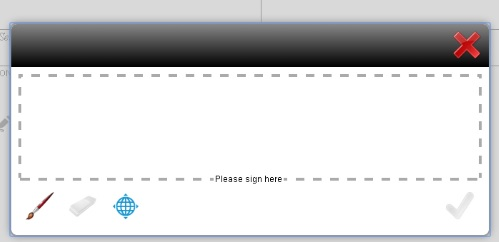

# 手書き署名を使用したフォームへの電子署名の適用{#apply-electronic-signatures-to-a-form-using-deprecated-scribble-signatures}

**手書き署名**&#x200B;コンポーネントや&#x200B;**署名ステップ**&#x200B;コンポーネントを使用すると、アダプティブフォームに手書きで署名できます。署名ステップコンポーネントでは、アダプティブフォームの PDF バージョンが表示されます。署名ステップコンポーネントを使用するには、「レコードのドキュメント」オプションが有効なアダプティブフォームか、フォームテンプレートベースのアダプティブフォームが必要です。

両方のコンポーネントでは、フォームに署名するために、以下のようなウィンドウが表示されます。また、位置情報アイコン  をクリックすることで、署名に位置情報を追加することもできます。

## 手書き署名を使用するためのアダプティブフォームの設定 {#configure-an-adaptive-form-to-use-scribble-signature}

1. 「レコードのドキュメント」オプションが有効なアダプティブフォームか、フォームテンプレートベースのアダプティブフォームを作成します。詳しい手順については、「[アダプティブフォームの作成](creating-adaptive-form.md)」を参照してください。
1. **手書き署名**&#x200B;コンポーネントを、コンポーネントブラウザーからアダプティブフォームにドラッグ＆ドロップします。
1. **設定**（）アイコンをタップします。この操作により、手書き署名コンポーネントのプロパティを表示するプロパティブラウザーが開きます。手書き署名コンポーネントのプロパティを設定します。
1. 署名ステップコンポーネントを、コンポーネントブラウザーからアダプティブフォームにドラッグ＆ドロップします。

   >[!NOTE]
   >
   >署名ステップコンポーネントは、フォームの幅いっぱいに表示されます。そのため、署名ステップコンポーネントが含まれているセクションに他のコンポーネントを配置しないようにすることをお勧めします。

1. コンテンツブラウザーで「**フォームコンテナ**」をタップし、**設定**（）アイコンをタップします。この操作により、アダプティブフォームのコンテナプロパティを表示するプロパティブラウザーが開きます。**アダプティブフォームコンテナ**／**電子署名**&#x200B;に移動して、「**Adobe Sign を有効にする**」オプションを選択解除します。完了（）アイコンをタップして、変更を保存します。

   >[!NOTE]
   >
   >署名ステップコンポーネントをアダプティブフォームに追加すると、「Adobe Sign を有効にする」オプションが自動的に選択されます。

1. **設定**（）アイコンをタップします。この操作により、署名ステップのプロパティを表示するプロパティブラウザーが開きます。以下のプロパティを設定します。

   * **要素名**：コンポーネントの名前を指定します。

   * **タイトル：**&#x200B;コンポーネントの一意のタイトルを指定します。
   * **テンプレートメッセージ：**&#x200B;署名 PDF の読み込み中に表示するメッセージを指定します。Adobe Sign サービスによる署名 PDF の準備と読み込みには、ある程度の時間がかかります。
   * **署名サービス：**「**手書き署名**」オプションを選択します。

   * **CSS クラス**：クライアントライブラリの CSS クラスを指定します（存在する場合）。CSS クラスの代わりに[テーマ](themes.md)や[インラインスタイル](inline-style-adaptive-forms.md)を使用することをお勧めします。

   完了（）アイコンをタップして、変更を保存します。署名が正常に設定されます。

   これで、フォームを記入する際に、PDF バージョンのアダプティブフォームが表示され、PDF ドキュメントの署名オプションが提供されます。詳しくは、「[手書き署名を使用したアダプティブフォームの署名](signing-forms-using-scribble.md#sign-an-adaptive-form-using-scribble-signature)」を参照してください。

## 手書き署名を使用したアダプティブフォームの署名 {#sign-an-adaptive-form-using-scribble-signature}

1. フォームへの記入を完了して署名ステップページに到達すると、署名画面が表示されます。

   

1. 「**[!UICONTROL 署名]**」をクリックします。手書き署名ダイアログが表示されます。フォームに署名し、完了（）アイコンをクリックして、変更内容を保存します。

   

1. 「完了」をクリックして署名プロセスを完了します。

   

署名がフォームに追加され、フォームコントロールが次のパネルに移動します。

