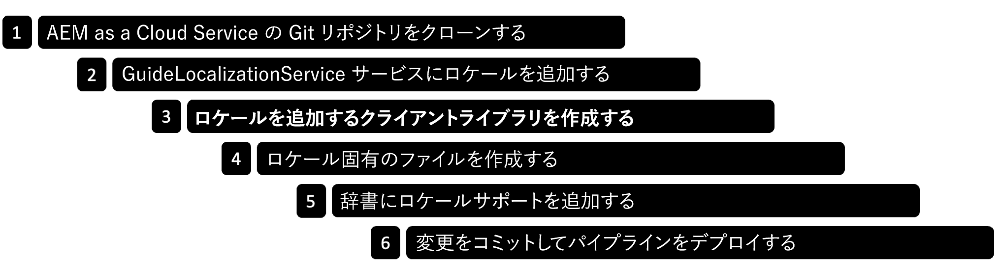

# コアコンポーネントに基づくアダプティブフォームのロケールの追加 {#supporting-new-locales-for-adaptive-forms-localization}

| バージョン | 記事リンク |
| -------- | ---------------------------- |
| 基盤コンポーネント | [ここをクリックしてください](supporting-new-language-localization.md) |
| コアコンポーネント | この記事 |

<span class="preview"> 右から左へ記述する言語サポート機能は、早期導入プログラムで利用できます。早期導入プログラムに参加し、機能へのアクセスをリクエストするには、公式のメール ID で aem-forms-ea@adobe.com までメールを送信してください。</span>

AEM Forms が標準でサポートしているロケールは、英語（en）、スペイン語（es）、フランス語（fr）、イタリア語（it）、ドイツ語（de）、日本語（ja）、ブラジルポルトガル語（pt-br）、中国語（zh-tn）、台湾中国語（zh-tw）、韓国語（ko-kr）です。その他のロケール（ヒンディー語（hi_IN）など）のサポートを追加することもできます。また、これらのロケールを追加すると、右横書き（RTL）言語（アラビア語、ペルシア語、ウルドゥー語など）でアダプティブフォームを表示することもできます。

## アダプティブフォームのロケールはどのように選択されますか？

アダプティブフォームのロケールを追加する前に、アダプティブフォームのロケールの選択方法に関する理解を深めておく必要があります。アダプティブフォームのレンダリング時にロケールを識別して選択する方法は 2 つあります。

* **URL の `locale` セレクターの使用**：アダプティブフォームをレンダリングする際に、システムは、アダプティブフォームの URL の[ロケール]セレクターを検査して要求されたロケールを識別します。URL はこの形式（http:/[AEM Forms Server URL]/content/forms/af/[afName]）に従います。[locale].html?wcmmode=disabled.[ロケール]セレクターを使用すると、アダプティブフォームをキャッシュすることができます。例：URL `www.example.com/content/forms/af/contact-us.hi.html?wcmmmode=disabled` は、ヒンディー語でフォームをレンダリングします。

* 次に示す順序でパラメーターを取得します。

   * **`afAcceptLang`リクエストパラメーターの使用**：ユーザーのブラウザーロケールを上書きするには、 afAcceptLang リクエストパラメーターを渡します。例えば、`https://'[server]:[port]'/<contextPath>/<formFolder>/<formName>.html?wcmmode=disabled&afAcceptLang=ca-fr` URL は、AEM Forms サーバーを強制して、カナダのフランス語ロケールでフォームをレンダリングします。

   * **ブラウザーのロケール（Accept-Language ヘッダー）の使用**：システムは、`Accept-Language` ヘッダーを使用してリクエストで指定されている、ユーザーのブラウザロケールも考慮します。

  要求されたロケールでクライアントライブラリ（ライブラリを作成して使用するプロセスは、この記事で後述）が使用できない場合、ロケール内の言語コードに対してクライアントライブラリが存在するかどうかを確認します。例えば、要求されたロケールが `en_ZA` （南アフリカ英語）であり、`en_ZA` 用のクライアントライブラリが存在しない場合、アダプティブフォームは、en（英語）用のクライアントライブラリを使用します（使用可能な場合）。いずれも見つからない場合、アダプティブフォームは `en` ロケール用の辞書を使用します。

  ロケールが識別されると、アダプティブフォームは対応するフォーム固有の辞書を選択します。リクエストされたロケールの辞書が見つからない場合、デフォルトでは、アダプティブフォームが作成された言語の辞書が使用されます。

  ロケール情報がない場合、アダプティブフォームは元の言語（フォームの開発時に使用される言語）で表示されます


## 前提条件 {#prerequistes}

ロケールの追加を開始する前に、次の手順を実行します。

* 編集を容易にするために、プレーンテキストエディター（IDE）をインストールします。このドキュメントの例は、[Microsoft® Visual Studio Code](https://code.visualstudio.com/download) に基づいています。
* [Git](https://git-scm.com) バージョンのインストール（マシンで使用できない場合）
* [アダプティブフォームコアコンポーネント](https://github.com/adobe/aem-core-forms-components)リポジトリのクローンリポジトリのクローンを作成するには、以下を行います。
   1. コマンドラインまたはターミナルウィンドウを開き、リポジトリを保存する場所に移動します。例：`/adaptive-forms-core-components`
   1. 次のコマンドを実行して、リポジトリをクローンします。

      ```SHELL
          git clone https://github.com/adobe/aem-core-forms-components.git
      ```

  リポジトリには、ロケールの追加に必要なクライアントライブラリが含まれます。

  コマンドが正常に実行されると、リポジトリが `aem-core-forms-components` フォルダーに複製されます。記事の残りの部分では、フォルダーは[アダプティブフォームコアコンポーネントリポジトリ]と呼ばれます。


## ロケールの追加 {#add-localization-support-for-non-supported-locales}

新しいロケールのサポートを追加するには、次の手順に従います。



### 1. AEM as a Cloud Service Git リポジトリを複製する {#clone-the-repository}

1. コマンドラインを開き、AEM Forms as a Cloud Service リポジトリを保存するディレクトリ（例：`/cloud-service-repository/`）を選択します。

1. 次のコマンドを実行して、リポジトリをクローンします。

   ```SHELL
   git clone https://git.cloudmanager.adobe.com/<my-org>/<my-program>/
   ```

   上記の URL の `<my-org>` と `<my-program>` を、組織名とプログラム名に置き換えます。組織名、プログラム名、または Git リポジトリの完全パスや、リポジトリの複製に必要な資格情報を取得する詳しい手順については、[Git へのアクセス](https://experienceleague.adobe.com/docs/experience-manager-cloud-service/content/onboarding/journey/developers.html?lang=ja#accessing-git)の記事を参照してください。

   コマンドが正常に完了した後、フォルダー `<my-program>` が作成されます。Git リポジトリから複製されたコンテンツが含まれます。記事の残りの部分では、このフォルダーを `[AEM Forms as a Cloud Service Git repository]` と呼びます。


### 2. 新しいロケールを Guide Localization Service に追加する {#add-a-locale-to-the-guide-localization-service}

1. 前の節で複製したリポジトリフォルダーを、プレーンテキストエディターで開きます。
1. `[AEM Forms as a Cloud Service Git repository]/ui.config/src/main/content/jcr_root/apps/<appid>/osgiconfig/config` フォルダーに移動します。プロジェクトの `archetype.properties` ファイル内に `<appid>` が見つかります。
1. `[AEM Forms as a Cloud Service Git repository]/ui.config/src/main/content/jcr_root/apps/<appid>/osgiconfig/config/Guide Localization Service.cfg.json` ファイルを編集用として開きます。ファイルが存在しない場合は作成します。サポートされているロケールを含むサンプルファイルは、次のようになります。

   

1. 追加したい[言語のロケールコード](https://en.wikipedia.org/wiki/List_of_ISO_639-1_codes)を追加します。例えば、ヒンディー語なら「hi」を追加します。
1. ファイルを保存して閉じます。

### 3. クライアントライブラリを作成してロケールを追加する

AEM Forms には、新しいロケールを簡単に追加できるよう、サンプルのクライアントライブラリが用意されています。GitHub の[アダプティブフォームのコアコンポーネントリポジトリ]から `clientlib-it-custom-locale` クライアントライブラリをダウンロードして、Forms as a Cloud Service リポジトリに追加することができます。クライアントライブラリを追加するには、次の手順に従います。

1. [アダプティブフォームのコアコンポーネントリポジトリ]をプレーンテキストエディターで開きます。複製したリポジトリがない場合は、[前提条件](#prerequistes)でリポジトリを複製する手順を確認してください。
1. `/aem-core-forms-components/it/apps/src/main/content/jcr_root/apps/forms-core-components-it/clientlibs` ディレクトリに移動します。
1. `clientlib-it-custom-locale` ディレクトリをコピーします。
1. `[AEM Forms as a Cloud Service Git repository]/ui.apps/src/main/content/jcr_root/apps/moonlightprodprogram/clientlibs` に移動して、`clientlib-it-custom-locale` ディレクトリをペーストします。


### 4. ロケール固有のファイルを作成する {#locale-specific-file}

1. `[AEM Forms as a Cloud Service Git repository]/ui.apps/src/main/content/jcr_root/apps/<program-id>/clientlibs/clientlib-it-custom-locale/resources/i18n/` に移動します。
1. [GitHub の英語ロケールの .json ファイル](https://github.com/adobe/aem-core-forms-components/blob/master/ui.af.apps/src/main/content/jcr_root/apps/core/fd/af-clientlibs/core-forms-components-runtime-all/resources/i18n/en.json)を見つけます。ファイルには、製品に含まれるデフォルトの文字列の最新セットが含まれています。
1. 特定のロケール用の .json ファイルを作成します。
1. 新しく作成した .json ファイルで、英語ロケールファイルの構造をミラーリングします。
1. .json ファイル内の英語の文字列を、自分の言語の対応するローカライズされた文字列に置き換えます。
1. ファイルを保存して閉じます。


### 5. 辞書にロケールサポートを追加する {#add-locale-support-for-the-dictionary}

追加する `<locale>` が、`en`、`de`、`es`、`fr`、`it`、`pt-br`、`zh-cn`、`zh-tw`、`ja`、`ko-kr` 以外の場合にのみ、この手順を実行してください。

1. `[AEM Forms as a Cloud Service Git repository]/ui.content/src/main/content/jcr_root/etc/` フォルダーに移動します。

1. まだ存在しない場合は、`jcr_root` フォルダーの下に `etc` フォルダーを作成します。

1. まだ存在しない場合は、`etc` フォルダーの下にフォルダー `languages` を作成します。

   

1. `languages` フォルダー内に `.content.xml` ファイルを作成します。次のコンテンツをファイルに追加します。

   ```XML
   <?xml version="1.0" encoding="UTF-8"?>
   <jcr:root xmlns:jcr="http://www.jcp.org/jcr/1.0" xmlns:nt="http://www.jcp.org/jcr/nt/1.0"
   jcr:primaryType="nt:unstructured"
   languages="[de,es,fr,it,pt-br,zh-cn,zh-tw,ja,ko-kr]"/>
   ```

1. ロケールコードを `languages` プロパティに追加します。例えば、以下のサンプルコードでは、ヒンディー語用に「hi」を追加しています。


   ```XML
   <?xml version="1.0" encoding="UTF-8"?>
   <jcr:root xmlns:jcr="http://www.jcp.org/jcr/1.0" xmlns:nt="http://www.jcp.org/jcr/nt/1.0"
   jcr:primaryType="nt:unstructured"
   languages="[de,es,fr,it,pt-br,zh-cn,zh-tw,ja,ko-kr,hi]"/>
   ```

1. `/ui.content/src/main/content/meta-inf/vault/filter.xml` の下にある `filter.xml` に、新しく作成したフォルダーを次のように追加します。

   ```
   <filter root="/etc/languages"/>
   ```

    の下にある `filter.xml` に追加します。

### 6. 変更をコミットし、パイプラインをデプロイする {#commit-changes-in-repo-deploy-pipeline}

新しいロケールを追加したら、変更を Git リポジトリにコミットします。フルスタックパイプラインを使用してコードをデプロイします。 [パイプラインの設定方法](https://experienceleague.adobe.com/docs/experience-manager-cloud-service/content/onboarding/journey/developers.html?lang=ja#setup-pipeline)を学び、新しいロケールのサポートを追加します。

パイプラインの実行が成功すると、新しく追加されたロケールが使用できる状態になります。

## 新しく追加されたロケールでのアダプティブフォームのプレビュー {#use-added-locale-in-af}

新しく追加されたロケールでアダプティブフォームをプレビューするには、次の手順を実行します。

1. AEM Forms as a Cloud Service インスタンスにログインします。
1. **Forms**／**フォームとドキュメント**&#x200B;に移動します。
1. アダプティブフォームを選択し、「**辞書を追加**」をクリックすると、**辞書を翻訳プロジェクトに追加**&#x200B;ウィザードが表示されます。
1. **プロジェクトタイトル**&#x200B;を指定し、**辞書を翻訳プロジェクトに追加**&#x200B;ウィザードのドロップダウンメニューから「**ターゲット言語**」を選択します。
1. 「**完了**」をクリックし、作成した翻訳プロジェクトを実行します。
1. アダプティブフォームを選択し、「**HTML としてプレビュー**」をクリックします。
1. アダプティブフォームの URL に `&afAcceptLang=<locale-name>` を追加します。
1. ページを更新すると、アダプティブフォームは指定されたロケールでレンダリングされます。

## 新しいローカライゼーションをサポートする上でのベストプラクティス {#best-practices}

* アドビは、アダプティブフォームの作成後に翻訳プロジェクトを作成することをお勧めします。

* 新しいフィールドが既存のアダプティブフォームに追加された場合：
   * **機械翻訳の場合**：辞書を再作成し、[翻訳プロジェクトを実行します](/help/forms/using-aem-translation-workflow-to-localize-adaptive-forms-core-components.md)。翻訳プロジェクトの作成後にアダプティブフォームに追加されたフィールドは、未翻訳になります。
   * **人間による翻訳の場合**：`[AEM Forms Server]/libs/cq/i18n/gui/translator.html` で UI を使用して辞書を書き出します。新しく追加されたフィールド用の辞書を更新し、アップロードします。

## 詳細を表示する

* [アダプティブフォームにおけるレコードのドキュメントの生成](/help/forms/generate-document-of-record-core-components.md)
* [AEM Sites ページまたはエクスペリエンスフラグメントにアダプティブフォームの追加](/help/forms/create-or-add-an-adaptive-form-to-aem-sites-page.md)


## 関連トピック {#see-also}

{{see-also}}