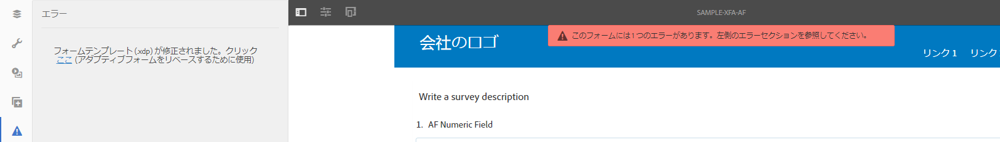
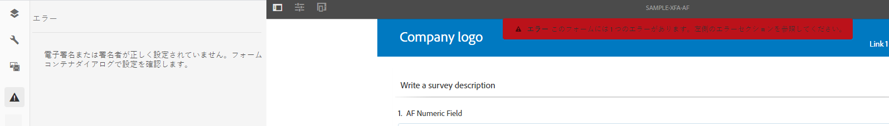
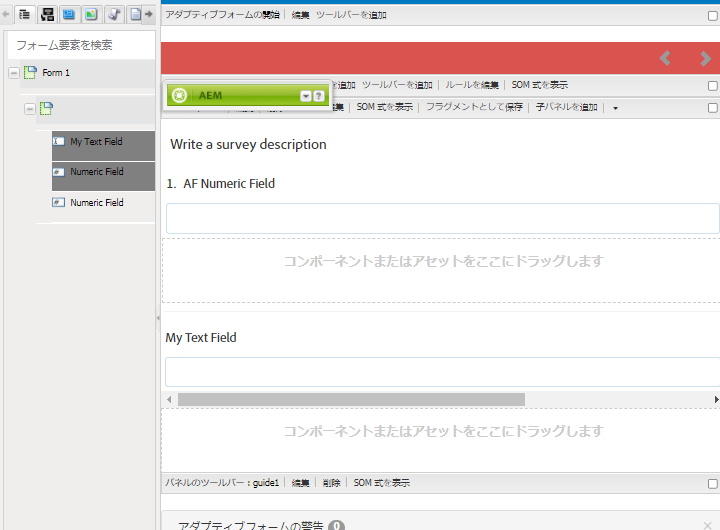
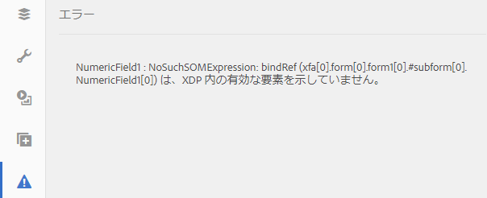

# アダプティブフォームと XFA フォームテンプレートとの同期{#synchronizing-adaptive-forms-with-xfa-form-templates}

## はじめに {#introduction}

XFA フォームテンプレート（`*.XDP`ファイル）を基にアダプティブフォームを作成することができます。この方法では既存の XFA フォームが再利用でき、投資効率が得られます。XFA フォームテンプレートを使用したアダプティブフォームの作成方法については、「[テンプレートに基づくアダプティブフォームの作成](creating-adaptive-form.md)」を参照してください。

XDP ファイルのフィールドをアダプティブフォームで再利用することができます。これらのフィールドは、バインドされたフィールドと呼ばれます。バインドされたフィールドのプロパティ（スクリプト、ラベル、表示形式など）は、XDP ファイルからコピーされます。これらのプロパティには、値をオーバーライドできるものもあります。

[!DNL AEM Forms] では、XDP ファイル内の対応するフィールドに後で変更があった場合も、アダプティブフォームのフィールドが同期された状態を保つことができます。この記事では、この同期を有効にする方法を説明します。

[!DNL AEM Forms] のオーサリング環境では、XFA フォーム（左）からアダプティブフォーム（右）にフィールドをドラッグすることができます

## 前提条件 {#prerequisites}

この記事の情報を使用するには、次の内容について確認しておくと役立ちます。

* [アダプティブフォームの作成](creating-adaptive-form.md)

* XFA（XML Forms Architecture）

この記事の例に示されているアセットを使用するには、次のセクション「[サンプルパッケージ](synchronizing-adaptive-forms-xfa.md#p-sample-package-p)」で説明されているとおりにサンプルパッケージをダウンロードしてください。

## サンプルパッケージ {#sample-package}

この記事では、更新された XFA フォームテンプレートを使用したアダプティブフォームの同期方法を、例を使って示しています。例で使用されているアセットは、この記事の「[ダウンロード](synchronizing-adaptive-forms-xfa.md#p-downloads-p)」セクションからダウンロードできるパッケージに含まれています。

パッケージをアップロードすると、これらのアセットが [!DNL AEM Forms] UI に表示されます。

パッケージマネージャー `https://<server>:<port>/crx/packmgr/index.jsp` を使ってパッケージをインストールします。

パッケージには次のアセットが含まれています。

1. `sample-form.xdp`：例として使用されている XFA フォームテンプレート

1. `sample-xfa-af`：sample-form.xdp ファイルを基にしたアダプティブフォームただし、このアダプティブフォームにはフィールドは含まれていません。次の手順で、このアダプティブフォームにコンテンツを追加します。

### アダプティブフォームへのコンテンツの追加 {#add-content-to-adaptive-form-br}

1. https://&lt;server>:&lt;port>/aem/forms.html に移動します。要求された場合は、資格情報を入力します。
1. 作成者モードで sample-af-xfa を開き、編集します。
1. サイドバーにあるコンテンツブラウザーで、「データモデルオブジェクト」タブを選択します。NumericField1 と TextField1 をアダプティブフォームにドラッグします。
1. NumericField1 のタイトルを **Numeric Field** から **AF Numeric Field** に変更します。

>[!NOTE]
>
>前述の手順では、XDP ファイル内のフィールドのプロパティを上書きしました。したがって、このプロパティは、XDP ファイル内の対応するプロパティが後に変更されても同期されません。

## XDP ファイル内の変更の検出 {#detecting-changes-in-xdp-file}

XDP ファイルまたはフラグメントに変更があった場合、[!DNL AEM Forms] UI により、その XDP ファイルまたはフラグメントに基づくすべてのアダプティブフォームにフラグが付けられます。

XDP ファイルを更新した後、変更がフラグ付けされるようにするには、その XDP ファイルを [!DNL AEM Forms] UI に再度アップロードする必要があります。

例として、次の手順を使って `sample-form.xdp` ファイルを更新します。

1. `https://<server>:<port>/projects.html.`に移動します。指示に従って、資格情報を入力します。
1. 左側にある「フォーム」タブをクリックします。
1. ローカルマシンに `sample-form.xdp` ファイルをダウンロードします。XDP ファイルが、任意のファイル解凍ユーティリティで抽出可能な `.zip` ファイル形式でダウンロードされます。

1. `sample-form.xdp` ファイルを開き、TextField1 のタイトルを **Text Field** から **My Text Field** に変更します。

1. `sample-form.xdp` ファイルを [!DNL AEM Forms] UI にアップロードして戻します。

XDP ファイルが更新されると、XDP ファイルに基づいてアダプティブフォームを編集する際、エディターにアイコンが表示されます。このアイコンは、アダプティブフォームが XDP ファイルと同期されていないことを示すものです。次の画像では、サイドバーにアイコンが表示されています。

## アダプティブフォームと最新の XDP ファイルとの同期 {#synchronizing-adaptive-forms-with-the-latest-xdp-file}

XDP ファイルと同期されていないアダプティブフォームが次回作成用に開かれたときに、次のメッセージが表示されます：**このアダプティブフォームのスキーマ／フォームテンプレートは更新されました。`Click Here`(新しいバージョンでリベースするために使用)。**

メッセージをクリックすると、アダプティブフォーム内のフィールドが XDP ファイル内の対応するフィールドと同期されます。

この記事で使用される例では、`sample-xfa-af` をオーサリングモードで開きます。メッセージが、アダプティブフォームの下部に表示されます。

### プロパティの更新 {#updating-the-properties}

XDP ファイルからアダプティブフォームにコピーされたプロパティは、作成者によってアダプティブフォーム内で（コンポーネントダイアログから）明示的に上書きされたプロパティを除き、すべて更新されます。更新されたプロパティのリストは、サーバーログで見ることができます。

例にあるアダプティブフォームのプロパティを更新するには、メッセージ内の「`"Click Here"`」のラベルが付いたリンクをクリックします。TextField1 のタイトルが、**Text Field** から **My Text Field** に変更されます。

>[!NOTE]
>
>AF Numeric Field のラベルが変更されなかったのは、「[アダプティブフォームへのコンテンツの追加](synchronizing-adaptive-forms-xfa.md#p-add-content-to-adaptive-form-br-p)」で説明されているとおり、コンポーネントプロパティダイアログでこのプロパティを上書きしたからです。

### XDP ファイルからアダプティブフォームへの新しいフィールドの追加  {#adding-new-fields-from-xdp-file-to-adaptive-form-nbsp}

「フォーム階層」タブから元の XDP ファイルに後から追加された新しいフィールドは、アダプティブフォームへとドラッグすることができます。

「フォーム階層」タブのフィールドを更新するために、エラーメッセージ内のリンクをクリックする必要はありません。

### XDP ファイルから削除されたフィールド {#deleted-fields-in-xdp-file}

アダプティブフォームに以前コピーされたフィールドが XDP ファイルから削除されている場合には、XDP ファイルにフィールドが存在しないというエラーメッセージが作成者モード内で表示されます。そのような場合には、アダプティブフォームから手動でそのフィールドを削除するか、またはコンポーネントダイアログで `bindRef` プロパティを消去します。

次の手順では、この記事で使われている例の中のアセットに対してこの方法を使用する流れを説明します。

1. `sample-form.xdp` ファイルを更新し、NumericField1 を削除します。
1. [!DNL AEM Forms] UI に `sample-form.xdp` ファイルをアップロードします。
1. `sample-xfa-af` アダプティブフォームを作成のために開きます。次のエラーメッセージが表示されます：このアダプティブフォームのスキーマ／フォームテンプレートは更新されました。`Click Here`(新しいバージョンでリベースするために使用)。

1. メッセージ内の「`Click Here`のラベル」が付いたリンクをクリックします。XDP ファイルにフィールドが存在しないというエラーメッセージが表示されます。

削除されたフィールドも、フィールドにエラーが存在することを示すアイコンでマークされます。

>[!NOTE]
>
>アダプティブフォームのフィールドで誤ったバインド（編集ダイアログの無効な `bindRef` 値）を持つフィールドも、削除されたフィールドとみなされます。これらのエラーを修正しないでアダプティブフォームを発行すると、フィールドはバインドされていない通常のアダプティブフォームフィールドとして処理され、出力 XML ファイルのバインドされていないセクションに追加されます。

## ダウンロード {#downloads}

この記事の例に使用されているコンテンツパッケージ

[ファイルを入手](assets/sample-xfa-af-sync-1.0.zip)
