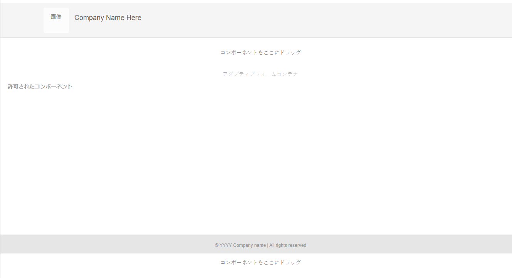

# コアコンポーネントを使用したアダプティブフォームテンプレートの作成 {#adaptive-form-templates}

フォームを作成する場合、フィールドとコンポーネントを追加して、フォーム構造、コンテンツ、アクションをエディターで定義します。フィールドとコンポーネントは、フォームコンテナの `guideRootPanel` に追加します。テンプレートエディターを使用すると、フォームの作成時に使用できる基本構造と初期コンテンツを含んだテンプレートを作成できます。

例えば、すべての作成者に登録フォームで特定のテキストボックス、ナビゲーションボタン、送信ボタンを使用させるようにします。他の登録フォームと統一のとれたフォームを作成者が作成できるようにコンポーネントを追加してテンプレートを作成できます。作成者がテンプレートを使用してアダプティブフォームを作成する場合、新しいフォームは、テンプレートで指定した構造とコンポーネントを継承します。テンプレートエディターでは、以下のことが行えます。

* 構造レイヤーでフォームのヘッダーおよびフッターコンポーネントを追加できます。
* フォームの初期コンテンツを提供できます。
* テーマや送信アクションを指定できます。

<!--
You can download and install [!DNL AEM Forms] reference content package from [Software Distribution](https://experience.adobe.com/#/downloads/content/software-distribution/en/aemcloud.html) portal to import reference themes and templates to your environment.
-->

## 前提条件

**お使いの環境でのアダプティブフォームコアコンポーネントの有効化**：プログラムを作成すると、アダプティブフォームコアコンポーネントはお使いの環境で既に有効になります。AEM Cloud Service 環境でアダプティブフォームコアコンポーネントを有効にするには、最新版をインストールします。

>[!NOTE]
>
> アーキタイプ 45 に基づくForms as a Cloud Service 環境のデプロイ時に、**アダプティブフォーム（コアコンポーネント）**&#x200B;テンプレートとコアコンポーネントベースのテーマが環境に追加されます。

## テンプレートの操作 {#working-with-templates}

ツールメニューからテンプレートエディターにアクセスするには、**[!UICONTROL Adobe Experience Manager]**／**[!UICONTROL ツール]**／**[!UICONTROL 一般]**／**[!UICONTROL テンプレート]**&#x200B;に移動します。テンプレートが、編集可能なテンプレートが有効になっているフォルダーで整理されています。

>[!NOTE]
>
> コアコンポーネント固有のフォルダーには、コアコンポーネントベースの編集可能なテンプレートがあります。

Experience Manager には、テンプレートを整理するためのグローバルフォルダーが用意されています。ただし、このフォルダーはデフォルトでは無効になっています。グローバルフォルダーを有効にするように管理者に依頼することも、テンプレート用のフォルダーを作成することもできます。フォルダーの作成方法について詳しくは、「[テンプレートフォルダー](https://experienceleague.adobe.com/docs/experience-manager-cloud-service/sites/authoring/features/templates.html?lang=ja#editing-templates-template-authors)」を参照してください。

## テンプレートの作成 {#create-template}

フォルダーの作成後、フォルダーを開いて以下の手順を実行し、テンプレートを作成します。

1. 作成したフォルダー内で「**[!UICONTROL 作成]**」を選択します。
1. 「**[!UICONTROL テンプレートタイプを選択]**」セクションで、「**[!UICONTROL アダプティブフォーム（コアコンポーネント）テンプレート]**」を選択し、「**[!UICONTROL 次へ]**」を選択します。

1. 「**[!UICONTROL テンプレート詳細]**」セクションで、**テンプレートのタイトル**&#x200B;を指定し、「**[!UICONTROL 作成]**」を選択します。
説明を入力することもできます。

1. 「**[!UICONTROL 完了]**」を選択してコンソールに戻るか、「**[!UICONTROL 開く]**」を選択してテンプレートをエディターで開きます。

## テンプレートエディター UI {#template-editor-ui}

編集対象のテンプレートを開くと、以下の AEM エディターコンポーネントが表示されます。

* **ページツールバー**
以下のオプションが含まれています。

   * **サイドパネルを切り替え**：サイドバーの表示と非表示を切り替えることができます。
   * **ページ情報**：公開／非公開の時間、サムネール、クライアントサイドライブラリ、ページポリシー、ページデザインのクライアントサイドライブラリなどの情報を指定できます。
     <!-- * **Emulator**: Lets you simulate and customize the look for different devices.-->
   * **モードセレクター**：モードを変更できます。**[!UICONTROL 構造]**&#x200B;モード、**[!UICONTROL 初期コンテンツ]**、**[!UICONTROL レイアウト制御]**&#x200B;モードを選択できます。構造モードを使用すると、ヘッダーとフッターを追加してカスタマイズできます。初期コンテンツモードを使用すると、フォームコンテンツをカスタマイズできます。
   * **プレビュー**：テンプレート公開時の外観をプレビューできます。「レイヤーセレクター」と「プレビュー」を使用して、編集モードとプレビューモードを切り替えることができます。
* **サイドバー**：コンテンツブラウザー、プロパティブラウザー、アセットブラウザー、コンポーネントブラウザーを提供します。
* **コンポーネントツールバー**：コンポーネントを選択すると、コンポーネントをカスタマイズできるツールバーが表示されます。
* **ページ**：コンテンツを追加してテンプレートを作成する領域です。

<!-- See [Introduction to authoring Adaptive Forms](introduction-forms-authoring.md) to understand the Touch UI editor. -->

## テンプレートの編集 {#editing-a-template}

テンプレートの適切な側面を選択および編集する各種のモードは、次のとおりです。

* [構造](#structure)
* [初期コンテンツ](#initial-content)
* [レイアウト](#layout)

画面の右上隅の「プレビュー」オプションの横にあるレイヤーセレクターを使用します。

### 構造 {#structure}

テンプレートエディターで構造レイヤーを選択すると、テンプレートに関連付けられたアダプティブフォームを作成する際に、変更できないコンテンツを事前定義するのに役立ちます。

<!-- you can see the layout containers above and below the Adaptive Form Container. Authors can use these layout containers for header and footer. -->

<!--

**A. Layout container for Header component**
Drag-drop the Adaptive Form Header component in the layout container above the Adaptive Form Container. After you add the component, you can specify its properties that let you add a logo and provide its title.
**B. Adaptive Form Container component**
Drag-drop the Adaptive Form components in the Adaptive Form Container. You can specify the design and arrangement of fields and components in the template editor. After you add the components, you can specify its properties.
**C. Layout container for Footer component**
Similarly, when you drag-drop the footer component in the layout container below the Adaptive Form Container, you can provide the copyright information and company details. 
You can add, edit, or customize the header and footer. Drag-drop the Adaptive Form Header and Footer component to customize the template. Drag-drop the Adaptive Form components in the Adaptive Form Container. You can specify the design and arrangement of fields and components in the template editor. 

Header and footer are added in the Initial Content layer.
-->

#### 構造レイヤー内のコンポーネントのロック／ロック解除 {#locking-unlocking-components-in-the-structure-layer}

構造レイヤーを選択してテンプレートを編集する際は、テンプレートのヘッダーとフッターのロックを解除できます。テンプレート内のコンポーネントがロック解除されると、フォーム作成者はそのテンプレートを使用するアダプティブフォーム内のコンポーネントを編集できます。コンポーネントをロックすると、フォーム作成者はアダプティブフォーム内でそのコンポーネントを編集できなくなります。ロックオプションはコンポーネントツールバーにあります。

例えば、ヘッダーコンポーネントをテンプレートに追加するとします。コンポーネントを選択すると、コンポーネントツールバーにロックオプションが表示されます。通常、ヘッダーには会社名とロゴが含まれており、フォーム作成者がテンプレート内のロゴとヘッダーを変更できないようにする必要があります。ヘッダーコンポーネントをロックしたテンプレートを使用して作成したアダプティブフォームでは、フォーム作成者はロゴと会社名を変更できません。

>[!NOTE]
>
>ヘッダーコンポーネント内の画像またはロゴを個々にロックまたはロック解除することはお勧めしません。ヘッダーコンポーネントはロック解除できます。

### 初期コンテンツ {#initial-content}

「初期コンテンツ」オプションを選択すると、テンプレートのアダプティブフォームコンテナがアダプティブフォームと同様に開いて編集可能になります。事前定義済みのコンテンツを作成できます。コンテンツは、テンプレートに関連付けられたアダプティブフォームを作成する際に変更できます。アダプティブフォームを作成する場合と同様、テーマや送信アクションの選択などの初期設定を指定できます。

フォーム作成者はこれをベースにしてフォームを作成します。コンテンツのフロー構造は、テンプレートの初期コンテンツレイヤーで指定されます。フォームテンプレートの初期コンテンツの編集に切り替えるには、ページツールバーでプレビューを実行する前に、 **／** **[!UICONTROL 初期コンテンツ]**&#x200B;を選択します。

初期コンテンツレイヤー内で、作成者がベースとして使用するアダプティブフォームテンプレートを作成します。テンプレートの作成はフォームの作成と同様です。サイドバーにあるオプションを使用します。サイドバーは、コンテンツブラウザー、プロパティブラウザー、アセットブラウザー、コンポーネントブラウザーを提供します。

<!-- See [Sidebar](introduction-forms-authoring.md#sidebar). -->

>[!NOTE]
>
>送信アクションとして「コンテンツを保存」または「PDF を保存」を選択すると、ストレージパスを指定するオプションを使用できます。テンプレートでパスを指定した場合、このテンプレートから作成されたすべてのフォームには同じパスが指定されます。正しいストレージパスを指定するか、またはフォーム作成者がストレージパスを更新してすべてのフォームのデータが同じ場所に保存されないようにします。

### レイアウト {#layout}

テンプレートを編集する際にレイアウトを定義できます。これには、標準のレスポンシブレイアウトが使用されます。このレイアウトを使用すると、デバイスの幅に基づいてコンポーネントの幅を管理し、レスポンシブなアダプティブフォームのデザインを容易にすることができます。

詳しくは、[レスポンシブレイアウトについて](https://experienceleague.adobe.com/docs/experience-manager-learn/sites/page-authoring/responsive-layout-feature-video-understand.html?lang=ja)の記事を参照してください。

## テンプレートの有効化 {#enabling-the-template}

作成したテンプレートは、ドラフトとして追加されます。テンプレートを有効にして、アダプティブフォームの作成に使用できるようにします。テンプレートを有効にするには、以下の手順を実行します。

1. **[!UICONTROL Adobe Experience Manager]**／**[!UICONTROL ツール]**／**[!UICONTROL テンプレート]**&#x200B;に移動して、テンプレートの作成先のフォルダーを開きます。
作成したテンプレートは、ドラフトとしてマークされます。
1. テンプレートを選択して、ツールバーで「**[!UICONTROL 有効]**」を選択します。
アダプティブフォームの作成時に、テンプレートの選択を求められる際にこのテンプレートがリストに表示されるようになります。

## テンプレートの読み込みまたは書き出し {#importing-or-exporting-a-template}

フォームは、テンプレートと連携しています。カスタマイズしたテンプレートを使用して作成したアダプティブフォームをダウンロードする場合、テンプレートはダウンロードされません。別の [!DNL AEM Forms] インスタンス上のフォームを読み込む場合は、テンプレートなしで読み込まれます。フォームが読み込まれてもテンプレートを使用できない場合、フォームはレンダリングされません。`/conf` にある `https://<server>:<port>/crx/packmgr` ノードからカスタムテンプレートをパッケージ化し、フォームをアップロードする [!DNL AEM Forms] インスタンスに移植できます。また、[AEM アーキタイプを使用してテンプレートを作成し、Cloud Services インスタンスにデプロイ](https://experienceleague.adobe.com/docs/experience-manager-learn/getting-started-wknd-tutorial-develop/pages-templates.html?lang=ja#prerequisites)することもできます。

>[!NOTE]
>
> * [!UICONTROL &#x200B; レコードのドキュメント &#x200B;] テンプレートは、アダプティブフォームビルダーまたはアダプティブフォームテンプレートビルダーから直接設定することもできます。 詳しくは、[アダプティブフォームにおけるレコードのドキュメントの生成](/help/forms/generate-document-of-record-for-non-xfa-based-adaptive-forms.md#document-of-record-support-in-adaptive-form-editor-dor-support-in-adaptiveform)を参照してください。

## フォームデータモデルスキーマのテンプレートへの関連付け {#associating-form-data-model-schema-in-template}

作成者はテンプレートエディターで、[!UICONTROL フォームデータモデルスキーマ]をアダプティブフォームテンプレートに関連付けることができます。作成者は、スキーマをテンプレートエディターから選択できます。 スキーマをテンプレートに関連付け、フォーム作成者がそのテンプレートに基づいてフォームを作成すると、フォームのスキーマが事前に選択されます。フォーム作成者がスキーマの使用を規制し、フォーム作成者の時間も節約できます。テンプレートエディターでフォームデータモデルスキーマを選択するには、次の手順に従います。

1. 左側にある&#x200B;**[!UICONTROL コンテンツブラウザー]**&#x200B;を選択します。
1. フォームコンテナの「**[!UICONTROL 設定]**」に移動します。
1. **[!UICONTROL データモデル]**&#x200B;を選択します。
1. **[!UICONTROL フォームデータモデルを選択]**&#x200B;からフォームデータモデル（FDM）を選択し、設定を保存します。

<!--

## Creating an Adaptive Form template with tabs and panels {#creating-an-adaptive-form-template-with-tabs-and-panels-nbs}

For example, you want to create a template with the following tabs:

* General Information
* Professional Information

You have added a logo, provided a title, and added a footer in the structure layer. Lock the header and footer to stop form authors from editing them when they use the template to create forms.

Change the layer from **Structure** to **Initial Content**, and start adding content to the form. To create a tabbed structure, add a child Panel in the guideRootPanel of the Adaptive Form container. To add a panel:

* You can add a panel by tapping the **[!UICONTROL +]** button when you select the **[!UICONTROL Drag components here]** option.

* You can drag-drop the panel component from the components browser in the sidebar.
* You can add child panel of the `guideRootPanel` from the component toolbar.

To create the General Information and Professional Information tabs, add two panels in the child panel of the `guideRootPanel`. Select the panels and select  to open the properties in the sidebar. Change the element names as `general-info` and `professional-info`, and titles as General Information and Professional Information respectively. In the sidebar, select content to open the content browser. In the Form Objects tab, select `guideRootPanel`. In the editor, the guideRootPanel is selected. Select  in the component toolbar to open its properties. In the Panel Layout field, select **[!UICONTROL Tabs on Top]** and select **[!UICONTROL Done]**. The tabbed template structure is applied.

### Adding content in tabs {#adding-content-in-tabs}

After you add panels and structure them as tabs, you can add fields inside the tabs. When you select a tab in the editor, you can see the **[!UICONTROL Drag components here]** option. You can drag-drop components such as text-boxes, list items, and buttons. You can drag-drop components from the components browser in the sidebar.

Each component has properties that enhance data capturing and manipulation. For example, you can enable the **[!UICONTROL Required field]** property of a component. Your authors can specify a message that your customers see when they skip filling a required field. Specify the message in **[!UICONTROL Required Field Message]** property.

In the example template, Name, Phone number, and Date of birth fields are added in the General Information tab. In the Professional Information tab, Currently employed, employment type, Educational qualification fields are added.

After you have added fields, you can add buttons such as Submit and Reset.
-->

### テンプレートポリシーを使用してアダプティブフォームコンポーネントにカスタムプロパティを追加

カスタムプロパティを使用すると、フォームテンプレートを使用してカスタム属性（キーと値のペア）をアダプティブフォームのコアコンポーネントに関連付けることができます。カスタムプロパティは、コンポーネントのヘッドレスレンディションの「**[!UICONTROL プロパティ]**」セクションに反映されます。これにより、カスタム属性値に基づいて適応する動的なフォーム動作を作成できます。 例えば、開発者は、モバイル、デスクトップ、web プラットフォーム上にヘッドレスフォームコンポーネントの様々なレンディションをデザインできるので、幅広いデバイスでのユーザーエクスペリエンスが大幅に向上します。

アダプティブフォームのコアコンポーネントフィールドにカスタムプロパティを追加する手順は次のとおりです。

1. [テンプレートエディターのポリシーにカスタムグループ名を追加](#add-a-custom-group-name)
1. [アダプティブフォームのコンポーネントの編集ダイアログでカスタムグループ名を選択](#select-a-custom-group-name)

#### テンプレートエディターのポリシーでカスタムグループ名を追加 {#add-a-custom-group-name}

1. **[!UICONTROL Adobe Experience Manager]**／**[!UICONTROL ツール]**／**[!UICONTROL 一般]**／**[!UICONTROL テンプレート]**&#x200B;に移動します。
1. コアコンポーネントに基づいてテンプレートを選択し、編集モードで開きます。
1. カスタムプロパティの定義が必要なアダプティブフォームコアコンポーネントフィールドの「**[!UICONTROL ポリシー]**」アイコンをクリックします。**[!UICONTROL アダプティブフォームフィールド]**&#x200B;ダイアログが表示されます。
1. 「**[!UICONTROL カスタムプロパティ]**」タブを選択します。
1. 「**[!UICONTROL ポリシー]**」セクションの下で&#x200B;**[!UICONTROL ポリシーのタイトル]**&#x200B;を指定します。
1. **[!UICONTROL グループ名]**&#x200B;を指定し、特定のグループに関連付けられたキーと値のペアを追加します。グループ名は、コンポーネントの編集ダイアログでフォーム作成者に表示されます。グループ名を選択した場合、関連付けられているすべてのキーと値のペアが 1 つのコンポーネントに適用されます。
1. 「**[完了]**」をクリックします。

テンプレートポリシーを使用して 1 つ以上のカスタムプロパティグループを追加する場合、「**[!UICONTROL 詳細]**」タブは、対応するコアコンポーネントの編集ダイアログに表示されます。

#### コアコンポーネントの編集ダイアログでカスタムグループ名を選択 {#select-a-custom-group-name}

1. アダプティブフォームを編集モードで開きます。
1. テンプレートエディターでカスタムプロパティを定義したコンポーネントを選択し、 を選択してコンポーネントの編集ダイアログを開きます。
1. 「**[!UICONTROL 詳細]**」タブを選択します。
1. **[!UICONTROL カスタムプロパティの選択]**&#x200B;ドロップダウンからカスタムプロパティグループ名を選択します。定義済みのすべてのカスタムグループ名が、ドロップダウンリストに自動的に入力されます。
1. 「**[!UICONTROL 完了]**」を選択して、プロパティを保存します。

>[!NOTE]
>
> * 「**[!UICONTROL 追加のカスタムプロパティ]**」チェックボックスを使用すると、テンプレートポリシーで提供されるプロパティに加えて、コンポーネント固有のカスタムプロパティを動的に追加できます。キー名の値が一致する場合、特定のコンポーネントのカスタムプロパティは、テンプレートポリシーで設定されたカスタムプロパティよりも優先されます。

## テンプレートを使用したアダプティブフォームの作成 {#creating-an-adaptive-form-using-the-template}

テンプレートを作成して有効にすると、アダプティブフォームを作成する際に Forms Manager でそのテンプレートを使用できます。テンプレートを使用したアダプティブフォームの作成方法については、[コアコンポーネントに基づいたアダプティブフォームの作成](/help/forms/creating-adaptive-form-core-components.md)を参照してください。
<!--
## Change display option of out of the box templates  {#change-display-option-of-out-of-the-box-templates}

You can create custom templates for Adaptive Forms to define basic structure and initial content. [!DNL AEM Forms] also provides a set of out of the box template for Adaptive Forms. You can choose to show or hide the templates.

Perform the following steps to show and hide templates:

1. Log in to [!DNL AEM Forms] author instance and navigate to **[!UICONTROL Tools]** &gt; **[!UICONTROL Operations]** &gt; **[!UICONTROL Web Console]**.

   >[!NOTE]
   >
   >The URL of AEM web console is https://'[server]:[port]'/system/console/configMgr

1. Locate and open the **FormsManager Configuration** settings:

    * To show or hide out of the box Adaptive Forms template, check or uncheck the **Include Out of the box AF and AD Templates** option.
    * To show or hide out of the box Adaptive Form templates that were added in AEM 6.0 Forms or AEM 6.1 Forms releases but are now deprecated, check or uncheck the **Include AEM 6.0 AF Templates** option. If this option is checked, and you want it to take effect, it requires the **Include Out of the box AF and AD Templates** configuration to be enabled.

1. Click **Save**. The display options for the out of the box templates are changed. 

## Save an Adaptive Form as a template {#saving-adaptive-form-as-template}

You can also save an Adaptive Form as a template for future use. To save a Adaptive Form as a template:

1. Select an Adaptive Form to save it as a template.
1. Click **[!UICONTROL Save as Template]**. A dialog box appears.
1. Specify **[!UICONTROL Title]** (mandatory field), **[!UICONTROL Location]** (mandatory field) and **[!UICONTROL Description]** (optional field) for the template. 
1. Click **[!UICONTROL Create]**.

   

>[!NOTE]
>
>To use the same container policy as of the source Adaptive Form, it is recommended to save the template in the same folder as of the source Adaptive Form. In case, the template is saved in any other folder, than the created template uses a default container policy.
-->

## ベストプラクティス {#best-practices}

* コアコンポーネントに基づくコンポーネント（アダプティブフォームテキスト、アダプティブフォームコンテナなど）を使用して、テンプレートを作成します。アダプティブフォームコアコンポーネントの情報を入手するには、 [ここをクリック](https://experienceleague.adobe.com/docs/experience-manager-core-components/using/adaptive-forms/introduction.html?lang=ja)します。
* Web サイトで使用できる基本的に異なるフォームタイプに一致するテンプレートの数を制限する
* テンプレートで使用されているカスタムコンポーネントに必要な柔軟性および設定機能を提供する。

<!--
## See next

* [Create style or themes for your forms](using-themes-in-core-components.md)
* [Create an Adaptive Form (core components)](/help/forms/creating-adaptive-form-core-components.md)

-->

## 関連トピック {#see-also}

{{see-also}}

* [フォームのスタイルまたはテーマの作成](using-themes-in-core-components.md)
* [アダプティブフォーム（コアコンポーネント）の作成](/help/forms/creating-adaptive-form-core-components.md)

