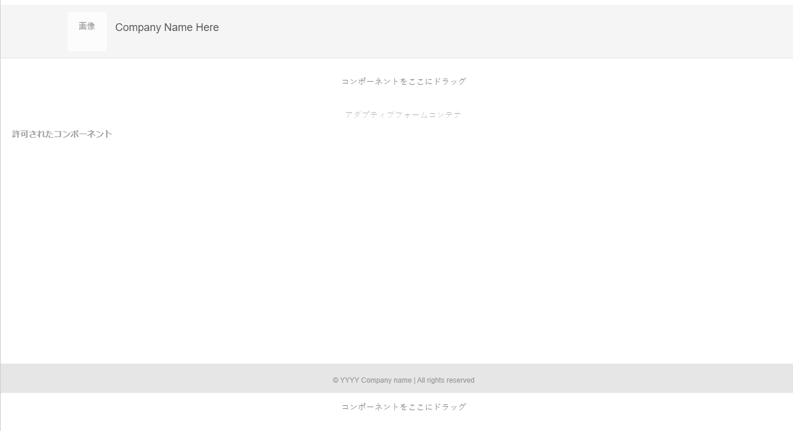

# アダプティブフォームテンプレートの作成 {#adaptive-form-templates}

>[!NOTE]
>
> Adobeでは、（新しいアダプティブFormsの作成 [ または ](https://experienceleague.adobe.com/docs/experience-manager-core-components/using/adaptive-forms/introduction.html?lang=ja)[ AEM SitesページへのアダプティブFormsの追加 [ に、最新の拡張可能なデータキャプチャ ](/help/forms/creating-adaptive-form-core-components.md) コアコンポーネント ](/help/forms/create-or-add-an-adaptive-form-to-aem-sites-page.md) を使用することをお勧めします。 これらのコンポーネントは、アダプティブフォームの作成における大幅な進歩を表し、ユーザーエクスペリエンスの向上を実現します。この記事では、基盤コンポーネントを使用してアダプティブFormsを作成する古いアプローチを説明します。

| バージョン | 記事リンク |
| -------- | ---------------------------- |
| AEM 6.5 | [ここをクリックしてください](https://experienceleague.adobe.com/docs/experience-manager-65/forms/adaptive-forms-advanced-authoring/template-editor.html?lang=ja) |
| AEM as a Cloud Service | この記事 |

フォームを作成する場合、フィールドとコンポーネントを追加して、フォーム構造、コンテンツ、アクションをエディターで定義します。フィールドとコンポーネントは、フォームコンテナの `guideRootPanel` に追加します。テンプレートエディターを使用すると、フォームの作成時に使用できる基本構造と初期コンテンツを含んだテンプレートを作成できます。

例えば、すべての作成者に登録フォームで特定のテキストボックス、ナビゲーションボタン、送信ボタンを使用させるようにします。他の登録フォームと統一のとれたフォームを作成者が作成できるようにコンポーネントを追加してテンプレートを作成できます。作成者がテンプレートを使用してアダプティブフォームを作成する場合、新しいフォームは、テンプレートで指定した構造とコンポーネントを継承します。テンプレートエディターでは、以下のことが行えます。

* 構造レイヤーでフォームのヘッダーおよびフッターコンポーネントを追加できます。
* フォームの初期コンテンツを提供できます。
* テーマや送信アクションを指定できます。

[ソフトウェア配布](https://experience.adobe.com/#/downloads/content/software-distribution/jp/aemcloud.html)ポータルから [!DNL AEM Forms] リファレンスコンテンツパッケージをダウンロードしてインストールし、参照テーマとテンプレートを環境に読み込むことができます。

## テンプレートの操作 {#working-with-templates}

ツールメニューからテンプレートエディターにアクセスするには、**[!UICONTROL Adobe Experience Manager]**／**[!UICONTROL ツール]**／**[!UICONTROL 一般]**／**[!UICONTROL テンプレート]**&#x200B;に移動します。テンプレートが、編集可能なテンプレートが有効になっているフォルダーで整理されています。

Experience Manager には、テンプレートを整理するためのグローバルフォルダーが用意されています。ただし、このフォルダーはデフォルトでは無効になっています。グローバルフォルダーを有効にするように管理者に依頼することも、テンプレート用のフォルダーを作成することもできます。フォルダーの作成方法について詳しくは、「[テンプレートフォルダー](https://experienceleague.adobe.com/docs/experience-manager-cloud-service/sites/authoring/features/templates.html?lang=ja#editing-templates-template-authors)」を参照してください。

### テンプレートの作成 {#create-template}

フォルダーの作成後、フォルダーを開いて以下の手順を実行し、テンプレートを作成します。

1. 作成したフォルダー内で「**[!UICONTROL 作成]**」を選択します。
1. 「テンプレートタイプを選択」セクションで、「**[!UICONTROL アダプティブフォームテンプレート]**」を選択し、「**[!UICONTROL 次へ]**」をクリックします。

1. 「テンプレート詳細」セクションで、テンプレートのタイトルを指定し、「**[!UICONTROL 作成]**」を選択します。
説明を入力することもできます。

1. 「**[!UICONTROL 完了]**」を選択してコンソールに戻るか、「**[!UICONTROL 開く]**」を選択してテンプレートをエディターで開きます。

### テンプレートエディター UI {#template-editor-ui}

編集対象のテンプレートを開くと、以下の AEM エディターコンポーネントが表示されます。

* **ページツールバー**
以下のオプションが含まれています。

   * **サイドパネルを切り替え**：サイドバーの表示と非表示を切り替えることができます。
   * **ページ情報**：公開／非公開の時間、サムネール、クライアントサイドライブラリ、ページポリシー、ページデザインのクライアントサイドライブラリなどの情報を指定できます。
     <!-- * **Emulator**: Lets you simulate and customize the look for different devices.-->
   * **モードセレクター：**&#x200B;モードを変更できます。**[!UICONTROL 構造]**&#x200B;モード、**[!UICONTROL 初期コンテンツ]**、**[!UICONTROL レイアウトコントロール]**&#x200B;モードを選択できます。構造モードを使用すると、ヘッダーとフッターを追加してカスタマイズできます。初期コンテンツモードを使用すると、フォームコンテンツをカスタマイズできます。
   * **プレビュー**：テンプレート公開時の外観をプレビューできます。「レイヤーセレクター」と「プレビュー」を使用して、編集モードとプレビューモードを切り替えることができます。
* **サイドバー**：コンテンツブラウザー、プロパティブラウザー、アセットブラウザー、コンポーネントブラウザーを提供します。
* **コンポーネントツールバー**：コンポーネントを選択すると、コンポーネントをカスタマイズできるツールバーが表示されます。
* **ページ**：コンテンツを追加してテンプレートを作成する領域です。

<!-- See [Introduction to authoring Adaptive Forms](introduction-forms-authoring.md) to understand the Touch UI editor. -->

### テンプレートの編集 {#editing-a-template}

アダプティブフォームテンプレートは、2 つのレイヤーを使用して作成されます。

* 構造
* 初期コンテンツ

画面の右上隅の「プレビュー」オプションの横にあるレイヤーセレクターを使用します。

### 構造 {#structure}

テンプレートエディターで構造レイヤーを選択すると、アダプティブフォームコンテナの上および下にレイアウトコンテナを表示できます。作成者はこれらのレイアウトコンテナをヘッダーとフッターに使用できます。ヘッダーとフッターは追加、編集、カスタマイズできます。テンプレートのヘッダーをカスタマイズするには、アダプティブフォームコンテナの上にあるレイアウトコンテナにアダプティブフォームのヘッダーコンポーネントをドラッグ＆ドロップします。テンプレートのフッターをカスタマイズするには、アダプティブフォームコンテナの下にあるレイアウトコンテナにアダプティブフォームのフッターコンポーネントをドラッグ＆ドロップします。

構造レイヤー内のレイアウトコンテナ

**A.** ヘッダーコンポーネントのレイアウトコンテナ **B.** フッターコンポーネントのレイアウトコンテナ

アダプティブフォームコンテナの上にあるレイアウトコンテナにアダプティブフォームのヘッダーコンポーネントをドラッグ＆ドロップします。コンポーネントを追加したら、プロパティを指定し、ロゴを追加してそのタイトルを指定できます。

同様に、アダプティブフォームコンテナの下にあるレイアウトコンテナにフッターコンポーネントをドラッグ＆ドロップすると、著作権情報や会社の詳細を指定できます。

構造レイヤーに追加されたヘッダーとフッター

#### 構造レイヤー内のコンポーネントのロック／ロック解除 {#locking-unlocking-components-in-the-structure-layer}

構造レイヤーを選択してテンプレートを編集する際は、テンプレートのヘッダーとフッターのロックを解除できます。テンプレート内のコンポーネントがロック解除されると、フォーム作成者はそのテンプレートを使用するアダプティブフォーム内のコンポーネントを編集できます。コンポーネントをロックすると、フォーム作成者はアダプティブフォーム内でそのコンポーネントを編集できなくなります。ロックオプションはコンポーネントツールバーにあります。

例えば、ヘッダーコンポーネントをテンプレートに追加するとします。コンポーネントを選択すると、コンポーネントツールバーにロックオプションが表示されます。通常、ヘッダーには会社名とロゴが含まれており、フォーム作成者がテンプレート内のロゴとヘッダーを変更できないようにする必要があります。ヘッダーコンポーネントをロックしたテンプレートを使用して作成したアダプティブフォームでは、フォーム作成者はロゴと会社名を変更できません。

>[!NOTE]
>
>ヘッダーコンポーネント内の画像またはロゴを個々にロックまたはロック解除することはお勧めしません。ヘッダーコンポーネントはロック解除できます。

### 初期コンテンツ {#initial-content}

「初期コンテンツ」オプションを選択すると、テンプレートのアダプティブフォームコンテナがアダプティブフォームと同様に開いて編集可能になります。アダプティブフォームを作成する場合と同様、テーマや送信アクションの選択などの初期設定を指定できます。

フォーム作成者はこれをベースにしてフォームを作成します。コンテンツのフロー構造は、テンプレートの初期コンテンツレイヤーで指定されます。フォームテンプレートの初期コンテンツの編集に切り替えるには、ページツールバーでプレビューを実行する前に、 **／** **[!UICONTROL 初期コンテンツ]**&#x200B;を選択します。

初期コンテンツレイヤー内で、作成者がベースとして使用するアダプティブフォームテンプレートを作成します。テンプレートの作成はフォームの作成と同様です。サイドバーにあるオプションを使用します。サイドバーは、コンテンツブラウザー、プロパティブラウザー、アセットブラウザー、コンポーネントブラウザーを提供します。

<!-- See [Sidebar](introduction-forms-authoring.md#sidebar). -->

>[!NOTE]
>
>送信アクションとして「コンテンツを保存」または「PDF を保存」を選択すると、ストレージパスを指定するオプションを使用できます。テンプレートでパスを指定した場合、このテンプレートから作成されたすべてのフォームには同じパスが指定されます。正しいストレージパスを指定するか、またはフォーム作成者がストレージパスを更新してすべてのフォームのデータが同じ場所に保存されないようにします。

#### タブとパネルを使用したアダプティブフォームテンプレートの作成 {#creating-an-adaptive-form-template-with-tabs-and-panels-nbsp}

例えば、以下のタブを使用してテンプレートを作成するとします。

* 一般情報
* 職業情報

ロゴを追加し、タイトルを指定して、構造レイヤーにフッターを追加しています。ヘッダーとフッターをロックし、フォーム作成者がテンプレートを使用してフォームを作成する際にヘッダーとフッターが編集されないようにします。

レイヤーを構造から初期コンテンツに変更し、コンテンツをフォームに追加します。タブ付きの構造を作成するには、アダプティブフォームコンテナの guideRootPanel に子パネルを追加します。パネルを追加するには、以下の手順を実行します。

* 「**[!UICONTROL コンポーネントをここにドラッグ]**」オプションを選択する際に **[!UICONTROL +]** ボタンをタップすることで、パネルを追加できます。

* パネルコンポーネントは、サイドバーのコンポーネントブラウザーからドラッグ＆ドロップできます。
* コンポーネントツールバーから `guideRootPanel` の子パネルを追加できます。

「一般情報」および「職業情報」タブを作成するには、2 つのパネルを `guideRootPanel` の子パネルに追加します。パネルを選択して  を選択し、サイドバーでプロパティを開きます。要素名を `general-info` および `professional-info` に変更し、タイトルを「一般情報」および「職業情報」にそれぞれ変更します。サイドバーでコンテンツを選択し、コンテンツブラウザーを開きます。「フォームオブジェクト」タブで、`guideRootPanel` を選択します。エディターで guideRootPanel が選択されます。コンポーネントツールバーで  を選択し、プロパティを開きます。パネルレイアウトフィールドで、「**[!UICONTROL 上部のタブ]**」を選択し、「**[!UICONTROL 完了]**」を選択します。タブ付きのテンプレート構造が適用されます。

#### タブへのコンテンツの追加 {#adding-content-in-tabs}

パネルを追加してタブとして構造化したら、タブ内にフィールドを追加できます。エディターでタブを選択すると、「**[!UICONTROL コンポーネントをここにドラッグ]**」オプションが表示されます。テキストボックス、リスト項目、ボタンなどのコンポーネントをドラッグ＆ドロップできます。コンポーネントは、サイドバーのコンポーネントブラウザーからドラッグ＆ドロップできます。

各コンポーネントには、データの取得と操作を強化するプロパティが存在します。例えば、コンポーネントの「**[!UICONTROL 必須フィールド]**」プロパティを有効にできます。作成者は、顧客が必須フィールドの入力をスキップした場合に表示されるメッセージを指定できます。「**[!UICONTROL 必須フィールドメッセージ]**」プロパティにメッセージを指定します。

名前、電話番号、生年月日フィールドが例のテンプレートの「一般情報」タブに追加されます。現在の職業、雇用タイプ、学歴フィールドが「職業情報」タブに追加されます。

フィールドを追加したら、「送信」、「リセット」などのボタンを追加できます。

### テンプレートの有効化 {#enabling-the-template}

作成したテンプレートは、ドラフトとして追加されます。テンプレートを有効にして、アダプティブフォームの作成に使用できるようにします。テンプレートを有効にするには、以下の手順を実行します。

1. **[!UICONTROL Adobe Experience Manager]**／**[!UICONTROL ツール]**／**[!UICONTROL テンプレート]**&#x200B;に移動して、テンプレートの作成先のフォルダーを開きます。

1. 作成したテンプレートは、ドラフトとしてマークされます。
1. テンプレートを選択して、ツールバーで「**[!UICONTROL 有効]**」を選択します。
アダプティブフォームの作成時に、テンプレートの選択を求められる際にこのテンプレートがリストに表示されるようになります。

## テンプレートの読み込みまたは書き出し {#importing-or-exporting-a-template}

フォームは、テンプレートと連携しています。カスタマイズしたテンプレートを使用して作成したアダプティブフォームをダウンロードする場合、テンプレートはダウンロードされません。別の [!DNL AEM Forms] インスタンス上のフォームを読み込む場合は、テンプレートなしで読み込まれます。フォームが読み込まれてもテンプレートを使用できない場合、フォームはレンダリングされません。`/conf` にある `https://<server>:<port>/crx/packmgr` ノードからカスタムテンプレートをパッケージ化し、フォームをアップロードする [!DNL AEM Forms] インスタンスに移植できます。また、[AEM アーキタイプを使用してテンプレートを作成し、Cloud Services インスタンスにデプロイ](https://experienceleague.adobe.com/docs/experience-manager-learn/getting-started-wknd-tutorial-develop/pages-templates.html?lang=ja#prerequisites)することもできます。

>[!NOTE]
>
> * また、[!UICONTROL レコードのドキュメント]テンプレートは、アダプティブフォームエディターまたはアダプティブフォームテンプレートエディターから直接設定することもできます。詳しくは、[アダプティブフォームにおけるレコードのドキュメントの生成](/help/forms/generate-document-of-record-for-non-xfa-based-adaptive-forms.md#document-of-record-support-in-adaptive-form-editor-dor-support-in-adaptiveform)を参照してください。

## フォームデータモデルスキーマのテンプレートへの関連付け {#associating-form-data-model-schema-in-template}

作成者はテンプレートエディターで、[!UICONTROL フォームデータモデルスキーマ]をアダプティブフォームテンプレートに関連付けることができます。作成者は、スキーマをテンプレートエディターから選択できます。 スキーマをテンプレートに関連付け、フォーム作成者がそのテンプレートに基づいてフォームを作成すると、フォームのスキーマが事前に選択されます。フォーム作成者がスキーマの使用を規制し、フォーム作成者の時間も節約できます。 テンプレートエディターでフォームデータモデルスキーマを選択するには、次の手順に従います。

1. 左側にある&#x200B;**[!UICONTROL コンテンツブラウザー]**&#x200B;を選択します。
1. フォームコンテナの「**[!UICONTROL 設定]**」に移動します。
1. **[!UICONTROL データモデル]**&#x200B;を選択します。
1. **[!UICONTROL フォームデータモデルを選択]**&#x200B;からフォームデータモデルを選択し、設定を保存します。

## テンプレートを使用したアダプティブフォームの作成 {#creating-an-adaptive-form-using-the-template}

テンプレートを作成して有効にすると、アダプティブフォームを作成する際に Forms Manager でそのテンプレートを使用できます。テンプレートを使用したアダプティブフォームの作成方法について詳しくは、「[アダプティブフォームの作成](creating-adaptive-form.md)」を参照してください。

<!--
## Change display option of out of the box templates  {#change-display-option-of-out-of-the-box-templates}

You can create custom templates for Adaptive Forms to define basic structure and initial content. [!DNL AEM Forms] also provides a set of out of the box template for Adaptive Forms. You can choose to show or hide the templates.

Perform the following steps to show and hide templates:

1. Log in to [!DNL AEM Forms] author instance and navigate to **[!UICONTROL Tools]** &gt; **[!UICONTROL Operations]** &gt; **[!UICONTROL Web Console]**.

   >[!NOTE]
   >
   >The URL of AEM web console is https://'[server]:[port]'/system/console/configMgr

1. Locate and open the **FormsManager Configuration** settings:

    * To show or hide out of the box Adaptive Forms template, check or uncheck the **Include Out of the box AF and AD Templates** option.
    * To show or hide out of the box Adaptive Form templates that were added in AEM 6.0 Forms or AEM 6.1 Forms releases but are now deprecated, check or uncheck the **Include AEM 6.0 AF Templates** option. If this option is checked, and you want it to take effect, it requires the **Include Out of the box AF and AD Templates** configuration to be enabled.

1. Click **Save**. The display options for the out of the box templates are changed. -->

## アダプティブフォームをテンプレートとして保存 {#saving-adaptive-form-as-template}

アダプティブフォームをテンプレートとして保存し、後で使用することもできます。 アダプティブフォームをテンプレートとして保存するには、次の手順に従います。

1. アダプティブフォームを選択し、テンプレートとして保存します。
1. 「**[!UICONTROL テンプレートとして保存]**」をクリックします。ダイアログボックスが表示されます。
1. テンプレートの「**[!UICONTROL タイトル]**」（必須フィールド）、「**[!UICONTROL 場所]**」（必須フィールド）と「**[!UICONTROL 説明]**」（オプションのフィールド）を指定します。
1. 「**[!UICONTROL 作成]**」をクリックします。

   

>[!NOTE]
>
>ソースのアダプティブフォームと同じコンテナポリシーを使用するには、ソースのアダプティブフォームと同じフォルダーにテンプレートを保存することをお勧めします。 場合によっては、作成したテンプレートがデフォルトのコンテナポリシーを使用する以外のフォルダーにテンプレートが保存されます。

## レコメンデーション {#recommendations}

* テンプレートエディターでフォームのプロパティを変更する際は、BindReference プロパティを使用しないようにしてください。
* ブレークポイントを追加する場合は、アダプティブフォームテンプレートの作成時にブレークポイントを作成します。ブレークポイントについて詳しくは、「[レスポンシブレイアウト](https://experienceleague.adobe.com/docs/experience-manager-cloud-service/sites/authoring/features/responsive-layout.html?lang=ja#authoring)」を参照してください。

## 関連トピック {#see-also}

{{see-also}}