# テーマの作成および使用 {#creating-and-using-themes}

>[!NOTE]
>
> [新しいアダプティブフォームを作成する](/help/forms/creating-adaptive-form-core-components.md)、または [AEM Sites ページにアダプティブフォームを追加する](/help/forms/create-or-add-an-adaptive-form-to-aem-sites-page.md)際には、最新の拡張可能なデータキャプチャである[コアコンポーネント](https://experienceleague.adobe.com/docs/experience-manager-core-components/using/adaptive-forms/introduction.html?lang=ja)を使用することをお勧めします。これらのコンポーネントは、アダプティブフォームの作成における大幅な進歩を示すものであり、優れたユーザーエクスペリエンスを実現します。この記事では、基盤コンポーネントを使用してアダプティブフォームを作成する従来の方法について説明します。

| バージョン | 記事リンク |
| -------- | ---------------------------- |
| AEM 6.5 | [ここをクリックしてください](https://experienceleague.adobe.com/docs/experience-manager-65/forms/adaptive-forms-advanced-authoring/template-editor.html?lang=ja) |
| AEM as a Cloud Service | この記事 |

アダプティブフォーム<!-- or an interactive communication-->のスタイル設定にテーマを作成して適用できます。テーマには、コンポーネントとパネルのスタイルを設定するための詳細情報が含まれています。スタイルには、背景カラー、ステートカラー、透明度、配置、サイズなどのプロパティが含まれます。テーマを適用すると、指定したスタイルが対応するコンポーネントに反映されます。テーマは、アダプティブフォーム<!-- or interactive communication -->を参照せずに、独立して管理されます。

[ソフトウェア配布](https://experience.adobe.com/#/downloads/content/software-distribution/jp/aemcloud.html)ポータルから [!DNL AEM Forms] リファレンスコンテンツパッケージをダウンロードしてインストールし、参照テーマとテンプレートを環境に読み込むことができます。

## テーマの作成、ダウンロード、アップロード {#creating-downloading-or-uploading-a-theme}

テーマは、アダプティブフォームのようなメタプロパティを含む個別のエンティティとして作成、保存されます。複数のアダプティブフォーム<!-- or  and interactive communications-->のテーマを再利用できます。テーマを別のインスタンスに移動して再利用することもできます。

### テーマの作成 {#creating-a-theme}

テーマを作成するには、次の手順を実行します。

1. **[!UICONTROL Adobe Experience Manager]**／**[!UICONTROL Forms]**／**[!UICONTROL テーマ]**&#x200B;の順にクリックします。

1. テーマページで、**[!UICONTROL 作成]**／**[!UICONTROL テーマ]**&#x200B;をクリックします。テーマを作成するためのウィザードが起動します。

1. テーマの&#x200B;**[!UICONTROL 名前]**&#x200B;を指定します。

1. テーマをプレビューするフォームを指定し、「**[!UICONTROL このテーマのデフォルトのプレビュー]**」フィールドにテーマを指定します。テーマのプレビューにデフォルトのフォームを使用する場合は、「**[!UICONTROL デフォルトを使用]**」をクリックします。

1. **[!UICONTROL 設定コンテナ]**&#x200B;を指定します。アカウントの Adobe Fonts の詳細設定を含む&#x200B;**[!UICONTROL 設定コンテナ]**&#x200B;を選択できます。このオプションを空白のままにして、[テーマのプロパティ](#metadata-of-a-theme)から詳細を指定することもできます。

1. **[!UICONTROL 作成]**／**[!UICONTROL 編集]**&#x200B;の順にクリックして、テーマエディターでテーマを開きます。テーマページに戻る場合は、「**[!UICONTROL 完了]**」をクリックします。

### Experience Manager 6.5 Forms のテーマと以前のバージョンのテーマの違い {#difference-in-themes}

Cloud Service インスタンスで作成されたテーマ：

* バージョン番号 2 があります。

* `/content/dam/formsanddocuments-themes/<theme-name>/` に保存されます。

* クライアントライブラリオプションは提供しません。クライアントライブラリのカテゴリとパスは指定できません。

* /apps の場所に対する書き込み権限および更新権限はありません（Forms ユーザーグループは、/apps の場所に対する書き込み権限および更新権限はありません）。

* [!DNL Experience Manager Forms] 6.5 以前のバージョンで作成された Cloud Service をテーマインスタンスにアップロードする前に、クライアントライブラリの場所が `etc/clientlibs/fd/themes` に設定されていることを確認してください。クライアントライブラリが `etc` フォルダーに存在しない場合は、`etc/clientlibs/fd/themes` に手動で場所を更新します。[!DNL Experience Manager Forms] 6.5 以前のバージョンのインスタンスに変更を加えることができます。クライアントライブラリの場所を設定した後、管理者はテーマを Cloud Service インスタンスにアップロードするか、コンテンツ転送ツールを使用してテーマを 6.5 以前のバージョンのインスタンスから Cloud Service インスタンスに移行できます。

  また、カテゴリの名前も変更します。名前が変更されない場合は、`theme with same category name exists` エラーが発生する可能性があります。カテゴリ名を変更しても、テーマを使用するアダプティブフォームには影響しません。

### テーマのダウンロード {#downloading-a-theme}

テーマを zip ファイルとして書き出し、別のプロジェクトや Experience Manager インスタンスでそのテーマを使用することができます。テーマをダウンロードするには、以下の手順を実行します。

1. **[!UICONTROL Adobe Experience Manager]**／**[!UICONTROL Forms]**／**[!UICONTROL テーマ]**&#x200B;の順にクリックします。

1. テーマページでテーマを&#x200B;**[!UICONTROL 選択]**&#x200B;し、「**[!UICONTROL ダウンロード]**」をクリックします。テーマの詳細を示すダイアログボックスが表示されます。

1. 「**[!UICONTROL ダウンロード]**」をクリックします。テーマが zip ファイルとしてダウンロードされます。

>[!NOTE]
>
>カスタムテンプレートを使用して作成されたアダプティブフォームが関連付けられているテーマをダウンロードする場合は、そのカスタムテンプレートもダウンロードします。ダウンロード済みテーマおよびアダプティブフォームをサーバーにアップロードする際には、関連するカスタムテンプレートもアップロードします。

### テーマのアップロード {#uploading-a-theme}

管理者権限を持つユーザーは、[!DNL Experience Manager Forms] 6.5 以前のバージョンで作成されたテーマをアップロードできます。

テーマをアップロードするには、以下の手順を実行します。

1. **[!UICONTROL Adobe Experience Manager]**／**[!UICONTROL Forms]**／**[!UICONTROL テーマ]**&#x200B;の順にクリックします。

1. テーマページで、**[!UICONTROL 作成]**／**[!UICONTROL ファイルのアップロード]**&#x200B;をクリックします。
1. ファイルのアップロードプロンプトで、コンピューター上のテーマパッケージを参照して選択し、「**[!UICONTROL アップロード]**」をクリックします。アップロードされたテーマは、テーマページで使用することができます。

## テーマのメタデータ {#metadata-of-a-theme}

以下の表に、テーマのメタプロパティを示します。これらのプロパティは、テーマのプロパティページに表示されます。

<table>
 <tbody>
  <tr>
   <th>
<strong>ID</strong>
 
 
 </th>
   <th><strong>名前</strong></th>
   <th><strong>編集の可否</strong></th>
   <th><strong>プロパティの説明</strong></th>
  </tr>
  <tr>
   <td>1.</td>
   <td>タイトル</td>
   <td>はい</td>
   <td>テーマの表示名です。</td>
  </tr>
  <tr>
   <td>2.</td>
   <td>説明</td>
   <td>はい</td>
   <td>テーマについての説明です。</td>
  </tr>
  <tr>
   <td>3.</td>
   <td>タイプ</td>
   <td>いいえ</td>
   <td>
    <ul>
     <li>アセットのタイプです。</li>
     <li>この値はテーマである必要があります。</li>
    </ul> </td>
  </tr>
  <tr>
   <td>4.</td>
   <td>作成日</td>
   <td>いいえ</td>
   <td>テーマの作成日です。</td>
  </tr>
  <tr>
   <td>5.</td>
   <td>作成者名</td>
   <td>はい</td>
   <td>テーマの作成者です。テーマの作成時に計算されます。</td>
  </tr>
  <tr>
   <td>6.</td>
   <td>最終変更日</td>
   <td>いいえ</td>
   <td>テーマが最後に変更された日付です。</td>
  </tr>
  <tr>
   <td>7.</td>
   <td>ステータス</td>
   <td>いいえ</td>
   <td>テーマの状態（変更済み／公開済み）。</td>
  </tr>
  <tr>
   <td>8.</td>
   <td>オンタイムに公開</td>
   <td>はい</td>
   <td>テーマを自動で公開する時間。</td>
  </tr>
  <tr>
   <td>9.</td>
   <td>オフタイムに公開</td>
   <td>はい</td>
   <td>テーマを自動で非公開にする時間です。</td>
  </tr>
  <tr>
   <td>10.</td>
   <td>タグ</td>
   <td>はい</td>
   <td>検索の向上のために使用される、識別用にテーマに付加されるラベルです。</td>
  </tr>
  <!-- <tr>
   <td>11.</td>
   <td>References</td>
   <td>Links</td>
   <td>
    <ul>
     <li>Contains 'Referred by' section. Lists forms that use the theme.</li>
     <li>Since the theme does not refer to any other asset, there is no 'Refers' section.</li>
    </ul> </td>
  </tr>
   <tr>
   <td>12.</td>
   <td>Clientlib Location</td>
   <td>Yes</td>
   <td>
    <ul>
     <li>The user-defined repository path within '/etc' where the clientlibs corresponding to this theme are stored.</li>
     <li>Default value - '/etc/clientlibs/fd/themes' + relative path of theme asset.</li>
     <li>If the location does not exist, the folder hierarchy is auto-generated.</li>
     <li>When this value is changed, the clientlib node structure is moved to the new location entered.  <em><strong>Note:</strong> If you change default clientlib location, in the CRXDE repository assign <code>crx:replicate, rep:write, rep:glob:*, rep:itemNames:: js.txt, jcr:read </code>to <code>forms-users</code> and <code>crx:replicate</code>, <code>jcr:read </code>to <code>fd-service</code> in the new location. Also attach another ACL by adding <code>deny jcr:addChildNodes</code> for <code>forms-user</code></em></li>
    </ul> </td>
  </tr> 
  <tr>
   <td>13.</td>
   <td>Clientlib Category Name</td>
   <td>Yes</td>
   <td>
    <ul>
     <li>The user-defined clientlib category name for this theme.</li>
     <li>An error is displayed if the name is already in use by some other existing theme.</li>
     <li>Default value - computed using theme location.</li>
     <li>When this value is changed, the category name is updated on the corresponding clientlib node. Updating Clientlib Category Name in the jsp files is not required because clientlib category name is used by reference.</li>
    </ul> </td>
  </tr> -->
 </tbody>
</table>

## テーマエディターについて {#about-the-theme-editor}

テーマエディターは、ビジネスユーザーや web デザイナー／開発者に使いやすいインターフェイスで、様々なアダプティブフォームの要素のスタイル設定に必要な機能を簡単に使用できます。<!-- and interactive communication -->テーマを作成すると、フォーム<!--  , interactive communications, letters, document fragments, and data dictionaries-->のような独立したエンティティとして保存されます。

テーマエディターでは、テーマでスタイル設定されたコンポーネントのスタイルをカスタマイズできます。デバイス上でのフォーム<!-- or interactive communication -->の外観をカスタマイズできます。

テーマエディターは次の 2 つのパネルに分けられます。

* **キャンバス** - 右側に表示されます。ここには、すべてのスタイル設定の変更が即時に反映されるアダプティブフォーム<!--  or interactive communication -->のサンプルが表示されます。また、キャンバスから直接オブジェクトを選択して、オブジェクトに関連するスタイルを検索したり、そのスタイルを編集したりすることもできます。上部にあるデバイスの解像度のルーラーにより、キャンバスが制御されます。解像度のブレークポイントをルーラーから選択すると、その解像度でサンプルフォーム<!--  or interactive communication -->のプレビューが表示されます。キャンバスについては、[下記](themes.md#using-canvas)で説明されています。

* **サイドバー***が左側に表示されます。 以下の項目があります。

   * **セレクター**：スタイル設定用に選択されたコンポーネントと、スタイルを設定するプロパティが表示されます。セレクターは、あるタイプのすべてのコンポーネントを表示します。1 つのテーマでテキストボックスを選択してスタイル設定する場合、フォーム<!-- or interactive communication -->内のすべてのテキストボックスがスタイルを継承します。セレクターを使用すると、スタイル設定のための汎用コンポーネントまたは特定のコンポーネントを選択できます。例えば、フィールドコンポーネントは汎用コンポーネント、テキストボックスは特定コンポーネントになります。

     **汎用コンポーネントのスタイル設定：**
フィールドは、年齢などの数値ボックスフィールド、または住所などのテキストボックスフィールドにできます。1 つのフィールドのスタイルを設定すると、年齢、名前、住所などすべてのフィールドのスタイルが設定されます。

     **特定コンポーネントのスタイル設定：**
特定コンポーネントは、特定のカテゴリのオブジェクトに影響します。テーマ内で数値ボックスコンポーネントのスタイルを設定すると、フォームまたはインタラクティブ通信内の数値ボックスオブジェクトでのみ、そのスタイルが継承されます。

     例えば、住所などのテキストボックスは長く、年齢などの数値ボックスは短くなります。数値ボックスフィールドを選択して、長さを短くし、フォームに適用します。フォームにあるすべての数値ボックスフィールドの幅が短くなります。

     特定の背景色が設定されているすべてのフィールドコンポーネントをカスタマイズすると、年齢フィールド、名前フィールド、住所フィールドなど、すべてのフィールドでその背景色が継承されます。年齢などの数値ボックスを選択し、幅を短くすると、年齢や家族の人数など、すべての数値ボックスの幅が短くなります。テキストボックスの幅は変更されません。

   * **状態：**&#x200B;特定の状態にあるオブジェクトのスタイル設定をカスタマイズします。例えば、状態がデフォルト、フォーカス、無効、ホバー、エラーとなっている際のオブジェクトの外観を指定できます。
   * **プロパティカテゴリ：**&#x200B;スタイル設定プロパティには、様々なカテゴリがあります。例えば、ディメンションと位置、テキスト、背景、境界線および効果などです。各カテゴリで、スタイル設定情報を指定します。例えば、背景では、背景色や画像とグラデーションを指定します。

   * **詳細：**&#x200B;カスタムの CSS を任意のオブジェクトに追加することができます。この CSS により、スタイル設定が重複している場合は、視覚的な制御を行うプロパティが上書きされます。

   * **CSS を表示：**&#x200B;選択したコンポーネントの CSS が表示されます。

  また、サイドバーの下部に矢印が表示されます。矢印をクリックすると、「**成功をシミュレート**」と「**エラーをシミュレート」という 2 つのオプションがさらに表示されます。**&#x200B;これらのオプションは、上記のオプションと合わせて、詳細が[下記](themes.md#using-rail)で説明されています。

[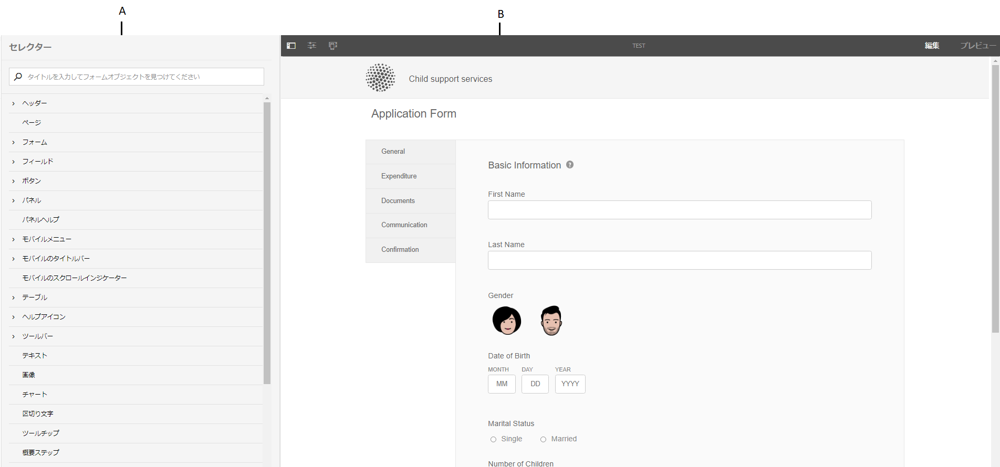](assets/themes-1.png) **A.** サイドバー **B.** キャンバス

### コンポーネントのスタイル設定 {#styling-components}

1 つのテーマを複数のアダプティブフォーム<!-- and interactive communications -->に使用でき、テーマで指定したコンポーネントのフォーマット設定をインポートできます。タイトル、説明、パネル、フィールド、アイコン、テキストボックスなど、様々なコンポーネントのスタイルを設定できます。テーマ内でウィジェットを使用して、コンポーネントのプロパティを設定できます。CSS オーバーライドセクションでは CSS コードを記述することができ、各種カスタムセレクターも用意されているため、CSS や LESS に関する知識は必須ではありませんが、こうした知識があった方が望ましいです。CSS オーバーライドセクションは、サイドバーでコンポーネントを選択すると表示されます。

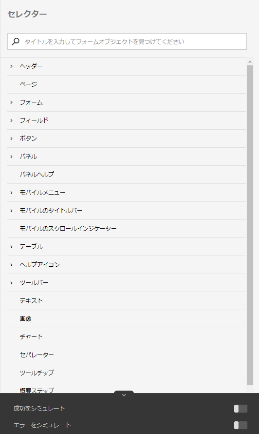

サイドバーの各種オプションを使用して、様々なコンポーネントを選択してスタイルを設定できます。

サイドバーにあるコンポーネントの「編集」ボタンをクリックすることでキャンバスのコンポーネントが選択され、サイドバーのオプションを使用してコンポーネントのスタイルを設定できます。

テキストボックス、数値ボックス、ラジオボタン、チェックボックスのような特定のコンポーネントは、フィールドのような高レベルのコンポーネントで分類されます。例えば、ラジオボタンのスタイル設定をカスタマイズすることができます。スタイル設定のラジオボタンを設定するには、**[!UICONTROL フィールド]**／**[!UICONTROL ウィジェット]**／**[!UICONTROL ラジオボタン]** を選択します。

### パネルレイアウトのスタイル設定 {#styling-panel-layouts-br}

[!DNL AEM Forms] のテーマは、フォームのパネルのレイアウトにある要素のスタイル設定をサポートしています<!-- and  interactive communications -->。そのまま使用できるレイアウトやカスタムのレイアウト要素のスタイル設定がサポートされています。

すぐに使用できるパネルには以下が含まれています。

* 左側のタブ
* 上部のタブ
* アコーディオン
* レスポンシブ
* ウィザード
* モバイルレイアウト

   * ヘッダーのパネルタイトル
   * ヘッダーのパネルタイトルなし

セレクターは、レイアウトごとに異なります。テーマエディターからのカスタムレイアウトのスタイル設定には、以下が含まれます。

* スタイル設定可能なレイアウトのコンポーネントの定義、およびこれらのコンポーネントを一意に認識する CSS セレクター。
* これらのコンポーネントに適用可能な CSS プロパティの定義。
* ユーザーインターフェイスからのインタラクティブなコンポーネントのスタイル設定の定義。

### 画面サイズごとに異なるスタイル {#different-styles-for-different-screen-sizes-br}

デスクトップのレイアウトとモバイルのレイアウトは、わずかにまたは全面的に異なるスタイルになります。モバイルデバイスの場合、タブレットとスマートフォンはコンポーネントのサイズを除き同様のレイアウトを共有します。

テーマエディターのブレークポイントを使用して、様々な画面サイズに応じた代替のスタイル設定を定義します。テーマの構築を開始するベースデバイスまたは解像度を選択すると、他の解像度のスタイルバリエーションが自動的に生成されます。すべての解像度のスタイル設定を明示的に変更することができます。

>[!NOTE]
>
>テーマは、まずフォーム<!-- or interactive communication-->を使用して作成され、それから異なるフォーム<!-- or interactive communications-->に適用されます。テーマの作成に使用されるブレークポイントは、そのテーマが適用されるフォーム<!-- or interactive communication -->とは異なる場合があります。CSS メディアクエリーは、テーマを適用するフォーム<!-- or interactive communication -->ではなく、テーマの作成に使用されているフォーム<!-- or interactive communication -->に基づきます。

### 選択したオブジェクトのサイドバーにおける、スタイル設定プロパティのコンテキストの変更 {#styling-properties-context-changes-in-sidebar-on-selecting-objects}

キャンバスでコンポーネントを選択すると、そのスタイル設定プロパティがサイドバーに一覧表示されます。オブジェクトのタイプと状態を選択して、スタイルを設定します。

### テーマエディターで最近使用したスタイル {#recently-used-styles-in-theme-editor}

テーマエディターは、1 つのコンポーネントに適用される最大 10 個のスタイルをキャッシュします。キャッシュしたスタイルは、別のテーマのコンポーネントで使用できます。最近使用したスタイルは、リストボックスとしてサイドバーで選択したコンポーネントのすぐ下にあります。最初は、最近使用したスタイル一覧は空になっています。

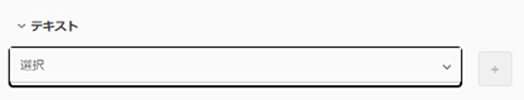

コンポーネントのスタイルを設定すると、そのスタイルはキャッシュされ、リストボックスに一覧表示されます。この例では、テキストボックスのラベルのスタイルを設定して、フォントサイズとカラーを変更します。同様の手順に従って、画像の選択や色の変更を行い、コンポーネントのスタイルを設定することができます。フィールドラベルのスタイル設定が変更されると、スタイルがキャッシュされてリストボックスに一覧表示されます。

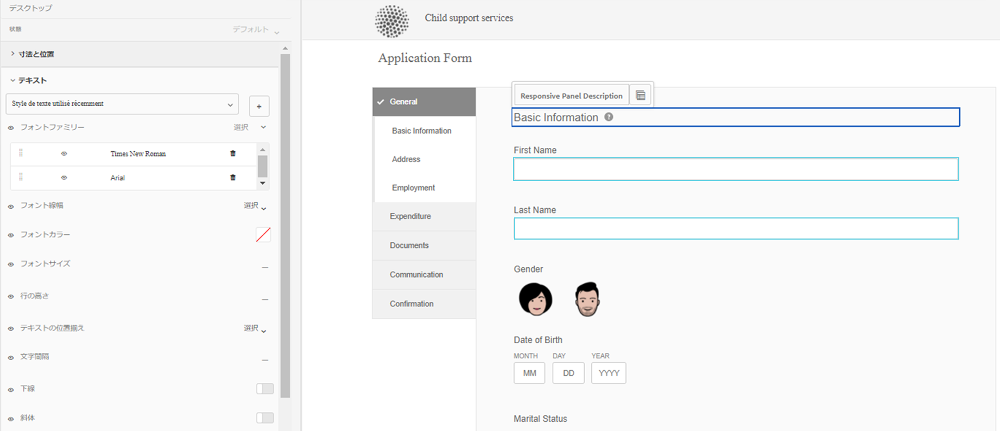

この例ではフィールドラベルのスタイルが変更されています。レスポンシブパネル説明がスタイルとして選択されている場合、リストエントリがアセットライブラリ内に追加されます。アセットライブラリのエントリを使用すると、レスポンシブパネル説明のスタイルを変更できます。

スタイルをアセットライブラリに追加すると、他のテーマに使用できて、フォームエディター UI の[スタイルモード](inline-style-adaptive-forms.md)で利用できます。同様に、フォームエディター<!-- or interactive communication editor -->のスタイルモードを使用してコンポーネントのスタイル設定を行うと、スタイルはキャッシュされ、テーマ内で使用可能になります。

アセットライブラリでプラスボタンを使用すると、スタイルに名前を付けて永続的に保存できます。サイドバーにある「保存」ボタンをクリックしなくても、プラスボタンを使用すると、スタイルを保存してコンポーネントに適用できます。後で使用するためにスタイルを保存するプラスボタンは、スタイルモードでは使用できません。

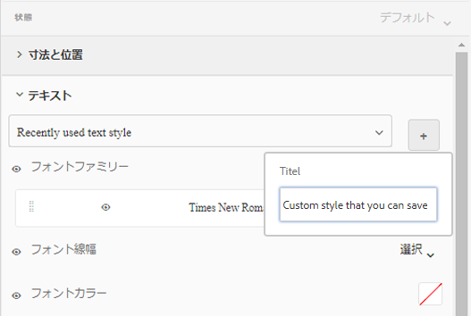

スタイルにカスタム名を付けると、そのスタイルはテーマに関連付けられ、他のテーマでは使用できなくなります。保存したスタイルを削除するには、次の手順を実行します。

1. キャンバスツールバーで、**[!UICONTROL テーマオプション]** ／**[!UICONTROL スタイルを管理]**&#x200B;をクリックします。
1. スタイルを管理ダイアログで、保存したスタイルを選択し、「**[!UICONTROL 削除]**」をクリックします。

   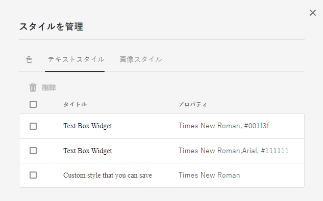

### ライブプレビュー、保存、変更の破棄 {#live-preview-save-and-discard-changes}

スタイル設定で行われた修正は、キャンバスに読み込まれたフォーム<!-- or interactive communication -->に即時反映されます。ライブプレビューを使用すると、スタイル設定をインタラクティブに定義して、その影響を確認できます。コンポーネントのスタイル設定を変更すると、サイドバーの「**[!UICONTROL 完了]**」ボタンが有効になります。変更を保持するには、「**[!UICONTROL 完了]**」ボタンを使用します。

>[!NOTE]
>
>フィールドに無効な文字が入力されると、フィールドの境界線の色が赤に変わり、画面の左上隅にエラーメッセージが表示されます。例えば、数字を入力できるテキストボックスにアルファベットを入力すると、入力ボックスの境界線の色が赤に変わります。画面の中央下部に表示されるエラーを解決しないと、このようなテーマを保存できません。

### テーマと別のアダプティブフォーム {#theme-with-another-adaptive-form}

テーマを作成する際は、テーマエディターに付属するフォームを使用して作成します。このフォームのコンポーネントのスタイル設定を行います。テーマエディターに付属するフォーム<!-- or interactive communication -->の代わりに、指定のフォームを選択して、スタイルを設定し結果を確認することができます。

テーマエディターのキャンバスで現在のフォーム<!-- interactive communication -->を置き換えるには、次の手順を実行します。

1. テーマエディターパネルで、**[!UICONTROL テーマオプション]** ／**[!UICONTROL 設定]**&#x200B;をクリックします。

1. 「一般」タブの「**[!UICONTROL アダプティブフォーム]**」フィールドで、目的のフォーム<!-- or interactive communication -->を参照して選択します。

### やり直し／取り消し {#redo-undo}

意図しない変更を取り消すまたはやり直すことができます。キャンバスの「やり直し／取り消し」ボタンをクリックします。

「やり直し／取り消し」ボタンは、テーマエディターでコンポーネントのスタイルを設定すると表示されます。

## テーマエディターの使用 {#using-the-theme-editor}

テーマエディターでは、作成またはアップロードしたテーマを編集できます。**[!UICONTROL フォームとドキュメント]**／**[!UICONTROL テーマ]**&#x200B;に移動し、テーマを選択して開きます。テーマエディターでテーマが開きます。

上記で説明されているように、テーマエディターにはサイドバーとキャンバスの 2 つのパネルがあります。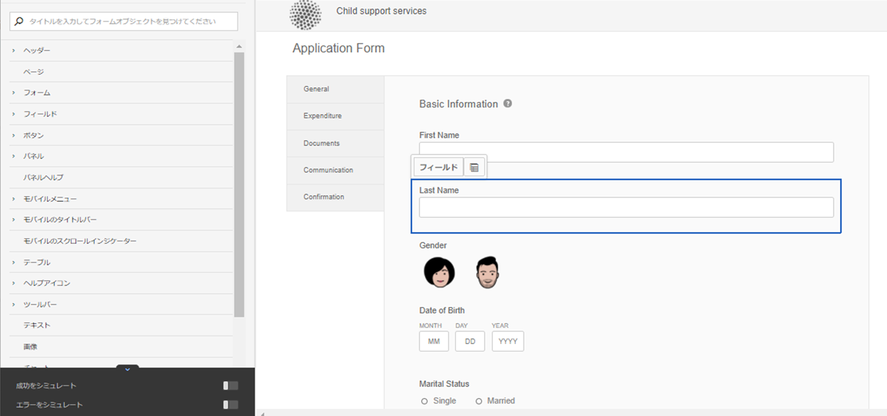

テーマエディターのテキストボックスウィジェットコンポーネントの成功状態スタイル設定をカスタマイズします。キャンバスでコンポーネントを選択し、サイドバーでその状態を選択します。サイドバーで使用できるスタイル設定オプションで、コンポーネントの外観をカスタマイズします。

### キャンバスの使用 {#using-canvas}

テーマは、そのまま使用できるフォーム<!-- or interactive communication -->または選択したフォームのいずれかを使用して作成します。キャンバスは、テーマでカスタマイズの指定を行った、テーマの作成に使用されるフォーム<!-- interactive communication -->のプレビューを表示します。フォーム上部にあるルーラーは、デバイスの表示サイズに応じてレイアウトを決定するために使用します。

キャンバスツールバーには、以下が表示されます。

* **[!UICONTROL サイドパネルを切り替え]** ：サイドバーの表示と非表示を切り替えます。
* **[!UICONTROL テーマオプション]** ：3 つのオプションを提供します。

   * 設定：フォーム<!-- or interactive communication , base clientlib, -->および Adobe Fonts 設定からプレビューを選択するオプションを提供します。
   * テーマ CSS を表示：選択したテーマの CSS が生成されます。
   * スタイルを管理：テキストと画像のスタイルを管理するためのオプションが用意されています。
   * ヘルプ：テーマエディターの画像によるガイドツアーを実行します。

* **[!UICONTROL エミュレーター]** ：異なる画面サイズで、テーマの外観をエミュレートできます。表示サイズは、エミュレーターでブレークポイントとして処理されます。ブレークポイントを選択し、そのスタイルを指定できます。例えば、デスクトップとタブレットは 2 つのブレークポイントです。ブレークポイントごとに異なるスタイルを指定できます。

キャンバスでコンポーネントを選択すると、その上部にコンポーネントツールバーが表示されます。コンポーネントツールバーを使用すると、コンポーネントを選択したり、汎用コンポーネントに切り替えたりできます。例えば、パネルの数値テキストボックスを選択するとします。コンポーネントツールバーには次のオプションが表示されます。

* **[!UICONTROL 数値ボックスウィジェット]**：サイドバーで外観をカスタマイズするコンポーネントを選択できます。
* **[!UICONTROL フィールドウィジェット]**：スタイル設定の汎用コンポーネントを選択できます。この例では、スタイル設定にすべてのテキスト入力コンポーネント（テキストボックス／数値ボックス／数値ステッパー／日付入力）が選択されています。

* ：親コンポーネントを選択してスタイル設定できます。数値ボックスを選択してこのアイコンを選択すると、フィールドコンポーネントが選択されます。フィールドコンポーネントを選択してこのアイコンを選択すると、パネルが選択されます。このアイコンをタップし続けると、最終的にスタイル設定用のレイアウトが選択されます。

>[!NOTE]
>
>コンポーネントのツールバーで使用できるオプションは、選択したコンポーネントにより異なります。

### サイドバーの使用 {#using-rail}

テーマエディターのサイドバーには、テーマ内のコンポーネントのスタイルをカスタマイズし、セレクターを使用するためのオプションが用意されています。セレクターにより、コンポーネントのグループまたは個別のコンポーネントを選択し、サイドバーのセレクターを検索できます。カスタムコンポーネントのセレクターを作成できます。

キャンバスまたはサイドバーのセレクターでコンポーネントを選択する場合、サイドバーにはスタイルをカスタマイズするためのすべてのオプションが表示されます。コンポーネント選択時、サイドバーに表示されるオプションは次のとおりです。

* 状態
* プロパティシート
* 成功／エラーをシミュレート

#### 状態 {#state}

状態は、コンポーネントに対するユーザーインタラクションの指標です。例えば、ユーザーがテキストボックスに誤ったデータを入力した場合、テキストボックスの状態はエラー状態に変わります。テーマエディターにより、特定の状態に対するスタイル設定を指定できます。

状態のスタイルのカスタマイズのオプションは、コンポーネントごとに異なります。

#### プロパティシート {#property-sheet}

<table>
 <tbody>
  <tr>
   <td><strong>Property</strong></td>
   <td><strong>使用方法</strong></td>
  </tr>
  <tr>
   <td>
寸法と位置
 </td>
   <td>
テーマ内のコンポーネントの整列、サイズ、位置、配置のスタイルを設定できます。 
 
オプションは、ディスプレイ設定、余白、マージン、幅、高さおよび Z インデックスです。
 
レイアウトモードを使用すると、ドラッグ＆ドロップが容易なインターフェイスを使用してコンポーネントの幅を定義することもできます。詳しくは、<a href="resize-using-layout-mode.md">レイアウトモードを使用したコンポーネントのサイズ変更</a>を参照してください。
 </td>
  </tr>
  <tr>
   <td>
テキスト
 </td>
   <td>
テーマのコンポーネントのテキストスタイルをカスタマイズできます。
 
例えば、テキストボックスに入力したテキストの見え方を変更するとします。
 
オプションには、フォントファミリー、太さ、カラー、サイズ、行の高さ、テキストの整列、文字間隔、テキストのインデント、下線、斜体、テキストの変換、垂直方向の整列、ベースライン、方向があります。 
 </td>
  </tr>
  <tr>
   <td>
背景 
 </td>
   <td>
コンポーネントの背景を画像または色で塗りつぶします。 
 </td>
  </tr>
  <tr>
   <td>
境界線
 </td>
   <td>
コンポーネントの境界線の外観を選択できます。例えば、テキストボックスに濃い赤の太い境界線を点線で付けるとします。 
 
オプションは、境界線の幅、スタイル、半径および色です。
 </td>
  </tr>
  <tr>
   <td>
効果
 </td>
   <td>
コンポーネントに、不透明度、描画モード、シャドウなどの特殊効果を追加できます。 
 </td>
  </tr>
  <tr>
   <td>
詳細
 </td>
   <td>
以下を追加できます。

    <ul>
     <li>セレクターでデフォルトコンテンツの前後にコンテンツを追加して、そのスタイルを設定するための <code>::before</code> および <code>::after</code> 疑似要素プロパティ。  <a href="https://www.w3schools.com/css/css_pseudo_elements.asp" target="_blank">CSS 疑似要素</a>を参照してください。</li>
     <li>コンポーネントにインラインのカスタム CSS コード。</li>
    </ul> 
カスタムの CSS コードを追加すると、サイドバーのオプションを使用して追加したカスタマイズがオーバーライドされます。 
 </td>
  </tr>
 </tbody>
</table>

#### 成功／エラーをシミュレート {#simulate-error-success}

サイドバーの下部には、「エラーをシミュレート」オプションと「成功をシミュレート」オプションがあります。サイドバーの下部に表示される表示／非表示の矢印を使用すると、これらのオプションを表示できます。テーマエディターを使用して、様々な状態のコンポーネントのスタイルを設定できます。

例えば、フォームに数値フィールドを追加して、テーマエディターでそのスタイル設定を指定します。ユーザーがフィールドに英数字を入力する際に、テキストボックスの背景色を変更するとします。テーマで数値フィールドを選択して、サイドバーにある状態オプションを使用します。サイドバーでエラー状態を選択し、背景色を赤に変更します。動作をプレビューするには、サイドバーにある「エラーをシミュレート」オプションを使用します。「エラーをシミュレート」および「成功をシミュレート」オプションについて、以下で詳しく説明します。

* **成功をシミュレート**：
成功状態のスタイル設定を指定した場合のコンポーネントの見え方を確認できます。例えば、フォームで顧客がパスワードを設定します。ユーザーは、指定されたガイドラインに従ってパスワードを設定できます。指定されたすべてのガイドラインに従ってパスワードを入力すると、テキストボックスが緑色に変わります。テキストボックスが緑色に変わると、成功状態になります。成功状態のコンポーネントのスタイルを指定し、その外観を「成功をシミュレート」オプションを使用してシミュレートできます。

* **エラーをシミュレート**：
エラー状態のスタイル設定を指定した場合のコンポーネントの見え方を確認できます。例えば、フォームで顧客がパスワードを設定します。ユーザーは、指定されたガイドラインに従ってパスワードを設定できます。指定されたガイドラインに従わずにパスワードを入力すると、テキストボックスが赤色に変わります。テキストボックスが赤色に変わると、エラー状態になります。エラー状態のコンポーネントのスタイルを指定し、その外観を「エラーをシミュレート」オプションを使用してシミュレートできます。

### コンポーネントのスタイル設定 {#styling-a-component}

例えば、フォームに 2 つのタイプのテキストボックスがあるとします。一方は数値のみ、もう一方は英数字の値を入力できます。数値のみを入力できるテキストボックス（数値ボックス）のスタイル設定をカスタマイズできます。

特定のコンポーネント（この例では数値ボックス）のスタイル設定をカスタマイズするには、次の手順を実行します。

1. テーマエディターで、キャンバスの数値ボックスを選択します。
1. 数値ボックスを選択すると、オプションが 3 つあるコンポーネントツールバーが表示されます。

   * **[!UICONTROL 数値ボックスウィジェット]**
   * **[!UICONTROL フィールドウィジェット]**

1. **[!UICONTROL 数値ボックスウィジェット]** を選択します。
1. サイドバーのタイトルが「数値ボックスウィジェット」に変わり、外観をカスタマイズするオプションが表示されます。サイドバーの「**[!UICONTROL 寸法と位置]**」オプションを使用して、コンポーネントのサイズをカスタマイズします。状態が&#x200B;**[!UICONTROL デフォルト]**&#x200B;であることを確認してください。

**[!UICONTROL 数値ボックスウィジェット]**&#x200B;を選択する代わりに、コンポーネントツールバーの&#x200B;**[!UICONTROL フィールドウィジェット]**&#x200B;を選択し、上記の手順を実行します。「**[!UICONTROL フィールドウィジェット]**」オプションでサイズを選択すると、数値ボックスを除くすべてのテキストボックスが同じサイズになります。

### 特定の状態のフィールドのスタイル設定 {#styling-fields-given-state}

コンポーネントツールバーを使用して、異なる状態のコンポーネントのスタイルを設定することもできます。例えば、コンポーネントが無効になっている場合、無効状態になります。テーマエディターでスタイルを設定できるコンポーネントの状態としてよく使用されるのは、デフォルト、フォーカス、無効、エラー、成功およびホバーです。キャンバスでコンポーネントを選択して、サイドバーの状態オプションを使用し、外観をカスタマイズできます。

特定の状態のコンポーネントのスタイル設定をカスタマイズするには、次の手順を実行します。

1. キャンバスでコンポーネントを選択し、コンポーネントツールバーから適切なオプションを選択します。サイドバーに、コンポーネントのスタイル設定をカスタマイズするためのオプションが表示されます。
1. サイドバーで状態を選択します（例：エラー状態）。
1. サイドバーの&#x200B;**[!UICONTROL 「境界線」、「背景」]**&#x200B;などのオプションを使用して、コンポーネントの外観をカスタマイズします。
1. サイドバーの下部にある「**[!UICONTROL エラーをシミュレート]**」オプションを使用して、編集時にスタイル設定がどのように見えるかを確認します。

状態を指定した後にコンポーネントのスタイル設定をカスタマイズすると、カスタマイズは指定された状態のコンポーネントにのみ表示されます。例えば、ホバー状態が選択されているときにコンポーネントのスタイル設定をカスタマイズするとします。このカスタマイズは、テーマを適用するレンダリングされたフォーム<!-- or interactive communication -->のコンポーネント上にポインターを移動すると、コンポーネントに現れます。

エラーと成功以外の状態の動作をシミュレートするには、プレビューモードを使用します。プレビューモードを使用するには、ページツールバーにある「**[!UICONTROL プレビュー]**」をクリックします。

### 小型画面向けレイアウトのスタイル設定 {#styling-layouts-for-smaller-displays}

キャンバスのルーラーを使用して、画面が小さいデバイスのブレークポイントを選択します。キャンバスのエミュレーター  をクリックして、ルーラーとブレークポイントを表示します。ブレークポイントでは、電話やタブレットなど様々なデバイスに関する、画面のサイズのフォーム<!-- or interactive communication -->をプレビューできます。テーマエディターでは、複数の画面サイズがサポートされています。

異なるブレークポイントにスタイルを設定するには、次の手順を実行します。

1. キャンバスで、ルーラーの上にあるブレークポイントを選択します。ブレークポイントとは、モバイルデバイスおよびその画面サイズのことです。
1. サイドバーを使用して、選択した画面サイズのテーマのフォーム<!-- or interactive communication -->コンポーネントのスタイル設定をカスタマイズします。
1. カスタマイズ内容を保存します。

複数のデバイスでフォーム<!-- or interactive communication -->のコンポーネントのスタイルを設定することができます。デスクトップおよびモバイルデバイスのフォーム<!-- and interactive communication -->コンポーネントは、全面的に異なるスタイルになります。

### テーマで web フォントを使用 {#using-web-fonts-in-a-theme}

Web サービスで利用可能なフォントをアダプティブフォーム<!-- or interactive communication -->で使用できるようになりました。Adobe の Web フォントサービスである [Adobe Fonts](https://fonts.adobe.com/) は、設定サービスとしてすぐに使用できます。Adobe Fonts を使用するには、キットを作成し、その中にフォントを追加し、[Adobe Fonts](https://fonts.adobe.com/) からキット ID を取得します。

Experience Manager で Adobe Fonts を設定するには、次の手順を実行します。

1. オーサーインスタンスで、 **[!UICONTROL Adobe Experience Manager]**／**[!UICONTROL ツール]** ／**[!UICONTROL デプロイメント]**／**[!UICONTROL Cloud Services]** をクリックします。
1. **[!UICONTROL Cloud Services]** ページで、「**[!UICONTROL Adobe Fonts]**」オプションに移動して開きます。設定フォルダーを開き、「**[!UICONTROL 作成]**」をクリックします。
1. **[!UICONTROL 設定を作成]**&#x200B;ダイアログで、新しい設定のタイトルと名前を指定し、「**[!UICONTROL 作成]**」をクリックします。

   設定ページにリダイレクトされます。

1. コンポーネントを編集ダイアログが表示されるので、キット ID を入力して「**[!UICONTROL OK]**」をクリックします。

テーマを Adobe Fonts 設定を使用するように設定するには、次の手順を実行します。

1. オーサーインスタンスで、テーマエディターにあるテーマを開きます。
1. テーマエディターで、**[!UICONTROL テーマオプション]** ／**[!UICONTROL 設定]**&#x200B;に移動します。
1. 「**[!UICONTROL Adobe Fonts 設定]**」フィールドで、キットを選択して「**[!UICONTROL 保存]**」をクリックします。

   これで、テーマのフォントファミリーのプロパティにフォントが追加されたことが分かります。

<!-- 

### Listing and selecting fonts in theme editor {#listing-and-selecting-fonts-in-theme-editor}

You can use the theme configuration service to add more fonts to the theme editor. Perform the following steps to add fonts:

1. Log in to Experience Manager Web Console with administrative privileges. URL for the Experience Manager Web Console is `https://'[server]:[port]'/system/console/configMgr`.
1. Open **[!UICONTROL Adaptive Form Theme Configuration Service]**.

   

1. Click +, specify the name of the font, and click **Save**. The font is added and available in theme editor. 
-->

#### テーマエディターでのフォントの選択 {#selecting-fonts-in-theme-editor}

「+」ボタンを使用して、フォントを追加できます。フォントを追加すると、サイドバーに表示されます。

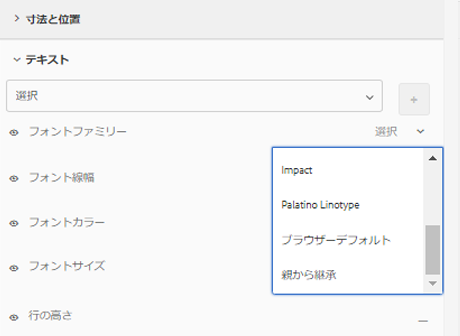

テーマの設定オプションに加えて、テーマエディター自体からフォントを追加することもできます。サイドバーの下にある「フォントファミリー」フィールドに使用するフォントを入力し、キーボードの Return キーを押します。

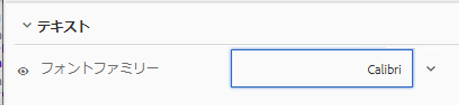

フォントを選択すると、フォントファミリーリストに追加されます。テーマエディターの「マスク」オプションを使用して、リストに表示されているフォントを無効または有効にすることができます。

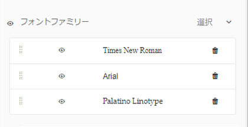

コンポーネントのフォントが変更されたことを確認できます。

「フォントファミリー」フィールドは、複数のフォントをサポートしています。フォントを入力すると、ブラウザーはフォントを検索し、選択したコンポーネントに適用します。フォントが見つからない場合は、ブラウザーは、ファミリー内でそのフォントの横にあるフォントを探します。検索する特定のフォントを入力して開始できます。使用するフォントが見つからない場合は、フォントファミリーに一般的なフォントを入力して使用できます。

#### テーマエディター内で適用されているスタイルをマスク {#mask-styles-applied-in-theme-editor}

テーマ内で適用されているスタイルをマスクできるようになりました。テーマエディターのサイドバーに表示されている  アイコンを使用して、適用されているスタイルを無効にできます。例えば、フォーム<!-- or interactive communication -->内のコンポーネントのサイズを変更した場合、プロパティの左側に表示されているマスクボタンを使用して、そのプロパティを無効にすることができます。テーマを保存すると、選択した「マスク」オプションが保持されます。

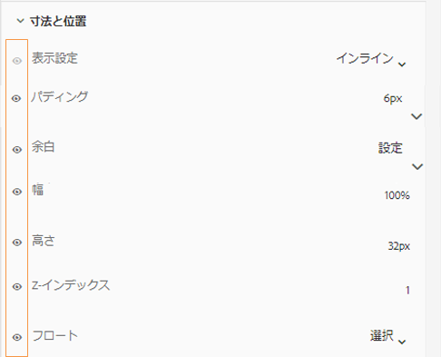

以下の例では、テーマ内でマスクされたスタイルとマスクされていないスタイルを示しています。

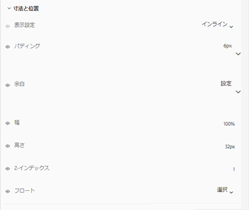

## テーマのフォームへの適用 {#applying-a-theme-to-a-form-or-interactive-communication-br}

テーマをアダプティブフォームに適用するには、次の手順を実行します。

1. フォームを編集モードで開きます。フォームを編集モードで開くには、フォームを選択し、「**[!UICONTROL 開く]**」をクリックします。
1. 編集モードで、コンポーネントを選択し、／**[!UICONTROL アダプティブフォームコンテナ]**&#x200B;をクリックしてから、 をクリックします。

   サイドバーのフォームのプロパティを編集できます。

1. サイドバーで、「**[!UICONTROL スタイル設定]**」をクリックします。
1. 「**[!UICONTROL アダプティブフォームのテーマ]**」ドロップダウンリストからテーマを選択し、**[!UICONTROL 完了]**  をクリックします。

アダプティブフォームの作成時に、アダプティブフォームのテーマを定義することもできます。

<!-- To apply a theme to an interactive communication:

1. Open your interactive communication in edit mode. To open a interactive communication in edit mode, select a form and click **Open**.
1. In the edit mode, select a component, then click  &gt;**Document Container**, and then click .

   You can edit properties of your form in the sidebar.

1. In the sidebar, under **Basic**, select your theme from the **Theme** drop-down and click **Done**  -->

### 実行時にフォームのテーマを変更 {#change-theme-of-a-form-at-runtime}

テーマにより、フォーム内の異なるコンポーネントのスタイルが設定されます。`themeOverride` プロパティを使用して、フォームのテーマを動的に変更できます。フォームの一般的な URL は次のとおりです。

`https://<server>:<port>/content/forms/af/test.html`

themeOverride パラメーターを使用して、実行時にテーマを適用できます。

`https://<server>:<port>/content/forms/af/test.html?themeOverride=/content/dam/formsanddocuments-themes/simpleEnrollmentTheme`

「`themeOverride`」オプションを使用して、テーマにパスを提供できます。これにより、フォームのテーマを変更し、更新されたスタイルを使用してフォームをリフレッシュします。

## テーマを使用した外観の設定 {#specific-af-appearance}

[!DNL AEM Forms] には、すぐに使用できるデフォルトのキャンバステーマ以外に、様々なテーマが用意されています。他のテーマを使用してフォーム<!-- or interactive communication -->をデザインする場合は、変更を追加するとともに、テーマライブラリフォルダーからテーマをコピーします。コピーしたテーマをテーマライブラリフォルダーの外部に貼り付け、コピーしたテーマを必要な変更に応じて編集します。

テーマをコピーするには、次の手順を実行します。

1. オーサーインスタンスで、**[!UICONTROL Adobe Experience Manager]**／**[!UICONTROL Forms]**／**[!UICONTROL テーマ]**&#x200B;に移動します。
1. テーマライブラリフォルダーを開きます。
1. テーマライブラリフォルダーで、対応するすぐに使用可能なテーマにポインターを置いて、「**[!UICONTROL コピー]**」を選択します。
1. コピーしたテーマをテーマライブラリフォルダーの外部に貼り付けます。
1. コピーしたテーマをカスタマイズします。

テーマをカスタマイズした後、これをフォーム<!-- or interactive communication -->に適用します。

>[!NOTE]
>
>テーマライブラリフォルダーにあるテーマに変更を加えないでください。このフォルダーにはシステムテーマが含まれています。これらのテーマに加えた変更は、[!DNL AEM Forms] の新しいバージョンまたはホットフィックスのインストール時にすべて上書きされます。

## 他のアダプティブフォームの使用例への影響 {#impact-on-other-adaptive-form-use-cases}

* **フォームの公開／非公開：**&#x200B;フォームの公開時に、適用するテーマも公開します（まだ公開していない場合）
* **フォームのインポート／エクスポート：**&#x200B;フォームのインポートまたはエクスポートでは、関連するテーマも自動でインポートまたはエクスポートされます。
* **フォームの参照：**&#x200B;フォームの参照の「参照」セクションには、テーマの追加入力が含まれます。
* **フォームの最終変更時間：**&#x200B;関連するテーマが変更されると更新されます。
<!-- * **A/B Testing:** You can apply a different theme to two versions of the form in A/B testing. The information of the two themes is individually stored on the two guide containers. -->

## CSS 生成シーケンス {#css-generation-sequence}

「CSS を表示」を選択すると、テーマエディターはすべてのスタイル設定情報を収集し、CSS を構築します。情報は次の順序で収集されます。

<!-- 1. Styling defined in the theme's base client library. -->
1. サイドバーのプロパティを使用して指定したユーザー定義のスタイル設定。
1. 「CSS 上書き」オプションを使用して指定された CSS スタイル。

例えば、テキストボックスの背景色は、ブルー<!-- in the base client library-->です。サイドバーのプロパティを使用して、ピンクに変更します。CSS を生成すると、テキストボックスの背景色がピンク色になります。プロパティを使用して背景色を変更した後、別の作成者が「CSS 上書き」オプションを使用してテキストボックスの背景色を白に変更できます。CSS を生成すると、生成された CSS の背景色が白になります。

## スタイルのデバッグ {#debugging-styles}

テーマエディターでコンポーネントのスタイルを指定すると、CSS が生成されます。汎用コンポーネントをスタイル設定する場合、これに含まれる複数のコンポーネントもスタイル設定されます。例えば、1 つのフィールドにスタイルを設定すると、そこに含まれるテキストボックスとラベルのスタイルも設定されます。フィールド内のテキストボックスのスタイルを設定すると、その CSS が設定されます。フィールドとコンポーネント用に生成された CSS をデバッグする場合は、テーマエディターに CSS を表示するオプションがあります。

生成された CSS は、次のオプションを使用して確認できます。

* サイドバーの「**CSS を表示**」オプション：テーマでコンポーネントを選択すると、サイドバーに「CSS を表示」オプションが表示されます。`::before`、`::after` 疑似要素を含め、生成された CSS を表示します。
* キャンバスツールバーの「**テーマ CSS を表示**」オプション：キャンバスツールバーで、／**[!UICONTROL テーマ CSS を表示]**&#x200B;をクリックします。テーマエディターで定義したプロパティから生成されたテーマ CSS 全体を表示できます。

## トラブルシューティング、レコメンデーション、ベストプラクティス {#troubleshooting-recommendations-and-best-practices}

* **別のテーマに属するアセットの回避**

  テーマを編集する際、アセット（画像など）を他のテーマから参照して追加することができます。例えば、ページの背景を編集しているとします。例えば、**[!UICONTROL ページ]** ／**[!UICONTROL 背景]**／**[!UICONTROL 追加]**／**[!UICONTROL 画像]**&#x200B;を選択すると、他のテーマの画像を参照して追加することが可能なダイアログが表示されます。

* アセットを別のテーマから追加し、そのテーマが移動または削除されると、現在のテーマに問題が生じる場合があります。他のテーマからアセットを参照して追加しないようにすることをお勧めします。

<!-- * **Using base clientlib, theme editor, and inline styling**

    * **Base clientlib**:

      Base client library contains styling information. To use styling information in client-side libraries in themes.

        1. Navigate to **[!UICONTROL Experience Manager]** &gt; **[!UICONTROL Forms]** &gt; **[!UICONTROL Themes]**.
        1. In the Themes page, select a theme and click **[!UICONTROL Properties]**.
        1. In the Properties page that opens, click **[!UICONTROL Advanced]**.
        1. In the Advanced tab, in the Clientlib Location field, browse, and select the client-library you want to use.
        1. Click **[!UICONTROL Save]**.

      The styling you specify in client library is imported in the theme that uses it. For example, you specify styling for text box, numeric box, and switch in the client library. When you import your client library in the theme, styling for text box, numeric box, and switch is imported. You can then style other components using theme editor. -->
    テーマを作成して、それをコピーし、コピーしたテーマのスタイル設定を変更して同じような用途に使用することもできます。
    詳しくは、「テーマを使用した外観の設定」を参照してください (#specific-af-appearance)
    
    * **テーマエディター：**
    
    テーマエディターを使用すると、フォームのスタイルを設定するテーマを作成できます&lt;!-- またはインタラクティブ通信 -->。テーマでコンポーネントのスタイル設定を指定して、開発中の複数のフォームの外観と操作性を統一できます。まずテーマのスタイル設定情報を指定し、その後でテーマをフォームに適用することをお勧めします。
    
    * **インラインスタイル設定：**
    
    フォームで作業を行う際に、スタイルモードになっているフォーム&lt;！--またはインタラクティブ通信-->のマルチチャネルエディターを使用して、コンポーネントのスタイルを設定できます。スタイルモードを使用してフォームコンポーネントのスタイル設定を変更すると、テーマで指定したスタイル設定は上書きされます。特定のフォームの特定のコンポーネントのスタイル設定を変更する方法については、「コンポーネントのインラインスタイル設定 (inline-style-adaptive-forms.md)
」を参照してください。
<!-- * **Using client-side libraries**

  If you want to create client libraries to import styling information, see [Using Client-Side Libraries](https://experienceleague.adobe.com/docs/experience-manager-cloud-service/implementing/developing/clientlibs.html). After you create a client library, you can import it in your theme using the steps mentioned above. -->

* **コンテナパネルのレイアウト幅の変更**

  コンテナパネルのレイアウト幅の変更はお勧めしません。コンテナパネルの幅を指定すると、幅が静的になり、様々なディスプレイに合わせて調整されません。

* **ヘッダーとフッターを操作する際にフォームエディターまたはテーマエディターを使用する場合**

  テーマエディターは、フォントスタイル、背景、透明度などのスタイル設定オプションを使用してヘッダーとフッターのスタイルを設定する場合に使用します。
ヘッダーにロゴイメージや企業名などの情報を表示し、フッターに著作権情報を表示する場合は、フォームエディターのオプションを使用します。

## 関連トピック {#see-also}

{{see-also}}
