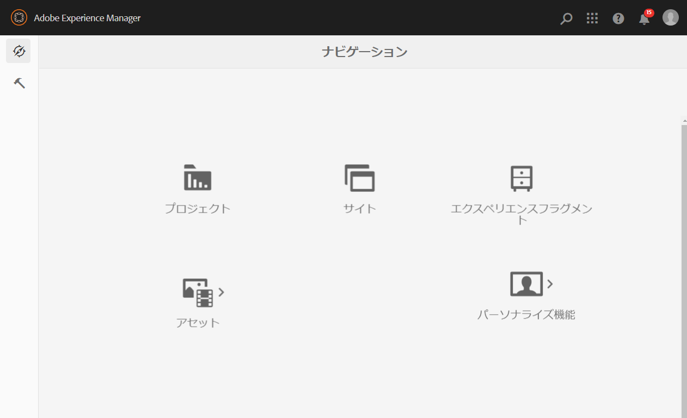
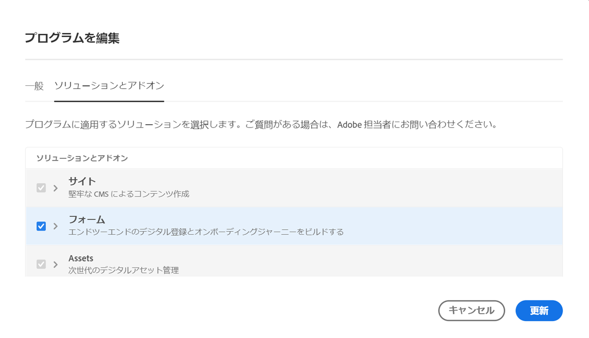

# 設定 {#installation-and-configuration}

Cloud Service 環境の設定中に、次のような問題が発生する場合があります。

## フォームオプションは使用できません

**[!UICONTROL フォーム]**&#x200B;オプションは、**[!UICONTROL ナビゲーション]**&#x200B;ページでは使用できません。

**[!UICONTROL フォーム]**&#x200B;オプションを有効にするには：

1. [Cloud Manager](https://experience.adobe.com/) にログインします
1. プログラムを探して、「」アイコンをクリックします。プログラムの「プログラムを編集」ページが開きます。
1. 「**[!UICONTROL ソリューションとアドオン]**」タブを開きます。
1. 「**[!UICONTROL フォーム]**」オプションを選択し、「**[!UICONTROL 保存]**」をクリックします。

   

1. 実稼働用パイプラインと非実稼働用パイプラインの両方を[作成](https://experienceleague.adobe.com/docs/experience-manager-cloud-manager/using/how-to-use/configuring-pipeline.html?lang=ja#how-to-use)して[実行](https://experienceleague.adobe.com/docs/experience-manager-cloud-manager/using/how-to-use/deploying-code.html?lang=ja)します。

パイプラインが構築およびデプロイされた後、 **[!UICONTROL ナビゲーション]** ページに「**[!UICONTROL フォーム]**」オプションが表示されます。

<!--  
## Environment creation fails {#environment-creation-fails}

Users are unable to create an [!DNL AEM Forms] as a Cloud Service environment. The environment creation fails after running for some time.

A missing profile can lead to environment creation failure. Check that the profile exists in Admin Console. If the profile does not exist, perform the following steps to create the profile:

1. Log in to [Admin Console](https://adminconsole.adobe.com/). Use Adobe ID of administrator provisioned to use Automated Forms Conversion Service to login. Do not any other ID or Federated ID to login.
1. Click the **[!UICONTROL Automated Forms Conversion Service]** option.
1. Click **[!UICONTROL New Profile]** in the Products tab.
1. Specify Name, Display Name, and Description for the profile. Click **[!UICONTROL Done]**. A profile is created.

If the profile exists and issues still persist, contact Adobe Support. -->

## パイプラインの構築失敗 {#build-pipeline-fails}

ユーザーは、ビルドパイプラインを実行できません。パイプラインは、しばらく実行した後に失敗します。

この問題を解決するには、Cloud Manager を開き、ご使用の環境の「**[!UICONTROL 更新]**」オプションを選択して、パイプラインを実行します。

## バンドルがアクティブな状態ではない {#bundles-inactive-state}

問題を解決するには、次の手順に従います。

1. AEM を起動し、すべてのバンドルが起動するまで完全に起動するのを待ちます。
1. AEM を停止します（Ctrl + C キー）。
1. Forms `.far` ファイルをインストールフォルダーに配置します。
1. AEM サーバーを再起動します。