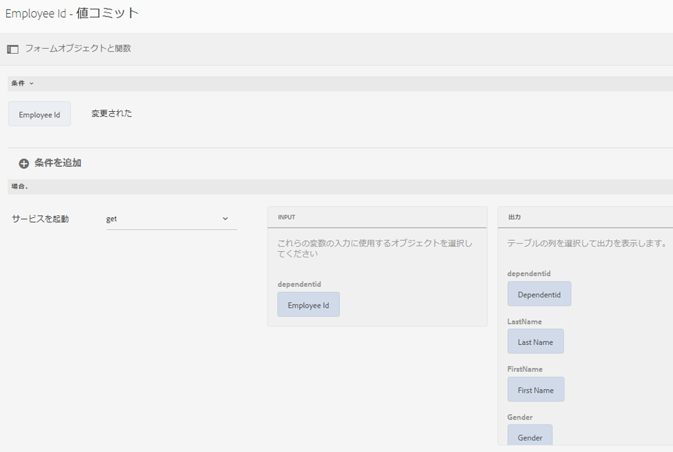

# フォームデータモデルの使用 {#use-form-data-model}

[!DNL Experience Manager Forms] のデータ統合機能により、各種のバックエンドデータソースを使用してフォームデータモデルを作成できます。作成したデータフォームは、様々なアダプティブフォームの<!--and interactive communications-->ワークフローで、スキーマとして使用できます。そのためには、データソースの設定を行い、そのデータソース内の有効なデータモデルオブジェクトとデータモデルサービスに基づいて、フォームデータモデルを作成する必要があります。詳しくは、以下のトピックを参照してください。

* [[!DNL Experience Manager Forms] データ統合](data-integration.md)
* [データソースの設定](configure-data-sources.md)
* [フォームデータモデルの作成](create-form-data-models.md)
* [フォームデータモデルの操作](work-with-form-data-model.md)

JSON スキーマの拡張機能であるフォームデータモデルを使用して、以下の処理を行うことができます。

* [アダプティブフォームとアダプティブフォームフラグメントの作成](#create-af)

<!--* [Create interactive communications and building blocks like text, list, and condition fragments](#create-ic)-->
* [サンプルデータを使用したプレビュー](#preview-ic)
* [フォームデータモデルサービスの使用](#prefill)
* [送信されたアダプティブフォームデータのデータソースへの書き戻し](#write-af)
* [アダプティブフォームのルールを使用したサービスの呼び出し](#invoke-services)

## アダプティブフォームとアダプティブフォームフラグメントの作成 {#create-af}

フォームデータモデルに基づいて、[アダプティブフォーム](creating-adaptive-form.md)とアダプティブフォームフラグメント<!-- [Adaptive Form Fragments](adaptive-form-fragments.md) -->を作成できます。フォームデータモデルを使用してアダプティブフォームまたはアダプティブフォームフラグメントを作成するには、以下の手順を実行します。

1. プロパティを追加画面の「フォームモデル」タブで、**[!UICONTROL 次から選択]**&#x200B;ドロップダウンリストから「**[!UICONTROL フォームデータモデル]**」を選択します。

   

1. 「**[!UICONTROL フォームデータモデルを選択]**」をタップして展開します。すべての有効なフォームデータモデルが一覧表示されます。

   任意のフォームデータモデルを選択します。

   

1. （**アダプティブフォームフラグメントのみ**）フォームデータモデル内の 1 つのデータモデルオブジェクトのみに基づいて、アダプティブフォームフラグメントを作成できます。**[!UICONTROL フォームデータモデル定義]**&#x200B;ドロップダウンを展開します。指定したフォームデータモデル内のすべてのデータモデルオブジェクトがリスト表示されます。リストから、任意のデータモデルオブジェクトを選択します。

   

   フォームデータモデルに基づいてアダプティブフォームまたはアダプティブフォームフラグメントを作成すると、アダプティブフォームエディターのコンテンツブラウザーの「**[!UICONTROL データソース]**」タブにフォームデータモデルオブジェクトが表示されます。

   >[!NOTE]
   >
   >アダプティブフォームフラグメントの場合は、オーサリング時に選択したデータモデルオブジェクトと、そのオブジェクトに関連付けられているデータモデルオブジェクトだけが、「データソース」タブに表示されます。

   

   データモデルオブジェクトをアダプティブフォームまたはアダプティブフォームフラグメントにドラッグ＆ドロップすると、フォームフィールドを追加できます。追加されたフォームフィールドには、メタデータのプロパティが保存されます。また、データモデルオブジェクトプロパティとのバインドに関する情報も保存されます。このバインド情報により、フォームの送信時に、対応するデータソース内のフィールド値が更新され、フォームのレンダリング時に、対応するデータソース内のフィールドに値が取り込まれます。

<!-- ## Create interactive communications {#create-ic}

You can create an interactive communication based on a Form Data Model that you can use to prefill interactive communication with data from configured data sources. In addition, the building blocks of an interactive communication, such as text, list, and condition document fragments can be based on a form data model.

You can choose a Form Data Model when creating an interactive communication or a document fragment. The following image shows the General tab of the Create Interactive Communication dialog.

General tab of Create Interactive Communication dialog

For more information, see:

[Create an interactive communication](create-interactive-communication.md)

[Text in Interactive Communications](texts-interactive-communications.md)

[Conditions in Interactive Communications](conditions-interactive-communications.md)

[List fragments](lists.md) -->

## サンプルデータを使用したプレビュー {#preview-ic}

フォームデータモデルエディターでは、フォームデータモデル内のデータモデルオブジェクト用のサンプルデータを生成して編集できます。このデータを使用して、<!--interactive communications and-->アダプティブフォームをプレビューおよびテストできます。プレビュー表示を行う前に、「[フォームデータモデルの操作](work-with-form-data-model.md#sample)」の説明に従って、サンプルデータを生成する必要があります。

<!--To preview an interactive communication with sample Form Data Model data:

1. On [!DNL  Experience Manager] author instance, navigate to **[!UICONTROL Forms > Forms & Documents]**.
1. Select an interactive communication and tap **[!UICONTROL Preview]** in the toolbar to select **[!UICONTROL Web Channel]**, **[!UICONTROL Print Channel]**, or **[!UICONTROL Both Channels]** to preview the interactive communication.
1. In the Preview [*channel*] dialog, ensure that **[!UICONTROL Test Data of Form Data Model]** is selected and tap **[!UICONTROL Preview]**.

The interactive communication opens with prefilled sample data.

-->

サンプルデータが取り込まれた状態のアダプティブフォームをプレビューするには、オーサーモードでアダプティブフォームを開いて「**[!UICONTROL プレビュー]**」をタップします。

## フォームデータモデルサービスを使用したデータの事前入力 {#prefill}

[!DNL Experience Manager Forms] には、すぐに使用できるフォームデータモデル事前入力サービスが用意されています。フォームデータモデルに基づいて、このサービスをアダプティブフォーム<!--and interactive communications-->で使用できます。この事前入力サービスは、アダプティブフォーム<!--and interactive communication-->内のデータモデルオブジェクトに対してデータソースのクエリを実行し、フォームまたは通信のレンダリング時にデータを事前入力します。

アダプティブフォームに対してフォームデータモデル事前入力サービスを有効にするには、アダプティブフォームコンテナのプロパティを開き、基本アコーディオンの&#x200B;**[!UICONTROL 事前入力サービス]**&#x200B;ドロップダウンで「**[!UICONTROL フォームデータモデル事前入力サービス]**」を選択します。次に、各プロパティを保存します。

<!--To configure Form Data Model prefill service in an interactive communication, you can select Form Data Model Prefill Service in the Prefill Service drop-down while creating it or later by modifying the properties.

Edit Properties dialog for an interactive communication-->

## 送信されたアダプティブフォームデータのデータソースへの書き込み {#write-af}

フォームデータモデルに基づくフォームを送信した場合、そのフォームを設定して、特定のデータモデルオブジェクトに対して送信されたデータをそのデータモデルオブジェクトのデータソースに書き込むことができます。この設定を行うために、[!DNL Experience Manager Forms] には、すぐに使用できる[フォームデータモデル送信アクション](configuring-submit-actions.md)が用意されています。これは、フォームデータモデルをベースとするアダプティブフォーム専用のアクションです。このアクションを実行すると、特定のデータモデルオブジェクトに対して送信されたデータが、そのデータモデルオブジェクトのデータソースに書き込まれます。

フォームデータモデル送信アクションを設定するには、アダプティブフォームコンテナのプロパティを開き、送信アコーディオンの送信アクションドロップダウンで「**[!UICONTROL フォームデータモデルを使用して送信]**」を選択します。次に、**[!UICONTROL 送信するデータモデルオブジェクトの名前]**&#x200B;ドロップダウンで、目的のデータモデルオブジェクトを探して選択します。各プロパティを保存します。

フォームを送信すると、設定されているデータモデルオブジェクトのデータが、各データソースに書き込まれます。

<!---->

バイナリデータモデルオブジェクトのプロパティを使用して、フォームの添付ファイルをデータソースに送信することもできます。添付ファイルを JDBC データソースに送信するには、以下の手順を実行します。

1. バイナリプロパティが含まれているデータモデルオブジェクトをフォームデータモデルに追加します。
1. コンポーネントブラウザーの「**[!UICONTROL 添付ファイル]**」コンポーネントを、アダプティブフォームにドラッグ＆ドロップします。
1. 追加されたコンポーネントをタップして選択し、次に  をタップして、そのコンポーネントのプロパティブラウザーを開きます。
1. 「バインド参照」フィールドで  をタップし、フォームデータモデルに追加したバイナリプロパティに移動してそのプロパティを選択します。必要に応じて、他のプロパティを設定します。

    をタップしてプロパティを保存します。この操作により、添付ファイルフィールドが、フォームデータモデルのバイナリプロパティにバインドされます。

1. アダプティブフォームコンテナプロパティの「送信」セクションで、「**[!UICONTROL フォームの添付ファイルを送信]**」を有効にします。これにより、フォームの送信時に、バイナリプロパティフィールド内の添付ファイルがデータソースに送信されるようになります。

## ルールを使用したアダプティブフォーム内のサービスの呼び出し {#invoke-services}

フォームデータモデルに基づくアダプティブフォームの場合、[ルールを作成](rule-editor.md)して、フォームデータモデル内で設定されているサービスを呼び出すことができます。ルール内の「**[!UICONTROL サービスを起動]**」操作を実行すると、フォームデータモデル内のすべての有効なサービスが一覧表示され、任意のサービスの入力フィールドと出力フィールドを選択できます。「**[!UICONTROL 指定値]**」というルールタイプを使用してフォームデータモデルサービスを呼び出し、そのサービスから返された出力に対するフィールドの値を設定することもできます。

例えば以下のルールの場合、従業員 ID を入力として使用する Get サービスが呼び出され、このサービスから返された値が、フォーム内の対応する扶養家族 ID フィールド、姓フィールド、名フィールド、性別フィールドに設定されます。

また、`guidelib.dataIntegrationUtils.executeOperation` API を使用して、ルールエディターのコードエディターで JavaScript を記述することもできます。<!-- For API details, see [API to invoke Form Data Model service](invoke-form-data-model-services.md).-->
