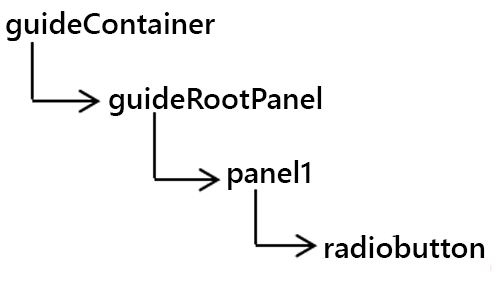
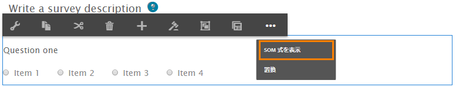
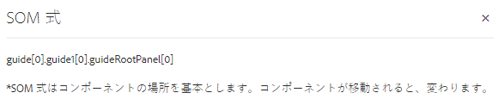

# アダプティブフォームでの SOM 式の使用{#using-som-expressions-in-adaptive-forms}

アダプティブフォームは AEM ページとしてモデル化され、AEM リポジトリーで JCR コンテンツ構造で表示されます。コンテンツ構造のキー要素は guideContainer ノードです。guideContainer の下にある rootPanel にはネストされたパネルやフィールドが含まれる場合があります。

Scripting Object Model（SOM）を使用し、特定の Document Object Model（DOM）内の値、プロパティ、メソッドを参照できます。DOM はメモリのオブジェクトとプロパティをツリー階層で編成します。SOM 式はフィールド／描画の要素とパネルを参照します。

以下の画像は、コンポーネントをフォームに追加する際にアダプティブフォームが変換するノード構造を示しています。例えば、パネルをルートパネルに追加し、実行時に DOM に変換されるパネルにラジオボタンを追加できます。アダプティブフォームのラジオボタンフィールドには、`guide[0].guide1[0].guideRootPanel[0].panel1[0].radiobutton[0]` のように SOM 式を指定します。

DOM ツリー

アダプティブフォーム内のすべての要素の SOM 式には、`guide[0].guide1[0]` というプレフィックスが付けられます。ノード構造階層のコンポーネントの場所は SOM 式の派生に使用されます。

2 つのラジオボタンを持つ DOM ツリー

アダプティブフォームでラジオボタンの位置を変更すると、SOM 式が変更されます。オーサリングモードでは、「SOM 式を表示」オプションを使用して [!DNL AEM Forms] 内のフィールドや要素の SOM 式を表示できます。このオプションはフィールドや要素を右クリックするとパネル上に表示されます。

アダプティブフォームでの SOM 式の抽出

パネル内では、この機能にパネルツールバーからアクセスできます。この機能はアダプティブフォーム作成者のスクリプティングを促進します。

パネルツールバーを使用した SOM 式の抽出

[GuideBridge](https://helpx.adobe.com/jp/aem-forms/6/javascript-api/GuideBridge.html) に一覧表示されている API の一部は、要素の SOM 式を使用します。例えば、アダプティブフォーム内の特定のフィールドにフォーカスを移動するには、対応する SOM 式を `guideBridge` の `getFocus` API に渡します。
