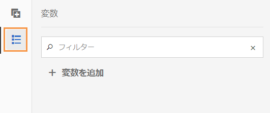
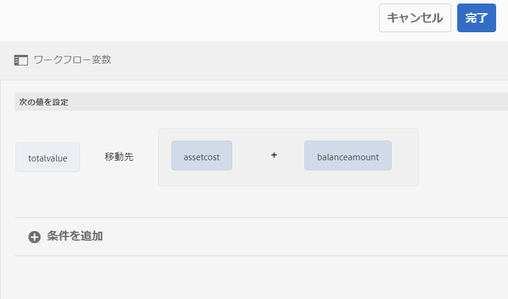
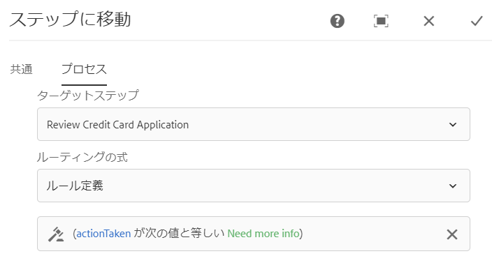

# Forms 中心の AEM ワークフローの変数 {#variables-in-aem-forms-workflows}

| バージョン | 記事リンク |
| -------- | ---------------------------- |
| AEM 6.5 | [ここをクリックしてください](https://experienceleague.adobe.com/docs/experience-manager-65/forms/workflows/variable-in-aem-workflows.html?lang=ja) |
| AEM as a Cloud Service | この記事 |

ワークフローモデルの変数は、そのデータタイプに基づいて値を格納する方法です。ワークフローステップで変数の名前を使用して、変数に格納されている値を取得できます。変数名を使用して、ルーティング上の決定を行う式を定義することもできます。

AEM ワークフローモデルでは、次のことができます。

* 保存する情報タイプに基づいて、データタイプの [変数を作成します](variable-in-aem-workflows.md#create-a-variable)。
* [変数の値を設定する](variable-in-aem-workflows.md#set-a-variable)には、「変数を設定する」ワークフローステップを使用します。
* すべての [!DNL AEM Forms] ワークフローステップで[変数を使用して](variable-in-aem-workflows.md#use-a-variable)格納された値を取得し、OR 分割ステップおよび移動ステップでルーティング式を定義します。

次のビデオでは、AEM ワークフローモデルで変数を作成、設定および使用する方法を示します。

>[!VIDEO](assets/variables_introduction_1_1.mp4)

変数は、既存の [MetaDataMap](https://helpx.adobe.com/jp/experience-manager/6-5/sites/developing/using/reference-materials/javadoc/com/adobe/granite/workflow/metadata/MetaDataMap.html) インターフェイスの拡張です。ECMAScript で [MetaDataMap](https://helpx.adobe.com/jp/experience-manager/6-5/sites/developing/using/reference-materials/javadoc/com/adobe/granite/workflow/metadata/MetaDataMap.html) を使用すると、変数を使用して保存されたメタデータにアクセスできます。

## 変数の作成 {#create-a-variable}

変数は、ワークフローモデルのサイドキックにある「変数」セクションを使用して作成します。AEM ワークフロー変数は、次のデータタイプをサポートしています。

* **プリミティブデータタイプ**：Long、Double、Boolean、Date、String
* **複雑なデータタイプ**：[ドキュメント](https://helpx.adobe.com/jp/experience-manager/6-5/forms/javadocs/com/adobe/aemfd/docmanager/Document.html)、[XML](https://docs.oracle.com/javase/8/docs/api/org/w3c/dom/Document.html?lang=ja)、[JSON](https://static.javadoc.io/com.google.code.gson/gson/2.3/com/google/gson/JsonObject.html?lang=ja)、フォームデータモデルインスタンス。

>[!NOTE]
>
>ワークフローでは、日付型変数に対して ISO8601 形式のみをサポートします。

ArrayList データタイプを使用して、変数コレクションを作成します。すべてのプリミティブデータタイプと複合データタイプに対して ArrayList 変数を作成できます。例えば、ArrayList 変数を作成し、サブタイプとして String を選択して、変数を使用して複数の文字列値を格納します。

変数を作成するには：

1. AEM インスタンスで、ツール／ワークフロー／モデルに移動します。
1. 「**[!UICONTROL 作成]**」を選択し、ワークフローモデルのタイトルとオプションの名前を指定します。モデルを選択し、「**[!UICONTROL 編集]**」を選択します。
1. ワークフローモデルのサイドキックにある使用可能な変数アイコンを選択し、「**[!UICONTROL 変数を追加]**」を選択します。

   

1. 「変数の追加」ダイアログで、名前を指定し、変数のタイプを選択します。
1. 「**[!UICONTROL タイプ]**」ドロップダウンリストからデータタイプを選択し、次の値を指定します。

   * プリミティブデータタイプ - 変数のオプションのデフォルト値を指定します。
   * JSON または XML - オプションの JSON または XML スキーマパスを指定します。システムは、このスキーマで使用可能なプロパティを別の変数にマッピングおよび保存しながら、スキーマパスを検証します。
   * フォームデータモデル（FDM） - フォームデータモデルのパスを指定します。
   * ArrayList - コレクションのサブタイプを指定します。

1. 変数の説明（オプション）を指定し、 を選択して変更を保存します。変数は、左側のペインで使用可能なリストに表示されます。

変数を作成する場合、次のプラクティスをお勧めします。

* ワークフローで必要な数の変数を作成します。ただし、データベースのリソースを確保するため、必要最低限の変数を使用し、必要に応じて変数を再利用してください。
* 変数では大文字と小文字が区別されます。ワークフローで変数を参照する場合には同じように大文字と小文字を区別してください。
* 変数名に特殊文字を使用しないでください。

## 変数の設定 {#set-a-variable}

「変数を設定」ステップを使用して、変数の値を設定し、値が設定される順序を定義できます。変数は、変数の設定ステップで変数のマッピングがリストされている順序で設定されます。

変数値を変更すると、変更が発生したプロセスのインスタンスのみに影響します。例えば、ワークフローが開始され変数データが変更されると、変更はそのワークフローのインスタンスのみに影響します。変更は、以前に開始された、または後で開始されたワークフローの他のインスタンスには影響しません。

変数のデータタイプに応じて、次のオプションを使用して変数の値を設定できます。

* **リテラル：**&#x200B;指定する値が正確に分かっている場合は、このオプションを使用します。また、このオプションを使用して、文字列形式で JSON を指定することもできます。

* **式：**&#x200B;使用する値が式に基づいて計算される場合は、このオプションを使用します。式は、提供された式エディターで作成されます。

* **JSON ドット表記：**&#x200B;このオプションを使用して、JSON または FDM タイプの変数から値を取得します。
* **XPATH：**&#x200B;このオプションを使用して XML タイプ変数から値を取得します。

* **ペイロード基準：**&#x200B;変数として格納する値が、ペイロードを基準としたパスにある場合は、このオプションを使用します。

* **絶対パス：**&#x200B;変数として格納する値が絶対パスにある場合は、このオプションを使用します。

また、JSON DOT 表記法または XPATH 表記法を使用して、JSON または XML タイプの変数の特定の要素を更新することもできます。

### 変数間マッピングの追加 {#add-mapping-between-variables}

変数間にマッピングを追加するには：

1. ワークフローの編集ページで、ワークフローモデルのサイドキックにある「ステップ」アイコンを選択します。
1. 「**[!UICONTROL 変数を設定]**」ステップをワークフローエディターにドラッグ＆ドロップし、ステップを選択して （設定）を選択します。
1. 「変数を設定」ダイアログで、 **[!UICONTROL マッピング]**／**[!UICONTROL マッピングを追加]** を選択します。
1. 「**変数のマップ**」セクションで、データを格納する変数を選択し、マッピングモードを選択して、変数に格納する値を指定します。マッピングモードは、変数のタイプによって異なります。
1. より多くの変数をマップして、意味のある式を作成します。 を選択して、変更を保存します。

### 例 1：XML 変数をクエリして、文字列変数の値を設定 {#example-query-an-xml-variable-to-set-value-for-a-string-variable}

XML タイプの変数を選択し、XML ファイルを格納します。XML 変数をクエリして、XML ファイルで使用可能なプロパティの文字列変数の値を設定します。「**XML 変数に XPATH を指定**」フィールドを使用して、文字列変数に格納するプロパティを定義します。

この例では、**formdata** XML 変数を選択して **cc-app.xml** ファイルを格納します。**formdata** 変数をクエリして、**emailaddress** 文字列変数の値を設定し、**cc-app.xml** ファイルで使用できる **emailAddress** プロパティの値を格納します。

>[!VIDEO](https://helpx.adobe.com/content/dam/help/en/experience-manager/6-5/forms/using/set_variable_example1.mp4 "変数の値を設定")

### 例 2：式を使用して、他の変数に基づいて値を格納 {#example2}

式を使用して変数の和を計算し、結果を変数に格納します。

この例では、式エディターを使用して式を定義し、**assetscost** 変数と **balanceamount** 変数の和を計算し、その結果を **totalvalue** 変数に格納します。

>[!VIDEO](https://helpx.adobe.com/content/dam/help/en/experience-manager/6-5/forms/using/variables_expression.mp4)

## 式エディターの使用 {#use-expression-editor}

実行時の変数の値を計算するのにも式を使用します。変数は、式を定義する式エディターを提供します。

式エディターを使用して、次の操作を行います。

* 他のワークフロー変数、数値または数式を使用して、変数の値を設定します。
* ワークフロー変数、文字列、数値、または式を数式内で使用
* 変数の値を設定する条件を追加します。
* 条件の間に演算子を追加します。



これは、次の変更を加えたアダプティブフォームのルールエディターに基づいています。変数のルールエディター：

* 関数はサポートしていません。
* ルールの概要を表示するための UI は提供していません。
* コードエディターはありません。
* オブジェクトの値の有効化と無効化はサポートしていません。
* オブジェクトのプロパティの設定はサポートしていません。
* Web サービスの呼び出しはサポートしていません。

詳しくは、「[アダプティブフォームのルールエディター](rule-editor.md)」を参照してください。

## 変数を使用 {#use-a-variable}

変数を使用して、入力と出力を取得したり、ステップの結果を保存したりできます。ワークフローエディターには、次の 2 種類のワークフローステップが用意されています。

* 変数をサポートするワークフローステップ
* 変数をサポートしないワークフローステップ

### 変数をサポートするワークフローステップ {#workflow-steps-with-support-for-variables}

移動ステップ、OR 分岐ステップおよびすべての [!DNL AEM Forms] ワークフローステップは変数をサポートしています。

#### OR 分岐ステップ {#or-split-step}

OR 分割は、ワークフロー内に分割を作成し、以降は 1 つの分岐だけがアクティブになります。これを使用すると、ワークフローに条件付き処理パスを導入できます。必要に応じて、各分岐にワークフローステップを追加できます。

分岐のルーティング式は、ルール定義、ECMA スクリプト、または外部スクリプトを使用して定義できます。

変数を使用して、式エディターを使用したルーティング式を定義できます。OR 分割ステップでルーティング式を使用する方法について詳しくは、「[OR 分割ステップ](https://experienceleague.adobe.com/docs/experience-manager-65/developing/extending-aem/extending-workflows/workflows-step-ref.html?lang=ja#or-split)」を参照してください。

この例では、ルーティング式を定義する前に、[例 2 ](variable-in-aem-workflows.md#example2)を使用して **totalvalue** 変数の値を設定します。**totalvalue** 変数の値が 50000 より大きい場合、分岐 1 はアクティブになります。同様に、**totalvalue** 変数の値が 50000 未満の場合に、Branch 2 をアクティブにするルールを定義できます。

>[!VIDEO](https://helpx.adobe.com/content/dam/help/en/experience-manager/6-5/forms/using/variables_orsplit_example.mp4)

同様に、外部スクリプトパスを選択するか、ルーティング式の ECMA スクリプトを指定して、アクティブな分岐を評価します。「**[!UICONTROL 分岐名の変更]**」を選択して、分岐に別名を指定します。

<!-- For more examples, see [Create a workflow model](aem-forms-workflow.md#create-a-workflow-model). -->

#### 移動ステップ {#go-to-step}

**移動ステップ**&#x200B;を使用すると、ルーティング式の結果に応じて、ワークフローモデル内で実行する次のステップを指定できます。

OR 分割ステップと同様に、ルール定義、ECMA スクリプト、または外部スクリプトを使用して、移動ステップのルーティング式を定義できます。

変数を使用して、式エディターを使用したルーティング式を定義できます。移動ステップでルーティング式を使用する方法について詳しくは、「[移動ステップ](https://experienceleague.adobe.com/docs/experience-manager-65/developing/extending-aem/extending-workflows/workflows-step-ref.html?lang=ja#goto-step)」を参照してください。



この例では、**actiontaken** 変数の値が **Need more info** に等しい場合、移動ステップは次のステップとして「Review Credit Card Application」を指定します。

移動ステップでのルール定義の使用するその他の例については、[For ループのシミュレーション](https://experienceleague.adobe.com/docs/experience-manager-65/developing/extending-aem/extending-workflows/workflows-step-ref.html?lang=ja#simulateforloop)を参照してください。

#### Forms 中心のワークフローステップ {#forms-workflow-centric-workflow-steps}

すべての [!DNL AEM Forms] ワークフローステップは、変数をサポートします。詳しくは、 [OSGi での Forms 中心のワークフロー](aem-forms-workflow-step-reference.md) を参照してください。

### 変数をサポートしないワークフローステップ {#workflow-steps-without-support-for-variables}

[MetaDataMap](https://helpx.adobe.com/jp/experience-manager/6-5/sites/developing/using/reference-materials/javadoc/com/adobe/granite/workflow/metadata/MetaDataMap.html) インターフェイスを使用して、変数をサポートしないワークフロー手順の変数にアクセスできます。

#### 変数値の取得 {#retrieve-the-variable-value}

ECMA スクリプトで次の API を使用して、データタイプに基づいて既存の変数の値を取得します。

| 変数データタイプ | API |
|---|---|
| プリミティブ（Long、Double、Boolean、Date、String） | workItem.getWorkflowData().getMetaDataMap().get(variableName, type) |
| ドキュメント | Packages.com.adobe.aemfd.docmanager.Document doc = workItem.getWorkflowData().getMetaDataMap().get(&quot;docVar&quot;, Packages.com.adobe.aemfd.docmanager.Document.class); |
| XML | Packages.org.w3c.dom.Document xmlObject = workItem.getWorkflowData().getMetaDataMap().get(variableName, Packages.org.w3c.dom.Document.class); |
| フォームデータモデル（FDM） | Packages.com.adobe.aem.dermis.api.FormDataModelInstance fdmObject = workItem.getWorkflowData().getMetaDataMap().get(variableName, Packages.com.adobe.aem.dermis.api.FormDataModelInstance.class); |
| JSON | Packages.com.google.gson.JsonObject jsonObject = workItem.getWorkflowData().getMetaDataMap().get(variableName, Packages.com.google.gson.JsonObject.class); |


**例**

次の API を使用して、string データタイプの値を取得します。

```javascript
workItem.getWorkflowData().getMetaDataMap().get(accname, Packages.java.lang.String)
```

#### 変数値の更新 {#update-the-variable-value}

ECMA スクリプトで次の API を使用して、変数の値を更新します。

```javascript
workItem.getWorkflowData().getMetaDataMap().put(variableName, value)
```

**例**

```javascript
workItem.getWorkflowData().getMetaDataMap().put(salary, 50000)
```

**Salary** 変数の値を 50000 に更新します。

### ワークフローを呼び出す変数の設定 {#apiinvokeworkflow}

API を使用して変数を設定し、それらを渡してワークフローインスタンスを呼び出すことができます。

[workflowSession.startWorkflows](https://helpx.adobe.com/experience-manager/6-5/sites/developing/using/reference-materials/javadoc/com/adobe/granite/workflow/WorkflowSession.html#startWorkflow-com.adobe.granite.workflow.model.WorkflowModel-com.adobe.granite.workflow.exec.WorkflowData-java.util.Map-) は、モデル、wfData、metaData を引数として使用します。MetaDataMap を使用して変数の値を設定します。

この API では、 **variableName** 変数は metaData.put(variableName, value) を使用して **value** に設定されます。

```javascript
import com.adobe.granite.workflow.model.WorkflowModel;
import com.adobe.granite.workflow.metadata.MetaDataMap;
import com.adobe.aemfd.docmanager.Document;

/*Assume that you already have a workflowSession and modelId along with the payloadType and payload*/
WorkflowData wfData = workflowSession.newWorkflowData(payloadType, payload);
MetaDataMap metaData = wfData.getMetaDataMap();
metaData.put(variableName, value); //Create a variable "variableName" in your workflow model
WorkflowModel model = workflowSession.getModel(modelId);
workflowSession.startWorkflow(model, wfData, metaData);
```

**例**

**doc** ドキュメントオブジェクトをパス (&quot;a/b/c&quot;) に初期化し、**docVar** 変数の値をドキュメントオブジェクトに格納されているパスに設定します。

```javascript
import com.adobe.granite.workflow.WorkflowSession;
import com.adobe.granite.workflow.exec.WorkflowData;
import com.adobe.granite.workflow.model.WorkflowModel;
import com.adobe.granite.workflow.metadata.MetaDataMap;
import com.adobe.aemfd.docmanager.Document;

/*This example assumes that you already have a workflowSession and modelId along with the payloadType and payload */
WorkflowData wfData = workflowSession.newWorkflowData(payloadType, payload);
MetaDataMap metaData = wfData.getMetaDataMap();
Document doc = new Document("/a/b/c");// initialize a document object
metaData.put("docVar",doc); //Assuming that you have created a variable "docVar" of type Document in your workflow model
WorkflowModel model = workflowSession.getModel(modelId);
workflowSession.startWorkflow(model, wfData, metaData);
```

## 変数の編集 {#edit-a-variable}

1. ワークフローの編集ページで、ワークフローモデルのサイドキックにある「変数」アイコンを選択します。左側のペインの「変数」セクションには、既存のすべての変数が表示されます。
1. 編集する変数名の横にある「」アイコンを選択します。
1. 変数情報を編集し、 を選択して変更を保存します。変数の「**[!UICONTROL 名前]**」フィールドと「**[!UICONTROL タイプ]**」フィールドは編集できません。

## 変数の削除 {#delete-a-variable}

変数を削除する前に、ワークフローから変数のすべての参照を削除します。この変数がワークフローで使用されていないことを確認します。

変数を削除するには：

1. ワークフローの編集ページで、ワークフローモデルのサイドキックにある「変数」アイコンを選択します。左側のペインの「変数」セクションには、既存のすべての変数が表示されます。
1. 削除する変数名の横にある「削除」アイコンを選択します。
1.  を選択して、変数を確認して削除します。

## 参照 {#references}

[!DNL AEM Forms] ワークフローステップで変数を使用するその他の例については、[AEM ワークフローの変数](https://experienceleague.adobe.com/docs/experience-manager-learn/forms/variables-aem-workflow/introduction.html?lang=ja)を参照してください。
