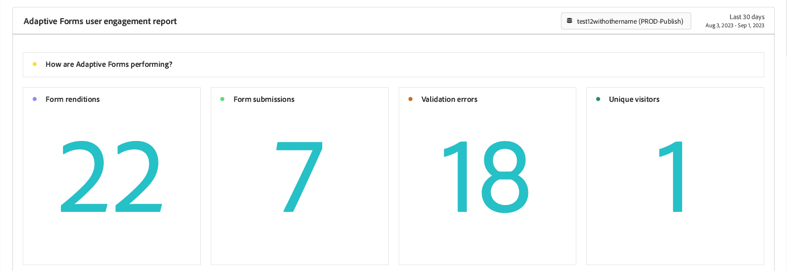
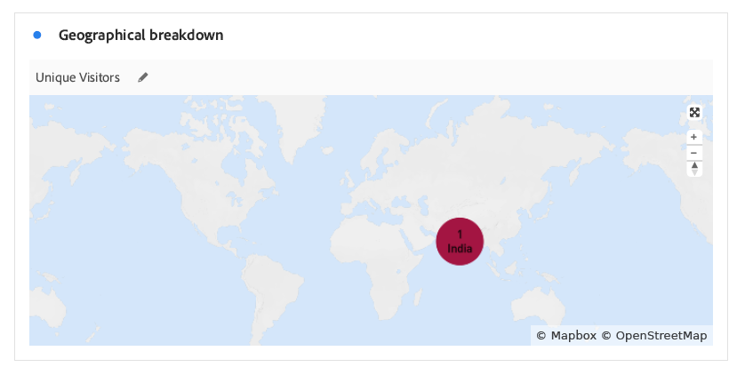

# Adaptive Forms 分析レポートの表示と理解 {#viewing-and-understanding-aem-forms-analytics-reports}

| バージョン | 記事リンク |
| -------- | ---------------------------- |
| AEM as a Cloud Service | この記事 |
| AEM 6.5 | [ここをクリックしてください](https://experienceleague.adobe.com/docs/experience-manager-65/forms/integrate-aem-forms-with-experience-cloud-solutions/view-understand-aem-forms-analytics-reports.html) |

急速に進化するデジタル分析の状況では、十分な情報に基づく意思決定を行い、デジタルエクスペリエンスを最適化するために、グローバルなトレンドに常に従うことが不可欠です。これに対応するため、Adaptive Forms は Adobe Analytics とシームレスに統合して、公開済みのフォームやドキュメントのパフォーマンス指標を取得し、追跡します。これらの指標の分析の目的は、指標と分析を使用してフォームの使いやすさと効果を高め、データ主導型の意思決定を行うことです。

主要業績評価指標を取り込んで追跡することで、企業は改善点を特定し、ユーザーエクスペリエンスを最適化し、最終的により良い結果をもたらして、優れた顧客体験を生み出すことができます。

## Adobe Analytics を Adaptive Forms に設定する {#setup-adobe-analytics-to-aem-forms}

AEM Forms Analytics レポートの場合、まず、Experience Cloud の設定自動化を通じてAdobe Analytics を AEM Forms に統合します。Adaptive Forms での Experience Cloud の設定自動化には、Adobe Analytics ライセンス、追跡スクリプトを管理するためのデータ収集（旧 Adobe Launch）および合理化されたデータ集計と分析情報生成のための Experience Platform Launch API との統合が必要です。完全なセットアップ情報については、[Experience Cloud Setup Automation を使用して Adaptive Form の Adobe Analytics を有効にする](/help/forms/enable-adobe-analytics-adaptive-form-using-experience-cloud-setup-automation.md)を参照してください。

>[!CAUTION]
>
>Experience Cloud設定の自動化機能は廃止されました。

## アダプティブフォームの Adobe Analytics レポートの表示 {#view-adobe-analytics-report}

1. AEM インスタンスで、**[!UICONTROL Forms]**／**[!UICONTROL フォームとドキュメント]**&#x200B;に移動します。
1. フォームを選択すると、左側に示すように、Adobe Analytics が Adobe Analytics 用にアクティベートされたフォームに統合されていることがわかります。

   {width="100%"}

1. 「**Adobe Analytics**」をクリックしてレポートを表示し、パフォーマンスデータを分析します。

## Adaptive Forms 分析レポートについて {#understanding-aem-forms-analytics-reports}

Adobe Analytics は、フォームの使用状況に関する貴重なインサイトを提供するように設計された、アダプティブフォームのパフォーマンス指標の包括的な配列を提供します。これらの指標を以下に示します。

### **Adaptive Forms のパフォーマンス？** {#how-your-adaptive-form-is-performing}

これには、フォームのレンディション数、フォームの送信数、検証エラー数、ユニーク訪問者数などの指標があり、フォームの使用状況と有効性を評価できます。

* **フォームのレンディション数**：フォームのレンディション数は、フォームがレンダリングまたは開かれた回数を表示します。

* **フォームの送信数**：フォームの送信数は、アダプティブフォームが正常に実行され、ユーザーによって送信された回数を示します。

* **検証エラー数**：検証エラー数は、フォームのフィールドで発生した検証関連のエラーの合計数を表示します。

* **ユニーク訪問者数**：ユニーク訪問者数は、訪問者がフォームをレンダリングした回数を表します。ユニーク訪問者について詳しくは、[ユニーク訪問者、訪問、顧客の行動](https://experienceleague.adobe.com/docs/analytics/components/metrics/visits.html)を参照してください。

  {width="100%"}

### **フォームへの訪問者数** {#visitors-to-your-forms}

これにより、フォーム上の訪問者のアクティビティに関する有益なインサイトを得ることができます。

* **訪問と送信**：これには、特定の日付範囲におけるフォームへの訪問頻度と、それに対応するフォーム送信数が記載されています。詳しくは、「[訪問](https://experienceleague.adobe.com/docs/analytics/components/metrics/visits.html)」をクリックしてください。
* **ユニーク訪問者数と合計訪問数**：新しい訪問者と再訪問者を区別します。例えば、ある訪問者が 1 か月間毎日サイトを訪問しても、1 人のユニーク訪問者としてカウントすることができます。詳しくは、[ユニーク訪問者数](https://experienceleague.adobe.com/docs/analytics/components/metrics/unique-visitors.html)を参照してください。

  {width="100%"}

### **デバイスタイプ** {#device-type}

デバイスタイプを使用すると、フォームへのアクセスに使用されたデバイスの種類を識別できます。これは、デバイスタイプをモバイルデバイスタイプとして分類します。例えば、この場合は「モバイルデバイスタイプ」が「その他」に、「モバイルデバイスタイプ」が「携帯電話」になります。モバイルデバイスには様々な種類があり、携帯電話、タブレット、メディアプレーヤー、ゲームコンソールなどが含まれます。

{width="100%"}

### **地理的分類** {#geographical-breakdown}

フォームがどの場所からアクセスされたかを表示します。これは、フォームユーザーに関する地域固有の情報を提供します。例えば、フォームユーザーに関する地域固有の情報は、図の例ではインドであることがわかります。

{width="100%"}

### **主なトラフィックソースと人気の高いフォーム** {#top-sources-of-traffic-and-popular-forms}

これにより、フォームの参照元となる主なソースやリンクを識別できます。例えば、以下の図では、アダプティブフォームの検索インスタンスが表示されており、18.9％が&#x200B;**手動入力またはブックマークから**、70.49％が&#x200B;**検索エンジン**&#x200B;を基にして、24％が&#x200B;**別の web サイト**&#x200B;からのものです。ディメンション項目は要件に基づいて定義できます。また、最も訪問回数の多いフォームと人気の高いフォームで並べ替えることもできます。

{width="100%"}

### **上位フォーム上のユーザーアクティビティ** {#user-activity-on-top-forms}

フィールド訪問数、フォームレンディション数、検証エラー数、破棄されたフォーム数、フォーム送信数に関するユーザーのエンゲージメントを包括的に表示することで、最もアクティブなフォームに関するインサイトを得ることができます。以下の画像では、フォームイベント指標に基づくと、申請フォームが最もアクティブであることがわかります。

{width="100%"}

### **フォームに費やした時間のタイムライン** {#timeline-for-time-spent-on-forms}

ユーザーが時間の経過と共にフォームに費やした時間から、エンゲージメントパターンを特定することができます。

{width="100%"}

### **訪問者がフォームに記入する際にサポートが必要なエリア** {#areas-requiring-assistance}

ヘルプビュー数、検証エラー数、フィールド訪問数などの指標により、ユーザーがサポートを必要とする場所や、フィールド内のエラーを追跡する方法が明らかになります。例えば、以下の画像では、**フルネーム**、**電話番号**、**DoB** などのフィールドを含むフォームが示されています。「**フルネーム**」フィールドには 12 回の訪問があり、12 回の訪問のうち 8 回の訪問で検証エラーが発生し、このフィールドのヘルプビューのヘルプアイコンが 1 回クリックされました。他のフォームフィールドの指標データを表示できます。

{width="100%"}

### **訪問者がフォームを破棄する前に表示した最後のフォームフィールド** {#last-form-field-that-visitors-viewed}

これは、ユーザーがフォームを破棄する前に時間を費やしたフォームフィールドを分析するのに役立ちます。例えば、以下の画像では、破棄された 5 つのフォームのうち、「**フルネーム**」フィールドから 2 つが離れ、「**電話番号**」フィールドから 2 つが離れ、「**テキスト入力**」フィールドから 1 つが離れました。

{width="100%"}

## 関連トピック {#see-also}

* [Experience Cloud 設定自動化を使用してアダプティブフォームの Adobe Analytics を有効にする](/help/forms/enable-adobe-analytics-adaptive-form-using-experience-cloud-setup-automation.md)
* [AEM Sites ページまたはエクスペリエンスフラグメントにアダプティブフォームの追加](/help/forms/create-or-add-an-adaptive-form-to-aem-sites-page.md)
* [AEM Forms と Adobe Analytics の統合](/help/forms/integrate-aem-forms-with-adobe-analytics.md)
