# フォームデータモデルの操作 {#work-with-form-data-model}


フォームデータモデルエディターには、フォームデータモデルの編集と設定を行うための直感的なユーザーインターフェイスが用意されています。フォームデータモデル内の関連データソースでこのエディターを使用して、データモデルオブジェクト、プロパティ、サービスの追加と設定を行うことができます。また、データソースを持っていないデータモデルオブジェクトとプロパティを作成し、後でそれらのオブジェクトとプロパティにデータソースを連結することもできます。さらに、データモデルオブジェクトのプロパティ用にサンプルデータを生成して編集し、これらのプロパティを使用してアダプティブフォーム<!--and interactive communications-->にデータを取り込み、プレビュー表示することもできます。フォームデータモデル内で設定したデータモデルオブジェクトとサービスのテストを実行することにより、そのフォームデータモデルがデータソースと正しく統合されているかどうかを確認できます。

AEM Forms のデータ統合機能を初めて使用する場合や、これまでにデータソースの設定やフォームデータモデルの作成を行ったことがない場合は、以下のトピックを参照してください。

* [[!DNL Experience Manager Forms] データ統合](data-integration.md)
* [データソースの設定](configure-data-sources.md)
* [フォームデータモデルの作成](create-form-data-models.md)

ここからは、フォームデータモデルエディターを使用して実行できる様々なタスクや設定について説明します。

>[!NOTE]
>
>フォームデータモデルの作成と操作を行うには、**fdm-author** グループと **forms-user** グループのメンバーである必要があります。これらのグループのメンバーになるには、[!DNL Experience Manager] の管理者に依頼してください。

## データモデルオブジェクトとサービスの追加 {#add-data-model-objects-and-services}

データソースを持つフォームデータモデルが既に作成されている場合は、フォームデータモデルエディターを使用して、データモデルオブジェクトとサービスの追加、各種プロパティの設定、データモデルオブジェクト間の関連付けの定義、フォームデータモデルとサービスのテストを行うことができます。

フォームデータモデル内の有効なデータソースを使用して、データモデルオブジェクトとサービスを追加することができます。追加したデータモデルオブジェクトは「モデル」タブに表示され、追加したサービスは「サービス」タブに表示されます。

データモデルオブジェクトとサービスを追加するには、以下の手順を実行します。

1. [!DNL Experience Manager] オーサーインスタンスにログインして&#x200B;**[!UICONTROL フォーム／データ統合]**&#x200B;に移動し、データモデルオブジェクトを追加するフォームデータモデルを開きます。
1. データソースペインでデータソースを展開して、使用可能なデータモデルオブジェクトとサービスを表示します。
1. フォームデータモデルに追加するデータモデルオブジェクトとサービスを選択して、「**[!UICONTROL 選択項目を追加]**」をタップします。

   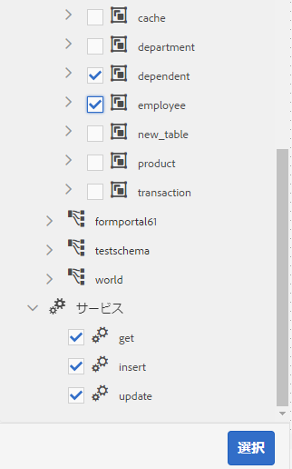

   選択されたデータモデルオブジェクトとサービス

   「**[!UICONTROL モデル]**」タブには、フォームデータモデルに追加されたすべてのデータモデルオブジェクトのグラフィカル表現と、それらのオブジェクトのプロパティが表示されます。フォームデータモデル内の各データモデルオブジェクトは、ボックスを使用して表現されます。

   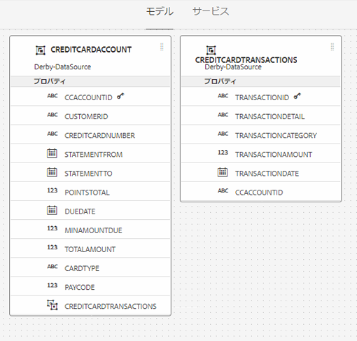

   追加したデータモデルオブジェクトが表示された「**[!UICONTROL モデル]**」タブ

   >[!NOTE]
   >
   >データモデルオブジェクトのボックスを選択してドラッグすると、コンテンツ領域内にデータモデルオブジェクトを配置できます。フォームデータモデルに追加されたデータモデルオブジェクトは、データソースペイン内ではすべてグレーアウトされます。

   「**[!UICONTROL サービス]**」タブには、追加されたサービスが一覧表示されます。

   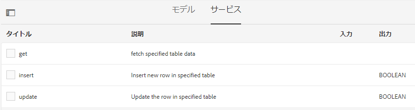

   データモデルサービスが表示された「**[!UICONTROL サービス]**」タブ

   >[!NOTE]
   >
   >OData サービスのメタデータドキュメントには、データモデルオブジェクトとサービスのほかに、2 つのデータモデルオブジェクト間の関連付けを定義するナビゲーションプロパティが含まれます。詳しくは、「[OData サービスのナビゲーションプロパティの操作](#work-with-navigation-properties-of-odata-services)」を参照してください。

1. 「**[!UICONTROL 保存]**」をタップして、フォームモデルオブジェクトを保存します。

   >[!NOTE]
   >
   >アダプティブフォームのルールを使用して、フォームデータモデルの「サービス」タブで設定したサービスを呼び出すことができます。設定したサービスは、ルールエディターの「サービスを起動」アクションで使用できます。設定したサービスをアダプティブフォームルールで使用する方法については、「[ルールエディター](rule-editor.md)」で、「サービスを起動」ルールと「指定値」ルールに関する説明を参照してください。

## データモデルオブジェクトと子プロパティの作成 {#create-data-model-objects-and-child-properties}

### データモデルオブジェクトの作成 {#create-data-model-objects}

設定済みデータソースからデータモデルオブジェクトを追加することができますが、データソースを持っていないデータモデルオブジェクトやデータモデルエンティティを作成することもできます。この方法は、フォームデータモデル内でデータソースが設定されていない場合に使用すると、特に便利です。

データソースを持っていないデータモデルオブジェクトを作成するには、以下の手順を実行します。

1. [!DNL Experience Manager] オーサーインスタンスにログインして&#x200B;**[!UICONTROL フォーム／データ統合]**&#x200B;に移動し、データモデルオブジェクトまたはデータモデルエンティティを作成するフォームデータモデルを開きます。
1. 「**[!UICONTROL エンティティを作成]**」をタップします。
1. [!UICONTROL データモデルを作成]ダイアログで、データモデルオブジェクトの名前を指定して「**[!UICONTROL 追加]**」をタップします。データモデルオブジェクトがフォームデータモデルに追加されます。以下の図に示すように、新しく追加されたデータモデルオブジェクトは、データソースには連結されません。また、プロパティも設定されません。

   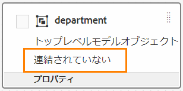

次に、データソースに連結されていないデータモデルオブジェクトで、子プロパティを追加します。

### 子プロパティの追加 {#child-properties}

フォームデータモデルエディターを使用すると、データモデルオブジェクト内で子プロパティを作成できます。作成した時点では、子プロパティはデータソース内のどのプロパティにも連結されません。作成した子プロパティは、データモデルオブジェクト内の別のプロパティに後で連結することができます。

子プロパティを作成するには、以下の手順を実行します。

1. フォームデータモデルでデータモデルオブジェクトを選択して「**[!UICONTROL 子プロパティを作成]**」をタップします。
1. **[!UICONTROL 子プロパティを作成]**&#x200B;ダイアログの「**[!UICONTROL 名前]**」フィールドと「**[!UICONTROL タイプ]**」フィールドで、子プロパティの名前とタイプを指定します。必要に応じて、子プロパティのタイトルと説明を指定することもできます。
1. 作成するプロパティが計算済みプロパティの場合は、「計算済み」を有効にします。計算済みプロパティの値は、ルールまたは式に基づいて評価されます。詳しくは、「[プロパティの編集](#properties)」を参照してください。
1. データモデルオブジェクトをデータソースに連結すると、追加した子プロジェクトが親データモデルオブジェクトのプロパティに自動的に連結されます。その際、子プロパティの名前とデータタイプは変わりません。

   子プロパティをデータモデルオブジェクトのプロパティに手動で連結するには、「**[!UICONTROL 参照をバインド]**」フィールドの横に表示されている参照アイコンをタップします。**[!UICONTROL オブジェクトの選択]**&#x200B;ダイアログに、親データモデルオブジェクトのすべてのプロパティが一覧表示されます。連結するプロパティを選択して、チェックマークアイコンをタップします。子プロパティと異なるデータタイプのプロパティを選択することはできません。

1. 「**[!UICONTROL 完了]**」をタップして子プロパティを保存し、「**[!UICONTROL 保存]**」タップしてフォームデータモデルを保存します。これで、子プロパティがデータモデルオブジェクトに追加されました。

データモデルオブジェクトとプロパティを作成したら、フォームデータモデルに基づいて、アダプティブフォーム<!--and interactive communications-->を作成できます。データソースの設定が完了した時点で、フォームデータモデルをデータソースに連結できます。関連するアダプティブフォーム<!--and interactive communications-->では、連結が自動的に更新されます。フォームデータモデルを使用してアダプティブフォーム<!--and interactive communications-->を作成する方法については、「[フォームデータモデルの使用](using-form-data-model.md)」を参照してください。

### データモデルオブジェクトとプロパティの連結 {#bind-data-model-objects-and-properties}

フォームデータモデルに統合するデータソースが使用可能な状態になったら、「[データソースの更新](create-form-data-models.md#update)」に記載されている説明に従って、データソースをフォームデータモデルに追加できます。その後、以下の手順を実行して、データソースに連結されていないデータモデルオブジェクトとプロパティを連結します。

1. フォームデータモデルで、データソースに連結するデータソースを選択します。
1. 「**[!UICONTROL プロパティを編集]**」をタップします。
1. **[!UICONTROL プロパティを編集]**&#x200B;ペインで、「**[!UICONTROL 連結]**」フィールドの横に表示されている参照アイコンをタップします。この操作により、**[!UICONTROL オブジェクトの選択]**&#x200B;ダイアログが表示されます。このダイアログには、フォームデータモデル内に追加されたデータソースが一覧表示されます。

   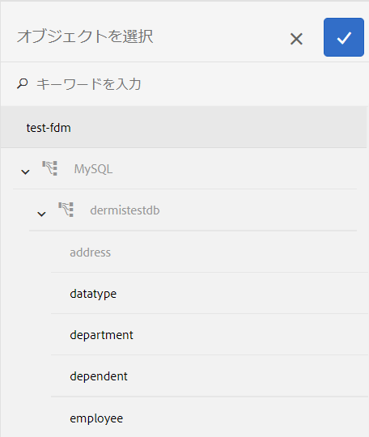

1. データソースツリーを展開し、連結するデータモデルオブジェクトを選択してチェックマークアイコンをタップします。
1. 「**[!UICONTROL 完了]**」をタップしてプロパティを保存し、「**[!UICONTROL 保存]**」をタップしてフォームデータモデルを保存します。これで、データモデルオブジェクトがデータソースに連結されました。これ以降は、データモデルオブジェクトに「連結されていない」というテキストが表示されることはありません。

   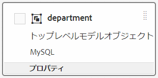

## サービスの設定 {#configure-services}

データモデルオブジェクトのデータの読み取りと書き込みを行うには、以下の手順を実行して、読み取りサービスと書き込みサービスを設定します。

1. データモデルオブジェクト上部のチェックボックスを選択して「**[!UICONTROL プロパティを編集]**」をタップします。

   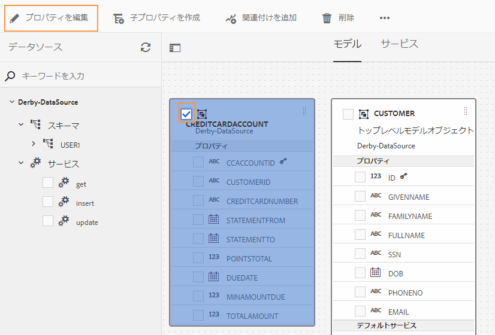

   データモデルオブジェクトの読み取りサービスと書き込みサービスの設定を行う「プロパティを編集」

   [!UICONTROL プロパティを編集]ダイアログが表示されます。

   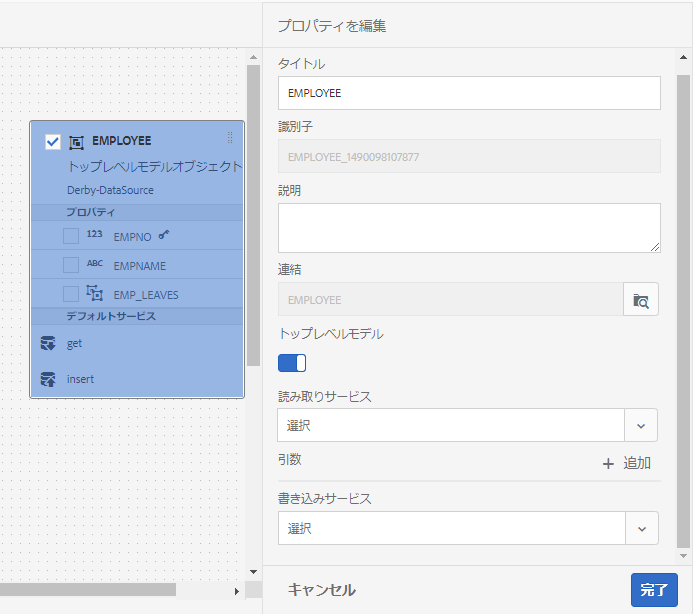

   プロパティを編集ダイアログ

   >[!NOTE]
   >
   >OData サービスのメタデータドキュメントには、データモデルオブジェクトとサービスのほかに、2 つのデータモデルオブジェクト間の関連付けを定義するナビゲーションプロパティが含まれます。OData サービスのデータソースをフォームデータモデルに追加すると、フォームデータモデルでデータモデルオブジェクト内のすべてのナビゲーションプロパティが有効になるサービスを使用できます。このサービスを使用して、対応するデータモデルオブジェクトのナビゲーションプロパティを読み取ることができます。
   >
   >
   >このサービスの使用について詳しくは、「[OData サービスのナビゲーションプロパティの操作](#work-with-navigation-properties-of-odata-services)」を参照してください。

1. 「**[!UICONTROL トップレベルオブジェクト]**」を切り替えて、データモデルオブジェクトを最上位のモデルオブジェクトにするかどうかを指定します。

   フォームデータモデルで設定したデータモデルオブジェクトは、そのフォームデータモデルに基づいて、アダプティブフォームのコンテンツブラウザーの「データモデルオブジェクト」タブで使用できます。2 つのデータモデルオブジェクト間の関連付けを追加すると、「**[!UICONTROL データモデルオブジェクト]**」タブで、関連付け先のデータモデルオブジェクトが、関連付け元のデータモデルオブジェクトの下にネストされます。ネストされたデータモデルが最上位のオブジェクトである場合は、「**[!UICONTROL データモデルオブジェクト]**」タブにもそのデータモデルが個別に表示されます。この場合、ネストされた階層の内側と外側に 1 つずつデータモデルのエントリが表示されるので、フォームの作成者が混乱する可能性があります。関連するデータモデルオブジェクトをネストされた階層内だけで表示するには、そのデータモデルオブジェクトの「トップレベルオブジェクト」プロパティを無効にします。

1. 選択したデータモデルオブジェクトの読み取りサービスと書き込みサービスを選択します。各サービスの引数が表示されます。

   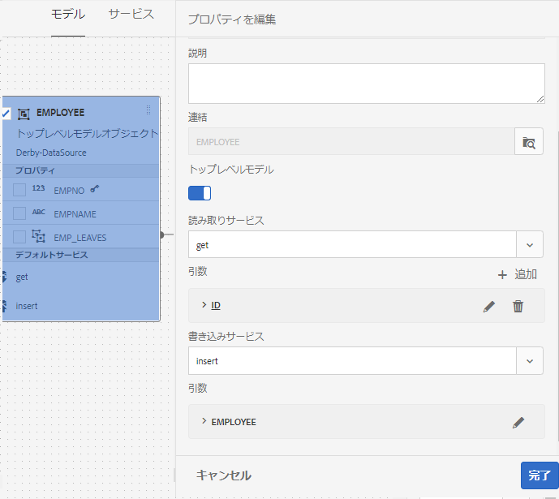

   従業員データソースに対して設定されている読み取りサービスと書き込みサービス

1. 読み取りサービスの引数に表示されている  をタップして、[ユーザープロファイル属性、リクエスト属性またはリテラル値にその引数を連結](#bindargument)し、連結値を指定します。
1. 「**[!UICONTROL 完了]**」をタップして引数を保存し、もう一度「**[!UICONTROL 完了]**」をタップしてプロパティを保存します。次に、「**[!UICONTROL 保存]**」をタップしてフォームデータモデルを保存します。

### バインド読み取りサービスの引数 {#bindargument}

連結値に基づいて、バインド読み取りサービスの引数をユーザープロファイル属性、リクエスト属性またはリテラル値に連結します。この値が引数としてサービスに渡され、指定した値に関連付けられた詳細がデータソースから取得されます。

#### リテラル値 {#literal-value}

**[!UICONTROL 連結先]**&#x200B;ドロップダウンメニューから「**[!UICONTROL リテラル]**」を選択し、「**[!UICONTROL 連結値]**」フィールドに値を入力します。値に関連付けられている詳細がデータソースから取得されます。静的な値に関連付けられた詳細を取得するには、このオプションを使用します。

この例では、**4367655678** に関連付けられた詳細が、`mobilenum` 引数の値としてデータソースから取得されます。モバイル番号の引数に値を渡す場合、関連する詳細には、顧客名、顧客の住所、市区町村などのプロパティを含めることができます。

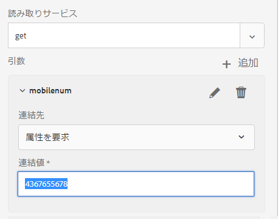

#### ユーザープロファイルの属性 {#user-profile-attribute}

**[!UICONTROL 連結先]**&#x200B;ドロップダウンメニューから「**[!UICONTROL ユーザープロファイル属性]**」を選択し、「**[!UICONTROL 連結値]**」フィールドに属性名を入力します。[!DNL Experience Manager] インスタンスにログインしたユーザーの詳細は、属性名に基づいてデータソースから取得されます。

「**[!UICONTROL 連結値]**」フィールドで指定する属性名には、ユーザーの属性名までの完全な連結パスを含める必要があります。以下の URL を開いて、CRXDE のユーザー詳細にアクセスします。

`https://[server-name]:[port]/crx/de/index.jsp#/home/users/`

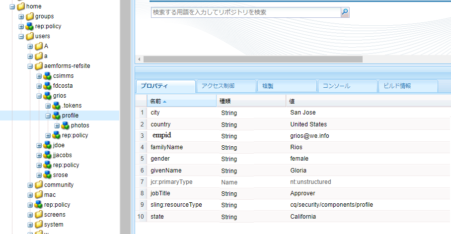

この例では、`grios` ユーザーの「**[!UICONTROL 連結値]**」フィールドに `profile.empid` を指定します。

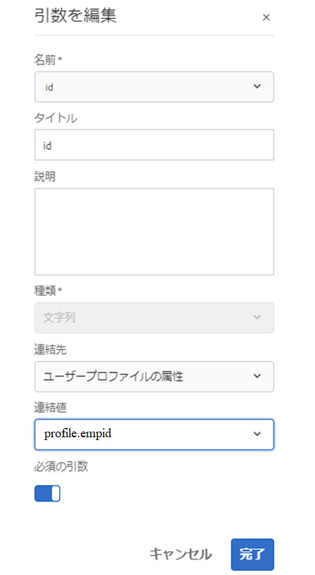

`id` 引数を使用してユーザープロファイルの `empid` 属性の値を取得し、それを引数として読み取りサービスに渡しています。ログインしたユーザーに関連付けられた `empid` の従業員データモデルオブジェクトから、関連付けられたプロパティの値を読み取って返します。

#### リクエスト属性 {#request-attribute}

リクエスト属性を使用して、データソースから関連付けられたプロパティを取得します。

1. **[!UICONTROL 連結先]**&#x200B;ドロップダウンメニューから「**[!UICONTROL リクエスト属性]**」を選択し、「**[!UICONTROL 連結値]**」フィールドに属性名を入力します。

1. head.jsp の[オーバーレイ](https://experienceleague.adobe.com/docs/experience-manager-cloud-service/implementing/developing/full-stack/overlays.html?lang=ja#developing)を作成します。オーバーレイを作成するには、CRX DEを開き、`https://<server-name>:<port number>/crx/de/index.jsp#/libs/fd/af/components/page2/afStaticTemplatePage/head.jsp` ファイルを `https://<server-name>:<port number>/crx/de/index.jsp#/apps/fd/af/components/page2/afStaticTemplatePage/head.jsp` にコピーします

   >[!NOTE]
   >
   > * 静的テンプレートを使用する場合は、head.jsp を以下の場所にオーバーレイします。
   >   `/libs/fd/af/components/page2/afStaticTemplatePage/head.jsp`
   > * 編集可能なテンプレートを使用する場合は、aftemplatedpage.jsp を以下の場所でオーバーレイします。
   >   `/libs/fd/af/components/page2/aftemplatedpage/aftemplatedpage.jsp`


1. リクエスト属性に [!DNL paramMap] を設定します。例えば、apps フォルダーの .jsp ファイルに以下のコードを含めます。

   ```javascript
   <%Map paraMap = new HashMap();
    paraMap.put("<request_attribute>",request.getParameter("<request_attribute>"));
    request.setAttribute("paramMap",paraMap);
   ```

   例えば、以下のコードを使用して、データソースから petid の値を取得します。


   ```javascript
   <%Map paraMap = new HashMap();
   paraMap.put("petId",request.getParameter("petId"));
   request.setAttribute("paramMap",paraMap);%>
   ```

詳細は、リクエストで指定された属性名に基づいてデータソースから取得されます。

例えば、リクエストで属性を `petid=100` と指定すると、属性値に関連付けられたプロパティがデータソースから取得されます。

## 関連付けの追加 {#add-associations}

通常、データソース内のデータモデルオブジェクト間には関連付けが作成されています。この関連付けは、1 対 1 の場合もあれば、1 対多の場合もあります。例えば、1 人の従業員に対して複数の扶養家族を関連付けることができます。これを、1 対多の関連付けといいます。関連するデータモデルオブジェクトを接続するライン上では、「`1:n`」として表示されます。それに対して、特定の従業員 ID で一意の従業員名が返される場合などは、1 対 1 の関連付けになります。

データソース内の関連データモデルオブジェクトをフォームデータモデルに追加した場合、それらの関連付けは維持され、矢印の線で接続された状態で表示されます。フォームデータモデル内の異なる複数のデータソース全体で、データモデルオブジェクト間に関連付けを作成できます。

>[!NOTE]
>
>JDBC データソース内で事前に定義されている関連付けは、フォームデータモデル内では維持されません。これらの関連付けについては、手動で作成する必要があります。

関連付けを追加するには、以下の手順を実行します。

1. データモデルオブジェクト上部のチェックボックスを選択して「**[!UICONTROL 関連付けを追加]**」をタップします。関連付けを追加ダイアログが表示されます。

   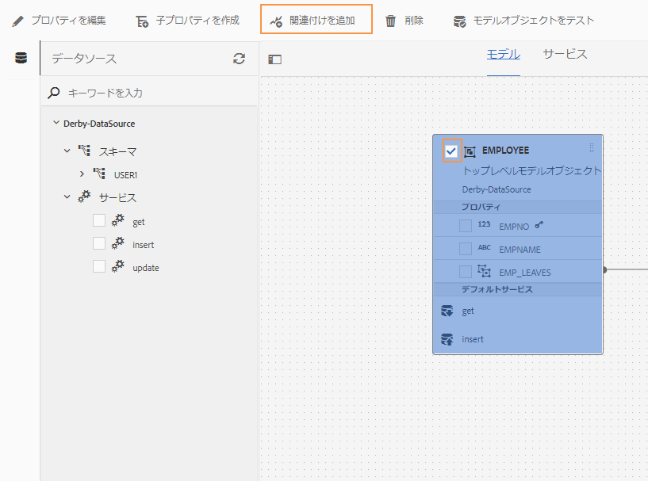

   >[!NOTE]
   >
   >OData サービスのメタデータドキュメントには、データモデルオブジェクトとサービスのほかに、2 つのデータモデルオブジェクト間の関連付けを定義するナビゲーションプロパティが含まれます。フォームデータモデルで関連付けを追加する際に、これらのナビゲーションプロパティを使用することができます。詳しくは、「[OData サービスのナビゲーションプロパティの操作](#work-with-navigation-properties-of-odata-services)」を参照してください。

   [!UICONTROL 関連付けを追加]ダイアログが表示されます。

   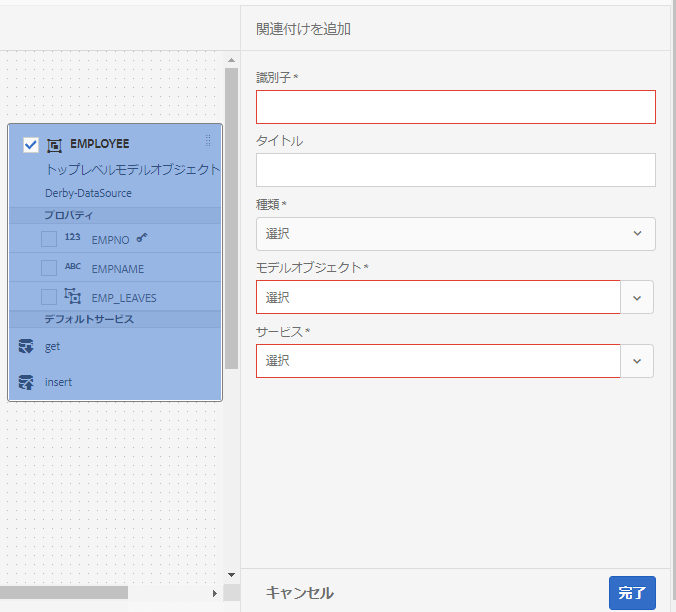

   関連付けを追加ダイアログ

1. 関連付けを追加ペインで、以下の操作を実行します。

   * 関連付けのタイトルを入力します。
   * 関連付けのタイプ（「**[!UICONTROL 1 対 1]**」または「**[!UICONTROL 1 対多]**」）を選択します。
   * 関連付けるデータモデルオブジェクトを選択します。
   * 選択したモデルオブジェクトからデータを読み取るための読み取りサービスを選択します。読み取りサービスの引数が表示されます。必要に応じて引数を編集し、関連付けるデータモデルオブジェクトのプロパティにその引数をバインドします。

   以下に示す例では、「扶養家族」データモデルオブジェクトの読み取りサービスのデフォルト引数が `dependentid` になっています。

   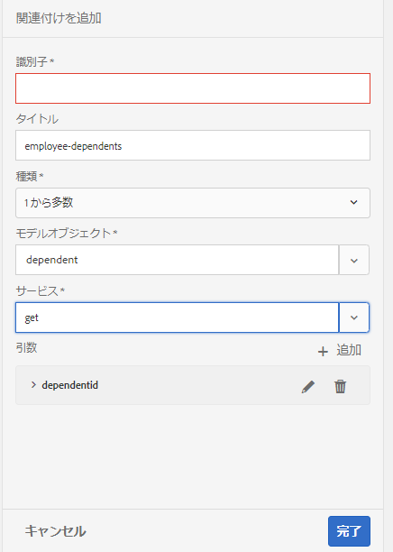

   「扶養家族」読み取りサービスのデフォルト引数が dependentid になっている

   ただし、この引数は、関連付けるデータモデルオブジェクト間の共通プロパティ（この例の場合は `Employeeid`）でなければなりません。そのため、`Employeeid` 引数を「従業員」データモデルオブジェクトの `id` プロパティにバインドして、関連付けられている扶養家族の詳細情報を「扶養家族」データモデルオブジェクトから取得する必要があります。

   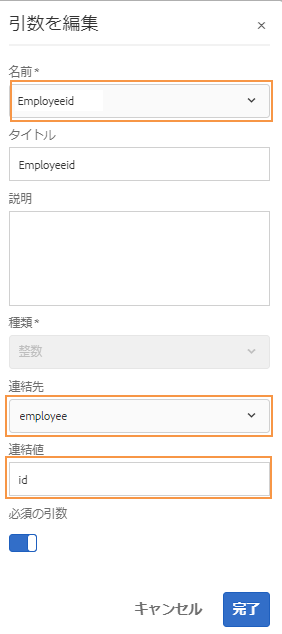

   更新後の引数とバインド

   「**[!UICONTROL 完了]**」をクックして、引数を保存します。

1. 「**[!UICONTROL 完了]**」をタップして関連付けを保存し、次に「**[!UICONTROL 保存]**」をタップしてフォームデータモデルを保存します。
1. さらに関連付けを作成するには、上記の手順を繰り返します。

>[!NOTE]
>
>追加した関連付けは、入力したタイトルと、関連データモデルオブジェクトを接続する線とともに、データモデルオブジェクトのボックス内に表示されます。
>
>関連付けを編集するには、その関連付けのチェックボックスを選択して「**[!UICONTROL 関連付けを編集]**」をタップします。

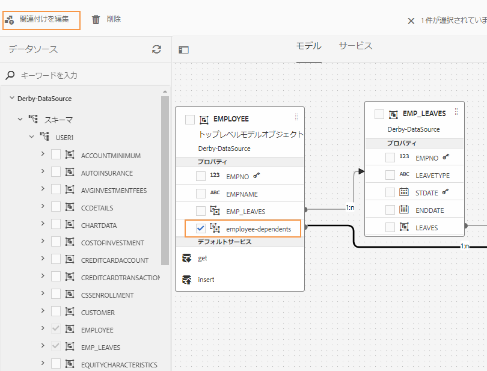

## プロパティの編集 {#properties}

フォームデータモデル内で追加されたデータモデルオブジェクトとサービスのプロパティを編集することができます。

プロパティを編集するには、以下の手順を実行します。

1. フォームデータモデル内のデータモデルオブジェクト、プロパティ、またはサービスの横に表示されているチェックボックスを選択します。
1. 「**[!UICONTROL プロパティを編集]**」をタップします。選択したモデルオブジェクト、プロパティ、またはサービスの「**[!UICONTROL プロパティを編集]**」ペインが表示されます。

   * **[!UICONTROL データモデルオブジェクト]**：読み取りサービスと書き込みサービスを指定し、引数を編集します。
   * **[!UICONTROL プロパティ]**：プロパティのタイプ、サブタイプ、形式を指定します。選択したプロパティをデータモデルオブジェクトのプライマリキーにするかどうかを指定することもできます。
   * **[!UICONTROL サービス]**：サービスの入力モデルオブジェクト、出力タイプ、引数を指定します。Get サービスの場合は、配列を返す必要があるかどうかを指定することができます。

      
   Get サービスのプロパティを編集ダイアログ

1. 「**[!UICONTROL 完了]**」をタップしてプロパティを保存し、次に「**[!UICONTROL 保存]**」をタップしてフォームデータモデルを保存します。

### 計算済みプロパティの作成 {#computed}

計算済みプロパティとは、ルールまたは式に基づいて値が計算されるプロパティのことです。ルールを使用して、計算済みプロパティの値を、リテラル文字列、数値、数式の計算結果、フォームデータモデル内の別のプロパティの値に設定することができます。

例えば、**FirstName** プロパティと **LastName** プロパティの値を組み合わせた値を持つ **FullName** プロパティを作成することができます。そのためには、以下の手順を実行します。

1. `FullName` という名前の新しいプロパティを作成し、データタイプとして String を設定します。
1. 「**[!UICONTROL 計算済み]**」を有効にし、「**[!UICONTROL 完了]**」をタップしてプロパティを作成します。

   

   これにより、FullName という名前の計算済みプロパティが作成されます。このプロパティの横に、計算済みプロパティであることを表すアイコンが表示されます。

   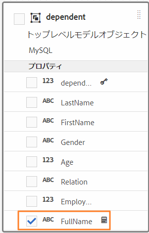

1. 「FullName」プロパティを選択して「**[!UICONTROL ルールを編集]**」をタップします。ルールエディターウィンドウが表示されます。
1. ルールエディターウィンドウで、「**[!UICONTROL 作成]**」をタップします。「**[!UICONTROL Set Value]**」ルールウィンドウが表示されます。

   オプション選択ドロップダウンで、「**[!UICONTROL 数式]**」を選択します。「**[!UICONTROL フォームデータモデルのオブジェクト]**」オプションと「**[!UICONTROL 文字列]**」オプションを選択することもできます。

1. 数式の最初のオブジェクトとして「**[!UICONTROL FirstName]**」を選択し、2 番目のオブジェクトとして「**[!UICONTROL LastName]**」を選択します。演算子として「**[!UICONTROL プラス]**」を選択します。

   「**[!UICONTROL 完了]**」、「**[!UICONTROL 閉じる]**」の順に選択して、ルールエディターウィンドウを閉じます。ルールは以下のようになります。

   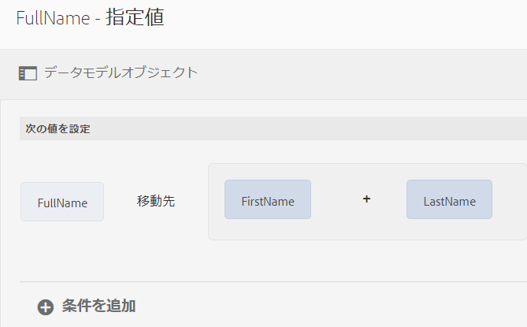

1. フォームデータモデルで、「**[!UICONTROL 保存]**」をタップします。これで、計算済みプロパティが設定されました。

## OData サービスのナビゲーションプロパティの操作 {#work-with-navigation-properties-of-odata-services}

OData サービスでは、ナビゲーションプロパティを使用して、2 つのデータモデルオブジェクト間の関連付けが定義されます。これらのプロパティは、エンティティタイプまたは複合タイプに対して定義されます。例えば、サンプルの [TripPin](https://www.odata.org/blog/trippin-new-odata-v4-sample-service/) OData サービスのメタデータファイルから抽出した以下のコードの場合、Friends、BestFriend、Trips という 3 つのナビゲーションプロパティが Person エンティティに含まれています。

ナビゲーションプロパティについて詳しくは、「[OData のドキュメント](https://docs.oasis-open.org/odata/odata/v4.0/errata03/os/complete/part3-csdl/odata-v4.0-errata03-os-part3-csdl-complete.html#_Toc453752536)」を参照してください。

```xml
<edmx:Edmx xmlns:edmx="https://docs.oasis-open.org/odata/ns/edmx" Version="4.0">
<script/>
<edmx:DataServices>
<Schema xmlns="https://docs.oasis-open.org/odata/ns/edm" Namespace="Microsoft.OData.Service.Sample.TrippinInMemory.Models">
<EntityType Name="Person">
<Key>
<PropertyRef Name="UserName"/>
</Key>
<Property Name="UserName" Type="Edm.String" Nullable="false"/>
<Property Name="FirstName" Type="Edm.String" Nullable="false"/>
<Property Name="LastName" Type="Edm.String"/>
<Property Name="MiddleName" Type="Edm.String"/>
<Property Name="Gender" Type="Microsoft.OData.Service.Sample.TrippinInMemory.Models.PersonGender" Nullable="false"/>
<Property Name="Age" Type="Edm.Int64"/>
<Property Name="Emails" Type="Collection(Edm.String)"/>
<Property Name="AddressInfo" Type="Collection(Microsoft.OData.Service.Sample.TrippinInMemory.Models.Location)"/>
<Property Name="HomeAddress" Type="Microsoft.OData.Service.Sample.TrippinInMemory.Models.Location"/>
<Property Name="FavoriteFeature" Type="Microsoft.OData.Service.Sample.TrippinInMemory.Models.Feature" Nullable="false"/>
<Property Name="Features" Type="Collection(Microsoft.OData.Service.Sample.TrippinInMemory.Models.Feature)" Nullable="false"/>
<NavigationProperty Name="Friends" Type="Collection(Microsoft.OData.Service.Sample.TrippinInMemory.Models.Person)"/>
<NavigationProperty Name="BestFriend" Type="Microsoft.OData.Service.Sample.TrippinInMemory.Models.Person"/>
<NavigationProperty Name="Trips" Type="Collection(Microsoft.OData.Service.Sample.TrippinInMemory.Models.Trip)"/>
</EntityType>
```

フォームデータモデル内で OData サービスを設定すると、そのフォームデータモデル内のサービスを経由して、エンティティコンテナ内のすべてのナビゲーションプロパティを使用できるようになります。このサンプルの TripPin OData サービスでは、フォームデータモデル内の `GET LINK` サービスを使用して、`Person` エンティティコンテナに含まれている 3 つのナビゲーションプロパティを読み取ることができます。

以下の図では、フォームデータモデル内の `GET LINK of Person /People` サービスがハイライト表示されています。これは、TripPin OData サービスの `Person` エンティティに含まれている 3 つのナビゲーションプロパティを組み合わせたサービスです。

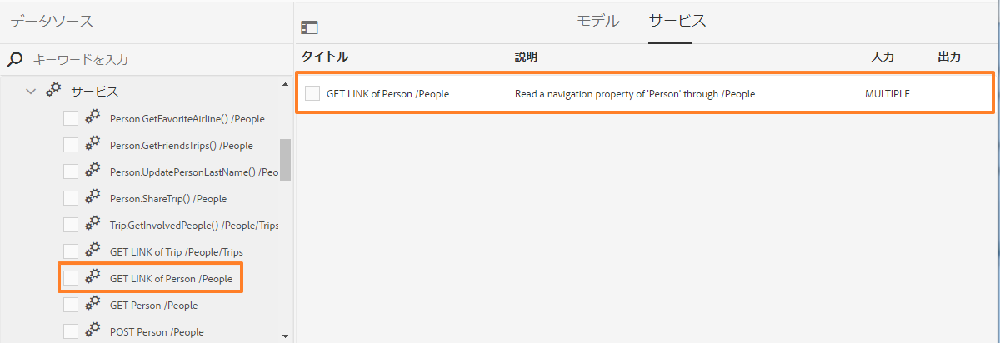

フォームデータモデルの「サービス」タブに `GET LINK` サービスを追加すると、サービス内で使用する出力モデルオブジェクトとナビゲーションプロパティを選択するための各種プロパティを編集できるようになります。例えば、以下の `GET LINK of Person /People` サービスでは、出力モデルオブジェクトとして「Trip」を使用し、ナビゲーションプロパティとして「Trips」を使用しています。


>[!NOTE]
>
>**NavigationPropertyName** 引数の「**[!UICONTROL デフォルト値]**」フィールドで指定できる値は、「**[!UICONTROL 配列を返しますか？]**」トグルボタンの状態によって異なります。このボタンが有効になっている場合は、コレクションタイプのナビゲーションプロパティが表示されます。

この例では、出力モデルオブジェクトとして「Person」を選択し、ナビゲーションプロパティの引数として「Friends」または「BestFriend」を選択することもできます（どちらを選択するかは、「**[!UICONTROL 配列を返しますか？]**」ボタンが有効になっているか無効になっているかによって異なります）。

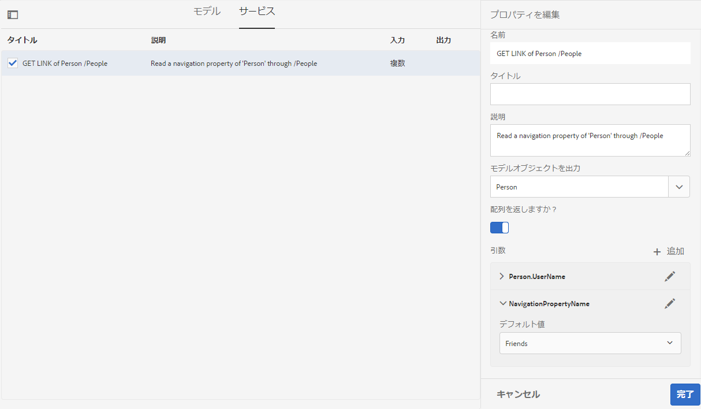

同様に、フォームデータモデルで関連付けを追加する際に `GET LINK` サービスを選択し、サービスのナビゲーションプロパティを設定できます。ただし、ナビゲーションプロパティを選択するには、**[!UICONTROL 連結先]**&#x200B;ドロップダウンメニューで「**[!UICONTROL リテラル]**」に設定されている必要があります。

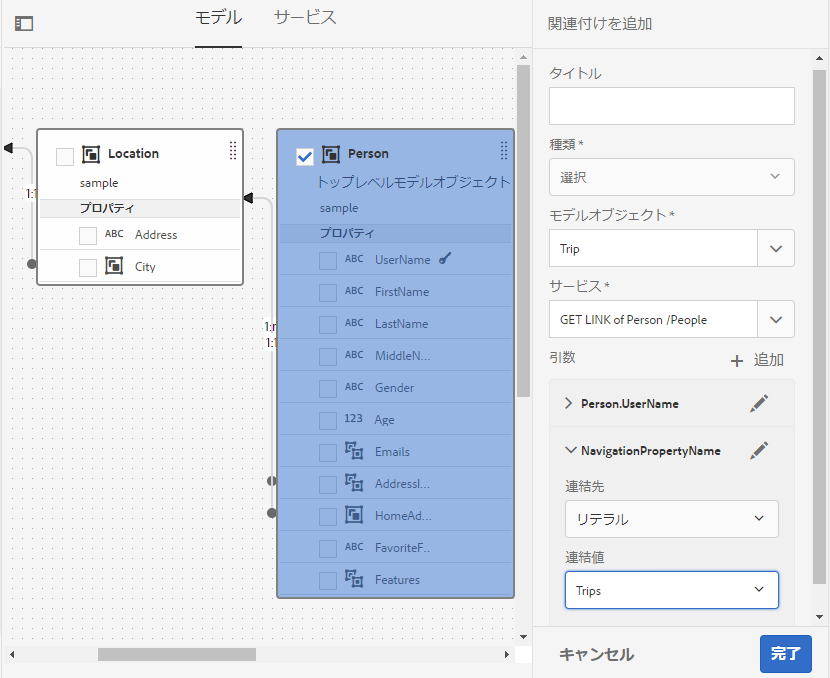

## サンプルデータの生成と編集 {#sample}

フォームデータモデルエディターを使用して、計算済みプロパティを含むすべてのデータモデルオブジェクトプロパティのサンプルデータを、フォームデータモデル内で生成できます。各プロパティで設定されたデータタイプに基づいて、一連のランダムな値がサンプルデータとして生成されます。このサンプルデータを編集して保存することもできます。サンプルデータを再生成した場合も、編集したサンプルデータは保存されたままになります。

サンプルデータを生成して編集するには、以下の手順を実行します。

1. フォームデータモデルを開いて「**[!UICONTROL サンプルデータを編集]**」をタップします。サンプルデータが生成され、サンプルデータ編集ウィンドウに表示されます。

   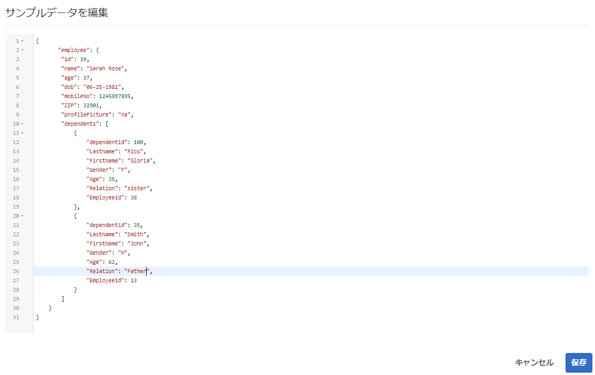

1. 「**[!UICONTROL サンプルデータを編集]**」ウィンドウでデータを編集して「**[!UICONTROL 保存]**」をタップします。

<!--Next, you can use the sample data to prefill and test interactive communications based on the form data model. For more information, see [Use form data model](using-form-data-model.md).-->

## データモデルオブジェクトとサービスのテスト {#test-data-model-objects-and-services}

これまでの手順で設定したフォームデータモデルを使用する前に、設定したデータモデルオブジェクトとサービスが正しく動作するかどうかをテストすることをお勧めします。データモデルオブジェクトとサービスをテストするには、以下の手順を実行します。

1. フォームデータモデルでデータモデルオブジェクトまたはサービスを選択して、「**[!UICONTROL モデルオブジェクトをテスト]**」または「**[!UICONTROL サービスをテスト]**」をタップします。

   フォームデータモデルをテストウィンドウが表示されます。

   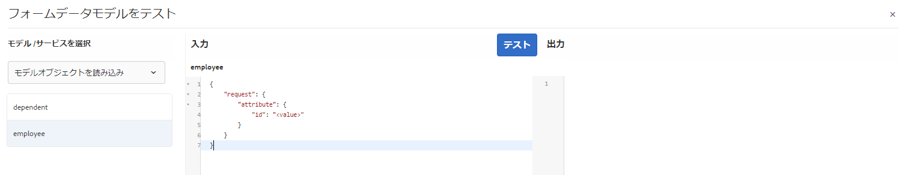

1. [!UICONTROL フォームデータモデルをテスト]ウィンドウの入力ペインで、テストするデータモデルオブジェクトまたはサービスを選択します。

1. テストコードで引数の値を指定して「**[!UICONTROL テスト]**」をタップします。テストが成功すると、出力ペインに出力情報が表示されます。

   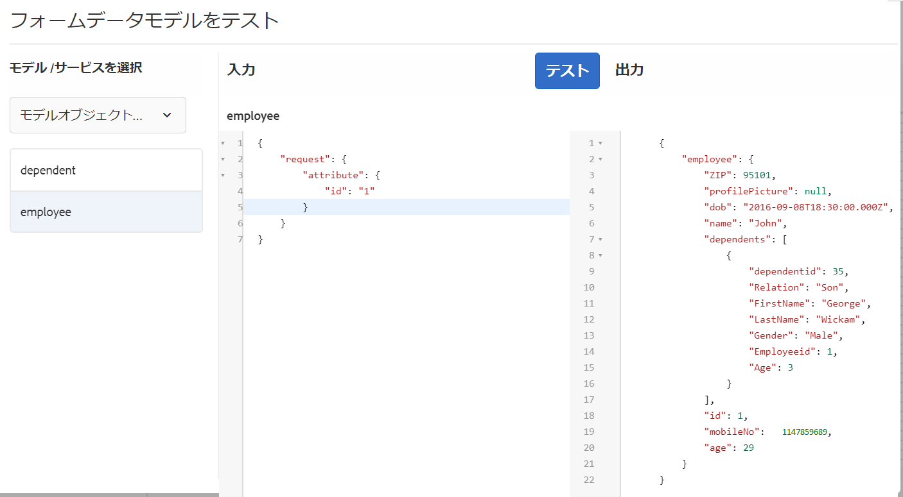

同様の方法で、フォームデータモデル内の他のデータモデルオブジェクトやサービスをテストできます。

## 入力データの自動検証 {#automated-validation-of-input-data}

フォームデータモデルは、DermisBridge API を呼び出す際に入力として受け取ったデータを（フォームデータモデルで使用可能な検証条件に基づいて）検証します。検証は、API の呼び出しに使用されるクエリオブジェクトに設定された `ValidationOptions` フラグに基づいて行われます。

このフラグは、以下のいずれかの値に設定できます。

* **完全**：FDM は、すべての制約に基づいて検証を実行します
* **オフ**：検証なし
* **基本**：FDM は、「required」制約および「nullable」制約に基づいて検証を実行します

`ValidationOptions`フラグに値が設定されていない場合、入力データに対して&#x200B;**基本**&#x200B;検証が実行されます。

以下に、検証フラグを&#x200B;**完全**&#x200B;に設定する例を示します。

```java
operationOptions.setValidationOptions(ValidationOptions.FULL);
```

>[!NOTE]
>
>入力データの属性に指定する値は、メタデータドキュメントの属性に定義されているデータタイプと一致する必要があります。\
>値が属性に対して定義されたデータタイプと一致しない場合、DermisBridge API は `ValidationOptions` フラグの値に関係なく例外を表示します。ログレベルが「デバッグ」に設定されている場合は、**error.log** ファイルにエラーが記録されます。

フォームデータモデルは、データタイプ制約のリストに基づいて入力データを検証します。入力データに対する制約のリストは、データソースによって異なる場合があります。

以下の表に、データソースに基づく入力データの制約事項を示します。

<table>
 <tbody> 
  <tr> 
   <td>制約</td> 
   <td>説明</td> 
   <td>入力データソース</td> 
  </tr> 
  <tr> 
   <td>required</td> 
   <td>true の場合、パラメーターを入力データに含める必要があります。</td> 
   <td>Swagger、WSDL およびデータベース</td> 
  </tr> 
  <tr> 
   <td>nullable</td> 
   <td>true の場合、入力データでパラメーターの値を Null に設定できます。</td> 
   <td>WSDL、Odata およびデータベース</td> 
  </tr> 
  <tr> 
   <td>maximum</td> 
   <td>数値の上限を指定します。また、上限として指定した最大値も入力データのパラメーターに割り当てることができます。</td> 
   <td>Swagger および WSDL</td> 
  </tr> 
  <tr> 
   <td>minimum</td> 
   <td>数値の下限を指定します。また、下限として指定した最小値も入力データのパラメーターに割り当てることができます。</td> 
   <td>Swagger および WSDL</td> 
  </tr> 
  <tr> 
   <td>exclusiveMaximum</td> 
   <td>数値の上限を指定します。上限として指定した最大値を入力データのパラメーターに割り当てないでください。</td> 
   <td>Swagger および WSDL</td> 
  </tr> 
  <tr> 
   <td>exclusiveMinimum</td> 
   <td>数値の下限を指定します。下限として指定した最小値を入力データのパラメーターに割り当てないでください。</td> 
   <td>Swagger および WSDL</td> 
  </tr> 
  <tr> 
   <td>minLength</td> 
   <td>文字列に含まれる文字数の下限を指定します。また、下限として指定した最小値も入力データのパラメーターに割り当てることができます。</td> 
   <td>Swagger および WSDL</td> 
  </tr> 
  <tr> 
   <td>maxLength</td> 
   <td>文字列に含まれる文字数の上限を指定します。また、上限として指定した最大値も入力データのパラメーターに割り当てることができます。</td> 
   <td>Swagger、WSDL、Odata およびデータベース</td> 
  </tr> 
  <tr> 
   <td>pattern</td> 
   <td>文字の固定シーケンスを指定します。文字が指定したパターンに適合する場合にのみ、入力文字列が正常に検証されます。</td> 
   <td>Swagger</td> 
  </tr> 
  <tr> 
   <td>minItems</td> 
   <td>配列の項目の最小数を指定します。また、下限として指定した最小値も入力データのパラメーターに割り当てることができます。</td> 
   <td>Swagger および WSDL</td> 
  </tr> 
  <tr> 
   <td>maxItems</td> 
   <td>配列の項目の最大数を指定します。また、上限として指定した最大値も入力データのパラメーターに割り当てることができます。</td> 
   <td>Swagger および WSDL</td> 
  </tr> 
  <tr> 
   <td>uniqueItems</td> 
   <td>true の場合、配列のすべての要素は入力データ内で一意である必要があります。</td> 
   <td>Swagger</td> 
  </tr> 
  <tr> 
   <td>enum（文字列）<br /> <br /> </td> 
   <td>入力データ内のパラメーターの値を固定の文字列の値のセットに制限します。1 つ以上の要素がある配列であり、各要素は一意である必要があります。</td> 
   <td>Swagger、WSDL および Odata</td> 
  </tr> 
  <tr> 
   <td>enum （数値）<br /> <br /> </td> 
   <td>入力データ内のパラメーターの値を、一定の数値のセットに制限します。1 つ以上の要素がある配列であり、各要素は一意である必要があります。</td> 
   <td>WSDL</td> 
  </tr> 
 </tbody> 
</table>

この例では、Swagger ファイルで定義されている最大制約、最小制約、必須制約に基づいて入力データが検証されます。注文 ID が存在し、その値が 1 ～ 10 の場合にのみ、入力データは検証条件を満たします。

```json
   parameters: [
   {
   name: "orderId",
   in: "path",
   description: "ID of pet that needs to be fetched",
   required: true,
   type: "integer",
   maximum: 10,
   minimum: 1,
   format: "int64"
   }
   ]
```

入力データが検証条件を満たさない場合は、例外が表示されます。ログレベルが「**デバッグ**」に設定されている場合は、**error.log** ファイルにエラーが記録されます。例：

```verilog
21.01.2019 17:26:37.411 *ERROR* com.adobe.aem.dermis.core.validation.JsonSchemaValidator {"errorCode":"AEM-FDM-001-044","errorMessage":"Input validations failed during operation execution.","violations":{"/orderId":["numeric instance is greater than the required maximum (maximum: 10, found: 16)"]}}
```

## 次の手順 {#next-steps}

これで、作業用のフォームデータモデルを、アダプティブフォームの <!--and interactive communications--> ワークフローで使用する準備が整いました。次の手順として、実際にこのフォームデータモデルを使用します。詳しくは、「[フォームデータモデルの使用](using-form-data-model.md)」を参照してください。
