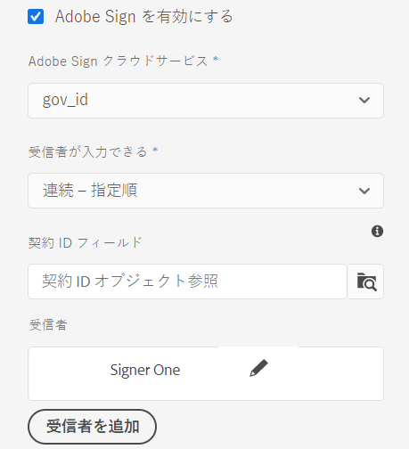
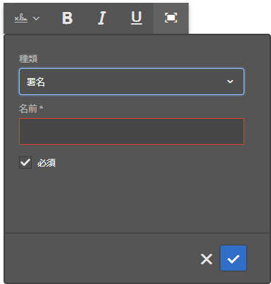
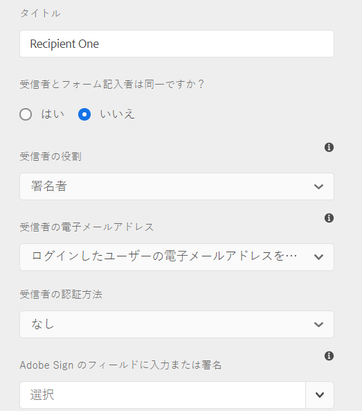
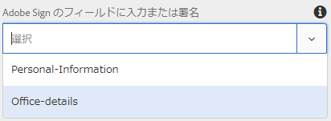
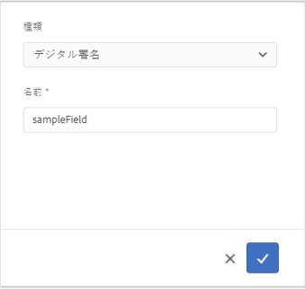

# アダプティブフォームでの [!DNL Adobe Sign] の使用 {#using-adobe-sign-in-an-adaptive-form}

>[!NOTE]
>
> [新しいアダプティブフォームを作成する](/help/forms/creating-adaptive-form-core-components.md)、または [AEM Sites ページにアダプティブフォームを追加する](/help/forms/create-or-add-an-adaptive-form-to-aem-sites-page.md)際には、最新の拡張可能なデータキャプチャである[コアコンポーネント](https://experienceleague.adobe.com/docs/experience-manager-core-components/using/adaptive-forms/introduction.html?lang=ja)を使用することをお勧めします。これらのコンポーネントは、アダプティブフォームの作成における大幅な進歩を示すものであり、優れたユーザーエクスペリエンスを実現します。この記事では、基盤コンポーネントを使用してアダプティブフォームを作成する従来の方法について説明します。


| バージョン | 記事リンク |
| -------- | ---------------------------- |
| AEM 6.5 | [ここをクリックしてください](https://experienceleague.adobe.com/docs/experience-manager-65/forms/adaptive-forms-advanced-authoring/working-with-adobe-sign.html?lang=ja) |
| AEM as a Cloud Service | この記事 |


[!DNL Adobe Sign] により、アダプティブフォームの電子サインワークフローを有効にできます。電子サインにより、法務、販売、給与、人事管理などに関するドキュメントを処理するためのワークフローが改善されます。

[!DNL Adobe Sign] とアダプティブフォームの一般的なシナリオでは、ユーザーがアダプティブフォームに入力し、1 人以上の関係者の署名を必要とするサービスに申し込みます。例えば、住宅ローンやクレジットカードに申請する際には、すべての借り手と共同申請者から、法的に有効な署名を取得する必要があります。同様のシナリオで電子サインワークフローを有効にするには、[!DNL Adobe Sign] をアダプティブフォームに統合します。例えば、[!DNL Adobe Sign] を使用して、以下のような処理を実行できます。

* 完全に自動化された提案プロセス、見積りプロセス、契約プロセスを使用して、任意のデバイスで契約を締結する。
* 人事プロセスを短時間で完了し、従業員に対してデジタルエクスペリエンスを提供する。
* 契約のサイクルタイムを短縮し、ベンダーとの取引を早期に開始する。
* 共通するプロセスを自動化するためのデジタルワークフローを作成する。

[!DNL Adobe Sign] と [!DNL AEM Forms] を統合することにより、次の機能がサポートされます。

* 単一ユーザーと複数ユーザーの署名ワークフローを処理する機能
* 複数の署名ワークフローを並列的に順次処理する機能
* 匿名ユーザーまたはログインユーザーとしてフォームを署名する機能
* 動的な署名プロセスを処理する機能（[!DNL AEM Forms] のワークフローと統合）
* ナレッジベース、電話、ソーシャルプロファイル、Government ID を使用した認証
* 各契約書受信者への役割の割り当て。ビジネスおよびエンタープライズサービスレベルの Adobe Sign では、[契約書受信者の役割](#addsignerstoanadaptiveform)を拡大できます。

<!-- * In-form and out-of-form signing experiences -->

## 前提条件 {#prerequisites}

アダプティブフォームで [!DNL Adobe Sign] を使用する前に、以下の点を確認してください。

* [!DNL AEM Forms] as a Cloud Service が Adobe Sign を使用するように設定されていること。詳細については、 [Adobe Sign の [!DNL AEM Forms]](adobe-sign-integration-adaptive-forms.md) への統合を参照してください。
* 受信者のリストが準備されていること。少なくとも、各受信者のメールアドレスが必要になります。

## アダプティブフォームへの [!DNL Adobe Sign] の設定 {#configure-adobe-sign-for-an-adaptive-form}

アダプティブフォームに [!DNL Adobe Sign] を設定するには、次の手順に従います。

1. [アダプティブフォームに [!DNL Adobe Sign] を有効にする](#enableadobsignforanadaptiveform)
1. [アダプティブフォームに [!DNL Adobe Sign] フィールドを追加する](#addadobesignfieldstoanadaptiveform)
1. [アダプティブフォームの [!DNL Adobe Sign] Cloud Service を選択する](#select-adobe-sign-cloud-service-and-signing-order)

1. [アダプティブフォームに [!DNL Adobe Sign] の受信者を追加する](#addsignerstoanadaptiveform)
1. [アダプティブフォームの送信アクションを選択する](#selectsubmitactionforanadaptiveform)



### アダプティブフォームで [!DNL Adobe Sign] を有効にする  {#enableadobesign}

既存のアダプティブフォーム用に [!DNL Adobe Sign] を有効にするか、[!DNL Adobe Sign] 対応アダプティブフォームを作成できます。次のいずれかの操作を行います。

* [ [!DNL Adobe Sign]  対応のアダプティブフォームを作成する](#create-an-adaptive-form-for-adobe-sign)
* [既存のアダプティブフォームで [!DNL Adobe Sign] を有効にする](#editafsign)

#### Adobe Sign 対応のアダプティブフォームを作成する {#create-an-adaptive-form-for-adobe-sign}

署名が有効なアダプティブフォームを作成するには：

1. **[!UICONTROL Adobe Experience Manager]**／**[!UICONTROL Forms]**／**[!UICONTROL フォームとドキュメント]**&#x200B;に移動します。
1. 「**[!UICONTROL 作成]**」を選択して、「**[!UICONTROL アダプティブフォーム]**」をクリックします。テンプレートのリストが表示されます。テンプレートを選択して、「**[!UICONTROL 次へ]**」をクリックします。
1. 「**[!UICONTROL 基本]**」タブで次の操作を行います。

   1. アダプティブフォームの&#x200B;**[!UICONTROL 名前]**&#x200B;と&#x200B;**[!UICONTROL タイトル]**&#x200B;を指定します。

   1. [ [!DNL Adobe Sign]  を  [!DNL AEM Forms]](adobe-sign-integration-adaptive-forms.md) と統合するときに作成した [設定コンテナ](adobe-sign-integration-adaptive-forms.md#configure-adobe-sign-with-aem-forms) を選択します。

   設定コンテナには、お使いの環境用に設定された [!DNL Adobe Sign] クラウドサービスが含まれています。これらのサービスは、アダプティブフォームエディターで選択できます。

1. 「**[!UICONTROL フォームモデル]**」タブで、次のいずれかのオプションを選択します。

   * カスタムフォームテンプレートがあり、そのフォームテンプレートに基づいてレコードのドキュメントが必要な場合は、「**[!UICONTROL フォームテンプレートをレコードのドキュメントテンプレートとして関連付ける]**」オプションを選択し、「レコードのドキュメントテンプレート」を選択します。このオプションを使用すると、署名用に送信されたドキュメントには、関連付けられたフォームテンプレートに基づくフィールドのみが表示されます。アダプティブフォームのすべてのフィールドは表示されません。

   * カスタムフォームテンプレートがない場合は、「**[!UICONTROL レコードのドキュメントを生成]**」オプションを選択します。このオプションを使用すると、署名用に送信されたドキュメントにアダプティブフォームのすべてのフィールドが表示されます。

1. 「**[!UICONTROL 作成」を選択します。]** 署名が有効なアダプティブフォームが作成されます。[!DNL Adobe Sign] フィールドをフォームに追加し、署名用に送信できます。

#### アダプティブフォームで [!DNL Adobe Sign] を有効にする {#editafsign}

既存のアダプティブフォームで [!DNL Adobe Sign] を使用するには：

1. **[!UICONTROL Adobe Experience Manager]**／**[!UICONTROL Forms]**／**[!UICONTROL フォームとドキュメント]**&#x200B;に移動します。
1. アダプティブフォームを選択し、「**[!UICONTROL プロパティ]**」を選択します。
1. 「**[!UICONTROL 基本]**」タブで、[!DNL Adobe Sign] を [!DNL AEM Forms] と統合するときに作成した [設定コンテナ](adobe-sign-integration-adaptive-forms.md#configure-adobe-sign-with-aem-forms) を選択します。
1. 「**[!UICONTROL フォームモード]**」タブで、次のいずれかのオプションを選択します。

   * カスタムフォームテンプレートがあり、そのフォームテンプレートに基づいてレコードのドキュメントが必要な場合は、「**[!UICONTROL フォームテンプレートをレコードのドキュメントテンプレートとして関連付ける]**」オプションを選択し、「レコードのドキュメントテンプレート」を選択します。このオプションを使用すると、署名用に送信されたドキュメントには、関連付けられたフォームテンプレートに基づくフィールドのみが表示されます。アダプティブフォームのすべてのフィールドは表示されません。

   * カスタムフォームテンプレートがない場合は、「**[!UICONTROL レコードのドキュメントを生成]**」オプションを選択します。このオプションを使用すると、署名用に送信されたドキュメントにアダプティブフォームのすべてのフィールドが表示されます。

1. 「**[!UICONTROL 保存して閉じる]**」を選択します。アダプティブフォームは [!DNL Adobe Sign] に対して有効になっています。これで、[!DNL Adobe Sign] フィールドをフォームに追加し、署名用に送信できます。

### アダプティブフォームに [!DNL Adobe Sign] フィールドを追加する {#addadobesignfieldstoanadaptiveform}

[!DNL Adobe Sign] には、アダプティブフォーム上に配置できる様々なフィールドが用意されています。これらのフィールドには、署名、イニシャル、会社名、タイトルなど、様々なタイプのデータを入力することができます。このため、署名が行われる際に署名だけでなく追加情報を収集できます。[!DNL Adobe Sign] ブロックコンポーネントを使用して、アダプティブフォームの様々な場所に [!DNL Adobe Sign] フィールドを配置できます。

アダプティブフォームにフィールドを追加し、フィールドに関する各種オプションをカスタマイズするには：

1. **[!UICONTROL Adobe Sign ブロック]**&#x200B;コンポーネントを、コンポーネントブラウザーからアダプティブフォームにドラッグ＆ドロップします。[!DNL Adobe Sign] ブロックコンポーネントには、サポート対象のすべての [!DNL Adobe Sign] フィールドが含まれています。デフォルトでは、「**[!UICONTROL 署名]**」フィールドがアダプティブフォームに追加されます。

   

   デフォルトでは、公開済みアダプティブフォームに [!DNL Adobe Sign] ブロックは表示されません。Adobe Sign ブロックが表示されるのは、署名ドキュメントだけです。[!DNL Adobe Sign] ブロックの表示設定は、[!DNL Adobe Sign] ブロックコンポーネントのプロパティで変更できます。

   >[!NOTE]
   >
   >  * アダプティブフォームで [!DNL Adobe Sign] を使用する場合、[!DNL Adobe Sign] ブロックの使用は必須ではありません。[!DNL Adobe Sign] ブロックを使用せずに受信者用のフィールドを追加すると、署名ドキュメントの下部にデフォルトの署名フィールドが表示されます。
   >  * レコードのドキュメントが自動的に生成されるアダプティブフォームの場合のみ、[!DNL Adobe Sign] ブロックを使用してください。カスタムの XDP を使用して、レコードのドキュメントやフォームテンプレートベースのアダプティブフォームを生成する場合は、[!DNL Adobe Sign] ブロックはサポートされていません。


1. **[!UICONTROL Adobe Sign ブロック]**&#x200B;コンポーネントを選択し、「**[!UICONTROL 編集]**」 アイコンをクリックします。フィールドを追加するためのオプションと、フィールドの外観を設定するためのオプションが表示されます。

   

   **A.** [!DNL Adobe Sign] フィールドを選択して追加。**B.** [!DNL Adobe Sign] ブロックを展開して全画面表示。

1. 「**[!UICONTROL Adobe Sign]**」フィールド  アイコンを選択します。[!DNL Adobe Sign] フィールドの選択オプションと追加オプションが表示されます。

   **[!UICONTROL タイプ]**&#x200B;ドロップダウンフィールドを展開して「[!DNL Adobe Sign]」フィールドを選択し、「完了」 アイコンを選択して、選択したフィールドを [!DNL Adobe Sign] ブロックに追加します。「**[!UICONTROL タイプ]**」ドロップダウンフィールドには、「署名」タイプ、「受信者の情報」タイプ、「データフィールド」タイプが表示されます。[!DNL Adobe Sign] が AEM に統合されている場合、[!DNL Forms] は「[!UICONTROL タイプ]」ドロップダウンボックスに表示されているフィールドのみサポートします。[!DNL Adobe Sign] フィールドについて詳しくは、 [Adobe Sign のドキュメント](https://helpx.adobe.com/jp/sign/using/field-types.html) を参照してください。

   

   フィールドには、必ず一意の名前を指定する必要があります。フィールドを必須フィールドとしてマークするための必須オプションを選択することもできます。[!DNL Adobe Sign] の一部のフィールドには、「**[!UICONTROL 名前]**」オプションと「**[!UICONTROL 必須]**」オプションのほかに、追加のオプションが用意されています。例えば、マスクや複数行のオプションなどです。また、フィールドが [!DNL Adobe Sign] の同じブロック内に存在するか別のブロック内に存在するかを問わず、[!DNL Adobe Sign] の各フィールドに一意の名前を指定できます。

   ドロップダウンリストから「**[!UICONTROL デジタル署名]**」を選択すると、アダプティブフォームに電子署名を適用できます。

   * オンラインでクラウド署名を使用し、トラストサービスプロバイダーがホストする[デジタル ID](https://helpx.adobe.com/jp/sign/kb/digital-certificate-providers.html) を使用する。
   * ローカルにドキュメントをダウンロードして、Adobe Acrobat または Adobe Acrobat Reader でスマートカード、USB トークン、ファイルベースのデジタル ID を使用する。

### アダプティブフォームで [!DNL Adobe Sign] を有効にする {#enableadobsignforanadaptiveform}

初期状態の [!DNL Adobe Sign] は、アダプティブフォームに対して有効になっていません。有効にするには：

1. コンテンツブラウザーで「**[!UICONTROL フォームコンテナ]**」を選択し、「**[!UICONTROL 設定]**」 アイコンをクリックします。この操作により、アダプティブフォームのコンテナプロパティを表示するプロパティブラウザーが開きます。
1. このプロパティブラウザーで「**[!UICONTROL 電子サイン]**」アコーディオンを展開し、「**[!UICONTROL Adobe Sign を有効にする]**」オプションを選択します。この操作により、アダプティブフォームに対して [!DNL Adobe Sign] が有効になります。

### [!DNL Adobe Sign] Cloud Service と署名順序を選択する {#select-adobe-sign-cloud-service-and-signing-order}

AEM [!DNL Forms] の 1 つのインスタンスに対して、複数の [!DNL Adobe Sign] サービスを設定できます。人事や財務などの部門ごとに個別のサービスセットを設定することをお勧めします。それにより、署名済みドキュメントのトラッキングとレポート処理が容易になります。例えば、銀行には複数の部署があります。これらの部署ごとに個別の設定を指定することで、ドキュメントを正しくトラッキングできるようになります。

また、1 つのドキュメントに対して複数の受信者を設定できます。例えば、複数のユーザーがクレジットカードを申し込む場合があります。銀行は、これらの申し込みの処理を開始する前に、すべての申請者の署名を取得する必要があります。このように複数の受信者を処理するシナリオの場合、各ドキュメントを順に署名することも、順不同で同時に署名することもできます。

Cloud Service と署名する順序を選択するには：


1. コンテンツブラウザーで「**[!UICONTROL フォームコンテナ]**」を選択し、「**[!UICONTROL 設定]**」 アイコンをクリックします。この操作により、アダプティブフォームのコンテナプロパティを表示するプロパティブラウザーが開きます。
1. このプロパティブラウザーで「**[!UICONTROL 電子サイン]**」アコーディオンを展開し、「**[!UICONTROL Adobe Sign を有効にする]**」オプションを選択します。この操作により、アダプティブフォームに対して [!DNL Adobe Sign] が有効になります。
1. 既に設定されている [!DNL Adobe Sign] Cloud Service のリストから、任意の Cloud Service を選択します。

   「**[!UICONTROL Adobe Sign Cloud Service]**」リストに何も表示されていない場合は、[ [!DNL Adobe Sign] の設定： [!DNL AEM Forms]](adobe-sign-integration-adaptive-forms.md)の記事に従い、サービスを設定してください。

   ドロップダウンは、ツール／**[!UICONTROL Cloud Services]**／**[!UICONTROL Adobe Sign]** の `global` フォルダーに存在するクラウドサービスをリストします。また、このドロップダウンリストは、アダプティブフォームの作成時に「**[!UICONTROL 設定コンテナ]**」フィールドで選択したフォルダーに存在するクラウドサービスも表示します。

1. **[!UICONTROL フォームを送信]**&#x200B;を使用して送信アクションを設定するオプションを選択します。次の 2 つのオプションのいずれかを選択できます。
   * **フォームを送信（および署名に関する契約書を送信）**：このオプションでは、フォームを直ちに送信し、受信者に署名用のフォームを送信します。
   * **フォームを送信（すべての受信者が署名行為を完了した後）**：このオプションでは、すべての署名者が署名プロセスを完了した後でのみ、アダプティブフォームを送信します。すべての署名者の署名ステータスを確認する間隔を設定できます。詳しくは、[ [!DNL Adobe Acrobat Sign]  スケジューラーの設定](/help/forms/adobe-sign-integration-adaptive-forms.md#configure-dnl-adobe-acrobat-sign-scheduler-to-sync-the-signing-status)を参照してください。

1. 「**[!UICONTROL 受信者の署名順序]**」ドロップダウンから、署名順序を選択します。受信者は、アダプティブフォームを&#x200B;**[!UICONTROL 連続]**&#x200B;して（指定順に）署名することも、**[!UICONTROL 同時]**&#x200B;に（順不同で）署名することもできます。

   順に署名する場合は、Adobe Sign 契約書は一度に 1 人の受信者に送られます。割り当てられたアクションを受信者が完了すると、契約書が次の受信者に送信されます。以下、同様の処理が繰り返されます。

   同時に署名する場合は、すべての受信者が Adobe Sign 契約書を受け取り、お互いに並行してアクションを実行できます。

1. 「契約 ID」フィールドを使用して、bindref を契約 ID（agreementId）に関連付けます。これにより、スキーマベースフォームの送信データの afBoundData セクションに契約 ID が追加されます。すべての Adobe Sign 対応フォームの送信済みデータの afSubmissionInfo セクションにも契約 ID が追加されます。カスタムコードを使用して、契約ステータスのトラッキングに契約 ID を使用できます（カスタム実装が必要です）。

   >[!NOTE]
   >
   > フォームデータモデル（FDM）を使用してアダプティブフォームが作成された場合、ダイアログボックスに契約 ID フィールドが表示されます。

1. [アダプティブフォームに受信者を追加](working-with-adobe-sign.md#addsignerstoanadaptiveform)し、「完了」 アイコンを選択して変更内容を保存します。

### アダプティブフォームに受信者を追加する {#addsignerstoanadaptiveform}

1 つの Adobe Sign 契約書に 1 人または複数の受信者を設定できます。受信者を追加する際に、受信者の認証の詳細を設定し、フォームの入力者と受信者が同一人物かどうかを選択することもできます。受信者に関する各種詳細情報の追加と指定を行うには、次の手順を実行します。

1. コンテンツブラウザーで「**[!UICONTROL フォームコンテナ]**」を選択し、「**[!UICONTROL 設定]**」 アイコンを選択します。この操作により、アダプティブフォームのコンテナプロパティを表示するプロパティブラウザーが開きます。
1. このプロパティブラウザーで「**[!UICONTROL 電子サイン]**」アコーディオンを展開し、「**[!UICONTROL Adobe Sign を有効にする]**」オプションを選択します。この操作により、アダプティブフォームに対して [!DNL Adobe Sign] が有効になります。
1. 「**[!UICONTROL 受信者を追加]**」を選択します。この操作により、アダプティブフォームに受信者が追加されます。1 つのアダプティブフォームに複数の受信者を追加できます。すべての受信者は、アダプティブフォームの送信時に Adobe Sign 契約書を受け取ります。
   

1. **[!UICONTROL 編集]**&#x200B;アイコン（）をクリックして、受信者に関する以下の情報を指定します。

   * **[!UICONTROL タイトル]：**&#x200B;受信者を一意に識別するためのタイトルを指定します。

   * **[!UICONTROL 受信者とフォーム記入者は同一ですか？]：**&#x200B;フォームの入力者と最初の受信者が同一人物の場合は、「**[!UICONTROL はい]**」を選択します。<!-- If the option is set to **No,** then do not use the signature step component in the Adaptive Form. If the form contains a Signature Step component, then the field is automatically set to Yes. -->

   * **[!UICONTROL 受信者の役割]：**&#x200B;受信者の役割を選択します。ビジネスおよびエンタープライズサービスレベルの Adobe Sign では、ワークフロー要件に適切に合致するように、[契約書受信者の役割](https://helpx.adobe.com/jp/sign/using/set-up-signer-approver-roles.html)を&#x200B;**署名者**&#x200B;以外に拡張できます。

   * **[!UICONTROL 受信者のメールアドレス]：**&#x200B;受信者のメールアドレスを指定します。受信者は、指定したメールアドレスで Adobe Sign 契約書を受け取ります。フォームフィールドで指定したメールアドレスを使用することも、ログインユーザーの Experience Manager ユーザープロファイルで指定したメールアドレスを使用することも、メールアドレスを手動で入力することもできます。このステップは、必ず実行する必要があります。

     >[!NOTE]
     >
     >最初の受信者または唯一の受信者（受信者が 1 人の場合）のメールアドレスが、AEM Cloud Services の設定に使用された [!DNL Adobe Sign] アカウントと一致していないことを確認します。

   * **[!UICONTROL 受信者の認証方法]：** Adobe Sign 契約書を開く前に受信者を認証する方法を指定します。電話認証、ナレッジベース認証、ソーシャル ID に基づく認証、[!DNL Adobe Acrobat Sign] の [Government ID](https://helpx.adobe.com/jp/sign/using/adobesign-authentication-government-id.html) のいずれかを選択できます。[!DNL Adobe Acrobat Sign for Government] の場合、電話認証とナレッジベース認証のいずれかを選択できます。

   >[!NOTE]
   >
   >    * ソーシャル ID に基づく認証の場合、Facebook、Google、LinkedIn を使用した認証オプションがデフォルトで用意されています。これ以外のソーシャル認証プロバイダーを使用する場合は、[!DNL Adobe Sign] サポートまでお問い合わせください。
   >

   * **[!DNL Adobe Sign]のフィールドに入力または署名：**&#x200B;受信者用の [!DNL Adobe Sign] フィールドを選択します。1 つのアダプティブフォームで複数の [!DNL Adobe Sign] フィールドを使用できます。受信者用に特定のフィールドを有効にできます。これらのフィールドには、使用可能なすべての [!DNL Adobe Sign] ブロックが表示されます。いずれかのブロックを選択すると、そのブロックのすべてのフィールドが選択されます。フィールドの選択を解除するには、「X」アイコンを使用します。

   

   上の画像には、Personal-Information と Office-details という 2 つのサンプルの [!DNL Adobe Sign] ブロックが表示されています。

    アイコンを選択します。受信者が追加されます。

### アダプティブフォームの送信アクションを選択する {#selectsubmitactionforanadaptiveform}

アダプティブフォームに [!DNL Adobe Sign] フィールドを追加したら、フォームコンテナで [!DNL Adobe Sign] を有効にし、[!DNL Adobe Sign] Cloud Service を選択して、Adobe Sign 契約書の受信者を追加します。その後、アダプティブフォームに適した送信アクションを選択します。アダプティブフォームの送信アクションについて詳しくは、「[送信アクションの設定](configuring-submit-actions.md)」を参照してください。

フォームの署名と送信は、互いに独立しています。アダプティブフォームの送信は、ユーザーがフォームを送信した後、Adobe Sign 契約が作成され次第行われます。[!DNL AEM Forms] as a Cloud Service は、受信者が署名または他の操作を完了してアダプティブフォームを送信するまで待つことはありません。ユーザーが「送信」ボタンをクリックするか、または概要ステップにフォームの概要が表示されると、フォームが送信されます。

また、[!DNL Adobe Sign] が有効なアダプティブフォームでは、データを送信するために Adobe Sign 契約 ID が埋め込まれます。カスタムコードを使用して、契約ステータスのトラッキングに契約 ID を使用できます（カスタム実装が必要です）。

Adobe Sign 契約 ID（agreementId）は、アダプティブフォームの送信データに含まれます。デフォルトでは、契約 ID は送信されたデータの `afSubmissionInfo` ノードに存在します。

```xml
   <?xml version="1.0" encoding="UTF-8"?>
   <afData>
      <afUnboundData>
         <data>
            <textbox1613455050902>ff</textbox1613455050902>
         </data>
      </afUnboundData>
      <afBoundData>
         <data xmlns:xfa="http://www.xfa.org/schema/xfa-data/1.0/" />
      </afBoundData>
      <afSubmissionInfo>
         <lastFocusItem>guide[0].guide1[0].guideRootPanel[0].textbox1613455050902[0]</lastFocusItem>
         <stateOverrides />
         <signers>
            <signer0>
               <email />
            </signer0>
         </signers>
         <afPath>/content/dam/formsanddocuments/testsign</afPath>
         <afSubmissionTime>20210311031009</afSubmissionTime>
         <agreementId>xxxxxxxxxxxxxxxxxxxxxxxxxxxxxxxxxxxxxxxxxxxxx</agreementId>
      </afSubmissionInfo>
   </afData>
```

オプションで、bindref を契約 ID（agreementId）に関連付けることもできます。それにより、送信されたデータの afBoundData セクションに契約 ID が追加されます。例えば、次の送信データでは、契約 ID は `<userName>` ノードにバインドされます。

```xml
      <?xml version="1.0" encoding="UTF-8"?>
      <afData>
         <afUnboundData>
            <data />
         </afUnboundData>
         <afBoundData>
            <config xmlns:xfa="http://www.xfa.org/schema/xfa-data/1.0/" xmlns:xsi="http://www.w3.org/2001/XMLSchema-instance">
               <userName>3AAABLblqZhC2MWu7GFauKh45j_t2ih8mAtmbdIcNSl1HgQubhMJfDaDfylyN7NQiYRam_44ISKm45enIOafHqWZrdaxShf9r</userName>
               <dateOfBirth>0001-01-01</dateOfBirth>
            </config>
         </afBoundData>
         <afSubmissionInfo>
            <lastFocusItem>guide[0].guide1[0].guideRootPanel[0].projectDetails[0]</lastFocusItem>
            <stateOverrides />
            <signers>
               <signer0>
                  <email />
               </signer0>
            </signers>
            <afPath>/content/dam/formsanddocuments/testathon2021-1/gaurav/xsd-based</afPath>
            <afSubmissionTime>20210311095211</afSubmissionTime>
            <agreementId>xxxxxxxxxxxxxxxxxxxxxxxxxxxxxxxxxxxxxxxxxxxx</agreementId>
         </afSubmissionInfo>
      </afData>
```

<!-- Remove when forms portal goes live
>[!NOTE]
>
>Data of the Adaptive Form is stored temporarily on Forms Portal. Adobe recommends using [custom storage for Forms Portal](/help/forms/using/configuring-draft-submission-storage.md). It ensures that the PII (personally identifiable information) data is not stored on AEM servers. 
-->

これで、フォームに署名する準備が整いました。フォームのプレビューを表示して、署名エクスペリエンスを確認できます。受信者がメールで署名用のフォームを受信すると、公開済みフォーム上に [!DNL Adobe Sign] ブロックのフィールドが表示されます。「**[!UICONTROL 受信者とフォーム記入者は同一ですか？]**」オプションが「はい」とマークされ、条件が満たされると、ユーザーは送信後に Adobe Sign 契約書にリダイレクトされ、契約書がメールに表示されるのを待たずに、即座にドキュメントに署名できます。

## アダプティブフォームのクラウド署名の設定 {#configure-cloud-signatures-for-an-adaptive-form}

クラウドベースの電子署名（リモート署名）は、デスクトップ、モバイル、Web 上で機能する新世代のデジタル署名で、受信者の認証に関する最高レベルのコンプライアンスと保証を満たします。クラウドベースの電子署名を使用してアダプティブフォームに署名できます。

[Adobe Sign 用にアダプティブフォームプロパティを編集](working-with-adobe-sign.md#enableadobesign)した後、次の手順を実行してアダプティブフォームにクラウド署名フィールドを追加します。

1. **[!UICONTROL Adobe Sign ブロック]**&#x200B;コンポーネントを、コンポーネントブラウザーからアダプティブフォームにドラッグ＆ドロップします。[!UICONTROL Adobe Sign ブロック]コンポーネントには、サポート対象のすべての [!DNL Adobe Sign] フィールドが含まれています。デフォルトでは、「**[!UICONTROL 署名]**」フィールドがアダプティブフォームに追加されます。

   

1. **[!UICONTROL Adobe Sign ブロック]**&#x200B;コンポーネントを選択し、「**[!UICONTROL 編集]**」 アイコンをクリックします。フィールドを追加するためのオプションと、フィールドの外観を設定するためのオプションが表示されます。

   

   **A.** [!DNL Adobe Sign] フィールドを選択して追加。**B.** [!DNL Adobe Sign] ブロックを展開して全画面表示。

1. **[!UICONTROL Adobe Sign フィールド]**  アイコンを選択します。[!DNL Adobe Sign] フィールドの選択オプションと追加オプションが表示されます。

   **[!UICONTROL タイプ]**&#x200B;ドロップダウンフィールドを展開して「**[!UICONTROL デジタル署名]**」を選択し、「**[!UICONTROL 完了]**」アイコンを選択して、選択したフィールドを [!DNL Adobe Sign] ブロックに追加します。

   

   フィールドには、必ず一意の名前を指定する必要があります。

   次を使用して、アダプティブフォームに電子署名を適用します。

   * クラウド署名：トラストサービスプロバイダーがホストする[デジタル ID](https://helpx.adobe.com/jp/sign/kb/digital-certificate-providers.html) を使用して署名します。
   * Adobe Acrobat または Reader：ドキュメントをダウンロードして Adobe Acrobat または Reader で開き、スマートカード、USB トークン、ファイルベースのデジタル ID を使用して署名します。

     >[!NOTE]
     >
     > デジタル署名は [!DNL Adobe Acrobat Sign for Government] にも適用できますが、クラウド署名を使用して適用することはできません。

   クラウド署名フィールドをアダプティブフォームに追加した後、次の手順を実行して設定プロセスを完了します。

   * [アダプティブフォームに対して Adobe Sign を有効にする](#enableadobsignforanadaptiveform)
   * [アダプティブフォームの Adobe Sign Cloud Service を選択する](#selectadobesigncloudserviceforanadaptiveform)
   * [アダプティブフォームに受信者を追加する](#addsignerstoanadaptiveform)
   * [アダプティブフォームの送信アクションを選択する](#selectsubmitactionforanadaptiveform)

### 「ありがとうございます」ページまたは概要ステップコンポーネントの設定  {#configure-the-thank-you-page-or-summary-step-component}

**[!UICONTROL 概要ステップ]**&#x200B;コンポーネントにより、フォームが自動的に送信され、カスタマイズ後の概要ページに情報が取り込まれ、送信されたフォームの概要情報が表示されます。概要ステップコンポーネントは、フォームの幅いっぱいに表示されます。そのため、概要ステップコンポーネントが含まれているセクションに他のコンポーネントを配置しないようにすることをお勧めします。

## よくある質問 {#frequently-asked-questions}

**Q：**&#x200B;特定のアダプティブフォームを別のアダプティブフォームに埋め込むことができますが、埋め込まれたアダプティブフォームで [!DNL Adobe Sign] を有効にできますか？**A：**&#x200B;いいえ。Experience Manager Forms では、[!DNL Adobe Sign] が有効になっているアダプティブフォームが埋め込まれているアダプティブフォームを使用して、署名することはできません。

**Q：**&#x200B;拡張テンプレートを使用してアダプティブフォームを作成し、そのフォームを編集用として開くと、「電子サインまたは受信者が正しく設定されていません」というエラーメッセージが表示されます。このエラーメッセージを解決するにはどうすればよいですか？**A：**&#x200B;拡張テンプレートを使用して作成されたアダプティブフォームは、[!DNL Adobe Sign] を使用するように設定されています。このエラーを修正するには、[!DNL Adobe Sign] のクラウド設定を作成して選択し、アダプティブフォーム用の [!DNL Adobe Sign] 受信者を設定してください。

**Q：**&#x200B;アダプティブフォームの静的テキストコンポーネントで [!DNL Adobe Sign] のテキストタグを使用することはできますか？**A：**&#x200B;はい。テキストコンポーネントでテキストタグを使用して、[!DNL Adobe Sign] フィールドをレコードのドキュメント（「自動生成されたレコードのドキュメント」オプションのみ）が有効になっているアダプティブフォームに追加できます。テキストタグを作成する手順とルールについては、 [Adobe Sign のドキュメント](https://helpx.adobe.com/jp/sign/using/text-tag.html) を参照してください。アダプティブフォームでは、テキストタグを使用する場合に制限があることにも注意してください。テキストタグを使用して作成できるのは、[Adobe Sign ブロック](working-with-adobe-sign.md#configure-cloud-signatures-for-an-adaptive-form)がサポートされているフィールドだけです。

## トラブルシューティング {#troubleshoot}

### [!DNL Adobe Sign] 契約エラー {#adobe-sign-agreement-failures}

**問題**
[!DNL Adobe Sign] サービスがアダプティブフォーム用に設定されている場合、サービスは基になるアダプティブフォーム用の [!DNL Adobe Sign] 契約を作成できません。

**解決方法**

* アダプティブフォームで使用されている [Adobe Sign Cloud Service の設定](adobe-sign-integration-adaptive-forms.md)を確認します。
* [!DNL Adobe Sign] Cloud Service の設定に使用する [!DNL Adobe Sign] サーバー上の API アプリケーションに、必要な権限があることを確認します。
* 複数の [!DNL Adobe Sign] Cloud Services を使用している場合は、すべてのサービスの **[!UICONTROL OAuth URL]** を同じ **[!UICONTROL Adobe Sign シャード]**&#x200B;に指定します。

* [!DNL Adobe Sign] アカウントと、最初または唯一の受信者を設定するには、別々のメールアドレスを使用します。最初の受信者または唯一の受信者（受信者が 1 人の場合）のメールアドレスを、AEM Cloud Serviceｓ の設定に使用された [!DNL Adobe Sign] アカウントと同一にすることはできません。

>[!MORELIKETHIS]
>
>* [ [!DNL Adobe Sign]  と  [!DNL AEM Forms]](adobe-sign-integration-adaptive-forms.md) の統合
>* [アダプティブフォームでの [!DNL Adobe Sign] 使用に関するベストプラクティス](https://medium.com/adobetech/using-adobe-sign-to-e-sign-an-adaptive-form-heres-the-best-way-to-do-it-dc3e15f9b684)


## 関連トピック {#see-also}

{{see-also}}