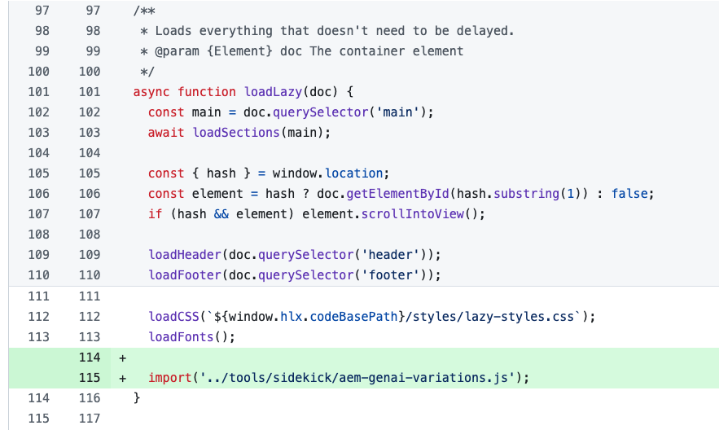
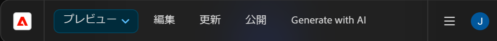

# バリエーションを生成 – AEM エディターに統合 {#generate-variations-integrated-in-aem-editors}

デジタルチャネルを最適化し、コンテンツの制作を迅速化する方法をお探しの場合は、AEMのエディターに統合されたバリエーションを生成を使用できます。

バリエーションを生成では、ジェネレーティブ人工知能（AI）を使用して、入力に基づくコンテンツのバリエーションを作成します。 バリエーションを作成したら、そのコンテンツを web サイトで使用することや、[Edge Delivery Services](/help/edge/overview.md) の[実験](https://www.aem.live/docs/experimentation)機能を使用してその成功を測定することもできます。

これにより、ブランドコンテンツを数分で迅速に作成できるので、コンテンツベロシティを向上できます。 これにより、新しいコピーバリアントを使用したコンバージョンを改善できます。

以下のエディターから [ バリエーションを生成 ](#access-generate-variations) アクセスできます（[ 設定されたら ](#access-generate-variations)）。

* [AEM Edge Delivery ServicesのSidekick内（ドキュメントベースのオーサリング用）](#access-aem-sidekick)
* [ユニバーサルエディター内](#access-aem-universal-editor)
* [コンテンツフラグメントエディター内](#access-aem-content-fragment-editor)

>[!IMPORTANT]
>
>このページでは、例のベースとしてドキュメントベースのオーサリングを使用しますが、原則は他のエディターにも適用されます。

>[!NOTE]
>
>いずれの場合も、「バリエーションを生成」を使用するには、[アクセスの前提条件](#access-prerequisites)が満たされていることを確認する必要があります。

>[!NOTE]
>
>スタンドアロンバージョンの [ バリエーションを生成 ](/help/generative-ai/generate-variations.md) には、引き続き直接アクセスできます。

これにより、以下のことが可能になります。

* [ 操作するコンテンツを選択 ](#select-the-content) - コンテンツの既存のブロックから
   * 選択したブロックによって、表示される内容と使用可能なアクションが変わります
* [必要な変更の説明](#describe-the-changes-you-want)
* [ コンテンツのバリエーションを生成 ](#generate-copy) してから [ 必要に応じてさらにアクションを実行 ](#take-further-action-on-a-variation)
* [バリエーションの選択と使用](#use-a-generated-variation)
* [ 履歴 ](#history) を確認
* [ お気に入り ](#favorites) を表示する

## 法的事項および使用上の注意 {#legal-usage-note}

<!--
Generative AI and Generate Variations for AEM are powerful tools – but **you** are responsible for use of the output.

Your inputs to the service should be tied to a context. This context can be your branding materials, website content, data, schemas for such data, templates, or other trusted documents.

You must evaluate the accuracy of any output as appropriate to your use case.

Before using Generate Variations you are recommended to read the [Adobe Experience Cloud Generative AI User Guidelines](https://www.adobe.com/legal/licenses-terms/adobe-dx-gen-ai-user-guidelines.html).
-->

[「バリエーションを生成」の使用](#generative-action-usage)は、生成アクションの使用に関連付けられます。

## 概要 {#overview}

エディターに統合されたバリエーションを生成を開くと、3 つのタブを持つフローティングパネルとして拡張機能が表示されます。


* エディター：
   * エディターにコンテンツのフローが表示されます。
   * ここでは、**バリエーションの生成** で使用するコンテンツのブロックを選択できます。
* **バリエーションを生成**:
   * 3 つのタブを持つフローティングパネルで、必要に応じて再配置できます
   * [ 生成 ](#get-started-with-generate-variations):
      * [ 選択したコンテンツ ](#select-the-content) が表示されます。
      * 変更のサンプル **候補** を示します。
      * [ 必要な変更を説明 ](#describe-the-changes-you-want) できます。
      * 新しいバリエーションを [ 生成 ](#generate-copy) できます。
      * 生成されたバリエーションを表示します。<!--, together with their [brand score](#the-brand-score).-->
      * [ バリエーションに対してさらにアクションを実行します ](#take-further-action-on-a-variation)。
      * [ 生成されたバリエーションを使用 ](#use-a-generated-variation)。
   * [ 履歴 ](#history):
      * 世代の最近の履歴を表示します。
   * [ お気に入り ](#favorites):
      * お気に入りとしてフラグを設定した、以前の世代の結果を表示します。
   * **Adobe生成 AI 用語**: [Adobe Experience Cloud生成 AI ユーザーガイドライン ](https://www.adobe.com/legal/licenses-terms/adobe-dx-gen-ai-user-guidelines.html) へのリンク。

## バリエーション生成の基本を学ぶ {#get-started-with-generate-variations}

インターフェイスのガイドに従って、コンテンツの生成プロセスを進めます。インターフェイスを開いたら、使用するコンテンツブロックを選択します。

### コンテンツを選択 {#select-the-content}

エディターのメインコンテンツフローから、バリエーションを生成するコンテンツを選択します。 この **選択** は、「**生成** タブに表示されます。

### 必要な変更の説明 {#describe-the-changes-you-want}

コンテンツのバリエーションを生成するには、必要な変更を記述する必要があります。 提示された **候補** の 1 つを選択するか、独自の説明を入力できます。

また、**修飾子** を指定して、より詳細なコンテキストを提供することもできます。

* **Web ページの参照**
詳細コンテキストの URL を指定します。
* **コンテンツ概要のアップロード**
コンテンツブリーフの詳細（10 MB 以下）を含む `.docx` ファイルを更新します。

### コピーの生成 {#generate-copy}

必要な変更を説明したら、「**生成**」を選択して、生成 AI からの応答を確認します。


<!--
### The Brand Score {#the-brand-score}

The brand score shows you how on-brand the generated variation is.
-->

### バリエーションにさらにアクションを実行 {#take-further-action-on-a-variation}

1 つのバリエーションを選択した場合、次の操作を使用できます。

* **編集**
   * 生成されたバリエーションのテキストを編集できます。

      * 更新内容は web ページでプレビューできます。

   * 後で使用するために変更を保存します。
* **お気に入り**
   * 今後の参照用にこのバリエーションにフラグを付けます。
   * フラグが設定されると、「[ お気に入り ](#favorites) タブの下に表示されます。
* **AI の根拠**
   * 透明性を高めるために、生成 AI が特定のバリエーションを生成した理由を簡単に説明します。

### 生成されたバリエーションを使用 {#use-a-generated-variation}

生成 AI で生成されたコンテンツを使用するには、まず **CSV に書き出し** を選択する必要があります。

書き出した後は、コンテンツを他の場所で使用できます。例えば、web サイトのコンテンツをオーサリングする場合などです。 また、[実験](https://www.aem.live/docs/experimentation)を実行することもできます。

>[!NOTE]
>
>[AEM ユニバーサルエディター ](#access-aem-universal-editor) または [AEM コンテンツフラグメントエディター ](#access-aem-content-fragment-editor) のいずれかから「バリエーションを生成」にアクセスすると、選択した生成されたコンテンツがAEMに自動的に保存されます。

## 履歴 {#history}

このタブには、「**生成**」を選択した後の過去のアクティビティが表示されます。 **履歴** エントリが追加されます。

後でメインフローで同じコンテンツを選択して「**履歴**」タブを開くと、そのブロックに生成されたすべてのバリエーションが表示されます。

## お気に入り {#favorites}

コンテンツを確認した後、選択したバリエーションをお気に入りとして保存できます。

保存すると、「お気に入り **の下に表示さ** ます。 お気に入りは、（お気に入りから外す **か** ブラウザーのキャッシュをクリアするまで）保持されます。

* エントリの **編集**、**お気に入りから外す** または **AI 根拠** を表示できます。
* バリエーションを選択すると、**CSV に書き出し** を実行することもできます。

## 生成アクションの使用 {#generative-action-usage}

使用状況の管理は、実行されるアクションに応じて異なります。

* バリエーションを生成

  コピーバリアントの 1 つの生成は、1 つの生成アクションに相当します。お客様には、AEM ライセンスに付属する一定数の生成アクションが提供されます。基本権限を使用すると、追加のアクションを購入できます。

  >[!NOTE]
  >
  >基本権限について詳しくは、[Adobe Experience Manager：Cloud Service | 製品の説明](https://helpx.adobe.com/jp/legal/product-descriptions/aem-cloud-service.html)を参照してください。追加の生成アクションを購入する場合は、アカウントチームにお問い合わせください。

## 「バリエーションを生成」へのアクセス {#access-generate-variations}

前提条件を満たしたら、AEM as a Cloud Service または Edge Delivery Services の Sidekick から「バリエーションを生成」にアクセスできます。

### アクセスのための前提条件 {#access-prerequisites}

「バリエーションを生成」を使用するには、前提条件が満たされていることを確認する必要があります。

* [Edge Delivery Services を使用した Experience Manager as a Cloud Service へのアクセス](#access-to-aemaacs-with-edge-delivery-services)

#### Edge Delivery Services を使用した Experience Manager as a Cloud Service へのアクセス{#access-to-aemaacs-with-edge-delivery-services}

「バリエーションを生成」にアクセスする必要があるユーザーには、Edge Delivery Services を使用した Experience Manager as a Cloud Service 環境を使用する権限が必要です。

>[!NOTE]
>
>AEM Sites as a Cloud Service の契約に Edge Delivery Services が含まれていない場合は、アクセス権を取得するために新しい契約に署名する必要があります。
>
>Edge Delivery Services を使用して AEM Sites as a Cloud Service に移行する方法については、アカウントチームにお問い合わせください。

特定のユーザーにアクセス権を付与するには、そのユーザーアカウントをそれぞれの製品プロファイルに割り当てます。詳しくは、[AEM 製品プロファイルの割り当て](/help/journey-onboarding/assign-profiles-cloud-manager.md)を参照してください。

### AEM Sidekickからアクセスして、ドキュメントベースのオーサリングを行う {#access-aem-sidekick}

AEM Sidekickからのアクセスは、[ ドキュメントベースのオーサリング ](/help/edge/wysiwyg-authoring/authoring.md) に使用されます。

（Edge Delivery Services の）Sidekick から「バリエーションを生成」にアクセスするには、いくつかの設定が必要です。

>[!NOTE]
>
>Sidekick のインストールおよび設定方法について詳しくは、[AEM Sidekick のインストール](https://www.aem.live/docs/sidekick-extension)ドキュメントを参照してください。

（Edge Delivery Servicesの）Sidekickでバリエーションを生成を使用するには、Edge Delivery Services プロジェクトに次の設定を含めます。

1. アプリを次の場所で有効にします。

   * `tools/sidekick/config.json`

   これは、既存の設定に結合してからデプロイする必要があります。

   例：

   ```prompt
   {
     "plugins": [
       {
         "id": "aem-genai-variations",
         "titleI18n": {
           "en": "Generate with AI"
         },
         "environments": [
           "preview"
         ],
         "includePaths": [
           "**.docx**"
         ],
         "event": "aem-genai-variations-sidekick"
       }
     ]
   }
   ```

1. 作成：

   * `/tools/sidekick/aem-genai-variations.js`

   このファイルは、次の内容で作成する必要があります。

   ```prompt
   (function () {
     let isAEMGenAIVariationsAppLoaded = false;
     function loadAEMGenAIVariationsApp() {
       const script = document.createElement('script');
       script.src = 'https://experience.adobe.com/solutions/aem-sites-genai-aem-genai-variations-mfe/static-assets/resources/sidekick/client.js?source=plugin';
       script.onload = function () {
         isAEMGenAIVariationsAppLoaded = true;
       };
       script.onerror = function () {
         console.error('Error loading AEMGenAIVariationsApp.');
       };
       document.head.appendChild(script);
     }
   
     function handlePluginButtonClick() {
       if (!isAEMGenAIVariationsAppLoaded) {
         loadAEMGenAIVariationsApp();
       }
     }
   
     // The code snippet for the Sidekick V1 extension, https://chromewebstore.google.com/detail/aem-sidekick/ccfggkjabjahcjoljmgmklhpaccedipo?hl=en
     const sidekick = document.querySelector('helix-sidekick');
     if (sidekick) {
       // sidekick already loaded
       sidekick.addEventListener('custom:aem-genai-variations-sidekick', handlePluginButtonClick);
     } else {
       // wait for sidekick to be loaded
       document.addEventListener('sidekick-ready', () => {
         document.querySelector('helix-sidekick')
           .addEventListener('custom:aem-genai-variations-sidekick', handlePluginButtonClick);
       }, { once: true });
     }
   
     // The code snippet for the Sidekick V2 extension, https://chromewebstore.google.com/detail/aem-sidekick/igkmdomcgoebiipaifhmpfjhbjccggml?hl=en
     const sidekickV2 = document.querySelector('aem-sidekick');
     if (sidekickV2) {
       // sidekick already loaded
       sidekickV2.addEventListener('custom:aem-genai-variations-sidekick', handlePluginButtonClick);
     } else {
       // wait for sidekick to be loaded
       document.addEventListener('sidekick-ready', () => {
         document.querySelector('aem-sidekick')
           .addEventListener('custom:aem-genai-variations-sidekick', handlePluginButtonClick);
       }, { once: true });
     }
   }());
   ```

1. 更新：

   * `/scripts/scripts.js`

   これを更新して、`loadLazy()`function に次のステートメントを含める必要があります。

   ```prompt
     import('../tools/sidekick/aem-genai-variations.js');
   ```

   これにより、遅延読み込みプロセスの一環として `/tools/sidekick/aem-genai-variations.js` が読み込まれます。

   

1. 次に、ユーザーが [Edge Delivery Services を使用して Experience Manager as a Cloud Service にアクセス](#access-to-aemaacs-with-edge-delivery-services)できることを確認する必要があります。

1. その後、Sidekickのツールバーから **AI を使用して生成** を選択して、この機能にアクセスできます。

   

### AEM Universal Editor からのアクセス {#access-aem-universal-editor}

[AEM ユニバーサルエディター ](/help/sites-cloud/authoring/universal-editor/authoring.md) からのアクセスは、拡張機能として実装されます。 詳しくは、[AEM Experience ManagerのExtension Manager](https://developer.adobe.com/uix/docs/extension-manager/) を参照してください。

### AEM コンテンツフラグメントエディターからのアクセス {#access-aem-content-fragment-editor}

[AEM コンテンツフラグメントエディター ](/help/sites-cloud/administering/content-fragments/authoring.md#generate-variations-ai) からのアクセスは、拡張機能として実装されます。 詳しくは、[AEM Experience ManagerのExtension Manager](https://developer.adobe.com/uix/docs/extension-manager/) を参照してください。

## その他の情報 {#further-information}

詳しくは、次も参照してください。

* [GitHub での生成 AI による「バリエーションを生成」](https://github.com/adobe/aem-genai-assistant#setting-up-aem-genai-assistant)
* [Edge Delivery Services の実験](https://www.aem.live/docs/experimentation)

## リリース履歴 {#release-history}

現在および以前のリリースについて詳しくは、[バリエーションを生成のリリースノート](/help/generative-ai/release-notes-generate-variations.md)を参照してください。
