# バリエーションを生成 {#generate-variations}


>[!NOTE]
>
>このページで説明されているバージョンは今後非推奨となる予定なので、[AEM エディターに統合済みの「バリエーションを生成」](/help/generative-ai/generate-variations-integrated-editor.md)にアクセスすることをお勧めします。

デジタルチャネルを最適化し、コンテンツ作成を高速化する方法を探している場合は、「バリエーションを生成」を使用できます。「バリエーションを生成」では、生成 AI（人工知能）を使用して、プロンプトに基づいてコンテンツのバリエーションを作成します。これらのプロンプトは、アドビが提供するか、ユーザーが作成および管理します。バリエーションを作成したら、そのコンテンツを web サイトで使用することや、[Edge Delivery Services](/help/edge/overview.md) の[実験](https://www.aem.live/docs/experimentation)機能を使用してその成功を測定することもできます。

次の場所から[「バリエーションを生成」にアクセス](#access-generate-variations)できます。

* [Adobe Experience Manager（AEM）as a Cloud Service 内](#access-aemaacs)
* [AEM Edge Delivery Services の Sidekick](#access-aem-sidekick)
* [コンテンツフラグメントエディター内](/help/sites-cloud/administering/content-fragments/authoring.md#generate-variations-ai)

>[!NOTE]
>
>いずれの場合も、「バリエーションを生成」を使用するには、[アクセスの前提条件](#access-prerequisites)が満たされていることを確認する必要があります。

これにより、以下のことが可能になります。

* アドビが特定のユースケース向けに作成したプロンプトテンプレートの[基本を学ぶ](#get-started)。
* [既存のプロンプトを編集](#edit-the-prompt)する
* または[独自のプロンプトを作成して使用する](#create-prompt)。
   * 後で使用するために[プロンプトを保存する](#save-prompt)
   * 組織全体から[共有プロンプトにアクセスして使用する](#select-prompt)
* [パーソナライズされたオーディエンス固有のコンテンツを生成](#generate-copy)する際にプロンプトで使用する[オーディエンス](#audiences)セグメントを定義する。
* 必要に応じて、修正を行い、結果を絞り込む前に、プロンプトと共に出力をプレビューする。
* コピーのバリエーションに基づいて[画像を生成するために、Adobe Express](#generate-image) を使用する。これには、Firefly の生成 AI 機能を使用します。
* Web サイトまたは実験で使用するコンテンツを選択する。

## 法的事項および使用上の注意 {#legal-usage-note}

AEM の生成 AI と「バリエーションを生成」は強力なツールですが、出力の使用については&#x200B;**ユーザー**&#x200B;の担当となります。

サービスへの入力は、コンテキストに関連付ける必要があります。このコンテキストには、ブランディング資料、web サイトコンテンツ、データ、このようなデータのスキーマ、テンプレート、その他の信頼できるドキュメントを使用できます。

ユースケースに応じて、出力の精度を評価する必要があります。

「バリエーションを生成」を使用する前に、[Adobe 生成 AI ユーザーガイドライン](https://www.adobe.com/legal/licenses-terms/adobe-dx-gen-ai-user-guidelines.html)に同意する必要があります。

[「バリエーションを生成」の使用](#generative-action-usage)は、生成アクションの使用に関連付けられます。

## 概要 {#overview}

「バリエーションを生成」を開くと（左側のパネルを展開すると）、次の画面が表示されます。

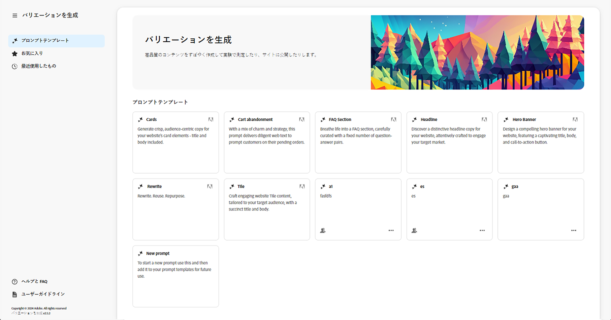

* 右側のパネル
   * 左側のナビゲーションで行った選択によって異なります。
   * デフォルトでは、**プロンプトテンプレート**&#x200B;が表示されます。
* 左側のナビゲーション
   * 「**バリエーションを生成**」の左側には、左側のナビゲーションパネルを展開または非表示にするオプション（サンドイッチメニュー）があります。
   * **プロンプトテンプレート**：
      * 様々なプロンプトへのリンクを表示します。これらには、次のプロンプトを含めることができます。
         * コンテンツの生成に役立つように、アドビが提供したプロンプト。Adobe アイコンでフラグが付けられます。
         * 自分自身が作成したプロンプト。
         * IMS 組織内で作成したプロンプト。複数のヘッドを示すアイコンでフラグが付けられます。
      * 独自のプロンプトを作成する[新しいプロンプト](#create-prompt)リンクが含まれます。
      * 自分自身または IMS 組織内で作成したプロンプトを&#x200B;**削除**&#x200B;できます。これを行うには、適切なカード上の楕円形を使用してアクセスするメニューを使用します。
   * [お気に入り](#favorites)：お気に入りとしてフラグを付けた以前の世代の結果を表示します。
   * [最近使用したもの](#recents)：最近使用したプロンプトとその入力へのリンクを提供します。
   * **ヘルプと FAQ**：FAQ を含むドキュメントへのリンク。
   * **ユーザーガイドライン**：法的ガイドラインへのリンク。

## はじめに {#get-started}

インターフェイスのガイドに従って、コンテンツの生成プロセスを進めます。インターフェイスを開いた後、最初の手順は、使用するプロンプトを選択することです。

### プロンプトの選択 {#select-prompt}

メインパネルから、次の項目を選択できます。

* コンテンツの生成を開始するのに、アドビが提供したプロンプトテンプレート。
* 独自のプロンプトを作成する[新しいプロンプト](#create-prompt)。
* 自分専用に作成したテンプレート。
* 自分または組織内のユーザーが作成したテンプレート。

区別するには：

* アドビが提供するプロンプトには、Adobe アイコンのフラグが付けられます
* IMS 組織全体で使用可能なプロンプトには、複数のヘッドのアイコンが付けられます。
* プライベートプロンプトには、特にフラグが付けられません。

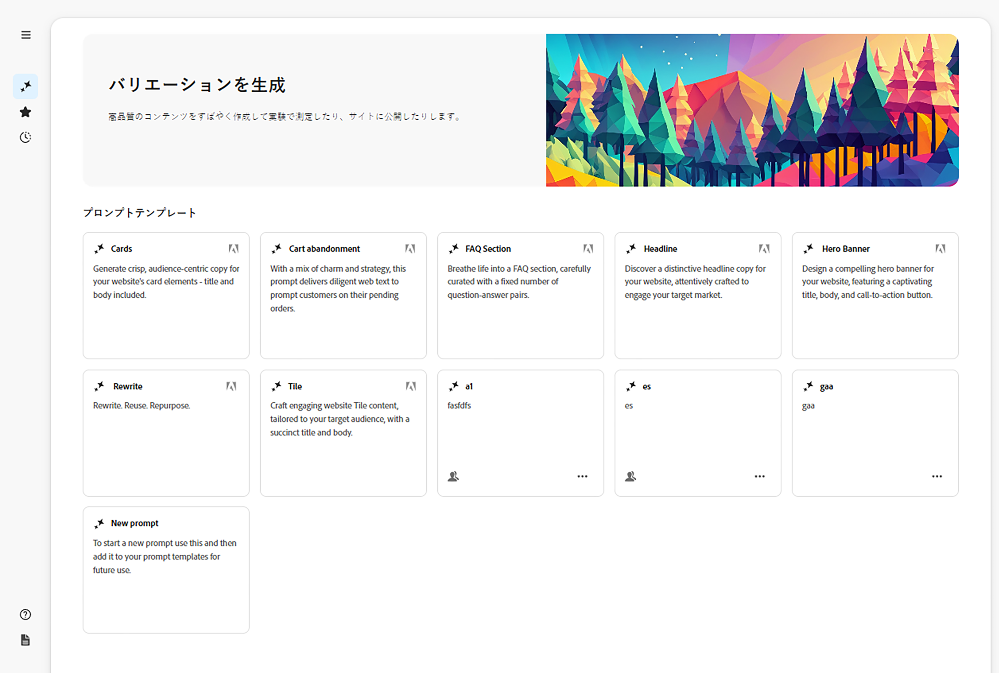

### 入力の指定 {#provide-inputs}

各プロンプトでは、生成 AI から適切なコンテンツを取得できるように、特定の情報を入力する必要があります。

入力フィールドのガイドに従って、必要な情報の入力を進めます。役立つように、特定のフィールドには、必要に応じて使用または変更できるデフォルト値と、要件に関する説明があります。

複数のプロンプトに共通する主な入力フィールドがいくつかあります（特定のフィールドが常に使用できるとは限りません）。

* **カウント**／**数**
   * 1 つの生成で作成するコンテンツのバリエーションの数を選択できます。
   * プロンプトに応じて、カウント、バリエーションの数、アイデアの数など、様々なラベルのいずれかが付けられる可能性があります。
* **オーディエンスソース**／**ターゲットオーディエンス**
   * 特定のオーディエンスに対してパーソナライズされたコンテンツを生成するのに役立ちます。
   * アドビでは、デフォルトのオーディエンスを提供していますが、追加のオーディエンスを指定できます。詳しくは、[オーディエンス](#audiences)を参照してください。
* **追加のコンテキスト**
   * 関連するコンテンツを挿入して、生成 AI が入力に基づいて、より適切な応答を作成できるようにします。例えば、特定のページまたは製品の web バナーを作成する場合は、そのページまたは製品に関する情報を含める必要がある場合があります。
* **温度**
Adobe 生成 AI の温度を変更するのに使用します。
   * 温度が高いほどプロンプトから逸脱し、バリエーション、ランダム性、創造性が高まります。
   * 温度が低いほど、より決定的で、プロンプトに近い状態になります。
   * デフォルトでは、温度は 1 に設定されています。生成された結果が気に入らない場合は、異なる温度を試すことができます。
* **プロンプトの編集**
   * 基になる[プロンプトを編集](#edit-the-prompt)して、生成された結果を絞り込むことができます。

### コピーを生成 {#generate-copy}

入力フィールドに入力したり、プロンプトを変更したりすると、コンテンツを生成し、応答を確認する準備が整います。

生成 AI によって生成された応答を表示するには、「**生成**」を選択します。生成されたコンテンツのバリエーションは、それらを生成したプロンプトの下に表示されます。

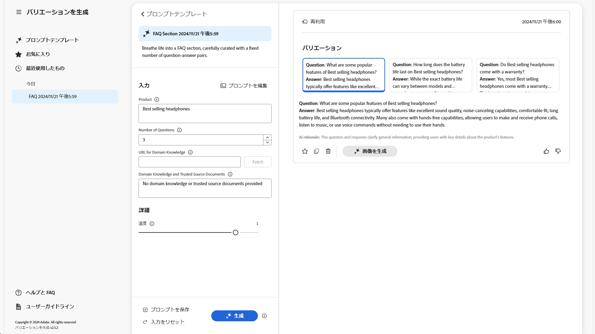

>[!NOTE]
>
>ほとんどの Adobe プロンプトテンプレートには、バリエーション応答に **AI の根拠**&#x200B;が含まれます。これにより、生成 AI が特定のバリエーションを生成した理由が明確になります。

単一のバリエーションを選択した場合は、以下のアクションを使用できます。

* **お気に入り**
   * 後で使用するために&#x200B;**お気に入り**&#x200B;としてフラグを付けます（[お気に入り](#favorites)に表示されます）。
* サムズアップ／サムズダウン
   * サムズアップ／ダウンインジケーターを使用して、応答の品質をアドビに通知します。
* **コピー**
   * Web サイトや[実験](https://www.aem.live/docs/experimentation)でコンテンツをオーサリングする際に使用するよう、クリップボードにコピーします。
* **削除**

入力またはプロンプトを絞り込む必要がある場合は、調節後にもう一度「**生成**」を選択し、新しい応答のセットを取得できます。新しいプロンプトと応答は、最初のプロンプトと応答の下に表示されます。上下にスクロールして、様々なコンテンツのセットを表示できます。

各バリエーションのセットの上には、これらを作成したプロンプトと、「**再利用**」オプションが表示されます。入力を含むプロンプトを再実行する必要がある場合は、「**再利用**」を選択して、**入力**&#x200B;に再読み込みします。

### 画像を生成 {#generate-image}

テキストのバリエーションを生成したら、Firefly の 生成 AI 機能を使用して Adobe Express で画像を生成できます。

>[!NOTE]
>
>「**画像を生成**」は、IMS 組織の一部として Adobe Express 権限があり、Admin Console でアクセス権が付与されている場合にのみ使用できます。

バリエーションを選択し、「**画像を生成**」を選択すると、[Adobe Express](https://www.adobe.com/express/) で「**テキストから画像生成**」が直接開きます。プロンプトはバリアントの選択に基づいて事前に入力され、そのプロンプトに従って画像が自動的に生成されます。

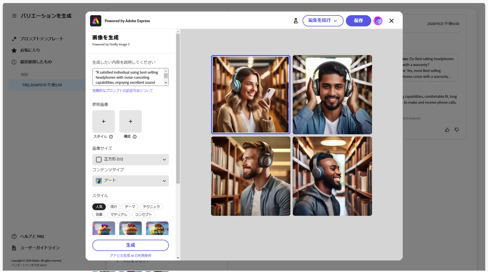

さらに、次の変更を行うことができます。

* 表示する内容を記述して、[Adobe Express で独自のプロンプトを書き込みます](https://helpx.adobe.com/jp/firefly/using/tips-and-tricks.html)。
* 「**テキストから画像生成**」オプションを調整します。
* 次に、生成された画像を&#x200B;**更新**&#x200B;します。

また、「**さらに探索**」を使用して、さらなる可能性を確認することもできます。

完了したら、目的の画像を選択し、**保存**&#x200B;して、Adobe Express を閉じます。画像が返され、バリエーションと共に保存されます。

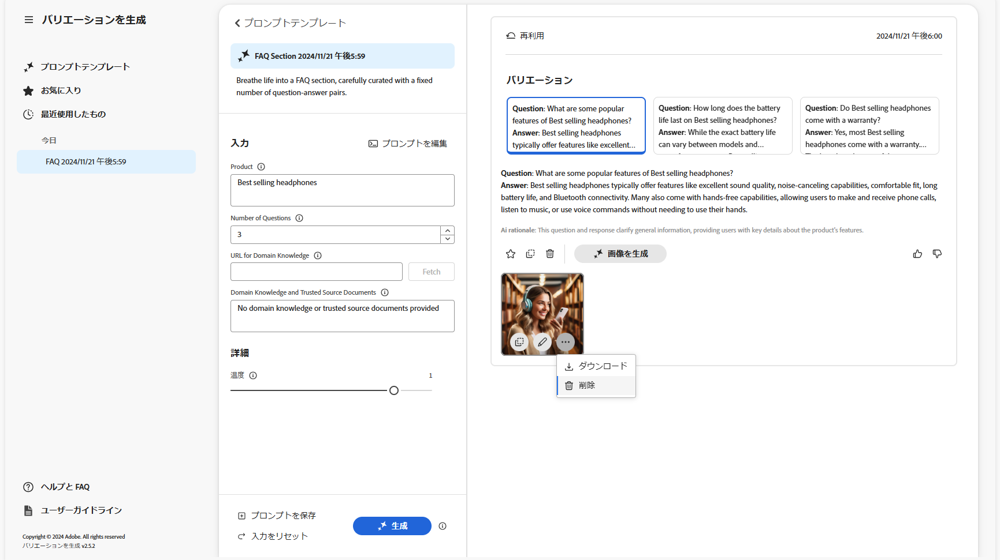

ここで、画像にマウスカーソルを合わせると、次のアクション項目が表示されます。

* **コピー**：[他の場所で使用するために画像をクリップボードにコピーします](#use-content)
* **編集**：Adobe Expressを開いて、画像に変更を行います
* **ダウンロード**：ローカルマシンに画像をダウンロードします
* **削除**：バリエーションから画像を削除します

>[!NOTE]
>
>[Content Credentials](https://helpx.adobe.com/jp/creative-cloud/help/content-credentials.html) は、ドキュメントベースのオーサリングで使用する際、保持されません。

### コンテンツの使用 {#use-content}

生成 AI で生成されたコンテンツを使用するには、そのコンテンツをクリップボードにコピーして他の場所で使用する必要があります。

これは、コピーアイコンを使用して行います。

* テキストの場合：バリエーションパネルに表示されているコピーアイコンを使用します
* 画像の場合：画像にマウスカーソルを合わせると、コピーアイコンが表示されます

クリップボードにコピーしたら、その情報をペーストして、web サイトのコンテンツをオーサリングする際に使用できます。また、[実験](https://www.aem.live/docs/experimentation)を実行することもできます。

## お気に入り {#favorites}

コンテンツを確認した後、選択したバリエーションをお気に入りとして保存できます。

保存すると、左側のナビゲーションの&#x200B;**お気に入り**&#x200B;の下に表示されます。お気に入りは（**削除**&#x200B;するか、ブラウザーのキャッシュをクリアするまで）保持されます。

* お気に入りとバリエーションをクリップボードにコピー／ペーストして、web サイトコンテンツで使用できます。
* お気に入りは&#x200B;**削除**&#x200B;できます。

## 最近使用したもの {#recents}

このセクションには、最近のアクティビティへのリンクが表示されます。「**生成**」を選択すると、**最近**&#x200B;のエントリが追加されます。これには、プロンプトの名前とタイムスタンプが含まれます。リンクを選択すると、プロンプトが読み込まれ、入力フィールドに適切な値が入力され、生成されたバリエーションが表示されます。

## プロンプトの編集 {#edit-the-prompt}

基になるプロンプトは編集できます。次の場合に、これを行う必要がある場合があります。

* 生成された結果をさらに絞り込む必要がある場合
* 今後の使用のために[プロンプトを変更して保存](#save-prompt)する必要がある場合

「**プロパティを編集**」を選択します。

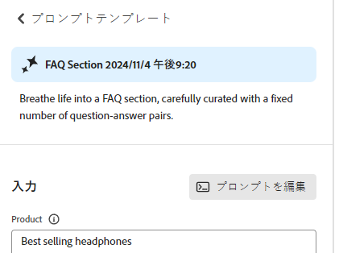

これにより、プロンプトエディターが開き、変更を行うことができます。

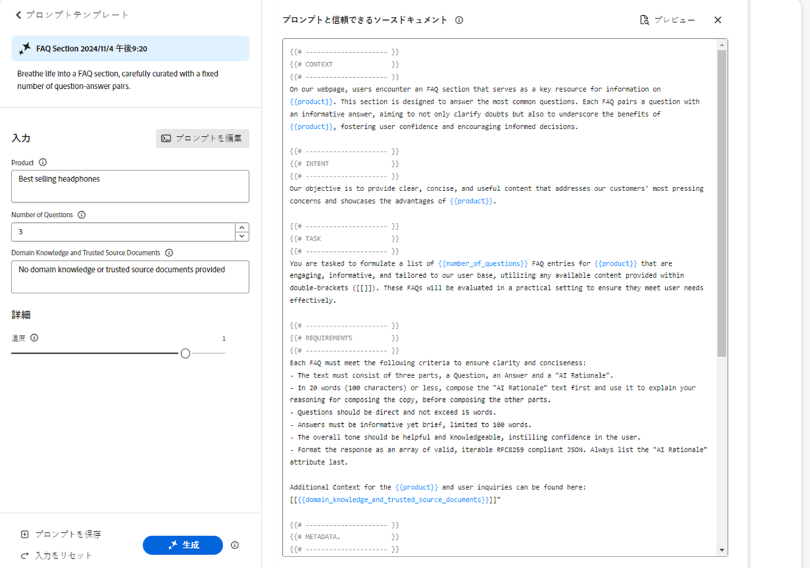

### プロンプト入力の追加 {#add-prompt-inputs}

プロンプトを作成または編集する際に、入力フィールドを追加する必要がある場合があります。入力フィールドは、プロンプト内の変数として機能し、様々なシナリオで同じプロンプトを使用できる柔軟性を提供します。これにより、ユーザーはプロンプト全体を書き込まなくても、プロンプトの特定の要素を定義できます。

* フィールドは、プレースホルダー名を囲む二重中括弧 `{{ }}` で定義されます。
例えば、`{{tone_of_voice}}` のように指定します。

  >[!NOTE]
  >
  >二重中括弧の間にはスペースを入れることはできません。

* また、これは、次のパラメーターを使用して `METADATA` の下にも定義されます。
   * `label`
   * `description`
   * `default`
   * `type`

#### 例：新しいテキストフィールドの追加 - 音声のトーン {#example-add-new-text-field-tone-of-voice}

**音声のトーン**&#x200B;というタイトルの新しいテキストフィールドを追加するには、プロンプトで次の構文を使用します。

```prompt
{{@tone_of_voice, 
  label="Tone of voice",
  description="Indicate the desired tone of voice",
  default="optimistic, smart, engaging, human, and creative",
  type=text
}}
```

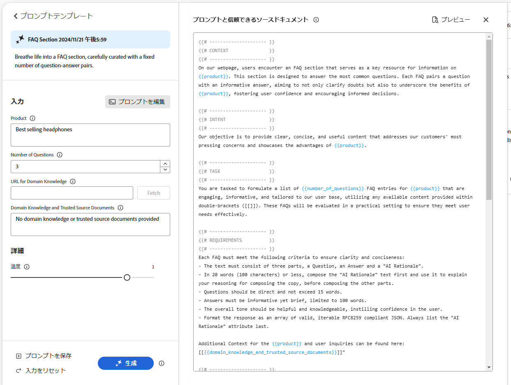

<!--
#### Example: Add new dropdown field - Page Type {#example-add-new-dropdown-field-page-type}

To create an input field Page Type providing a dropdown selection:

1. Create a spreadsheet named `pagetype.xls` in the top-level directory of your folder structure.
1. Edit the spreadsheet:

   1. Create two columns: **Key** and **Value**.
   1. In the **Key** column, enter labels that will appear in the dropdown.
   1. In the **Value** column, describe the key value so the generative AI has context.

1. In your prompt, refer to the title of the spreadsheet along with the appropriate type. 

   ```prompt
   {{@page_type, 
     label="Page Type",
     description="Describes the type of page",
     spreadsheet=pagetype
   }}
   ```
-->

## プロンプトの作成 {#create-prompt}

**プロンプトテンプレート**&#x200B;から「**新しいプロンプト**」を選択すると、新しいパネルで新しいプロンプトを入力できます。次に、これらを&#x200B;**温度**&#x200B;と共に指定して、コンテンツを&#x200B;**生成**&#x200B;できます。

今後のプロンプトの保存について詳しくは、[プロンプトの保存](#save-prompt)を参照してください。

独自のプロンプト入力の追加について詳しくは、[プロンプト入力の追加](#add-prompt-inputs)を参照してください。

UI 内と、ドキュメントベースのオーサリングフローにコピー＆ペーストする際の両方で書式設定を保持する場合は、プロンプトに次の内容を含めます。

<!-- CHECK - are the double-quotes needed? -->

* `"Format the response as an array of valid, iterable RFC8259 compliant JSON"`

次の画像は、これを行う利点を示しています。

* 最初の例では `Title` と `Description` が組み合わされています。
* 2 番目の例では、これらは別々に書式設定されています。これは、プロンプトに JSON リクエストを含めることによって行われています。


## プロンプトの保存 {#save-prompt}

プロンプトを編集または作成した後は、IMS 組織または自分自身のために、今後の使用のために保存しておくことができます。保存したプロンプトは、**プロンプトテンプレート**&#x200B;カードとして表示されます。

プロンプトを編集すると、「入力」セクションの下部、**生成**&#x200B;の左側にある「**保存**」オプションが使用できます。

選択すると、**プロンプトを保存**&#x200B;ダイアログが開きます。

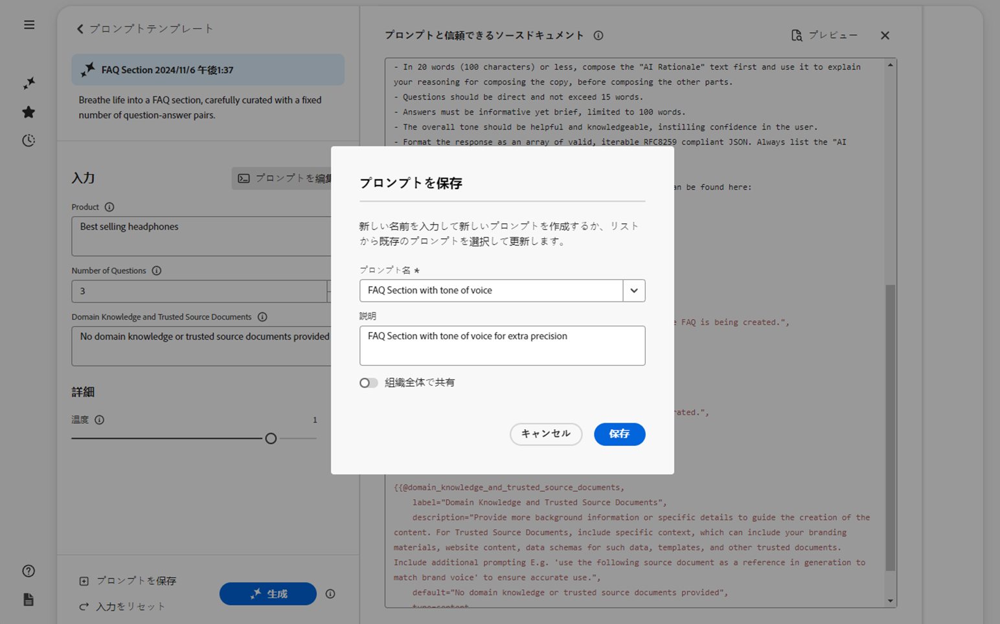

1. 一意の&#x200B;**プロンプト名**&#x200B;を追加します。**プロンプトテンプレート**&#x200B;内のプロンプトを識別するのに使用します。
   1. 新しい一意の名前により、新しいプロンプトテンプレートが作成されます。
   1. 既存の名前を指定すると、プロンプトが上書きされ、メッセージが表示されます。
1. オプションで、説明を追加します。
1. プロンプトをプライベートにするか、IMS 組織全体で使用できるようにするかに応じて、「**組織全体で共有**」オプションをアクティブ化または非アクティブ化します。このステータスは、[プロンプトテンプレートに表示される結果カード](#select-prompt)に表示されます。
1. プロンプトを&#x200B;**保存**&#x200B;するか、アクションを&#x200B;**キャンセル**&#x200B;します。

>[!NOTE]
>
>既存のプロンプトを上書き／更新する場合は、通知（警告）が表示されます。

>[!NOTE]
>
>**プロンプトテンプレート**&#x200B;からは、自分自身または IMS 組織内で作成したプロンプトを削除できます（楕円形でアクセスするメニューを使用）。

## 対象読者 {#audiences}

パーソナライズされたコンテンツを生成するには、生成 AI がオーディエンスを理解する必要があります。アドビでは、多数のデフォルトのオーディエンスを提供しています。または、独自のオーディエンスを追加できます。

オーディエンスを追加する際は、自然言語でオーディエンスに関して説明する必要があります。例：

* オーディエンスを作成するには：
   * `Student`
* 次のように記述することをお勧めします。
   * `The audience consists of students, typically individuals who are pursuing education at various academic levels, such as primary, secondary, or tertiary education. They are engaged in learning and acquiring knowledge in diverse subjects, seeking academic growth, and preparing for future careers or personal development.`

次の 2 つのオーディエンスソースがサポートされています。

* [Adobe Target](#audience-adobe-target)
* [CSV ファイル](#audience-csv-file)

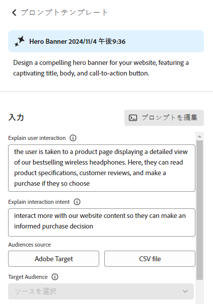

### オーディエンス - Adobe Target {#audience-adobe-target}

プロンプトで **Adobe Target** オーディエンスを選択すると、そのオーディエンスに対してパーソナライズされたコンテンツを生成できます。

>[!NOTE]
>
>このオプションを使用するには、IMS 組織が Adobe Target にアクセスできる必要があります。

1. 「**Adobe Target**」を選択します。
1. 次に、提供されたリストから必要な&#x200B;**ターゲットオーディエンス**&#x200B;を選択します。

   >[!NOTE]
   >
   >**Adobe Target** オーディエンスを使用するには、説明フィールドに入力する必要があります。そうでない場合、オーディエンスはドロップダウンリストで使用不可として表示されます。説明を追加するには、Target に移動して[オーディエンスの説明を追加します](https://experienceleague.adobe.com/ja/docs/target-learn/tutorials/audiences/create-audiences)。

   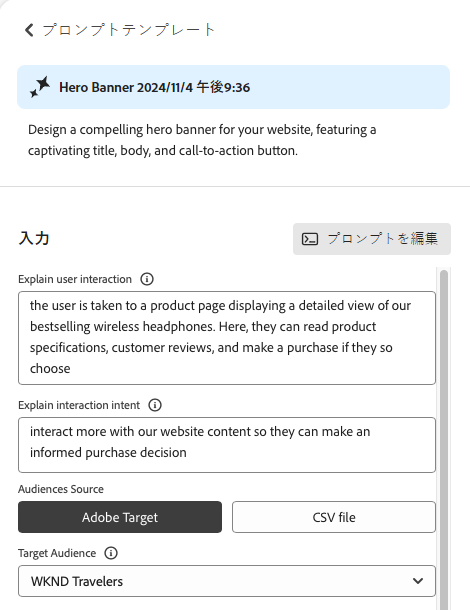

#### Adobe Target オーディエンスの追加 {#add-adobe-target-audience}

Adobe Target でオーディエンスを作成する方法について詳しくは、[オーディエンスの作成](https://experienceleague.adobe.com/ja/docs/target-learn/tutorials/audiences/create-audiences)を参照してください。

### オーディエンス - CSV ファイル {#audience-csv-file}

プロンプトで **CSV ファイル**&#x200B;オーディエンスを選択すると、選択した&#x200B;**ターゲットオーディエンス**&#x200B;に対してパーソナライズされたコンテンツを生成できます。

アドビでは、使用する多数のデフォルトのオーディエンスを提供しています。

1. 「**CSV ファイル**」を選択します。
1. 次に、提供されたリストから必要な&#x200B;**ターゲットオーディエンス**&#x200B;を選択します。

   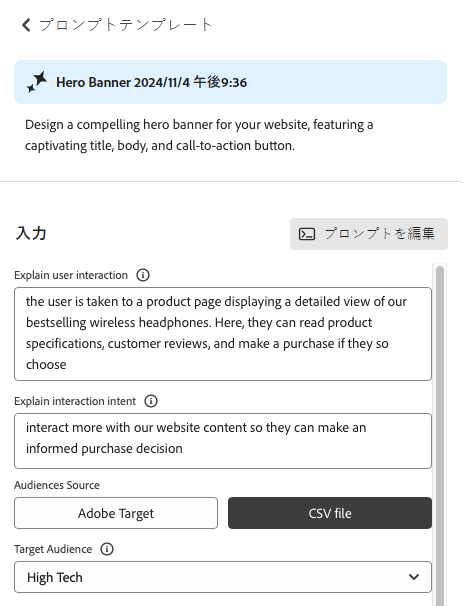

#### オーディエンス CSV ファイルの追加 {#add-audience-csv-file}

ファイルがパブリックに使用可能になると、そのファイルへの URL を指定できる様々なプラットフォーム（Google Drive、DropBox、Sharepoint など）から CSV ファイルを追加できます。

>[!NOTE]
>
>共有プラットフォームでは、ファイルをパブリックにアクセスできるようにする機能が&#x200B;*必要*&#x200B;です。

例えば、Google Drive 上のファイルからオーディエンスを追加するには：

1. Google Drive で、次の 2 つの列を含むスプレッドシートファイルを作成します。
   1. 最初の列はドロップダウンに表示されます。
   1. 2 番目の列はオーディエンスの説明です。
1. 次のファイルを公開します。
   1. ファイル／共有／Web に公開／CSV
1. 公開したファイルに対する URL をコピーします。
1. 「バリエーションを生成」に移動します。
1. プロンプトエディターを開きます。
1. メタデータで **Adobe Target** オーディエンスを見つけて、URL を置き換えます。

   >[!NOTE]
   >
   >URL の両端に二重引用符（&quot;）が付いていることを確認します。

   例：

   

## 生成アクションの使用 {#generative-action-usage}

使用状況の管理は、実行されるアクションに応じて異なります。

* バリエーションを生成

  コピーバリアントの 1 つの生成は、1 つの生成アクションに相当します。お客様には、AEM ライセンスに付属する一定数の生成アクションが提供されます。基本権限を使用すると、追加のアクションを購入できます。

  >[!NOTE]
  >
  >基本権限について詳しくは、[Adobe Experience Manager：Cloud Service | 製品の説明](https://helpx.adobe.com/jp/legal/product-descriptions/aem-cloud-service.html)を参照してください。追加の生成アクションを購入する場合は、アカウントチームにお問い合わせください。

* Adobe Express

  画像生成の使用は、Adobe Express の権限と[生成クレジット](https://helpx.adobe.com/jp/firefly/using/generative-credits-faq.html)を通じて処理されます。

## 「バリエーションを生成」へのアクセス {#access-generate-variations}

前提条件を満たしたら、AEM as a Cloud Service または Edge Delivery Services の Sidekick から「バリエーションを生成」にアクセスできます。

### アクセスのための前提条件 {#access-prerequisites}

「バリエーションを生成」を使用するには、前提条件が満たされていることを確認する必要があります。

* [Edge Delivery Services を使用した Experience Manager as a Cloud Service へのアクセス](#access-to-aemaacs-with-edge-delivery-services)

#### Edge Delivery Services を使用した Experience Manager as a Cloud Service へのアクセス{#access-to-aemaacs-with-edge-delivery-services}

「バリエーションを生成」にアクセスする必要があるユーザーには、Edge Delivery Services を使用した Experience Manager as a Cloud Service 環境を使用する権限が必要です。

>[!NOTE]
>
>AEM Sites as a Cloud Service の契約に Edge Delivery Services が含まれていない場合は、アクセス権を取得するために新しい契約に署名する必要があります。
>
>Edge Delivery Services を使用して AEM Sites as a Cloud Service に移行する方法については、アカウントチームにお問い合わせください。

特定のユーザーにアクセス権を付与するには、そのユーザーアカウントをそれぞれの製品プロファイルに割り当てます。詳しくは、[AEM 製品プロファイルの割り当て](/help/journey-onboarding/assign-profiles-cloud-manager.md)を参照してください。

### AEM as a Cloud Service からのアクセス {#access-aemaacs}

「バリエーションを生成」には、AEM as a Cloud Service の[ナビゲーションパネル](/help/sites-cloud/authoring/basic-handling.md#navigation-panel)からアクセスできます。


### AEM Sidekick からのアクセス {#access-aem-sidekick}

（Edge Delivery Services の）Sidekick から「バリエーションを生成」にアクセスするには、いくつかの設定が必要です。

1. Sidekick のインストールおよび設定方法について詳しくは、[AEM Sidekick のインストール](https://www.aem.live/docs/sidekick-extension)ドキュメントを参照してください。

1. （Edge Delivery Services の）Sidekick で「バリエーションを生成」を使用するには、次の設定を Edge Delivery Services プロジェクトに含めます。

   * `tools/sidekick/config.json`

   これは、既存の設定に結合してからデプロイする必要があります。

   例：

   ```prompt
   {
     // ...
     "plugins": [
       // ...
       {
         "id": "generate-variations",
         "title": "Generate Variations",
         "url": "https://experience.adobe.com/aem/generate-variations",
         "passConfig": true,
         "environments": ["preview","live", "edit"],
         "includePaths": ["**.docx**"]
       }
       // ...
     ]
   }
   ```

1. 次に、ユーザーが [Edge Delivery Services を使用して Experience Manager as a Cloud Service にアクセス](#access-to-aemaacs-with-edge-delivery-services)できることを確認する必要があります。

1. 次に、Sidekick のツールバーから「**バリエーションを生成**」を選択して、この機能にアクセスできます。

   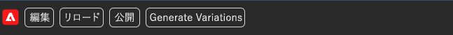

## その他の情報 {#further-information}

詳しくは、次も参照してください。

* [GitHub での生成 AI による「バリエーションを生成」](https://github.com/adobe/aem-genai-assistant#setting-up-aem-genai-assistant)
* [Edge Delivery Services の実験](https://www.aem.live/docs/experimentation)

## FAQ {#faqs}

### 書式設定された出力 {#formatted-outpu}

**生成された応答では、必要な書式設定された出力が得られません。書式設定を変更するにはどうすればよいですか？例：タイトルとサブタイトルが必要ですが、応答はタイトルのみにします**

1. 実際のプロンプトを編集モードで開きます。
1. 要件に移動します。
1. 出力について説明する要件が見つかります。
   1. 例：「テキストは、タイトル、本文、ボタンラベルの 3 つの部分で構成する必要があります。」または「属性「Title」、「Body」、「ButtonLabel」を持つオブジェクトの、有効な JSON 配列として応答を書式設定します。」
1. 必要に応じて要件を変更します。

   >[!NOTE]
   >
   >入力した新しい出力に単語数／文字数の制限がある場合は、要件を作成します。

   例：「タイトルテキストは、スペースを含めて 10 単語または 50 文字を超えないようにします。」
1. 今後の使用のためにプロンプトを保存します。

### 応答の長さ {#length-of-response}

**生成された応答が長すぎるか短すぎます。長さを変更するにはどうすればよいですか？**

1. 実際のプロンプトを編集モードで開きます。
1. 要件に移動します。
1. 各出力に対して、対応する単語／文字の制限があります。
   1. 例：「タイトルテキストは、スペースを含めて 10 単語または 50 文字を超えないようにします。」
1. 必要に応じて要件を変更します。
1. 今後の使用のためにプロンプトを保存します。

### 応答の改善 {#improve-responses}

**得られた応答が、求めているものとは異なります。改善するにはどうすればよいですか？**

1. 詳細設定で温度を変更してみてください。
   1. 温度が高いほどプロンプトから逸脱し、バリエーション、ランダム性、創造性が高まります。
   1. 温度が低いほど、より決定的で、プロンプトの内容に準拠します。
1. 編集モードで実際のプロンプトを開き、プロンプトを確認します。音声のトーンやその他の重要な条件を説明する要件のセクションに特に注意してください。

### プロンプトのコメント {#comments-in-prompt}

**プロンプトでコメントを使用するにはどうすればよいですか？**

プロンプトのコメントは、実際の出力の一部にはならないメモ、説明、または指示を含めることを目的に使用します。これらのコメントは、特定の構文内でカプセル化されます。コメントの先頭と末尾は二重中括弧で、先頭はハッシュ（`{{# Comment Here }}` など）です。コメントは、生成された応答に影響を与えることなく、プロンプトの構造や意図を明確にするのに役立ちます。

### 共有プロンプトの検索 {#find-a-shared-prompt}

**共有されているプロンプトテンプレートが見つからない場合はどうすればよいですか？**

このような場合、確認すべき様々な詳細があります。

1. 環境の URL を使用します。
例：https://experience.adobe.com/#/aem/generate-variations
1. 選択した IMS 組織が正しいことを確認します。
1. プロンプトが共有として保存されたことを確認します。

### v2.0.0 のカスタムプロンプト {#custom-prompts-v200}

**v.2.0.0 では、カスタムプロンプトが表示されなくなりました。どうすればよいですか？**

v2.0.0 リリースに移行すると、カスタムプロンプトテンプレートが壊れ、使用できなくなります。

これらを取得するには：

1. Sharepoint の prompt-template フォルダーに移動します。
1. プロンプトをコピーします。
1. バリエーションを生成アプリケーションを開きます。
1. 新しいプロンプトカードを選択します。
1. プロンプトを貼り付けます。
1. プロンプトが機能することを確認します。
1. プロンプトを保存します。

## リリース履歴 {#release-history}

現在および以前のリリースについて詳しくは、[バリエーションを生成のリリースノート](/help/generative-ai/release-notes-generate-variations.md)を参照してください。
