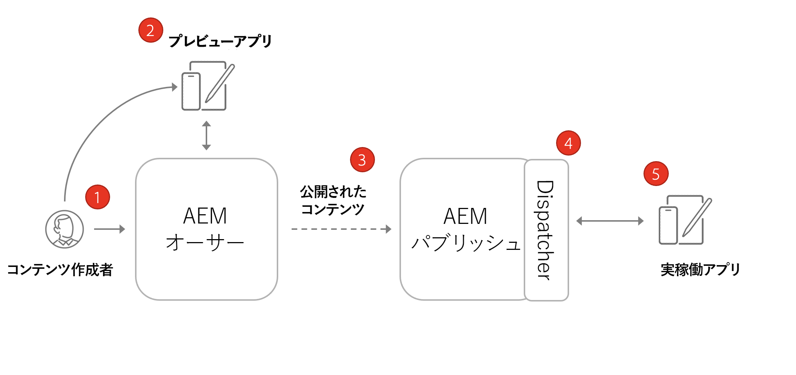
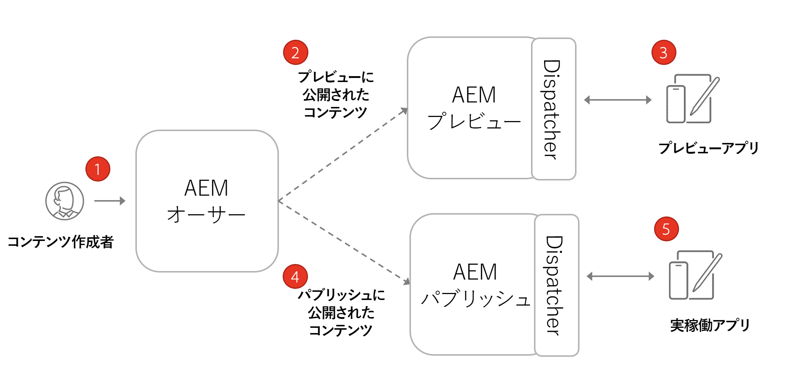

# AEMヘッドレスのアーキテクチャ

一般的なAEM環境は、オーサーサービス、パブリッシュサービス、オプションのプレビューサービスで構成されます。

* **オーサーサービス**&#x200B;では、内部ユーザーがコンテンツの作成、管理、プレビューを行います。

* **パブリッシュサービス**&#x200B;は「ライブ」環境と考えられ、通常はエンドユーザーがやり取りする相手になります。コンテンツは、オーサーサービスで編集および承認された後、パブリッシュサービスに配信されます。AEM ヘッドレスアプリケーションで最も一般的なデプロイメントパターンは、実稼動版のアプリケーションを AEM パブリッシュサービスに接続させることです。

* **Preview サービス** 機能的には **パブリッシュサービス**. ただし、内部ユーザーのみが利用できるようになっています。 これにより、承認者は、エンドユーザーに対してライブにされる前に今後のコンテンツ変更を確認するのに最適なシステムです。

* **ディスパッチャー**&#x200B;は、AEM Dispatcher モジュールで拡張された静的 Web サーバーです。キャッシュ機能とセキュリティの別の層を提供します。 この **Dispatcher** 前に座る **公開** および **プレビュー** サービス。

AEMas a Cloud Serviceプログラム内に、複数の環境、開発、ステージング、実稼動を持つことができます。 各環境には固有の **作成者**, **公開**、および **プレビュー** サービス。 管理の詳細については、 [ここの環境](/help/implementing/cloud-manager/manage-environments.md)

## オーサー公開モデル

AEM ヘッドレスアプリケーションで最も一般的なデプロイメントパターンは、実稼動版のアプリケーションを AEM パブリッシュサービスに接続させることです。

上の図は、この一般的なデプロイメントパターンを示しています。

1. A **コンテンツ作成者** は、AEM オーサーサービスを使用して、コンテンツを作成、編集および管理します。
1. この **コンテンツ作成者** また、他の内部ユーザーは、コンテンツをオーサーサービスで直接プレビューできます。 Author サービスに接続するアプリケーションのプレビューバージョンを設定できます。
1. 承認されたコンテンツは、AEM パブリッシュサービスに公開できます。
1. この **Dispatcher** は、 **公開** 特定のリクエストをキャッシュし、セキュリティの層を提供するサービス。
1. エンドユーザーは、アプリケーションの実稼動版を操作します。 実稼動アプリケーションは、Dispatcher を介してパブリッシュサービスに接続し、GraphQL API を使用してコンテンツを要求し、使用します。

## オーサープレビュー公開のデプロイメント

ヘッドレスデプロイメントのもう 1 つのオプションは、 **AEMプレビュー** サービス。 この方法では、コンテンツを最初に **プレビュー** サービスとヘッドレスアプリケーションのプレビューバージョンに接続できます。 このアプローチの利点は、 **プレビュー** サービスは、 **公開** サービスを使用することで、実稼動環境のシミュレーションが容易になります。

1. A **コンテンツ作成者** は、AEM オーサーサービスを使用して、コンテンツを作成、編集および管理します。
1. コンテンツは、まずAEM Preview サービスに公開されます。
1. Preview サービスに接続するアプリケーションのプレビューバージョンを設定できます。
1. コンテンツをレビューおよび承認したら、AEM パブリッシュサービスに公開できます。
1. エンドユーザーは、アプリケーションの実稼動版を操作します。 実稼動アプリケーションは、Dispatcher を介してパブリッシュサービスに接続し、GraphQL API を使用してコンテンツを要求し、使用します。

