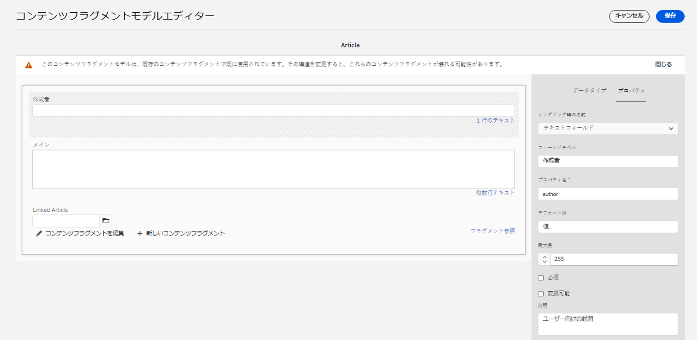

# コンテンツフラグメントと共に使用する AEM GraphQL API {#graphql-api-for-use-with-content-fragments}

Adobe Experience Manager（AEM）as a Cloud Service のコンテンツフラグメントを AEM GraphQL API と共に使用してヘッドレスコンテンツ配信を実現する方法を説明します。

コンテンツフラグメントと共に使用する AEM as a Cloud Service GraphQL API は、オープンソースの標準 GraphQL API に大きく依存しています。

AEM の GraphQL API を使用すると、ヘッドレス CMS 実装の JavaScript クライアントにコンテンツフラグメントを効率的に配信できます。

* REST で API リクエストの反復を回避
* 特定の要件に限定された配信を確保
* 1 つの API クエリへの応答としてレンダリングに必要なものだけを一括配信

>[!NOTE]
>
>GraphQL は現在、Adobe Experience Manager（AEM）as a Cloud Service の、2 つの（個別の）シナリオで使用されています。
>
>* [AEM Commerce が、GraphQL 経由でコマースプラットフォームのデータを使用する](/help/commerce-cloud/integrating/magento.md)。
>* AEM コンテンツフラグメントが、AEM GraphQL API（標準の GraphQL に基づくカスタム実装）と連携して、アプリケーションで使用するための構造化コンテンツを配信する。

## GraphQL API {#graphql-api}

GraphQL とは次のことを意味します。

* 「*...API のクエリ言語と、既存のデータを使用してこれらのクエリを満たすランタイムです。GraphQL は、API のデータの完全で理解可能な説明を提供し、必要なものを正確に要求する力をクライアントに与え、API の長期的な発展を促し、強力な開発ツールの実現を可能にします。*」

  [GraphQL.org](https://graphql.org) を参照

* 「*...柔軟な API レイヤー用のオープンな仕様。GraphQL を既存のバックエンドに重ね合わせて、以前に比べて迅速に製品を構築…。*」

  「[Explore GraphQL](https://www.graphql.com)」を参照

* *「...2012 年に Facebook 社内で開発されたデータクエリ言語および仕様です。その後、2015 年には公式にオープンソースとなりました。開発者の生産性を高め、転送データの量を最小限に抑えるために、REST ベースのアーキテクチャに代わる手段を提供します。GraphQL は、あらゆる規模の数百の組織により実稼働環境で使用されています...」*

  [GraphQL Foundation](https://foundation.graphql.org/) を参照してください。

<!--
"*Explore GraphQL is maintained by the Apollo team. Our goal is to give developers and technical leaders around the world all of the tools they need to understand and adopt GraphQL.*". 
-->

GraphQL API について詳しくは、次の節（その他の多くのリソース）を参照してください。

* [graphql.org](https://graphql.org)：

   * [GraphQL の概要](https://graphql.org/learn)

   * [GraphQL の仕様](https://spec.graphql.org/)

* [graphql.com](https://graphql.com)：

   * [ガイド](https://www.graphql.com/guides/)

   * [チュートリアル](https://www.graphql.com/tutorials/)

   * [導入事例](https://www.graphql.com/case-studies/)

AEM 用 GraphQL の実装は、標準の GraphQL Java ライブラリをベースにしています。以下を参照してください。

* [graphQL.org - Java](https://graphql.org/code/#java)

* [GitHub の GraphQL Java](https://github.com/graphql-java)

### GraphQL 用語 {#graphql-terminology}

GraphQL では次を使用します。

* **[クエリ](https://graphql.org/learn/queries/)**

* **[スキーマとタイプ](https://graphql.org/learn/schema/)**：

   * スキーマは、コンテンツフラグメントモデルに基づいて AEM で生成されます。
   * GraphQL では、スキーマを使用して、AEM 用 GraphQL の実装で使用可能なタイプと操作を提供します。

* **[フィールド](https://graphql.org/learn/queries/#fields)**

* **[GraphQL エンドポイント](graphql-endpoint.md)**
   * GraphQL クエリに応答し、GraphQL スキーマへのアクセスを提供する AEM 内のパス。

   * 詳しくは、[GraphQL エンドポイントの有効化](graphql-endpoint.md)を参照してください。

[ベストプラクティス](https://graphql.org/learn/best-practices/)を含む包括的な詳細については、「[(GraphQL.org) GraphQL の概要](https://graphql.org/learn/)」を参照してください。

### GraphQL クエリタイプ {#graphql-query-types}

GraphQL では、次のいずれかを返すクエリを実行できます。

* **1 つのエントリ**

* **[エントリのリスト](https://graphql.org/learn/schema/#lists-and-non-null)**

AEM は、クエリ（両方のタイプ）を Dispatcher と CDN によって[キャッシュできる永続クエリ](/help/headless/graphql-api/persisted-queries.md)に変換する機能を提供します。

### GraphQL クエリのベストプラクティス（Dispatcher と CDN） {#graphql-query-best-practices}

[永続クエリ](/help/headless/graphql-api/persisted-queries.md)は、パブリッシュインスタンスで次のように使用することをお勧めします。

* キャッシュされます
* AEM as a Cloud Service で一元管理されます

>[!NOTE]
>
>通常、作成者には Dispatcher/CDN がないので、永続クエリをテストする以外に使用してもメリットはありません。

POST リクエストを使用する GraphQL クエリは、キャッシュされないのでお勧めしません。そのため、デフォルトのインスタンスでは、Dispatcher はそれらのクエリをブロックするように設定されています。

GraphQL は GET リクエストもサポートしていますが、永続クエリを使用して回避できる制限（URL の長さなど）に達する可能性があります。

>[!NOTE]
>
>Dispatcher での直接クエリや POST クエリを許可するには、システム管理者に次の操作を依頼してください。
>
>* `ENABLE_GRAPHQL_ENDPOINT` という [Cloud Manager環境変数](/help/implementing/cloud-manager/environment-variables.md)の作成
>* （値：`true`）

>[!NOTE]
>
>直接クエリを実行する機能は、将来、廃止される可能性があります。

### GraphiQL IDE {#graphiql-ide}

また、[GraphiQL IDE](/help/headless/graphql-api/graphiql-ide.md) を使用して、GraphQL クエリのテストとデバッグを行うこともできます。

## オーサー、プレビュー、パブリッシュの使用例 {#use-cases-author-preview-publish}

使用例は、AEM as a Cloud Service 環境のタイプに応じて異なる場合があります。

* パブリッシュ環境の使用目的：
   * JS アプリケーションのデータのクエリ（標準の使用例）

* プレビュー環境使用先：
   * パブリッシュ環境にデプロイする前にクエリをプレビューします
      * JS アプリケーションのデータのクエリ（標準の使用例）

* オーサー環境の使用目的：
   * 「コンテンツ管理用」のデータのクエリ：
      * AEM as a Cloud Service の GraphQL は現在読み取り専用の API です。
      * REST API は、CR(U)D の操作に使用できます。

## 権限 {#permission}

Assets へのアクセスに必要な権限です。

GraphQL クエリは、基になるリクエストの AEM ユーザーの権限で実行します。一部のフラグメント（Assets として保存）への読み取りアクセス権を持っていない場合、ユーザーは結果セットの一部になりません。

また、ユーザーは GraphQL クエリを実行できるように、GraphQL エンドポイントにアクセスできる必要があります。

## スキーマ生成 {#schema-generation}

GraphQL は、厳密に型指定された API です。つまり、データは型別に明確に構造化され編成される必要があります。

GraphQL の仕様には、特定のインスタンス上のデータをクエリするための堅牢な API を作成する方法に関する一連のガイドラインが用意されています。そのタスクを行うには、クライアントは[スキーマ](#schema-generation)を取得する必要があります。この中には、クエリに必要なすべての型が定義されています。

コンテンツフラグメントの場合、GraphQL スキーマ（構造とタイプ）は、**有効**&#x200B;な[コンテンツフラグメントモデル](/help/sites-cloud/administering/content-fragments/content-fragments-models.md)とそれらのデータタイプに基づいています。

>[!CAUTION]
>
>（**有効**&#x200B;になっているコンテンツフラグメントモデルから派生した）すべての GraphQL スキーマは、GraphQL エンドポイントを通じて読み取り可能です。
>
>つまり、漏洩するおそれがあるので、機密データが使用可能になっていないことを確認する必要があります。例えば、これには、モデル定義のフィールド名として存在する可能性のある情報が含まれます。

例えば、ユーザーが `Article` というコンテンツフラグメントモデルを作成した場合、AEM は GraphQL タイプ `ArticleModel` を生成します。このタイプに含まれるフィールドは、モデルで定義されているフィールドとデータタイプに対応しています。さらに、`articleByPath` や `articleList` など、このタイプで動作するクエリのいくつかのエントリポイントを作成します。

1. コンテンツフラグメントモデル：

   

1. 対応する GraphQL スキーマ（GraphiQL 自動生成ドキュメントからの出力）:
   

   この図では、生成された型 `ArticleModel` に複数の[フィールド](#fields)が含まれていることがわかります。

   * そのうちの 3 つ（`author`、`main`、`referencearticle`）は、ユーザーが管理しています。

   * その他のフィールドは AEM によって自動的に追加され、特定のコンテンツフラグメントに関する情報を提供するための便利な方法を表しています。この例では、（[ヘルパーフィールド](#helper-fields)）`_path`、`_metadata`、`_variations` です。

1. ユーザーが Article モデルに基づいてコンテンツフラグメントを作成すると、GraphQL を使用してそれをクエリできます。例については、（[GraphQL で使用するコンテンツフラグメント構造のサンプル](/help/headless/graphql-api/sample-queries.md#content-fragment-structure-graphql)に基づいた）[サンプルクエリ](/help/headless/graphql-api/sample-queries.md#graphql-sample-queries)を参照してください。

AEM 用 GraphQL では、スキーマには柔軟性があります。つまり、コンテンツフラグメントモデルを作成、更新、削除するたびに、スキーマが自動生成されます。また、コンテンツフラグメントモデルを更新すると、データスキーマキャッシュも更新されます。

<!-- move the following to a separate "in depth" page -->

また、コンテンツフラグメントモデルを更新すると、データスキーマキャッシュも更新されます。

Sites GraphQL サービスは、コンテンツフラグメントモデルに対する変更を（バックグラウンドで）リッスンします。更新が検出されると、スキーマのその部分だけが再生成されます。この最適化により、時間が節約され、安定性も確保されます。

例えば、次のようになります。

1. `Content-Fragment-Model-1` と `Content-Fragment-Model-2` を含んだパッケージをインストールすると、

   1. GraphQLタイプ `Model-1` および `Model-2` が生成されます。

1. 次に `Content-Fragment-Model-2` を変更すると、

   1. `Model-2` GraphQL 型だけが更新されます。

   1. 一方、`Model-1` は同じままです。

>[!NOTE]
>
>REST API を使用してコンテンツフラグメントモデルの一括更新を行う場合などには、この点に留意することが大切です。

スキーマは、GraphQL クエリと同じエンドポイントを通じて提供され、クライアントはスキーマが拡張子 `GQLschema` で呼び出されることに対処します。例えば、`/content/cq:graphql/global/endpoint.GQLschema` で単純な `GET` リクエストを実行すると、`text/x-graphql-schema;charset=iso-8859-1` の Content-type を持つスキーマが出力されます。

<!-- move through to here to a separate "in depth" page -->

### スキーマの生成 - 未公開のモデル {#schema-generation-unpublished-models}

コンテンツフラグメントがネストされると、親のコンテンツフラグメントモデルは公開されますが、参照モデルは公開されません。

>[!NOTE]
>
>AEM UI はこのような問題を回避しますが、プログラムを使用して、またはコンテンツパッケージを使用して公開すると、この問題が発生する可能性があります。

この場合、AEM は親コンテンツフラグメントモデルの&#x200B;*不完全な*&#x200B;スキーマを生成します。つまり、非公開のモデルに依存するフラグメント参照がスキーマから削除されます。

## フィールド {#fields}

スキーマ内には、次の 2 つの基本的なカテゴリに属する個々のフィールドがあります。

* ユーザーが生成するフィールド

  選択された[フィールドタイプ](#Data-types)を使用して、コンテンツフラグメントモデルの設定方法に基づいてフィールドが作成されます。フィールド名は、「**データタイプ**」タブの「**プロパティ名**」フィールドから取得されます。

   * ユーザーが特定のデータタイプを設定できるので、**レンダリング形式**&#x200B;設定も考慮する必要があります。例えば、1 行のテキストフィールドに複数の 1 行のテキストを含めるように設定するには、ドロップダウンから「`multifield`」を選択します。

* AEM 用 GraphQL が生成する多数の[ヘルパーフィールド](#helper-fields)

### データタイプ {#data-types}

AEM 用 GraphQL では一連のタイプをサポートしています。サポートされているすべてのコンテンツフラグメントモデルデータ型と、それに対応する GraphQL 型を以下の表に示します。

| コンテンツフラグメントモデル - データ型 | GraphQL の型 | 説明 |
|--- |--- |--- |
| 1 行のテキスト | `String`、`[String]` | 作成者名、場所名などの単純な文字列に使用します. |
| 複数行テキスト | `String`、`[String]` | 記事の本文などのテキストを出力するために使用します |
| 数値 | `Float`、`[Float]` | 浮動小数点数と整数を表示するために使用します |
| ブール値 | `Boolean` | チェックボックスを表示するために使用します（単純な真／偽のステートメント） |
| 日時 | `Calendar` | 日時を ISO 8601 形式で表示するために使用します. 選択したタイプに応じて、AEM GraphQL で使用できるフレーバーは、`onlyDate`、`onlyTime`、`dateTime` の 3 つです。 |
| 定義済みリスト | `String` | モデルの作成時に定義されたオプションのリストに含まれるオプションを表示するために使用します |
| タグ | `[String]` | AEM で使用されているタグを表す文字列のリストを表示するために使用します |
| コンテンツ参照 | `String`、`[String]` | AEM 内の別のアセットへのパスを表示するために使用します |
| フラグメント参照 |  *モデルタイプ* <br><br>単一のフィールド： `Model`  — 直接参照されるモデルタイプ <br><br>複数フィールド（1 つの参照タイプ）: `[Model]`  — 型の配列 `Model`（配列から直接参照） <br><br>複数の参照型を持つマルチフィールド： `[AllFragmentModels]`  — 和集合型を持つ配列から参照される、すべてのモデル型の配列 |  特定のモデルタイプの 1 つ以上のコンテンツフラグメントを参照するために使用されます。モデルが作成されたときに定義されます。 |

{style="table-layout:auto"}

### ヘルパーフィールド {#helper-fields}

GraphQL for AEMでは、ユーザー生成フィールドのデータタイプに加えて、 *ヘルパー* コンテンツフラグメントの識別に役立つフィールド、またはコンテンツフラグメントに関する追加情報の提供に役立つフィールドです。

これらの[ヘルパーフィールド](#helper-fields)は、ユーザーが定義したものと自動生成されたものを区別するために、先頭に `_` が付きます。

#### パス  {#path}

パスフィールドは、AEM GraphQL で識別子として使用され、AEM リポジトリ内のコンテンツフラグメントアセットのパスを表します。これをコンテンツフラグメントの識別子として選択した理由は次のとおりです。

* AEM 内で一意である
* 取得しやすい

次のコードでは、WKND チュートリアルで提供されているように、コンテンツフラグメントモデル `Author` に基づいて作成されたすべてのコンテンツフラグメントのパスを表示します。

```graphql
{
  authorList {
    items {
      _path
    }
  }
}
```

特定のタイプのコンテンツフラグメントを 1 つ取得するには、まずそのパスも決定する必要があります。次に例を示します。

```graphql
{
  authorByPath(_path: "/content/dam/wknd-shared/en/contributors/sofia-sj-berg") {
    item {
      _path
      firstName
      lastName
    }
  }
}
```

[サンプルクエリ - ある 1 つの特定の都市フラグメント](/help/headless/graphql-api/sample-queries.md#sample-single-specific-city-fragment)を参照してください。

#### メタデータ {#metadata}

また、AEM では GraphQL を通じて、コンテンツフラグメントのメタデータも公開します。メタデータは、コンテンツフラグメントのタイトル、サムネールパス、コンテンツフラグメントの説明、作成日など、コンテンツフラグメントを説明する情報です。

メタデータはスキーマエディターで生成され、特定の構造を持たないので、コンテンツフラグメントのメタデータを公開するために GraphQL 型 `TypedMetaData` が実装されました。`TypedMetaData` では、次のスカラー型でグループ化された情報を公開します。

| フィールド |
|--- |
| `stringMetadata:[StringMetadata]!` |
| `stringArrayMetadata:[StringArrayMetadata]!` |
| `intMetadata:[IntMetadata]!` |
| `intArrayMetadata:[IntArrayMetadata]!` |
| `floatMetadata:[FloatMetadata]!` |
| `floatArrayMetadata:[FloatArrayMetadata]!` |
| `booleanMetadata:[BooleanMetadata]!` |
| `booleanArrayMetadata:[booleanArrayMetadata]!` |
| `calendarMetadata:[CalendarMetadata]!` |
| `calendarArrayMetadata:[CalendarArrayMetadata]!` |

各スカラー型は、名前と値の 1 つのペアを表すか、名前と値のペアの配列を表します。このペアの値は、グループ化されたときの型になります。

例えば、コンテンツフラグメントのタイトルを取得する場合は、このプロパティが String 型プロパティであることがわかっているので、すべての String 型メタデータをクエリすることになります。

メタデータをクエリするには、次のようにします。

```graphql
{
  authorByPath(_path: "/content/dam/wknd-shared/en/contributors/sofia-sj-berg") {
    item {
      _metadata {
        stringMetadata {
          name
          value
        }
      }
    }
  }
}
```

生成された GraphQL スキーマを表示するには、すべてのメタデータ GraphQL 型を表示します。すべてのモデルタイプは同じ `TypedMetaData` を持ちます。

>[!NOTE]
>
>**標準メタデータと配列メタデータの違い**：
>`StringMetadata` と `StringArrayMetadata` はどちらも、リポジトリに格納されているものについての指定であり、その取得手段についての指定ではありません。
>
>例えば、`stringMetadata` フィールドを呼び出すと、リポジトリに `String` として格納されているすべてのメタデータの配列を受け取ることになります。一方、`stringArrayMetadata` を呼び出すと、リポジトリに `String[]` として格納されているすべてのメタデータの配列を受け取ります。

詳しくは、[メタデータのサンプルクエリ - 「GB」という賞のメタデータのリスト](/help/headless/graphql-api/sample-queries.md#sample-metadata-awards-gb)を参照してください。

#### バリエーション {#variations}

コンテンツフラグメントのバリエーションに対するクエリを簡略化するために、`_variations` フィールドが実装されています。例：

```graphql
{
  authorByPath(_path: "/content/dam/wknd-shared/en/contributors/ian-provo") {
    item {
      _variations
    }
  }
}
```

>[!NOTE]
>
>技術的には元のデータ（UI で&#x200B;*マスター*&#x200B;として参照される）は明示的なバリエーションとは見なされないので、「`_variations`」フィールドには `master` バリエーションが含まれません。

詳しくは、[サンプルクエリ - 名前付きバリエーションを持つすべての都市](/help/headless/graphql-api/sample-queries.md#sample-cities-named-variation)を参照してください。

>[!NOTE]
>
>コンテンツフラグメントに対して指定されたバリエーションが存在しない場合は、元のデータ（マスターバリエーションとも呼ばれます）が（フォールバック）デフォルトとして返されます。

<!--
## Security Considerations {#security-considerations}
-->

## GraphQL 変数 {#graphql-variables}

GraphQL では、クエリに変数を含めることができます。詳しくは、 [変数に関するGraphQLのドキュメント](https://graphql.org/learn/queries/#variables).

例えば、特定のバリエーション（利用可能な場合）でタイプ `Author` のコンテンツフラグメントをすべて取得するには、GraphiQL で引数 `variation` を指定できます。


**クエリ**：

```graphql
query($variation: String!) {
  authorList(variation: $variation) {
    items {
      _variation
      lastName
      firstName
    }
  }
}
```

**クエリ変数**：

```json
{
  "variation": "another"
}
```

このクエリは、作成者の完全なリストを返します。`another` バリエーションのない作成者は、元のデータに戻ります（この場合、`_variation` は `master` をレポートします）。

適用： [フィルター](#filtering)指定したバリエーションを提供する作成者にリストを制限する場合（および元のデータにフォールバックする作成者をスキップする場合）:

```graphql
query($variation: String!) {
  authorList(variation: $variation, filter: {
    _variation: {
      _expressions: {
        value: $variation
      }
    }
  }) {
    items {
      _variation
      lastName
      firstName
    }
  }
}
```

## GraphQL ディレクティブ {#graphql-directives}

GraphQL では、GraphQL ディレクティブと呼ばれる変数に基づいてクエリを変更する可能性があります。

例えば、 `adventurePrice` すべての `AdventureModels`（変数に基づく） `includePrice`.


**クエリ**：

```graphql
query GetAdventureByType($includePrice: Boolean!) {
  adventureList {
    items {
      title
      price @include(if: $includePrice)
    }
  }
}
```

**クエリ変数**：

```json
{
    "includePrice": true
}
```

## フィルタリング {#filtering}

GraphQL クエリでフィルタリングを使用して、特定のデータを返すこともできます。

フィルタリングでは、論理演算子と論理式に基づいた構文を使用します。

最もアトミックな部分は、特定のフィールドの内容に適用できる単一の式です。フィールドの内容を指定された定数値と比較します。

例えば、次の式

```graphql
{
  value: "some text"
  _op: EQUALS
}
```

は、フィールドの内容を値 `some text` と比較し、内容が値と等しい場合に成功します。そうしないと、式は失敗します。

次の演算子を使用して、フィールドを特定の値と比較できます。

| 演算子 | タイプ | 次の場合、式は成功します |
|--- |--- |--- |
| `EQUALS` | `String`、`ID`、`Boolean` | ... 値がフィールドの内容とまったく同じである |
| `EQUALS_NOT` | `String`、`ID` | ... 値がフィールドの内容と同じ&#x200B;*ではない* |
| `CONTAINS` | `String` | ... フィールドの内容に値が含まれる（`{ value: "mas", _op: CONTAINS }` は `Christmas`、`Xmas`、`master` などと一致） |
| `CONTAINS_NOT` | `String` | ... フィールドの内容に値が含まれてい&#x200B;*ない* |
| `STARTS_WITH` | `ID` | ... ID が特定の値で始まる（`{ value: "/content/dam/", _op: STARTS_WITH` は `/content/dam/path/to/fragment` と一致するが、`/namespace/content/dam/something` とは一致しない） |
| `EQUAL` | `Int`、`Float` | ... 値がフィールドの内容とまったく同じである |
| `UNEQUAL` | `Int`、`Float` | ... 値がフィールドの内容と同じで&#x200B;*はない* |
| `GREATER` | `Int`、`Float` | ... フィールドの内容が値より大きい |
| `GREATER_EQUAL` | `Int`、`Float` | ... フィールドの内容が値以上である |
| `LOWER` | `Int`、`Float` | ... フィールドの内容が値よりも小さい |
| `LOWER_EQUAL` | `Int`、`Float` | ... フィールドの内容が値以下である |
| `AT` | `Calendar`、`Date`、`Time` | ... フィールドの内容が値とまったく同じである（タイムゾーン設定を含む） |
| `NOT_AT` | `Calendar`、`Date`、`Time` | ... フィールドの内容が値と同じで&#x200B;*はない* |
| `BEFORE` | `Calendar`、`Date`、`Time` | ... 値によって示される時点が、フィールドの内容によって示される時点よりも前である |
| `AT_OR_BEFORE` | `Calendar`、`Date`、`Time` | ... 値によって示される時点が、フィールドの内容によって示される時点より前または同じ時点である |
| `AFTER` | `Calendar`、`Date`、`Time` | ... 値によって示される時点が、フィールドの内容によって示される時点よりも後である |
| `AT_OR_AFTER` | `Calendar`、`Date`、`Time` | ... 値によって示される時点が、フィールドの内容によって示される時点より後または同じ時点である |

また、式の評価方法を変更する追加のオプションを指定できるタイプもあります。

| オプション | タイプ | 説明 |
|--- |--- |--- |
| `_ignoreCase` | `String` | 文字列の大文字と小文字は無視されます（例：`time` の値は `TIME`、`time`、`tImE` と一致） |
| `_sensitiveness` | `Float` | `float` 値が同じと見なされるための一定のマージンを許可します（`float` 値の内部表現による技術的な制限を回避するため）。このオプションはパフォーマンスに悪影響を及ぼす可能性があるので、避ける必要があります。 |

式は、論理演算子（`_logOp`）を使用して設定に組み合わせることができます。

* `OR` - 少なくとも 1 つの式が成功した場合、式のセットは成功します
* `AND` - すべての式が成功した場合、式のセットは成功します（デフォルト）

各フィールドは、独自の式セットでフィルタリングできます。 フィルター引数で指定されたすべてのフィールドの式セットは、最終的に独自の論理演算子で結合されます。

フィルター定義（`filter` 引数としてクエリに渡される）には次が含まれます。

* 各フィールドのサブ定義（フィールド名を使用してアクセスできます。例えば、データ（フィールド）タイプの `lastName` フィールドのフィルターには `lastName` フィールドがあります）
* 各サブ定義には、式セットを提供する `_expressions` 配列と、式を組み合わせる必要がある論理演算子を定義する `_logOp` フィールドが含まれます
* 各式は、値（`value` フィールド）と演算子（`_operator` フィールド）によって定義され、フィールドの内容を比較する必要があります

項目を `AND` で組み合わせたい場合は `_logOp` を省略できます。また、等価性を確認したい場合は、これらがデフォルト値になるので、`_operator` を省略できます。

次の例は、大文字と小文字を区別せずに、`Provo` が `lastName` である、または `sjö` を含むすべてのユーザーをフィルタリングする完全なクエリを示しています。

```graphql
{
  authorList(filter: {
    lastname: {
      _logOp: OR
      _expressions: [
        {
          value: "sjö",
          _operator: CONTAINS,
          _ignoreCase: true
        },
        {
          value: "Provo"
        }
      ]
    }
  }) {
    items {
      lastName
      firstName
    }
  }
}
```

ネストされたフィールドに対してフィルターを適用することもできますが、パフォーマンスの問題が発生する可能性があるため、お勧めしません。

その他の例については、以下を参照してください。

* [AEM 用 GraphQL の拡張機能](#graphql-extensions)の詳細

* [このサンプルコンテンツおよび構造を使用したサンプルクエリ](/help/headless/graphql-api/sample-queries.md#graphql-sample-queries-sample-content-fragment-structure)

   * さらに、サンプルクエリ用に準備されている[サンプルコンテンツおよび構造](/help/headless/graphql-api/sample-queries.md#content-fragment-structure-graphql)

* [WKND プロジェクトに基づいたサンプルクエリ](/help/headless/graphql-api/sample-queries.md#sample-queries-using-wknd-project)

## 並べ替え {#sorting}

>[!NOTE]
>
>最高のパフォーマンスを得るには、[GraphQL フィルタリングでページングと並べ替えのためにコンテンツフラグメントを更新すること](/help/headless/graphql-api/graphql-optimized-filtering-content-update.md)を検討してください。

この機能を使用すると、指定したフィールドに従ってクエリ結果を並べ替えることができます。

並び替え条件：

* フィールドパスを表すコンマ区切りの値のリストにする
   * リストの最初のフィールドでは主な並べ替え順が定義され、2 番目のフィールドでは主な並べ替え条件の 2 つの値が等しい場合に使用され、3 番目のフィールドでは最初の 2 つの条件が等しい場合などに使用されます。
   * ドット表記、つまり field1.subfield.subfield など
* （オプション）並べ替えの方向
   * ASC（昇順）または DESC（降順）。デフォルトでは ASC が適用されます
   * 並べ替えの方向は、フィールドごとに指定できます。つまり、あるフィールドを昇順で、別のフィールドを降順（name、firstName DESC）で並べ替えることができます

次に例を示します。

```graphql
query {
  authorList(sort: "lastName, firstName") {
    items {
      firstName
      lastName
    }
  }
}
```

次のようにすることもできます。

```graphql
{
  authorList(sort: "lastName DESC, firstName DESC") {
    items {
        lastName
        firstName
    }
  }
}
```

また、`nestedFragmentname.fieldname` の形式を使用して、ネストされたフラグメント内のフィールドで並べ替えることもできます。

>[!NOTE]
>
>これは、パフォーマンスに悪影響を及ぼす可能性があります。

次に例を示します。

```graphql
query {
  articleList(sort: "authorFragment.lastName")  {
    items {
      title
      authorFragment {
        firstName
        lastName
        birthDay
      }
      slug
    }
  }
}
```

## ページング {#paging}

>[!NOTE]
>
>最高のパフォーマンスを得るには、[GraphQL フィルタリングでページングと並べ替えのためにコンテンツフラグメントを更新すること](/help/headless/graphql-api/graphql-optimized-filtering-content-update.md)を検討してください。

この機能を使用すると、リストを返すクエリタイプに対してページングを実行できます。 次の 2 つの方法があります。

* `List` クエリの `offset` と `limit`
* `Paginated` クエリの `first` と `after`

### リストクエリ - オフセットと制限 {#list-offset-limit}

`...List` クエリでは、`offset` と `limit` を使用して、特定の結果サブセットを返すことができます。

* `offset`：返される最初のデータセットを指定します
* `limit`：返されるデータセットの最大数を指定します

例えば、*完全な*&#x200B;結果リストの 5 番目の記事から開始して、最大 5 つの記事を含む結果のページを出力するには、次のようにします。

```graphql
query {
   articleList(offset: 5, limit: 5) {
    items {
      authorFragment {
        lastName
        firstName
      }
    }
  }
}
```

<!-- When available link to BP and replace "JCR query level" with a more neutral term. -->

<!-- When available link to BP and replace "JCR query result set" with a more neutral term. -->

>[!NOTE]
>
>* ページングには安定した並べ替え順序が必要です。同じ結果セットの異なるページをリクエストする複数のクエリで正しく動作するようにします。デフォルトでは、結果セットの各アイテムのリポジトリパスを使用して、順序が常に同じであることを確認します。 異なる並べ替え順を使用し、その並べ替えを JCR クエリレベルで実行できない場合は、ページを判断する前に結果セット全体をメモリに読み込む必要があるので、パフォーマンスに悪影響があります。
>
>* オフセットが大きいほど、JCR クエリの結果セット全体から項目をスキップするのに時間がかかります。 大規模な結果セットに対する代替ソリューションは、`first` および `after` メソッドでページ分割されたクエリを使用することです。

### ページ分割されたクエリ - first と after {#paginated-first-after}

`...Paginated` クエリタイプは、ほとんどの `...List` クエリタイプの機能（フィルタリング、並べ替え）を再利用しますが、`offset`／`limit` 引数の代わりに、[GraphQL カーソル接続仕様](https://relay.dev/graphql/connections.htm)で定義されている `first`／`after` 引数を使用します。[GraphQL の概要](https://graphql.org/learn/pagination/#pagination-and-edges)では、堅苦しくない概要を見つけることができます。

* `first`：返される最初の `n` 個の項目。
デフォルトは、`50` です。
最大値は `100` です。
* `after`：リクエストされたページの先頭を決定するカーソル。カーソルで表される項目は結果セットに含まれないことに注意してください。項目のカーソルは、`edges` 構造体の `cursor` フィールドによって決定されます。

例えば、*完全な*&#x200B;結果リスト内の指定されたカーソル項目から開始して、最大 5 つの冒険を含む結果のページを出力します。

```graphql
query {
    adventurePaginated(first: 5, after: "ODg1MmMyMmEtZTAzMy00MTNjLThiMzMtZGQyMzY5ZTNjN2M1") {
        edges {
          cursor
          node {
            title
          }
        }
        pageInfo {
          endCursor
          hasNextPage
        }
    }
}
```

<!-- When available link to BP -->
<!-- Due to internal technical constraints, performance will degrade if sorting and filtering is applied on nested fields. Therefore it is recommended to use filter/sort fields stored at root level. For more information, see the [Best Practices document](link). -->

>[!NOTE]
>
>* デフォルトでは、ページングでは、結果の順序が常に同じになるように、フラグメントを表すリポジトリノードの UUID を使用して順序を指定します。 `sort` を使用すると、UUID は一意の並べ替えを保証するために暗黙的に使用されます。同じ並べ替えキーを持つ 2 つの項目の場合も同様です。
>
>* 内部の技術的な制約により、ネストされたフィールドに並べ替えとフィルタリングを適用すると、パフォーマンスが低下します。したがって、ルートレベルで保存されたフィールドのフィルター／並べ替えを使用することをお勧めします。 これは、ページ分割された大きな結果セットをクエリする場合にも推奨される方法です。

## GraphQL クエリでの Web に最適化された画像配信 {#web-optimized-image-delivery-in-graphql-queries}

Web に最適化された画像配信を使用すると、Graphql クエリを使用して次のことができます。

* AEM Asset 画像に URL をリクエストする

* 画像の特定のレンディションが自動的に生成されて返されるように、クエリでパラメーターを渡す

  >[!NOTE]
  >
  >指定されたレンディションは AEM Assets に保存されません。レンディションは生成され、短期間キャッシュに保持されます。

* JSON 配信の一部として URL を返す

AEM を使用して、次のことができます。

* [Web に最適化された画像配信](https://experienceleague.adobe.com/docs/experience-manager-core-components/using/developing/web-optimized-image-delivery.html?lang=ja)を GraphQL クエリに渡す。

つまり、クエリの実行中に、これらの画像に対する GET リクエストの URL パラメーターと同じ方法でコマンドが適用されます。

これにより、JSON 配信の画像レンディションを動的に作成できるので、これらのレンディションを手動で作成してリポジトリに保存する必要がなくなります。

GraphQL のソリューションでは、次のことが可能です。

* `ImageRef` 参照で `_dynamicUrl` を使用する

* フィルターが定義されているリストヘッダーに `_assetTransform` を追加する

### 変換リクエストの構造 {#structure-transformation-request}

`AssetTransform`（`_assetTransform`）は、URL 変換リクエストの作成に使用されます。

構造と構文は次のとおりです。

* `format`：拡張子でサポートされるすべての形式を持つ列挙（GIF、PNG、PNG8、JPG、PJPG、BJPG、WEBP、WEBPLL、WEBPLY）
* `seoName`:ノード名の代わりにファイル名として使用される文字列
* `crop`：フレームサブ構造。幅または高さが省略された場合、高さまたは幅が同じ値として使用されます
   * `xOrigin`：フレームの x 原点（必須）
   * `yOrigin`：フレームの y 原点（必須）
   * `width`：フレームの幅
   * `height`：フレームの高さ
* `size`：寸法サブ構造。幅または高さが省略された場合、高さまたは幅が同じ値として使用されます
   * `width`：寸法の幅
   * `height`：寸法の高さ
* `rotation`：サポートされているすべての回転の列挙（R90、R180、R270）
* `flip`：HORIZONTAL、VERTICAL、HORIZONTAL_AND_VERTICAL の列挙
* `quality`:画質の割合を示す 1 ～ 100 の整数
* `width`:出力画像の幅を定義する整数ですが、Image Generator では無視されます
* `preferWebp`：webp が優先されるかどうかを示すブール値（デフォルト値は false）

URL 変換は、パス別、リスト別またはページ分割別のすべてのクエリタイプで使用できます。

### すべてのパラメーターを使用した web に最適化された画像配信 {#web-optimized-image-delivery-full-parameters}

すべてのパラメーターを使用したクエリ例を次に示します。

```graphql
{
  articleList(
    _assetTransform: {
      format:GIF
      seoName:"test"
      crop:{
        xOrigin:10
        yOrigin:20
        width:50
        height:45
      }
      size:{
        height:100
        width:200
      }
      rotation:R90
      flip:HORIZONTAL_AND_VERTICAL
      quality:55
      width:123
      preferWebp:true
    }
  ) {
    items {
      _path
      featuredImage {
        ... on ImageRef {
          _dynamicUrl
        }
      }
    }
  }
}
```

### 単一のクエリ変数を使用した web に最適化された画像配信 {#web-optimized-image-delivery-single-query-variable}

単一のクエリ変数を使用した例を次に示します。

```graphql
query ($seoName: String!) {
  articleList(
    _assetTransform: {
      format:GIF
      seoName:$seoName
      crop:{
        xOrigin:10
        yOrigin:20
        width:50
        height:45
      }
      size:{
        height:100
        width:200
      }
      rotation:R90
      flip:HORIZONTAL_AND_VERTICAL
      quality:55
      width:123
      preferWebp:true
    }
  ) {
    items {
      _path
      featuredImage {
        ... on ImageRef {
          _dynamicUrl
        }
      }
    }
  }
}
```

### 複数のクエリ変数を使用した web に最適化された画像配信 {#web-optimized-image-delivery-multiple-query-variables}

複数のクエリ変数を使用した例を次に示します。

```graphql
query ($seoName: String!, $format: AssetTransformFormat!) {
  articleList(
    _assetTransform: {
      format:$format
      seoName:$seoName
      crop:{
        xOrigin:10
        yOrigin:20
        width:50
        height:45
      }
      size:{
        height:100
        width:200
      }
      rotation:R90
      flip:HORIZONTAL_AND_VERTICAL
      quality:55
      width:123
      preferWebp:true
    }
  ) {
    items {
      _path
      featuredImage {
        ... on ImageRef {
          _dynamicUrl
        }
      }
    }
  }
}
```

### URL による web に最適化された画像配信リクエスト {#web-optimized-image-delivery-request-url}

クエリを永続化クエリとして保存した場合（例えば `dynamic-url-x` という名前を使用）、[永続化クエリを直接](/help/headless/graphql-api/persisted-queries.md#execute-persisted-query)実行できます。

例えば、以前のサンプル（永続化されたクエリとして保存）を直接実行するには、次の URL を使用します。

* [単一のパラメーター](#dynamic-image-delivery-single-specified-parameter)、`dynamic-url-x` という名前の永続クエリ

   * `http://localhost:4502/graphql/execute.json/wknd-shared/dynamic-url-x;seoName=xxx`

     応答は次のようになります。

     

* [複数のパラメーター](#dynamic-image-delivery-multiple-specified-parameters)、`dynamic` という名前の永続クエリ

   * `http://localhost:4502/graphql/execute.json/wknd-shared/dynamic;seoName=billiboy;format=GIF;`

     >[!CAUTION]
     >
     >末尾の `;` は、パラメーターのリストを明確に終了するために必須です。

### 画像配信の制限 {#image-delivery-limitations}

次の制限があります。

* クエリのすべての画像部分に適用される修飾子（グローバルパラメーター）

* ヘッダーのキャッシュ

   * オーサーにキャッシュされない
   * パブリッシュのキャッシュ - 10 分の最大経過時間（クライアントは変更できません）

## AEM 用の GraphQL - 拡張機能の概要 {#graphql-extensions}

AEM 用の GraphQL でのクエリの基本操作は、標準の GraphQL 仕様に従います。AEM での GraphQL クエリには、次のような拡張機能があります。

* 結果が 1 つだけ必要な場合：
   * モデル名（例：city）を使用します

* 結果のリストを想定している場合：
   * モデル名に `List` を付け加えます（例：`cityList`）
   * [サンプルクエリ - すべての都市に関するすべての情報](/help/headless/graphql-api/sample-queries.md#sample-all-information-all-cities)を参照してください

  これにより、以下のことが可能になります。

   * [結果の並べ替え](#sorting)

      * `ASC` : 昇順
      * `DESC` : 降順

   * 次のいずれかを使用して、結果のページを返します。

      * [オフセットと制限を指定したリストクエリ](#list-offset-limit)
      * [最初とその後を指定したページ分割クエリ](#paginated-first-after)

   * [サンプルクエリ - すべての都市に関するすべての情報](/help/headless/graphql-api/sample-queries.md#sample-all-information-all-cities)を参照してください

* フィルター `includeVariations` が `List` および `Paginated` クエリのタイプ。  クエリ結果でコンテンツフラグメントのバリエーションを取得するには、`includeVariations` フィルターは `true` に設定する必要があります。

   * 詳しくは、 [特定のモデルの複数のコンテンツフラグメントとそのバリエーションのサンプルクエリ](/help/headless/graphql-api/sample-queries.md#sample-wknd-multiple-fragment-variations-given-model)

  >[!CAUTION]
  >フィルター `includeVariations` システム生成フィールド `_variation` は、同じクエリ定義で一緒に使用することはできません。

* 論理和（OR）を使用する場合：
   * ` _logOp: OR` を使用します
   * [サンプルクエリ - 「Jobs」または「Smith」という名前を持つすべての人物](/help/headless/graphql-api/sample-queries.md#sample-all-persons-jobs-smith)を参照してください

* 論理積（AND）も存在しますが、（多くの場合）暗黙的です

* コンテンツフラグメントモデル内のフィールドに対応するフィールド名に対してクエリを実行できます
   * [サンプルクエリ - ある会社の CEO と従業員の詳細](/help/headless/graphql-api/sample-queries.md#sample-full-details-company-ceos-employees)を参照してください

* モデルのフィールドに加えて、次のようなシステム生成フィールドがあります（フィールド名の先頭にアンダースコアが付きます）。

   * コンテンツの場合：

      * `_locale`：言語を表示します（言語マネージャーに基づく）
         * [特定ロケールの複数のコンテンツフラグメントのサンプルクエリ](/help/headless/graphql-api/sample-queries.md#sample-wknd-multiple-fragments-given-locale)を参照してください

      * `_metadata`：フラグメントのメタデータを表示します
         * [メタデータのサンプルクエリ - 「GB」という賞のメタデータのリスト](/help/headless/graphql-api/sample-queries.md#sample-metadata-awards-gb)を参照してください

      * `_model`：コンテンツフラグメントモデル（パスとタイトル）のクエリを許可します
         * [モデルからのコンテンツフラグメントモデルのサンプルクエリ](/help/headless/graphql-api/sample-queries.md#sample-wknd-content-fragment-model-from-model)を参照してください

      * `_path`：リポジトリ内のコンテンツフラグメントへのパス
         * [サンプルクエリ - 1 つの特定の都市フラグメント](/help/headless/graphql-api/sample-queries.md#sample-single-specific-city-fragment)を参照してください

      * `_reference`：参照（リッチテキストエディターでのインライン参照など）を表示します
         * [プリフェッチされた参照を含んだ複数のコンテンツフラグメントのサンプルクエリ](/help/headless/graphql-api/sample-queries.md#sample-wknd-multiple-fragments-prefetched-references)を参照してください

      * `_variation`：コンテンツフラグメント内の特定のバリエーションを表示します

        >[!NOTE]
        >
        >指定されたバリエーションがコンテンツフラグメントに対して存在しない場合は、マスターバリエーションが（フォールバック）デフォルトとして返されます。

        >[!CAUTION]
        >
        >システム生成フィールド `_variation` は、フィルター `includeVariations` と併用できません。

         * [サンプルクエリ - 名前付きバリエーションを持つすべての都市](/help/headless/graphql-api/sample-queries.md#sample-cities-named-variation)を参照してください

   * [画像配信](#image-delivery)の場合：

      * `_dynamicUrl`：`ImageRef` 参照で

      * `_assetTransform`：フィルターを定義するリストヘッダーで

      * 以下を参照してください。

         * [すべてのパラメーターを使用した画像配信用サンプルクエリ](#image-delivery-full-parameters)

         * [単一の指定パラメーターを使用した画像配信用サンプルクエリ](#image-delivery-single-specified-parameter)

   * `_tags`：タグを含むコンテンツフラグメントまたはバリエーションの ID を表示する `cq:tags` 識別子の配列です。

      * [サンプルクエリ - 市区町村の区切り文字としてタグ付けされた、すべての都市の名前](/help/headless/graphql-api/sample-queries.md#sample-names-all-cities-tagged-city-breaks)を参照してください。
      * 詳しくは、[特定のタグが添付された、任意のモデルのコンテンツフラグメントバリエーションのサンプルクエリ](/help/headless/graphql-api/sample-queries.md#sample-wknd-fragment-variations-given-model-specific-tag)を参照してください。
      * 詳しくは、 [_tags ID でフィルタリングし、バリエーションを除外したクエリ例](/help/headless/graphql-api/sample-queries.md#sample-filtering-tag-not-variations)
      * 詳しくは、 [_tags ID でフィルタリングし、バリエーションを含むクエリ例](/help/headless/graphql-api/sample-queries.md#sample-filtering-tag-with-variations)

     >[!NOTE]
     >
     >また、コンテンツフラグメントのメタデータを一覧表示して、タグをクエリできます。

   * 操作の場合：

      * `_operator`：特定の演算子（`EQUALS`、`EQUALS_NOT`、`GREATER_EQUAL`、`LOWER`、`CONTAINS`、`STARTS_WITH`）を適用します
         * [サンプルクエリ - 「Jobs」という名前を持たないすべての人物](/help/headless/graphql-api/sample-queries.md#sample-all-persons-not-jobs)を参照してください
         * [サンプルクエリ - `_path` が特定のプレフィックスで始まるすべてのアドベンチャーを参照してください](/help/headless/graphql-api/sample-queries.md#sample-wknd-all-adventures-cycling-path-filter)

      * `_apply`：特定の条件（例：`AT_LEAST_ONCE`）を適用します
         * [サンプルクエリ - 少なくとも 1 回は現れる項目を含んだ配列をフィルタリング](/help/headless/graphql-api/sample-queries.md#sample-array-item-occur-at-least-once)を参照してください

      * `_ignoreCase`：クエリの実行時に大文字と小文字を区別しません
         * [サンプルクエリ - 名前に SAN が含まれるすべての都市（大文字と小文字を区別しない場合）](/help/headless/graphql-api/sample-queries.md#sample-all-cities-san-ignore-case)を参照してください

* GraphQL のユニオン型がサポートされています

   * `... on` を使用します
      * [特定モデルのコンテンツフラグメントのうちコンテンツ参照を含んだものを取得するサンプルクエリ](/help/headless/graphql-api/sample-queries.md#sample-wknd-fragment-specific-model-content-reference)を参照してください

* ネストされたフラグメントに対するクエリ時のフォールバック：

   * 任意のバリエーションがネストされたフラグメントに存在しない場合、**マスター**&#x200B;バリエーションが返されます。

## 外部 web サイトからの GraphQL エンドポイントのクエリ {#query-graphql-endpoint-from-external-website}

外部 web サイトから GraphQL エンドポイントにアクセスするには、次の項目を設定する必要があります。

* [CORS フィルター](/help/headless/deployment/cross-origin-resource-sharing.md)
* [リファラーフィルター](/help/headless/deployment/referrer-filter.md)

## 認証 {#authentication}

[コンテンツフラグメントに対するリモート AEM GraphQL クエリの認証](/help/headless/security/authentication.md)を参照してください。

## FAQ {#faqs}

次のような質問が寄せられました。

1. **Q**：「*AEM 用 GraphQL API と Query Builder API の違いは何ですか？*」

   * **A**：「AEM GraphQL API *は JSON 出力の完全な制御が可能であり、コンテンツをクエリするための業界標準になっています。今後、AEM GraphQL API への投資が計画されています。*」

## チュートリアル - AEM ヘッドレスと GraphQL をはじめる前に {#tutorial}

実践的なチュートリアルを探している場合は、チェックアウト [AEMヘッドレスおよびGraphQLの概要](https://experienceleague.adobe.com/docs/experience-manager-learn/getting-started-with-aem-headless/graphql/overview.html?lang=ja) AEM GraphQL API を使用し、外部アプリで使用したコンテンツをヘッドレス CMS シナリオで構築および公開する方法を示すエンドツーエンドのチュートリアルです。
