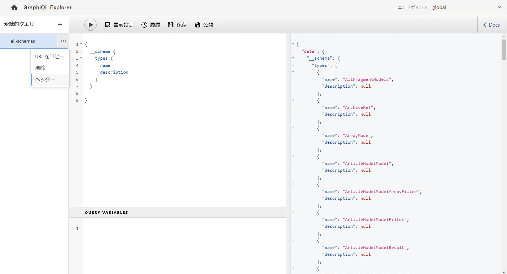
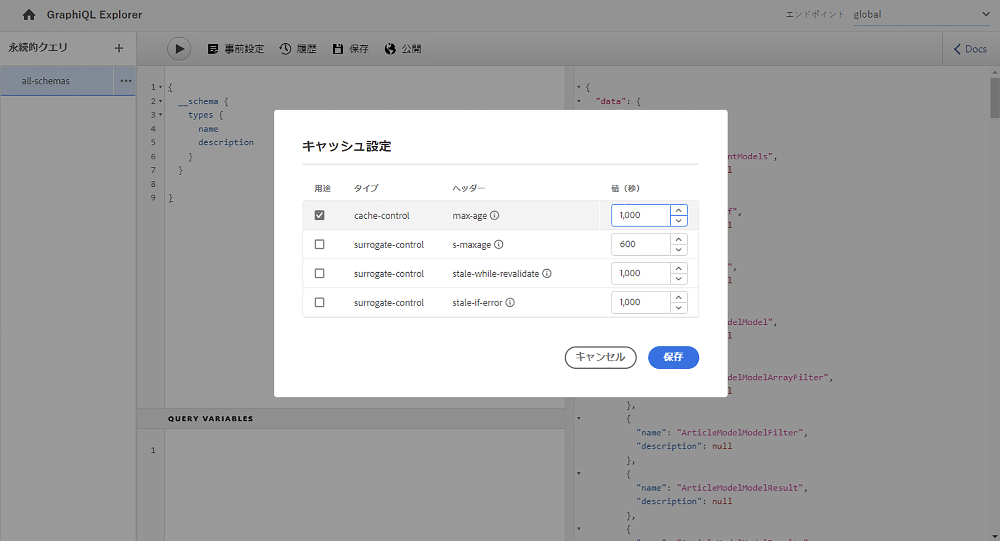
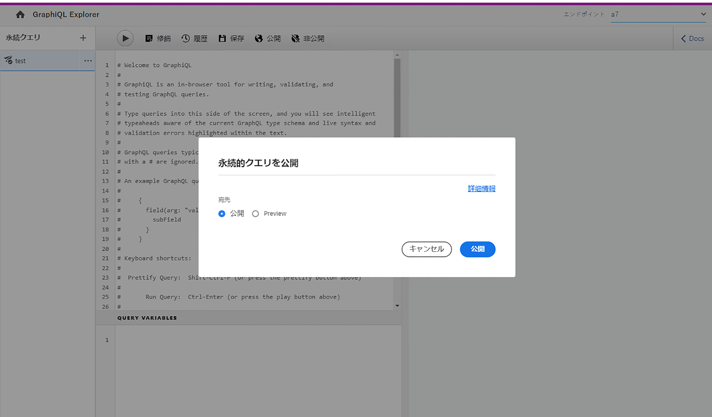
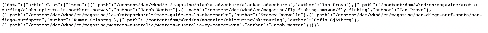
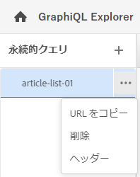

# GraphiQL IDE の使用 {#graphiql-ide}

標準の [GraphQL](https://graphql.org/learn/serving-over-http/#graphiql) IDE の実装は、Adobe Experience Manager（AEM）as a Cloud Service の GraphQL API で使用できます。

>[!NOTE]
>
>GraphiQL は AEM のすべての環境に含まれています（ただし、エンドポイントを設定した場合にのみアクセス可能／表示可能になります）。
>
>以前のリリースでは、GraphiQL IDE をインストールするためにパッケージが必要でした。これをインストール済みの場合は、削除できます。

>[!NOTE]
>GraphiQL IDE を使用する前に、[設定ブラウザー](/help/sites-cloud/administering/content-fragments/setup.md#enable-content-fragment-functionality-configuration-browser)で[エンドポイントを設定](/help/headless/graphql-api/graphql-endpoint.md)しておく必要があります。

**GraphiQL** ツールを使用すると次のことが可能になるので、GraphQL クエリをテストおよびデバッグできます。

* クエリに使用する Sites 設定に適した&#x200B;**エンドポイント**&#x200B;を選択する
* 新しいクエリを直接入力する
* **[永続クエリ](/help/headless/graphql-api/persisted-queries.md)**&#x200B;を作成してアクセスする
* クエリを実行して結果をすぐに確認する
* **クエリ変数**&#x200B;を管理する
* **永続クエリ**&#x200B;を保存して管理する
* **永続クエリ**&#x200B;を&#x200B;**公開**&#x200B;サービスまたは&#x200B;**プレビュー**&#x200B;サービスのいずれかに公開または非公開する。例：`dev-publish` へ／から
* 以前のクエリの&#x200B;**履歴**&#x200B;を確認する
* **ドキュメントエクスプローラー**&#x200B;を使用してドキュメントにアクセスし、使用可能な方法を学び理解するのに役立てる

クエリエディターには、次のいずれかの方法でアクセスできます。

* **ツール**／**一般**／**GraphQL クエリエディター**
* 直接アクセス（例：`http://localhost:4502/aem/graphiql.html`）

システムで GraphiQL を使用すると、GET リクエストを使用してクライアントアプリケーションからクエリをリクエストしたり、クエリを公開したりできます。本番環境で使用する場合は、その後[クエリを本番環境に移動](/help/headless/graphql-api/persisted-queries.md#transfer-persisted-query-production)できます。最初は実稼動オーサーに移行して、新しくオーサリングしたコンテンツをクエリで検証し、最終的には実稼動パブリッシュに移行してライブで利用できるようにします。

## エンドポイントの選択 {#selecting-endpoint}

まず、クエリに使用する&#x200B;**[エンドポイント](/help/headless/graphql-api/graphql-endpoint.md)**&#x200B;を選択する必要があります。クエリに使用する Sites 設定に適したエンドポイントです。

これは、右上のドロップダウンリストから選択できます。

## 新しいクエリの作成と永続化 {#creating-new-query}

エディターに新しいクエリを入力できます（エディターは左中央パネルの GraphiQL ロゴのすぐ下にあります）。

>[!NOTE]
>
>永続クエリが既に選択されていて、エディターパネルに表示されている場合は、（**永続クエリ**&#x200B;の横にある）「`+`」を選択してエディターを空にし、新しいクエリを作成できるようにします。

入力を開始します。エディターには次の機能があります。

* マウスオーバーを使用して、要素に関する追加情報を表示します
* 構文のハイライト表示、オートコンプリート、自動候補表示などの機能が用意されています

>[!NOTE]
>
>GraphQL クエリは通常、`{` 文字で始まります。
>
>`#` で始まる行は無視されます。

「**名前を付けて保存**」を使用して、新しいクエリを永続化します。

## 永続クエリの更新 {#updating-persisted-query}

更新するクエリを（左端の）**永続クエリ**&#x200B;パネルのリストから選択します。

クエリがエディターパネルに表示されます。必要な変更を加えたあと、「**保存**」を使用して、更新内容を永続クエリにコミットします。

## クエリの実行 {#running-queries}

新しいクエリをすぐに実行することもできますし、永続クエリを読み込んで実行することもできます。永続クエリを読み込むには、該当するクエリをリストから選択します。そのクエリがエディターパネルに表示されます。

どちらの場合も、エディターパネルに表示されるクエリは、次のいずれかの場合に実行されるクエリです。

* 「**クエリを実行**」アイコンを選択します。
* キーボードショートカット `Control-Enter` を使用する

## クエリ変数 {#query-variables}

また、GraphiQL IDE では、[クエリ変数](/help/headless/graphql-api/content-fragments.md#graphql-variables)を管理することもできます。

次に例を示します。

## 永続クエリのキャッシュの管理 {#managing-cache}

[永続クエリ](/help/headless/graphql-api/persisted-queries.md)は、Dispatcher と CDN レイヤーでキャッシュできるので推奨されます。これにより、最終的に要求元のクライアントアプリケーションのパフォーマンスが向上します。デフォルトでは、AEM はデフォルトの有効期間（TTL）に基づいてコンテンツ配信ネットワーク（CDN）のキャッシュを無効にします。

>[!NOTE]
>
>[永続クエリのキャッシュ](/help/headless/graphql-api/persisted-queries.md#caching-persisted-queries)について確認してください。

>[!NOTE]
>
>Dispatcher 上のカスタム書き換えルールが、AEM パブリッシュのデフォルトを上書きする場合があります。
>
>TTL ベースのキャッシュコントロールヘッダーを Dispatcher から送信する場合は、場所の一致パターンに基づき、必要に応じてそれらの一致から `/graphql/execute.json/*` を除外できます。

GraphQL を使用すると、HTTP キャッシュヘッダーを設定することにより、個々の永続クエリ用にこれらのパラメーターを制御できます。

1. 「**ヘッダー**」オプションには、永続クエリ名（左端のパネル）の右側にある 3 つの縦並びのドットからアクセスできます。

   

1. これを選択して「**キャッシュ設定**」ダイアログボックスを開きます。

   

1. 適切なパラメーターを選択し、必要に応じて次の値を調整します。

   * **cache-control** - **max-age**
キャッシュは、指定された秒数間、このコンテンツを保存できます。通常、これはブラウザーの TTL（有効期間）です。
   * **surrogate-control** - **s-maxage**
max-age と同じですが、特にプロキシキャッシュに適用されます。
   * **surrogate-control** - **stale-while-revalidate**
キャッシュは、古くなった後も、指定された秒数までキャッシュされた応答を引き続き提供します。
   * **surrogate-control** - **stale-if-error**
キャッシュは、オリジンエラーが発生した場合、指定された秒数までキャッシュされた応答を引き続き提供します。

1. 「**保存**」を選択して、変更内容を保持します。

## 永続クエリの公開およびプレビュー {#publishing-previewing-persisted-queries}

リスト（左パネル）から永続クエリを選択したら、「**公開**」アクションを使用できます。

これにより、選択した環境に対するクエリがアクティベートされます。**公開**&#x200B;環境（例：`dev-publish`）を選択することも、テスト時にアプリケーションから簡単にアクセスできるように&#x200B;**プレビュー**&#x200B;環境を選択することもできます。

>[!NOTE]
>
>{&quot;cache-control&quot;:&quot;parameter&quot;`Time To Live`}:value の永続クエリのキャッシュの定義では、デフォルト値は 2 時間（7200 秒）になっています。

## 永続クエリの非公開 {#unpublishing-persisted-queries}

公開するときと同様に、リスト（左パネル）から永続クエリを選択したら、「**非公開**」アクションを使用できます。

これにより、選択した環境（**公開** 境または&#x200B;**プレビュー**&#x200B;環境）からクエリがディアクティベートされます。

>[!NOTE]
>
>また、潜在的な問題を回避するために、クライアントアプリケーションに必要な変更を加えたことを確認する必要があります。

## URL をコピーしてクエリに直接アクセスする {#copy-url}

「**URL をコピー**」オプションを使用すると、永続クエリに直接アクセスできる URL をコピーしてクエリをシミュレートし、結果を確認することができます。これは、ブラウザーでアクセスするなどしてテストに使用できます。

<!--
  >[!NOTE]
  >
  >The URL needs [encoding before using programmatically](/help/headless/graphql-api/persisted-queries.md#encoding-query-url).
  >
  >The target environment might need adjusting, depending on your requirements.
-->

次に例を示します。

`http://localhost:4502/graphql/execute.json/global/article-list-01`

この URL をブラウザーで使用すると、結果を確認できます。

「**URL をコピー**」オプションには、永続クエリ名（左端のパネル）の右側にある 3 ドットアイコンを使用してアクセスできます。

## 永続クエリの削除 {#deleting-persisted-queries}

永続クエリ名（左端のパネル）の右側にある 3 ドットアイコンを使用すると、「**削除**」オプションにもアクセスできます。

<!-- what happens if you try to delete something that is still published? -->

## 実稼動環境への永続クエリのインストール {#installing-persisted-query-production}

GraphiQL を使用して永続クエリを作成およびテストした後は、その永続クエリを[本番環境に転送](/help/headless/graphql-api/persisted-queries.md#transfer-persisted-query-production)してアプリケーションで使用できるようにします。

## キーボードショートカット {#keyboard-shortcuts}

IDE のアクションアイコンに直接アクセスできる一連のキーボードショートカットが用意されています。

* クエリの修飾：`Shift-Control-P`
* クエリの結合：`Shift-Control-M`
* クエリの実行：`Control-Enter`
* オートコンプリート：`Control-Space`

>[!NOTE]
>
>一部のキーボードでは、`Control` キーには `Ctrl` のラベルが付いています。
