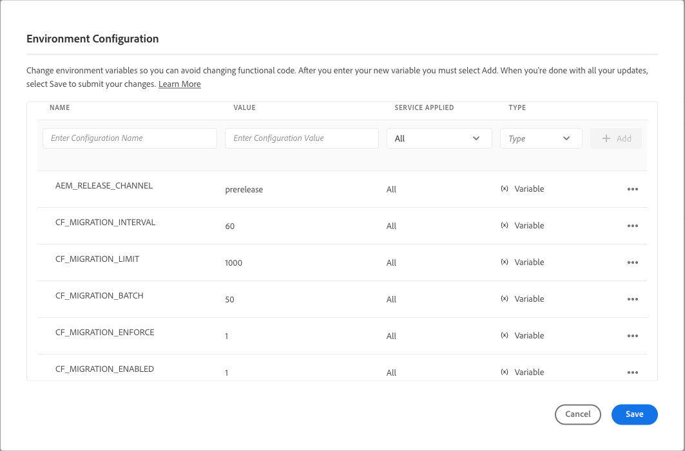

# GraphQLフィルタリングでのページングと並べ替えのためのコンテンツフラグメントの更新 {#updating-content-fragments-for-paging-and-sorting-graphql-filtering}

GraphQLフィルターのパフォーマンスを最適化するには、コンテンツフラグメントを更新する手順を実行する必要があります。

>[!NOTE]
>
>コンテンツフラグメントを更新した後、次の推奨事項に従うことができます。 [GraphQLクエリの最適化](/help/headless/graphql-api/graphql-optimization.md).


## 前提条件 {#prerequisites}

2023.1.0 リリース以上のAEM as a Cloud Serviceがあることを確認します。

## コンテンツフラグメントの更新 {#updating-content-fragments}

この手順を実行するには、次の手順に従います。

1. Cloud Manager UI を使用して、インスタンスに次の変数を設定し、更新を有効にします。

   

   使用可能な変数は次のとおりです。

   <table style="table-layout:auto">
    <tbody>
     <tr>
      <th> </th>
      <th>名前</th>
      <th>値</th>
      <th>デフォルト値</th>
      <th>サービス</th>
      <th>適用済み</th>
      <th>タイプ</th>
      <th>備考</th>
     </tr>
     <tr>
      <td>1</td>
      <td>'AEM_RELEASE_CHANNEL' </td>
      <td>'プレリリース' </td>
      <td> </td>
      <td>すべて </td>
      <td> </td>
      <td>変数 </td>
      <td>この機能を有効にするために必要です。 </td>
     </tr>
     <tr>
      <td>2</td>
      <td>'CF_MIGRATION_ENABLED' </td>
      <td>`1` </td>
      <td>`0` </td>
      <td>すべて </td>
      <td> </td>
      <td>変数 </td>
      <td>有効 (!=0) または無効 (0) になる、コンテンツフラグメント移行ジョブのトリガーです。 </td>
     </tr>
     <tr>
      <td>3</td>
      <td>'CF_MIGRATION_ENFORCE' </td>
      <td>`1` </td>
      <td>`0` </td>
      <td>すべて </td>
      <td> </td>
      <td>変数 </td>
      <td>(!=0) コンテンツフラグメントの再移行。<br>このフラグを 0 に設定すると、CF の増分移行が行われます。 つまり、何らかの理由でジョブが終了した場合、ジョブの次回の実行では、ジョブが終了した時点から移行が開始されます。 最初の移行を適用することをお勧めします（値= 1）。 </td>
     </tr>
     <tr>
      <td>4</td>
      <td>'CF_MIGRATION_BATCH' </td>
      <td>`50` </td>
      <td>`50` </td>
      <td>すべて </td>
      <td> </td>
      <td>変数 </td>
      <td>移行後にコンテンツフラグメント数を保存するためのバッチのサイズ。<br>これは、1 つのバッチでリポジトリに保存される CF の数に関連し、リポジトリへの書き込み数を最適化するために使用できます。 </td>
     </tr>
     <tr>
      <td>5</td>
      <td>'CF_MIGRATION_LIMIT' </td>
      <td>`1000` </td>
      <td>`1000` </td>
      <td>すべて </td>
      <td> </td>
      <td>変数 </td>
      <td>一度に処理するコンテンツフラグメントの最大数。<br>「CF_MIGRATION_INTERVAL」に関する注意事項も参照してください。 </td>
     </tr>
     <tr>
      <td>6</td>
      <td>'CF_MIGRATION_INTERVAL' </td>
      <td>`60` </td>
      <td>`600` </td>
      <td>すべて </td>
      <td> </td>
      <td>変数 </td>
      <td>次の制限までの残りのコンテンツフラグメントの処理間隔（秒）<br>この間隔は、ジョブを開始する前の待機時間と、後続の CF_MIGRATION_LIMIT の各 CF の処理間の遅延とも考えられます。<br>(*)</td>
     </tr>
    </tbody>
   </table>

   >[!NOTE]
   >
   >(*)
   >
   >の値 `CF_MIGRATION_INTERVAL` また、は、移行ジョブの合計実行時間を概算するのに役立ちます。
   >
   >次に例を示します。
   >
   >* コンテンツフラグメントの合計数= 20,000
   >* CF_MIGRATION_LIMIT = 1000
   >* CF_MIGRATION_INTERNAL = 60（秒）
   >* 移行完了に要する概算時間= 60 + (20,000/1000 * 60) = 1260 秒= 21 分
      >  開始時に追加される追加の「60」秒は、ジョブの開始時の初期遅延によるものです。

   >
   >また、これは *最小* ジョブの完了に必要な時間。I/O 時間は含まれません。 実際の所要時間は、この推定値よりも大幅に長くなる場合があります。

1. 更新の進行状況および完了を監視します。

   これをおこなうには、次の場所でオーサーと golden-publish のログを監視します。

   * `com.adobe.cq.dam.cfm.impl.upgrade.UpgradeJob`

      * 作成者ログ例：

         ```shell
         23.01.2023 13:13:45.926 *INFO* [sling-threadpool-09cbdb47-4d99-4c4c-b6d5-781b635ee21b-(apache-sling-job-thread-pool)-1-Content Fragment Upgrade Job Queue Config(cfm/upgrader)] com.adobe.cq.dam.cfm.impl.upgrade.UpgradeJob This instance<dd9ffdc1-0c28-4d04-9a96-5d4d223e457e> is the leader, will schedule the upgrade schedule job.
         ...
         23.01.2023 13:13:45.941 *INFO* [sling-threadpool-09cbdb47-4d99-4c4c-b6d5-781b635ee21b-(apache-sling-job-thread-pool)-1-Content Fragment Upgrade Job Queue Config(cfm/upgrader)] com.adobe.cq.dam.cfm.impl.upgrade.UpgradeJob Scheduling content fragments upgrade from version 0 to 1, slingJobId: 2023/1/23/13/13/50e1a575-4cd7-497b-adf0-62cb5768eedb_0, enforce: true, limit: 1000, batch: 50, interval: 60s
         
         23.01.2023 13:20:40.960 *INFO* [sling-threadpool-09cbdb47-4d99-4c4c-b6d5-781b635ee21b-(apache-sling-job-thread-pool)-1-Content Fragment Upgrade Job Queue Config(cfm/upgrader)] com.adobe.cq.dam.cfm.impl.upgrade.UpgradeJob Finished content fragments upgrade in 6m, slingJobId: 2023/1/23/13/13/50e1a575-4cd7-497b-adf0-62cb5768eedb_0, status: MaintenanceJobStatus{jobState=SUCCEEDED, statusMessage='Upgrade to version '1' succeeded.', errors=[], successCount=3781, failedCount=0, skippedCount=0}
         ```
   * ゴールデンパブリッシュログ；例：

      ```shell
      23.01.2023 12:35:05.150 *INFO* [sling-threadpool-8abcc1bb-cdcb-46d4-8565-942ad8a73209-(apache-sling-job-thread-pool)-1-Content Fragment Upgrade Job Queue Config(cfm/upgrader)] com.adobe.cq.dam.cfm.impl.upgrade.UpgradeJob This instance<ad1b399e-77be-408e-bc3f-57097498fddb> is the leader, will schedule the upgrade schedule job.
      
      23.01.2023 12:35:05.161 *INFO* [sling-threadpool-8abcc1bb-cdcb-46d4-8565-942ad8a73209-(apache-sling-job-thread-pool)-1-Content Fragment Upgrade Job Queue Config(cfm/upgrader)] com.adobe.cq.dam.cfm.impl.upgrade.UpgradeJob Scheduling content fragments upgrade from version 0 to 1, slingJobId: 2023/1/23/12/34/ad1b399e-77be-408e-bc3f-57097498fddb_0, enforce: true, limit: 1000, batch: 50, interval: 60s
      ...
      23.01.2023 12:40:45.180 *INFO* [sling-threadpool-8abcc1bb-cdcb-46d4-8565-942ad8a73209-(apache-sling-job-thread-pool)-1-Content Fragment Upgrade Job Queue Config(cfm/upgrader)] com.adobe.cq.dam.cfm.impl.upgrade.UpgradeJob Finished content fragments upgrade in 5m, slingJobId: 2023/1/23/12/34/ad1b399e-77be-408e-bc3f-57097498fddb_0, status: MaintenanceJobStatus{jobState=SUCCEEDED, statusMessage='Upgrade to version '1' succeeded.', errors=[], successCount=3781, failedCount=0, skippedCount=0}
      ```


1. 更新手順を無効にします。

   >[!IMPORTANT]
   >
   >この手順は、アップグレードを完了するために必要です。

   更新手順を実行した後、クラウド環境変数をリセットします。 `CF_MIGRATION_ENABLED` を「0」に変更して、すべてのポッドのリサイクルをトリガー化します。

   <table>
    <tbody>
     <tr>
      <th> </th>
      <th>名前</th>
      <th>値</th>
      <th>デフォルト値</th>
      <th>サービス</th>
      <th>適用済み</th>
      <th>タイプ</th>
      <th>備考</th>
     </tr>
     <tr>
      <td></td>
      <td>'CF_MIGRATION_ENABLED' </td>
      <td>`0` </td>
      <td>`0` </td>
      <td>すべて </td>
      <td> </td>
      <td>変数 </td>
      <td>無効 (0) ( または有効 (!=0)) コンテンツフラグメント移行ジョブのトリガー。 </td>
     </tr>
    </tbody>
   </table>

   >[!NOTE]
   >
   >コンテンツの更新はゴールデンパブリッシュでのみおこなわれ、ポッドを再利用する場合、通常のパブリッシュポッドはすべてゴールデンパブリッシュに基づいておこなわれるので、パブリッシュ層では特に重要です。

1. 更新手順の完了を確認します。

   Cloud Manager デベロッパーコンソールのリポジトリブラウザーを使用して、更新が正常に完了したことを確認できます。この確認は、コンテンツフラグメントデータを確認するために行います。

   * 最初の移行が完了する前に、 `cfGlobalVersion` プロパティが存在しません。
したがって、JCR ノード上にこのプロパティが存在することがわかります。 `/content/dam` 値を `1`をクリックし、移行の完了を確認します。

   * 個々のコンテンツフラグメントで、次のプロパティも確認できます。

      * `_strucVersion` は `1`
      * `indexedData` 構造が存在する必要があります

      >[!NOTE]
      >
      >この手順では、オーサーインスタンスとパブリッシュインスタンスのコンテンツフラグメントを更新します。
      >
      >したがって、次の項目に対しては、リポジトリブラウザーを使用して検証を実行することをお勧めします。 *少なくとも* 1 人の作者 *および* 1 つのパブリッシュインスタンス。


## 制限事項 {#limitations}

次の制限事項に注意してください。

* GraphQLフィルターのパフォーマンスの最適化は、すべてのコンテンツフラグメントを完全に更新した後にのみ可能です ( `cfGlobalVersion` JCR ノードのプロパティ `/content/dam`)

* コンテンツフラグメントをコンテンツパッケージから読み込む場合 ( `crx/de`) 更新手順の実行後、更新手順が再実行されるまで、これらのコンテンツフラグメントはGraphQLクエリ結果で考慮されません。