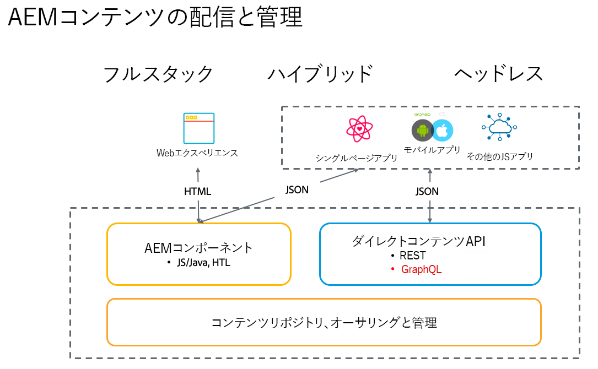

# Adobe Experience Managerヘッドレスの概要  {#introduction-aem-headless}

コンテンツモデル、コンテンツフラグメント、GraphQL API などのAdobe Experience Manager(AEM) の機能を使用して、ヘッドレスエクスペリエンスを大規模に強化する方法を説明します。

## 概要 {#overview}

AEMヘッドレスは、AEM内の構造化コンテンツ（コンテンツフラグメント）を、GraphQL を使用して HTTP 経由で任意のアプリで使用できるようにする、Experience Managerの CMS ソリューションです。 ヘッドレス実装により、複数のプラットフォームやチャネルにわたって、大規模なエクスペリエンスを提供できます。

ヘッドレス実装は、フルスタックおよびハイブリッドソリューションにおける従来のようなページおよびコンポーネント管理ではなく、チャネルに依存しない再利用可能なコンテンツフラグメントの作成とそのクロスチャネル配信に重点を置いています。これは、Web エクスペリエンスを実装するための最新の動的な開発パターンです。

## AEMヘッドレスの機能 {#aem-headless-features}

AEM as a Cloud Serviceは、次の 3 つの強力な機能を提供することで、ヘッドレス実装モデルの柔軟なツールです。

1. **コンテンツモデル**
   * コンテンツモデルはコンテンツの構造化表現です。
   * コンテンツモデルは、情報アーキテクトがAEMコンテンツフラグメントモデルエディターで定義します。
   * コンテンツモデルはコンテンツフラグメントの基盤となります。
1. **コンテンツフラグメント**
   * コンテンツフラグメントは、コンテンツモデルに基づいて作成されます。
   * コンテンツ作成者がAEMコンテンツフラグメントエディターを使用して作成したもの。
   * コンテンツフラグメントはAEM Assetsに保存され、Assets 管理 UI で管理されます。
1. **配信用のコンテンツ API**
   * AEM GraphQL API では、コンテンツフラグメント配信をサポートしています。
   * AEM Assets REST API では、コンテンツフラグメントの CRUD 操作をサポートしています。
   * ダイレクトコンテンツ配信は、 [コンテンツフラグメントコアコンポーネントの JSON 書き出し](https://experienceleague.adobe.com/docs/experience-manager-core-components/using/components/content-fragment-component.html?lang=ja).

## AEM ヘッドレスを使用した最初の手順 {#first-steps}

AEMヘッドレス機能を使い始めるためのリソースがいくつか用意されています。 各ガイドは、様々な使用例やオーディエンス向けにカスタマイズされています。

| リソース | 説明 | タイプ | 対象読者 | 予測時刻 |
|---|---|---|---|---|
| [ヘッドレスデベロッパージャーニー](/help/journey-headless/developer/overview.md) | **AEMを初めて使用する開発者およびヘッドレス** テクノロジーについては、まず、最初のヘッドレスプロジェクトでの運用を開始することによるヘッドレス理論から、AEMとそのヘッドレス機能に関する包括的な紹介をご覧ください。 | ガイド | デベロッパー向け&#x200B;**AEM とヘッドレスを初めて使用するユーザー** | 1 時間 |
| [ヘッドレス設定](/help/headless/setup/introduction.md) | **AEM の経験豊富なユーザー**&#x200B;が主な AEM ヘッドレス機能の概要を知りたい場合は、このクイックスタート概要を確認してください。 | 参照設定 | 開発者、管理者 **AEMエクスペリエンス** | 20 分 |
| [ヘッドレス実践チュートリアル](https://experienceleague.adobe.com/docs/experience-manager-learn/getting-started-with-aem-headless/graphql/multi-step/overview.html?lang=ja) | **実践的なアプローチを好み、AEMに精通している場合**&#x200B;このチュートリアルでは、シンプルなヘッドレスアプリケーションの実装に直接取り組みます。 | チュートリアル | デベロッパー向け | 2 時間 |
| [ヘッドレスアーキテクトジャーニー](/help/journey-headless/architect/overview.md) | **AEMを初めて使用するアーキテクトおよびヘッドレス向け** テクノロジーについては、まず、Adobe Experience Manager as a Cloud Serviceの強力で柔軟なヘッドレス機能の紹介と、プロジェクトのコンテンツをモデル化する方法を参照してください。 | ガイド | アーキテクト | 1 時間 |
| [ヘッドレスオーサリングジャーニー](/help/journey-headless/author/overview.md) | **AEMを初めて使用するビジネスユーザーとヘッドレスユーザー** テクノロジーについては、まず、Adobe Experience Manager as a Cloud Serviceの強力で柔軟なヘッドレス機能の紹介と、プロジェクトのコンテンツをモデル化する方法を参照してください。 | ガイド | コンテンツ作成者 | 1 時間 |
| [ヘッドレス翻訳ジャーニー](/help/journey-headless/translation/overview.md) | それらのために **ヘッドレスへのAEM翻訳アプローチに関心がある**. ヘッドレステクノロジーと、AEMで A から Z の翻訳プロジェクトを作成および更新する方法について説明します。 | ガイド | 翻訳スペシャリスト | 1 時間 |

## ヘッドフルとヘッドレスの比較 {#headful-headless}

このガイドでは、AEMの完全なヘッドレス実装モデルに焦点を当てています。 ただし、AEM でヘッドフルとヘッドレスは二者択一である必要はありません。ヘッドレス機能を使用すると、複数のタッチポイントに対してコンテンツを管理および配信できるほか、コンテンツ作成者が単一ページアプリを編集できるようになります。 すべてが AEM にあります。

>[!TIP]
>
>詳しくは、[AEM におけるヘッドフルとヘッドレス](/help/implementing/developing/headful-headless.md)を参照してください。